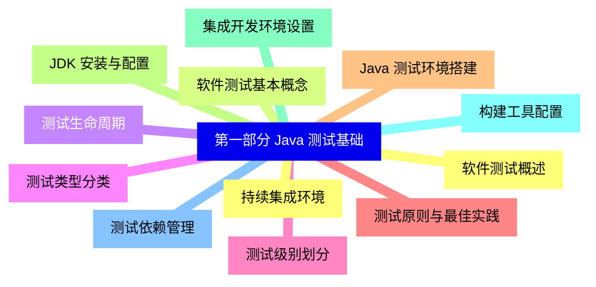
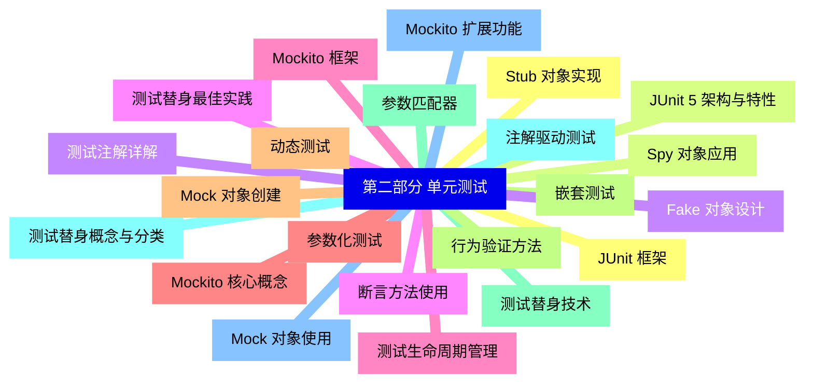
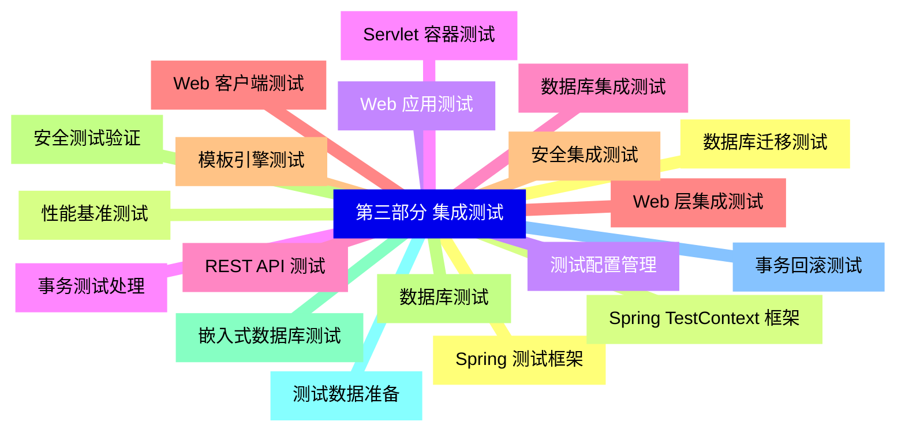
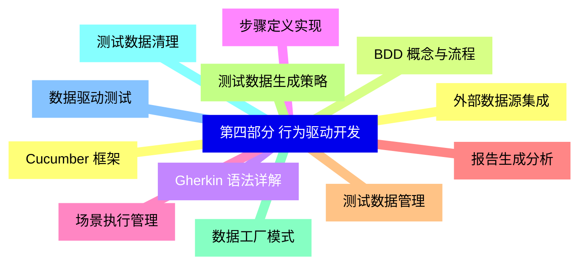
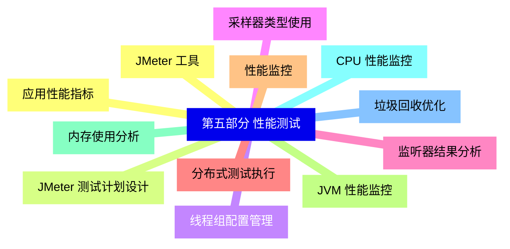
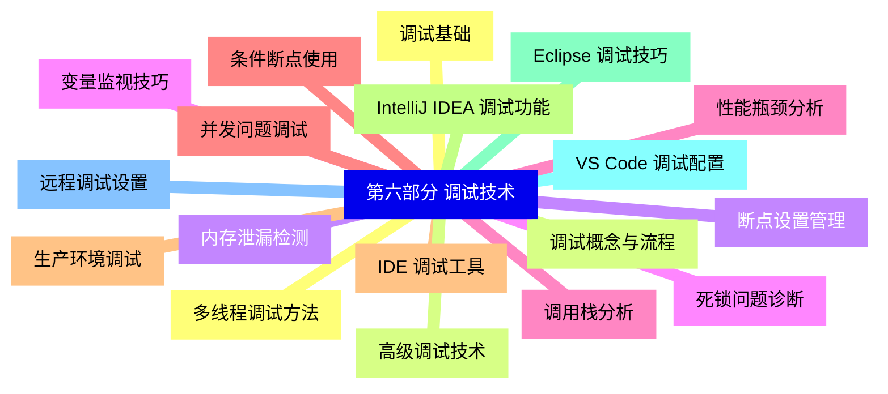
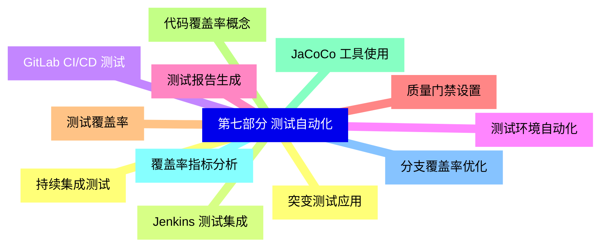
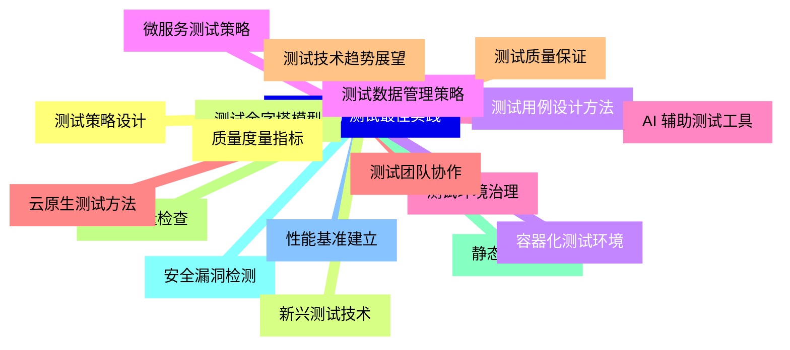


### 1 [第一部分 Java 测试基础](#1)
#### 1.1 [软件测试概述](#1)
#### 1.2 [软件测试基本概念](#1)
#### 1.3 [测试生命周期](#1)
#### 1.4 [测试类型分类](#1)
#### 1.5 [测试级别划分](#1)
#### 1.6 [测试原则与最佳实践](#1)
#### 1.7 [Java 测试环境搭建](#1)
#### 1.8 [JDK 安装与配置](#1)
#### 1.9 [集成开发环境设置](#1)
#### 1.10 [构建工具配置](#1)
#### 1.11 [测试依赖管理](#1)
#### 1.12 [持续集成环境](#1)
### 2 [第二部分 单元测试](#2)
#### 2.1 [JUnit 框架](#2)
#### 2.2 [JUnit 5 架构与特性](#2)
#### 2.3 [测试注解详解](#2)
#### 2.4 [断言方法使用](#2)
#### 2.5 [测试生命周期管理](#2)
#### 2.6 [参数化测试](#2)
#### 2.7 [动态测试](#2)
#### 2.8 [嵌套测试](#2)
#### 2.9 [测试替身技术](#2)
#### 2.10 [测试替身概念与分类](#2)
#### 2.11 [Mock 对象使用](#2)
#### 2.12 [Stub 对象实现](#2)
#### 2.13 [Spy 对象应用](#2)
#### 2.14 [Fake 对象设计](#2)
#### 2.15 [测试替身最佳实践](#2)
#### 2.16 [Mockito 框架](#2)
#### 2.17 [Mockito 核心概念](#2)
#### 2.18 [Mock 对象创建](#2)
#### 2.19 [行为验证方法](#2)
#### 2.20 [参数匹配器](#2)
#### 2.21 [注解驱动测试](#2)
#### 2.22 [Mockito 扩展功能](#2)
### 3 [第三部分 集成测试](#3)
#### 3.1 [Spring 测试框架](#3)
#### 3.2 [Spring TestContext 框架](#3)
#### 3.3 [测试配置管理](#3)
#### 3.4 [事务测试处理](#3)
#### 3.5 [数据库集成测试](#3)
#### 3.6 [Web 层集成测试](#3)
#### 3.7 [安全集成测试](#3)
#### 3.8 [数据库测试](#3)
#### 3.9 [嵌入式数据库测试](#3)
#### 3.10 [测试数据准备](#3)
#### 3.11 [事务回滚测试](#3)
#### 3.12 [数据库迁移测试](#3)
#### 3.13 [性能基准测试](#3)
#### 3.14 [Web 应用测试](#3)
#### 3.15 [Servlet 容器测试](#3)
#### 3.16 [REST API 测试](#3)
#### 3.17 [Web 客户端测试](#3)
#### 3.18 [模板引擎测试](#3)
#### 3.19 [安全测试验证](#3)
### 4 [第四部分 行为驱动开发](#4)
#### 4.1 [Cucumber 框架](#4)
#### 4.2 [BDD 概念与流程](#4)
#### 4.3 [Gherkin 语法详解](#4)
#### 4.4 [步骤定义实现](#4)
#### 4.5 [场景执行管理](#4)
#### 4.6 [报告生成分析](#4)
#### 4.7 [测试数据管理](#4)
#### 4.8 [测试数据生成策略](#4)
#### 4.9 [数据工厂模式](#4)
#### 4.10 [测试数据清理](#4)
#### 4.11 [数据驱动测试](#4)
#### 4.12 [外部数据源集成](#4)
### 5 [第五部分 性能测试](#5)
#### 5.1 [JMeter 工具](#5)
#### 5.2 [JMeter 测试计划设计](#5)
#### 5.3 [线程组配置管理](#5)
#### 5.4 [采样器类型使用](#5)
#### 5.5 [监听器结果分析](#5)
#### 5.6 [分布式测试执行](#5)
#### 5.7 [性能监控](#5)
#### 5.8 [JVM 性能监控](#5)
#### 5.9 [内存使用分析](#5)
#### 5.10 [CPU 性能监控](#5)
#### 5.11 [垃圾回收优化](#5)
#### 5.12 [应用性能指标](#5)
### 6 [第六部分 调试技术](#6)
#### 6.1 [调试基础](#6)
#### 6.2 [调试概念与流程](#6)
#### 6.3 [断点设置管理](#6)
#### 6.4 [变量监视技巧](#6)
#### 6.5 [调用栈分析](#6)
#### 6.6 [条件断点使用](#6)
#### 6.7 [IDE 调试工具](#6)
#### 6.8 [IntelliJ IDEA 调试功能](#6)
#### 6.9 [Eclipse 调试技巧](#6)
#### 6.10 [VS Code 调试配置](#6)
#### 6.11 [远程调试设置](#6)
#### 6.12 [多线程调试方法](#6)
#### 6.13 [高级调试技术](#6)
#### 6.14 [内存泄漏检测](#6)
#### 6.15 [死锁问题诊断](#6)
#### 6.16 [性能瓶颈分析](#6)
#### 6.17 [并发问题调试](#6)
#### 6.18 [生产环境调试](#6)
### 7 [第七部分 测试自动化](#7)
#### 7.1 [持续集成测试](#7)
#### 7.2 [Jenkins 测试集成](#7)
#### 7.3 [GitLab CI/CD 测试](#7)
#### 7.4 [测试环境自动化](#7)
#### 7.5 [测试报告生成](#7)
#### 7.6 [质量门禁设置](#7)
#### 7.7 [测试覆盖率](#7)
#### 7.8 [代码覆盖率概念](#7)
#### 7.9 [JaCoCo 工具使用](#7)
#### 7.10 [覆盖率指标分析](#7)
#### 7.11 [分支覆盖率优化](#7)
#### 7.12 [突变测试应用](#7)
### 8 [第八部分 测试最佳实践](#8)
#### 8.1 [测试策略设计](#8)
#### 8.2 [测试金字塔模型](#8)
#### 8.3 [测试用例设计方法](#8)
#### 8.4 [测试数据管理策略](#8)
#### 8.5 [测试环境治理](#8)
#### 8.6 [测试团队协作](#8)
#### 8.7 [测试质量保证](#8)
#### 8.8 [代码质量检查](#8)
#### 8.9 [静态代码分析](#8)
#### 8.10 [安全漏洞检测](#8)
#### 8.11 [性能基准建立](#8)
#### 8.12 [质量度量指标](#8)
#### 8.13 [新兴测试技术](#8)
#### 8.14 [容器化测试环境](#8)
#### 8.15 [微服务测试策略](#8)
#### 8.16 [AI 辅助测试工具](#8)
#### 8.17 [云原生测试方法](#8)
#### 8.18 [测试技术趋势展望](#8)




### 1 第一部分 Java 测试基础

---
### 1 第一部分 Java 测试基础
___
#### 1.1 软件测试概述
___
#### 1.2 软件测试基本概念
___
#### 1.3 测试生命周期
___
#### 1.4 测试类型分类
___
#### 1.5 测试级别划分
___
#### 1.6 测试原则与最佳实践
___
#### 1.7 Java 测试环境搭建
___
#### 1.8 JDK 安装与配置
___
#### 1.9 集成开发环境设置
___
#### 1.10 构建工具配置
___
#### 1.11 测试依赖管理
___
#### 1.12 持续集成环境
### 2 第二部分 单元测试

---
### 2 第二部分 单元测试
___
#### 2.1 JUnit 框架
___
#### 2.2 JUnit 5 架构与特性
___
#### 2.3 测试注解详解
___
#### 2.4 断言方法使用
___
#### 2.5 测试生命周期管理
___
#### 2.6 参数化测试
___
#### 2.7 动态测试
___
#### 2.8 嵌套测试
___
#### 2.9 测试替身技术
___
#### 2.10 测试替身概念与分类
___
#### 2.11 Mock 对象使用
___
#### 2.12 Stub 对象实现
___
#### 2.13 Spy 对象应用
___
#### 2.14 Fake 对象设计
___
#### 2.15 测试替身最佳实践
___
#### 2.16 Mockito 框架
___
#### 2.17 Mockito 核心概念
___
#### 2.18 Mock 对象创建
___
#### 2.19 行为验证方法
___
#### 2.20 参数匹配器
___
#### 2.21 注解驱动测试
___
#### 2.22 Mockito 扩展功能
### 3 第三部分 集成测试

---
### 3 第三部分 集成测试
___
#### 3.1 Spring 测试框架
___
#### 3.2 Spring TestContext 框架
___
#### 3.3 测试配置管理
___
#### 3.4 事务测试处理
___
#### 3.5 数据库集成测试
___
#### 3.6 Web 层集成测试
___
#### 3.7 安全集成测试
___
#### 3.8 数据库测试
___
#### 3.9 嵌入式数据库测试
___
#### 3.10 测试数据准备
___
#### 3.11 事务回滚测试
___
#### 3.12 数据库迁移测试
___
#### 3.13 性能基准测试
___
#### 3.14 Web 应用测试
___
#### 3.15 Servlet 容器测试
___
#### 3.16 REST API 测试
___
#### 3.17 Web 客户端测试
___
#### 3.18 模板引擎测试
___
#### 3.19 安全测试验证
### 4 第四部分 行为驱动开发

---
### 4 第四部分 行为驱动开发
___
#### 4.1 Cucumber 框架
___
#### 4.2 BDD 概念与流程
___
#### 4.3 Gherkin 语法详解
___
#### 4.4 步骤定义实现
___
#### 4.5 场景执行管理
___
#### 4.6 报告生成分析
___
#### 4.7 测试数据管理
___
#### 4.8 测试数据生成策略
___
#### 4.9 数据工厂模式
___
#### 4.10 测试数据清理
___
#### 4.11 数据驱动测试
___
#### 4.12 外部数据源集成
### 5 第五部分 性能测试

---
### 5 第五部分 性能测试
___
#### 5.1 JMeter 工具
___
#### 5.2 JMeter 测试计划设计
___
#### 5.3 线程组配置管理
___
#### 5.4 采样器类型使用
___
#### 5.5 监听器结果分析
___
#### 5.6 分布式测试执行
___
#### 5.7 性能监控
___
#### 5.8 JVM 性能监控
___
#### 5.9 内存使用分析
___
#### 5.10 CPU 性能监控
___
#### 5.11 垃圾回收优化
___
#### 5.12 应用性能指标
### 6 第六部分 调试技术

---
### 6 第六部分 调试技术
___
#### 6.1 调试基础
___
#### 6.2 调试概念与流程
___
#### 6.3 断点设置管理
___
#### 6.4 变量监视技巧
___
#### 6.5 调用栈分析
___
#### 6.6 条件断点使用
___
#### 6.7 IDE 调试工具
___
#### 6.8 IntelliJ IDEA 调试功能
___
#### 6.9 Eclipse 调试技巧
___
#### 6.10 VS Code 调试配置
___
#### 6.11 远程调试设置
___
#### 6.12 多线程调试方法
___
#### 6.13 高级调试技术
___
#### 6.14 内存泄漏检测
___
#### 6.15 死锁问题诊断
___
#### 6.16 性能瓶颈分析
___
#### 6.17 并发问题调试
___
#### 6.18 生产环境调试
### 7 第七部分 测试自动化

---
### 7 第七部分 测试自动化
___
#### 7.1 持续集成测试
___
#### 7.2 Jenkins 测试集成
___
#### 7.3 GitLab CI/CD 测试
___
#### 7.4 测试环境自动化
___
#### 7.5 测试报告生成
___
#### 7.6 质量门禁设置
___
#### 7.7 测试覆盖率
___
#### 7.8 代码覆盖率概念
___
#### 7.9 JaCoCo 工具使用
___
#### 7.10 覆盖率指标分析
___
#### 7.11 分支覆盖率优化
___
#### 7.12 突变测试应用
### 8 第八部分 测试最佳实践

---
### 8 第八部分 测试最佳实践
___
#### 8.1 测试策略设计
___
#### 8.2 测试金字塔模型
___
#### 8.3 测试用例设计方法
___
#### 8.4 测试数据管理策略
___
#### 8.5 测试环境治理
___
#### 8.6 测试团队协作
___
#### 8.7 测试质量保证
___
#### 8.8 代码质量检查
___
#### 8.9 静态代码分析
___
#### 8.10 安全漏洞检测
___
#### 8.11 性能基准建立
___
#### 8.12 质量度量指标
___
#### 8.13 新兴测试技术
___
#### 8.14 容器化测试环境
___
#### 8.15 微服务测试策略
___
#### 8.16 AI 辅助测试工具
___
#### 8.17 云原生测试方法
___
#### 8.18 测试技术趋势展望


### 1 第一部分 Java 测试基础{#1}

{}

<--->
{}
{}
{}
{}
{}
{}
{}
{}
{}
{}
{}
{}
{}
{}
{}
{}
{}
{}
{}
{}
{}
{}
{}
{}
{}

### 2 第二部分 单元测试{#2}

{}
{}
{}
{}
{}
{}
{}
{}
{}
{}
{}
{}
{}
{}
{}
{}
{}
{}
{}
{}
{}
{}
{}
{}
{}
{}
{}
{}
{}
{}
{}
{}
{}
{}
{}
{}
{}
{}
{}
{}
{}
{}
{}
{}
{}
<--->

{}

### 3 第三部分 集成测试{#3}

{}

<--->
{}
{}
{}
{}
{}
{}
{}
{}
{}
{}
{}
{}
{}
{}
{}
{}
{}
{}
{}
{}
{}
{}
{}
{}
{}
{}
{}
{}
{}
{}
{}
{}
{}
{}
{}
{}
{}
{}
{}

### 4 第四部分 行为驱动开发{#4}

{}
{}
{}
{}
{}
{}
{}
{}
{}
{}
{}
{}
{}
{}
{}
{}
{}
{}
{}
{}
{}
{}
{}
{}
{}
<--->

{}

### 5 第五部分 性能测试{#5}

{}

<--->
{}
{}
{}
{}
{}
{}
{}
{}
{}
{}
{}
{}
{}
{}
{}
{}
{}
{}
{}
{}
{}
{}
{}
{}
{}

### 6 第六部分 调试技术{#6}

{}
{}
{}
{}
{}
{}
{}
{}
{}
{}
{}
{}
{}
{}
{}
{}
{}
{}
{}
{}
{}
{}
{}
{}
{}
{}
{}
{}
{}
{}
{}
{}
{}
{}
{}
{}
{}
<--->

{}

### 7 第七部分 测试自动化{#7}

{}

<--->
{}
{}
{}
{}
{}
{}
{}
{}
{}
{}
{}
{}
{}
{}
{}
{}
{}
{}
{}
{}
{}
{}
{}
{}
{}

### 8 第八部分 测试最佳实践{#8}

{}
{}
{}
{}
{}
{}
{}
{}
{}
{}
{}
{}
{}
{}
{}
{}
{}
{}
{}
{}
{}
{}
{}
{}
{}
{}
{}
{}
{}
{}
{}
{}
{}
{}
{}
{}
{}
<--->

{}
