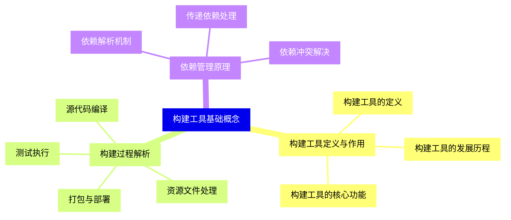
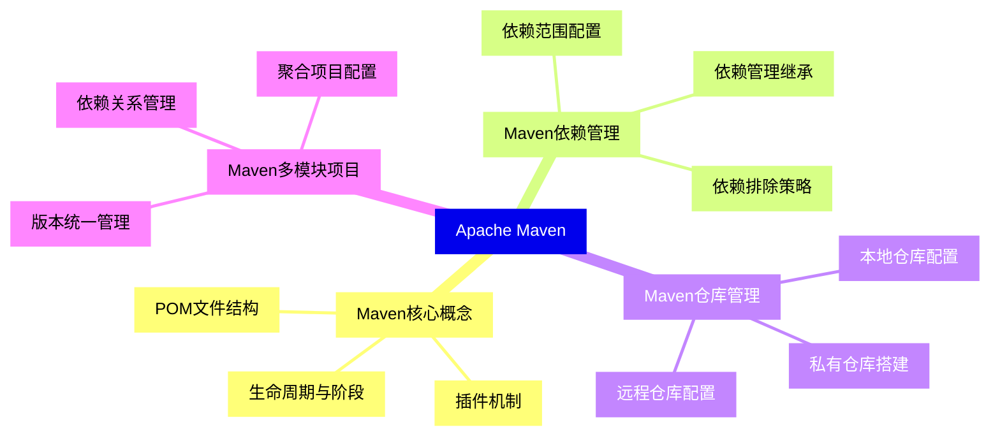
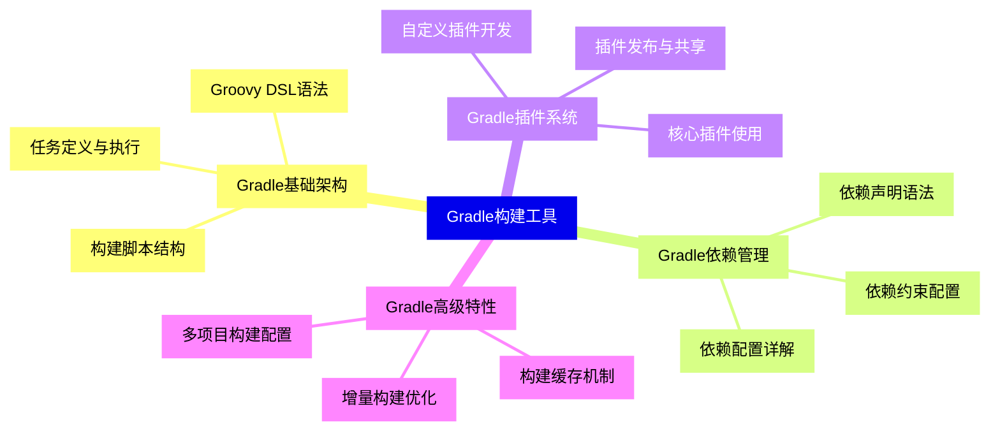
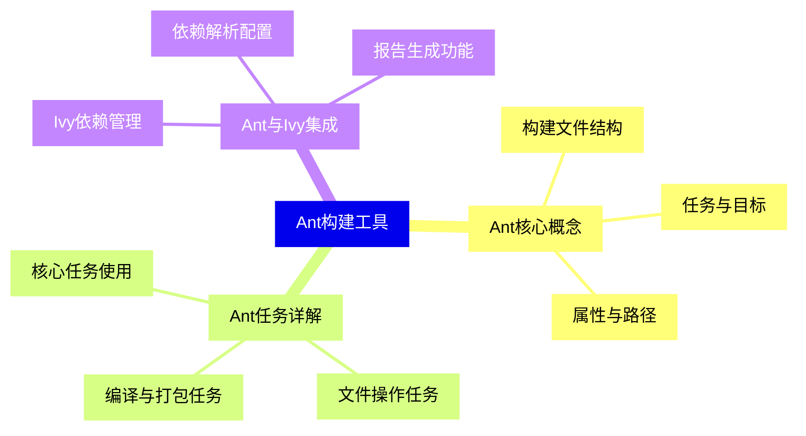
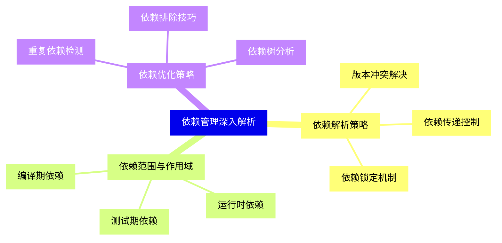
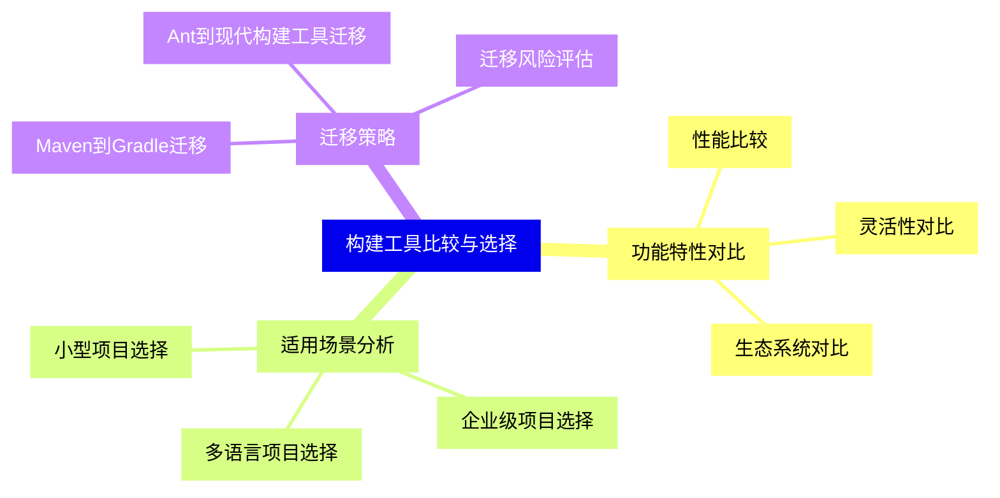
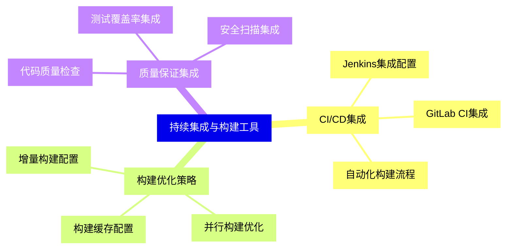
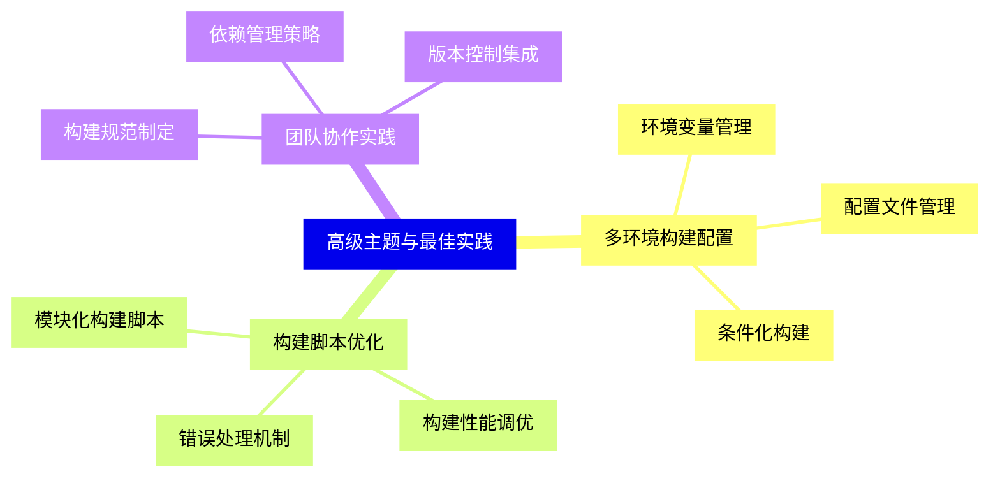


### 1 [构建工具基础概念](#1)
#### 1.1 [构建工具定义与作用](#1)
##### 1.1.1 [构建工具的定义](#1)
##### 1.1.2 [构建工具的核心功能](#1)
##### 1.1.3 [构建工具的发展历程](#1)
#### 1.2 [构建过程解析](#1)
##### 1.2.1 [源代码编译](#1)
##### 1.2.2 [资源文件处理](#1)
##### 1.2.3 [测试执行](#1)
##### 1.2.4 [打包与部署](#1)
#### 1.3 [依赖管理原理](#1)
##### 1.3.1 [依赖解析机制](#1)
##### 1.3.2 [传递依赖处理](#1)
##### 1.3.3 [依赖冲突解决](#1)
### 2 [Apache Maven](#2)
#### 2.1 [Maven核心概念](#2)
##### 2.1.1 [POM文件结构](#2)
##### 2.1.2 [生命周期与阶段](#2)
##### 2.1.3 [插件机制](#2)
#### 2.2 [Maven依赖管理](#2)
##### 2.2.1 [依赖范围配置](#2)
##### 2.2.2 [依赖排除策略](#2)
##### 2.2.3 [依赖管理继承](#2)
#### 2.3 [Maven仓库管理](#2)
##### 2.3.1 [本地仓库配置](#2)
##### 2.3.2 [远程仓库配置](#2)
##### 2.3.3 [私有仓库搭建](#2)
#### 2.4 [Maven多模块项目](#2)
##### 2.4.1 [聚合项目配置](#2)
##### 2.4.2 [依赖关系管理](#2)
##### 2.4.3 [版本统一管理](#2)
### 3 [Gradle构建工具](#3)
#### 3.1 [Gradle基础架构](#3)
##### 3.1.1 [Groovy DSL语法](#3)
##### 3.1.2 [构建脚本结构](#3)
##### 3.1.3 [任务定义与执行](#3)
#### 3.2 [Gradle依赖管理](#3)
##### 3.2.1 [依赖声明语法](#3)
##### 3.2.2 [依赖配置详解](#3)
##### 3.2.3 [依赖约束配置](#3)
#### 3.3 [Gradle插件系统](#3)
##### 3.3.1 [核心插件使用](#3)
##### 3.3.2 [自定义插件开发](#3)
##### 3.3.3 [插件发布与共享](#3)
#### 3.4 [Gradle高级特性](#3)
##### 3.4.1 [增量构建优化](#3)
##### 3.4.2 [构建缓存机制](#3)
##### 3.4.3 [多项目构建配置](#3)
### 4 [Ant构建工具](#4)
#### 4.1 [Ant核心概念](#4)
##### 4.1.1 [构建文件结构](#4)
##### 4.1.2 [任务与目标](#4)
##### 4.1.3 [属性与路径](#4)
#### 4.2 [Ant任务详解](#4)
##### 4.2.1 [核心任务使用](#4)
##### 4.2.2 [文件操作任务](#4)
##### 4.2.3 [编译与打包任务](#4)
#### 4.3 [Ant与Ivy集成](#4)
##### 4.3.1 [Ivy依赖管理](#4)
##### 4.3.2 [依赖解析配置](#4)
##### 4.3.3 [报告生成功能](#4)
### 5 [依赖管理深入解析](#5)
#### 5.1 [依赖解析策略](#5)
##### 5.1.1 [版本冲突解决](#5)
##### 5.1.2 [依赖传递控制](#5)
##### 5.1.3 [依赖锁定机制](#5)
#### 5.2 [依赖范围与作用域](#5)
##### 5.2.1 [编译期依赖](#5)
##### 5.2.2 [运行时依赖](#5)
##### 5.2.3 [测试期依赖](#5)
#### 5.3 [依赖优化策略](#5)
##### 5.3.1 [依赖树分析](#5)
##### 5.3.2 [重复依赖检测](#5)
##### 5.3.3 [依赖排除技巧](#5)
### 6 [构建工具比较与选择](#6)
#### 6.1 [功能特性对比](#6)
##### 6.1.1 [性能比较](#6)
##### 6.1.2 [灵活性对比](#6)
##### 6.1.3 [生态系统对比](#6)
#### 6.2 [适用场景分析](#6)
##### 6.2.1 [小型项目选择](#6)
##### 6.2.2 [企业级项目选择](#6)
##### 6.2.3 [多语言项目选择](#6)
#### 6.3 [迁移策略](#6)
##### 6.3.1 [Maven到Gradle迁移](#6)
##### 6.3.2 [Ant到现代构建工具迁移](#6)
##### 6.3.3 [迁移风险评估](#6)
### 7 [持续集成与构建工具](#7)
#### 7.1 [CI/CD集成](#7)
##### 7.1.1 [Jenkins集成配置](#7)
##### 7.1.2 [GitLab CI集成](#7)
##### 7.1.3 [自动化构建流程](#7)
#### 7.2 [构建优化策略](#7)
##### 7.2.1 [构建缓存配置](#7)
##### 7.2.2 [并行构建优化](#7)
##### 7.2.3 [增量构建配置](#7)
#### 7.3 [质量保证集成](#7)
##### 7.3.1 [代码质量检查](#7)
##### 7.3.2 [测试覆盖率集成](#7)
##### 7.3.3 [安全扫描集成](#7)
### 8 [高级主题与最佳实践](#8)
#### 8.1 [多环境构建配置](#8)
##### 8.1.1 [环境变量管理](#8)
##### 8.1.2 [配置文件管理](#8)
##### 8.1.3 [条件化构建](#8)
#### 8.2 [构建脚本优化](#8)
##### 8.2.1 [模块化构建脚本](#8)
##### 8.2.2 [构建性能调优](#8)
##### 8.2.3 [错误处理机制](#8)
#### 8.3 [团队协作实践](#8)
##### 8.3.1 [构建规范制定](#8)
##### 8.3.2 [依赖管理策略](#8)
##### 8.3.3 [版本控制集成](#8)
### 9 [新兴构建工具](#9)
#### 9.1 [Bazel构建系统](#9)
##### 9.1.1 [核心概念与架构](#9)
##### 9.1.2 [多语言支持特性](#9)
##### 9.1.3 [大规模项目应用](#9)
#### 9.2 [Pants构建工具](#9)
##### 9.2.1 [设计理念与特点](#9)
##### 9.2.2 [与Bazel对比分析](#9)
##### 9.2.3 [适用场景分析](#9)
#### 9.3 [其他新兴工具](#9)
##### 9.3.1 [Buck构建系统](#9)
##### 9.3.2 [云原生构建工具](#9)
##### 9.3.3 [未来发展趋势](#9)




### 1 构建工具基础概念

---
### 1 构建工具基础概念
___
#### 1.1 构建工具定义与作用
___
##### 1.1.1 构建工具的定义
___
##### 1.1.2 构建工具的核心功能
___
##### 1.1.3 构建工具的发展历程
___
#### 1.2 构建过程解析
___
##### 1.2.1 源代码编译
___
##### 1.2.2 资源文件处理
___
##### 1.2.3 测试执行
___
##### 1.2.4 打包与部署
___
#### 1.3 依赖管理原理
___
##### 1.3.1 依赖解析机制
___
##### 1.3.2 传递依赖处理
___
##### 1.3.3 依赖冲突解决
### 2 Apache Maven

---
### 2 Apache Maven
___
#### 2.1 Maven核心概念
___
##### 2.1.1 POM文件结构
___
##### 2.1.2 生命周期与阶段
___
##### 2.1.3 插件机制
___
#### 2.2 Maven依赖管理
___
##### 2.2.1 依赖范围配置
___
##### 2.2.2 依赖排除策略
___
##### 2.2.3 依赖管理继承
___
#### 2.3 Maven仓库管理
___
##### 2.3.1 本地仓库配置
___
##### 2.3.2 远程仓库配置
___
##### 2.3.3 私有仓库搭建
___
#### 2.4 Maven多模块项目
___
##### 2.4.1 聚合项目配置
___
##### 2.4.2 依赖关系管理
___
##### 2.4.3 版本统一管理
### 3 Gradle构建工具

---
### 3 Gradle构建工具
___
#### 3.1 Gradle基础架构
___
##### 3.1.1 Groovy DSL语法
___
##### 3.1.2 构建脚本结构
___
##### 3.1.3 任务定义与执行
___
#### 3.2 Gradle依赖管理
___
##### 3.2.1 依赖声明语法
___
##### 3.2.2 依赖配置详解
___
##### 3.2.3 依赖约束配置
___
#### 3.3 Gradle插件系统
___
##### 3.3.1 核心插件使用
___
##### 3.3.2 自定义插件开发
___
##### 3.3.3 插件发布与共享
___
#### 3.4 Gradle高级特性
___
##### 3.4.1 增量构建优化
___
##### 3.4.2 构建缓存机制
___
##### 3.4.3 多项目构建配置
### 4 Ant构建工具

---
### 4 Ant构建工具
___
#### 4.1 Ant核心概念
___
##### 4.1.1 构建文件结构
___
##### 4.1.2 任务与目标
___
##### 4.1.3 属性与路径
___
#### 4.2 Ant任务详解
___
##### 4.2.1 核心任务使用
___
##### 4.2.2 文件操作任务
___
##### 4.2.3 编译与打包任务
___
#### 4.3 Ant与Ivy集成
___
##### 4.3.1 Ivy依赖管理
___
##### 4.3.2 依赖解析配置
___
##### 4.3.3 报告生成功能
### 5 依赖管理深入解析

---
### 5 依赖管理深入解析
___
#### 5.1 依赖解析策略
___
##### 5.1.1 版本冲突解决
___
##### 5.1.2 依赖传递控制
___
##### 5.1.3 依赖锁定机制
___
#### 5.2 依赖范围与作用域
___
##### 5.2.1 编译期依赖
___
##### 5.2.2 运行时依赖
___
##### 5.2.3 测试期依赖
___
#### 5.3 依赖优化策略
___
##### 5.3.1 依赖树分析
___
##### 5.3.2 重复依赖检测
___
##### 5.3.3 依赖排除技巧
### 6 构建工具比较与选择

---
### 6 构建工具比较与选择
___
#### 6.1 功能特性对比
___
##### 6.1.1 性能比较
___
##### 6.1.2 灵活性对比
___
##### 6.1.3 生态系统对比
___
#### 6.2 适用场景分析
___
##### 6.2.1 小型项目选择
___
##### 6.2.2 企业级项目选择
___
##### 6.2.3 多语言项目选择
___
#### 6.3 迁移策略
___
##### 6.3.1 Maven到Gradle迁移
___
##### 6.3.2 Ant到现代构建工具迁移
___
##### 6.3.3 迁移风险评估
### 7 持续集成与构建工具

---
### 7 持续集成与构建工具
___
#### 7.1 CI/CD集成
___
##### 7.1.1 Jenkins集成配置
___
##### 7.1.2 GitLab CI集成
___
##### 7.1.3 自动化构建流程
___
#### 7.2 构建优化策略
___
##### 7.2.1 构建缓存配置
___
##### 7.2.2 并行构建优化
___
##### 7.2.3 增量构建配置
___
#### 7.3 质量保证集成
___
##### 7.3.1 代码质量检查
___
##### 7.3.2 测试覆盖率集成
___
##### 7.3.3 安全扫描集成
### 8 高级主题与最佳实践

---
### 8 高级主题与最佳实践
___
#### 8.1 多环境构建配置
___
##### 8.1.1 环境变量管理
___
##### 8.1.2 配置文件管理
___
##### 8.1.3 条件化构建
___
#### 8.2 构建脚本优化
___
##### 8.2.1 模块化构建脚本
___
##### 8.2.2 构建性能调优
___
##### 8.2.3 错误处理机制
___
#### 8.3 团队协作实践
___
##### 8.3.1 构建规范制定
___
##### 8.3.2 依赖管理策略
___
##### 8.3.3 版本控制集成
### 9 新兴构建工具

---
### 9 新兴构建工具
___
#### 9.1 Bazel构建系统
___
##### 9.1.1 核心概念与架构
___
##### 9.1.2 多语言支持特性
___
##### 9.1.3 大规模项目应用
___
#### 9.2 Pants构建工具
___
##### 9.2.1 设计理念与特点
___
##### 9.2.2 与Bazel对比分析
___
##### 9.2.3 适用场景分析
___
#### 9.3 其他新兴工具
___
##### 9.3.1 Buck构建系统
___
##### 9.3.2 云原生构建工具
___
##### 9.3.3 未来发展趋势


### 1 构建工具基础概念{#1}

{}

<--->
{}
{}
{}
{}
{}
{}
{}
{}
{}
{}
{}
{}
{}
{}
{}
{}
{}
{}
{}
{}
{}
{}
{}
{}
{}
{}
{}

### 2 Apache Maven{#2}

{}
{}
{}
{}
{}
{}
{}
{}
{}
{}
{}
{}
{}
{}
{}
{}
{}
{}
{}
{}
{}
{}
{}
{}
{}
{}
{}
{}
{}
{}
{}
{}
{}
<--->

{}

### 3 Gradle构建工具{#3}

{}

<--->
{}
{}
{}
{}
{}
{}
{}
{}
{}
{}
{}
{}
{}
{}
{}
{}
{}
{}
{}
{}
{}
{}
{}
{}
{}
{}
{}
{}
{}
{}
{}
{}
{}

### 4 Ant构建工具{#4}

{}
{}
{}
{}
{}
{}
{}
{}
{}
{}
{}
{}
{}
{}
{}
{}
{}
{}
{}
{}
{}
{}
{}
{}
{}
<--->

{}

### 5 依赖管理深入解析{#5}

{}

<--->
{}
{}
{}
{}
{}
{}
{}
{}
{}
{}
{}
{}
{}
{}
{}
{}
{}
{}
{}
{}
{}
{}
{}
{}
{}

### 6 构建工具比较与选择{#6}

{}
{}
{}
{}
{}
{}
{}
{}
{}
{}
{}
{}
{}
{}
{}
{}
{}
{}
{}
{}
{}
{}
{}
{}
{}
<--->

{}

### 7 持续集成与构建工具{#7}

{}

<--->
{}
{}
{}
{}
{}
{}
{}
{}
{}
{}
{}
{}
{}
{}
{}
{}
{}
{}
{}
{}
{}
{}
{}
{}
{}

### 8 高级主题与最佳实践{#8}

{}
{}
{}
{}
{}
{}
{}
{}
{}
{}
{}
{}
{}
{}
{}
{}
{}
{}
{}
{}
{}
{}
{}
{}
{}
<--->

{}

### 9 新兴构建工具{#9}

{}

<--->
{}
{}
{}
{}
{}
{}
{}
{}
{}
{}
{}
{}
{}
{}
{}
{}
{}
{}
{}
{}
{}
{}
{}
{}
{}
