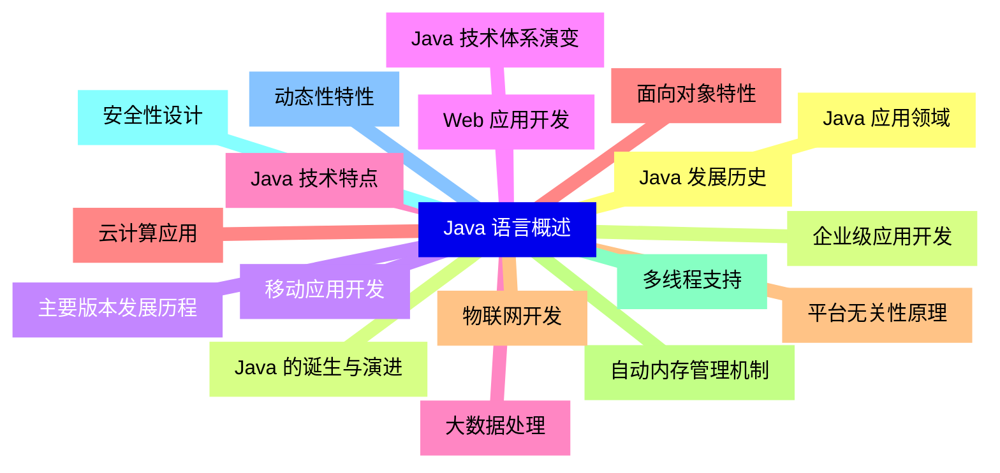
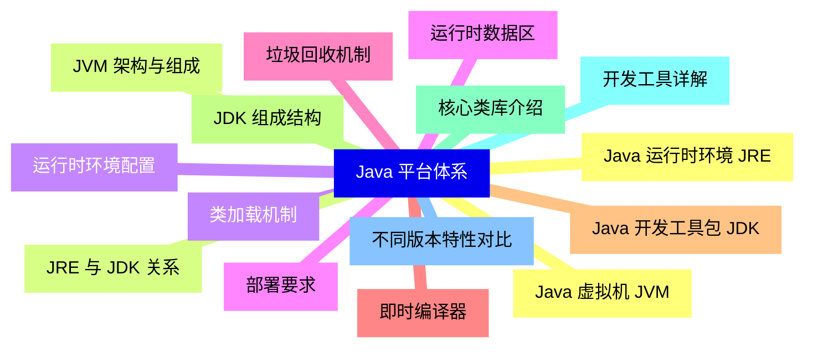
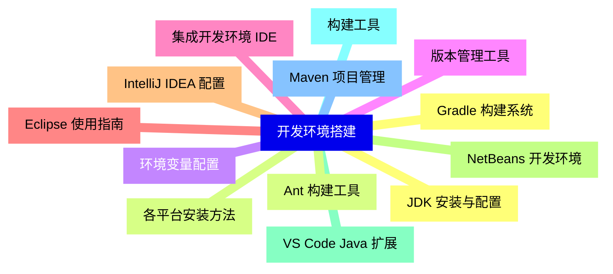
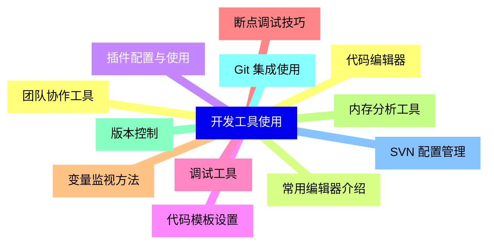
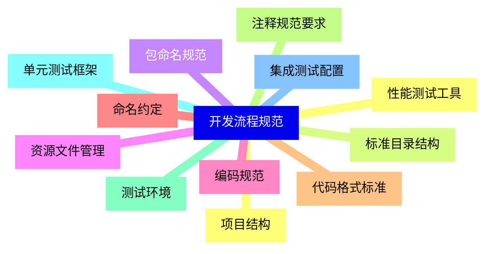
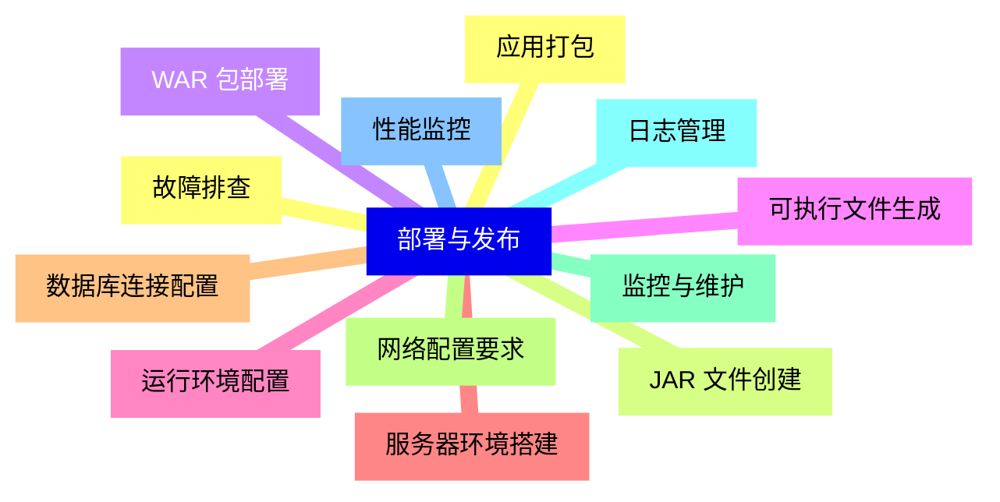
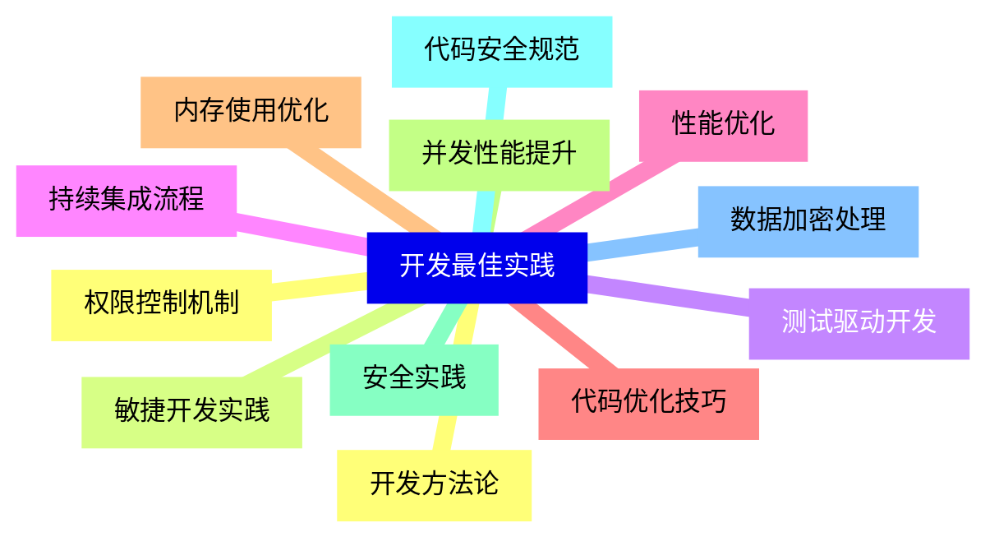


### 1 [Java 语言概述](#1)
#### 1.1 [Java 发展历史](#1)
#### 1.2 [Java 的诞生与演进](#1)
#### 1.3 [主要版本发展历程](#1)
#### 1.4 [Java 技术体系演变](#1)
#### 1.5 [Java 技术特点](#1)
#### 1.6 [面向对象特性](#1)
#### 1.7 [平台无关性原理](#1)
#### 1.8 [自动内存管理机制](#1)
#### 1.9 [多线程支持](#1)
#### 1.10 [安全性设计](#1)
#### 1.11 [动态性特性](#1)
#### 1.12 [Java 应用领域](#1)
#### 1.13 [企业级应用开发](#1)
#### 1.14 [移动应用开发](#1)
#### 1.15 [Web 应用开发](#1)
#### 1.16 [大数据处理](#1)
#### 1.17 [云计算应用](#1)
#### 1.18 [物联网开发](#1)
### 2 [Java 平台体系](#2)
#### 2.1 [Java 虚拟机 JVM](#2)
#### 2.2 [JVM 架构与组成](#2)
#### 2.3 [类加载机制](#2)
#### 2.4 [运行时数据区](#2)
#### 2.5 [垃圾回收机制](#2)
#### 2.6 [即时编译器](#2)
#### 2.7 [Java 开发工具包 JDK](#2)
#### 2.8 [JDK 组成结构](#2)
#### 2.9 [核心类库介绍](#2)
#### 2.10 [开发工具详解](#2)
#### 2.11 [不同版本特性对比](#2)
#### 2.12 [Java 运行时环境 JRE](#2)
#### 2.13 [JRE 与 JDK 关系](#2)
#### 2.14 [运行时环境配置](#2)
#### 2.15 [部署要求](#2)
### 3 [开发环境搭建](#3)
#### 3.1 [JDK 安装与配置](#3)
#### 3.2 [各平台安装方法](#3)
#### 3.3 [环境变量配置](#3)
#### 3.4 [版本管理工具](#3)
#### 3.5 [集成开发环境 IDE](#3)
#### 3.6 [Eclipse 使用指南](#3)
#### 3.7 [IntelliJ IDEA 配置](#3)
#### 3.8 [NetBeans 开发环境](#3)
#### 3.9 [VS Code Java 扩展](#3)
#### 3.10 [构建工具](#3)
#### 3.11 [Maven 项目管理](#3)
#### 3.12 [Gradle 构建系统](#3)
#### 3.13 [Ant 构建工具](#3)
### 4 [开发工具使用](#4)
#### 4.1 [代码编辑器](#4)
#### 4.2 [常用编辑器介绍](#4)
#### 4.3 [插件配置与使用](#4)
#### 4.4 [代码模板设置](#4)
#### 4.5 [调试工具](#4)
#### 4.6 [断点调试技巧](#4)
#### 4.7 [变量监视方法](#4)
#### 4.8 [内存分析工具](#4)
#### 4.9 [版本控制](#4)
#### 4.10 [Git 集成使用](#4)
#### 4.11 [SVN 配置管理](#4)
#### 4.12 [团队协作工具](#4)
### 5 [开发流程规范](#5)
#### 5.1 [项目结构](#5)
#### 5.2 [标准目录结构](#5)
#### 5.3 [包命名规范](#5)
#### 5.4 [资源文件管理](#5)
#### 5.5 [编码规范](#5)
#### 5.6 [命名约定](#5)
#### 5.7 [代码格式标准](#5)
#### 5.8 [注释规范要求](#5)
#### 5.9 [测试环境](#5)
#### 5.10 [单元测试框架](#5)
#### 5.11 [集成测试配置](#5)
#### 5.12 [性能测试工具](#5)
### 6 [部署与发布](#6)
#### 6.1 [应用打包](#6)
#### 6.2 [JAR 文件创建](#6)
#### 6.3 [WAR 包部署](#6)
#### 6.4 [可执行文件生成](#6)
#### 6.5 [运行环境配置](#6)
#### 6.6 [服务器环境搭建](#6)
#### 6.7 [数据库连接配置](#6)
#### 6.8 [网络配置要求](#6)
#### 6.9 [监控与维护](#6)
#### 6.10 [日志管理](#6)
#### 6.11 [性能监控](#6)
#### 6.12 [故障排查](#6)
### 7 [开发最佳实践](#7)
#### 7.1 [开发方法论](#7)
#### 7.2 [敏捷开发实践](#7)
#### 7.3 [测试驱动开发](#7)
#### 7.4 [持续集成流程](#7)
#### 7.5 [性能优化](#7)
#### 7.6 [代码优化技巧](#7)
#### 7.7 [内存使用优化](#7)
#### 7.8 [并发性能提升](#7)
#### 7.9 [安全实践](#7)
#### 7.10 [代码安全规范](#7)
#### 7.11 [数据加密处理](#7)
#### 7.12 [权限控制机制](#7)




### 1 Java 语言概述

---
### 1 Java 语言概述
___
#### 1.1 Java 发展历史
___
#### 1.2 Java 的诞生与演进
___
#### 1.3 主要版本发展历程
___
#### 1.4 Java 技术体系演变
___
#### 1.5 Java 技术特点
___
#### 1.6 面向对象特性
___
#### 1.7 平台无关性原理
___
#### 1.8 自动内存管理机制
___
#### 1.9 多线程支持
___
#### 1.10 安全性设计
___
#### 1.11 动态性特性
___
#### 1.12 Java 应用领域
___
#### 1.13 企业级应用开发
___
#### 1.14 移动应用开发
___
#### 1.15 Web 应用开发
___
#### 1.16 大数据处理
___
#### 1.17 云计算应用
___
#### 1.18 物联网开发
### 2 Java 平台体系

---
### 2 Java 平台体系
___
#### 2.1 Java 虚拟机 JVM
___
#### 2.2 JVM 架构与组成
___
#### 2.3 类加载机制
___
#### 2.4 运行时数据区
___
#### 2.5 垃圾回收机制
___
#### 2.6 即时编译器
___
#### 2.7 Java 开发工具包 JDK
___
#### 2.8 JDK 组成结构
___
#### 2.9 核心类库介绍
___
#### 2.10 开发工具详解
___
#### 2.11 不同版本特性对比
___
#### 2.12 Java 运行时环境 JRE
___
#### 2.13 JRE 与 JDK 关系
___
#### 2.14 运行时环境配置
___
#### 2.15 部署要求
### 3 开发环境搭建

---
### 3 开发环境搭建
___
#### 3.1 JDK 安装与配置
___
#### 3.2 各平台安装方法
___
#### 3.3 环境变量配置
___
#### 3.4 版本管理工具
___
#### 3.5 集成开发环境 IDE
___
#### 3.6 Eclipse 使用指南
___
#### 3.7 IntelliJ IDEA 配置
___
#### 3.8 NetBeans 开发环境
___
#### 3.9 VS Code Java 扩展
___
#### 3.10 构建工具
___
#### 3.11 Maven 项目管理
___
#### 3.12 Gradle 构建系统
___
#### 3.13 Ant 构建工具
### 4 开发工具使用

---
### 4 开发工具使用
___
#### 4.1 代码编辑器
___
#### 4.2 常用编辑器介绍
___
#### 4.3 插件配置与使用
___
#### 4.4 代码模板设置
___
#### 4.5 调试工具
___
#### 4.6 断点调试技巧
___
#### 4.7 变量监视方法
___
#### 4.8 内存分析工具
___
#### 4.9 版本控制
___
#### 4.10 Git 集成使用
___
#### 4.11 SVN 配置管理
___
#### 4.12 团队协作工具
### 5 开发流程规范

---
### 5 开发流程规范
___
#### 5.1 项目结构
___
#### 5.2 标准目录结构
___
#### 5.3 包命名规范
___
#### 5.4 资源文件管理
___
#### 5.5 编码规范
___
#### 5.6 命名约定
___
#### 5.7 代码格式标准
___
#### 5.8 注释规范要求
___
#### 5.9 测试环境
___
#### 5.10 单元测试框架
___
#### 5.11 集成测试配置
___
#### 5.12 性能测试工具
### 6 部署与发布

---
### 6 部署与发布
___
#### 6.1 应用打包
___
#### 6.2 JAR 文件创建
___
#### 6.3 WAR 包部署
___
#### 6.4 可执行文件生成
___
#### 6.5 运行环境配置
___
#### 6.6 服务器环境搭建
___
#### 6.7 数据库连接配置
___
#### 6.8 网络配置要求
___
#### 6.9 监控与维护
___
#### 6.10 日志管理
___
#### 6.11 性能监控
___
#### 6.12 故障排查
### 7 开发最佳实践

---
### 7 开发最佳实践
___
#### 7.1 开发方法论
___
#### 7.2 敏捷开发实践
___
#### 7.3 测试驱动开发
___
#### 7.4 持续集成流程
___
#### 7.5 性能优化
___
#### 7.6 代码优化技巧
___
#### 7.7 内存使用优化
___
#### 7.8 并发性能提升
___
#### 7.9 安全实践
___
#### 7.10 代码安全规范
___
#### 7.11 数据加密处理
___
#### 7.12 权限控制机制


### 1 Java 语言概述{#1}

{}

<--->
{}
{}
{}
{}
{}
{}
{}
{}
{}
{}
{}
{}
{}
{}
{}
{}
{}
{}
{}
{}
{}
{}
{}
{}
{}
{}
{}
{}
{}
{}
{}
{}
{}
{}
{}
{}
{}

### 2 Java 平台体系{#2}

{}
{}
{}
{}
{}
{}
{}
{}
{}
{}
{}
{}
{}
{}
{}
{}
{}
{}
{}
{}
{}
{}
{}
{}
{}
{}
{}
{}
{}
{}
{}
<--->

{}

### 3 开发环境搭建{#3}

{}

<--->
{}
{}
{}
{}
{}
{}
{}
{}
{}
{}
{}
{}
{}
{}
{}
{}
{}
{}
{}
{}
{}
{}
{}
{}
{}
{}
{}

### 4 开发工具使用{#4}

{}
{}
{}
{}
{}
{}
{}
{}
{}
{}
{}
{}
{}
{}
{}
{}
{}
{}
{}
{}
{}
{}
{}
{}
{}
<--->

{}

### 5 开发流程规范{#5}

{}

<--->
{}
{}
{}
{}
{}
{}
{}
{}
{}
{}
{}
{}
{}
{}
{}
{}
{}
{}
{}
{}
{}
{}
{}
{}
{}

### 6 部署与发布{#6}

{}
{}
{}
{}
{}
{}
{}
{}
{}
{}
{}
{}
{}
{}
{}
{}
{}
{}
{}
{}
{}
{}
{}
{}
{}
<--->

{}

### 7 开发最佳实践{#7}

{}

<--->
{}
{}
{}
{}
{}
{}
{}
{}
{}
{}
{}
{}
{}
{}
{}
{}
{}
{}
{}
{}
{}
{}
{}
{}
{}
