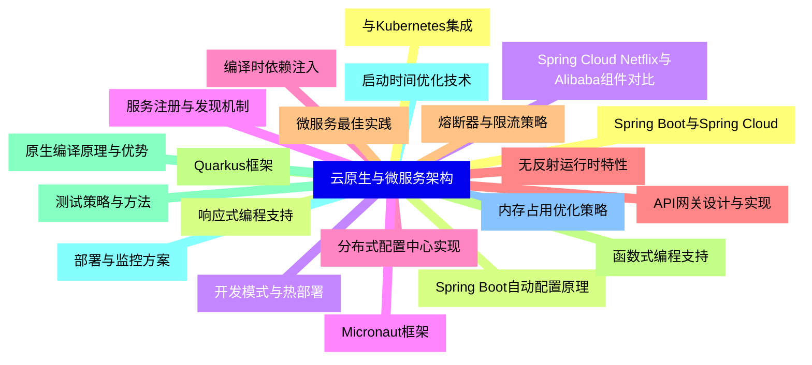
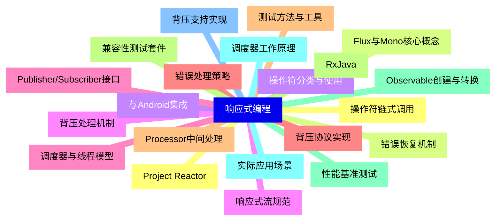
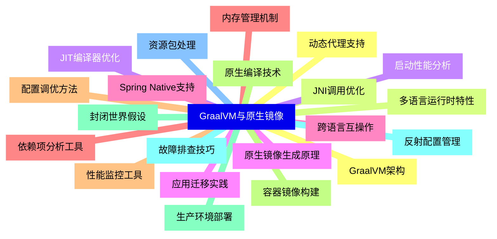
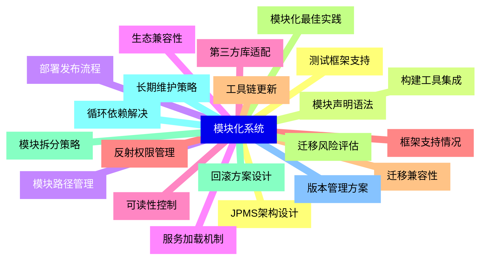
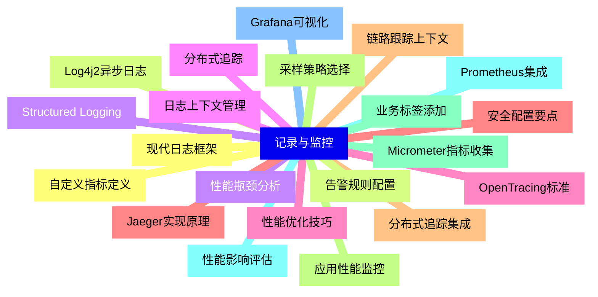
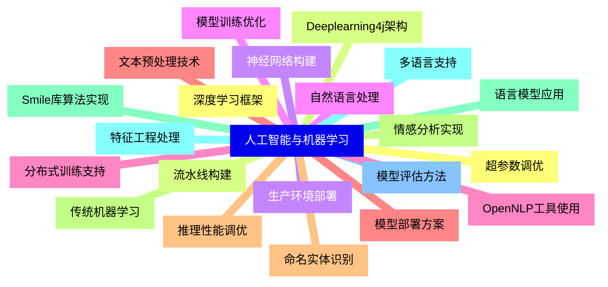
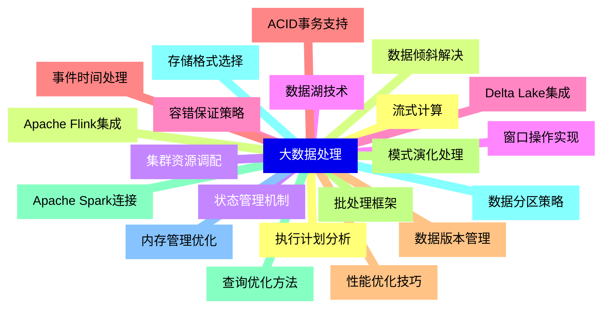
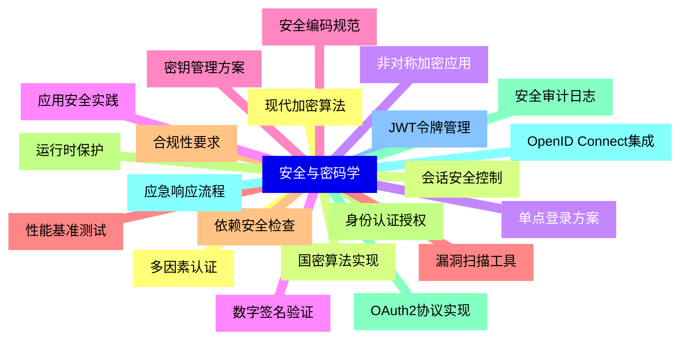
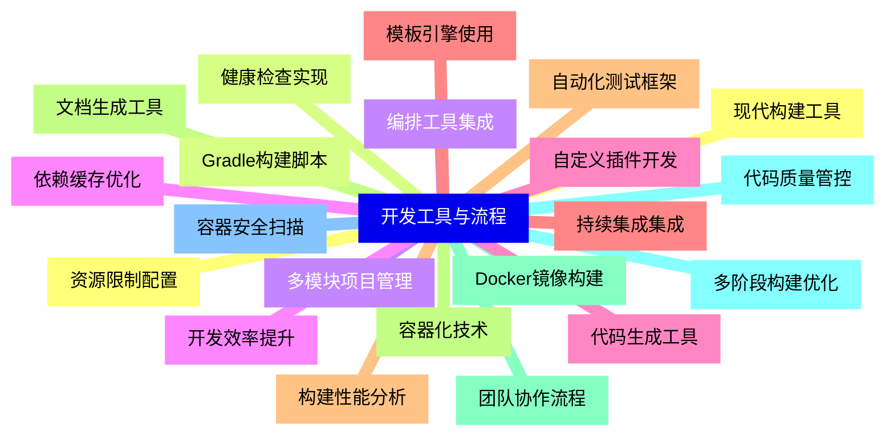
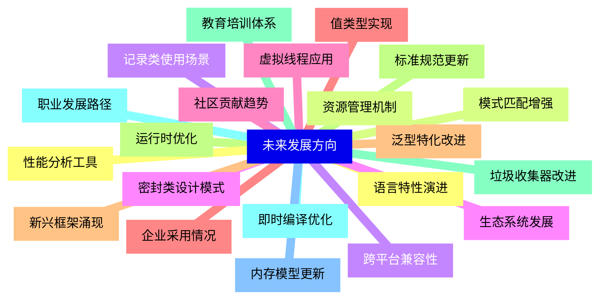


### 1 [云原生与微服务架构](#1)
#### 1.1 [Spring Boot与Spring Cloud](#1)
#### 1.2 [Spring Boot自动配置原理](#1)
#### 1.3 [Spring Cloud Netflix与Alibaba组件对比](#1)
#### 1.4 [服务注册与发现机制](#1)
#### 1.5 [分布式配置中心实现](#1)
#### 1.6 [API网关设计与实现](#1)
#### 1.7 [熔断器与限流策略](#1)
#### 1.8 [Quarkus框架](#1)
#### 1.9 [原生编译原理与优势](#1)
#### 1.10 [启动时间优化技术](#1)
#### 1.11 [内存占用优化策略](#1)
#### 1.12 [与Kubernetes集成](#1)
#### 1.13 [响应式编程支持](#1)
#### 1.14 [开发模式与热部署](#1)
#### 1.15 [Micronaut框架](#1)
#### 1.16 [编译时依赖注入](#1)
#### 1.17 [无反射运行时特性](#1)
#### 1.18 [微服务最佳实践](#1)
#### 1.19 [函数式编程支持](#1)
#### 1.20 [测试策略与方法](#1)
#### 1.21 [部署与监控方案](#1)
### 2 [响应式编程](#2)
#### 2.1 [Project Reactor](#2)
#### 2.2 [Flux与Mono核心概念](#2)
#### 2.3 [操作符分类与使用](#2)
#### 2.4 [背压处理机制](#2)
#### 2.5 [调度器与线程模型](#2)
#### 2.6 [错误处理策略](#2)
#### 2.7 [测试方法与工具](#2)
#### 2.8 [RxJava](#2)
#### 2.9 [Observable创建与转换](#2)
#### 2.10 [调度器工作原理](#2)
#### 2.11 [背压支持实现](#2)
#### 2.12 [操作符链式调用](#2)
#### 2.13 [错误恢复机制](#2)
#### 2.14 [与Android集成](#2)
#### 2.15 [响应式流规范](#2)
#### 2.16 [Publisher/Subscriber接口](#2)
#### 2.17 [背压协议实现](#2)
#### 2.18 [Processor中间处理](#2)
#### 2.19 [兼容性测试套件](#2)
#### 2.20 [性能基准测试](#2)
#### 2.21 [实际应用场景](#2)
### 3 [GraalVM与原生镜像](#3)
#### 3.1 [GraalVM架构](#3)
#### 3.2 [多语言运行时特性](#3)
#### 3.3 [JIT编译器优化](#3)
#### 3.4 [原生镜像生成原理](#3)
#### 3.5 [跨语言互操作](#3)
#### 3.6 [内存管理机制](#3)
#### 3.7 [性能监控工具](#3)
#### 3.8 [原生编译技术](#3)
#### 3.9 [封闭世界假设](#3)
#### 3.10 [反射配置管理](#3)
#### 3.11 [资源包处理](#3)
#### 3.12 [动态代理支持](#3)
#### 3.13 [JNI调用优化](#3)
#### 3.14 [启动性能分析](#3)
#### 3.15 [应用迁移实践](#3)
#### 3.16 [Spring Native支持](#3)
#### 3.17 [依赖项分析工具](#3)
#### 3.18 [配置调优方法](#3)
#### 3.19 [容器镜像构建](#3)
#### 3.20 [生产环境部署](#3)
#### 3.21 [故障排查技巧](#3)
### 4 [模块化系统](#4)
#### 4.1 [JPMS架构设计](#4)
#### 4.2 [模块声明语法](#4)
#### 4.3 [模块路径管理](#4)
#### 4.4 [服务加载机制](#4)
#### 4.5 [可读性控制](#4)
#### 4.6 [反射权限管理](#4)
#### 4.7 [迁移兼容性](#4)
#### 4.8 [模块化最佳实践](#4)
#### 4.9 [模块拆分策略](#4)
#### 4.10 [循环依赖解决](#4)
#### 4.11 [版本管理方案](#4)
#### 4.12 [测试框架支持](#4)
#### 4.13 [构建工具集成](#4)
#### 4.14 [部署发布流程](#4)
#### 4.15 [生态兼容性](#4)
#### 4.16 [第三方库适配](#4)
#### 4.17 [框架支持情况](#4)
#### 4.18 [工具链更新](#4)
#### 4.19 [迁移风险评估](#4)
#### 4.20 [回滚方案设计](#4)
#### 4.21 [长期维护策略](#4)
### 5 [记录与监控](#5)
#### 5.1 [现代日志框架](#5)
#### 5.2 [Log4j2异步日志](#5)
#### 5.3 [Structured Logging](#5)
#### 5.4 [日志上下文管理](#5)
#### 5.5 [性能优化技巧](#5)
#### 5.6 [安全配置要点](#5)
#### 5.7 [分布式追踪集成](#5)
#### 5.8 [应用性能监控](#5)
#### 5.9 [Micrometer指标收集](#5)
#### 5.10 [Prometheus集成](#5)
#### 5.11 [Grafana可视化](#5)
#### 5.12 [自定义指标定义](#5)
#### 5.13 [告警规则配置](#5)
#### 5.14 [性能瓶颈分析](#5)
#### 5.15 [分布式追踪](#5)
#### 5.16 [OpenTracing标准](#5)
#### 5.17 [Jaeger实现原理](#5)
#### 5.18 [链路跟踪上下文](#5)
#### 5.19 [采样策略选择](#5)
#### 5.20 [业务标签添加](#5)
#### 5.21 [性能影响评估](#5)
### 6 [人工智能与机器学习](#6)
#### 6.1 [深度学习框架](#6)
#### 6.2 [Deeplearning4j架构](#6)
#### 6.3 [神经网络构建](#6)
#### 6.4 [模型训练优化](#6)
#### 6.5 [分布式训练支持](#6)
#### 6.6 [模型部署方案](#6)
#### 6.7 [推理性能调优](#6)
#### 6.8 [传统机器学习](#6)
#### 6.9 [Smile库算法实现](#6)
#### 6.10 [特征工程处理](#6)
#### 6.11 [模型评估方法](#6)
#### 6.12 [超参数调优](#6)
#### 6.13 [流水线构建](#6)
#### 6.14 [生产环境部署](#6)
#### 6.15 [自然语言处理](#6)
#### 6.16 [OpenNLP工具使用](#6)
#### 6.17 [文本预处理技术](#6)
#### 6.18 [命名实体识别](#6)
#### 6.19 [情感分析实现](#6)
#### 6.20 [语言模型应用](#6)
#### 6.21 [多语言支持](#6)
### 7 [大数据处理](#7)
#### 7.1 [流式计算](#7)
#### 7.2 [Apache Flink集成](#7)
#### 7.3 [状态管理机制](#7)
#### 7.4 [窗口操作实现](#7)
#### 7.5 [容错保证策略](#7)
#### 7.6 [事件时间处理](#7)
#### 7.7 [性能优化技巧](#7)
#### 7.8 [批处理框架](#7)
#### 7.9 [Apache Spark连接](#7)
#### 7.10 [数据分区策略](#7)
#### 7.11 [内存管理优化](#7)
#### 7.12 [执行计划分析](#7)
#### 7.13 [数据倾斜解决](#7)
#### 7.14 [集群资源调配](#7)
#### 7.15 [数据湖技术](#7)
#### 7.16 [Delta Lake集成](#7)
#### 7.17 [ACID事务支持](#7)
#### 7.18 [数据版本管理](#7)
#### 7.19 [模式演化处理](#7)
#### 7.20 [查询优化方法](#7)
#### 7.21 [存储格式选择](#7)
### 8 [安全与密码学](#8)
#### 8.1 [现代加密算法](#8)
#### 8.2 [国密算法实现](#8)
#### 8.3 [非对称加密应用](#8)
#### 8.4 [数字签名验证](#8)
#### 8.5 [密钥管理方案](#8)
#### 8.6 [性能基准测试](#8)
#### 8.7 [合规性要求](#8)
#### 8.8 [身份认证授权](#8)
#### 8.9 [OAuth2协议实现](#8)
#### 8.10 [OpenID Connect集成](#8)
#### 8.11 [JWT令牌管理](#8)
#### 8.12 [多因素认证](#8)
#### 8.13 [会话安全控制](#8)
#### 8.14 [单点登录方案](#8)
#### 8.15 [应用安全实践](#8)
#### 8.16 [安全编码规范](#8)
#### 8.17 [漏洞扫描工具](#8)
#### 8.18 [依赖安全检查](#8)
#### 8.19 [运行时保护](#8)
#### 8.20 [安全审计日志](#8)
#### 8.21 [应急响应流程](#8)
### 9 [开发工具与流程](#9)
#### 9.1 [现代构建工具](#9)
#### 9.2 [Gradle构建脚本](#9)
#### 9.3 [多模块项目管理](#9)
#### 9.4 [依赖缓存优化](#9)
#### 9.5 [自定义插件开发](#9)
#### 9.6 [持续集成集成](#9)
#### 9.7 [构建性能分析](#9)
#### 9.8 [容器化技术](#9)
#### 9.9 [Docker镜像构建](#9)
#### 9.10 [多阶段构建优化](#9)
#### 9.11 [容器安全扫描](#9)
#### 9.12 [资源限制配置](#9)
#### 9.13 [健康检查实现](#9)
#### 9.14 [编排工具集成](#9)
#### 9.15 [开发效率提升](#9)
#### 9.16 [代码生成工具](#9)
#### 9.17 [模板引擎使用](#9)
#### 9.18 [自动化测试框架](#9)
#### 9.19 [文档生成工具](#9)
#### 9.20 [团队协作流程](#9)
#### 9.21 [代码质量管控](#9)
### 10 [未来发展方向](#10)
#### 10.1 [语言特性演进](#10)
#### 10.2 [模式匹配增强](#10)
#### 10.3 [记录类使用场景](#10)
#### 10.4 [密封类设计模式](#10)
#### 10.5 [虚拟线程应用](#10)
#### 10.6 [值类型实现](#10)
#### 10.7 [泛型特化改进](#10)
#### 10.8 [运行时优化](#10)
#### 10.9 [垃圾收集器改进](#10)
#### 10.10 [即时编译优化](#10)
#### 10.11 [内存模型更新](#10)
#### 10.12 [性能分析工具](#10)
#### 10.13 [资源管理机制](#10)
#### 10.14 [跨平台兼容性](#10)
#### 10.15 [生态系统发展](#10)
#### 10.16 [社区贡献趋势](#10)
#### 10.17 [企业采用情况](#10)
#### 10.18 [新兴框架涌现](#10)
#### 10.19 [标准规范更新](#10)
#### 10.20 [教育培训体系](#10)
#### 10.21 [职业发展路径](#10)




### 1 云原生与微服务架构

---
### 1 云原生与微服务架构
___
#### 1.1 Spring Boot与Spring Cloud
___
#### 1.2 Spring Boot自动配置原理
___
#### 1.3 Spring Cloud Netflix与Alibaba组件对比
___
#### 1.4 服务注册与发现机制
___
#### 1.5 分布式配置中心实现
___
#### 1.6 API网关设计与实现
___
#### 1.7 熔断器与限流策略
___
#### 1.8 Quarkus框架
___
#### 1.9 原生编译原理与优势
___
#### 1.10 启动时间优化技术
___
#### 1.11 内存占用优化策略
___
#### 1.12 与Kubernetes集成
___
#### 1.13 响应式编程支持
___
#### 1.14 开发模式与热部署
___
#### 1.15 Micronaut框架
___
#### 1.16 编译时依赖注入
___
#### 1.17 无反射运行时特性
___
#### 1.18 微服务最佳实践
___
#### 1.19 函数式编程支持
___
#### 1.20 测试策略与方法
___
#### 1.21 部署与监控方案
### 2 响应式编程

---
### 2 响应式编程
___
#### 2.1 Project Reactor
___
#### 2.2 Flux与Mono核心概念
___
#### 2.3 操作符分类与使用
___
#### 2.4 背压处理机制
___
#### 2.5 调度器与线程模型
___
#### 2.6 错误处理策略
___
#### 2.7 测试方法与工具
___
#### 2.8 RxJava
___
#### 2.9 Observable创建与转换
___
#### 2.10 调度器工作原理
___
#### 2.11 背压支持实现
___
#### 2.12 操作符链式调用
___
#### 2.13 错误恢复机制
___
#### 2.14 与Android集成
___
#### 2.15 响应式流规范
___
#### 2.16 Publisher/Subscriber接口
___
#### 2.17 背压协议实现
___
#### 2.18 Processor中间处理
___
#### 2.19 兼容性测试套件
___
#### 2.20 性能基准测试
___
#### 2.21 实际应用场景
### 3 GraalVM与原生镜像

---
### 3 GraalVM与原生镜像
___
#### 3.1 GraalVM架构
___
#### 3.2 多语言运行时特性
___
#### 3.3 JIT编译器优化
___
#### 3.4 原生镜像生成原理
___
#### 3.5 跨语言互操作
___
#### 3.6 内存管理机制
___
#### 3.7 性能监控工具
___
#### 3.8 原生编译技术
___
#### 3.9 封闭世界假设
___
#### 3.10 反射配置管理
___
#### 3.11 资源包处理
___
#### 3.12 动态代理支持
___
#### 3.13 JNI调用优化
___
#### 3.14 启动性能分析
___
#### 3.15 应用迁移实践
___
#### 3.16 Spring Native支持
___
#### 3.17 依赖项分析工具
___
#### 3.18 配置调优方法
___
#### 3.19 容器镜像构建
___
#### 3.20 生产环境部署
___
#### 3.21 故障排查技巧
### 4 模块化系统

---
### 4 模块化系统
___
#### 4.1 JPMS架构设计
___
#### 4.2 模块声明语法
___
#### 4.3 模块路径管理
___
#### 4.4 服务加载机制
___
#### 4.5 可读性控制
___
#### 4.6 反射权限管理
___
#### 4.7 迁移兼容性
___
#### 4.8 模块化最佳实践
___
#### 4.9 模块拆分策略
___
#### 4.10 循环依赖解决
___
#### 4.11 版本管理方案
___
#### 4.12 测试框架支持
___
#### 4.13 构建工具集成
___
#### 4.14 部署发布流程
___
#### 4.15 生态兼容性
___
#### 4.16 第三方库适配
___
#### 4.17 框架支持情况
___
#### 4.18 工具链更新
___
#### 4.19 迁移风险评估
___
#### 4.20 回滚方案设计
___
#### 4.21 长期维护策略
### 5 记录与监控

---
### 5 记录与监控
___
#### 5.1 现代日志框架
___
#### 5.2 Log4j2异步日志
___
#### 5.3 Structured Logging
___
#### 5.4 日志上下文管理
___
#### 5.5 性能优化技巧
___
#### 5.6 安全配置要点
___
#### 5.7 分布式追踪集成
___
#### 5.8 应用性能监控
___
#### 5.9 Micrometer指标收集
___
#### 5.10 Prometheus集成
___
#### 5.11 Grafana可视化
___
#### 5.12 自定义指标定义
___
#### 5.13 告警规则配置
___
#### 5.14 性能瓶颈分析
___
#### 5.15 分布式追踪
___
#### 5.16 OpenTracing标准
___
#### 5.17 Jaeger实现原理
___
#### 5.18 链路跟踪上下文
___
#### 5.19 采样策略选择
___
#### 5.20 业务标签添加
___
#### 5.21 性能影响评估
### 6 人工智能与机器学习

---
### 6 人工智能与机器学习
___
#### 6.1 深度学习框架
___
#### 6.2 Deeplearning4j架构
___
#### 6.3 神经网络构建
___
#### 6.4 模型训练优化
___
#### 6.5 分布式训练支持
___
#### 6.6 模型部署方案
___
#### 6.7 推理性能调优
___
#### 6.8 传统机器学习
___
#### 6.9 Smile库算法实现
___
#### 6.10 特征工程处理
___
#### 6.11 模型评估方法
___
#### 6.12 超参数调优
___
#### 6.13 流水线构建
___
#### 6.14 生产环境部署
___
#### 6.15 自然语言处理
___
#### 6.16 OpenNLP工具使用
___
#### 6.17 文本预处理技术
___
#### 6.18 命名实体识别
___
#### 6.19 情感分析实现
___
#### 6.20 语言模型应用
___
#### 6.21 多语言支持
### 7 大数据处理

---
### 7 大数据处理
___
#### 7.1 流式计算
___
#### 7.2 Apache Flink集成
___
#### 7.3 状态管理机制
___
#### 7.4 窗口操作实现
___
#### 7.5 容错保证策略
___
#### 7.6 事件时间处理
___
#### 7.7 性能优化技巧
___
#### 7.8 批处理框架
___
#### 7.9 Apache Spark连接
___
#### 7.10 数据分区策略
___
#### 7.11 内存管理优化
___
#### 7.12 执行计划分析
___
#### 7.13 数据倾斜解决
___
#### 7.14 集群资源调配
___
#### 7.15 数据湖技术
___
#### 7.16 Delta Lake集成
___
#### 7.17 ACID事务支持
___
#### 7.18 数据版本管理
___
#### 7.19 模式演化处理
___
#### 7.20 查询优化方法
___
#### 7.21 存储格式选择
### 8 安全与密码学

---
### 8 安全与密码学
___
#### 8.1 现代加密算法
___
#### 8.2 国密算法实现
___
#### 8.3 非对称加密应用
___
#### 8.4 数字签名验证
___
#### 8.5 密钥管理方案
___
#### 8.6 性能基准测试
___
#### 8.7 合规性要求
___
#### 8.8 身份认证授权
___
#### 8.9 OAuth2协议实现
___
#### 8.10 OpenID Connect集成
___
#### 8.11 JWT令牌管理
___
#### 8.12 多因素认证
___
#### 8.13 会话安全控制
___
#### 8.14 单点登录方案
___
#### 8.15 应用安全实践
___
#### 8.16 安全编码规范
___
#### 8.17 漏洞扫描工具
___
#### 8.18 依赖安全检查
___
#### 8.19 运行时保护
___
#### 8.20 安全审计日志
___
#### 8.21 应急响应流程
### 9 开发工具与流程

---
### 9 开发工具与流程
___
#### 9.1 现代构建工具
___
#### 9.2 Gradle构建脚本
___
#### 9.3 多模块项目管理
___
#### 9.4 依赖缓存优化
___
#### 9.5 自定义插件开发
___
#### 9.6 持续集成集成
___
#### 9.7 构建性能分析
___
#### 9.8 容器化技术
___
#### 9.9 Docker镜像构建
___
#### 9.10 多阶段构建优化
___
#### 9.11 容器安全扫描
___
#### 9.12 资源限制配置
___
#### 9.13 健康检查实现
___
#### 9.14 编排工具集成
___
#### 9.15 开发效率提升
___
#### 9.16 代码生成工具
___
#### 9.17 模板引擎使用
___
#### 9.18 自动化测试框架
___
#### 9.19 文档生成工具
___
#### 9.20 团队协作流程
___
#### 9.21 代码质量管控
### 10 未来发展方向

---
### 10 未来发展方向
___
#### 10.1 语言特性演进
___
#### 10.2 模式匹配增强
___
#### 10.3 记录类使用场景
___
#### 10.4 密封类设计模式
___
#### 10.5 虚拟线程应用
___
#### 10.6 值类型实现
___
#### 10.7 泛型特化改进
___
#### 10.8 运行时优化
___
#### 10.9 垃圾收集器改进
___
#### 10.10 即时编译优化
___
#### 10.11 内存模型更新
___
#### 10.12 性能分析工具
___
#### 10.13 资源管理机制
___
#### 10.14 跨平台兼容性
___
#### 10.15 生态系统发展
___
#### 10.16 社区贡献趋势
___
#### 10.17 企业采用情况
___
#### 10.18 新兴框架涌现
___
#### 10.19 标准规范更新
___
#### 10.20 教育培训体系
___
#### 10.21 职业发展路径


### 1 云原生与微服务架构{#1}

{}

<--->
{}
{}
{}
{}
{}
{}
{}
{}
{}
{}
{}
{}
{}
{}
{}
{}
{}
{}
{}
{}
{}
{}
{}
{}
{}
{}
{}
{}
{}
{}
{}
{}
{}
{}
{}
{}
{}
{}
{}
{}
{}
{}
{}

### 2 响应式编程{#2}

{}
{}
{}
{}
{}
{}
{}
{}
{}
{}
{}
{}
{}
{}
{}
{}
{}
{}
{}
{}
{}
{}
{}
{}
{}
{}
{}
{}
{}
{}
{}
{}
{}
{}
{}
{}
{}
{}
{}
{}
{}
{}
{}
<--->

{}

### 3 GraalVM与原生镜像{#3}

{}

<--->
{}
{}
{}
{}
{}
{}
{}
{}
{}
{}
{}
{}
{}
{}
{}
{}
{}
{}
{}
{}
{}
{}
{}
{}
{}
{}
{}
{}
{}
{}
{}
{}
{}
{}
{}
{}
{}
{}
{}
{}
{}
{}
{}

### 4 模块化系统{#4}

{}
{}
{}
{}
{}
{}
{}
{}
{}
{}
{}
{}
{}
{}
{}
{}
{}
{}
{}
{}
{}
{}
{}
{}
{}
{}
{}
{}
{}
{}
{}
{}
{}
{}
{}
{}
{}
{}
{}
{}
{}
{}
{}
<--->

{}

### 5 记录与监控{#5}

{}

<--->
{}
{}
{}
{}
{}
{}
{}
{}
{}
{}
{}
{}
{}
{}
{}
{}
{}
{}
{}
{}
{}
{}
{}
{}
{}
{}
{}
{}
{}
{}
{}
{}
{}
{}
{}
{}
{}
{}
{}
{}
{}
{}
{}

### 6 人工智能与机器学习{#6}

{}
{}
{}
{}
{}
{}
{}
{}
{}
{}
{}
{}
{}
{}
{}
{}
{}
{}
{}
{}
{}
{}
{}
{}
{}
{}
{}
{}
{}
{}
{}
{}
{}
{}
{}
{}
{}
{}
{}
{}
{}
{}
{}
<--->

{}

### 7 大数据处理{#7}

{}

<--->
{}
{}
{}
{}
{}
{}
{}
{}
{}
{}
{}
{}
{}
{}
{}
{}
{}
{}
{}
{}
{}
{}
{}
{}
{}
{}
{}
{}
{}
{}
{}
{}
{}
{}
{}
{}
{}
{}
{}
{}
{}
{}
{}

### 8 安全与密码学{#8}

{}
{}
{}
{}
{}
{}
{}
{}
{}
{}
{}
{}
{}
{}
{}
{}
{}
{}
{}
{}
{}
{}
{}
{}
{}
{}
{}
{}
{}
{}
{}
{}
{}
{}
{}
{}
{}
{}
{}
{}
{}
{}
{}
<--->

{}

### 9 开发工具与流程{#9}

{}

<--->
{}
{}
{}
{}
{}
{}
{}
{}
{}
{}
{}
{}
{}
{}
{}
{}
{}
{}
{}
{}
{}
{}
{}
{}
{}
{}
{}
{}
{}
{}
{}
{}
{}
{}
{}
{}
{}
{}
{}
{}
{}
{}
{}

### 10 未来发展方向{#10}

{}
{}
{}
{}
{}
{}
{}
{}
{}
{}
{}
{}
{}
{}
{}
{}
{}
{}
{}
{}
{}
{}
{}
{}
{}
{}
{}
{}
{}
{}
{}
{}
{}
{}
{}
{}
{}
{}
{}
{}
{}
{}
{}
<--->

{}
