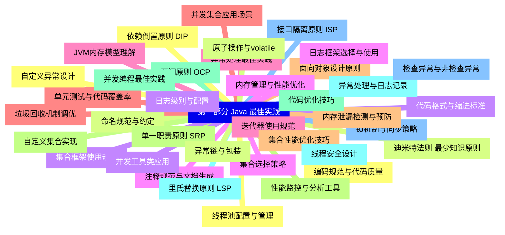
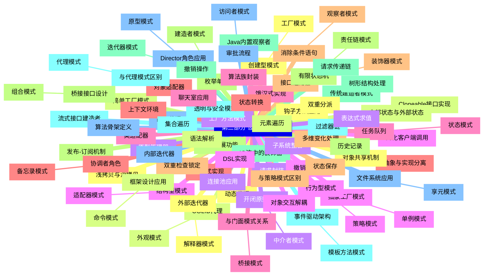
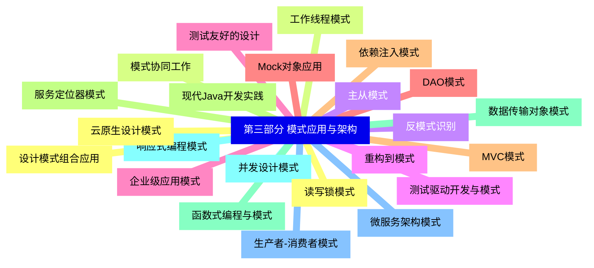


### 1 [第一部分 Java 最佳实践](#1)
#### 1.1 [编码规范与代码质量](#1)
#### 1.2 [命名规范与约定](#1)
#### 1.3 [代码格式与缩进标准](#1)
#### 1.4 [注释规范与文档生成](#1)
#### 1.5 [异常处理最佳实践](#1)
#### 1.6 [单元测试与代码覆盖率](#1)
#### 1.7 [面向对象设计原则](#1)
#### 1.8 [单一职责原则 SRP](#1)
#### 1.9 [开闭原则 OCP](#1)
#### 1.10 [里氏替换原则 LSP](#1)
#### 1.11 [接口隔离原则 ISP](#1)
#### 1.12 [依赖倒置原则 DIP](#1)
#### 1.13 [迪米特法则 最少知识原则](#1)
#### 1.14 [集合框架使用规范](#1)
#### 1.15 [集合选择策略](#1)
#### 1.16 [迭代器使用规范](#1)
#### 1.17 [并发集合应用场景](#1)
#### 1.18 [集合性能优化技巧](#1)
#### 1.19 [自定义集合实现](#1)
#### 1.20 [并发编程最佳实践](#1)
#### 1.21 [线程安全设计](#1)
#### 1.22 [锁机制与同步策略](#1)
#### 1.23 [线程池配置与管理](#1)
#### 1.24 [原子操作与volatile](#1)
#### 1.25 [并发工具类应用](#1)
#### 1.26 [内存管理与性能优化](#1)
#### 1.27 [JVM内存模型理解](#1)
#### 1.28 [垃圾回收机制调优](#1)
#### 1.29 [内存泄漏检测与预防](#1)
#### 1.30 [性能监控与分析工具](#1)
#### 1.31 [代码优化技巧](#1)
#### 1.32 [异常处理与日志记录](#1)
#### 1.33 [检查异常与非检查异常](#1)
#### 1.34 [自定义异常设计](#1)
#### 1.35 [异常链与包装](#1)
#### 1.36 [日志级别与配置](#1)
#### 1.37 [日志框架选择与使用](#1)
### 2 [第二部分 设计模式详解](#2)
#### 2.1 [创建型模式](#2)
##### 2.1.1 [工厂模式](#2)
#### 2.2 [简单工厂模式](#2)
#### 2.3 [工厂方法模式](#2)
#### 2.4 [抽象工厂模式](#2)
##### 2.4.1 [单例模式](#2)
#### 2.5 [饿汉式实现](#2)
#### 2.6 [懒汉式实现](#2)
#### 2.7 [双重检查锁定](#2)
#### 2.8 [枚举单例](#2)
##### 2.8.1 [建造者模式](#2)
#### 2.9 [传统建造者模式](#2)
#### 2.10 [流式接口建造者](#2)
#### 2.11 [Director角色应用](#2)
##### 2.11.1 [原型模式](#2)
#### 2.12 [浅拷贝与深拷贝](#2)
#### 2.13 [Cloneable接口实现](#2)
#### 2.14 [原型管理器](#2)
#### 2.15 [结构型模式](#2)
##### 2.15.1 [适配器模式](#2)
#### 2.16 [类适配器](#2)
#### 2.17 [对象适配器](#2)
#### 2.18 [接口适配器](#2)
##### 2.18.1 [装饰器模式](#2)
#### 2.19 [动态扩展功能](#2)
#### 2.20 [IO流中的装饰器](#2)
#### 2.21 [与代理模式区别](#2)
##### 2.21.1 [代理模式](#2)
#### 2.22 [静态代理](#2)
#### 2.23 [动态代理](#2)
#### 2.24 [CGLIB代理](#2)
##### 2.24.1 [外观模式](#2)
#### 2.25 [子系统整合](#2)
#### 2.26 [简化客户端调用](#2)
#### 2.27 [与门面模式关系](#2)
##### 2.27.1 [桥接模式](#2)
#### 2.28 [抽象与实现分离](#2)
#### 2.29 [多维变化处理](#2)
#### 2.30 [桥接接口设计](#2)
##### 2.30.1 [组合模式](#2)
#### 2.31 [树形结构处理](#2)
#### 2.32 [透明与安全模式](#2)
#### 2.33 [文件系统应用](#2)
##### 2.33.1 [享元模式](#2)
#### 2.34 [对象共享机制](#2)
#### 2.35 [内部状态与外部状态](#2)
#### 2.36 [连接池应用](#2)
#### 2.37 [行为型模式](#2)
##### 2.37.1 [策略模式](#2)
#### 2.38 [算法族封装](#2)
#### 2.39 [上下文环境](#2)
#### 2.40 [消除条件语句](#2)
##### 2.40.1 [观察者模式](#2)
#### 2.41 [发布-订阅机制](#2)
#### 2.42 [Java内置观察者](#2)
#### 2.43 [事件驱动架构](#2)
##### 2.43.1 [模板方法模式](#2)
#### 2.44 [算法骨架定义](#2)
#### 2.45 [钩子方法应用](#2)
#### 2.46 [框架设计应用](#2)
##### 2.46.1 [命令模式](#2)
#### 2.47 [请求封装](#2)
#### 2.48 [撤销与重做](#2)
#### 2.49 [任务队列](#2)
##### 2.49.1 [状态模式](#2)
#### 2.50 [状态转换](#2)
#### 2.51 [与策略模式区别](#2)
#### 2.52 [有限状态机](#2)
##### 2.52.1 [责任链模式](#2)
#### 2.53 [请求传递链](#2)
#### 2.54 [过滤器链](#2)
#### 2.55 [审批流程](#2)
##### 2.55.1 [访问者模式](#2)
#### 2.56 [双重分派](#2)
#### 2.57 [元素遍历](#2)
#### 2.58 [开闭原则体现](#2)
##### 2.58.1 [中介者模式](#2)
#### 2.59 [对象交互解耦](#2)
#### 2.60 [聊天室应用](#2)
#### 2.61 [协调者角色](#2)
##### 2.61.1 [备忘录模式](#2)
#### 2.62 [状态保存](#2)
#### 2.63 [历史记录](#2)
#### 2.64 [撤销操作](#2)
##### 2.64.1 [迭代器模式](#2)
#### 2.65 [集合遍历](#2)
#### 2.66 [内部迭代器](#2)
#### 2.67 [外部迭代器](#2)
##### 2.67.1 [解释器模式](#2)
#### 2.68 [语法解析](#2)
#### 2.69 [表达式求值](#2)
#### 2.70 [DSL实现](#2)
### 3 [第三部分 模式应用与架构](#3)
#### 3.1 [设计模式组合应用](#3)
#### 3.2 [模式协同工作](#3)
#### 3.3 [反模式识别](#3)
#### 3.4 [重构到模式](#3)
#### 3.5 [企业级应用模式](#3)
#### 3.6 [DAO模式](#3)
#### 3.7 [MVC模式](#3)
#### 3.8 [服务定位器模式](#3)
#### 3.9 [数据传输对象模式](#3)
#### 3.10 [并发设计模式](#3)
#### 3.11 [生产者-消费者模式](#3)
#### 3.12 [读写锁模式](#3)
#### 3.13 [工作线程模式](#3)
#### 3.14 [主从模式](#3)
#### 3.15 [测试驱动开发与模式](#3)
#### 3.16 [测试友好的设计](#3)
#### 3.17 [Mock对象应用](#3)
#### 3.18 [依赖注入模式](#3)
#### 3.19 [现代Java开发实践](#3)
#### 3.20 [函数式编程与模式](#3)
#### 3.21 [响应式编程模式](#3)
#### 3.22 [微服务架构模式](#3)
#### 3.23 [云原生设计模式](#3)




### 1 第一部分 Java 最佳实践

---
### 1 第一部分 Java 最佳实践
___
#### 1.1 编码规范与代码质量
___
#### 1.2 命名规范与约定
___
#### 1.3 代码格式与缩进标准
___
#### 1.4 注释规范与文档生成
___
#### 1.5 异常处理最佳实践
___
#### 1.6 单元测试与代码覆盖率
___
#### 1.7 面向对象设计原则
___
#### 1.8 单一职责原则 SRP
___
#### 1.9 开闭原则 OCP
___
#### 1.10 里氏替换原则 LSP
___
#### 1.11 接口隔离原则 ISP
___
#### 1.12 依赖倒置原则 DIP
___
#### 1.13 迪米特法则 最少知识原则
___
#### 1.14 集合框架使用规范
___
#### 1.15 集合选择策略
___
#### 1.16 迭代器使用规范
___
#### 1.17 并发集合应用场景
___
#### 1.18 集合性能优化技巧
___
#### 1.19 自定义集合实现
___
#### 1.20 并发编程最佳实践
___
#### 1.21 线程安全设计
___
#### 1.22 锁机制与同步策略
___
#### 1.23 线程池配置与管理
___
#### 1.24 原子操作与volatile
___
#### 1.25 并发工具类应用
___
#### 1.26 内存管理与性能优化
___
#### 1.27 JVM内存模型理解
___
#### 1.28 垃圾回收机制调优
___
#### 1.29 内存泄漏检测与预防
___
#### 1.30 性能监控与分析工具
___
#### 1.31 代码优化技巧
___
#### 1.32 异常处理与日志记录
___
#### 1.33 检查异常与非检查异常
___
#### 1.34 自定义异常设计
___
#### 1.35 异常链与包装
___
#### 1.36 日志级别与配置
___
#### 1.37 日志框架选择与使用
### 2 第二部分 设计模式详解

---
### 2 第二部分 设计模式详解
___
#### 2.1 创建型模式
___
##### 2.1.1 工厂模式
___
#### 2.2 简单工厂模式
___
#### 2.3 工厂方法模式
___
#### 2.4 抽象工厂模式
___
##### 2.4.1 单例模式
___
#### 2.5 饿汉式实现
___
#### 2.6 懒汉式实现
___
#### 2.7 双重检查锁定
___
#### 2.8 枚举单例
___
##### 2.8.1 建造者模式
___
#### 2.9 传统建造者模式
___
#### 2.10 流式接口建造者
___
#### 2.11 Director角色应用
___
##### 2.11.1 原型模式
___
#### 2.12 浅拷贝与深拷贝
___
#### 2.13 Cloneable接口实现
___
#### 2.14 原型管理器
___
#### 2.15 结构型模式
___
##### 2.15.1 适配器模式
___
#### 2.16 类适配器
___
#### 2.17 对象适配器
___
#### 2.18 接口适配器
___
##### 2.18.1 装饰器模式
___
#### 2.19 动态扩展功能
___
#### 2.20 IO流中的装饰器
___
#### 2.21 与代理模式区别
___
##### 2.21.1 代理模式
___
#### 2.22 静态代理
___
#### 2.23 动态代理
___
#### 2.24 CGLIB代理
___
##### 2.24.1 外观模式
___
#### 2.25 子系统整合
___
#### 2.26 简化客户端调用
___
#### 2.27 与门面模式关系
___
##### 2.27.1 桥接模式
___
#### 2.28 抽象与实现分离
___
#### 2.29 多维变化处理
___
#### 2.30 桥接接口设计
___
##### 2.30.1 组合模式
___
#### 2.31 树形结构处理
___
#### 2.32 透明与安全模式
___
#### 2.33 文件系统应用
___
##### 2.33.1 享元模式
___
#### 2.34 对象共享机制
___
#### 2.35 内部状态与外部状态
___
#### 2.36 连接池应用
___
#### 2.37 行为型模式
___
##### 2.37.1 策略模式
___
#### 2.38 算法族封装
___
#### 2.39 上下文环境
___
#### 2.40 消除条件语句
___
##### 2.40.1 观察者模式
___
#### 2.41 发布-订阅机制
___
#### 2.42 Java内置观察者
___
#### 2.43 事件驱动架构
___
##### 2.43.1 模板方法模式
___
#### 2.44 算法骨架定义
___
#### 2.45 钩子方法应用
___
#### 2.46 框架设计应用
___
##### 2.46.1 命令模式
___
#### 2.47 请求封装
___
#### 2.48 撤销与重做
___
#### 2.49 任务队列
___
##### 2.49.1 状态模式
___
#### 2.50 状态转换
___
#### 2.51 与策略模式区别
___
#### 2.52 有限状态机
___
##### 2.52.1 责任链模式
___
#### 2.53 请求传递链
___
#### 2.54 过滤器链
___
#### 2.55 审批流程
___
##### 2.55.1 访问者模式
___
#### 2.56 双重分派
___
#### 2.57 元素遍历
___
#### 2.58 开闭原则体现
___
##### 2.58.1 中介者模式
___
#### 2.59 对象交互解耦
___
#### 2.60 聊天室应用
___
#### 2.61 协调者角色
___
##### 2.61.1 备忘录模式
___
#### 2.62 状态保存
___
#### 2.63 历史记录
___
#### 2.64 撤销操作
___
##### 2.64.1 迭代器模式
___
#### 2.65 集合遍历
___
#### 2.66 内部迭代器
___
#### 2.67 外部迭代器
___
##### 2.67.1 解释器模式
___
#### 2.68 语法解析
___
#### 2.69 表达式求值
___
#### 2.70 DSL实现
### 3 第三部分 模式应用与架构

---
### 3 第三部分 模式应用与架构
___
#### 3.1 设计模式组合应用
___
#### 3.2 模式协同工作
___
#### 3.3 反模式识别
___
#### 3.4 重构到模式
___
#### 3.5 企业级应用模式
___
#### 3.6 DAO模式
___
#### 3.7 MVC模式
___
#### 3.8 服务定位器模式
___
#### 3.9 数据传输对象模式
___
#### 3.10 并发设计模式
___
#### 3.11 生产者-消费者模式
___
#### 3.12 读写锁模式
___
#### 3.13 工作线程模式
___
#### 3.14 主从模式
___
#### 3.15 测试驱动开发与模式
___
#### 3.16 测试友好的设计
___
#### 3.17 Mock对象应用
___
#### 3.18 依赖注入模式
___
#### 3.19 现代Java开发实践
___
#### 3.20 函数式编程与模式
___
#### 3.21 响应式编程模式
___
#### 3.22 微服务架构模式
___
#### 3.23 云原生设计模式


### 1 第一部分 Java 最佳实践{#1}

{}

<--->
{}
{}
{}
{}
{}
{}
{}
{}
{}
{}
{}
{}
{}
{}
{}
{}
{}
{}
{}
{}
{}
{}
{}
{}
{}
{}
{}
{}
{}
{}
{}
{}
{}
{}
{}
{}
{}
{}
{}
{}
{}
{}
{}
{}
{}
{}
{}
{}
{}
{}
{}
{}
{}
{}
{}
{}
{}
{}
{}
{}
{}
{}
{}
{}
{}
{}
{}
{}
{}
{}
{}
{}
{}
{}
{}

### 2 第二部分 设计模式详解{#2}

{}
{}
{}
{}
{}
{}
{}
{}
{}
{}
{}
{}
{}
{}
{}
{}
{}
{}
{}
{}
{}
{}
{}
{}
{}
{}
{}
{}
{}
{}
{}
{}
{}
{}
{}
{}
{}
{}
{}
{}
{}
{}
{}
{}
{}
{}
{}
{}
{}
{}
{}
{}
{}
{}
{}
{}
{}
{}
{}
{}
{}
{}
{}
{}
{}
{}
{}
{}
{}
{}
{}
{}
{}
{}
{}
{}
{}
{}
{}
{}
{}
{}
{}
{}
{}
{}
{}
{}
{}
{}
{}
{}
{}
{}
{}
{}
{}
{}
{}
{}
{}
{}
{}
{}
{}
{}
{}
{}
{}
{}
{}
{}
{}
{}
{}
{}
{}
{}
{}
{}
{}
{}
{}
{}
{}
{}
{}
{}
{}
{}
{}
{}
{}
{}
{}
{}
{}
{}
{}
{}
{}
{}
{}
{}
{}
{}
{}
{}
{}
{}
{}
{}
{}
{}
{}
{}
{}
{}
{}
{}
{}
{}
{}
{}
{}
{}
{}
{}
{}
{}
{}
{}
{}
{}
{}
{}
{}
{}
{}
{}
{}
{}
{}
{}
{}
<--->

{}

### 3 第三部分 模式应用与架构{#3}

{}

<--->
{}
{}
{}
{}
{}
{}
{}
{}
{}
{}
{}
{}
{}
{}
{}
{}
{}
{}
{}
{}
{}
{}
{}
{}
{}
{}
{}
{}
{}
{}
{}
{}
{}
{}
{}
{}
{}
{}
{}
{}
{}
{}
{}
{}
{}
{}
{}
