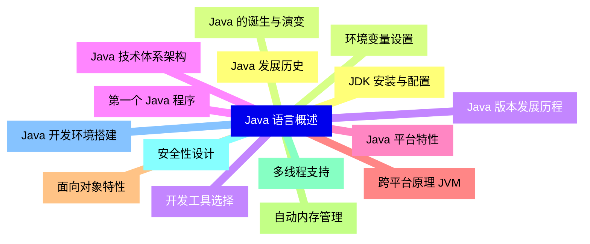
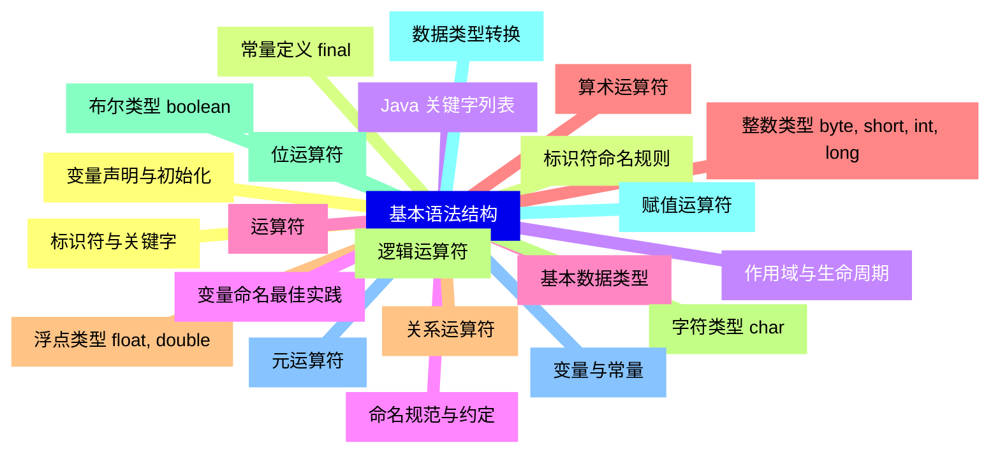
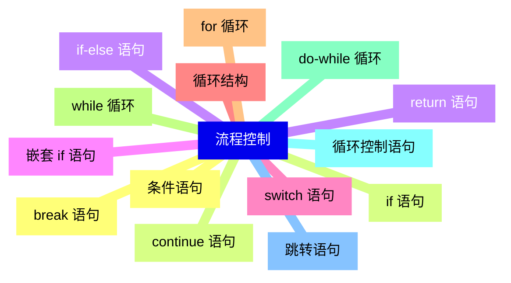
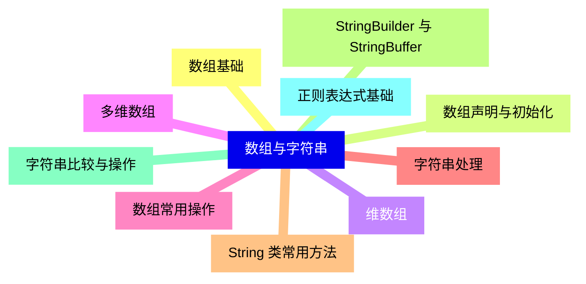
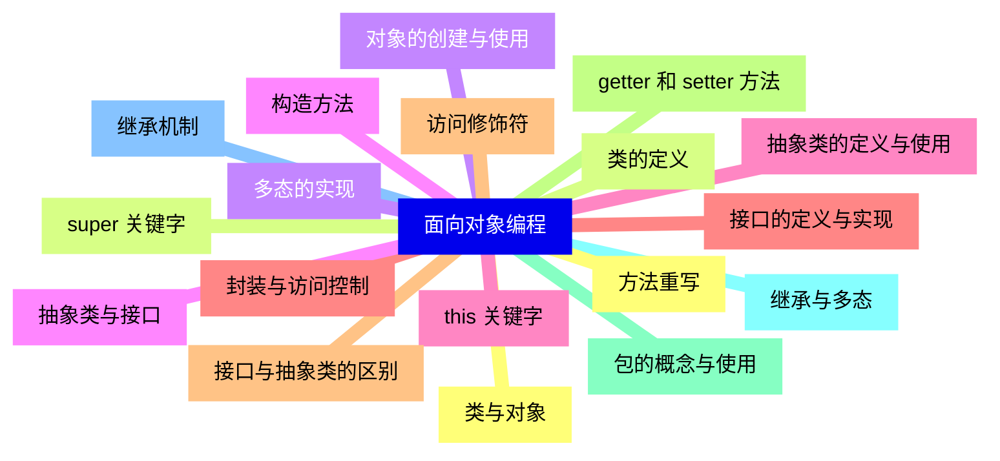
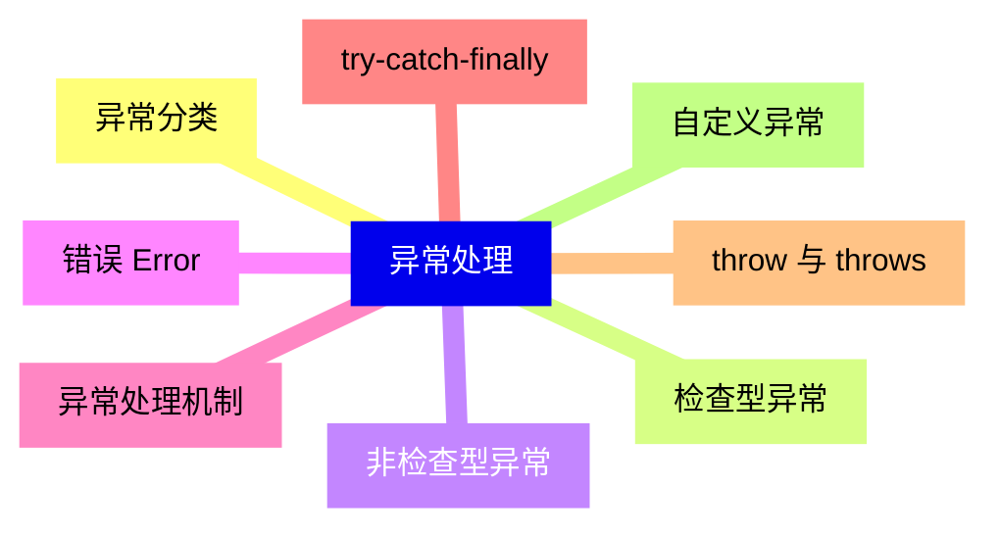
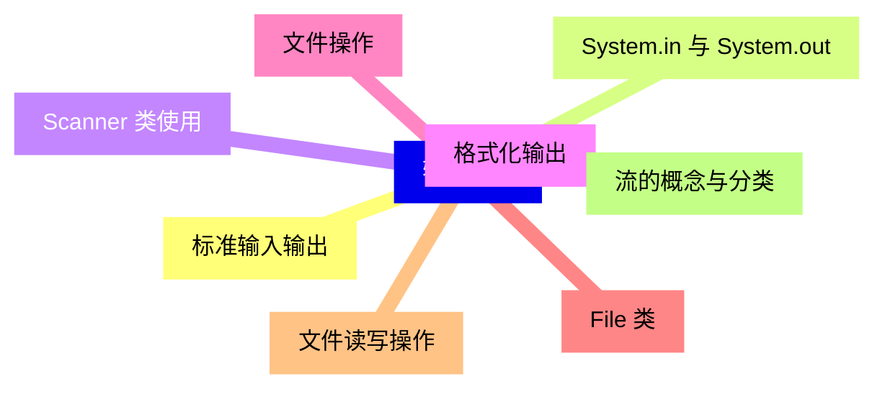
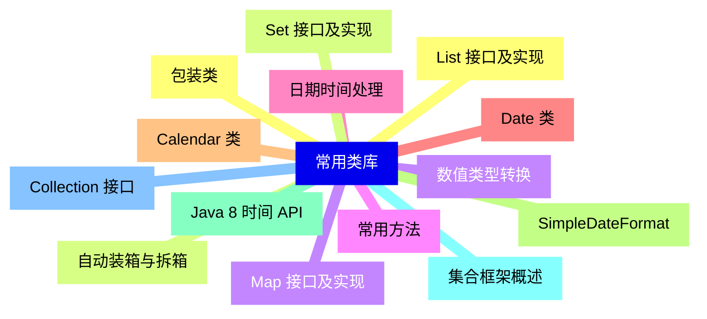
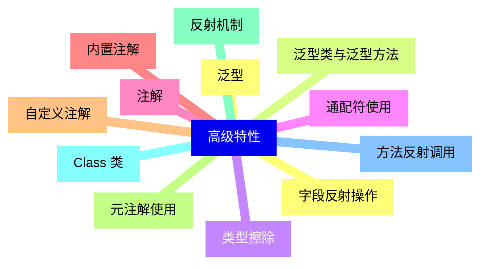
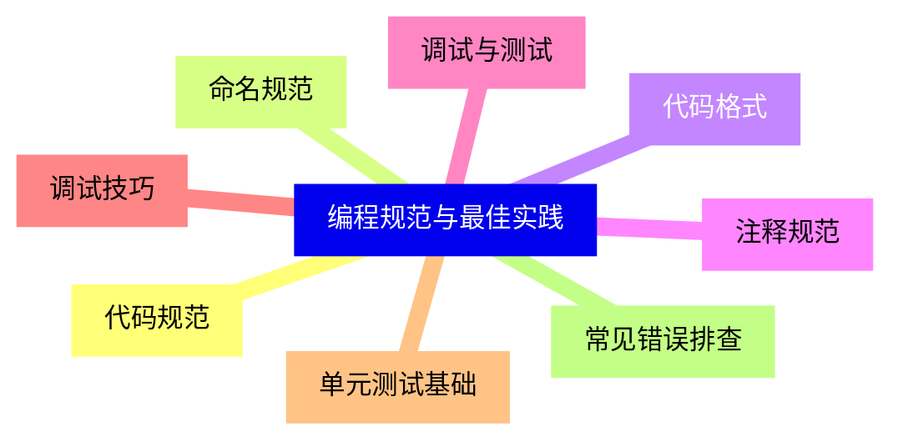


### 1 [Java 语言概述](#1)
#### 1.1 [Java 发展历史](#1)
#### 1.2 [Java 的诞生与演变](#1)
#### 1.3 [Java 版本发展历程](#1)
#### 1.4 [Java 技术体系架构](#1)
#### 1.5 [Java 平台特性](#1)
#### 1.6 [跨平台原理 JVM](#1)
#### 1.7 [面向对象特性](#1)
#### 1.8 [自动内存管理](#1)
#### 1.9 [多线程支持](#1)
#### 1.10 [安全性设计](#1)
#### 1.11 [Java 开发环境搭建](#1)
#### 1.12 [JDK 安装与配置](#1)
#### 1.13 [环境变量设置](#1)
#### 1.14 [开发工具选择](#1)
#### 1.15 [第一个 Java 程序](#1)
### 2 [基本语法结构](#2)
#### 2.1 [标识符与关键字](#2)
#### 2.2 [标识符命名规则](#2)
#### 2.3 [Java 关键字列表](#2)
#### 2.4 [命名规范与约定](#2)
#### 2.5 [基本数据类型](#2)
#### 2.6 [整数类型 byte, short, int, long](#2)
#### 2.7 [浮点类型 float, double](#2)
#### 2.8 [字符类型 char](#2)
#### 2.9 [布尔类型 boolean](#2)
#### 2.10 [数据类型转换](#2)
#### 2.11 [变量与常量](#2)
#### 2.12 [变量声明与初始化](#2)
#### 2.13 [常量定义 final](#2)
#### 2.14 [作用域与生命周期](#2)
#### 2.15 [变量命名最佳实践](#2)
#### 2.16 [运算符](#2)
#### 2.17 [算术运算符](#2)
#### 2.18 [关系运算符](#2)
#### 2.19 [逻辑运算符](#2)
#### 2.20 [位运算符](#2)
#### 2.21 [赋值运算符](#2)
#### 2.22 [元运算符](#2)
### 3 [流程控制](#3)
#### 3.1 [条件语句](#3)
#### 3.2 [if 语句](#3)
#### 3.3 [if-else 语句](#3)
#### 3.4 [嵌套 if 语句](#3)
#### 3.5 [switch 语句](#3)
#### 3.6 [循环结构](#3)
#### 3.7 [for 循环](#3)
#### 3.8 [while 循环](#3)
#### 3.9 [do-while 循环](#3)
#### 3.10 [循环控制语句](#3)
#### 3.11 [跳转语句](#3)
#### 3.12 [break 语句](#3)
#### 3.13 [continue 语句](#3)
#### 3.14 [return 语句](#3)
### 4 [数组与字符串](#4)
#### 4.1 [数组基础](#4)
#### 4.2 [数组声明与初始化](#4)
#### 4.3 [维数组](#4)
#### 4.4 [多维数组](#4)
#### 4.5 [数组常用操作](#4)
#### 4.6 [字符串处理](#4)
#### 4.7 [String 类常用方法](#4)
#### 4.8 [StringBuilder 与 StringBuffer](#4)
#### 4.9 [字符串比较与操作](#4)
#### 4.10 [正则表达式基础](#4)
### 5 [面向对象编程](#5)
#### 5.1 [类与对象](#5)
#### 5.2 [类的定义](#5)
#### 5.3 [对象的创建与使用](#5)
#### 5.4 [构造方法](#5)
#### 5.5 [this 关键字](#5)
#### 5.6 [封装与访问控制](#5)
#### 5.7 [访问修饰符](#5)
#### 5.8 [getter 和 setter 方法](#5)
#### 5.9 [包的概念与使用](#5)
#### 5.10 [继承与多态](#5)
#### 5.11 [继承机制](#5)
#### 5.12 [方法重写](#5)
#### 5.13 [super 关键字](#5)
#### 5.14 [多态的实现](#5)
#### 5.15 [抽象类与接口](#5)
#### 5.16 [抽象类的定义与使用](#5)
#### 5.17 [接口的定义与实现](#5)
#### 5.18 [接口与抽象类的区别](#5)
### 6 [异常处理](#6)
#### 6.1 [异常分类](#6)
#### 6.2 [检查型异常](#6)
#### 6.3 [非检查型异常](#6)
#### 6.4 [错误 Error](#6)
#### 6.5 [异常处理机制](#6)
#### 6.6 [try-catch-finally](#6)
#### 6.7 [throw 与 throws](#6)
#### 6.8 [自定义异常](#6)
### 7 [输入输出](#7)
#### 7.1 [标准输入输出](#7)
#### 7.2 [System.in 与 System.out](#7)
#### 7.3 [Scanner 类使用](#7)
#### 7.4 [格式化输出](#7)
#### 7.5 [文件操作](#7)
#### 7.6 [File 类](#7)
#### 7.7 [文件读写操作](#7)
#### 7.8 [流的概念与分类](#7)
### 8 [常用类库](#8)
#### 8.1 [包装类](#8)
#### 8.2 [自动装箱与拆箱](#8)
#### 8.3 [数值类型转换](#8)
#### 8.4 [常用方法](#8)
#### 8.5 [日期时间处理](#8)
#### 8.6 [Date 类](#8)
#### 8.7 [Calendar 类](#8)
#### 8.8 [SimpleDateFormat](#8)
#### 8.9 [Java 8 时间 API](#8)
#### 8.10 [集合框架概述](#8)
#### 8.11 [Collection 接口](#8)
#### 8.12 [List 接口及实现](#8)
#### 8.13 [Set 接口及实现](#8)
#### 8.14 [Map 接口及实现](#8)
### 9 [高级特性](#9)
#### 9.1 [泛型](#9)
#### 9.2 [泛型类与泛型方法](#9)
#### 9.3 [类型擦除](#9)
#### 9.4 [通配符使用](#9)
#### 9.5 [注解](#9)
#### 9.6 [内置注解](#9)
#### 9.7 [自定义注解](#9)
#### 9.8 [元注解使用](#9)
#### 9.9 [反射机制](#9)
#### 9.10 [Class 类](#9)
#### 9.11 [方法反射调用](#9)
#### 9.12 [字段反射操作](#9)
### 10 [编程规范与最佳实践](#10)
#### 10.1 [代码规范](#10)
#### 10.2 [命名规范](#10)
#### 10.3 [代码格式](#10)
#### 10.4 [注释规范](#10)
#### 10.5 [调试与测试](#10)
#### 10.6 [调试技巧](#10)
#### 10.7 [单元测试基础](#10)
#### 10.8 [常见错误排查](#10)




### 1 Java 语言概述

---
### 1 Java 语言概述
___
#### 1.1 Java 发展历史
___
#### 1.2 Java 的诞生与演变
___
#### 1.3 Java 版本发展历程
___
#### 1.4 Java 技术体系架构
___
#### 1.5 Java 平台特性
___
#### 1.6 跨平台原理 JVM
___
#### 1.7 面向对象特性
___
#### 1.8 自动内存管理
___
#### 1.9 多线程支持
___
#### 1.10 安全性设计
___
#### 1.11 Java 开发环境搭建
___
#### 1.12 JDK 安装与配置
___
#### 1.13 环境变量设置
___
#### 1.14 开发工具选择
___
#### 1.15 第一个 Java 程序
### 2 基本语法结构

---
### 2 基本语法结构
___
#### 2.1 标识符与关键字
___
#### 2.2 标识符命名规则
___
#### 2.3 Java 关键字列表
___
#### 2.4 命名规范与约定
___
#### 2.5 基本数据类型
___
#### 2.6 整数类型 byte, short, int, long
___
#### 2.7 浮点类型 float, double
___
#### 2.8 字符类型 char
___
#### 2.9 布尔类型 boolean
___
#### 2.10 数据类型转换
___
#### 2.11 变量与常量
___
#### 2.12 变量声明与初始化
___
#### 2.13 常量定义 final
___
#### 2.14 作用域与生命周期
___
#### 2.15 变量命名最佳实践
___
#### 2.16 运算符
___
#### 2.17 算术运算符
___
#### 2.18 关系运算符
___
#### 2.19 逻辑运算符
___
#### 2.20 位运算符
___
#### 2.21 赋值运算符
___
#### 2.22 元运算符
### 3 流程控制

---
### 3 流程控制
___
#### 3.1 条件语句
___
#### 3.2 if 语句
___
#### 3.3 if-else 语句
___
#### 3.4 嵌套 if 语句
___
#### 3.5 switch 语句
___
#### 3.6 循环结构
___
#### 3.7 for 循环
___
#### 3.8 while 循环
___
#### 3.9 do-while 循环
___
#### 3.10 循环控制语句
___
#### 3.11 跳转语句
___
#### 3.12 break 语句
___
#### 3.13 continue 语句
___
#### 3.14 return 语句
### 4 数组与字符串

---
### 4 数组与字符串
___
#### 4.1 数组基础
___
#### 4.2 数组声明与初始化
___
#### 4.3 维数组
___
#### 4.4 多维数组
___
#### 4.5 数组常用操作
___
#### 4.6 字符串处理
___
#### 4.7 String 类常用方法
___
#### 4.8 StringBuilder 与 StringBuffer
___
#### 4.9 字符串比较与操作
___
#### 4.10 正则表达式基础
### 5 面向对象编程

---
### 5 面向对象编程
___
#### 5.1 类与对象
___
#### 5.2 类的定义
___
#### 5.3 对象的创建与使用
___
#### 5.4 构造方法
___
#### 5.5 this 关键字
___
#### 5.6 封装与访问控制
___
#### 5.7 访问修饰符
___
#### 5.8 getter 和 setter 方法
___
#### 5.9 包的概念与使用
___
#### 5.10 继承与多态
___
#### 5.11 继承机制
___
#### 5.12 方法重写
___
#### 5.13 super 关键字
___
#### 5.14 多态的实现
___
#### 5.15 抽象类与接口
___
#### 5.16 抽象类的定义与使用
___
#### 5.17 接口的定义与实现
___
#### 5.18 接口与抽象类的区别
### 6 异常处理

---
### 6 异常处理
___
#### 6.1 异常分类
___
#### 6.2 检查型异常
___
#### 6.3 非检查型异常
___
#### 6.4 错误 Error
___
#### 6.5 异常处理机制
___
#### 6.6 try-catch-finally
___
#### 6.7 throw 与 throws
___
#### 6.8 自定义异常
### 7 输入输出

---
### 7 输入输出
___
#### 7.1 标准输入输出
___
#### 7.2 System.in 与 System.out
___
#### 7.3 Scanner 类使用
___
#### 7.4 格式化输出
___
#### 7.5 文件操作
___
#### 7.6 File 类
___
#### 7.7 文件读写操作
___
#### 7.8 流的概念与分类
### 8 常用类库

---
### 8 常用类库
___
#### 8.1 包装类
___
#### 8.2 自动装箱与拆箱
___
#### 8.3 数值类型转换
___
#### 8.4 常用方法
___
#### 8.5 日期时间处理
___
#### 8.6 Date 类
___
#### 8.7 Calendar 类
___
#### 8.8 SimpleDateFormat
___
#### 8.9 Java 8 时间 API
___
#### 8.10 集合框架概述
___
#### 8.11 Collection 接口
___
#### 8.12 List 接口及实现
___
#### 8.13 Set 接口及实现
___
#### 8.14 Map 接口及实现
### 9 高级特性

---
### 9 高级特性
___
#### 9.1 泛型
___
#### 9.2 泛型类与泛型方法
___
#### 9.3 类型擦除
___
#### 9.4 通配符使用
___
#### 9.5 注解
___
#### 9.6 内置注解
___
#### 9.7 自定义注解
___
#### 9.8 元注解使用
___
#### 9.9 反射机制
___
#### 9.10 Class 类
___
#### 9.11 方法反射调用
___
#### 9.12 字段反射操作
### 10 编程规范与最佳实践

---
### 10 编程规范与最佳实践
___
#### 10.1 代码规范
___
#### 10.2 命名规范
___
#### 10.3 代码格式
___
#### 10.4 注释规范
___
#### 10.5 调试与测试
___
#### 10.6 调试技巧
___
#### 10.7 单元测试基础
___
#### 10.8 常见错误排查


### 1 Java 语言概述{#1}

{}

<--->
{}
{}
{}
{}
{}
{}
{}
{}
{}
{}
{}
{}
{}
{}
{}
{}
{}
{}
{}
{}
{}
{}
{}
{}
{}
{}
{}
{}
{}
{}
{}

### 2 基本语法结构{#2}

{}
{}
{}
{}
{}
{}
{}
{}
{}
{}
{}
{}
{}
{}
{}
{}
{}
{}
{}
{}
{}
{}
{}
{}
{}
{}
{}
{}
{}
{}
{}
{}
{}
{}
{}
{}
{}
{}
{}
{}
{}
{}
{}
{}
{}
<--->

{}

### 3 流程控制{#3}

{}

<--->
{}
{}
{}
{}
{}
{}
{}
{}
{}
{}
{}
{}
{}
{}
{}
{}
{}
{}
{}
{}
{}
{}
{}
{}
{}
{}
{}
{}
{}

### 4 数组与字符串{#4}

{}
{}
{}
{}
{}
{}
{}
{}
{}
{}
{}
{}
{}
{}
{}
{}
{}
{}
{}
{}
{}
<--->

{}

### 5 面向对象编程{#5}

{}

<--->
{}
{}
{}
{}
{}
{}
{}
{}
{}
{}
{}
{}
{}
{}
{}
{}
{}
{}
{}
{}
{}
{}
{}
{}
{}
{}
{}
{}
{}
{}
{}
{}
{}
{}
{}
{}
{}

### 6 异常处理{#6}

{}
{}
{}
{}
{}
{}
{}
{}
{}
{}
{}
{}
{}
{}
{}
{}
{}
<--->

{}

### 7 输入输出{#7}

{}

<--->
{}
{}
{}
{}
{}
{}
{}
{}
{}
{}
{}
{}
{}
{}
{}
{}
{}

### 8 常用类库{#8}

{}
{}
{}
{}
{}
{}
{}
{}
{}
{}
{}
{}
{}
{}
{}
{}
{}
{}
{}
{}
{}
{}
{}
{}
{}
{}
{}
{}
{}
<--->

{}

### 9 高级特性{#9}

{}

<--->
{}
{}
{}
{}
{}
{}
{}
{}
{}
{}
{}
{}
{}
{}
{}
{}
{}
{}
{}
{}
{}
{}
{}
{}
{}

### 10 编程规范与最佳实践{#10}

{}
{}
{}
{}
{}
{}
{}
{}
{}
{}
{}
{}
{}
{}
{}
{}
{}
<--->

{}
