
### 1 [面向对象基础概念](#1)
#### 1.1 [面向对象编程概述](#1)
#### 1.2 [面向对象与面向过程编程的区别](#1)
#### 1.3 [面向对象编程的优势和特点](#1)
#### 1.4 [Java面向对象的发展历程](#1)
#### 1.5 [类和对象](#1)
#### 1.6 [类的定义和组成要素](#1)
#### 1.7 [对象的创建和使用](#1)
#### 1.8 [类与对象的关系](#1)
#### 1.9 [三大特性](#1)
#### 1.10 [封装的概念和实现](#1)
#### 1.11 [继承的概念和实现](#1)
#### 1.12 [多态的概念和实现](#1)
### 2 [Java类与对象详解](#2)
#### 2.1 [类的定义](#2)
#### 2.2 [类声明语法](#2)
#### 2.3 [成员变量和局部变量](#2)
#### 2.4 [方法的定义和调用](#2)
#### 2.5 [构造方法](#2)
#### 2.6 [默认构造方法](#2)
#### 2.7 [带参数构造方法](#2)
#### 2.8 [构造方法重载](#2)
#### 2.9 [对象生命周期](#2)
#### 2.10 [对象的创建过程](#2)
#### 2.11 [对象的使用](#2)
#### 2.12 [垃圾回收机制](#2)
### 3 [封装与访问控制](#3)
#### 3.1 [封装原理](#3)
#### 3.2 [数据隐藏的概念](#3)
#### 3.3 [封装的好处](#3)
#### 3.4 [封装的实现方式](#3)
#### 3.5 [访问修饰符](#3)
#### 3.6 [public访问权限](#3)
#### 3.7 [private访问权限](#3)
#### 3.8 [protected访问权限](#3)
#### 3.9 [默认访问权限](#3)
#### 3.10 [getter和setter方法](#3)
#### 3.11 [属性访问方法的设计](#3)
#### 3.12 [方法命名的规范](#3)
#### 3.13 [数据验证的实现](#3)
### 4 [继承与多态](#4)
#### 4.1 [继承机制](#4)
#### 4.2 [extends关键字](#4)
#### 4.3 [方法重写](#4)
#### 4.4 [super关键字的使用](#4)
#### 4.5 [多态实现](#4)
#### 4.6 [编译时多态](#4)
#### 4.7 [运行时多态](#4)
#### 4.8 [向上转型和向下转型](#4)
#### 4.9 [抽象类和接口](#4)
#### 4.10 [抽象类的定义和使用](#4)
#### 4.11 [接口的定义和实现](#4)
#### 4.12 [抽象类与接口的区别](#4)
### 5 [高级面向对象特性](#5)
#### 5.1 [静态成员](#5)
#### 5.2 [静态变量](#5)
#### 5.3 [静态方法](#5)
#### 5.4 [静态代码块](#5)
#### 5.5 [final关键字](#5)
#### 5.6 [final修饰变量](#5)
#### 5.7 [final修饰方法](#5)
#### 5.8 [final修饰类](#5)
#### 5.9 [内部类](#5)
#### 5.10 [成员内部类](#5)
#### 5.11 [局部内部类](#5)
#### 5.12 [匿名内部类](#5)
#### 5.13 [静态内部类](#5)
### 6 [对象关系与设计](#6)
#### 6.1 [关联关系](#6)
#### 6.2 [对一关联](#6)
#### 6.3 [对多关联](#6)
#### 6.4 [多对多关联](#6)
#### 6.5 [依赖关系](#6)
#### 6.6 [方法参数依赖](#6)
#### 6.7 [局部变量依赖](#6)
#### 6.8 [方法调用依赖](#6)
#### 6.9 [组合与聚合](#6)
#### 6.10 [组合关系的特点](#6)
#### 6.11 [聚合关系的特点](#6)
#### 6.12 [组合与聚合的区别](#6)
### 7 [异常处理机制](#7)
#### 7.1 [异常分类](#7)
#### 7.2 [检查型异常](#7)
#### 7.3 [非检查型异常](#7)
#### 7.4 [错误类](#7)
#### 7.5 [异常处理](#7)
#### 7.6 [try-catch语句](#7)
#### 7.7 [finally块](#7)
#### 7.8 [throws关键字](#7)
#### 7.9 [自定义异常](#7)
#### 7.10 [异常类的创建](#7)
#### 7.11 [异常链](#7)
#### 7.12 [最佳实践](#7)
### 8 [面向对象设计原则](#8)
#### 8.1 [SOLID原则](#8)
#### 8.2 [单一职责原则](#8)
#### 8.3 [开闭原则](#8)
#### 8.4 [里氏替换原则](#8)
#### 8.5 [接口隔离原则](#8)
#### 8.6 [依赖倒置原则](#8)
#### 8.7 [设计模式基础](#8)
#### 8.8 [创建型模式](#8)
#### 8.9 [结构型模式](#8)
#### 8.10 [行为型模式](#8)
#### 8.11 [UML建模](#8)
#### 8.12 [类图绘制](#8)
#### 8.13 [时序图](#8)
#### 8.14 [用例图](#8)
### 9 [集合框架](#9)
#### 9.1 [Collection接口](#9)
#### 9.2 [List接口及实现类](#9)
#### 9.3 [Set接口及实现类](#9)
#### 9.4 [Queue接口及实现类](#9)
#### 9.5 [Map接口](#9)
#### 9.6 [HashMap实现原理](#9)
#### 9.7 [TreeMap排序机制](#9)
#### 9.8 [LinkedHashMap特性](#9)
#### 9.9 [迭代器与比较器](#9)
#### 9.10 [Iterator迭代器](#9)
#### 9.11 [Comparable接口](#9)
#### 9.12 [Comparator接口](#9)
### 10 [泛型编程](#10)
#### 10.1 [泛型基础](#10)
#### 10.2 [泛型类的定义](#10)
#### 10.3 [泛型方法](#10)
#### 10.4 [类型擦除](#10)
#### 10.5 [通配符](#10)
#### 10.6 [无界通配符](#10)
#### 10.7 [上界通配符](#10)
#### 10.8 [下界通配符](#10)
#### 10.9 [泛型约束](#10)
#### 10.10 [类型边界](#10)
#### 10.11 [泛型与继承](#10)
#### 10.12 [泛型最佳实践](#10)
### 11 [反射机制](#11)
#### 11.1 [Class类](#11)
#### 11.2 [获取Class对象的方式](#11)
#### 11.3 [Class类的方法](#11)
#### 11.4 [类信息获取](#11)
#### 11.5 [反射操作](#11)
#### 11.6 [字段的反射操作](#11)
#### 11.7 [方法的反射调用](#11)
#### 11.8 [构造方法的反射](#11)
#### 11.9 [动态代理](#11)
#### 11.10 [代理模式原理](#11)
#### 11.11 [动态代理实现](#11)
#### 11.12 [应用场景](#11)
### 12 [输入输出流](#12)
#### 12.1 [字节流](#12)
#### 12.2 [InputStream和OutputStream](#12)
#### 12.3 [文件读写操作](#12)
#### 12.4 [缓冲流的使用](#12)
#### 12.5 [字符流](#12)
#### 12.6 [Reader和Writer](#12)
#### 12.7 [字符编码处理](#12)
#### 12.8 [打印流](#12)
#### 12.9 [对象序列化](#12)
#### 12.10 [Serializable接口](#12)
#### 12.11 [序列化过程](#12)
#### 12.12 [反序列化过程](#12)
### 13 [多线程编程](#13)
#### 13.1 [线程基础](#13)
#### 13.2 [线程的创建方式](#13)
#### 13.3 [线程状态转换](#13)
#### 13.4 [线程调度](#13)
#### 13.5 [线程同步](#13)
#### 13.6 [synchronized关键字](#13)
#### 13.7 [Lock接口](#13)
#### 13.8 [死锁预防](#13)
#### 13.9 [线程通信](#13)
#### 13.10 [wait/notify机制](#13)
#### 13.11 [线程池的使用](#13)
#### 13.12 [并发工具类](#13)
### 14 [网络编程](#14)
#### 14.1 [Socket编程](#14)
#### 14.2 [TCP通信实现](#14)
#### 14.3 [UDP通信实现](#14)
#### 14.4 [服务器端编程](#14)
#### 14.5 [URL处理](#14)
#### 14.6 [URL类使用](#14)
#### 14.7 [HTTP通信](#14)
#### 14.8 [网络协议](#14)
#### 14.9 [NIO编程](#14)
#### 14.10 [缓冲区Buffer](#14)
#### 14.11 [通道Channel](#14)
#### 14.12 [选择器Selector](#14)
### 15 [数据库编程](#15)
#### 15.1 [JDBC基础](#15)
#### 15.2 [驱动加载](#15)
#### 15.3 [连接数据库](#15)
#### 15.4 [执行SQL语句](#15)
#### 15.5 [事务处理](#15)
#### 15.6 [事务特性](#15)
#### 15.7 [事务隔离级别](#15)
#### 15.8 [事务管理](#15)
#### 15.9 [连接池](#15)
#### 15.10 [连接池原理](#15)
#### 15.11 [常用连接池](#15)
#### 15.12 [连接池配置](#15)
### 16 [项目实战与最佳实践](#16)
#### 16.1 [项目结构设计](#16)
#### 16.2 [包的组织原则](#16)
#### 16.3 [类的职责划分](#16)
#### 16.4 [模块化设计](#16)
#### 16.5 [代码规范](#16)
#### 16.6 [命名规范](#16)
#### 16.7 [注释规范](#16)
#### 16.8 [代码格式](#16)
#### 16.9 [测试与调试](#16)
#### 16.10 [单元测试](#16)
#### 16.11 [集成测试](#16)
#### 16.12 [调试技巧](#16)




### 1 面向对象基础概念

---
### 1 面向对象基础概念
___
#### 1.1 面向对象编程概述
___
#### 1.2 面向对象与面向过程编程的区别
___
#### 1.3 面向对象编程的优势和特点
___
#### 1.4 Java面向对象的发展历程
___
#### 1.5 类和对象
___
#### 1.6 类的定义和组成要素
___
#### 1.7 对象的创建和使用
___
#### 1.8 类与对象的关系
___
#### 1.9 三大特性
___
#### 1.10 封装的概念和实现
___
#### 1.11 继承的概念和实现
___
#### 1.12 多态的概念和实现
### 2 Java类与对象详解

---
### 2 Java类与对象详解
___
#### 2.1 类的定义
___
#### 2.2 类声明语法
___
#### 2.3 成员变量和局部变量
___
#### 2.4 方法的定义和调用
___
#### 2.5 构造方法
___
#### 2.6 默认构造方法
___
#### 2.7 带参数构造方法
___
#### 2.8 构造方法重载
___
#### 2.9 对象生命周期
___
#### 2.10 对象的创建过程
___
#### 2.11 对象的使用
___
#### 2.12 垃圾回收机制
### 3 封装与访问控制

---
### 3 封装与访问控制
___
#### 3.1 封装原理
___
#### 3.2 数据隐藏的概念
___
#### 3.3 封装的好处
___
#### 3.4 封装的实现方式
___
#### 3.5 访问修饰符
___
#### 3.6 public访问权限
___
#### 3.7 private访问权限
___
#### 3.8 protected访问权限
___
#### 3.9 默认访问权限
___
#### 3.10 getter和setter方法
___
#### 3.11 属性访问方法的设计
___
#### 3.12 方法命名的规范
___
#### 3.13 数据验证的实现
### 4 继承与多态

---
### 4 继承与多态
___
#### 4.1 继承机制
___
#### 4.2 extends关键字
___
#### 4.3 方法重写
___
#### 4.4 super关键字的使用
___
#### 4.5 多态实现
___
#### 4.6 编译时多态
___
#### 4.7 运行时多态
___
#### 4.8 向上转型和向下转型
___
#### 4.9 抽象类和接口
___
#### 4.10 抽象类的定义和使用
___
#### 4.11 接口的定义和实现
___
#### 4.12 抽象类与接口的区别
### 5 高级面向对象特性

---
### 5 高级面向对象特性
___
#### 5.1 静态成员
___
#### 5.2 静态变量
___
#### 5.3 静态方法
___
#### 5.4 静态代码块
___
#### 5.5 final关键字
___
#### 5.6 final修饰变量
___
#### 5.7 final修饰方法
___
#### 5.8 final修饰类
___
#### 5.9 内部类
___
#### 5.10 成员内部类
___
#### 5.11 局部内部类
___
#### 5.12 匿名内部类
___
#### 5.13 静态内部类
### 6 对象关系与设计

---
### 6 对象关系与设计
___
#### 6.1 关联关系
___
#### 6.2 对一关联
___
#### 6.3 对多关联
___
#### 6.4 多对多关联
___
#### 6.5 依赖关系
___
#### 6.6 方法参数依赖
___
#### 6.7 局部变量依赖
___
#### 6.8 方法调用依赖
___
#### 6.9 组合与聚合
___
#### 6.10 组合关系的特点
___
#### 6.11 聚合关系的特点
___
#### 6.12 组合与聚合的区别
### 7 异常处理机制

---
### 7 异常处理机制
___
#### 7.1 异常分类
___
#### 7.2 检查型异常
___
#### 7.3 非检查型异常
___
#### 7.4 错误类
___
#### 7.5 异常处理
___
#### 7.6 try-catch语句
___
#### 7.7 finally块
___
#### 7.8 throws关键字
___
#### 7.9 自定义异常
___
#### 7.10 异常类的创建
___
#### 7.11 异常链
___
#### 7.12 最佳实践
### 8 面向对象设计原则

---
### 8 面向对象设计原则
___
#### 8.1 SOLID原则
___
#### 8.2 单一职责原则
___
#### 8.3 开闭原则
___
#### 8.4 里氏替换原则
___
#### 8.5 接口隔离原则
___
#### 8.6 依赖倒置原则
___
#### 8.7 设计模式基础
___
#### 8.8 创建型模式
___
#### 8.9 结构型模式
___
#### 8.10 行为型模式
___
#### 8.11 UML建模
___
#### 8.12 类图绘制
___
#### 8.13 时序图
___
#### 8.14 用例图
### 9 集合框架

---
### 9 集合框架
___
#### 9.1 Collection接口
___
#### 9.2 List接口及实现类
___
#### 9.3 Set接口及实现类
___
#### 9.4 Queue接口及实现类
___
#### 9.5 Map接口
___
#### 9.6 HashMap实现原理
___
#### 9.7 TreeMap排序机制
___
#### 9.8 LinkedHashMap特性
___
#### 9.9 迭代器与比较器
___
#### 9.10 Iterator迭代器
___
#### 9.11 Comparable接口
___
#### 9.12 Comparator接口
### 10 泛型编程

---
### 10 泛型编程
___
#### 10.1 泛型基础
___
#### 10.2 泛型类的定义
___
#### 10.3 泛型方法
___
#### 10.4 类型擦除
___
#### 10.5 通配符
___
#### 10.6 无界通配符
___
#### 10.7 上界通配符
___
#### 10.8 下界通配符
___
#### 10.9 泛型约束
___
#### 10.10 类型边界
___
#### 10.11 泛型与继承
___
#### 10.12 泛型最佳实践
### 11 反射机制

---
### 11 反射机制
___
#### 11.1 Class类
___
#### 11.2 获取Class对象的方式
___
#### 11.3 Class类的方法
___
#### 11.4 类信息获取
___
#### 11.5 反射操作
___
#### 11.6 字段的反射操作
___
#### 11.7 方法的反射调用
___
#### 11.8 构造方法的反射
___
#### 11.9 动态代理
___
#### 11.10 代理模式原理
___
#### 11.11 动态代理实现
___
#### 11.12 应用场景
### 12 输入输出流

---
### 12 输入输出流
___
#### 12.1 字节流
___
#### 12.2 InputStream和OutputStream
___
#### 12.3 文件读写操作
___
#### 12.4 缓冲流的使用
___
#### 12.5 字符流
___
#### 12.6 Reader和Writer
___
#### 12.7 字符编码处理
___
#### 12.8 打印流
___
#### 12.9 对象序列化
___
#### 12.10 Serializable接口
___
#### 12.11 序列化过程
___
#### 12.12 反序列化过程
### 13 多线程编程

---
### 13 多线程编程
___
#### 13.1 线程基础
___
#### 13.2 线程的创建方式
___
#### 13.3 线程状态转换
___
#### 13.4 线程调度
___
#### 13.5 线程同步
___
#### 13.6 synchronized关键字
___
#### 13.7 Lock接口
___
#### 13.8 死锁预防
___
#### 13.9 线程通信
___
#### 13.10 wait/notify机制
___
#### 13.11 线程池的使用
___
#### 13.12 并发工具类
### 14 网络编程

---
### 14 网络编程
___
#### 14.1 Socket编程
___
#### 14.2 TCP通信实现
___
#### 14.3 UDP通信实现
___
#### 14.4 服务器端编程
___
#### 14.5 URL处理
___
#### 14.6 URL类使用
___
#### 14.7 HTTP通信
___
#### 14.8 网络协议
___
#### 14.9 NIO编程
___
#### 14.10 缓冲区Buffer
___
#### 14.11 通道Channel
___
#### 14.12 选择器Selector
### 15 数据库编程

---
### 15 数据库编程
___
#### 15.1 JDBC基础
___
#### 15.2 驱动加载
___
#### 15.3 连接数据库
___
#### 15.4 执行SQL语句
___
#### 15.5 事务处理
___
#### 15.6 事务特性
___
#### 15.7 事务隔离级别
___
#### 15.8 事务管理
___
#### 15.9 连接池
___
#### 15.10 连接池原理
___
#### 15.11 常用连接池
___
#### 15.12 连接池配置
### 16 项目实战与最佳实践

---
### 16 项目实战与最佳实践
___
#### 16.1 项目结构设计
___
#### 16.2 包的组织原则
___
#### 16.3 类的职责划分
___
#### 16.4 模块化设计
___
#### 16.5 代码规范
___
#### 16.6 命名规范
___
#### 16.7 注释规范
___
#### 16.8 代码格式
___
#### 16.9 测试与调试
___
#### 16.10 单元测试
___
#### 16.11 集成测试
___
#### 16.12 调试技巧


### 1 面向对象基础概念{#1}

{}
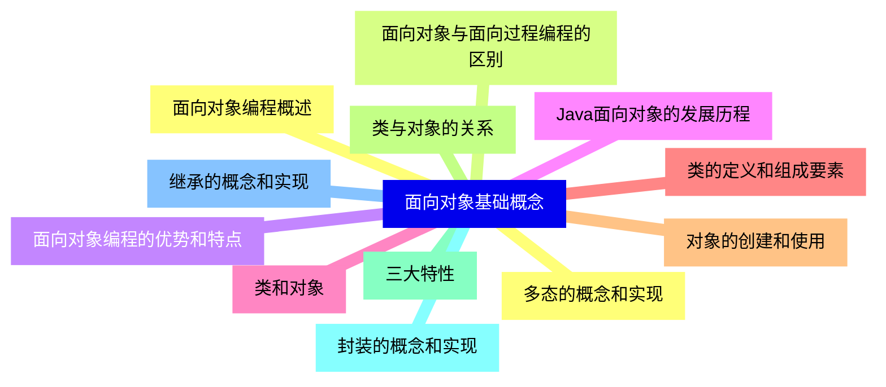

<--->
{}
{}
{}
{}
{}
{}
{}
{}
{}
{}
{}
{}
{}
{}
{}
{}
{}
{}
{}
{}
{}
{}
{}
{}
{}

### 2 Java类与对象详解{#2}

{}
{}
{}
{}
{}
{}
{}
{}
{}
{}
{}
{}
{}
{}
{}
{}
{}
{}
{}
{}
{}
{}
{}
{}
{}
<--->
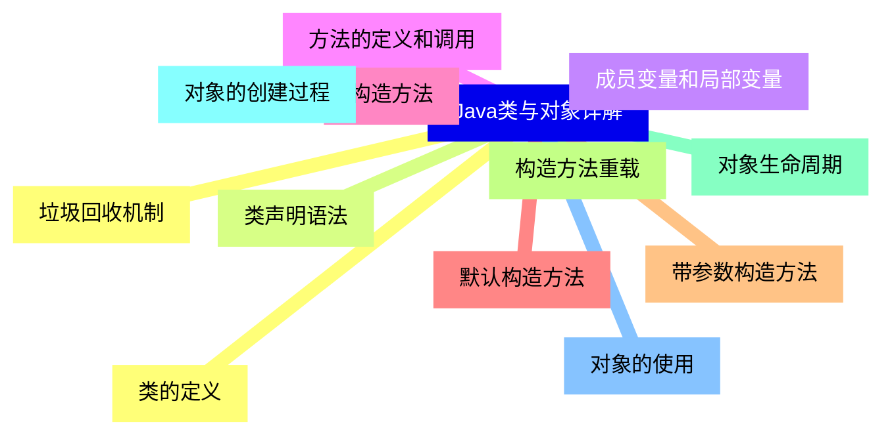

{}

### 3 封装与访问控制{#3}

{}
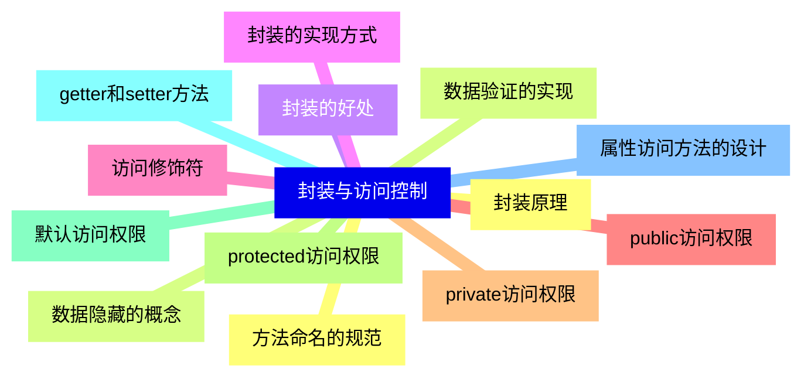

<--->
{}
{}
{}
{}
{}
{}
{}
{}
{}
{}
{}
{}
{}
{}
{}
{}
{}
{}
{}
{}
{}
{}
{}
{}
{}
{}
{}

### 4 继承与多态{#4}

{}
{}
{}
{}
{}
{}
{}
{}
{}
{}
{}
{}
{}
{}
{}
{}
{}
{}
{}
{}
{}
{}
{}
{}
{}
<--->
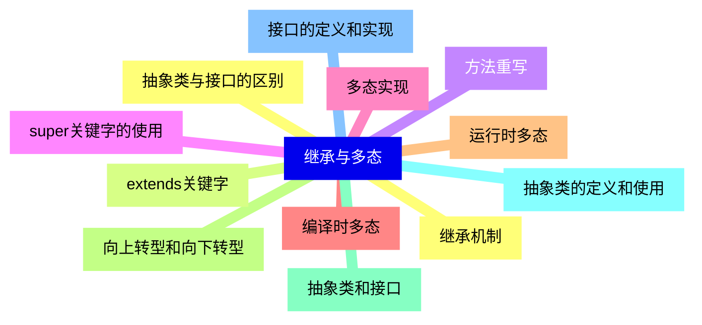

{}

### 5 高级面向对象特性{#5}

{}
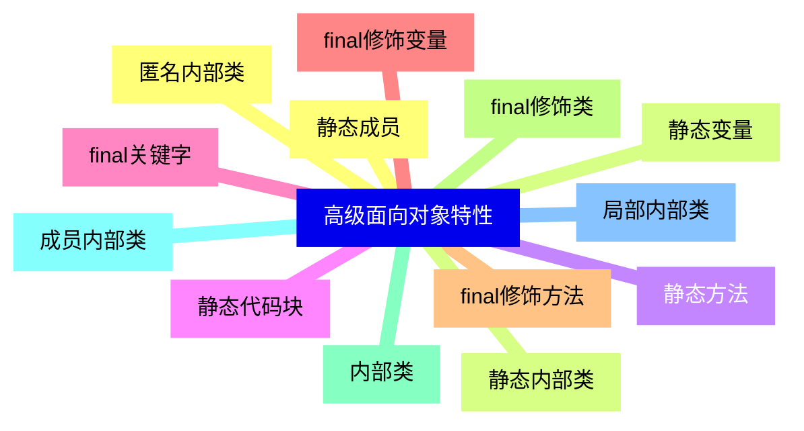

<--->
{}
{}
{}
{}
{}
{}
{}
{}
{}
{}
{}
{}
{}
{}
{}
{}
{}
{}
{}
{}
{}
{}
{}
{}
{}
{}
{}

### 6 对象关系与设计{#6}

{}
{}
{}
{}
{}
{}
{}
{}
{}
{}
{}
{}
{}
{}
{}
{}
{}
{}
{}
{}
{}
{}
{}
{}
{}
<--->
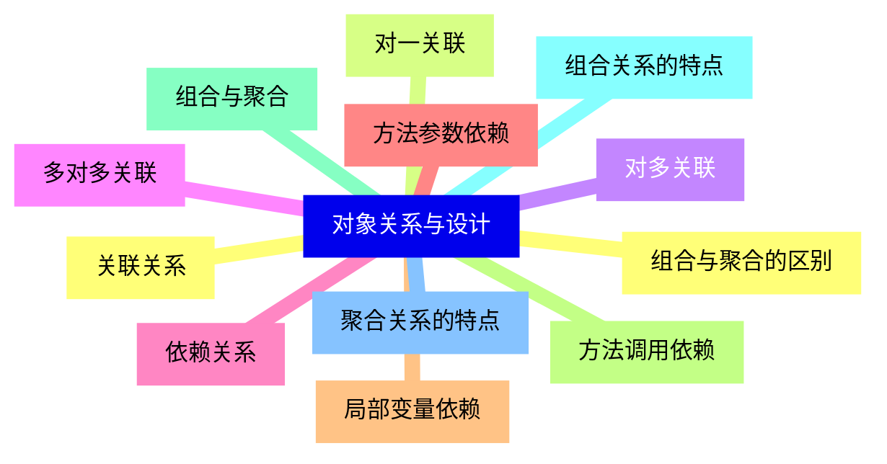

{}

### 7 异常处理机制{#7}

{}
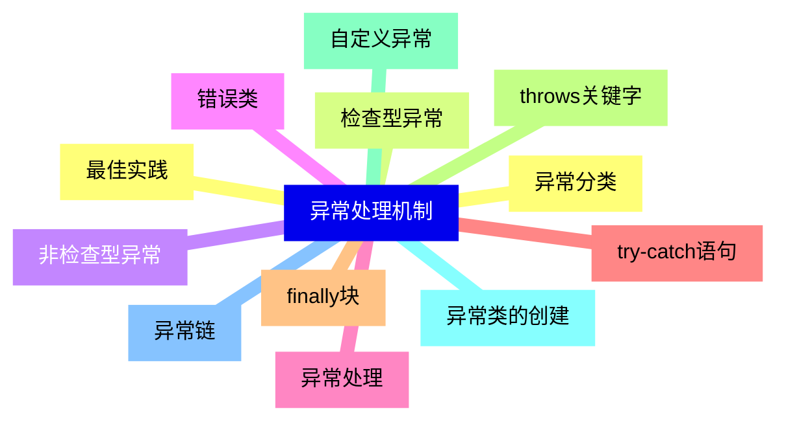

<--->
{}
{}
{}
{}
{}
{}
{}
{}
{}
{}
{}
{}
{}
{}
{}
{}
{}
{}
{}
{}
{}
{}
{}
{}
{}

### 8 面向对象设计原则{#8}

{}
{}
{}
{}
{}
{}
{}
{}
{}
{}
{}
{}
{}
{}
{}
{}
{}
{}
{}
{}
{}
{}
{}
{}
{}
{}
{}
{}
{}
<--->
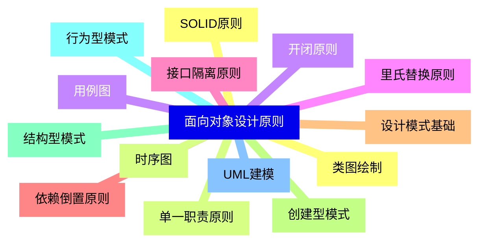

{}

### 9 集合框架{#9}

{}
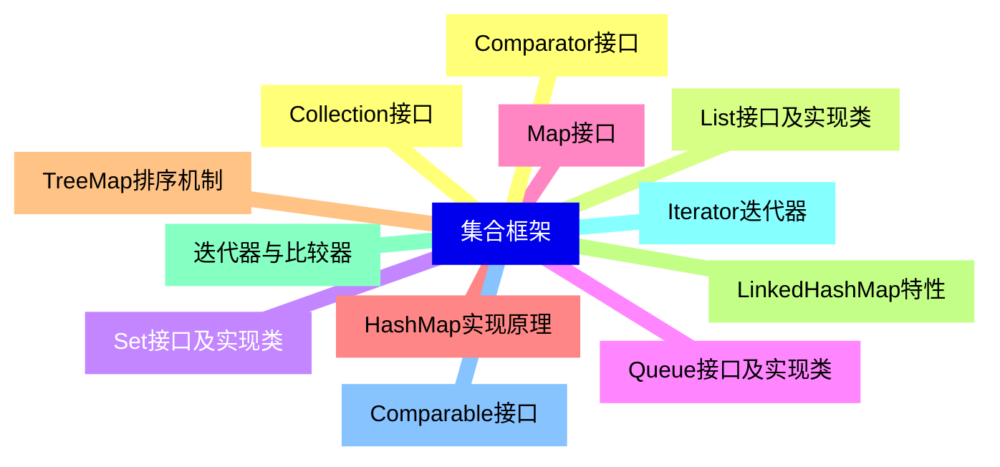

<--->
{}
{}
{}
{}
{}
{}
{}
{}
{}
{}
{}
{}
{}
{}
{}
{}
{}
{}
{}
{}
{}
{}
{}
{}
{}

### 10 泛型编程{#10}

{}
{}
{}
{}
{}
{}
{}
{}
{}
{}
{}
{}
{}
{}
{}
{}
{}
{}
{}
{}
{}
{}
{}
{}
{}
<--->
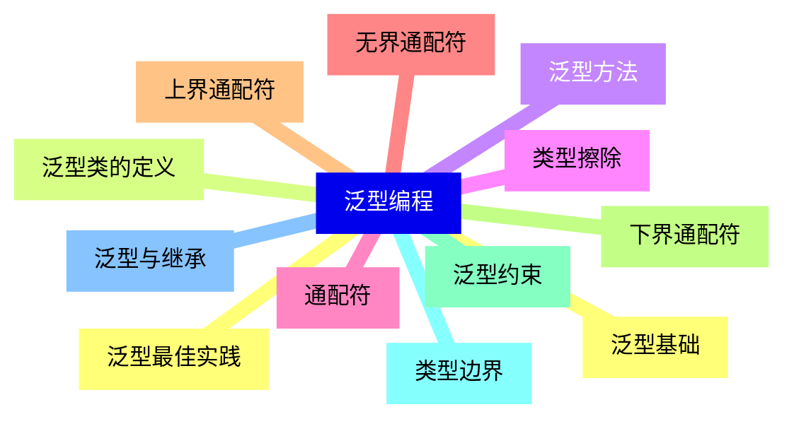

{}

### 11 反射机制{#11}

{}
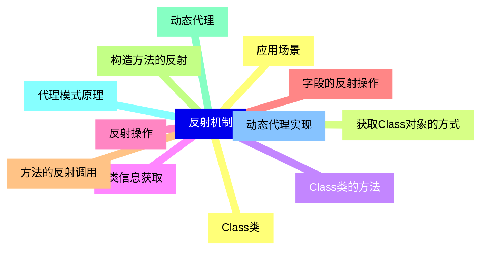

<--->
{}
{}
{}
{}
{}
{}
{}
{}
{}
{}
{}
{}
{}
{}
{}
{}
{}
{}
{}
{}
{}
{}
{}
{}
{}

### 12 输入输出流{#12}

{}
{}
{}
{}
{}
{}
{}
{}
{}
{}
{}
{}
{}
{}
{}
{}
{}
{}
{}
{}
{}
{}
{}
{}
{}
<--->
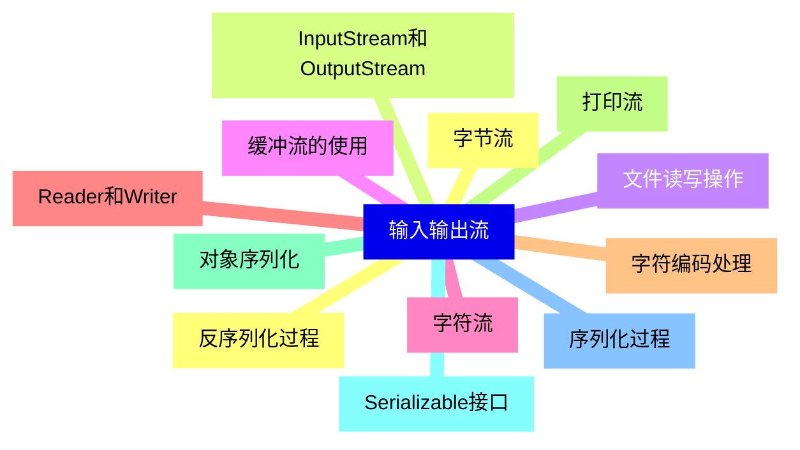

{}

### 13 多线程编程{#13}

{}
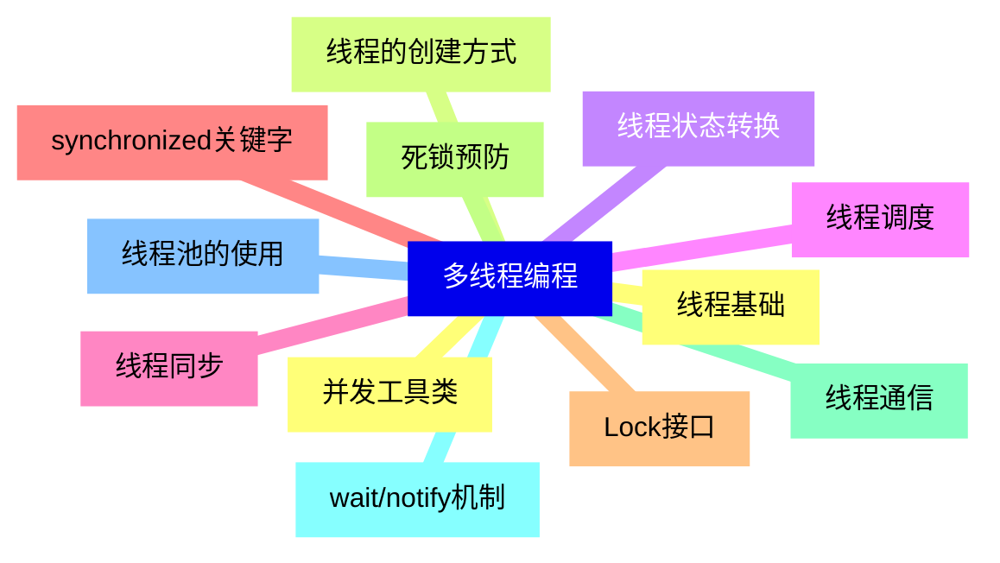

<--->
{}
{}
{}
{}
{}
{}
{}
{}
{}
{}
{}
{}
{}
{}
{}
{}
{}
{}
{}
{}
{}
{}
{}
{}
{}

### 14 网络编程{#14}

{}
{}
{}
{}
{}
{}
{}
{}
{}
{}
{}
{}
{}
{}
{}
{}
{}
{}
{}
{}
{}
{}
{}
{}
{}
<--->
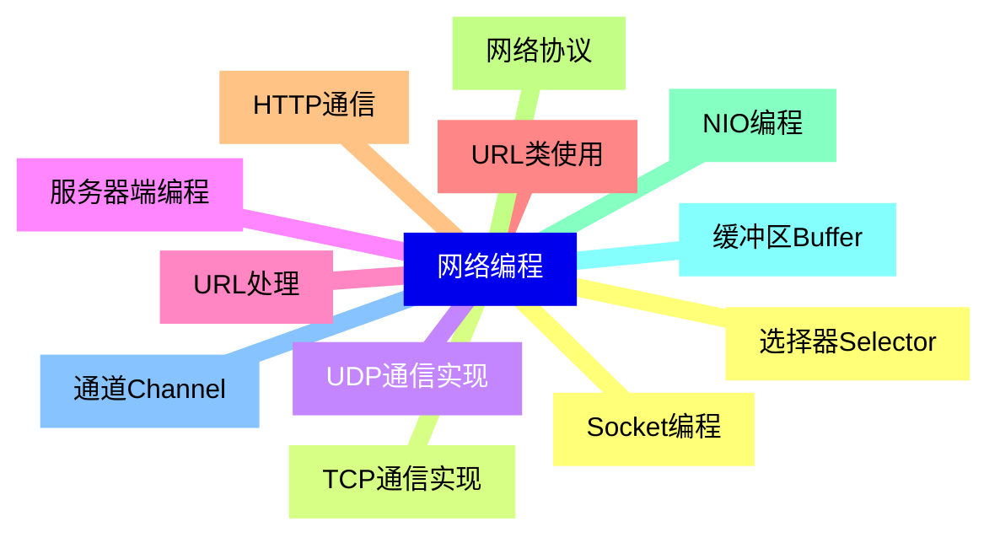

{}

### 15 数据库编程{#15}

{}
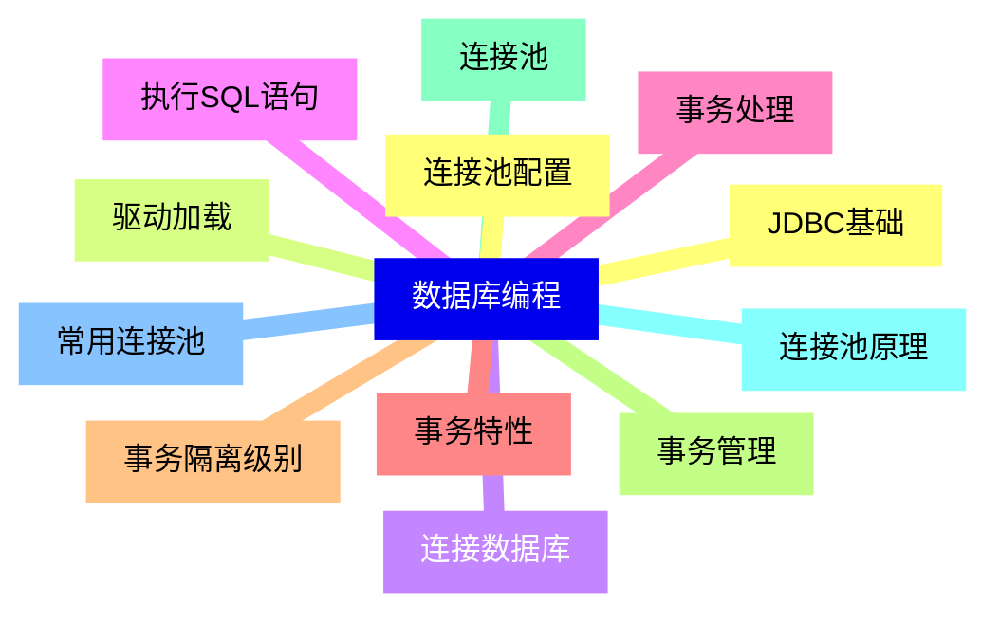

<--->
{}
{}
{}
{}
{}
{}
{}
{}
{}
{}
{}
{}
{}
{}
{}
{}
{}
{}
{}
{}
{}
{}
{}
{}
{}

### 16 项目实战与最佳实践{#16}

{}
{}
{}
{}
{}
{}
{}
{}
{}
{}
{}
{}
{}
{}
{}
{}
{}
{}
{}
{}
{}
{}
{}
{}
{}
<--->
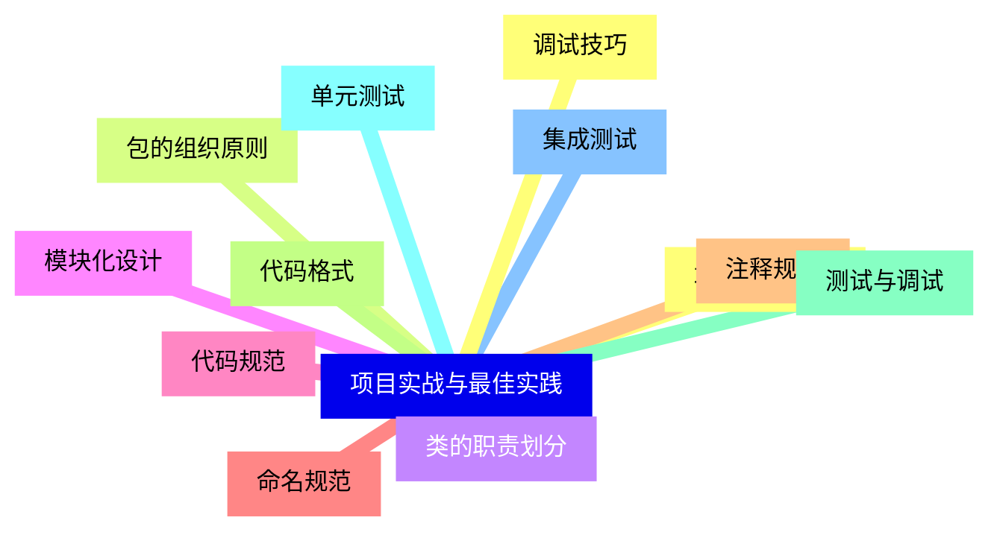

{}
