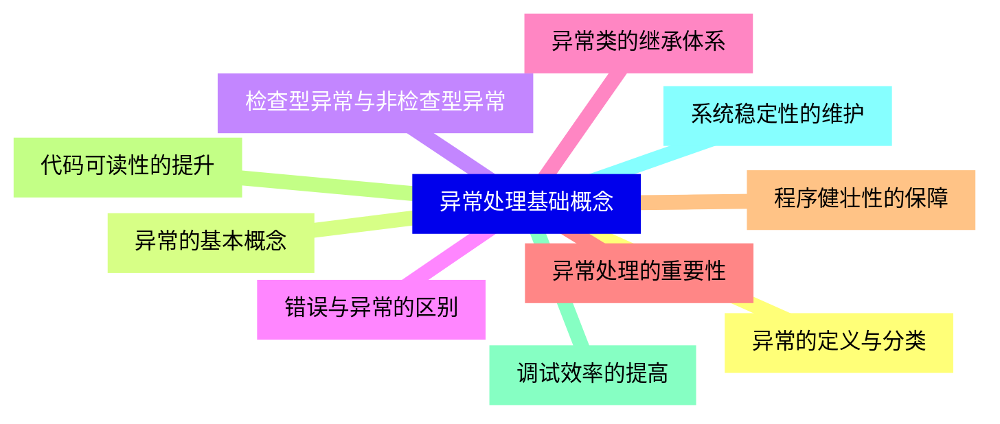
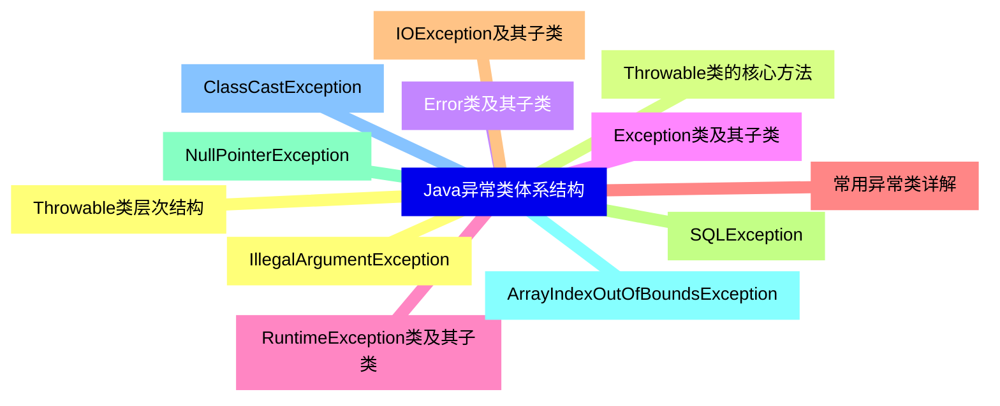
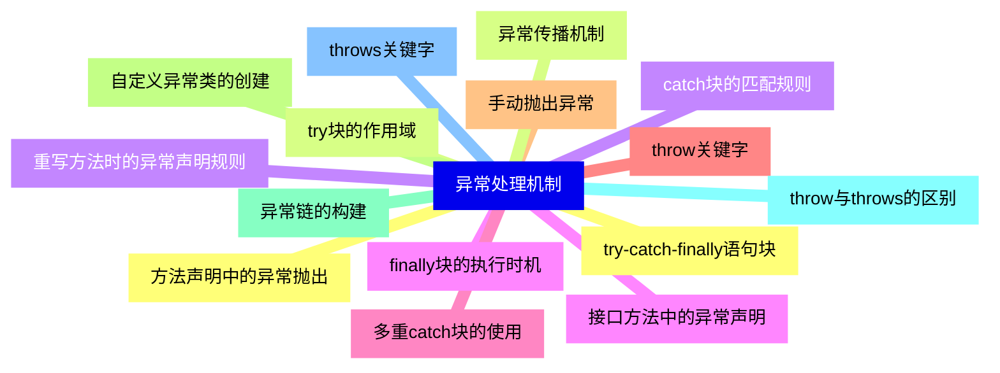
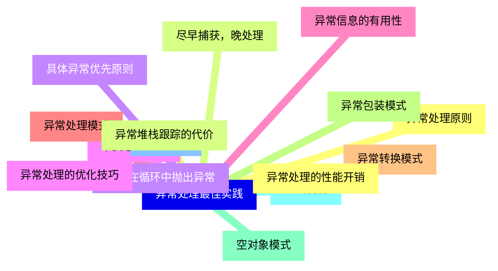
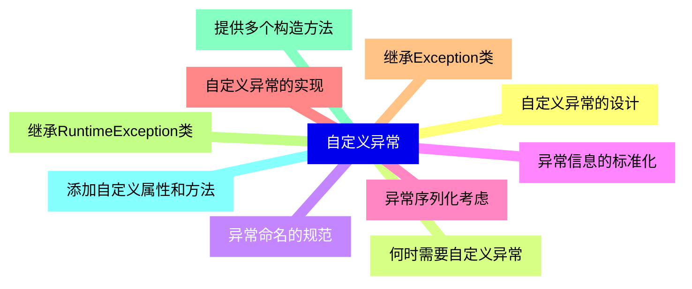
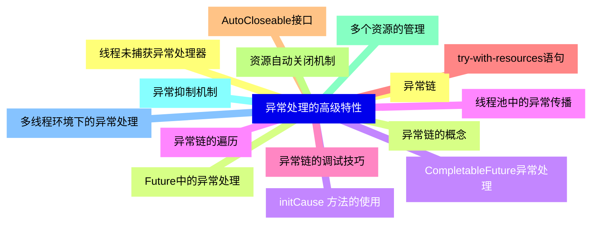
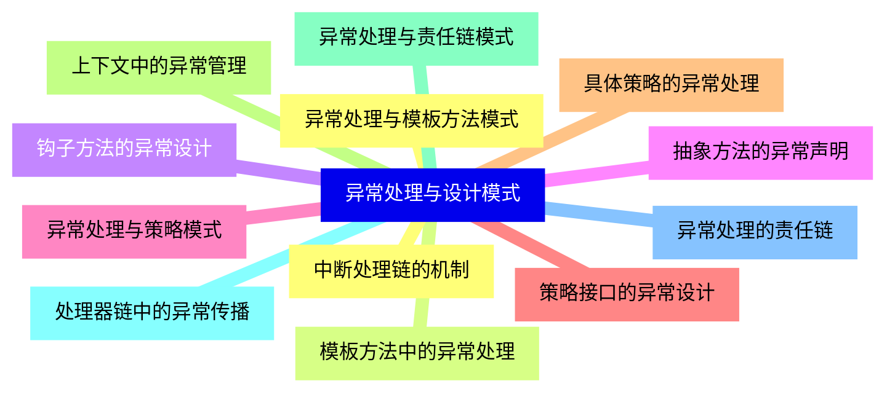
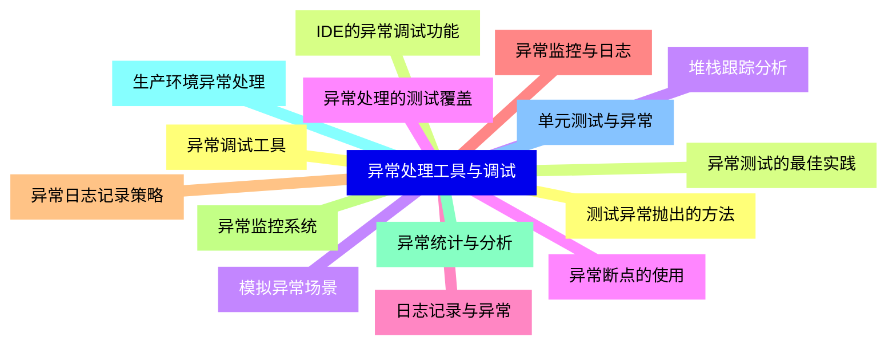
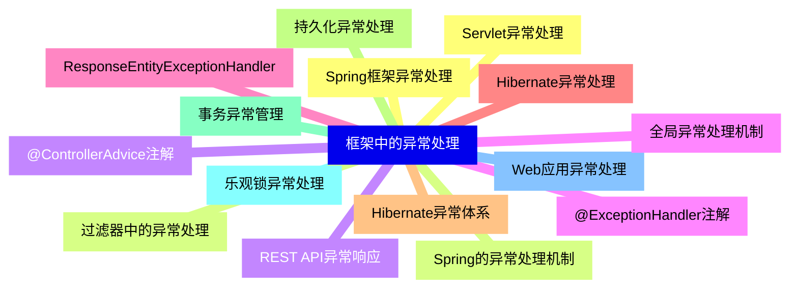
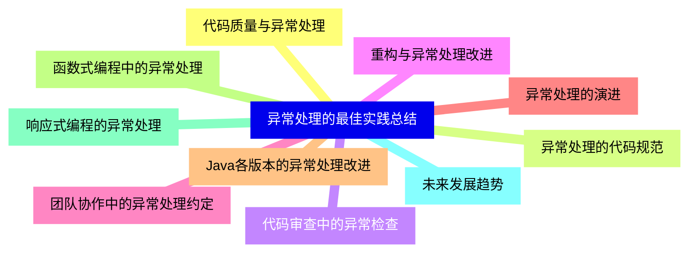


### 1 [异常处理基础概念](#1)
#### 1.1 [异常的定义与分类](#1)
#### 1.2 [异常的基本概念](#1)
#### 1.3 [检查型异常与非检查型异常](#1)
#### 1.4 [错误与异常的区别](#1)
#### 1.5 [异常类的继承体系](#1)
#### 1.6 [异常处理的重要性](#1)
#### 1.7 [程序健壮性的保障](#1)
#### 1.8 [代码可读性的提升](#1)
#### 1.9 [调试效率的提高](#1)
#### 1.10 [系统稳定性的维护](#1)
### 2 [Java异常类体系结构](#2)
#### 2.1 [Throwable类层次结构](#2)
#### 2.2 [Throwable类的核心方法](#2)
#### 2.3 [Error类及其子类](#2)
#### 2.4 [Exception类及其子类](#2)
#### 2.5 [RuntimeException类及其子类](#2)
#### 2.6 [常用异常类详解](#2)
#### 2.7 [IOException及其子类](#2)
#### 2.8 [SQLException](#2)
#### 2.9 [NullPointerException](#2)
#### 2.10 [ArrayIndexOutOfBoundsException](#2)
#### 2.11 [ClassCastException](#2)
#### 2.12 [IllegalArgumentException](#2)
### 3 [异常处理机制](#3)
#### 3.1 [try-catch-finally语句块](#3)
#### 3.2 [try块的作用域](#3)
#### 3.3 [catch块的匹配规则](#3)
#### 3.4 [finally块的执行时机](#3)
#### 3.5 [多重catch块的使用](#3)
#### 3.6 [throw关键字](#3)
#### 3.7 [手动抛出异常](#3)
#### 3.8 [自定义异常类的创建](#3)
#### 3.9 [异常链的构建](#3)
#### 3.10 [throw与throws的区别](#3)
#### 3.11 [throws关键字](#3)
#### 3.12 [方法声明中的异常抛出](#3)
#### 3.13 [异常传播机制](#3)
#### 3.14 [重写方法时的异常声明规则](#3)
#### 3.15 [接口方法中的异常声明](#3)
### 4 [异常处理最佳实践](#4)
#### 4.1 [异常处理原则](#4)
#### 4.2 [尽早捕获，晚处理](#4)
#### 4.3 [具体异常优先原则](#4)
#### 4.4 [不要忽略异常](#4)
#### 4.5 [异常信息的有用性](#4)
#### 4.6 [异常处理模式](#4)
#### 4.7 [异常转换模式](#4)
#### 4.8 [异常包装模式](#4)
#### 4.9 [空对象模式](#4)
#### 4.10 [重试机制](#4)
#### 4.11 [性能考虑](#4)
#### 4.12 [异常处理的性能开销](#4)
#### 4.13 [异常堆栈跟踪的代价](#4)
#### 4.14 [避免在循环中抛出异常](#4)
#### 4.15 [异常处理的优化技巧](#4)
### 5 [自定义异常](#5)
#### 5.1 [自定义异常的设计](#5)
#### 5.2 [何时需要自定义异常](#5)
#### 5.3 [异常命名的规范](#5)
#### 5.4 [异常信息的标准化](#5)
#### 5.5 [异常序列化考虑](#5)
#### 5.6 [自定义异常的实现](#5)
#### 5.7 [继承Exception类](#5)
#### 5.8 [继承RuntimeException类](#5)
#### 5.9 [提供多个构造方法](#5)
#### 5.10 [添加自定义属性和方法](#5)
### 6 [异常处理的高级特性](#6)
#### 6.1 [异常链](#6)
#### 6.2 [异常链的概念](#6)
#### 6.3 [initCause  方法的使用](#6)
#### 6.4 [异常链的遍历](#6)
#### 6.5 [异常链的调试技巧](#6)
#### 6.6 [try-with-resources语句](#6)
#### 6.7 [AutoCloseable接口](#6)
#### 6.8 [资源自动关闭机制](#6)
#### 6.9 [多个资源的管理](#6)
#### 6.10 [异常抑制机制](#6)
#### 6.11 [多线程环境下的异常处理](#6)
#### 6.12 [线程未捕获异常处理器](#6)
#### 6.13 [Future中的异常处理](#6)
#### 6.14 [CompletableFuture异常处理](#6)
#### 6.15 [线程池中的异常传播](#6)
### 7 [异常处理与设计模式](#7)
#### 7.1 [异常处理与模板方法模式](#7)
#### 7.2 [模板方法中的异常处理](#7)
#### 7.3 [钩子方法的异常设计](#7)
#### 7.4 [抽象方法的异常声明](#7)
#### 7.5 [异常处理与策略模式](#7)
#### 7.6 [策略接口的异常设计](#7)
#### 7.7 [具体策略的异常处理](#7)
#### 7.8 [上下文中的异常管理](#7)
#### 7.9 [异常处理与责任链模式](#7)
#### 7.10 [处理器链中的异常传播](#7)
#### 7.11 [异常处理的责任链](#7)
#### 7.12 [中断处理链的机制](#7)
### 8 [异常处理工具与调试](#8)
#### 8.1 [异常调试工具](#8)
#### 8.2 [IDE的异常调试功能](#8)
#### 8.3 [堆栈跟踪分析](#8)
#### 8.4 [异常断点的使用](#8)
#### 8.5 [日志记录与异常](#8)
#### 8.6 [异常监控与日志](#8)
#### 8.7 [异常日志记录策略](#8)
#### 8.8 [异常监控系统](#8)
#### 8.9 [异常统计与分析](#8)
#### 8.10 [生产环境异常处理](#8)
#### 8.11 [单元测试与异常](#8)
#### 8.12 [测试异常抛出的方法](#8)
#### 8.13 [异常测试的最佳实践](#8)
#### 8.14 [模拟异常场景](#8)
#### 8.15 [异常处理的测试覆盖](#8)
### 9 [框架中的异常处理](#9)
#### 9.1 [Spring框架异常处理](#9)
#### 9.2 [Spring的异常处理机制](#9)
#### 9.3 [@ControllerAdvice注解](#9)
#### 9.4 [@ExceptionHandler注解](#9)
#### 9.5 [ResponseEntityExceptionHandler](#9)
#### 9.6 [Hibernate异常处理](#9)
#### 9.7 [Hibernate异常体系](#9)
#### 9.8 [持久化异常处理](#9)
#### 9.9 [事务异常管理](#9)
#### 9.10 [乐观锁异常处理](#9)
#### 9.11 [Web应用异常处理](#9)
#### 9.12 [Servlet异常处理](#9)
#### 9.13 [过滤器中的异常处理](#9)
#### 9.14 [REST API异常响应](#9)
#### 9.15 [全局异常处理机制](#9)
### 10 [异常处理的最佳实践总结](#10)
#### 10.1 [代码质量与异常处理](#10)
#### 10.2 [异常处理的代码规范](#10)
#### 10.3 [代码审查中的异常检查](#10)
#### 10.4 [重构与异常处理改进](#10)
#### 10.5 [团队协作中的异常处理约定](#10)
#### 10.6 [异常处理的演进](#10)
#### 10.7 [Java各版本的异常处理改进](#10)
#### 10.8 [函数式编程中的异常处理](#10)
#### 10.9 [响应式编程的异常处理](#10)
#### 10.10 [未来发展趋势](#10)




### 1 异常处理基础概念

---
### 1 异常处理基础概念
___
#### 1.1 异常的定义与分类
___
#### 1.2 异常的基本概念
___
#### 1.3 检查型异常与非检查型异常
___
#### 1.4 错误与异常的区别
___
#### 1.5 异常类的继承体系
___
#### 1.6 异常处理的重要性
___
#### 1.7 程序健壮性的保障
___
#### 1.8 代码可读性的提升
___
#### 1.9 调试效率的提高
___
#### 1.10 系统稳定性的维护
### 2 Java异常类体系结构

---
### 2 Java异常类体系结构
___
#### 2.1 Throwable类层次结构
___
#### 2.2 Throwable类的核心方法
___
#### 2.3 Error类及其子类
___
#### 2.4 Exception类及其子类
___
#### 2.5 RuntimeException类及其子类
___
#### 2.6 常用异常类详解
___
#### 2.7 IOException及其子类
___
#### 2.8 SQLException
___
#### 2.9 NullPointerException
___
#### 2.10 ArrayIndexOutOfBoundsException
___
#### 2.11 ClassCastException
___
#### 2.12 IllegalArgumentException
### 3 异常处理机制

---
### 3 异常处理机制
___
#### 3.1 try-catch-finally语句块
___
#### 3.2 try块的作用域
___
#### 3.3 catch块的匹配规则
___
#### 3.4 finally块的执行时机
___
#### 3.5 多重catch块的使用
___
#### 3.6 throw关键字
___
#### 3.7 手动抛出异常
___
#### 3.8 自定义异常类的创建
___
#### 3.9 异常链的构建
___
#### 3.10 throw与throws的区别
___
#### 3.11 throws关键字
___
#### 3.12 方法声明中的异常抛出
___
#### 3.13 异常传播机制
___
#### 3.14 重写方法时的异常声明规则
___
#### 3.15 接口方法中的异常声明
### 4 异常处理最佳实践

---
### 4 异常处理最佳实践
___
#### 4.1 异常处理原则
___
#### 4.2 尽早捕获，晚处理
___
#### 4.3 具体异常优先原则
___
#### 4.4 不要忽略异常
___
#### 4.5 异常信息的有用性
___
#### 4.6 异常处理模式
___
#### 4.7 异常转换模式
___
#### 4.8 异常包装模式
___
#### 4.9 空对象模式
___
#### 4.10 重试机制
___
#### 4.11 性能考虑
___
#### 4.12 异常处理的性能开销
___
#### 4.13 异常堆栈跟踪的代价
___
#### 4.14 避免在循环中抛出异常
___
#### 4.15 异常处理的优化技巧
### 5 自定义异常

---
### 5 自定义异常
___
#### 5.1 自定义异常的设计
___
#### 5.2 何时需要自定义异常
___
#### 5.3 异常命名的规范
___
#### 5.4 异常信息的标准化
___
#### 5.5 异常序列化考虑
___
#### 5.6 自定义异常的实现
___
#### 5.7 继承Exception类
___
#### 5.8 继承RuntimeException类
___
#### 5.9 提供多个构造方法
___
#### 5.10 添加自定义属性和方法
### 6 异常处理的高级特性

---
### 6 异常处理的高级特性
___
#### 6.1 异常链
___
#### 6.2 异常链的概念
___
#### 6.3 initCause  方法的使用
___
#### 6.4 异常链的遍历
___
#### 6.5 异常链的调试技巧
___
#### 6.6 try-with-resources语句
___
#### 6.7 AutoCloseable接口
___
#### 6.8 资源自动关闭机制
___
#### 6.9 多个资源的管理
___
#### 6.10 异常抑制机制
___
#### 6.11 多线程环境下的异常处理
___
#### 6.12 线程未捕获异常处理器
___
#### 6.13 Future中的异常处理
___
#### 6.14 CompletableFuture异常处理
___
#### 6.15 线程池中的异常传播
### 7 异常处理与设计模式

---
### 7 异常处理与设计模式
___
#### 7.1 异常处理与模板方法模式
___
#### 7.2 模板方法中的异常处理
___
#### 7.3 钩子方法的异常设计
___
#### 7.4 抽象方法的异常声明
___
#### 7.5 异常处理与策略模式
___
#### 7.6 策略接口的异常设计
___
#### 7.7 具体策略的异常处理
___
#### 7.8 上下文中的异常管理
___
#### 7.9 异常处理与责任链模式
___
#### 7.10 处理器链中的异常传播
___
#### 7.11 异常处理的责任链
___
#### 7.12 中断处理链的机制
### 8 异常处理工具与调试

---
### 8 异常处理工具与调试
___
#### 8.1 异常调试工具
___
#### 8.2 IDE的异常调试功能
___
#### 8.3 堆栈跟踪分析
___
#### 8.4 异常断点的使用
___
#### 8.5 日志记录与异常
___
#### 8.6 异常监控与日志
___
#### 8.7 异常日志记录策略
___
#### 8.8 异常监控系统
___
#### 8.9 异常统计与分析
___
#### 8.10 生产环境异常处理
___
#### 8.11 单元测试与异常
___
#### 8.12 测试异常抛出的方法
___
#### 8.13 异常测试的最佳实践
___
#### 8.14 模拟异常场景
___
#### 8.15 异常处理的测试覆盖
### 9 框架中的异常处理

---
### 9 框架中的异常处理
___
#### 9.1 Spring框架异常处理
___
#### 9.2 Spring的异常处理机制
___
#### 9.3 @ControllerAdvice注解
___
#### 9.4 @ExceptionHandler注解
___
#### 9.5 ResponseEntityExceptionHandler
___
#### 9.6 Hibernate异常处理
___
#### 9.7 Hibernate异常体系
___
#### 9.8 持久化异常处理
___
#### 9.9 事务异常管理
___
#### 9.10 乐观锁异常处理
___
#### 9.11 Web应用异常处理
___
#### 9.12 Servlet异常处理
___
#### 9.13 过滤器中的异常处理
___
#### 9.14 REST API异常响应
___
#### 9.15 全局异常处理机制
### 10 异常处理的最佳实践总结

---
### 10 异常处理的最佳实践总结
___
#### 10.1 代码质量与异常处理
___
#### 10.2 异常处理的代码规范
___
#### 10.3 代码审查中的异常检查
___
#### 10.4 重构与异常处理改进
___
#### 10.5 团队协作中的异常处理约定
___
#### 10.6 异常处理的演进
___
#### 10.7 Java各版本的异常处理改进
___
#### 10.8 函数式编程中的异常处理
___
#### 10.9 响应式编程的异常处理
___
#### 10.10 未来发展趋势


### 1 异常处理基础概念{#1}

{}

<--->
{}
{}
{}
{}
{}
{}
{}
{}
{}
{}
{}
{}
{}
{}
{}
{}
{}
{}
{}
{}
{}

### 2 Java异常类体系结构{#2}

{}
{}
{}
{}
{}
{}
{}
{}
{}
{}
{}
{}
{}
{}
{}
{}
{}
{}
{}
{}
{}
{}
{}
{}
{}
<--->

{}

### 3 异常处理机制{#3}

{}

<--->
{}
{}
{}
{}
{}
{}
{}
{}
{}
{}
{}
{}
{}
{}
{}
{}
{}
{}
{}
{}
{}
{}
{}
{}
{}
{}
{}
{}
{}
{}
{}

### 4 异常处理最佳实践{#4}

{}
{}
{}
{}
{}
{}
{}
{}
{}
{}
{}
{}
{}
{}
{}
{}
{}
{}
{}
{}
{}
{}
{}
{}
{}
{}
{}
{}
{}
{}
{}
<--->

{}

### 5 自定义异常{#5}

{}

<--->
{}
{}
{}
{}
{}
{}
{}
{}
{}
{}
{}
{}
{}
{}
{}
{}
{}
{}
{}
{}
{}

### 6 异常处理的高级特性{#6}

{}
{}
{}
{}
{}
{}
{}
{}
{}
{}
{}
{}
{}
{}
{}
{}
{}
{}
{}
{}
{}
{}
{}
{}
{}
{}
{}
{}
{}
{}
{}
<--->

{}

### 7 异常处理与设计模式{#7}

{}

<--->
{}
{}
{}
{}
{}
{}
{}
{}
{}
{}
{}
{}
{}
{}
{}
{}
{}
{}
{}
{}
{}
{}
{}
{}
{}

### 8 异常处理工具与调试{#8}

{}
{}
{}
{}
{}
{}
{}
{}
{}
{}
{}
{}
{}
{}
{}
{}
{}
{}
{}
{}
{}
{}
{}
{}
{}
{}
{}
{}
{}
{}
{}
<--->

{}

### 9 框架中的异常处理{#9}

{}

<--->
{}
{}
{}
{}
{}
{}
{}
{}
{}
{}
{}
{}
{}
{}
{}
{}
{}
{}
{}
{}
{}
{}
{}
{}
{}
{}
{}
{}
{}
{}
{}

### 10 异常处理的最佳实践总结{#10}

{}
{}
{}
{}
{}
{}
{}
{}
{}
{}
{}
{}
{}
{}
{}
{}
{}
{}
{}
{}
{}
<--->

{}
