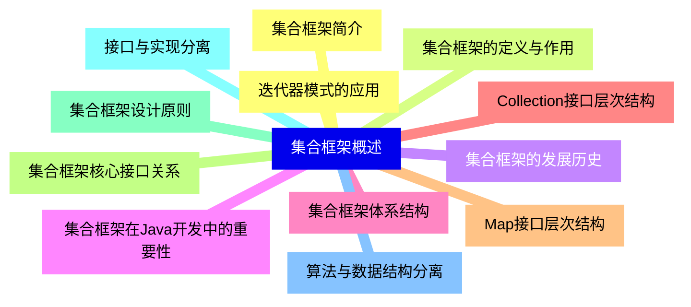
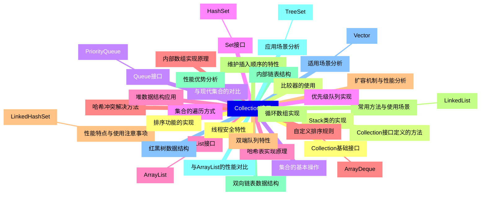
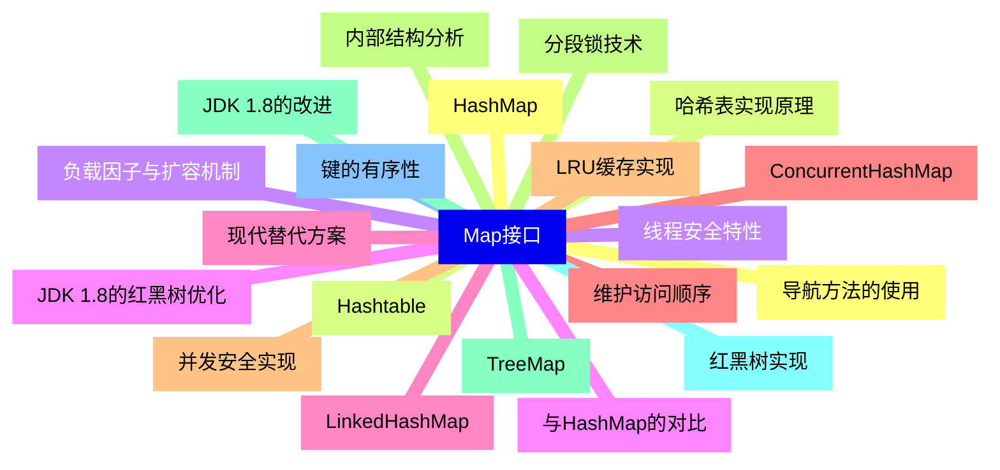
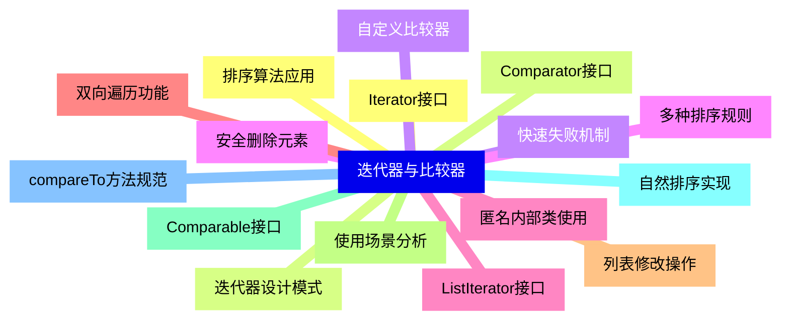
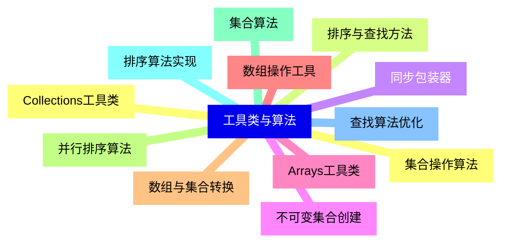
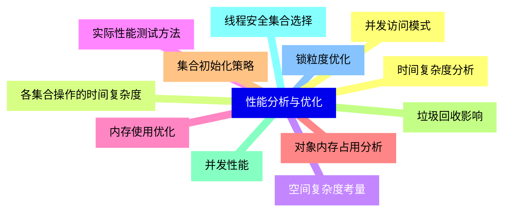
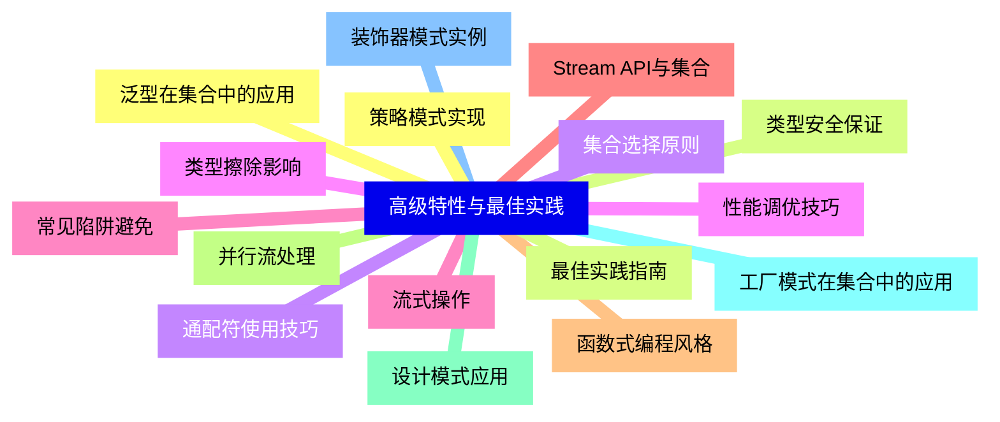
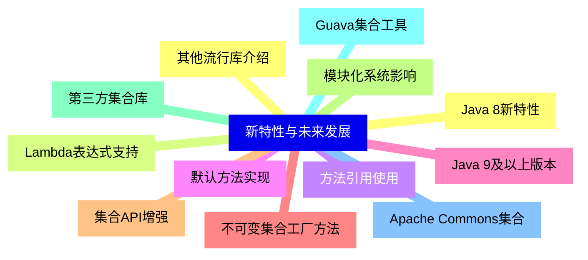


### 1 [集合框架概述](#1)
#### 1.1 [集合框架简介](#1)
#### 1.2 [集合框架的定义与作用](#1)
#### 1.3 [集合框架的发展历史](#1)
#### 1.4 [集合框架在Java开发中的重要性](#1)
#### 1.5 [集合框架体系结构](#1)
#### 1.6 [Collection接口层次结构](#1)
#### 1.7 [Map接口层次结构](#1)
#### 1.8 [集合框架核心接口关系](#1)
#### 1.9 [集合框架设计原则](#1)
#### 1.10 [接口与实现分离](#1)
#### 1.11 [算法与数据结构分离](#1)
#### 1.12 [迭代器模式的应用](#1)
### 2 [Collection接口](#2)
#### 2.1 [Collection基础接口](#2)
#### 2.2 [Collection接口定义的方法](#2)
#### 2.3 [集合的基本操作](#2)
#### 2.4 [集合的遍历方式](#2)
#### 2.5 [List接口](#2)
##### 2.5.1 [ArrayList](#2)
#### 2.6 [内部数组实现原理](#2)
#### 2.7 [扩容机制与性能分析](#2)
#### 2.8 [常用方法与使用场景](#2)
##### 2.8.1 [LinkedList](#2)
#### 2.9 [双向链表数据结构](#2)
#### 2.10 [与ArrayList的性能对比](#2)
#### 2.11 [适用场景分析](#2)
##### 2.11.1 [Vector](#2)
#### 2.12 [线程安全特性](#2)
#### 2.13 [Stack类的实现](#2)
#### 2.14 [与现代集合的对比](#2)
#### 2.15 [Set接口](#2)
##### 2.15.1 [HashSet](#2)
#### 2.16 [哈希表实现原理](#2)
#### 2.17 [哈希冲突解决方法](#2)
#### 2.18 [性能特点与使用注意事项](#2)
##### 2.18.1 [LinkedHashSet](#2)
#### 2.19 [维护插入顺序的特性](#2)
#### 2.20 [内部链表结构](#2)
#### 2.21 [应用场景分析](#2)
##### 2.21.1 [TreeSet](#2)
#### 2.22 [红黑树数据结构](#2)
#### 2.23 [排序功能的实现](#2)
#### 2.24 [比较器的使用](#2)
#### 2.25 [Queue接口](#2)
##### 2.25.1 [PriorityQueue](#2)
#### 2.26 [优先级队列实现](#2)
#### 2.27 [堆数据结构应用](#2)
#### 2.28 [自定义排序规则](#2)
##### 2.28.1 [ArrayDeque](#2)
#### 2.29 [双端队列特性](#2)
#### 2.30 [循环数组实现](#2)
#### 2.31 [性能优势分析](#2)
### 3 [Map接口](#3)
#### 3.1 [HashMap](#3)
#### 3.2 [哈希表实现原理](#3)
#### 3.3 [负载因子与扩容机制](#3)
#### 3.4 [JDK 1.8的红黑树优化](#3)
#### 3.5 [LinkedHashMap](#3)
#### 3.6 [维护访问顺序](#3)
#### 3.7 [LRU缓存实现](#3)
#### 3.8 [内部结构分析](#3)
#### 3.9 [TreeMap](#3)
#### 3.10 [红黑树实现](#3)
#### 3.11 [键的有序性](#3)
#### 3.12 [导航方法的使用](#3)
#### 3.13 [Hashtable](#3)
#### 3.14 [线程安全特性](#3)
#### 3.15 [与HashMap的对比](#3)
#### 3.16 [现代替代方案](#3)
#### 3.17 [ConcurrentHashMap](#3)
#### 3.18 [并发安全实现](#3)
#### 3.19 [分段锁技术](#3)
#### 3.20 [JDK 1.8的改进](#3)
### 4 [迭代器与比较器](#4)
#### 4.1 [Iterator接口](#4)
#### 4.2 [迭代器设计模式](#4)
#### 4.3 [快速失败机制](#4)
#### 4.4 [安全删除元素](#4)
#### 4.5 [ListIterator接口](#4)
#### 4.6 [双向遍历功能](#4)
#### 4.7 [列表修改操作](#4)
#### 4.8 [使用场景分析](#4)
#### 4.9 [Comparable接口](#4)
#### 4.10 [自然排序实现](#4)
#### 4.11 [compareTo方法规范](#4)
#### 4.12 [排序算法应用](#4)
#### 4.13 [Comparator接口](#4)
#### 4.14 [自定义比较器](#4)
#### 4.15 [多种排序规则](#4)
#### 4.16 [匿名内部类使用](#4)
### 5 [工具类与算法](#5)
#### 5.1 [Collections工具类](#5)
#### 5.2 [排序与查找方法](#5)
#### 5.3 [同步包装器](#5)
#### 5.4 [不可变集合创建](#5)
#### 5.5 [Arrays工具类](#5)
#### 5.6 [数组操作工具](#5)
#### 5.7 [数组与集合转换](#5)
#### 5.8 [并行排序算法](#5)
#### 5.9 [集合算法](#5)
#### 5.10 [排序算法实现](#5)
#### 5.11 [查找算法优化](#5)
#### 5.12 [集合操作算法](#5)
### 6 [性能分析与优化](#6)
#### 6.1 [时间复杂度分析](#6)
#### 6.2 [各集合操作的时间复杂度](#6)
#### 6.3 [空间复杂度考量](#6)
#### 6.4 [实际性能测试方法](#6)
#### 6.5 [内存使用优化](#6)
#### 6.6 [对象内存占用分析](#6)
#### 6.7 [集合初始化策略](#6)
#### 6.8 [垃圾回收影响](#6)
#### 6.9 [并发性能](#6)
#### 6.10 [线程安全集合选择](#6)
#### 6.11 [锁粒度优化](#6)
#### 6.12 [并发访问模式](#6)
### 7 [高级特性与最佳实践](#7)
#### 7.1 [泛型在集合中的应用](#7)
#### 7.2 [类型安全保证](#7)
#### 7.3 [通配符使用技巧](#7)
#### 7.4 [类型擦除影响](#7)
#### 7.5 [流式操作](#7)
#### 7.6 [Stream API与集合](#7)
#### 7.7 [函数式编程风格](#7)
#### 7.8 [并行流处理](#7)
#### 7.9 [设计模式应用](#7)
#### 7.10 [工厂模式在集合中的应用](#7)
#### 7.11 [装饰器模式实例](#7)
#### 7.12 [策略模式实现](#7)
#### 7.13 [最佳实践指南](#7)
#### 7.14 [集合选择原则](#7)
#### 7.15 [性能调优技巧](#7)
#### 7.16 [常见陷阱避免](#7)
### 8 [新特性与未来发展](#8)
#### 8.1 [Java 8新特性](#8)
#### 8.2 [Lambda表达式支持](#8)
#### 8.3 [方法引用使用](#8)
#### 8.4 [默认方法实现](#8)
#### 8.5 [Java 9及以上版本](#8)
#### 8.6 [不可变集合工厂方法](#8)
#### 8.7 [集合API增强](#8)
#### 8.8 [模块化系统影响](#8)
#### 8.9 [第三方集合库](#8)
#### 8.10 [Guava集合工具](#8)
#### 8.11 [Apache Commons集合](#8)
#### 8.12 [其他流行库介绍](#8)




### 1 集合框架概述

---
### 1 集合框架概述
___
#### 1.1 集合框架简介
___
#### 1.2 集合框架的定义与作用
___
#### 1.3 集合框架的发展历史
___
#### 1.4 集合框架在Java开发中的重要性
___
#### 1.5 集合框架体系结构
___
#### 1.6 Collection接口层次结构
___
#### 1.7 Map接口层次结构
___
#### 1.8 集合框架核心接口关系
___
#### 1.9 集合框架设计原则
___
#### 1.10 接口与实现分离
___
#### 1.11 算法与数据结构分离
___
#### 1.12 迭代器模式的应用
### 2 Collection接口

---
### 2 Collection接口
___
#### 2.1 Collection基础接口
___
#### 2.2 Collection接口定义的方法
___
#### 2.3 集合的基本操作
___
#### 2.4 集合的遍历方式
___
#### 2.5 List接口
___
##### 2.5.1 ArrayList
___
#### 2.6 内部数组实现原理
___
#### 2.7 扩容机制与性能分析
___
#### 2.8 常用方法与使用场景
___
##### 2.8.1 LinkedList
___
#### 2.9 双向链表数据结构
___
#### 2.10 与ArrayList的性能对比
___
#### 2.11 适用场景分析
___
##### 2.11.1 Vector
___
#### 2.12 线程安全特性
___
#### 2.13 Stack类的实现
___
#### 2.14 与现代集合的对比
___
#### 2.15 Set接口
___
##### 2.15.1 HashSet
___
#### 2.16 哈希表实现原理
___
#### 2.17 哈希冲突解决方法
___
#### 2.18 性能特点与使用注意事项
___
##### 2.18.1 LinkedHashSet
___
#### 2.19 维护插入顺序的特性
___
#### 2.20 内部链表结构
___
#### 2.21 应用场景分析
___
##### 2.21.1 TreeSet
___
#### 2.22 红黑树数据结构
___
#### 2.23 排序功能的实现
___
#### 2.24 比较器的使用
___
#### 2.25 Queue接口
___
##### 2.25.1 PriorityQueue
___
#### 2.26 优先级队列实现
___
#### 2.27 堆数据结构应用
___
#### 2.28 自定义排序规则
___
##### 2.28.1 ArrayDeque
___
#### 2.29 双端队列特性
___
#### 2.30 循环数组实现
___
#### 2.31 性能优势分析
### 3 Map接口

---
### 3 Map接口
___
#### 3.1 HashMap
___
#### 3.2 哈希表实现原理
___
#### 3.3 负载因子与扩容机制
___
#### 3.4 JDK 1.8的红黑树优化
___
#### 3.5 LinkedHashMap
___
#### 3.6 维护访问顺序
___
#### 3.7 LRU缓存实现
___
#### 3.8 内部结构分析
___
#### 3.9 TreeMap
___
#### 3.10 红黑树实现
___
#### 3.11 键的有序性
___
#### 3.12 导航方法的使用
___
#### 3.13 Hashtable
___
#### 3.14 线程安全特性
___
#### 3.15 与HashMap的对比
___
#### 3.16 现代替代方案
___
#### 3.17 ConcurrentHashMap
___
#### 3.18 并发安全实现
___
#### 3.19 分段锁技术
___
#### 3.20 JDK 1.8的改进
### 4 迭代器与比较器

---
### 4 迭代器与比较器
___
#### 4.1 Iterator接口
___
#### 4.2 迭代器设计模式
___
#### 4.3 快速失败机制
___
#### 4.4 安全删除元素
___
#### 4.5 ListIterator接口
___
#### 4.6 双向遍历功能
___
#### 4.7 列表修改操作
___
#### 4.8 使用场景分析
___
#### 4.9 Comparable接口
___
#### 4.10 自然排序实现
___
#### 4.11 compareTo方法规范
___
#### 4.12 排序算法应用
___
#### 4.13 Comparator接口
___
#### 4.14 自定义比较器
___
#### 4.15 多种排序规则
___
#### 4.16 匿名内部类使用
### 5 工具类与算法

---
### 5 工具类与算法
___
#### 5.1 Collections工具类
___
#### 5.2 排序与查找方法
___
#### 5.3 同步包装器
___
#### 5.4 不可变集合创建
___
#### 5.5 Arrays工具类
___
#### 5.6 数组操作工具
___
#### 5.7 数组与集合转换
___
#### 5.8 并行排序算法
___
#### 5.9 集合算法
___
#### 5.10 排序算法实现
___
#### 5.11 查找算法优化
___
#### 5.12 集合操作算法
### 6 性能分析与优化

---
### 6 性能分析与优化
___
#### 6.1 时间复杂度分析
___
#### 6.2 各集合操作的时间复杂度
___
#### 6.3 空间复杂度考量
___
#### 6.4 实际性能测试方法
___
#### 6.5 内存使用优化
___
#### 6.6 对象内存占用分析
___
#### 6.7 集合初始化策略
___
#### 6.8 垃圾回收影响
___
#### 6.9 并发性能
___
#### 6.10 线程安全集合选择
___
#### 6.11 锁粒度优化
___
#### 6.12 并发访问模式
### 7 高级特性与最佳实践

---
### 7 高级特性与最佳实践
___
#### 7.1 泛型在集合中的应用
___
#### 7.2 类型安全保证
___
#### 7.3 通配符使用技巧
___
#### 7.4 类型擦除影响
___
#### 7.5 流式操作
___
#### 7.6 Stream API与集合
___
#### 7.7 函数式编程风格
___
#### 7.8 并行流处理
___
#### 7.9 设计模式应用
___
#### 7.10 工厂模式在集合中的应用
___
#### 7.11 装饰器模式实例
___
#### 7.12 策略模式实现
___
#### 7.13 最佳实践指南
___
#### 7.14 集合选择原则
___
#### 7.15 性能调优技巧
___
#### 7.16 常见陷阱避免
### 8 新特性与未来发展

---
### 8 新特性与未来发展
___
#### 8.1 Java 8新特性
___
#### 8.2 Lambda表达式支持
___
#### 8.3 方法引用使用
___
#### 8.4 默认方法实现
___
#### 8.5 Java 9及以上版本
___
#### 8.6 不可变集合工厂方法
___
#### 8.7 集合API增强
___
#### 8.8 模块化系统影响
___
#### 8.9 第三方集合库
___
#### 8.10 Guava集合工具
___
#### 8.11 Apache Commons集合
___
#### 8.12 其他流行库介绍


### 1 集合框架概述{#1}

{}

<--->
{}
{}
{}
{}
{}
{}
{}
{}
{}
{}
{}
{}
{}
{}
{}
{}
{}
{}
{}
{}
{}
{}
{}
{}
{}

### 2 Collection接口{#2}

{}
{}
{}
{}
{}
{}
{}
{}
{}
{}
{}
{}
{}
{}
{}
{}
{}
{}
{}
{}
{}
{}
{}
{}
{}
{}
{}
{}
{}
{}
{}
{}
{}
{}
{}
{}
{}
{}
{}
{}
{}
{}
{}
{}
{}
{}
{}
{}
{}
{}
{}
{}
{}
{}
{}
{}
{}
{}
{}
{}
{}
{}
{}
{}
{}
{}
{}
{}
{}
{}
{}
{}
{}
{}
{}
{}
{}
{}
{}
<--->

{}

### 3 Map接口{#3}

{}

<--->
{}
{}
{}
{}
{}
{}
{}
{}
{}
{}
{}
{}
{}
{}
{}
{}
{}
{}
{}
{}
{}
{}
{}
{}
{}
{}
{}
{}
{}
{}
{}
{}
{}
{}
{}
{}
{}
{}
{}
{}
{}

### 4 迭代器与比较器{#4}

{}
{}
{}
{}
{}
{}
{}
{}
{}
{}
{}
{}
{}
{}
{}
{}
{}
{}
{}
{}
{}
{}
{}
{}
{}
{}
{}
{}
{}
{}
{}
{}
{}
<--->

{}

### 5 工具类与算法{#5}

{}

<--->
{}
{}
{}
{}
{}
{}
{}
{}
{}
{}
{}
{}
{}
{}
{}
{}
{}
{}
{}
{}
{}
{}
{}
{}
{}

### 6 性能分析与优化{#6}

{}
{}
{}
{}
{}
{}
{}
{}
{}
{}
{}
{}
{}
{}
{}
{}
{}
{}
{}
{}
{}
{}
{}
{}
{}
<--->

{}

### 7 高级特性与最佳实践{#7}

{}

<--->
{}
{}
{}
{}
{}
{}
{}
{}
{}
{}
{}
{}
{}
{}
{}
{}
{}
{}
{}
{}
{}
{}
{}
{}
{}
{}
{}
{}
{}
{}
{}
{}
{}

### 8 新特性与未来发展{#8}

{}
{}
{}
{}
{}
{}
{}
{}
{}
{}
{}
{}
{}
{}
{}
{}
{}
{}
{}
{}
{}
{}
{}
{}
{}
<--->

{}
