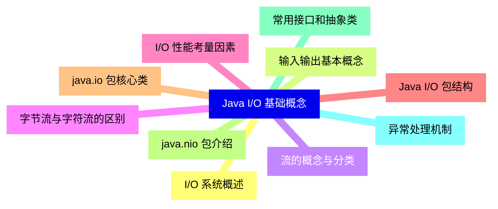
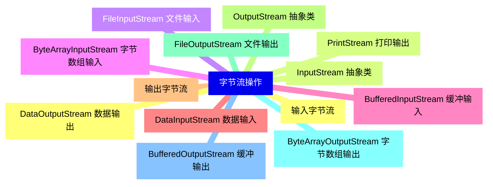
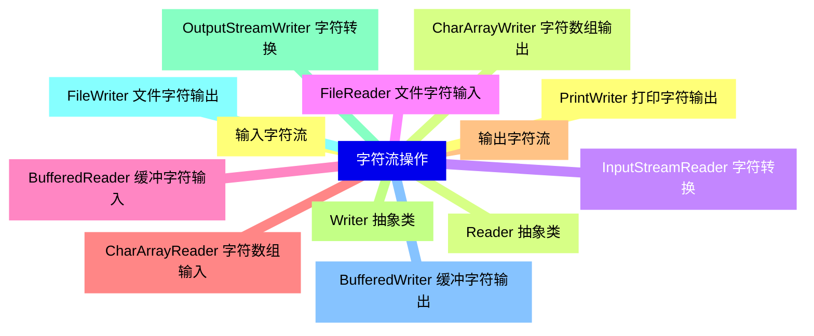
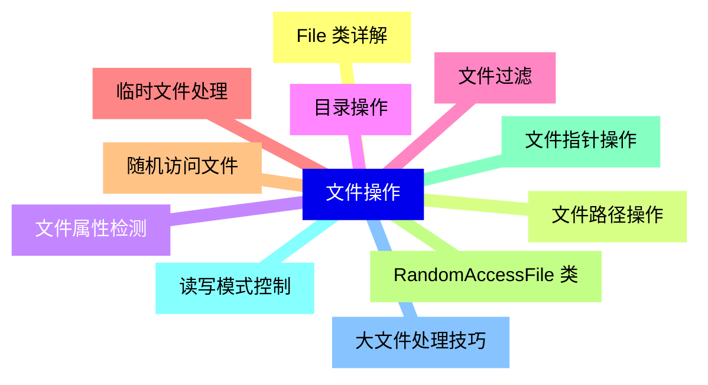
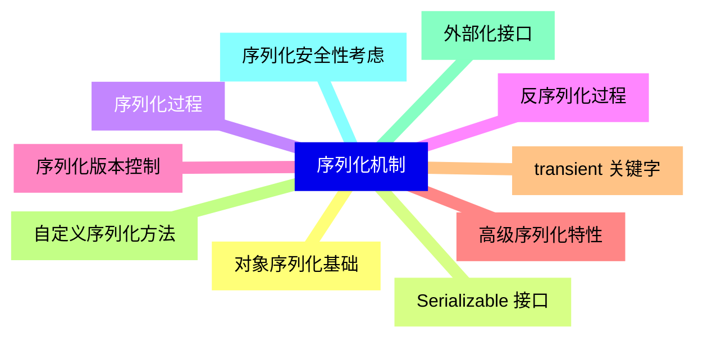
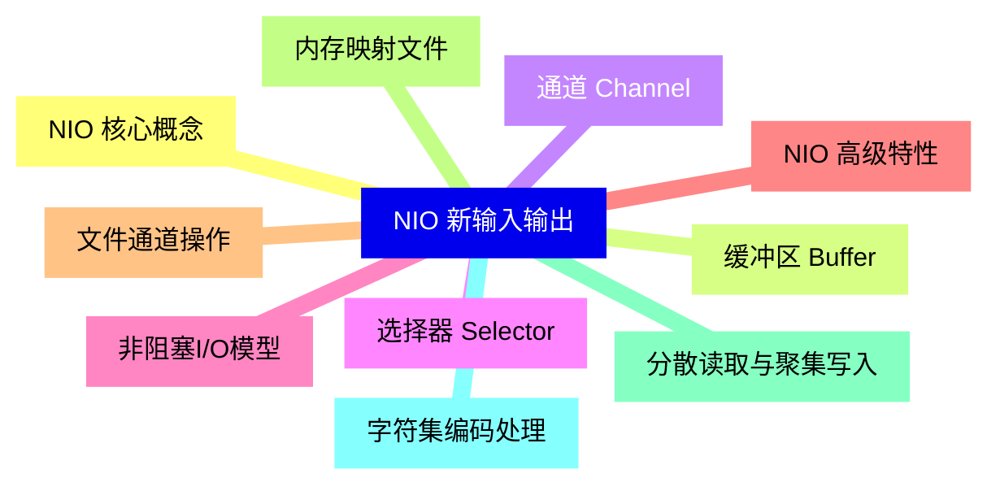
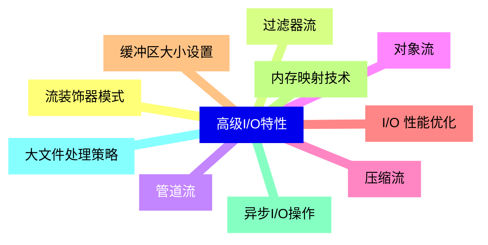
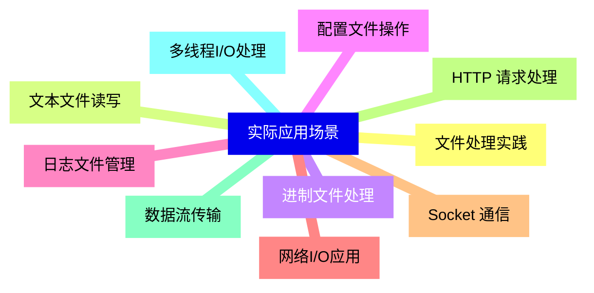
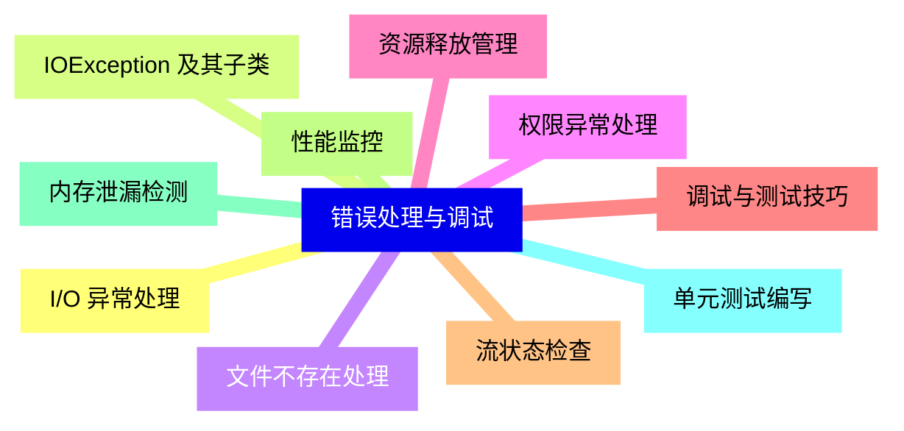


### 1 [Java I/O 基础概念](#1)
#### 1.1 [I/O 系统概述](#1)
#### 1.2 [输入输出基本概念](#1)
#### 1.3 [流的概念与分类](#1)
#### 1.4 [字节流与字符流的区别](#1)
#### 1.5 [I/O 性能考量因素](#1)
#### 1.6 [Java I/O 包结构](#1)
#### 1.7 [java.io 包核心类](#1)
#### 1.8 [java.nio 包介绍](#1)
#### 1.9 [常用接口和抽象类](#1)
#### 1.10 [异常处理机制](#1)
### 2 [字节流操作](#2)
#### 2.1 [输入字节流](#2)
#### 2.2 [InputStream 抽象类](#2)
#### 2.3 [FileInputStream 文件输入](#2)
#### 2.4 [ByteArrayInputStream 字节数组输入](#2)
#### 2.5 [BufferedInputStream 缓冲输入](#2)
#### 2.6 [DataInputStream 数据输入](#2)
#### 2.7 [输出字节流](#2)
#### 2.8 [OutputStream 抽象类](#2)
#### 2.9 [FileOutputStream 文件输出](#2)
#### 2.10 [ByteArrayOutputStream 字节数组输出](#2)
#### 2.11 [BufferedOutputStream 缓冲输出](#2)
#### 2.12 [DataOutputStream 数据输出](#2)
#### 2.13 [PrintStream 打印输出](#2)
### 3 [字符流操作](#3)
#### 3.1 [输入字符流](#3)
#### 3.2 [Reader 抽象类](#3)
#### 3.3 [InputStreamReader 字符转换](#3)
#### 3.4 [FileReader 文件字符输入](#3)
#### 3.5 [BufferedReader 缓冲字符输入](#3)
#### 3.6 [CharArrayReader 字符数组输入](#3)
#### 3.7 [输出字符流](#3)
#### 3.8 [Writer 抽象类](#3)
#### 3.9 [OutputStreamWriter 字符转换](#3)
#### 3.10 [FileWriter 文件字符输出](#3)
#### 3.11 [BufferedWriter 缓冲字符输出](#3)
#### 3.12 [PrintWriter 打印字符输出](#3)
#### 3.13 [CharArrayWriter 字符数组输出](#3)
### 4 [文件操作](#4)
#### 4.1 [File 类详解](#4)
#### 4.2 [文件路径操作](#4)
#### 4.3 [文件属性检测](#4)
#### 4.4 [目录操作](#4)
#### 4.5 [文件过滤](#4)
#### 4.6 [临时文件处理](#4)
#### 4.7 [随机访问文件](#4)
#### 4.8 [RandomAccessFile 类](#4)
#### 4.9 [文件指针操作](#4)
#### 4.10 [读写模式控制](#4)
#### 4.11 [大文件处理技巧](#4)
### 5 [序列化机制](#5)
#### 5.1 [对象序列化基础](#5)
#### 5.2 [Serializable 接口](#5)
#### 5.3 [序列化过程](#5)
#### 5.4 [反序列化过程](#5)
#### 5.5 [序列化版本控制](#5)
#### 5.6 [高级序列化特性](#5)
#### 5.7 [transient 关键字](#5)
#### 5.8 [自定义序列化方法](#5)
#### 5.9 [外部化接口](#5)
#### 5.10 [序列化安全性考虑](#5)
### 6 [NIO 新输入输出](#6)
#### 6.1 [NIO 核心概念](#6)
#### 6.2 [缓冲区 Buffer](#6)
#### 6.3 [通道 Channel](#6)
#### 6.4 [选择器 Selector](#6)
#### 6.5 [非阻塞I/O模型](#6)
#### 6.6 [NIO 高级特性](#6)
#### 6.7 [文件通道操作](#6)
#### 6.8 [内存映射文件](#6)
#### 6.9 [分散读取与聚集写入](#6)
#### 6.10 [字符集编码处理](#6)
### 7 [高级I/O特性](#7)
#### 7.1 [流装饰器模式](#7)
#### 7.2 [过滤器流](#7)
#### 7.3 [管道流](#7)
#### 7.4 [对象流](#7)
#### 7.5 [压缩流](#7)
#### 7.6 [I/O 性能优化](#7)
#### 7.7 [缓冲区大小设置](#7)
#### 7.8 [内存映射技术](#7)
#### 7.9 [异步I/O操作](#7)
#### 7.10 [大文件处理策略](#7)
### 8 [实际应用场景](#8)
#### 8.1 [文件处理实践](#8)
#### 8.2 [文本文件读写](#8)
#### 8.3 [进制文件处理](#8)
#### 8.4 [配置文件操作](#8)
#### 8.5 [日志文件管理](#8)
#### 8.6 [网络I/O应用](#8)
#### 8.7 [Socket 通信](#8)
#### 8.8 [HTTP 请求处理](#8)
#### 8.9 [数据流传输](#8)
#### 8.10 [多线程I/O处理](#8)
### 9 [错误处理与调试](#9)
#### 9.1 [I/O 异常处理](#9)
#### 9.2 [IOException 及其子类](#9)
#### 9.3 [文件不存在处理](#9)
#### 9.4 [权限异常处理](#9)
#### 9.5 [资源释放管理](#9)
#### 9.6 [调试与测试技巧](#9)
#### 9.7 [流状态检查](#9)
#### 9.8 [性能监控](#9)
#### 9.9 [内存泄漏检测](#9)
#### 9.10 [单元测试编写](#9)




### 1 Java I/O 基础概念

---
### 1 Java I/O 基础概念
___
#### 1.1 I/O 系统概述
___
#### 1.2 输入输出基本概念
___
#### 1.3 流的概念与分类
___
#### 1.4 字节流与字符流的区别
___
#### 1.5 I/O 性能考量因素
___
#### 1.6 Java I/O 包结构
___
#### 1.7 java.io 包核心类
___
#### 1.8 java.nio 包介绍
___
#### 1.9 常用接口和抽象类
___
#### 1.10 异常处理机制
### 2 字节流操作

---
### 2 字节流操作
___
#### 2.1 输入字节流
___
#### 2.2 InputStream 抽象类
___
#### 2.3 FileInputStream 文件输入
___
#### 2.4 ByteArrayInputStream 字节数组输入
___
#### 2.5 BufferedInputStream 缓冲输入
___
#### 2.6 DataInputStream 数据输入
___
#### 2.7 输出字节流
___
#### 2.8 OutputStream 抽象类
___
#### 2.9 FileOutputStream 文件输出
___
#### 2.10 ByteArrayOutputStream 字节数组输出
___
#### 2.11 BufferedOutputStream 缓冲输出
___
#### 2.12 DataOutputStream 数据输出
___
#### 2.13 PrintStream 打印输出
### 3 字符流操作

---
### 3 字符流操作
___
#### 3.1 输入字符流
___
#### 3.2 Reader 抽象类
___
#### 3.3 InputStreamReader 字符转换
___
#### 3.4 FileReader 文件字符输入
___
#### 3.5 BufferedReader 缓冲字符输入
___
#### 3.6 CharArrayReader 字符数组输入
___
#### 3.7 输出字符流
___
#### 3.8 Writer 抽象类
___
#### 3.9 OutputStreamWriter 字符转换
___
#### 3.10 FileWriter 文件字符输出
___
#### 3.11 BufferedWriter 缓冲字符输出
___
#### 3.12 PrintWriter 打印字符输出
___
#### 3.13 CharArrayWriter 字符数组输出
### 4 文件操作

---
### 4 文件操作
___
#### 4.1 File 类详解
___
#### 4.2 文件路径操作
___
#### 4.3 文件属性检测
___
#### 4.4 目录操作
___
#### 4.5 文件过滤
___
#### 4.6 临时文件处理
___
#### 4.7 随机访问文件
___
#### 4.8 RandomAccessFile 类
___
#### 4.9 文件指针操作
___
#### 4.10 读写模式控制
___
#### 4.11 大文件处理技巧
### 5 序列化机制

---
### 5 序列化机制
___
#### 5.1 对象序列化基础
___
#### 5.2 Serializable 接口
___
#### 5.3 序列化过程
___
#### 5.4 反序列化过程
___
#### 5.5 序列化版本控制
___
#### 5.6 高级序列化特性
___
#### 5.7 transient 关键字
___
#### 5.8 自定义序列化方法
___
#### 5.9 外部化接口
___
#### 5.10 序列化安全性考虑
### 6 NIO 新输入输出

---
### 6 NIO 新输入输出
___
#### 6.1 NIO 核心概念
___
#### 6.2 缓冲区 Buffer
___
#### 6.3 通道 Channel
___
#### 6.4 选择器 Selector
___
#### 6.5 非阻塞I/O模型
___
#### 6.6 NIO 高级特性
___
#### 6.7 文件通道操作
___
#### 6.8 内存映射文件
___
#### 6.9 分散读取与聚集写入
___
#### 6.10 字符集编码处理
### 7 高级I/O特性

---
### 7 高级I/O特性
___
#### 7.1 流装饰器模式
___
#### 7.2 过滤器流
___
#### 7.3 管道流
___
#### 7.4 对象流
___
#### 7.5 压缩流
___
#### 7.6 I/O 性能优化
___
#### 7.7 缓冲区大小设置
___
#### 7.8 内存映射技术
___
#### 7.9 异步I/O操作
___
#### 7.10 大文件处理策略
### 8 实际应用场景

---
### 8 实际应用场景
___
#### 8.1 文件处理实践
___
#### 8.2 文本文件读写
___
#### 8.3 进制文件处理
___
#### 8.4 配置文件操作
___
#### 8.5 日志文件管理
___
#### 8.6 网络I/O应用
___
#### 8.7 Socket 通信
___
#### 8.8 HTTP 请求处理
___
#### 8.9 数据流传输
___
#### 8.10 多线程I/O处理
### 9 错误处理与调试

---
### 9 错误处理与调试
___
#### 9.1 I/O 异常处理
___
#### 9.2 IOException 及其子类
___
#### 9.3 文件不存在处理
___
#### 9.4 权限异常处理
___
#### 9.5 资源释放管理
___
#### 9.6 调试与测试技巧
___
#### 9.7 流状态检查
___
#### 9.8 性能监控
___
#### 9.9 内存泄漏检测
___
#### 9.10 单元测试编写


### 1 Java I/O 基础概念{#1}

{}

<--->
{}
{}
{}
{}
{}
{}
{}
{}
{}
{}
{}
{}
{}
{}
{}
{}
{}
{}
{}
{}
{}

### 2 字节流操作{#2}

{}
{}
{}
{}
{}
{}
{}
{}
{}
{}
{}
{}
{}
{}
{}
{}
{}
{}
{}
{}
{}
{}
{}
{}
{}
{}
{}
<--->

{}

### 3 字符流操作{#3}

{}

<--->
{}
{}
{}
{}
{}
{}
{}
{}
{}
{}
{}
{}
{}
{}
{}
{}
{}
{}
{}
{}
{}
{}
{}
{}
{}
{}
{}

### 4 文件操作{#4}

{}
{}
{}
{}
{}
{}
{}
{}
{}
{}
{}
{}
{}
{}
{}
{}
{}
{}
{}
{}
{}
{}
{}
<--->

{}

### 5 序列化机制{#5}

{}

<--->
{}
{}
{}
{}
{}
{}
{}
{}
{}
{}
{}
{}
{}
{}
{}
{}
{}
{}
{}
{}
{}

### 6 NIO 新输入输出{#6}

{}
{}
{}
{}
{}
{}
{}
{}
{}
{}
{}
{}
{}
{}
{}
{}
{}
{}
{}
{}
{}
<--->

{}

### 7 高级I/O特性{#7}

{}

<--->
{}
{}
{}
{}
{}
{}
{}
{}
{}
{}
{}
{}
{}
{}
{}
{}
{}
{}
{}
{}
{}

### 8 实际应用场景{#8}

{}
{}
{}
{}
{}
{}
{}
{}
{}
{}
{}
{}
{}
{}
{}
{}
{}
{}
{}
{}
{}
<--->

{}

### 9 错误处理与调试{#9}

{}

<--->
{}
{}
{}
{}
{}
{}
{}
{}
{}
{}
{}
{}
{}
{}
{}
{}
{}
{}
{}
{}
{}
