
### 1 [多线程基础概念](#1)
#### 1.1 [进程与线程](#1)
#### 1.2 [进程定义与特征](#1)
#### 1.3 [线程定义与特征](#1)
#### 1.4 [进程与线程的区别](#1)
#### 1.5 [多线程的优势与劣势](#1)
#### 1.6 [Java线程模型](#1)
#### 1.7 [用户级线程](#1)
#### 1.8 [内核级线程](#1)
#### 1.9 [Java线程实现原理](#1)
#### 1.10 [线程生命周期](#1)
#### 1.11 [并发与并行](#1)
#### 1.12 [并发概念](#1)
#### 1.13 [并行概念](#1)
#### 1.14 [并发与并行的区别](#1)
#### 1.15 [多核处理器与并行计算](#1)
### 2 [线程创建与管理](#2)
#### 2.1 [线程创建方式](#2)
#### 2.2 [继承Thread类](#2)
#### 2.3 [实现Runnable接口](#2)
#### 2.4 [实现Callable接口](#2)
#### 2.5 [使用Executor框架](#2)
#### 2.6 [线程状态管理](#2)
#### 2.7 [NEW状态](#2)
#### 2.8 [RUNNABLE状态](#2)
#### 2.9 [BLOCKED状态](#2)
#### 2.10 [WAITING状态](#2)
#### 2.11 [TIMED_WAITING状态](#2)
#### 2.12 [TERMINATED状态](#2)
#### 2.13 [线程控制方法](#2)
#### 2.14 [start  方法](#2)
#### 2.15 [run  方法](#2)
#### 2.16 [sleep  方法](#2)
#### 2.17 [yield  方法](#2)
#### 2.18 [join  方法](#2)
#### 2.19 [interrupt  方法](#2)
### 3 [线程同步机制](#3)
#### 3.1 [同步基础](#3)
#### 3.2 [临界区概念](#3)
#### 3.3 [竞态条件](#3)
#### 3.4 [数据竞争](#3)
#### 3.5 [内存可见性问题](#3)
#### 3.6 [synchronized关键字](#3)
#### 3.7 [同步方法](#3)
#### 3.8 [同步代码块](#3)
#### 3.9 [对象锁与类锁](#3)
#### 3.10 [锁的重入性](#3)
#### 3.11 [volatile关键字](#3)
#### 3.12 [内存语义](#3)
#### 3.13 [可见性保证](#3)
#### 3.14 [禁止指令重排序](#3)
#### 3.15 [使用场景与限制](#3)
### 4 [锁机制](#4)
#### 4.1 [重入锁 ReentrantLock](#4)
#### 4.2 [公平锁与非公平锁](#4)
#### 4.3 [条件变量 Condition](#4)
#### 4.4 [锁的获取与释放](#4)
#### 4.5 [性能比较](#4)
#### 4.6 [读写锁 ReadWriteLock](#4)
#### 4.7 [读锁与写锁](#4)
#### 4.8 [锁降级](#4)
#### 4.9 [使用场景](#4)
#### 4.10 [性能优化](#4)
#### 4.11 [其他锁类型](#4)
#### 4.12 [StampedLock](#4)
#### 4.13 [自旋锁](#4)
#### 4.14 [偏向锁](#4)
#### 4.15 [轻量级锁](#4)
### 5 [线程间通信](#5)
#### 5.1 [等待/通知机制](#5)
#### 5.2 [wait  方法](#5)
#### 5.3 [notify  方法](#5)
#### 5.4 [notifyAll  方法](#5)
#### 5.5 [生产者-消费者模式](#5)
#### 5.6 [阻塞队列](#5)
#### 5.7 [ArrayBlockingQueue](#5)
#### 5.8 [LinkedBlockingQueue](#5)
#### 5.9 [PriorityBlockingQueue](#5)
#### 5.10 [SynchronousQueue](#5)
#### 5.11 [信号量 Semaphore](#5)
#### 5.12 [计数信号量](#5)
#### 5.13 [进制信号量](#5)
#### 5.14 [资源池管理](#5)
#### 5.15 [限流应用](#5)
### 6 [并发集合](#6)
#### 6.1 [并发List](#6)
#### 6.2 [CopyOnWriteArrayList](#6)
#### 6.3 [写时复制机制](#6)
#### 6.4 [适用场景](#6)
#### 6.5 [并发Set](#6)
#### 6.6 [CopyOnWriteArraySet](#6)
#### 6.7 [ConcurrentSkipListSet](#6)
#### 6.8 [性能比较](#6)
#### 6.9 [并发Map](#6)
#### 6.10 [ConcurrentHashMap](#6)
#### 6.11 [ConcurrentSkipListMap](#6)
#### 6.12 [分段锁机制](#6)
#### 6.13 [弱一致性](#6)
### 7 [线程池](#7)
#### 7.1 [Executor框架](#7)
#### 7.2 [Executor接口](#7)
#### 7.3 [ExecutorService接口](#7)
#### 7.4 [ScheduledExecutorService](#7)
#### 7.5 [Future与Callable](#7)
#### 7.6 [线程池类型](#7)
#### 7.7 [FixedThreadPool](#7)
#### 7.8 [CachedThreadPool](#7)
#### 7.9 [SingleThreadExecutor](#7)
#### 7.10 [ScheduledThreadPool](#7)
#### 7.11 [线程池配置](#7)
#### 7.12 [核心线程数](#7)
#### 7.13 [最大线程数](#7)
#### 7.14 [队列选择](#7)
#### 7.15 [拒绝策略](#7)
### 8 [原子操作](#8)
#### 8.1 [原子变量](#8)
#### 8.2 [AtomicInteger](#8)
#### 8.3 [AtomicLong](#8)
#### 8.4 [AtomicBoolean](#8)
#### 8.5 [AtomicReference](#8)
#### 8.6 [原子数组](#8)
#### 8.7 [AtomicIntegerArray](#8)
#### 8.8 [AtomicLongArray](#8)
#### 8.9 [AtomicReferenceArray](#8)
#### 8.10 [字段更新器](#8)
#### 8.11 [AtomicIntegerFieldUpdater](#8)
#### 8.12 [AtomicLongFieldUpdater](#8)
#### 8.13 [AtomicReferenceFieldUpdater](#8)
### 9 [并发工具类](#9)
#### 9.1 [CountDownLatch](#9)
#### 9.2 [工作原理](#9)
#### 9.3 [使用场景](#9)
#### 9.4 [示例代码](#9)
#### 9.5 [CyclicBarrier](#9)
#### 9.6 [循环屏障](#9)
#### 9.7 [与CountDownLatch比较](#9)
#### 9.8 [应用实例](#9)
#### 9.9 [Exchanger](#9)
#### 9.10 [数据交换](#9)
#### 9.11 [使用模式](#9)
#### 9.12 [注意事项](#9)
### 10 [高级并发特性](#10)
#### 10.1 [Fork/Join框架](#10)
#### 10.2 [工作窃取算法](#10)
#### 10.3 [RecursiveTask](#10)
#### 10.4 [RecursiveAction](#10)
#### 10.5 [并行计算示例](#10)
#### 10.6 [CompletableFuture](#10)
#### 10.7 [异步编程](#10)
#### 10.8 [组合操作](#10)
#### 10.9 [异常处理](#10)
#### 10.10 [回调机制](#10)
#### 10.11 [线程局部变量](#10)
#### 10.12 [ThreadLocal原理](#10)
#### 10.13 [InheritableThreadLocal](#10)
#### 10.14 [内存泄漏问题](#10)
#### 10.15 [使用最佳实践](#10)
### 11 [性能与调优](#11)
#### 11.1 [性能监控](#11)
#### 11.2 [线程转储分析](#11)
#### 11.3 [JConsole使用](#11)
#### 11.4 [VisualVM监控](#11)
#### 11.5 [性能指标](#11)
#### 11.6 [死锁检测与避免](#11)
#### 11.7 [死锁条件](#11)
#### 11.8 [死锁检测](#11)
#### 11.9 [死锁预防](#11)
#### 11.10 [死锁恢复](#11)
#### 11.11 [最佳实践](#11)
#### 11.12 [线程安全设计](#11)
#### 11.13 [资源管理](#11)
#### 11.14 [异常处理](#11)
#### 11.15 [测试策略](#11)
### 12 [Java内存模型](#12)
#### 12.1 [JMM基础](#12)
#### 12.2 [主内存与工作内存](#12)
#### 12.3 [内存屏障](#12)
#### 12.4 [happens-before关系](#12)
#### 12.5 [内存语义](#12)
#### 12.6 [volatile内存语义](#12)
#### 12.7 [synchronized内存语义](#12)
#### 12.8 [final内存语义](#12)
#### 12.9 [指令重排序](#12)
#### 12.10 [编译器重排序](#12)
#### 12.11 [处理器重排序](#12)
#### 12.12 [内存屏障类型](#12)
### 13 [实际应用场景](#13)
#### 13.1 [Web服务器](#13)
#### 13.2 [请求处理](#13)
#### 13.3 [连接池管理](#13)
#### 13.4 [会话管理](#13)
#### 13.5 [数据库操作](#13)
#### 13.6 [连接池](#13)
#### 13.7 [事务管理](#13)
#### 13.8 [批量处理](#13)
#### 13.9 [消息处理](#13)
#### 13.10 [消息队列](#13)
#### 13.11 [事件驱动](#13)
#### 13.12 [异步处理](#13)
### 14 [新特性与未来发展](#14)
#### 14.1 [Java 8+新特性](#14)
#### 14.2 [并行流](#14)
#### 14.3 [CompletableFuture增强](#14)
#### 14.4 [新的并发类](#14)
#### 14.5 [响应式编程](#14)
#### 14.6 [Reactor框架](#14)
#### 14.7 [RxJava](#14)
#### 14.8 [异步数据流](#14)
#### 14.9 [虚拟线程](#14)
#### 14.10 [Project Loom](#14)
#### 14.11 [纤程 Fiber](#14)
#### 14.12 [未来发展方向](#14)





### 1 多线程基础概念


---
### 1 多线程基础概念
___
#### 1.1 进程与线程
___
#### 1.2 进程定义与特征
___
#### 1.3 线程定义与特征
___
#### 1.4 进程与线程的区别
___
#### 1.5 多线程的优势与劣势
___
#### 1.6 Java线程模型
___
#### 1.7 用户级线程
___
#### 1.8 内核级线程
___
#### 1.9 Java线程实现原理
___
#### 1.10 线程生命周期
___
#### 1.11 并发与并行
___
#### 1.12 并发概念
___
#### 1.13 并行概念
___
#### 1.14 并发与并行的区别
___
#### 1.15 多核处理器与并行计算
### 2 线程创建与管理


---
### 2 线程创建与管理
___
#### 2.1 线程创建方式
___
#### 2.2 继承Thread类
___
#### 2.3 实现Runnable接口
___
#### 2.4 实现Callable接口
___
#### 2.5 使用Executor框架
___
#### 2.6 线程状态管理
___
#### 2.7 NEW状态
___
#### 2.8 RUNNABLE状态
___
#### 2.9 BLOCKED状态
___
#### 2.10 WAITING状态
___
#### 2.11 TIMED_WAITING状态
___
#### 2.12 TERMINATED状态
___
#### 2.13 线程控制方法
___
#### 2.14 start  方法
___
#### 2.15 run  方法
___
#### 2.16 sleep  方法
___
#### 2.17 yield  方法
___
#### 2.18 join  方法
___
#### 2.19 interrupt  方法
### 3 线程同步机制


---
### 3 线程同步机制
___
#### 3.1 同步基础
___
#### 3.2 临界区概念
___
#### 3.3 竞态条件
___
#### 3.4 数据竞争
___
#### 3.5 内存可见性问题
___
#### 3.6 synchronized关键字
___
#### 3.7 同步方法
___
#### 3.8 同步代码块
___
#### 3.9 对象锁与类锁
___
#### 3.10 锁的重入性
___
#### 3.11 volatile关键字
___
#### 3.12 内存语义
___
#### 3.13 可见性保证
___
#### 3.14 禁止指令重排序
___
#### 3.15 使用场景与限制
### 4 锁机制


---
### 4 锁机制
___
#### 4.1 重入锁 ReentrantLock
___
#### 4.2 公平锁与非公平锁
___
#### 4.3 条件变量 Condition
___
#### 4.4 锁的获取与释放
___
#### 4.5 性能比较
___
#### 4.6 读写锁 ReadWriteLock
___
#### 4.7 读锁与写锁
___
#### 4.8 锁降级
___
#### 4.9 使用场景
___
#### 4.10 性能优化
___
#### 4.11 其他锁类型
___
#### 4.12 StampedLock
___
#### 4.13 自旋锁
___
#### 4.14 偏向锁
___
#### 4.15 轻量级锁
### 5 线程间通信


---
### 5 线程间通信
___
#### 5.1 等待/通知机制
___
#### 5.2 wait  方法
___
#### 5.3 notify  方法
___
#### 5.4 notifyAll  方法
___
#### 5.5 生产者-消费者模式
___
#### 5.6 阻塞队列
___
#### 5.7 ArrayBlockingQueue
___
#### 5.8 LinkedBlockingQueue
___
#### 5.9 PriorityBlockingQueue
___
#### 5.10 SynchronousQueue
___
#### 5.11 信号量 Semaphore
___
#### 5.12 计数信号量
___
#### 5.13 进制信号量
___
#### 5.14 资源池管理
___
#### 5.15 限流应用
### 6 并发集合


---
### 6 并发集合
___
#### 6.1 并发List
___
#### 6.2 CopyOnWriteArrayList
___
#### 6.3 写时复制机制
___
#### 6.4 适用场景
___
#### 6.5 并发Set
___
#### 6.6 CopyOnWriteArraySet
___
#### 6.7 ConcurrentSkipListSet
___
#### 6.8 性能比较
___
#### 6.9 并发Map
___
#### 6.10 ConcurrentHashMap
___
#### 6.11 ConcurrentSkipListMap
___
#### 6.12 分段锁机制
___
#### 6.13 弱一致性
### 7 线程池


---
### 7 线程池
___
#### 7.1 Executor框架
___
#### 7.2 Executor接口
___
#### 7.3 ExecutorService接口
___
#### 7.4 ScheduledExecutorService
___
#### 7.5 Future与Callable
___
#### 7.6 线程池类型
___
#### 7.7 FixedThreadPool
___
#### 7.8 CachedThreadPool
___
#### 7.9 SingleThreadExecutor
___
#### 7.10 ScheduledThreadPool
___
#### 7.11 线程池配置
___
#### 7.12 核心线程数
___
#### 7.13 最大线程数
___
#### 7.14 队列选择
___
#### 7.15 拒绝策略
### 8 原子操作


---
### 8 原子操作
___
#### 8.1 原子变量
___
#### 8.2 AtomicInteger
___
#### 8.3 AtomicLong
___
#### 8.4 AtomicBoolean
___
#### 8.5 AtomicReference
___
#### 8.6 原子数组
___
#### 8.7 AtomicIntegerArray
___
#### 8.8 AtomicLongArray
___
#### 8.9 AtomicReferenceArray
___
#### 8.10 字段更新器
___
#### 8.11 AtomicIntegerFieldUpdater
___
#### 8.12 AtomicLongFieldUpdater
___
#### 8.13 AtomicReferenceFieldUpdater
### 9 并发工具类


---
### 9 并发工具类
___
#### 9.1 CountDownLatch
___
#### 9.2 工作原理
___
#### 9.3 使用场景
___
#### 9.4 示例代码
___
#### 9.5 CyclicBarrier
___
#### 9.6 循环屏障
___
#### 9.7 与CountDownLatch比较
___
#### 9.8 应用实例
___
#### 9.9 Exchanger
___
#### 9.10 数据交换
___
#### 9.11 使用模式
___
#### 9.12 注意事项
### 10 高级并发特性


---
### 10 高级并发特性
___
#### 10.1 Fork/Join框架
___
#### 10.2 工作窃取算法
___
#### 10.3 RecursiveTask
___
#### 10.4 RecursiveAction
___
#### 10.5 并行计算示例
___
#### 10.6 CompletableFuture
___
#### 10.7 异步编程
___
#### 10.8 组合操作
___
#### 10.9 异常处理
___
#### 10.10 回调机制
___
#### 10.11 线程局部变量
___
#### 10.12 ThreadLocal原理
___
#### 10.13 InheritableThreadLocal
___
#### 10.14 内存泄漏问题
___
#### 10.15 使用最佳实践
### 11 性能与调优


---
### 11 性能与调优
___
#### 11.1 性能监控
___
#### 11.2 线程转储分析
___
#### 11.3 JConsole使用
___
#### 11.4 VisualVM监控
___
#### 11.5 性能指标
___
#### 11.6 死锁检测与避免
___
#### 11.7 死锁条件
___
#### 11.8 死锁检测
___
#### 11.9 死锁预防
___
#### 11.10 死锁恢复
___
#### 11.11 最佳实践
___
#### 11.12 线程安全设计
___
#### 11.13 资源管理
___
#### 11.14 异常处理
___
#### 11.15 测试策略
### 12 Java内存模型


---
### 12 Java内存模型
___
#### 12.1 JMM基础
___
#### 12.2 主内存与工作内存
___
#### 12.3 内存屏障
___
#### 12.4 happens-before关系
___
#### 12.5 内存语义
___
#### 12.6 volatile内存语义
___
#### 12.7 synchronized内存语义
___
#### 12.8 final内存语义
___
#### 12.9 指令重排序
___
#### 12.10 编译器重排序
___
#### 12.11 处理器重排序
___
#### 12.12 内存屏障类型
### 13 实际应用场景


---
### 13 实际应用场景
___
#### 13.1 Web服务器
___
#### 13.2 请求处理
___
#### 13.3 连接池管理
___
#### 13.4 会话管理
___
#### 13.5 数据库操作
___
#### 13.6 连接池
___
#### 13.7 事务管理
___
#### 13.8 批量处理
___
#### 13.9 消息处理
___
#### 13.10 消息队列
___
#### 13.11 事件驱动
___
#### 13.12 异步处理
### 14 新特性与未来发展


---
### 14 新特性与未来发展
___
#### 14.1 Java 8+新特性
___
#### 14.2 并行流
___
#### 14.3 CompletableFuture增强
___
#### 14.4 新的并发类
___
#### 14.5 响应式编程
___
#### 14.6 Reactor框架
___
#### 14.7 RxJava
___
#### 14.8 异步数据流
___
#### 14.9 虚拟线程
___
#### 14.10 Project Loom
___
#### 14.11 纤程 Fiber
___
#### 14.12 未来发展方向



### 1 多线程基础概念{#1}


{}
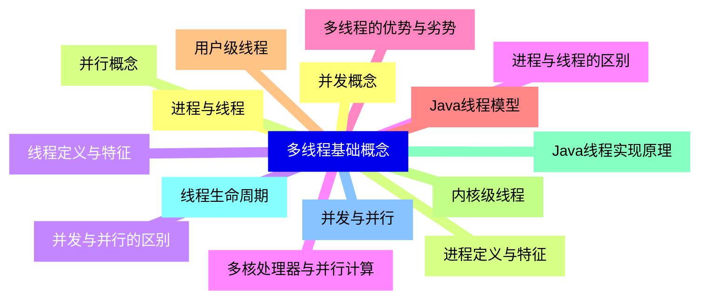

<--->
{}
{}
{}
{}
{}
{}
{}
{}
{}
{}
{}
{}
{}
{}
{}
{}
{}
{}
{}
{}
{}
{}
{}
{}
{}
{}
{}
{}
{}
{}
{}

### 2 线程创建与管理{#2}


{}
{}
{}
{}
{}
{}
{}
{}
{}
{}
{}
{}
{}
{}
{}
{}
{}
{}
{}
{}
{}
{}
{}
{}
{}
{}
{}
{}
{}
{}
{}
{}
{}
{}
{}
{}
{}
{}
{}
<--->
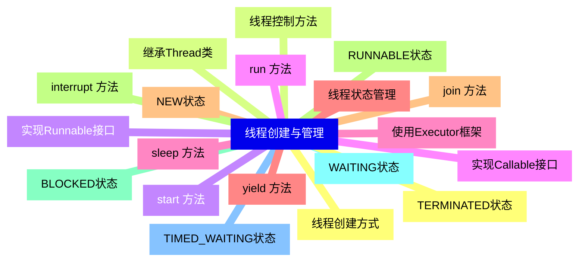

{}

### 3 线程同步机制{#3}


{}
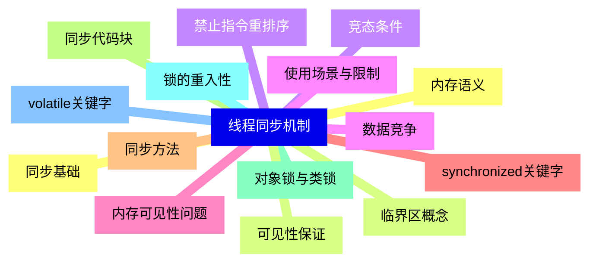

<--->
{}
{}
{}
{}
{}
{}
{}
{}
{}
{}
{}
{}
{}
{}
{}
{}
{}
{}
{}
{}
{}
{}
{}
{}
{}
{}
{}
{}
{}
{}
{}

### 4 锁机制{#4}


{}
{}
{}
{}
{}
{}
{}
{}
{}
{}
{}
{}
{}
{}
{}
{}
{}
{}
{}
{}
{}
{}
{}
{}
{}
{}
{}
{}
{}
{}
{}
<--->
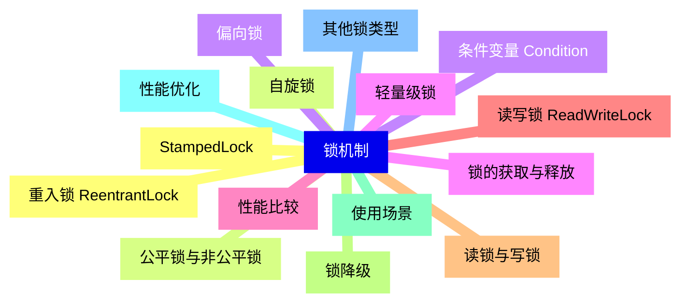

{}

### 5 线程间通信{#5}


{}
```mermaid
mindmap
    id5[线程间通信]
        id5-1[等待/通知机制]
        id5-2[wait  方法]
        id5-3[notify  方法]
        id5-4[notifyAll  方法]
        id5-5[生产者-消费者模式]
        id5-6[阻塞队列]
        id5-7[ArrayBlockingQueue]
        id5-8[LinkedBlockingQueue]
        id5-9[PriorityBlockingQueue]
        id5-10[SynchronousQueue]
        id5-11[信号量 Semaphore]
        id5-12[计数信号量]
        id5-13[进制信号量]
        id5-14[资源池管理]
        id5-15[限流应用]
```

<--->
{}
{}
{}
{}
{}
{}
{}
{}
{}
{}
{}
{}
{}
{}
{}
{}
{}
{}
{}
{}
{}
{}
{}
{}
{}
{}
{}
{}
{}
{}
{}

### 6 并发集合{#6}


{}
{}
{}
{}
{}
{}
{}
{}
{}
{}
{}
{}
{}
{}
{}
{}
{}
{}
{}
{}
{}
{}
{}
{}
{}
{}
{}
<--->
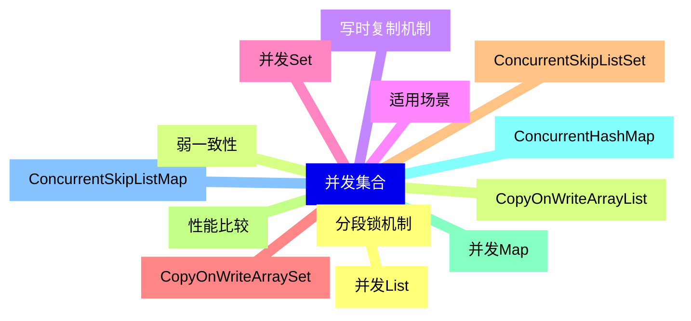

{}

### 7 线程池{#7}


{}
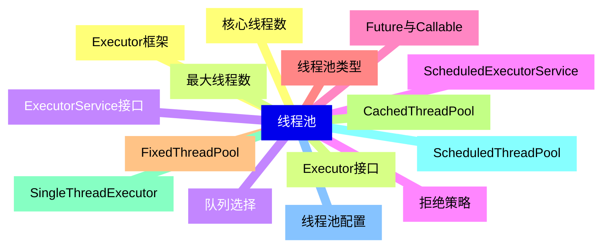

<--->
{}
{}
{}
{}
{}
{}
{}
{}
{}
{}
{}
{}
{}
{}
{}
{}
{}
{}
{}
{}
{}
{}
{}
{}
{}
{}
{}
{}
{}
{}
{}

### 8 原子操作{#8}


{}
{}
{}
{}
{}
{}
{}
{}
{}
{}
{}
{}
{}
{}
{}
{}
{}
{}
{}
{}
{}
{}
{}
{}
{}
{}
{}
<--->
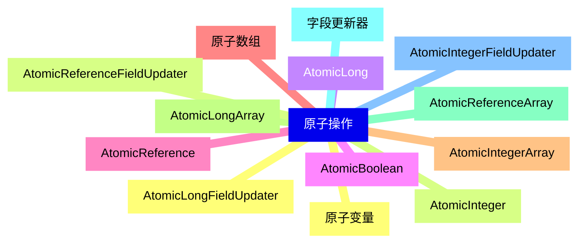

{}

### 9 并发工具类{#9}


{}
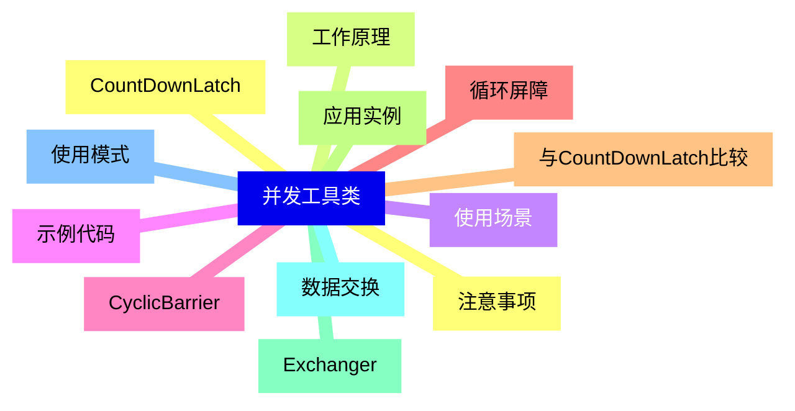

<--->
{}
{}
{}
{}
{}
{}
{}
{}
{}
{}
{}
{}
{}
{}
{}
{}
{}
{}
{}
{}
{}
{}
{}
{}
{}

### 10 高级并发特性{#10}


{}
{}
{}
{}
{}
{}
{}
{}
{}
{}
{}
{}
{}
{}
{}
{}
{}
{}
{}
{}
{}
{}
{}
{}
{}
{}
{}
{}
{}
{}
{}
<--->
```mermaid
mindmap
    id10[高级并发特性]
        id10-1[Fork/Join框架]
        id10-2[工作窃取算法]
        id10-3[RecursiveTask]
        id10-4[RecursiveAction]
        id10-5[并行计算示例]
        id10-6[CompletableFuture]
        id10-7[异步编程]
        id10-8[组合操作]
        id10-9[异常处理]
        id10-10[回调机制]
        id10-11[线程局部变量]
        id10-12[ThreadLocal原理]
        id10-13[InheritableThreadLocal]
        id10-14[内存泄漏问题]
        id10-15[使用最佳实践]
```

{}

### 11 性能与调优{#11}


{}
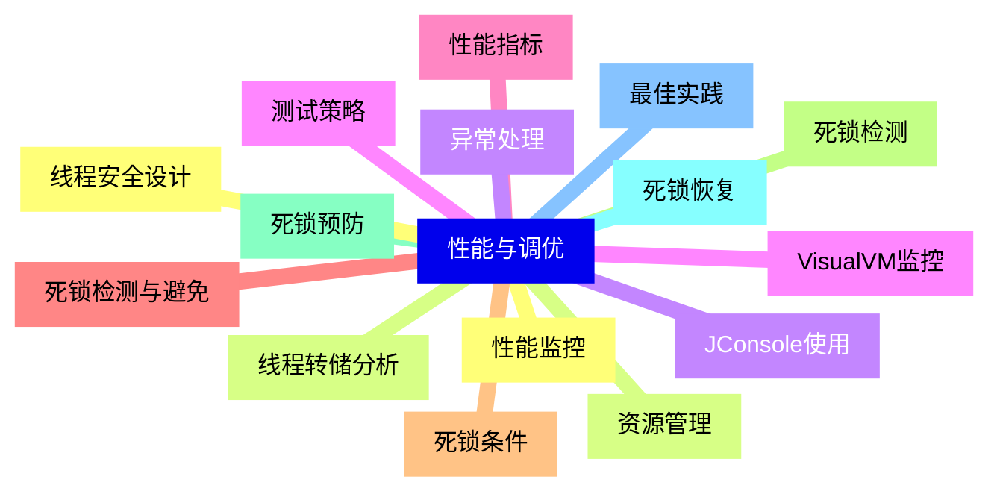

<--->
{}
{}
{}
{}
{}
{}
{}
{}
{}
{}
{}
{}
{}
{}
{}
{}
{}
{}
{}
{}
{}
{}
{}
{}
{}
{}
{}
{}
{}
{}
{}

### 12 Java内存模型{#12}


{}
{}
{}
{}
{}
{}
{}
{}
{}
{}
{}
{}
{}
{}
{}
{}
{}
{}
{}
{}
{}
{}
{}
{}
{}
<--->
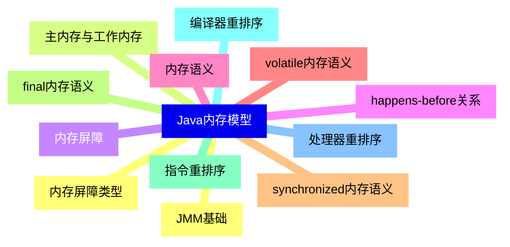

{}

### 13 实际应用场景{#13}


{}
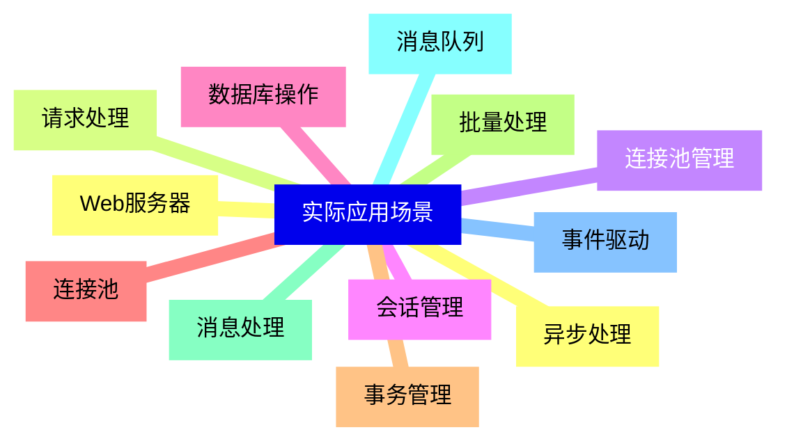

<--->
{}
{}
{}
{}
{}
{}
{}
{}
{}
{}
{}
{}
{}
{}
{}
{}
{}
{}
{}
{}
{}
{}
{}
{}
{}

### 14 新特性与未来发展{#14}


{}
{}
{}
{}
{}
{}
{}
{}
{}
{}
{}
{}
{}
{}
{}
{}
{}
{}
{}
{}
{}
{}
{}
{}
{}
<--->
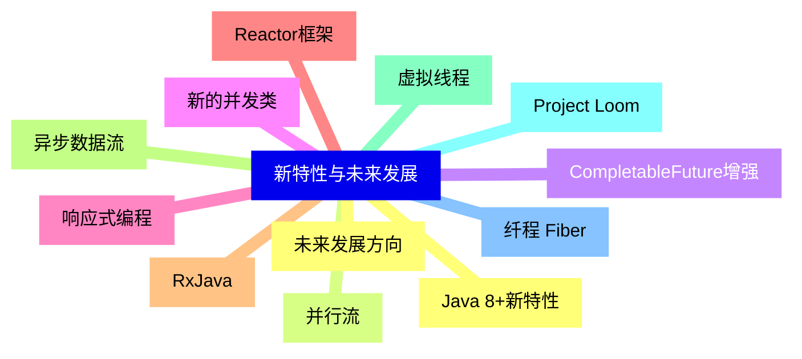

{}
