
### 1 [泛型基础概念](#1)
#### 1.1 [泛型简介](#1)
#### 1.2 [泛型的定义与目的](#1)
#### 1.3 [类型安全的重要性](#1)
#### 1.4 [编译时类型检查的优势](#1)
#### 1.5 [泛型在集合框架中的应用](#1)
#### 1.6 [泛型类型参数](#1)
#### 1.7 [类型参数的命名约定](#1)
#### 1.8 [单类型参数与多类型参数](#1)
#### 1.9 [有界类型参数](#1)
#### 1.10 [通配符类型参数](#1)
#### 1.11 [泛型类](#1)
#### 1.12 [泛型类的声明语法](#1)
#### 1.13 [泛型类的实例化](#1)
#### 1.14 [泛型类的继承关系](#1)
#### 1.15 [泛型类的类型推断](#1)
### 2 [泛型方法](#2)
#### 2.1 [泛型方法基础](#2)
#### 2.2 [泛型方法的定义语法](#2)
#### 2.3 [类型参数的声明位置](#2)
#### 2.4 [泛型方法的调用方式](#2)
#### 2.5 [静态泛型方法](#2)
#### 2.6 [类型推断机制](#2)
#### 2.7 [编译器类型推断规则](#2)
#### 2.8 [显式类型参数指定](#2)
#### 2.9 [方法重载与类型推断](#2)
#### 2.10 [类型推断的限制](#2)
#### 2.11 [泛型构造器](#2)
#### 2.12 [泛型构造器的定义](#2)
#### 2.13 [构造器类型参数](#2)
#### 2.14 [泛型构造器的使用场景](#2)
### 3 [泛型接口](#3)
#### 3.1 [泛型接口定义](#3)
#### 3.2 [泛型接口的声明语法](#3)
#### 3.3 [接口类型参数的使用](#3)
#### 3.4 [泛型接口的实现](#3)
#### 3.5 [泛型接口继承](#3)
#### 3.6 [泛型接口的继承关系](#3)
#### 3.7 [子接口的类型参数](#3)
#### 3.8 [多重泛型接口实现](#3)
### 4 [类型边界](#4)
#### 4.1 [上界通配符](#4)
#### 4.2 [extends关键字的使用](#4)
#### 4.3 [上界通配符的语义](#4)
#### 4.4 [上界通配符的读取操作](#4)
#### 4.5 [上界通配符的限制](#4)
#### 4.6 [下界通配符](#4)
#### 4.7 [super关键字的使用](#4)
#### 4.8 [下界通配符的语义](#4)
#### 4.9 [下界通配符的写入操作](#4)
#### 4.10 [下界通配符的应用场景](#4)
#### 4.11 [无界通配符](#4)
#### 4.12 [问号通配符的使用](#4)
#### 4.13 [无界通配符的限制](#4)
#### 4.14 [无界通配符的适用情况](#4)
### 5 [类型擦除](#5)
#### 5.1 [类型擦除机制](#5)
#### 5.2 [类型擦除的基本原理](#5)
#### 5.3 [擦除后的字节码表示](#5)
#### 5.4 [桥接方法的生成](#5)
#### 5.5 [类型擦除的优缺点](#5)
#### 5.6 [擦除的影响](#5)
#### 5.7 [运行时类型信息丢失](#5)
#### 5.8 [instanceof操作的限制](#5)
#### 5.9 [数组创建的限制](#5)
#### 5.10 [异常处理的限制](#5)
#### 5.11 [绕过擦除的方法](#5)
#### 5.12 [类型令牌模式](#5)
#### 5.13 [显式传递Class对象](#5)
#### 5.14 [反射机制的使用](#5)
### 6 [泛型与继承](#6)
#### 6.1 [泛型类的继承](#6)
#### 6.2 [泛型父类的继承](#6)
#### 6.3 [类型参数的传递](#6)
#### 6.4 [泛型子类的定义](#6)
#### 6.5 [通配符与继承](#6)
#### 6.6 [通配符的协变性](#6)
#### 6.7 [通配符的逆变性](#6)
#### 6.8 [PECS原则 Producer Extends, Consumer Super](#6)
#### 6.9 [泛型与多态](#6)
#### 6.10 [泛型方法的重写](#6)
#### 6.11 [桥接方法的作用](#6)
#### 6.12 [泛型与动态绑定的关系](#6)
### 7 [泛型约束与限制](#7)
#### 7.1 [基本类型限制](#7)
#### 7.2 [不能使用基本类型作为类型参数](#7)
#### 7.3 [自动装箱与拆箱](#7)
#### 7.4 [性能考虑](#7)
#### 7.5 [实例化限制](#7)
#### 7.6 [不能实例化类型参数](#7)
#### 7.7 [不能创建泛型数组](#7)
#### 7.8 [静态上下文中的限制](#7)
#### 7.9 [其他限制](#7)
#### 7.10 [不能抛出或捕获泛型类实例](#7)
#### 7.11 [不能重载具有相同擦除的方法](#7)
#### 7.12 [枚举类型的泛型限制](#7)
### 8 [高级泛型特性](#8)
#### 8.1 [递归类型边界](#8)
#### 8.2 [递归类型边界的定义](#8)
#### 8.3 [递归类型边界的应用](#8)
#### 8.4 [Comparable接口的实现](#8)
#### 8.5 [自限定类型](#8)
#### 8.6 [自限定类型的概念](#8)
#### 8.7 [自限定类型的模式](#8)
#### 8.8 [自限定类型的应用场景](#8)
#### 8.9 [泛型与可变参数](#8)
#### 8.10 [可变参数与泛型的结合](#8)
#### 8.11 [堆污染问题](#8)
#### 8.12 [@SafeVarargs注解](#8)
### 9 [泛型在实际开发中的应用](#9)
#### 9.1 [集合框架中的泛型](#9)
#### 9.2 [List、Set、Map的泛型使用](#9)
#### 9.3 [迭代器与泛型](#9)
#### 9.4 [集合工具类中的泛型](#9)
#### 9.5 [函数式接口与泛型](#9)
#### 9.6 [泛型函数式接口](#9)
#### 9.7 [Lambda表达式中的类型推断](#9)
#### 9.8 [方法引用与泛型](#9)
#### 9.9 [设计模式中的泛型](#9)
#### 9.10 [工厂模式与泛型](#9)
#### 9.11 [建造者模式与泛型](#9)
#### 9.12 [策略模式与泛型](#9)
### 10 [泛型最佳实践](#10)
#### 10.1 [编码规范](#10)
#### 10.2 [类型参数的命名规范](#10)
#### 10.3 [通配符的使用时机](#10)
#### 10.4 [泛型方法的组织](#10)
#### 10.5 [性能优化](#10)
#### 10.6 [避免不必要的泛型使用](#10)
#### 10.7 [类型擦除的性能影响](#10)
#### 10.8 [泛型与反射的性能权衡](#10)
#### 10.9 [调试与测试](#10)
#### 10.10 [泛型相关的编译错误](#10)
#### 10.11 [运行时类型检查](#10)
#### 10.12 [泛型代码的单元测试](#10)
### 11 [泛型与其他语言的比较](#11)
#### 11.1 [C#泛型比较](#11)
#### 11.2 [类型擦除与具体化](#11)
#### 11.3 [性能差异比较](#11)
#### 11.4 [语法差异分析](#11)
#### 11.5 [C++模板比较](#11)
#### 11.6 [编译时机制对比](#11)
#### 11.7 [元编程能力比较](#11)
#### 11.8 [类型安全性的差异](#11)
### 12 [未来发展趋势](#12)
#### 12.1 [项目Valhalla](#12)
#### 12.2 [值类型与泛型的结合](#12)
#### 12.3 [泛型特化的前景](#12)
#### 12.4 [性能改进的方向](#12)
#### 12.5 [泛型演进](#12)
#### 12.6 [新语言特性的影响](#12)
#### 12.7 [社区需求与发展](#12)
#### 12.8 [向后兼容性考虑](#12)




### 1 泛型基础概念

---
### 1 泛型基础概念
___
#### 1.1 泛型简介
___
#### 1.2 泛型的定义与目的
___
#### 1.3 类型安全的重要性
___
#### 1.4 编译时类型检查的优势
___
#### 1.5 泛型在集合框架中的应用
___
#### 1.6 泛型类型参数
___
#### 1.7 类型参数的命名约定
___
#### 1.8 单类型参数与多类型参数
___
#### 1.9 有界类型参数
___
#### 1.10 通配符类型参数
___
#### 1.11 泛型类
___
#### 1.12 泛型类的声明语法
___
#### 1.13 泛型类的实例化
___
#### 1.14 泛型类的继承关系
___
#### 1.15 泛型类的类型推断
### 2 泛型方法

---
### 2 泛型方法
___
#### 2.1 泛型方法基础
___
#### 2.2 泛型方法的定义语法
___
#### 2.3 类型参数的声明位置
___
#### 2.4 泛型方法的调用方式
___
#### 2.5 静态泛型方法
___
#### 2.6 类型推断机制
___
#### 2.7 编译器类型推断规则
___
#### 2.8 显式类型参数指定
___
#### 2.9 方法重载与类型推断
___
#### 2.10 类型推断的限制
___
#### 2.11 泛型构造器
___
#### 2.12 泛型构造器的定义
___
#### 2.13 构造器类型参数
___
#### 2.14 泛型构造器的使用场景
### 3 泛型接口

---
### 3 泛型接口
___
#### 3.1 泛型接口定义
___
#### 3.2 泛型接口的声明语法
___
#### 3.3 接口类型参数的使用
___
#### 3.4 泛型接口的实现
___
#### 3.5 泛型接口继承
___
#### 3.6 泛型接口的继承关系
___
#### 3.7 子接口的类型参数
___
#### 3.8 多重泛型接口实现
### 4 类型边界

---
### 4 类型边界
___
#### 4.1 上界通配符
___
#### 4.2 extends关键字的使用
___
#### 4.3 上界通配符的语义
___
#### 4.4 上界通配符的读取操作
___
#### 4.5 上界通配符的限制
___
#### 4.6 下界通配符
___
#### 4.7 super关键字的使用
___
#### 4.8 下界通配符的语义
___
#### 4.9 下界通配符的写入操作
___
#### 4.10 下界通配符的应用场景
___
#### 4.11 无界通配符
___
#### 4.12 问号通配符的使用
___
#### 4.13 无界通配符的限制
___
#### 4.14 无界通配符的适用情况
### 5 类型擦除

---
### 5 类型擦除
___
#### 5.1 类型擦除机制
___
#### 5.2 类型擦除的基本原理
___
#### 5.3 擦除后的字节码表示
___
#### 5.4 桥接方法的生成
___
#### 5.5 类型擦除的优缺点
___
#### 5.6 擦除的影响
___
#### 5.7 运行时类型信息丢失
___
#### 5.8 instanceof操作的限制
___
#### 5.9 数组创建的限制
___
#### 5.10 异常处理的限制
___
#### 5.11 绕过擦除的方法
___
#### 5.12 类型令牌模式
___
#### 5.13 显式传递Class对象
___
#### 5.14 反射机制的使用
### 6 泛型与继承

---
### 6 泛型与继承
___
#### 6.1 泛型类的继承
___
#### 6.2 泛型父类的继承
___
#### 6.3 类型参数的传递
___
#### 6.4 泛型子类的定义
___
#### 6.5 通配符与继承
___
#### 6.6 通配符的协变性
___
#### 6.7 通配符的逆变性
___
#### 6.8 PECS原则 Producer Extends, Consumer Super
___
#### 6.9 泛型与多态
___
#### 6.10 泛型方法的重写
___
#### 6.11 桥接方法的作用
___
#### 6.12 泛型与动态绑定的关系
### 7 泛型约束与限制

---
### 7 泛型约束与限制
___
#### 7.1 基本类型限制
___
#### 7.2 不能使用基本类型作为类型参数
___
#### 7.3 自动装箱与拆箱
___
#### 7.4 性能考虑
___
#### 7.5 实例化限制
___
#### 7.6 不能实例化类型参数
___
#### 7.7 不能创建泛型数组
___
#### 7.8 静态上下文中的限制
___
#### 7.9 其他限制
___
#### 7.10 不能抛出或捕获泛型类实例
___
#### 7.11 不能重载具有相同擦除的方法
___
#### 7.12 枚举类型的泛型限制
### 8 高级泛型特性

---
### 8 高级泛型特性
___
#### 8.1 递归类型边界
___
#### 8.2 递归类型边界的定义
___
#### 8.3 递归类型边界的应用
___
#### 8.4 Comparable接口的实现
___
#### 8.5 自限定类型
___
#### 8.6 自限定类型的概念
___
#### 8.7 自限定类型的模式
___
#### 8.8 自限定类型的应用场景
___
#### 8.9 泛型与可变参数
___
#### 8.10 可变参数与泛型的结合
___
#### 8.11 堆污染问题
___
#### 8.12 @SafeVarargs注解
### 9 泛型在实际开发中的应用

---
### 9 泛型在实际开发中的应用
___
#### 9.1 集合框架中的泛型
___
#### 9.2 List、Set、Map的泛型使用
___
#### 9.3 迭代器与泛型
___
#### 9.4 集合工具类中的泛型
___
#### 9.5 函数式接口与泛型
___
#### 9.6 泛型函数式接口
___
#### 9.7 Lambda表达式中的类型推断
___
#### 9.8 方法引用与泛型
___
#### 9.9 设计模式中的泛型
___
#### 9.10 工厂模式与泛型
___
#### 9.11 建造者模式与泛型
___
#### 9.12 策略模式与泛型
### 10 泛型最佳实践

---
### 10 泛型最佳实践
___
#### 10.1 编码规范
___
#### 10.2 类型参数的命名规范
___
#### 10.3 通配符的使用时机
___
#### 10.4 泛型方法的组织
___
#### 10.5 性能优化
___
#### 10.6 避免不必要的泛型使用
___
#### 10.7 类型擦除的性能影响
___
#### 10.8 泛型与反射的性能权衡
___
#### 10.9 调试与测试
___
#### 10.10 泛型相关的编译错误
___
#### 10.11 运行时类型检查
___
#### 10.12 泛型代码的单元测试
### 11 泛型与其他语言的比较

---
### 11 泛型与其他语言的比较
___
#### 11.1 C#泛型比较
___
#### 11.2 类型擦除与具体化
___
#### 11.3 性能差异比较
___
#### 11.4 语法差异分析
___
#### 11.5 C++模板比较
___
#### 11.6 编译时机制对比
___
#### 11.7 元编程能力比较
___
#### 11.8 类型安全性的差异
### 12 未来发展趋势

---
### 12 未来发展趋势
___
#### 12.1 项目Valhalla
___
#### 12.2 值类型与泛型的结合
___
#### 12.3 泛型特化的前景
___
#### 12.4 性能改进的方向
___
#### 12.5 泛型演进
___
#### 12.6 新语言特性的影响
___
#### 12.7 社区需求与发展
___
#### 12.8 向后兼容性考虑


### 1 泛型基础概念{#1}

{}
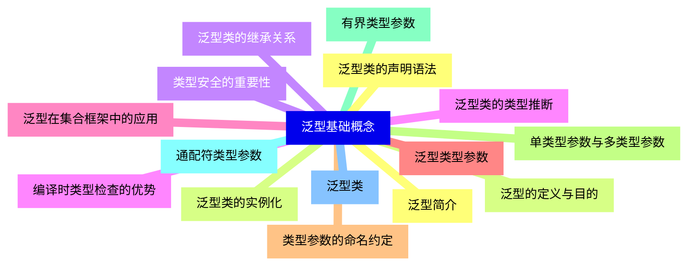

<--->
{}
{}
{}
{}
{}
{}
{}
{}
{}
{}
{}
{}
{}
{}
{}
{}
{}
{}
{}
{}
{}
{}
{}
{}
{}
{}
{}
{}
{}
{}
{}

### 2 泛型方法{#2}

{}
{}
{}
{}
{}
{}
{}
{}
{}
{}
{}
{}
{}
{}
{}
{}
{}
{}
{}
{}
{}
{}
{}
{}
{}
{}
{}
{}
{}
<--->
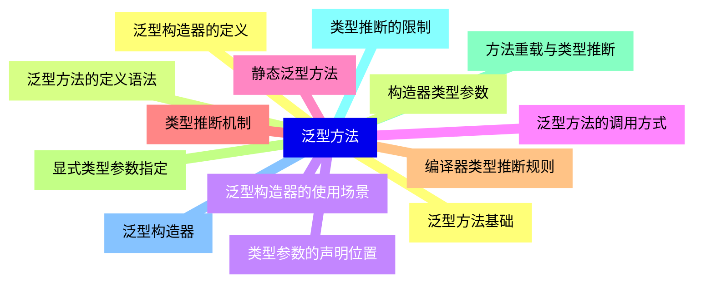

{}

### 3 泛型接口{#3}

{}
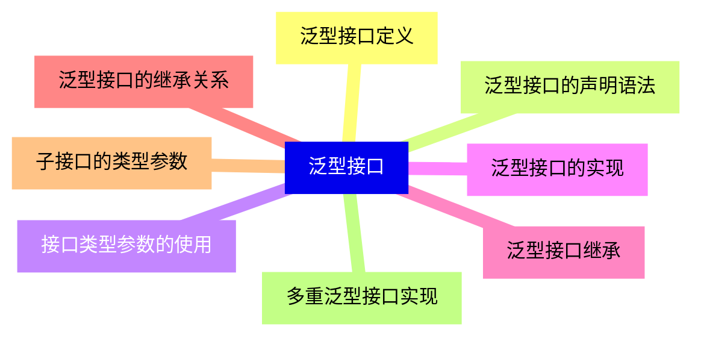

<--->
{}
{}
{}
{}
{}
{}
{}
{}
{}
{}
{}
{}
{}
{}
{}
{}
{}

### 4 类型边界{#4}

{}
{}
{}
{}
{}
{}
{}
{}
{}
{}
{}
{}
{}
{}
{}
{}
{}
{}
{}
{}
{}
{}
{}
{}
{}
{}
{}
{}
{}
<--->
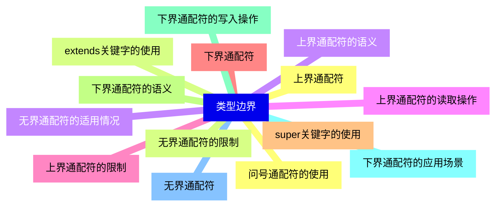

{}

### 5 类型擦除{#5}

{}
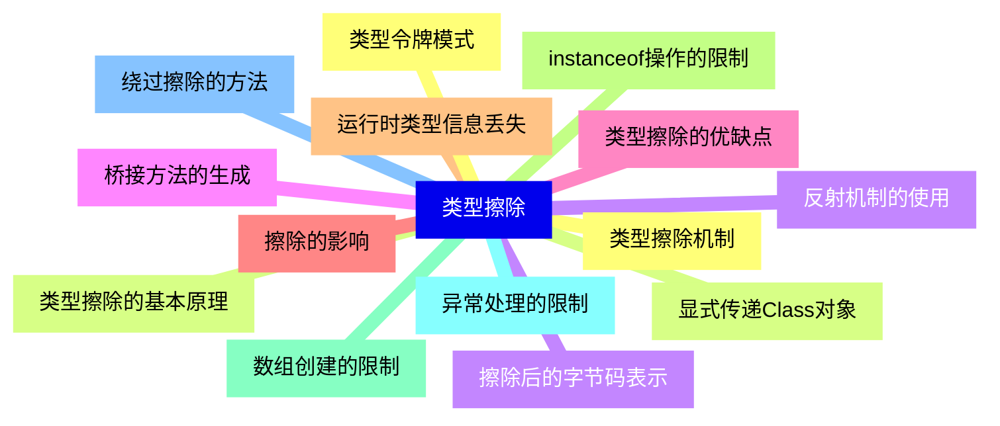

<--->
{}
{}
{}
{}
{}
{}
{}
{}
{}
{}
{}
{}
{}
{}
{}
{}
{}
{}
{}
{}
{}
{}
{}
{}
{}
{}
{}
{}
{}

### 6 泛型与继承{#6}

{}
{}
{}
{}
{}
{}
{}
{}
{}
{}
{}
{}
{}
{}
{}
{}
{}
{}
{}
{}
{}
{}
{}
{}
{}
<--->
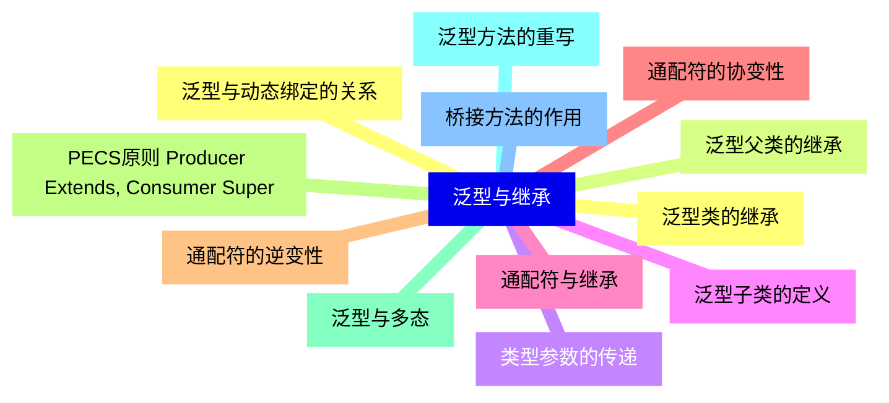

{}

### 7 泛型约束与限制{#7}

{}
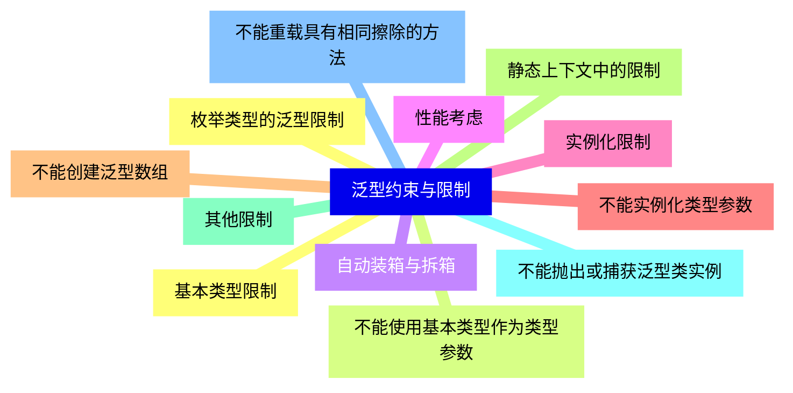

<--->
{}
{}
{}
{}
{}
{}
{}
{}
{}
{}
{}
{}
{}
{}
{}
{}
{}
{}
{}
{}
{}
{}
{}
{}
{}

### 8 高级泛型特性{#8}

{}
{}
{}
{}
{}
{}
{}
{}
{}
{}
{}
{}
{}
{}
{}
{}
{}
{}
{}
{}
{}
{}
{}
{}
{}
<--->
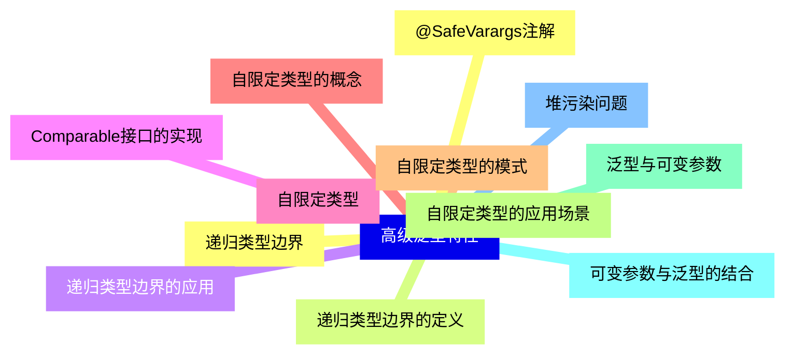

{}

### 9 泛型在实际开发中的应用{#9}

{}
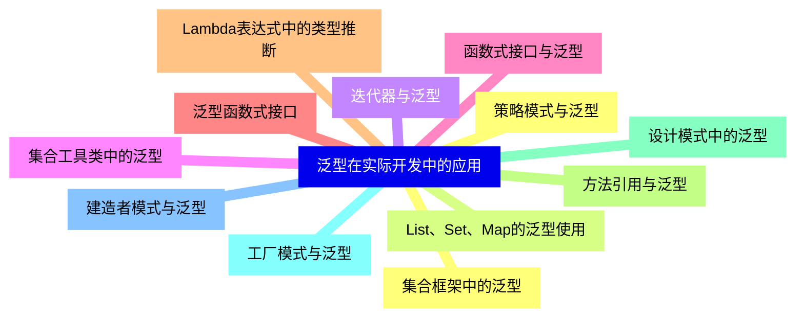

<--->
{}
{}
{}
{}
{}
{}
{}
{}
{}
{}
{}
{}
{}
{}
{}
{}
{}
{}
{}
{}
{}
{}
{}
{}
{}

### 10 泛型最佳实践{#10}

{}
{}
{}
{}
{}
{}
{}
{}
{}
{}
{}
{}
{}
{}
{}
{}
{}
{}
{}
{}
{}
{}
{}
{}
{}
<--->
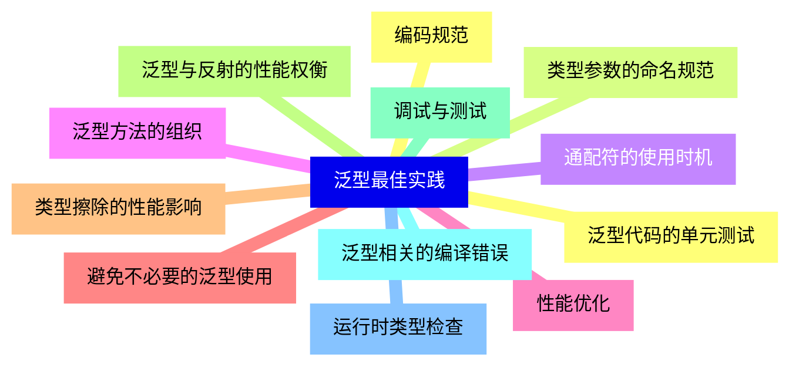

{}

### 11 泛型与其他语言的比较{#11}

{}
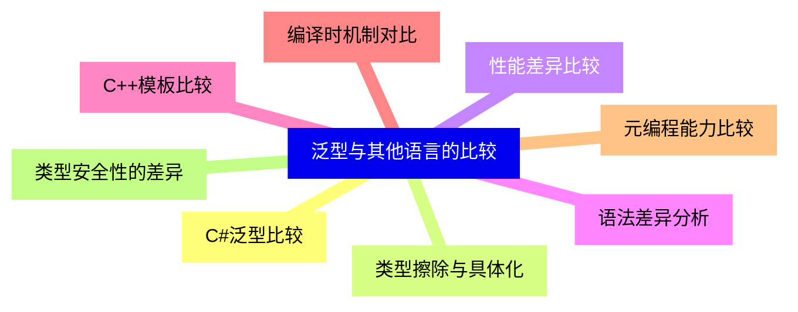

<--->
{}
{}
{}
{}
{}
{}
{}
{}
{}
{}
{}
{}
{}
{}
{}
{}
{}

### 12 未来发展趋势{#12}

{}
{}
{}
{}
{}
{}
{}
{}
{}
{}
{}
{}
{}
{}
{}
{}
{}
<--->
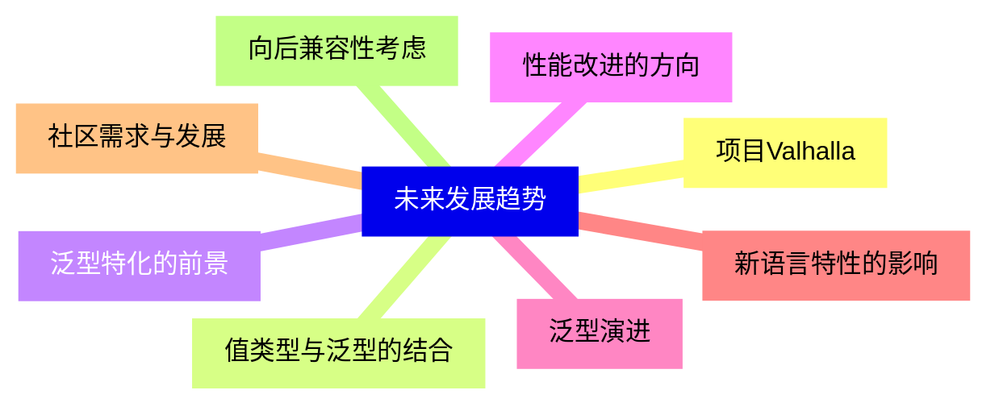

{}
