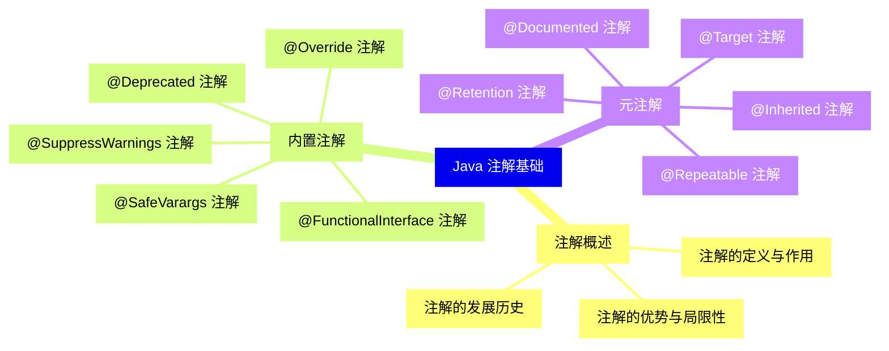
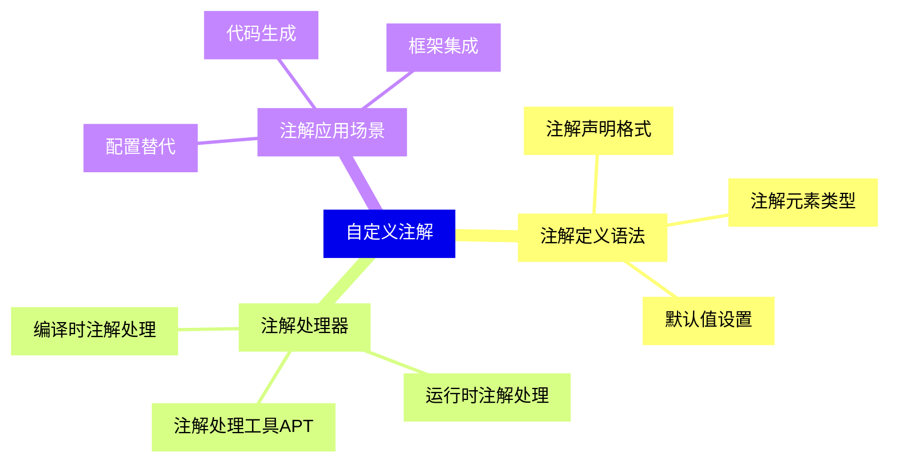
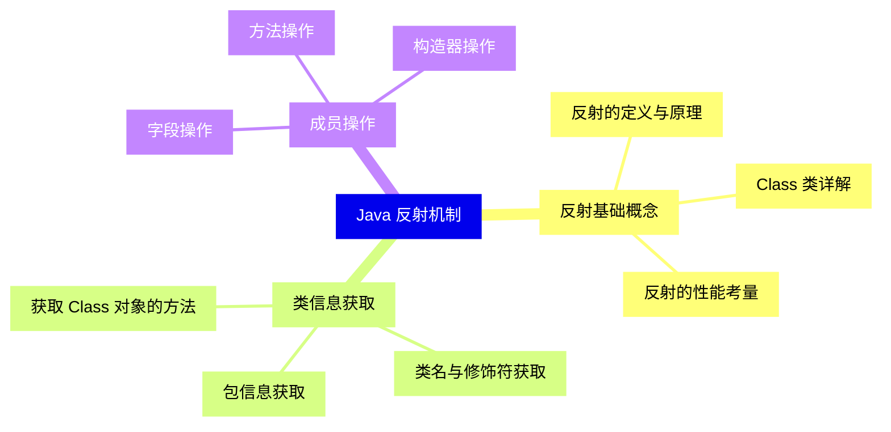
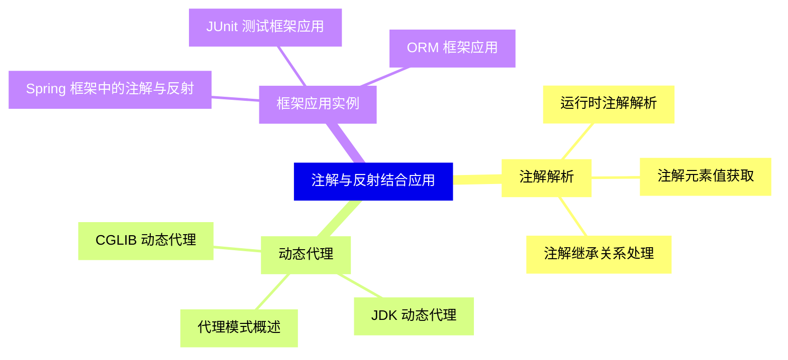
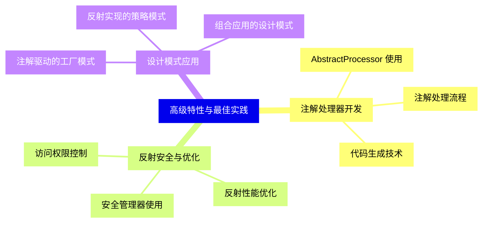
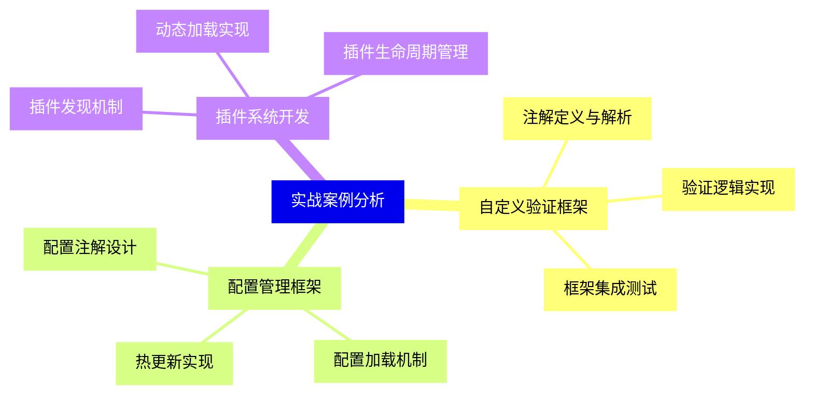


### 1 [Java 注解基础](#1)
#### 1.1 [注解概述](#1)
##### 1.1.1 [注解的定义与作用](#1)
##### 1.1.2 [注解的发展历史](#1)
##### 1.1.3 [注解的优势与局限性](#1)
#### 1.2 [内置注解](#1)
##### 1.2.1 [@Override 注解](#1)
##### 1.2.2 [@Deprecated 注解](#1)
##### 1.2.3 [@SuppressWarnings 注解](#1)
##### 1.2.4 [@SafeVarargs 注解](#1)
##### 1.2.5 [@FunctionalInterface 注解](#1)
#### 1.3 [元注解](#1)
##### 1.3.1 [@Target 注解](#1)
##### 1.3.2 [@Retention 注解](#1)
##### 1.3.3 [@Documented 注解](#1)
##### 1.3.4 [@Inherited 注解](#1)
##### 1.3.5 [@Repeatable 注解](#1)
### 2 [自定义注解](#2)
#### 2.1 [注解定义语法](#2)
##### 2.1.1 [注解声明格式](#2)
##### 2.1.2 [注解元素类型](#2)
##### 2.1.3 [默认值设置](#2)
#### 2.2 [注解处理器](#2)
##### 2.2.1 [编译时注解处理](#2)
##### 2.2.2 [运行时注解处理](#2)
##### 2.2.3 [注解处理工具APT](#2)
#### 2.3 [注解应用场景](#2)
##### 2.3.1 [配置替代](#2)
##### 2.3.2 [代码生成](#2)
##### 2.3.3 [框架集成](#2)
### 3 [Java 反射机制](#3)
#### 3.1 [反射基础概念](#3)
##### 3.1.1 [反射的定义与原理](#3)
##### 3.1.2 [Class 类详解](#3)
##### 3.1.3 [反射的性能考量](#3)
#### 3.2 [类信息获取](#3)
##### 3.2.1 [获取 Class 对象的方法](#3)
##### 3.2.2 [类名与修饰符获取](#3)
##### 3.2.3 [包信息获取](#3)
#### 3.3 [成员操作](#3)
##### 3.3.1 [字段操作](#3)
##### 3.3.2 [方法操作](#3)
##### 3.3.3 [构造器操作](#3)
### 4 [注解与反射结合应用](#4)
#### 4.1 [注解解析](#4)
##### 4.1.1 [运行时注解解析](#4)
##### 4.1.2 [注解元素值获取](#4)
##### 4.1.3 [注解继承关系处理](#4)
#### 4.2 [动态代理](#4)
##### 4.2.1 [代理模式概述](#4)
##### 4.2.2 [JDK 动态代理](#4)
##### 4.2.3 [CGLIB 动态代理](#4)
#### 4.3 [框架应用实例](#4)
##### 4.3.1 [Spring 框架中的注解与反射](#4)
##### 4.3.2 [JUnit 测试框架应用](#4)
##### 4.3.3 [ORM 框架应用](#4)
### 5 [高级特性与最佳实践](#5)
#### 5.1 [注解处理器开发](#5)
##### 5.1.1 [AbstractProcessor 使用](#5)
##### 5.1.2 [注解处理流程](#5)
##### 5.1.3 [代码生成技术](#5)
#### 5.2 [反射安全与优化](#5)
##### 5.2.1 [访问权限控制](#5)
##### 5.2.2 [反射性能优化](#5)
##### 5.2.3 [安全管理器使用](#5)
#### 5.3 [设计模式应用](#5)
##### 5.3.1 [注解驱动的工厂模式](#5)
##### 5.3.2 [反射实现的策略模式](#5)
##### 5.3.3 [组合应用的设计模式](#5)
### 6 [实战案例分析](#6)
#### 6.1 [自定义验证框架](#6)
##### 6.1.1 [注解定义与解析](#6)
##### 6.1.2 [验证逻辑实现](#6)
##### 6.1.3 [框架集成测试](#6)
#### 6.2 [配置管理框架](#6)
##### 6.2.1 [配置注解设计](#6)
##### 6.2.2 [配置加载机制](#6)
##### 6.2.3 [热更新实现](#6)
#### 6.3 [插件系统开发](#6)
##### 6.3.1 [插件发现机制](#6)
##### 6.3.2 [动态加载实现](#6)
##### 6.3.3 [插件生命周期管理](#6)




### 1 Java 注解基础

---
### 1 Java 注解基础
___
#### 1.1 注解概述
___
##### 1.1.1 注解的定义与作用
___
##### 1.1.2 注解的发展历史
___
##### 1.1.3 注解的优势与局限性
___
#### 1.2 内置注解
___
##### 1.2.1 @Override 注解
___
##### 1.2.2 @Deprecated 注解
___
##### 1.2.3 @SuppressWarnings 注解
___
##### 1.2.4 @SafeVarargs 注解
___
##### 1.2.5 @FunctionalInterface 注解
___
#### 1.3 元注解
___
##### 1.3.1 @Target 注解
___
##### 1.3.2 @Retention 注解
___
##### 1.3.3 @Documented 注解
___
##### 1.3.4 @Inherited 注解
___
##### 1.3.5 @Repeatable 注解
### 2 自定义注解

---
### 2 自定义注解
___
#### 2.1 注解定义语法
___
##### 2.1.1 注解声明格式
___
##### 2.1.2 注解元素类型
___
##### 2.1.3 默认值设置
___
#### 2.2 注解处理器
___
##### 2.2.1 编译时注解处理
___
##### 2.2.2 运行时注解处理
___
##### 2.2.3 注解处理工具APT
___
#### 2.3 注解应用场景
___
##### 2.3.1 配置替代
___
##### 2.3.2 代码生成
___
##### 2.3.3 框架集成
### 3 Java 反射机制

---
### 3 Java 反射机制
___
#### 3.1 反射基础概念
___
##### 3.1.1 反射的定义与原理
___
##### 3.1.2 Class 类详解
___
##### 3.1.3 反射的性能考量
___
#### 3.2 类信息获取
___
##### 3.2.1 获取 Class 对象的方法
___
##### 3.2.2 类名与修饰符获取
___
##### 3.2.3 包信息获取
___
#### 3.3 成员操作
___
##### 3.3.1 字段操作
___
##### 3.3.2 方法操作
___
##### 3.3.3 构造器操作
### 4 注解与反射结合应用

---
### 4 注解与反射结合应用
___
#### 4.1 注解解析
___
##### 4.1.1 运行时注解解析
___
##### 4.1.2 注解元素值获取
___
##### 4.1.3 注解继承关系处理
___
#### 4.2 动态代理
___
##### 4.2.1 代理模式概述
___
##### 4.2.2 JDK 动态代理
___
##### 4.2.3 CGLIB 动态代理
___
#### 4.3 框架应用实例
___
##### 4.3.1 Spring 框架中的注解与反射
___
##### 4.3.2 JUnit 测试框架应用
___
##### 4.3.3 ORM 框架应用
### 5 高级特性与最佳实践

---
### 5 高级特性与最佳实践
___
#### 5.1 注解处理器开发
___
##### 5.1.1 AbstractProcessor 使用
___
##### 5.1.2 注解处理流程
___
##### 5.1.3 代码生成技术
___
#### 5.2 反射安全与优化
___
##### 5.2.1 访问权限控制
___
##### 5.2.2 反射性能优化
___
##### 5.2.3 安全管理器使用
___
#### 5.3 设计模式应用
___
##### 5.3.1 注解驱动的工厂模式
___
##### 5.3.2 反射实现的策略模式
___
##### 5.3.3 组合应用的设计模式
### 6 实战案例分析

---
### 6 实战案例分析
___
#### 6.1 自定义验证框架
___
##### 6.1.1 注解定义与解析
___
##### 6.1.2 验证逻辑实现
___
##### 6.1.3 框架集成测试
___
#### 6.2 配置管理框架
___
##### 6.2.1 配置注解设计
___
##### 6.2.2 配置加载机制
___
##### 6.2.3 热更新实现
___
#### 6.3 插件系统开发
___
##### 6.3.1 插件发现机制
___
##### 6.3.2 动态加载实现
___
##### 6.3.3 插件生命周期管理


### 1 Java 注解基础{#1}

{}

<--->
{}
{}
{}
{}
{}
{}
{}
{}
{}
{}
{}
{}
{}
{}
{}
{}
{}
{}
{}
{}
{}
{}
{}
{}
{}
{}
{}
{}
{}
{}
{}
{}
{}

### 2 自定义注解{#2}

{}
{}
{}
{}
{}
{}
{}
{}
{}
{}
{}
{}
{}
{}
{}
{}
{}
{}
{}
{}
{}
{}
{}
{}
{}
<--->

{}

### 3 Java 反射机制{#3}

{}

<--->
{}
{}
{}
{}
{}
{}
{}
{}
{}
{}
{}
{}
{}
{}
{}
{}
{}
{}
{}
{}
{}
{}
{}
{}
{}

### 4 注解与反射结合应用{#4}

{}
{}
{}
{}
{}
{}
{}
{}
{}
{}
{}
{}
{}
{}
{}
{}
{}
{}
{}
{}
{}
{}
{}
{}
{}
<--->

{}

### 5 高级特性与最佳实践{#5}

{}

<--->
{}
{}
{}
{}
{}
{}
{}
{}
{}
{}
{}
{}
{}
{}
{}
{}
{}
{}
{}
{}
{}
{}
{}
{}
{}

### 6 实战案例分析{#6}

{}
{}
{}
{}
{}
{}
{}
{}
{}
{}
{}
{}
{}
{}
{}
{}
{}
{}
{}
{}
{}
{}
{}
{}
{}
<--->

{}
