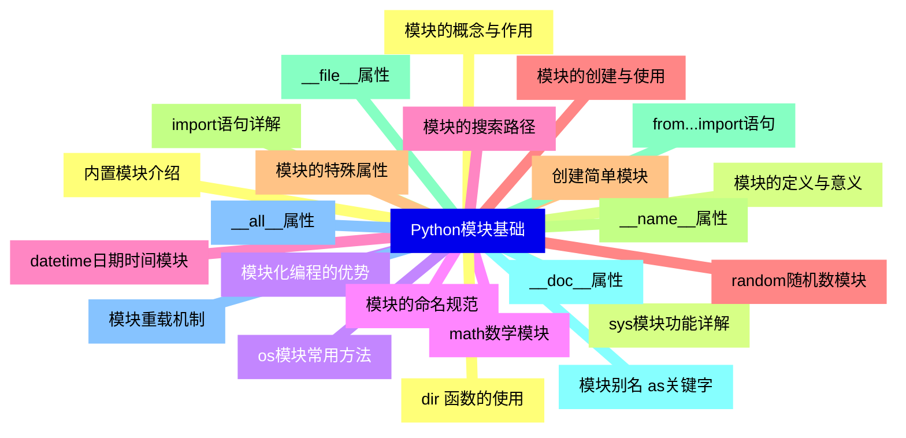
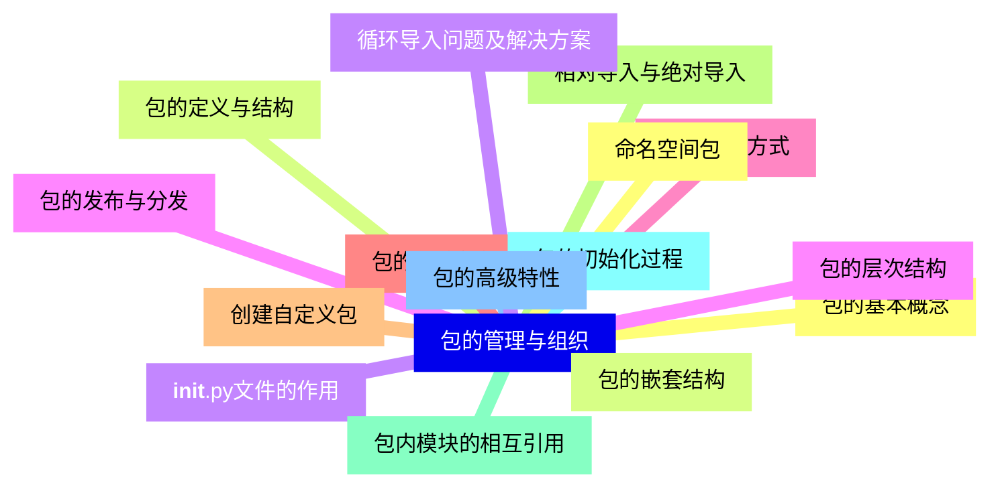
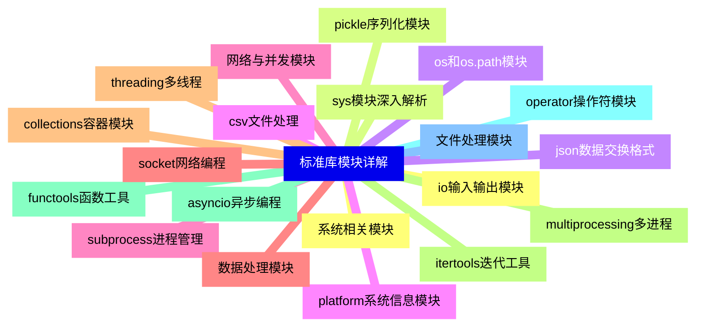
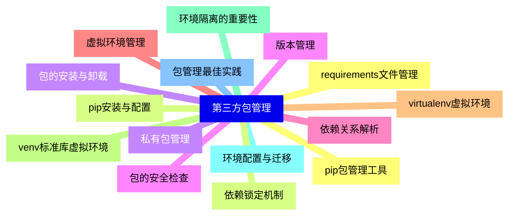
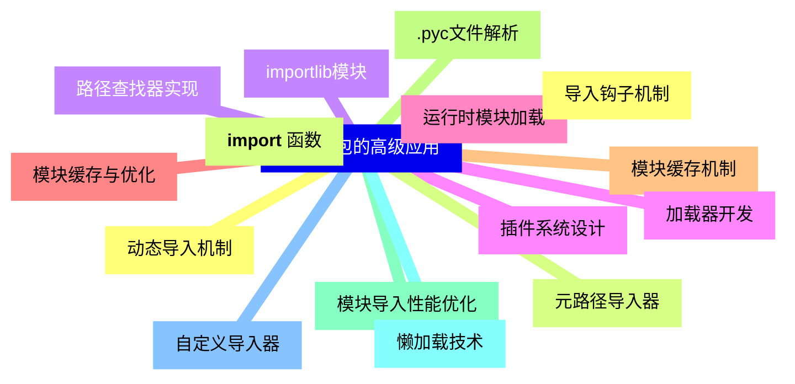
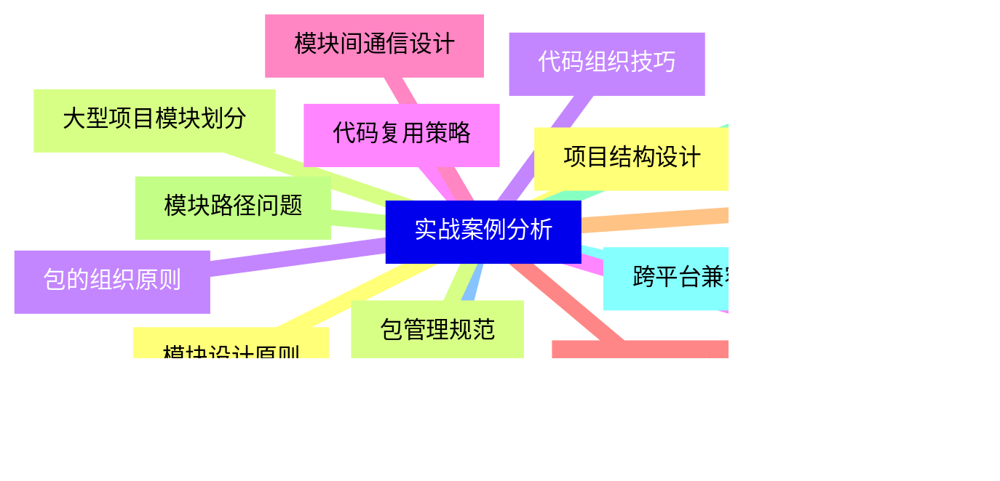


### 1 [Python模块基础](#1)
#### 1.1 [模块的概念与作用](#1)
#### 1.2 [模块的定义与意义](#1)
#### 1.3 [模块化编程的优势](#1)
#### 1.4 [模块的命名规范](#1)
#### 1.5 [模块的搜索路径](#1)
#### 1.6 [模块的创建与使用](#1)
#### 1.7 [创建简单模块](#1)
#### 1.8 [import语句详解](#1)
#### 1.9 [from...import语句](#1)
#### 1.10 [模块别名 as关键字](#1)
#### 1.11 [模块重载机制](#1)
#### 1.12 [内置模块介绍](#1)
#### 1.13 [sys模块功能详解](#1)
#### 1.14 [os模块常用方法](#1)
#### 1.15 [math数学模块](#1)
#### 1.16 [datetime日期时间模块](#1)
#### 1.17 [random随机数模块](#1)
#### 1.18 [模块的特殊属性](#1)
#### 1.19 [__name__属性](#1)
#### 1.20 [__file__属性](#1)
#### 1.21 [__doc__属性](#1)
#### 1.22 [__all__属性](#1)
#### 1.23 [dir  函数的使用](#1)
### 2 [包的管理与组织](#2)
#### 2.1 [包的基本概念](#2)
#### 2.2 [包的定义与结构](#2)
#### 2.3 [__init__.py文件的作用](#2)
#### 2.4 [包的层次结构](#2)
#### 2.5 [包的导入方式](#2)
#### 2.6 [包的创建与使用](#2)
#### 2.7 [创建自定义包](#2)
#### 2.8 [相对导入与绝对导入](#2)
#### 2.9 [包内模块的相互引用](#2)
#### 2.10 [包的初始化过程](#2)
#### 2.11 [包的高级特性](#2)
#### 2.12 [命名空间包](#2)
#### 2.13 [包的嵌套结构](#2)
#### 2.14 [循环导入问题及解决方案](#2)
#### 2.15 [包的发布与分发](#2)
### 3 [标准库模块详解](#3)
#### 3.1 [系统相关模块](#3)
#### 3.2 [sys模块深入解析](#3)
#### 3.3 [os和os.path模块](#3)
#### 3.4 [platform系统信息模块](#3)
#### 3.5 [subprocess进程管理](#3)
#### 3.6 [数据处理模块](#3)
#### 3.7 [collections容器模块](#3)
#### 3.8 [itertools迭代工具](#3)
#### 3.9 [functools函数工具](#3)
#### 3.10 [operator操作符模块](#3)
#### 3.11 [文件处理模块](#3)
#### 3.12 [io输入输出模块](#3)
#### 3.13 [pickle序列化模块](#3)
#### 3.14 [json数据交换格式](#3)
#### 3.15 [csv文件处理](#3)
#### 3.16 [网络与并发模块](#3)
#### 3.17 [socket网络编程](#3)
#### 3.18 [threading多线程](#3)
#### 3.19 [multiprocessing多进程](#3)
#### 3.20 [asyncio异步编程](#3)
### 4 [第三方包管理](#4)
#### 4.1 [pip包管理工具](#4)
#### 4.2 [pip安装与配置](#4)
#### 4.3 [包的安装与卸载](#4)
#### 4.4 [版本管理](#4)
#### 4.5 [依赖关系解析](#4)
#### 4.6 [虚拟环境管理](#4)
#### 4.7 [virtualenv虚拟环境](#4)
#### 4.8 [venv标准库虚拟环境](#4)
#### 4.9 [环境隔离的重要性](#4)
#### 4.10 [环境配置与迁移](#4)
#### 4.11 [包管理最佳实践](#4)
#### 4.12 [requirements文件管理](#4)
#### 4.13 [依赖锁定机制](#4)
#### 4.14 [私有包管理](#4)
#### 4.15 [包的安全检查](#4)
### 5 [模块与包的高级应用](#5)
#### 5.1 [动态导入机制](#5)
#### 5.2 [__import__  函数](#5)
#### 5.3 [importlib模块](#5)
#### 5.4 [插件系统设计](#5)
#### 5.5 [运行时模块加载](#5)
#### 5.6 [模块缓存与优化](#5)
#### 5.7 [模块缓存机制](#5)
#### 5.8 [.pyc文件解析](#5)
#### 5.9 [模块导入性能优化](#5)
#### 5.10 [懒加载技术](#5)
#### 5.11 [自定义导入器](#5)
#### 5.12 [导入钩子机制](#5)
#### 5.13 [元路径导入器](#5)
#### 5.14 [路径查找器实现](#5)
#### 5.15 [加载器开发](#5)
### 6 [实战案例分析](#6)
#### 6.1 [项目结构设计](#6)
#### 6.2 [大型项目模块划分](#6)
#### 6.3 [包的组织原则](#6)
#### 6.4 [代码复用策略](#6)
#### 6.5 [模块间通信设计](#6)
#### 6.6 [常见问题解决](#6)
#### 6.7 [循环导入的避免](#6)
#### 6.8 [模块路径问题](#6)
#### 6.9 [版本冲突处理](#6)
#### 6.10 [跨平台兼容性](#6)
#### 6.11 [最佳实践总结](#6)
#### 6.12 [模块设计原则](#6)
#### 6.13 [包管理规范](#6)
#### 6.14 [代码组织技巧](#6)
#### 6.15 [团队协作规范](#6)




### 1 Python模块基础

---
### 1 Python模块基础
___
#### 1.1 模块的概念与作用
___
#### 1.2 模块的定义与意义
___
#### 1.3 模块化编程的优势
___
#### 1.4 模块的命名规范
___
#### 1.5 模块的搜索路径
___
#### 1.6 模块的创建与使用
___
#### 1.7 创建简单模块
___
#### 1.8 import语句详解
___
#### 1.9 from...import语句
___
#### 1.10 模块别名 as关键字
___
#### 1.11 模块重载机制
___
#### 1.12 内置模块介绍
___
#### 1.13 sys模块功能详解
___
#### 1.14 os模块常用方法
___
#### 1.15 math数学模块
___
#### 1.16 datetime日期时间模块
___
#### 1.17 random随机数模块
___
#### 1.18 模块的特殊属性
___
#### 1.19 __name__属性
___
#### 1.20 __file__属性
___
#### 1.21 __doc__属性
___
#### 1.22 __all__属性
___
#### 1.23 dir  函数的使用
### 2 包的管理与组织

---
### 2 包的管理与组织
___
#### 2.1 包的基本概念
___
#### 2.2 包的定义与结构
___
#### 2.3 __init__.py文件的作用
___
#### 2.4 包的层次结构
___
#### 2.5 包的导入方式
___
#### 2.6 包的创建与使用
___
#### 2.7 创建自定义包
___
#### 2.8 相对导入与绝对导入
___
#### 2.9 包内模块的相互引用
___
#### 2.10 包的初始化过程
___
#### 2.11 包的高级特性
___
#### 2.12 命名空间包
___
#### 2.13 包的嵌套结构
___
#### 2.14 循环导入问题及解决方案
___
#### 2.15 包的发布与分发
### 3 标准库模块详解

---
### 3 标准库模块详解
___
#### 3.1 系统相关模块
___
#### 3.2 sys模块深入解析
___
#### 3.3 os和os.path模块
___
#### 3.4 platform系统信息模块
___
#### 3.5 subprocess进程管理
___
#### 3.6 数据处理模块
___
#### 3.7 collections容器模块
___
#### 3.8 itertools迭代工具
___
#### 3.9 functools函数工具
___
#### 3.10 operator操作符模块
___
#### 3.11 文件处理模块
___
#### 3.12 io输入输出模块
___
#### 3.13 pickle序列化模块
___
#### 3.14 json数据交换格式
___
#### 3.15 csv文件处理
___
#### 3.16 网络与并发模块
___
#### 3.17 socket网络编程
___
#### 3.18 threading多线程
___
#### 3.19 multiprocessing多进程
___
#### 3.20 asyncio异步编程
### 4 第三方包管理

---
### 4 第三方包管理
___
#### 4.1 pip包管理工具
___
#### 4.2 pip安装与配置
___
#### 4.3 包的安装与卸载
___
#### 4.4 版本管理
___
#### 4.5 依赖关系解析
___
#### 4.6 虚拟环境管理
___
#### 4.7 virtualenv虚拟环境
___
#### 4.8 venv标准库虚拟环境
___
#### 4.9 环境隔离的重要性
___
#### 4.10 环境配置与迁移
___
#### 4.11 包管理最佳实践
___
#### 4.12 requirements文件管理
___
#### 4.13 依赖锁定机制
___
#### 4.14 私有包管理
___
#### 4.15 包的安全检查
### 5 模块与包的高级应用

---
### 5 模块与包的高级应用
___
#### 5.1 动态导入机制
___
#### 5.2 __import__  函数
___
#### 5.3 importlib模块
___
#### 5.4 插件系统设计
___
#### 5.5 运行时模块加载
___
#### 5.6 模块缓存与优化
___
#### 5.7 模块缓存机制
___
#### 5.8 .pyc文件解析
___
#### 5.9 模块导入性能优化
___
#### 5.10 懒加载技术
___
#### 5.11 自定义导入器
___
#### 5.12 导入钩子机制
___
#### 5.13 元路径导入器
___
#### 5.14 路径查找器实现
___
#### 5.15 加载器开发
### 6 实战案例分析

---
### 6 实战案例分析
___
#### 6.1 项目结构设计
___
#### 6.2 大型项目模块划分
___
#### 6.3 包的组织原则
___
#### 6.4 代码复用策略
___
#### 6.5 模块间通信设计
___
#### 6.6 常见问题解决
___
#### 6.7 循环导入的避免
___
#### 6.8 模块路径问题
___
#### 6.9 版本冲突处理
___
#### 6.10 跨平台兼容性
___
#### 6.11 最佳实践总结
___
#### 6.12 模块设计原则
___
#### 6.13 包管理规范
___
#### 6.14 代码组织技巧
___
#### 6.15 团队协作规范


### 1 Python模块基础{#1}

{}

<--->
{}
{}
{}
{}
{}
{}
{}
{}
{}
{}
{}
{}
{}
{}
{}
{}
{}
{}
{}
{}
{}
{}
{}
{}
{}
{}
{}
{}
{}
{}
{}
{}
{}
{}
{}
{}
{}
{}
{}
{}
{}
{}
{}
{}
{}
{}
{}

### 2 包的管理与组织{#2}

{}
{}
{}
{}
{}
{}
{}
{}
{}
{}
{}
{}
{}
{}
{}
{}
{}
{}
{}
{}
{}
{}
{}
{}
{}
{}
{}
{}
{}
{}
{}
<--->

{}

### 3 标准库模块详解{#3}

{}

<--->
{}
{}
{}
{}
{}
{}
{}
{}
{}
{}
{}
{}
{}
{}
{}
{}
{}
{}
{}
{}
{}
{}
{}
{}
{}
{}
{}
{}
{}
{}
{}
{}
{}
{}
{}
{}
{}
{}
{}
{}
{}

### 4 第三方包管理{#4}

{}
{}
{}
{}
{}
{}
{}
{}
{}
{}
{}
{}
{}
{}
{}
{}
{}
{}
{}
{}
{}
{}
{}
{}
{}
{}
{}
{}
{}
{}
{}
<--->

{}

### 5 模块与包的高级应用{#5}

{}

<--->
{}
{}
{}
{}
{}
{}
{}
{}
{}
{}
{}
{}
{}
{}
{}
{}
{}
{}
{}
{}
{}
{}
{}
{}
{}
{}
{}
{}
{}
{}
{}

### 6 实战案例分析{#6}

{}
{}
{}
{}
{}
{}
{}
{}
{}
{}
{}
{}
{}
{}
{}
{}
{}
{}
{}
{}
{}
{}
{}
{}
{}
{}
{}
{}
{}
{}
{}
<--->

{}
