
### 1 [面向对象编程基础](#1)
#### 1.1 [面向对象概念](#1)
#### 1.2 [类与对象的定义](#1)
#### 1.3 [面向对象三大特性](#1)
#### 1.4 [面向对象与面向过程对比](#1)
#### 1.5 [面向对象编程的优势](#1)
#### 1.6 [Python中的面向对象](#1)
#### 1.7 [Python面向对象特点](#1)
#### 1.8 [类的基本语法](#1)
#### 1.9 [对象创建与使用](#1)
#### 1.10 [命名规范与约定](#1)
### 2 [类的定义与使用](#2)
#### 2.1 [类定义语法](#2)
#### 2.2 [class关键字](#2)
#### 2.3 [类名命名规则](#2)
#### 2.4 [类体结构](#2)
#### 2.5 [文档字符串](#2)
#### 2.6 [属性定义](#2)
#### 2.7 [实例属性](#2)
#### 2.8 [类属性](#2)
#### 2.9 [私有属性](#2)
#### 2.10 [属性访问控制](#2)
#### 2.11 [方法定义](#2)
#### 2.12 [实例方法](#2)
#### 2.13 [类方法](#2)
#### 2.14 [静态方法](#2)
#### 2.15 [特殊方法](#2)
### 3 [对象操作](#3)
#### 3.1 [对象创建](#3)
#### 3.2 [构造函数__init__](#3)
#### 3.3 [对象实例化过程](#3)
#### 3.4 [内存分配机制](#3)
#### 3.5 [对象引用计数](#3)
#### 3.6 [对象访问](#3)
#### 3.7 [属性访问](#3)
#### 3.8 [方法调用](#3)
#### 3.9 [点操作符使用](#3)
#### 3.10 [动态属性访问](#3)
#### 3.11 [对象生命周期](#3)
#### 3.12 [对象创建](#3)
#### 3.13 [对象使用](#3)
#### 3.14 [对象销毁](#3)
#### 3.15 [垃圾回收机制](#3)
### 4 [封装特性](#4)
#### 4.1 [访问控制](#4)
#### 4.2 [公有成员](#4)
#### 4.3 [保护成员](#4)
#### 4.4 [私有成员](#4)
#### 4.5 [名称修饰规则](#4)
#### 4.6 [属性封装](#4)
#### 4.7 [property装饰器](#4)
#### 4.8 [getter和setter方法](#4)
#### 4.9 [属性验证](#4)
#### 4.10 [计算属性](#4)
#### 4.11 [方法封装](#4)
#### 4.12 [方法访问权限](#4)
#### 4.13 [内部方法实现](#4)
#### 4.14 [接口设计原则](#4)
#### 4.15 [封装最佳实践](#4)
### 5 [继承特性](#5)
#### 5.1 [继承基础](#5)
#### 5.2 [单继承语法](#5)
#### 5.3 [方法重写](#5)
#### 5.4 [父类方法调用](#5)
#### 5.5 [继承层次结构](#5)
#### 5.6 [多继承](#5)
#### 5.7 [多继承语法](#5)
#### 5.8 [方法解析顺序 MRO](#5)
#### 5.9 [菱形继承问题](#5)
#### 5.10 [super  函数使用](#5)
#### 5.11 [继承应用](#5)
#### 5.12 [抽象基类](#5)
#### 5.13 [混入类 Mixin](#5)
#### 5.14 [接口实现](#5)
#### 5.15 [继承设计模式](#5)
### 6 [多态特性](#6)
#### 6.1 [多态概念](#6)
#### 6.2 [多态定义](#6)
#### 6.3 [鸭子类型](#6)
#### 6.4 [多态实现方式](#6)
#### 6.5 [多态的优势](#6)
#### 6.6 [方法重写](#6)
#### 6.7 [方法覆盖](#6)
#### 6.8 [扩展父类方法](#6)
#### 6.9 [动态绑定](#6)
#### 6.10 [运行时多态](#6)
#### 6.11 [运算符重载](#6)
#### 6.12 [算术运算符重载](#6)
#### 6.13 [比较运算符重载](#6)
#### 6.14 [容器操作重载](#6)
#### 6.15 [自定义运算符](#6)
### 7 [特殊方法](#7)
#### 7.1 [初始化与销毁](#7)
#### 7.2 [__init__方法](#7)
#### 7.3 [__new__方法](#7)
#### 7.4 [__del__方法](#7)
#### 7.5 [对象构造过程](#7)
#### 7.6 [字符串表示](#7)
#### 7.7 [__str__方法](#7)
#### 7.8 [__repr__方法](#7)
#### 7.9 [__format__方法](#7)
#### 7.10 [格式化输出](#7)
#### 7.11 [属性访问](#7)
#### 7.12 [__getattr__方法](#7)
#### 7.13 [__setattr__方法](#7)
#### 7.14 [__delattr__方法](#7)
#### 7.15 [__getattribute__方法](#7)
#### 7.16 [容器操作](#7)
#### 7.17 [__len__方法](#7)
#### 7.18 [__getitem__方法](#7)
#### 7.19 [__setitem__方法](#7)
#### 7.20 [__contains__方法](#7)
### 8 [类装饰器与元类](#8)
#### 8.1 [类装饰器](#8)
#### 8.2 [@classmethod](#8)
#### 8.3 [@staticmethod](#8)
#### 8.4 [@property](#8)
#### 8.5 [自定义类装饰器](#8)
#### 8.6 [元类基础](#8)
#### 8.7 [type元类](#8)
#### 8.8 [元类定义](#8)
#### 8.9 [元类应用场景](#8)
#### 8.10 [元编程概念](#8)
#### 8.11 [高级元类](#8)
#### 8.12 [自定义元类](#8)
#### 8.13 [元类继承](#8)
#### 8.14 [元类与装饰器](#8)
#### 8.15 [元类最佳实践](#8)
### 9 [设计模式与最佳实践](#9)
#### 9.1 [常用设计模式](#9)
#### 9.2 [工厂模式](#9)
#### 9.3 [单例模式](#9)
#### 9.4 [观察者模式](#9)
#### 9.5 [策略模式](#9)
#### 9.6 [类设计原则](#9)
#### 9.7 [单一职责原则](#9)
#### 9.8 [开放封闭原则](#9)
#### 9.9 [里氏替换原则](#9)
#### 9.10 [依赖倒置原则](#9)
#### 9.11 [代码组织](#9)
#### 9.12 [模块化设计](#9)
#### 9.13 [包结构组织](#9)
#### 9.14 [导入优化](#9)
#### 9.15 [代码重构技巧](#9)
### 10 [高级特性](#10)
#### 10.1 [描述符](#10)
#### 10.2 [描述符协议](#10)
#### 10.3 [数据描述符](#10)
#### 10.4 [非数据描述符](#10)
#### 10.5 [描述符应用](#10)
#### 10.6 [抽象基类](#10)
#### 10.7 [abc模块](#10)
#### 10.8 [抽象方法定义](#10)
#### 10.9 [接口检查](#10)
#### 10.10 [注册虚拟子类](#10)
#### 10.11 [数据类](#10)
#### 10.12 [@dataclass装饰器](#10)
#### 10.13 [自动生成方法](#10)
#### 10.14 [字段选项](#10)
#### 10.15 [数据类继承](#10)
### 11 [性能优化](#11)
#### 11.1 [内存管理](#11)
#### 11.2 [__slots__属性](#11)
#### 11.3 [弱引用](#11)
#### 11.4 [对象池模式](#11)
#### 11.5 [内存泄漏检测](#11)
#### 11.6 [方法优化](#11)
#### 11.7 [方法缓存](#11)
#### 11.8 [惰性计算](#11)
#### 11.9 [方法调用优化](#11)
#### 11.10 [性能分析工具](#11)
#### 11.11 [序列化与持久化](#11)
#### 11.12 [pickle模块](#11)
#### 11.13 [自定义序列化](#11)
#### 11.14 [对象持久化](#11)
#### 11.15 [序列化安全](#11)
### 12 [实际应用案例](#12)
#### 12.1 [业务模型设计](#12)
#### 12.2 [领域模型](#12)
#### 12.3 [值对象](#12)
#### 12.4 [实体对象](#12)
#### 12.5 [聚合根设计](#12)
#### 12.6 [框架集成](#12)
#### 12.7 [Django模型](#12)
#### 12.8 [Flask扩展](#12)
#### 12.9 [ORM映射](#12)
#### 12.10 [Web框架集成](#12)
#### 12.11 [测试与调试](#12)
#### 12.12 [单元测试编写](#12)
#### 12.13 [Mock对象使用](#12)
#### 12.14 [调试技巧](#12)
#### 12.15 [性能测试](#12)




### 1 面向对象编程基础

---
### 1 面向对象编程基础
___
#### 1.1 面向对象概念
___
#### 1.2 类与对象的定义
___
#### 1.3 面向对象三大特性
___
#### 1.4 面向对象与面向过程对比
___
#### 1.5 面向对象编程的优势
___
#### 1.6 Python中的面向对象
___
#### 1.7 Python面向对象特点
___
#### 1.8 类的基本语法
___
#### 1.9 对象创建与使用
___
#### 1.10 命名规范与约定
### 2 类的定义与使用

---
### 2 类的定义与使用
___
#### 2.1 类定义语法
___
#### 2.2 class关键字
___
#### 2.3 类名命名规则
___
#### 2.4 类体结构
___
#### 2.5 文档字符串
___
#### 2.6 属性定义
___
#### 2.7 实例属性
___
#### 2.8 类属性
___
#### 2.9 私有属性
___
#### 2.10 属性访问控制
___
#### 2.11 方法定义
___
#### 2.12 实例方法
___
#### 2.13 类方法
___
#### 2.14 静态方法
___
#### 2.15 特殊方法
### 3 对象操作

---
### 3 对象操作
___
#### 3.1 对象创建
___
#### 3.2 构造函数__init__
___
#### 3.3 对象实例化过程
___
#### 3.4 内存分配机制
___
#### 3.5 对象引用计数
___
#### 3.6 对象访问
___
#### 3.7 属性访问
___
#### 3.8 方法调用
___
#### 3.9 点操作符使用
___
#### 3.10 动态属性访问
___
#### 3.11 对象生命周期
___
#### 3.12 对象创建
___
#### 3.13 对象使用
___
#### 3.14 对象销毁
___
#### 3.15 垃圾回收机制
### 4 封装特性

---
### 4 封装特性
___
#### 4.1 访问控制
___
#### 4.2 公有成员
___
#### 4.3 保护成员
___
#### 4.4 私有成员
___
#### 4.5 名称修饰规则
___
#### 4.6 属性封装
___
#### 4.7 property装饰器
___
#### 4.8 getter和setter方法
___
#### 4.9 属性验证
___
#### 4.10 计算属性
___
#### 4.11 方法封装
___
#### 4.12 方法访问权限
___
#### 4.13 内部方法实现
___
#### 4.14 接口设计原则
___
#### 4.15 封装最佳实践
### 5 继承特性

---
### 5 继承特性
___
#### 5.1 继承基础
___
#### 5.2 单继承语法
___
#### 5.3 方法重写
___
#### 5.4 父类方法调用
___
#### 5.5 继承层次结构
___
#### 5.6 多继承
___
#### 5.7 多继承语法
___
#### 5.8 方法解析顺序 MRO
___
#### 5.9 菱形继承问题
___
#### 5.10 super  函数使用
___
#### 5.11 继承应用
___
#### 5.12 抽象基类
___
#### 5.13 混入类 Mixin
___
#### 5.14 接口实现
___
#### 5.15 继承设计模式
### 6 多态特性

---
### 6 多态特性
___
#### 6.1 多态概念
___
#### 6.2 多态定义
___
#### 6.3 鸭子类型
___
#### 6.4 多态实现方式
___
#### 6.5 多态的优势
___
#### 6.6 方法重写
___
#### 6.7 方法覆盖
___
#### 6.8 扩展父类方法
___
#### 6.9 动态绑定
___
#### 6.10 运行时多态
___
#### 6.11 运算符重载
___
#### 6.12 算术运算符重载
___
#### 6.13 比较运算符重载
___
#### 6.14 容器操作重载
___
#### 6.15 自定义运算符
### 7 特殊方法

---
### 7 特殊方法
___
#### 7.1 初始化与销毁
___
#### 7.2 __init__方法
___
#### 7.3 __new__方法
___
#### 7.4 __del__方法
___
#### 7.5 对象构造过程
___
#### 7.6 字符串表示
___
#### 7.7 __str__方法
___
#### 7.8 __repr__方法
___
#### 7.9 __format__方法
___
#### 7.10 格式化输出
___
#### 7.11 属性访问
___
#### 7.12 __getattr__方法
___
#### 7.13 __setattr__方法
___
#### 7.14 __delattr__方法
___
#### 7.15 __getattribute__方法
___
#### 7.16 容器操作
___
#### 7.17 __len__方法
___
#### 7.18 __getitem__方法
___
#### 7.19 __setitem__方法
___
#### 7.20 __contains__方法
### 8 类装饰器与元类

---
### 8 类装饰器与元类
___
#### 8.1 类装饰器
___
#### 8.2 @classmethod
___
#### 8.3 @staticmethod
___
#### 8.4 @property
___
#### 8.5 自定义类装饰器
___
#### 8.6 元类基础
___
#### 8.7 type元类
___
#### 8.8 元类定义
___
#### 8.9 元类应用场景
___
#### 8.10 元编程概念
___
#### 8.11 高级元类
___
#### 8.12 自定义元类
___
#### 8.13 元类继承
___
#### 8.14 元类与装饰器
___
#### 8.15 元类最佳实践
### 9 设计模式与最佳实践

---
### 9 设计模式与最佳实践
___
#### 9.1 常用设计模式
___
#### 9.2 工厂模式
___
#### 9.3 单例模式
___
#### 9.4 观察者模式
___
#### 9.5 策略模式
___
#### 9.6 类设计原则
___
#### 9.7 单一职责原则
___
#### 9.8 开放封闭原则
___
#### 9.9 里氏替换原则
___
#### 9.10 依赖倒置原则
___
#### 9.11 代码组织
___
#### 9.12 模块化设计
___
#### 9.13 包结构组织
___
#### 9.14 导入优化
___
#### 9.15 代码重构技巧
### 10 高级特性

---
### 10 高级特性
___
#### 10.1 描述符
___
#### 10.2 描述符协议
___
#### 10.3 数据描述符
___
#### 10.4 非数据描述符
___
#### 10.5 描述符应用
___
#### 10.6 抽象基类
___
#### 10.7 abc模块
___
#### 10.8 抽象方法定义
___
#### 10.9 接口检查
___
#### 10.10 注册虚拟子类
___
#### 10.11 数据类
___
#### 10.12 @dataclass装饰器
___
#### 10.13 自动生成方法
___
#### 10.14 字段选项
___
#### 10.15 数据类继承
### 11 性能优化

---
### 11 性能优化
___
#### 11.1 内存管理
___
#### 11.2 __slots__属性
___
#### 11.3 弱引用
___
#### 11.4 对象池模式
___
#### 11.5 内存泄漏检测
___
#### 11.6 方法优化
___
#### 11.7 方法缓存
___
#### 11.8 惰性计算
___
#### 11.9 方法调用优化
___
#### 11.10 性能分析工具
___
#### 11.11 序列化与持久化
___
#### 11.12 pickle模块
___
#### 11.13 自定义序列化
___
#### 11.14 对象持久化
___
#### 11.15 序列化安全
### 12 实际应用案例

---
### 12 实际应用案例
___
#### 12.1 业务模型设计
___
#### 12.2 领域模型
___
#### 12.3 值对象
___
#### 12.4 实体对象
___
#### 12.5 聚合根设计
___
#### 12.6 框架集成
___
#### 12.7 Django模型
___
#### 12.8 Flask扩展
___
#### 12.9 ORM映射
___
#### 12.10 Web框架集成
___
#### 12.11 测试与调试
___
#### 12.12 单元测试编写
___
#### 12.13 Mock对象使用
___
#### 12.14 调试技巧
___
#### 12.15 性能测试


### 1 面向对象编程基础{#1}

{}
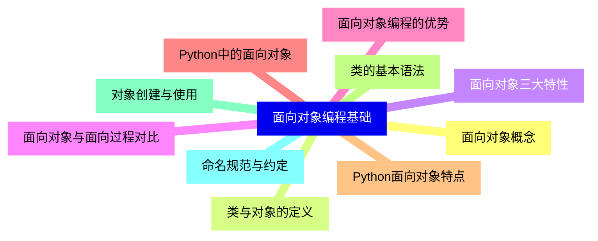

<--->
{}
{}
{}
{}
{}
{}
{}
{}
{}
{}
{}
{}
{}
{}
{}
{}
{}
{}
{}
{}
{}

### 2 类的定义与使用{#2}

{}
{}
{}
{}
{}
{}
{}
{}
{}
{}
{}
{}
{}
{}
{}
{}
{}
{}
{}
{}
{}
{}
{}
{}
{}
{}
{}
{}
{}
{}
{}
<--->
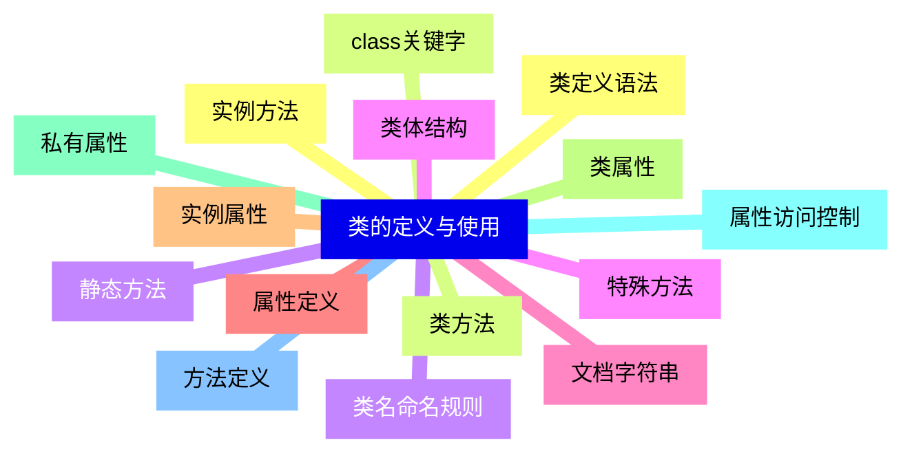

{}

### 3 对象操作{#3}

{}
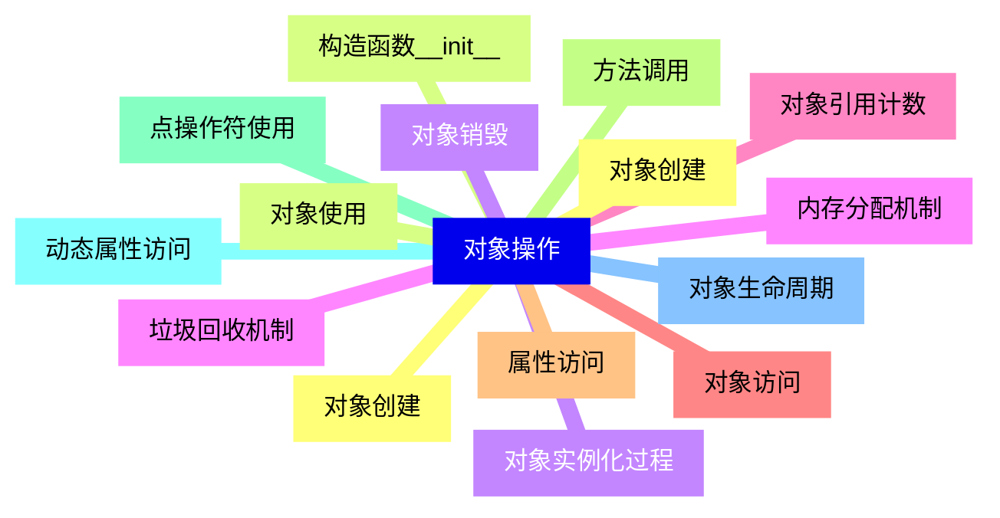

<--->
{}
{}
{}
{}
{}
{}
{}
{}
{}
{}
{}
{}
{}
{}
{}
{}
{}
{}
{}
{}
{}
{}
{}
{}
{}
{}
{}
{}
{}
{}
{}

### 4 封装特性{#4}

{}
{}
{}
{}
{}
{}
{}
{}
{}
{}
{}
{}
{}
{}
{}
{}
{}
{}
{}
{}
{}
{}
{}
{}
{}
{}
{}
{}
{}
{}
{}
<--->
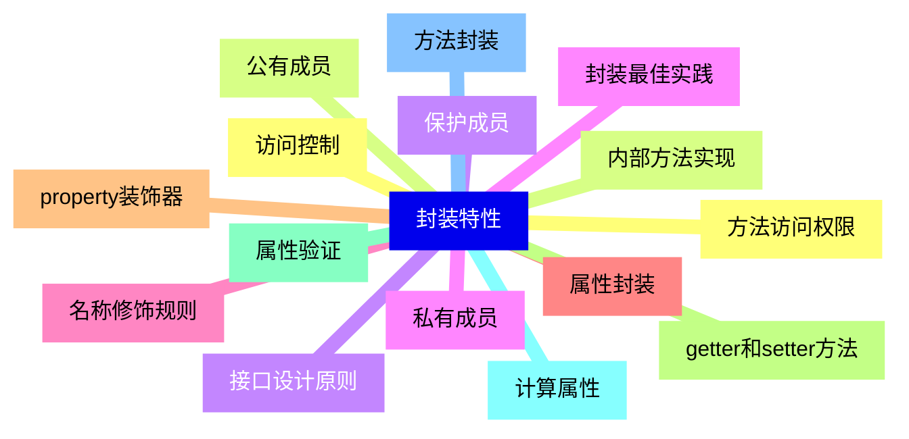

{}

### 5 继承特性{#5}

{}
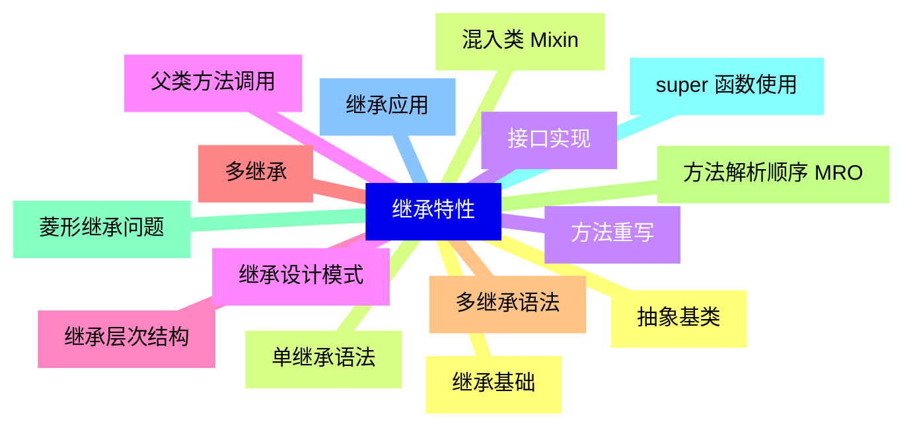

<--->
{}
{}
{}
{}
{}
{}
{}
{}
{}
{}
{}
{}
{}
{}
{}
{}
{}
{}
{}
{}
{}
{}
{}
{}
{}
{}
{}
{}
{}
{}
{}

### 6 多态特性{#6}

{}
{}
{}
{}
{}
{}
{}
{}
{}
{}
{}
{}
{}
{}
{}
{}
{}
{}
{}
{}
{}
{}
{}
{}
{}
{}
{}
{}
{}
{}
{}
<--->
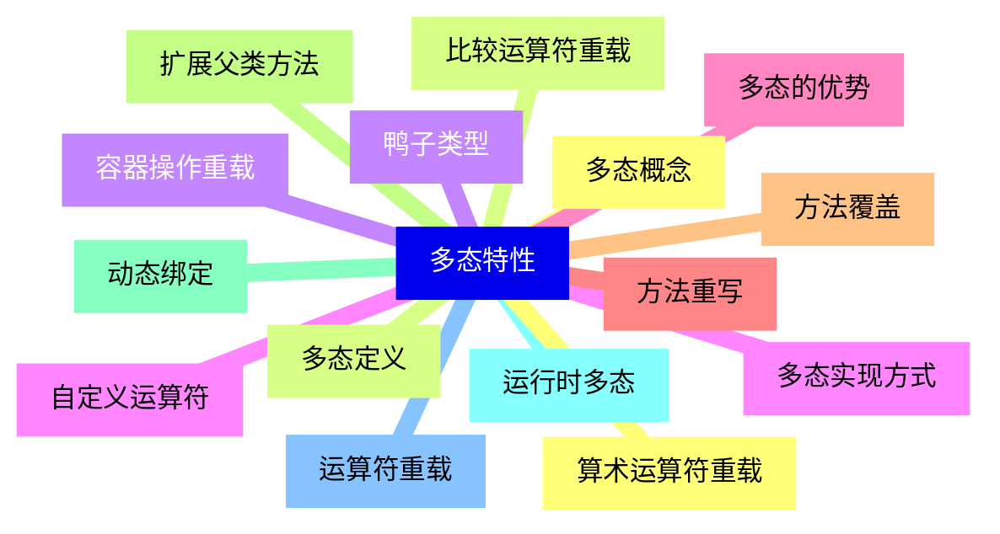

{}

### 7 特殊方法{#7}

{}
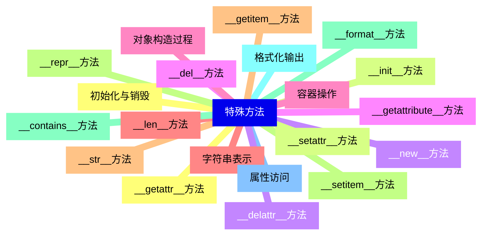

<--->
{}
{}
{}
{}
{}
{}
{}
{}
{}
{}
{}
{}
{}
{}
{}
{}
{}
{}
{}
{}
{}
{}
{}
{}
{}
{}
{}
{}
{}
{}
{}
{}
{}
{}
{}
{}
{}
{}
{}
{}
{}

### 8 类装饰器与元类{#8}

{}
{}
{}
{}
{}
{}
{}
{}
{}
{}
{}
{}
{}
{}
{}
{}
{}
{}
{}
{}
{}
{}
{}
{}
{}
{}
{}
{}
{}
{}
{}
<--->
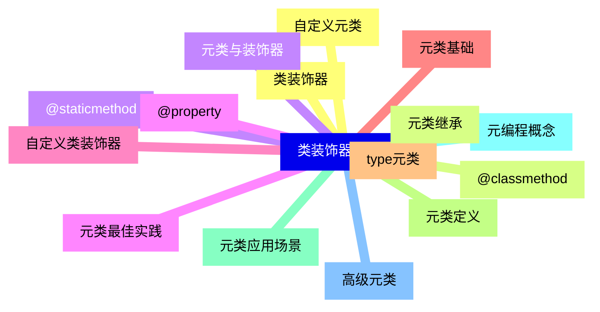

{}

### 9 设计模式与最佳实践{#9}

{}
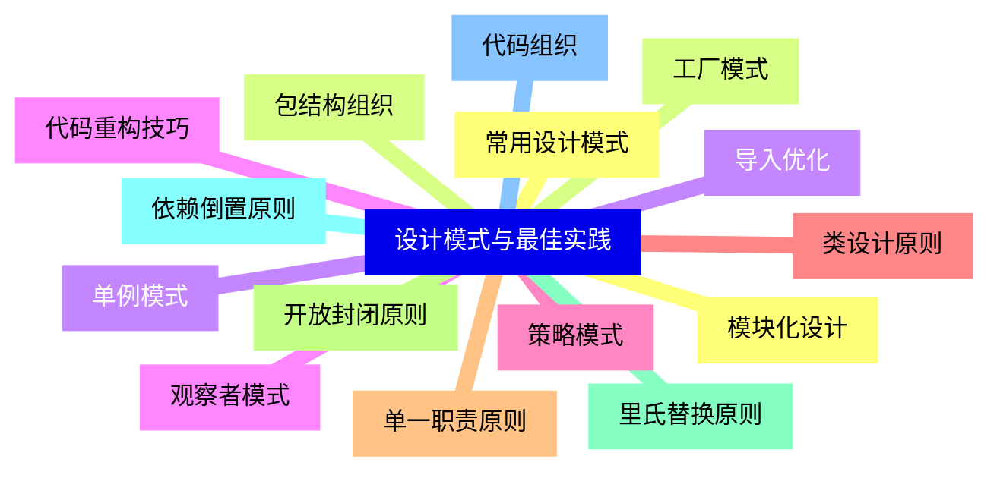

<--->
{}
{}
{}
{}
{}
{}
{}
{}
{}
{}
{}
{}
{}
{}
{}
{}
{}
{}
{}
{}
{}
{}
{}
{}
{}
{}
{}
{}
{}
{}
{}

### 10 高级特性{#10}

{}
{}
{}
{}
{}
{}
{}
{}
{}
{}
{}
{}
{}
{}
{}
{}
{}
{}
{}
{}
{}
{}
{}
{}
{}
{}
{}
{}
{}
{}
{}
<--->
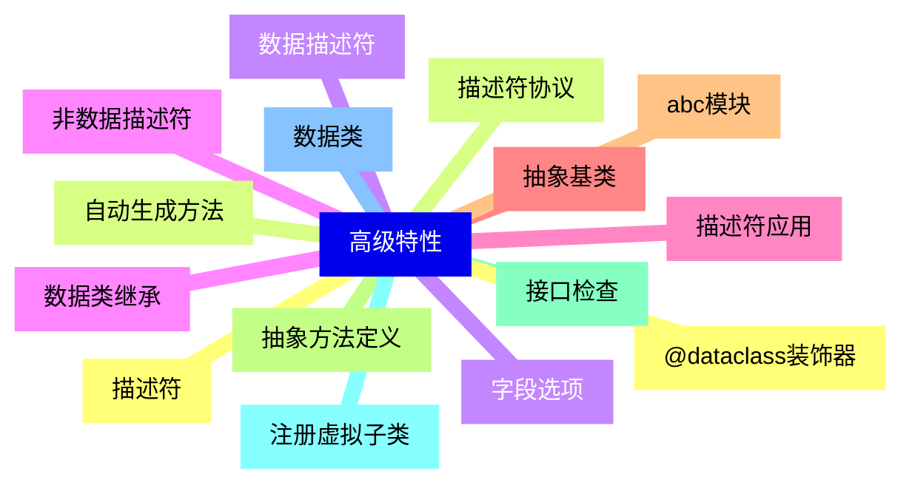

{}

### 11 性能优化{#11}

{}
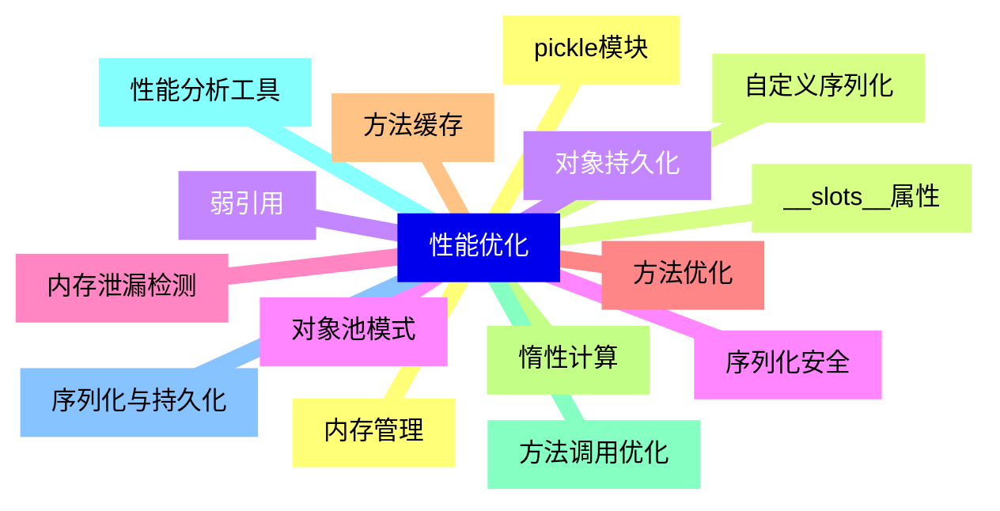

<--->
{}
{}
{}
{}
{}
{}
{}
{}
{}
{}
{}
{}
{}
{}
{}
{}
{}
{}
{}
{}
{}
{}
{}
{}
{}
{}
{}
{}
{}
{}
{}

### 12 实际应用案例{#12}

{}
{}
{}
{}
{}
{}
{}
{}
{}
{}
{}
{}
{}
{}
{}
{}
{}
{}
{}
{}
{}
{}
{}
{}
{}
{}
{}
{}
{}
{}
{}
<--->
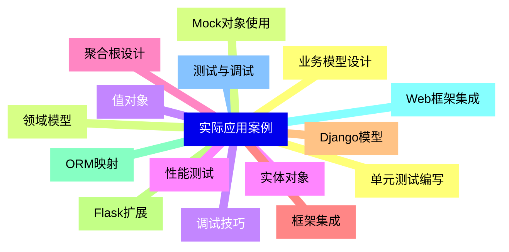

{}
