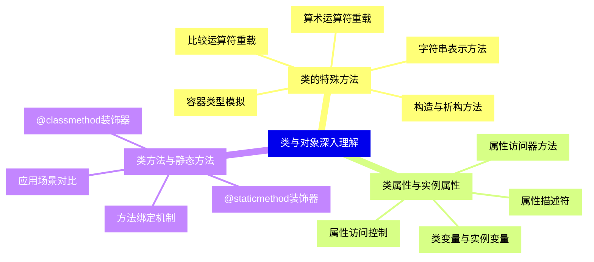
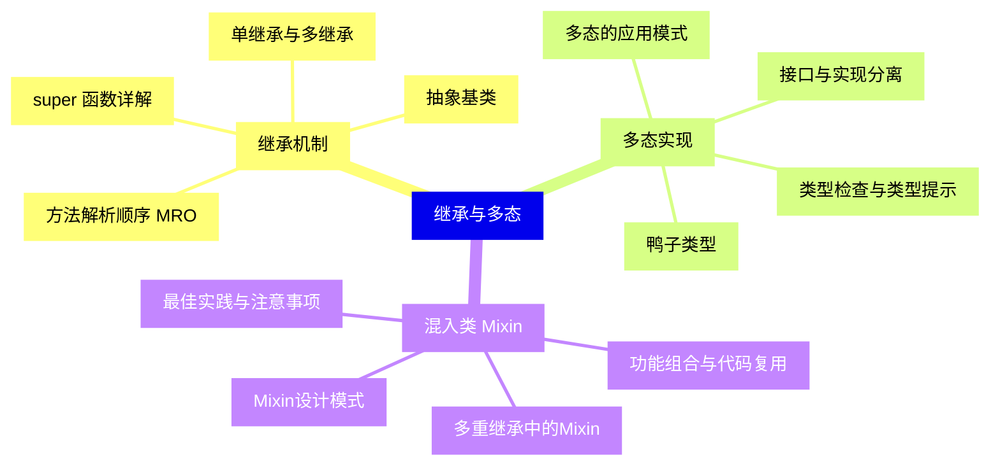
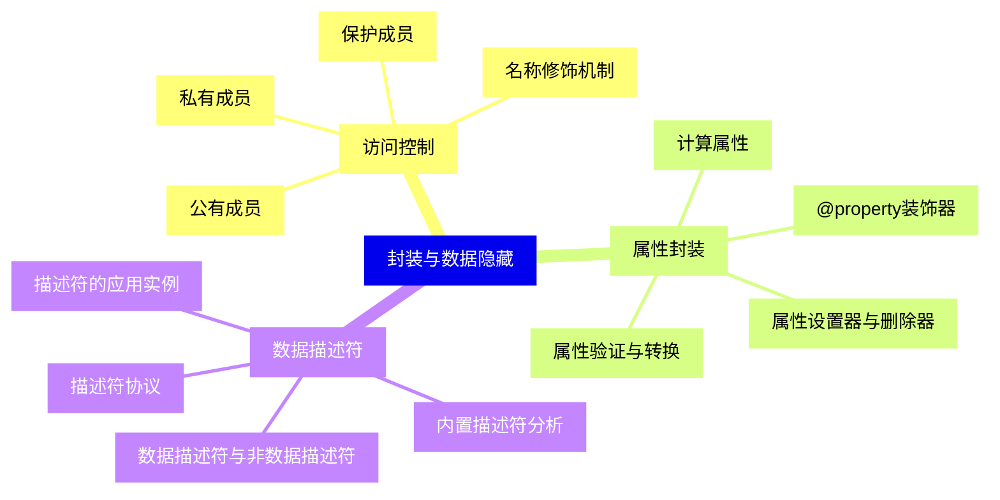
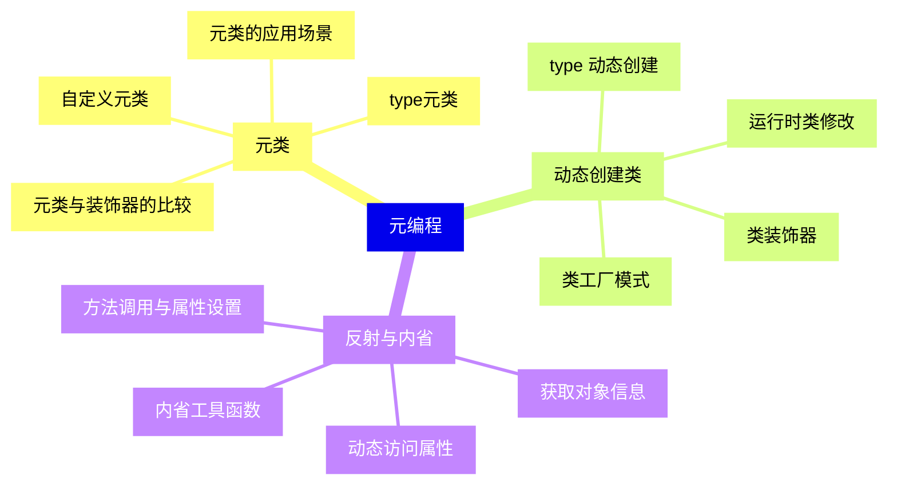
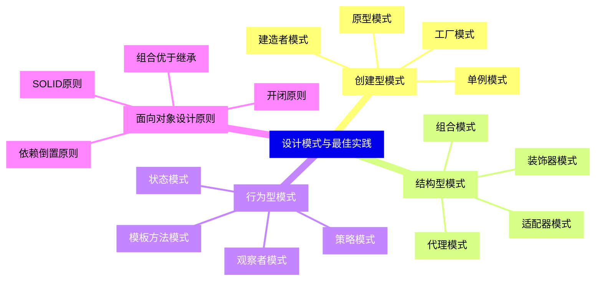
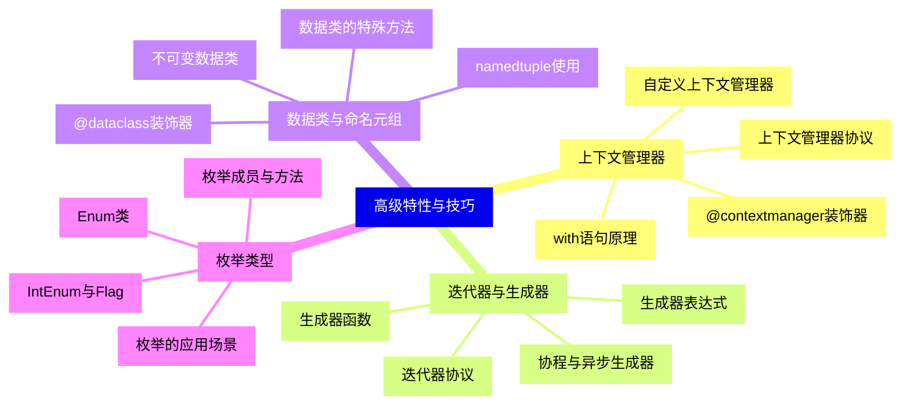
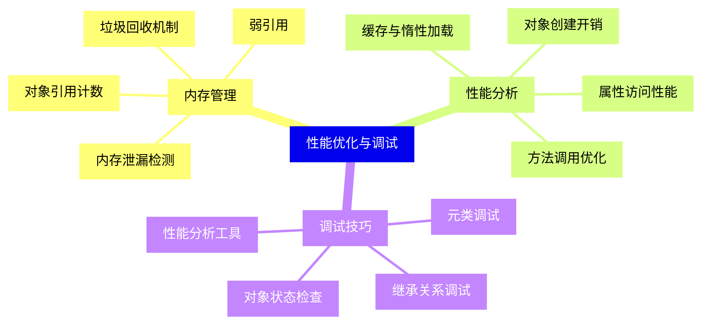
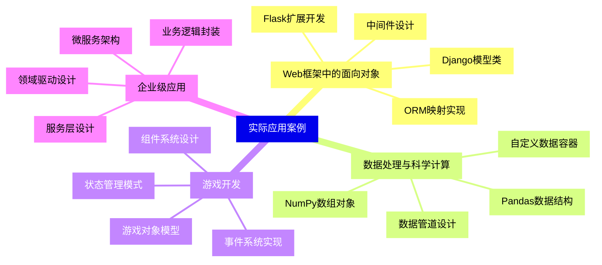


### 1 [类与对象深入理解](#1)
#### 1.1 [类的特殊方法](#1)
##### 1.1.1 [构造与析构方法](#1)
##### 1.1.2 [字符串表示方法](#1)
##### 1.1.3 [比较运算符重载](#1)
##### 1.1.4 [算术运算符重载](#1)
##### 1.1.5 [容器类型模拟](#1)
#### 1.2 [类属性与实例属性](#1)
##### 1.2.1 [类变量与实例变量](#1)
##### 1.2.2 [属性访问控制](#1)
##### 1.2.3 [属性描述符](#1)
##### 1.2.4 [属性访问器方法](#1)
#### 1.3 [类方法与静态方法](#1)
##### 1.3.1 [@classmethod装饰器](#1)
##### 1.3.2 [@staticmethod装饰器](#1)
##### 1.3.3 [方法绑定机制](#1)
##### 1.3.4 [应用场景对比](#1)
### 2 [继承与多态](#2)
#### 2.1 [继承机制](#2)
##### 2.1.1 [单继承与多继承](#2)
##### 2.1.2 [方法解析顺序 MRO](#2)
##### 2.1.3 [super  函数详解](#2)
##### 2.1.4 [抽象基类](#2)
#### 2.2 [多态实现](#2)
##### 2.2.1 [鸭子类型](#2)
##### 2.2.2 [接口与实现分离](#2)
##### 2.2.3 [多态的应用模式](#2)
##### 2.2.4 [类型检查与类型提示](#2)
#### 2.3 [混入类 Mixin](#2)
##### 2.3.1 [Mixin设计模式](#2)
##### 2.3.2 [多重继承中的Mixin](#2)
##### 2.3.3 [功能组合与代码复用](#2)
##### 2.3.4 [最佳实践与注意事项](#2)
### 3 [封装与数据隐藏](#3)
#### 3.1 [访问控制](#3)
##### 3.1.1 [公有成员](#3)
##### 3.1.2 [保护成员](#3)
##### 3.1.3 [私有成员](#3)
##### 3.1.4 [名称修饰机制](#3)
#### 3.2 [属性封装](#3)
##### 3.2.1 [@property装饰器](#3)
##### 3.2.2 [属性设置器与删除器](#3)
##### 3.2.3 [计算属性](#3)
##### 3.2.4 [属性验证与转换](#3)
#### 3.3 [数据描述符](#3)
##### 3.3.1 [描述符协议](#3)
##### 3.3.2 [数据描述符与非数据描述符](#3)
##### 3.3.3 [描述符的应用实例](#3)
##### 3.3.4 [内置描述符分析](#3)
### 4 [元编程](#4)
#### 4.1 [元类](#4)
##### 4.1.1 [type元类](#4)
##### 4.1.2 [自定义元类](#4)
##### 4.1.3 [元类的应用场景](#4)
##### 4.1.4 [元类与装饰器的比较](#4)
#### 4.2 [动态创建类](#4)
##### 4.2.1 [type  动态创建](#4)
##### 4.2.2 [类装饰器](#4)
##### 4.2.3 [运行时类修改](#4)
##### 4.2.4 [类工厂模式](#4)
#### 4.3 [反射与内省](#4)
##### 4.3.1 [获取对象信息](#4)
##### 4.3.2 [动态访问属性](#4)
##### 4.3.3 [方法调用与属性设置](#4)
##### 4.3.4 [内省工具函数](#4)
### 5 [设计模式与最佳实践](#5)
#### 5.1 [创建型模式](#5)
##### 5.1.1 [单例模式](#5)
##### 5.1.2 [工厂模式](#5)
##### 5.1.3 [建造者模式](#5)
##### 5.1.4 [原型模式](#5)
#### 5.2 [结构型模式](#5)
##### 5.2.1 [适配器模式](#5)
##### 5.2.2 [装饰器模式](#5)
##### 5.2.3 [代理模式](#5)
##### 5.2.4 [组合模式](#5)
#### 5.3 [行为型模式](#5)
##### 5.3.1 [观察者模式](#5)
##### 5.3.2 [策略模式](#5)
##### 5.3.3 [模板方法模式](#5)
##### 5.3.4 [状态模式](#5)
#### 5.4 [面向对象设计原则](#5)
##### 5.4.1 [SOLID原则](#5)
##### 5.4.2 [组合优于继承](#5)
##### 5.4.3 [开闭原则](#5)
##### 5.4.4 [依赖倒置原则](#5)
### 6 [高级特性与技巧](#6)
#### 6.1 [上下文管理器](#6)
##### 6.1.1 [with语句原理](#6)
##### 6.1.2 [上下文管理器协议](#6)
##### 6.1.3 [@contextmanager装饰器](#6)
##### 6.1.4 [自定义上下文管理器](#6)
#### 6.2 [迭代器与生成器](#6)
##### 6.2.1 [迭代器协议](#6)
##### 6.2.2 [生成器函数](#6)
##### 6.2.3 [生成器表达式](#6)
##### 6.2.4 [协程与异步生成器](#6)
#### 6.3 [数据类与命名元组](#6)
##### 6.3.1 [@dataclass装饰器](#6)
##### 6.3.2 [namedtuple使用](#6)
##### 6.3.3 [数据类的特殊方法](#6)
##### 6.3.4 [不可变数据类](#6)
#### 6.4 [枚举类型](#6)
##### 6.4.1 [Enum类](#6)
##### 6.4.2 [IntEnum与Flag](#6)
##### 6.4.3 [枚举成员与方法](#6)
##### 6.4.4 [枚举的应用场景](#6)
### 7 [性能优化与调试](#7)
#### 7.1 [内存管理](#7)
##### 7.1.1 [对象引用计数](#7)
##### 7.1.2 [垃圾回收机制](#7)
##### 7.1.3 [弱引用](#7)
##### 7.1.4 [内存泄漏检测](#7)
#### 7.2 [性能分析](#7)
##### 7.2.1 [对象创建开销](#7)
##### 7.2.2 [方法调用优化](#7)
##### 7.2.3 [属性访问性能](#7)
##### 7.2.4 [缓存与惰性加载](#7)
#### 7.3 [调试技巧](#7)
##### 7.3.1 [对象状态检查](#7)
##### 7.3.2 [继承关系调试](#7)
##### 7.3.3 [元类调试](#7)
##### 7.3.4 [性能分析工具](#7)
### 8 [实际应用案例](#8)
#### 8.1 [Web框架中的面向对象](#8)
##### 8.1.1 [Django模型类](#8)
##### 8.1.2 [Flask扩展开发](#8)
##### 8.1.3 [ORM映射实现](#8)
##### 8.1.4 [中间件设计](#8)
#### 8.2 [数据处理与科学计算](#8)
##### 8.2.1 [Pandas数据结构](#8)
##### 8.2.2 [NumPy数组对象](#8)
##### 8.2.3 [自定义数据容器](#8)
##### 8.2.4 [数据管道设计](#8)
#### 8.3 [游戏开发](#8)
##### 8.3.1 [游戏对象模型](#8)
##### 8.3.2 [组件系统设计](#8)
##### 8.3.3 [事件系统实现](#8)
##### 8.3.4 [状态管理模式](#8)
#### 8.4 [企业级应用](#8)
##### 8.4.1 [业务逻辑封装](#8)
##### 8.4.2 [服务层设计](#8)
##### 8.4.3 [领域驱动设计](#8)
##### 8.4.4 [微服务架构](#8)




### 1 类与对象深入理解

---
### 1 类与对象深入理解
___
#### 1.1 类的特殊方法
___
##### 1.1.1 构造与析构方法
___
##### 1.1.2 字符串表示方法
___
##### 1.1.3 比较运算符重载
___
##### 1.1.4 算术运算符重载
___
##### 1.1.5 容器类型模拟
___
#### 1.2 类属性与实例属性
___
##### 1.2.1 类变量与实例变量
___
##### 1.2.2 属性访问控制
___
##### 1.2.3 属性描述符
___
##### 1.2.4 属性访问器方法
___
#### 1.3 类方法与静态方法
___
##### 1.3.1 @classmethod装饰器
___
##### 1.3.2 @staticmethod装饰器
___
##### 1.3.3 方法绑定机制
___
##### 1.3.4 应用场景对比
### 2 继承与多态

---
### 2 继承与多态
___
#### 2.1 继承机制
___
##### 2.1.1 单继承与多继承
___
##### 2.1.2 方法解析顺序 MRO
___
##### 2.1.3 super  函数详解
___
##### 2.1.4 抽象基类
___
#### 2.2 多态实现
___
##### 2.2.1 鸭子类型
___
##### 2.2.2 接口与实现分离
___
##### 2.2.3 多态的应用模式
___
##### 2.2.4 类型检查与类型提示
___
#### 2.3 混入类 Mixin
___
##### 2.3.1 Mixin设计模式
___
##### 2.3.2 多重继承中的Mixin
___
##### 2.3.3 功能组合与代码复用
___
##### 2.3.4 最佳实践与注意事项
### 3 封装与数据隐藏

---
### 3 封装与数据隐藏
___
#### 3.1 访问控制
___
##### 3.1.1 公有成员
___
##### 3.1.2 保护成员
___
##### 3.1.3 私有成员
___
##### 3.1.4 名称修饰机制
___
#### 3.2 属性封装
___
##### 3.2.1 @property装饰器
___
##### 3.2.2 属性设置器与删除器
___
##### 3.2.3 计算属性
___
##### 3.2.4 属性验证与转换
___
#### 3.3 数据描述符
___
##### 3.3.1 描述符协议
___
##### 3.3.2 数据描述符与非数据描述符
___
##### 3.3.3 描述符的应用实例
___
##### 3.3.4 内置描述符分析
### 4 元编程

---
### 4 元编程
___
#### 4.1 元类
___
##### 4.1.1 type元类
___
##### 4.1.2 自定义元类
___
##### 4.1.3 元类的应用场景
___
##### 4.1.4 元类与装饰器的比较
___
#### 4.2 动态创建类
___
##### 4.2.1 type  动态创建
___
##### 4.2.2 类装饰器
___
##### 4.2.3 运行时类修改
___
##### 4.2.4 类工厂模式
___
#### 4.3 反射与内省
___
##### 4.3.1 获取对象信息
___
##### 4.3.2 动态访问属性
___
##### 4.3.3 方法调用与属性设置
___
##### 4.3.4 内省工具函数
### 5 设计模式与最佳实践

---
### 5 设计模式与最佳实践
___
#### 5.1 创建型模式
___
##### 5.1.1 单例模式
___
##### 5.1.2 工厂模式
___
##### 5.1.3 建造者模式
___
##### 5.1.4 原型模式
___
#### 5.2 结构型模式
___
##### 5.2.1 适配器模式
___
##### 5.2.2 装饰器模式
___
##### 5.2.3 代理模式
___
##### 5.2.4 组合模式
___
#### 5.3 行为型模式
___
##### 5.3.1 观察者模式
___
##### 5.3.2 策略模式
___
##### 5.3.3 模板方法模式
___
##### 5.3.4 状态模式
___
#### 5.4 面向对象设计原则
___
##### 5.4.1 SOLID原则
___
##### 5.4.2 组合优于继承
___
##### 5.4.3 开闭原则
___
##### 5.4.4 依赖倒置原则
### 6 高级特性与技巧

---
### 6 高级特性与技巧
___
#### 6.1 上下文管理器
___
##### 6.1.1 with语句原理
___
##### 6.1.2 上下文管理器协议
___
##### 6.1.3 @contextmanager装饰器
___
##### 6.1.4 自定义上下文管理器
___
#### 6.2 迭代器与生成器
___
##### 6.2.1 迭代器协议
___
##### 6.2.2 生成器函数
___
##### 6.2.3 生成器表达式
___
##### 6.2.4 协程与异步生成器
___
#### 6.3 数据类与命名元组
___
##### 6.3.1 @dataclass装饰器
___
##### 6.3.2 namedtuple使用
___
##### 6.3.3 数据类的特殊方法
___
##### 6.3.4 不可变数据类
___
#### 6.4 枚举类型
___
##### 6.4.1 Enum类
___
##### 6.4.2 IntEnum与Flag
___
##### 6.4.3 枚举成员与方法
___
##### 6.4.4 枚举的应用场景
### 7 性能优化与调试

---
### 7 性能优化与调试
___
#### 7.1 内存管理
___
##### 7.1.1 对象引用计数
___
##### 7.1.2 垃圾回收机制
___
##### 7.1.3 弱引用
___
##### 7.1.4 内存泄漏检测
___
#### 7.2 性能分析
___
##### 7.2.1 对象创建开销
___
##### 7.2.2 方法调用优化
___
##### 7.2.3 属性访问性能
___
##### 7.2.4 缓存与惰性加载
___
#### 7.3 调试技巧
___
##### 7.3.1 对象状态检查
___
##### 7.3.2 继承关系调试
___
##### 7.3.3 元类调试
___
##### 7.3.4 性能分析工具
### 8 实际应用案例

---
### 8 实际应用案例
___
#### 8.1 Web框架中的面向对象
___
##### 8.1.1 Django模型类
___
##### 8.1.2 Flask扩展开发
___
##### 8.1.3 ORM映射实现
___
##### 8.1.4 中间件设计
___
#### 8.2 数据处理与科学计算
___
##### 8.2.1 Pandas数据结构
___
##### 8.2.2 NumPy数组对象
___
##### 8.2.3 自定义数据容器
___
##### 8.2.4 数据管道设计
___
#### 8.3 游戏开发
___
##### 8.3.1 游戏对象模型
___
##### 8.3.2 组件系统设计
___
##### 8.3.3 事件系统实现
___
##### 8.3.4 状态管理模式
___
#### 8.4 企业级应用
___
##### 8.4.1 业务逻辑封装
___
##### 8.4.2 服务层设计
___
##### 8.4.3 领域驱动设计
___
##### 8.4.4 微服务架构


### 1 类与对象深入理解{#1}

{}

<--->
{}
{}
{}
{}
{}
{}
{}
{}
{}
{}
{}
{}
{}
{}
{}
{}
{}
{}
{}
{}
{}
{}
{}
{}
{}
{}
{}
{}
{}
{}
{}
{}
{}

### 2 继承与多态{#2}

{}
{}
{}
{}
{}
{}
{}
{}
{}
{}
{}
{}
{}
{}
{}
{}
{}
{}
{}
{}
{}
{}
{}
{}
{}
{}
{}
{}
{}
{}
{}
<--->

{}

### 3 封装与数据隐藏{#3}

{}

<--->
{}
{}
{}
{}
{}
{}
{}
{}
{}
{}
{}
{}
{}
{}
{}
{}
{}
{}
{}
{}
{}
{}
{}
{}
{}
{}
{}
{}
{}
{}
{}

### 4 元编程{#4}

{}
{}
{}
{}
{}
{}
{}
{}
{}
{}
{}
{}
{}
{}
{}
{}
{}
{}
{}
{}
{}
{}
{}
{}
{}
{}
{}
{}
{}
{}
{}
<--->

{}

### 5 设计模式与最佳实践{#5}

{}

<--->
{}
{}
{}
{}
{}
{}
{}
{}
{}
{}
{}
{}
{}
{}
{}
{}
{}
{}
{}
{}
{}
{}
{}
{}
{}
{}
{}
{}
{}
{}
{}
{}
{}
{}
{}
{}
{}
{}
{}
{}
{}

### 6 高级特性与技巧{#6}

{}
{}
{}
{}
{}
{}
{}
{}
{}
{}
{}
{}
{}
{}
{}
{}
{}
{}
{}
{}
{}
{}
{}
{}
{}
{}
{}
{}
{}
{}
{}
{}
{}
{}
{}
{}
{}
{}
{}
{}
{}
<--->

{}

### 7 性能优化与调试{#7}

{}

<--->
{}
{}
{}
{}
{}
{}
{}
{}
{}
{}
{}
{}
{}
{}
{}
{}
{}
{}
{}
{}
{}
{}
{}
{}
{}
{}
{}
{}
{}
{}
{}

### 8 实际应用案例{#8}

{}
{}
{}
{}
{}
{}
{}
{}
{}
{}
{}
{}
{}
{}
{}
{}
{}
{}
{}
{}
{}
{}
{}
{}
{}
{}
{}
{}
{}
{}
{}
{}
{}
{}
{}
{}
{}
{}
{}
{}
{}
<--->

{}
