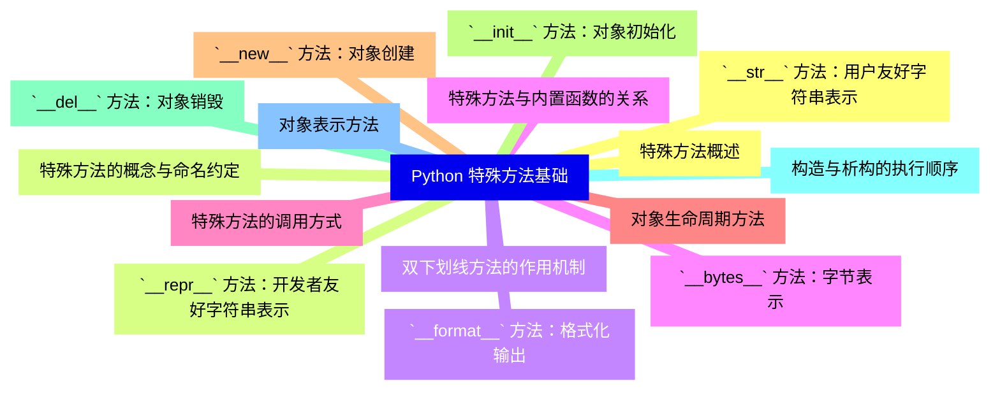
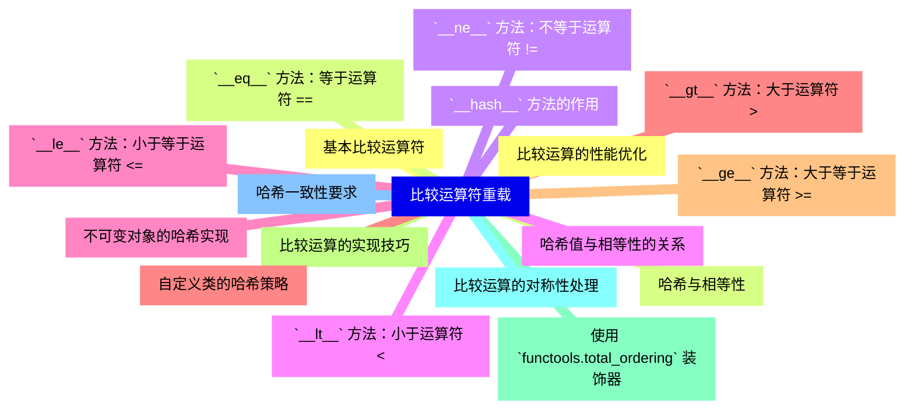
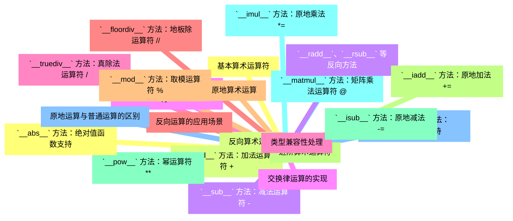
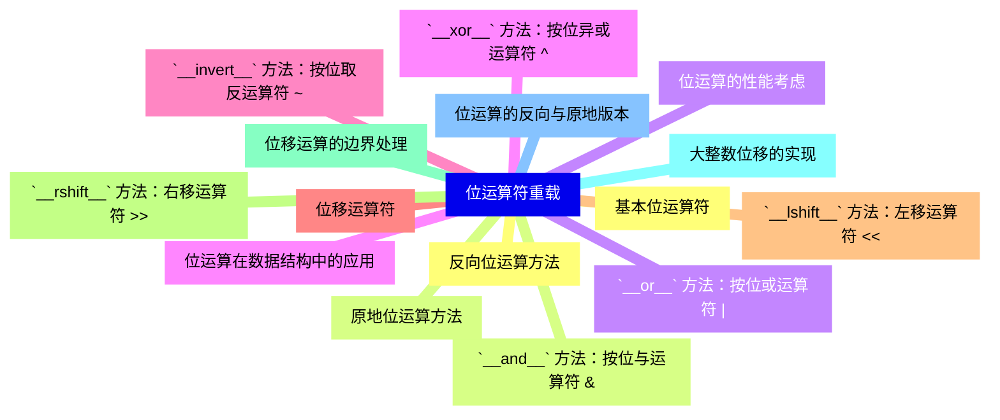
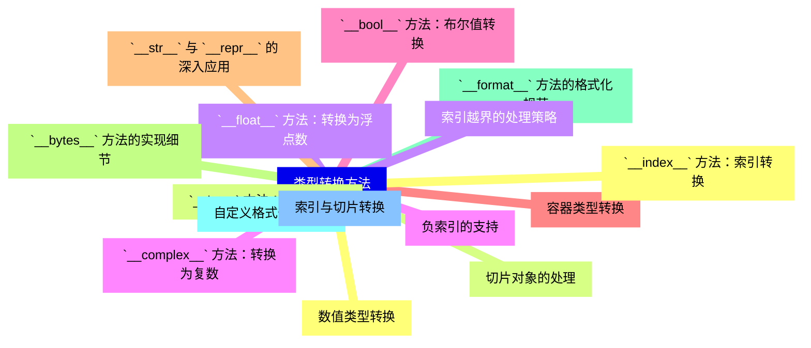
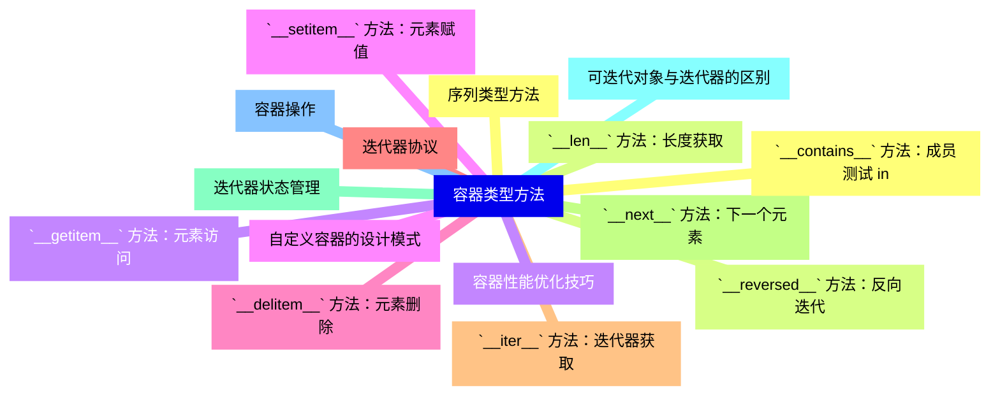
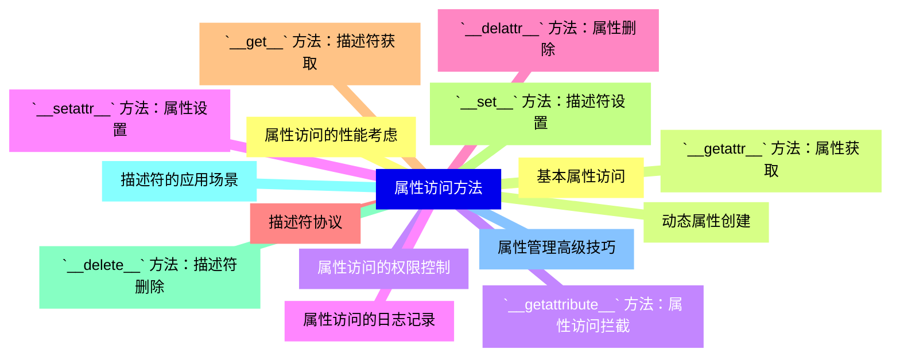
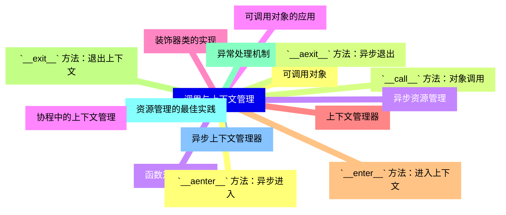
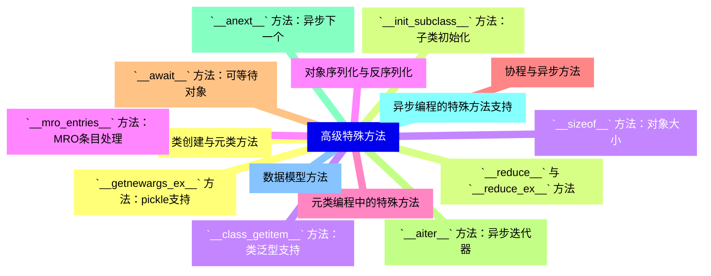
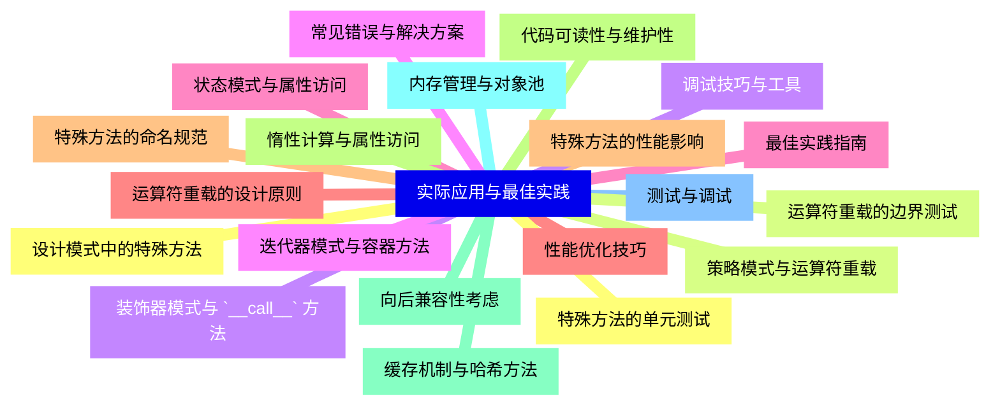


### 1 [Python 特殊方法基础](#1)
#### 1.1 [特殊方法概述](#1)
#### 1.2 [特殊方法的概念与命名约定](#1)
#### 1.3 [双下划线方法的作用机制](#1)
#### 1.4 [特殊方法与内置函数的关系](#1)
#### 1.5 [特殊方法的调用方式](#1)
#### 1.6 [对象生命周期方法](#1)
#### 1.7 [`__new__` 方法：对象创建](#1)
#### 1.8 [`__init__` 方法：对象初始化](#1)
#### 1.9 [`__del__` 方法：对象销毁](#1)
#### 1.10 [构造与析构的执行顺序](#1)
#### 1.11 [对象表示方法](#1)
#### 1.12 [`__str__` 方法：用户友好字符串表示](#1)
#### 1.13 [`__repr__` 方法：开发者友好字符串表示](#1)
#### 1.14 [`__format__` 方法：格式化输出](#1)
#### 1.15 [`__bytes__` 方法：字节表示](#1)
### 2 [比较运算符重载](#2)
#### 2.1 [基本比较运算符](#2)
#### 2.2 [`__eq__` 方法：等于运算符 ==](#2)
#### 2.3 [`__ne__` 方法：不等于运算符 !=](#2)
#### 2.4 [`__lt__` 方法：小于运算符 <](#2)
#### 2.5 [`__le__` 方法：小于等于运算符 <=](#2)
#### 2.6 [`__gt__` 方法：大于运算符 >](#2)
#### 2.7 [`__ge__` 方法：大于等于运算符 >=](#2)
#### 2.8 [比较运算的实现技巧](#2)
#### 2.9 [使用 `functools.total_ordering` 装饰器](#2)
#### 2.10 [比较运算的对称性处理](#2)
#### 2.11 [哈希一致性要求](#2)
#### 2.12 [比较运算的性能优化](#2)
#### 2.13 [哈希与相等性](#2)
#### 2.14 [`__hash__` 方法的作用](#2)
#### 2.15 [哈希值与相等性的关系](#2)
#### 2.16 [不可变对象的哈希实现](#2)
#### 2.17 [自定义类的哈希策略](#2)
### 3 [算术运算符重载](#3)
#### 3.1 [基本算术运算符](#3)
#### 3.2 [`__add__` 方法：加法运算符 +](#3)
#### 3.3 [`__sub__` 方法：减法运算符 -](#3)
#### 3.4 [`__mul__` 方法：乘法运算符 *](#3)
#### 3.5 [`__truediv__` 方法：真除法运算符 /](#3)
#### 3.6 [`__floordiv__` 方法：地板除运算符 //](#3)
#### 3.7 [`__mod__` 方法：取模运算符 %](#3)
#### 3.8 [进阶算术运算符](#3)
#### 3.9 [`__pow__` 方法：幂运算符 **](#3)
#### 3.10 [`__matmul__` 方法：矩阵乘法运算符 @](#3)
#### 3.11 [`__divmod__` 方法：divmod函数支持](#3)
#### 3.12 [`__abs__` 方法：绝对值函数支持](#3)
#### 3.13 [反向算术运算](#3)
#### 3.14 [`__radd__`、`__rsub__` 等反向方法](#3)
#### 3.15 [交换律运算的实现](#3)
#### 3.16 [类型兼容性处理](#3)
#### 3.17 [反向运算的应用场景](#3)
#### 3.18 [原地算术运算](#3)
#### 3.19 [`__iadd__` 方法：原地加法 +=](#3)
#### 3.20 [`__isub__` 方法：原地减法 -=](#3)
#### 3.21 [`__imul__` 方法：原地乘法 *=](#3)
#### 3.22 [原地运算与普通运算的区别](#3)
### 4 [位运算符重载](#4)
#### 4.1 [基本位运算符](#4)
#### 4.2 [`__and__` 方法：按位与运算符 &](#4)
#### 4.3 [`__or__` 方法：按位或运算符 |](#4)
#### 4.4 [`__xor__` 方法：按位异或运算符 ^](#4)
#### 4.5 [`__invert__` 方法：按位取反运算符 ~](#4)
#### 4.6 [位移运算符](#4)
#### 4.7 [`__lshift__` 方法：左移运算符 <<](#4)
#### 4.8 [`__rshift__` 方法：右移运算符 >>](#4)
#### 4.9 [位移运算的边界处理](#4)
#### 4.10 [大整数位移的实现](#4)
#### 4.11 [位运算的反向与原地版本](#4)
#### 4.12 [反向位运算方法](#4)
#### 4.13 [原地位运算方法](#4)
#### 4.14 [位运算的性能考虑](#4)
#### 4.15 [位运算在数据结构中的应用](#4)
### 5 [类型转换方法](#5)
#### 5.1 [数值类型转换](#5)
#### 5.2 [`__int__` 方法：转换为整数](#5)
#### 5.3 [`__float__` 方法：转换为浮点数](#5)
#### 5.4 [`__complex__` 方法：转换为复数](#5)
#### 5.5 [`__bool__` 方法：布尔值转换](#5)
#### 5.6 [容器类型转换](#5)
#### 5.7 [`__str__` 与 `__repr__` 的深入应用](#5)
#### 5.8 [`__bytes__` 方法的实现细节](#5)
#### 5.9 [`__format__` 方法的格式化规范](#5)
#### 5.10 [自定义格式化字符串](#5)
#### 5.11 [索引与切片转换](#5)
#### 5.12 [`__index__` 方法：索引转换](#5)
#### 5.13 [切片对象的处理](#5)
#### 5.14 [索引越界的处理策略](#5)
#### 5.15 [负索引的支持](#5)
### 6 [容器类型方法](#6)
#### 6.1 [序列类型方法](#6)
#### 6.2 [`__len__` 方法：长度获取](#6)
#### 6.3 [`__getitem__` 方法：元素访问](#6)
#### 6.4 [`__setitem__` 方法：元素赋值](#6)
#### 6.5 [`__delitem__` 方法：元素删除](#6)
#### 6.6 [迭代器协议](#6)
#### 6.7 [`__iter__` 方法：迭代器获取](#6)
#### 6.8 [`__next__` 方法：下一个元素](#6)
#### 6.9 [迭代器状态管理](#6)
#### 6.10 [可迭代对象与迭代器的区别](#6)
#### 6.11 [容器操作](#6)
#### 6.12 [`__contains__` 方法：成员测试 in](#6)
#### 6.13 [`__reversed__` 方法：反向迭代](#6)
#### 6.14 [容器性能优化技巧](#6)
#### 6.15 [自定义容器的设计模式](#6)
### 7 [属性访问方法](#7)
#### 7.1 [基本属性访问](#7)
#### 7.2 [`__getattr__` 方法：属性获取](#7)
#### 7.3 [`__getattribute__` 方法：属性访问拦截](#7)
#### 7.4 [`__setattr__` 方法：属性设置](#7)
#### 7.5 [`__delattr__` 方法：属性删除](#7)
#### 7.6 [描述符协议](#7)
#### 7.7 [`__get__` 方法：描述符获取](#7)
#### 7.8 [`__set__` 方法：描述符设置](#7)
#### 7.9 [`__delete__` 方法：描述符删除](#7)
#### 7.10 [描述符的应用场景](#7)
#### 7.11 [属性管理高级技巧](#7)
#### 7.12 [属性访问的性能考虑](#7)
#### 7.13 [动态属性创建](#7)
#### 7.14 [属性访问的权限控制](#7)
#### 7.15 [属性访问的日志记录](#7)
### 8 [调用与上下文管理](#8)
#### 8.1 [可调用对象](#8)
#### 8.2 [`__call__` 方法：对象调用](#8)
#### 8.3 [函数对象的模拟](#8)
#### 8.4 [可调用对象的应用](#8)
#### 8.5 [装饰器类的实现](#8)
#### 8.6 [上下文管理器](#8)
#### 8.7 [`__enter__` 方法：进入上下文](#8)
#### 8.8 [`__exit__` 方法：退出上下文](#8)
#### 8.9 [异常处理机制](#8)
#### 8.10 [资源管理的最佳实践](#8)
#### 8.11 [异步上下文管理器](#8)
#### 8.12 [`__aenter__` 方法：异步进入](#8)
#### 8.13 [`__aexit__` 方法：异步退出](#8)
#### 8.14 [异步资源管理](#8)
#### 8.15 [协程中的上下文管理](#8)
### 9 [高级特殊方法](#9)
#### 9.1 [类创建与元类方法](#9)
#### 9.2 [`__init_subclass__` 方法：子类初始化](#9)
#### 9.3 [`__class_getitem__` 方法：类泛型支持](#9)
#### 9.4 [`__mro_entries__` 方法：MRO条目处理](#9)
#### 9.5 [元类编程中的特殊方法](#9)
#### 9.6 [协程与异步方法](#9)
#### 9.7 [`__await__` 方法：可等待对象](#9)
#### 9.8 [`__aiter__` 方法：异步迭代器](#9)
#### 9.9 [`__anext__` 方法：异步下一个](#9)
#### 9.10 [异步编程的特殊方法支持](#9)
#### 9.11 [数据模型方法](#9)
#### 9.12 [`__getnewargs_ex__` 方法：pickle支持](#9)
#### 9.13 [`__reduce__` 与 `__reduce_ex__` 方法](#9)
#### 9.14 [`__sizeof__` 方法：对象大小](#9)
#### 9.15 [对象序列化与反序列化](#9)
### 10 [实际应用与最佳实践](#10)
#### 10.1 [设计模式中的特殊方法](#10)
#### 10.2 [策略模式与运算符重载](#10)
#### 10.3 [装饰器模式与 `__call__` 方法](#10)
#### 10.4 [迭代器模式与容器方法](#10)
#### 10.5 [状态模式与属性访问](#10)
#### 10.6 [性能优化技巧](#10)
#### 10.7 [特殊方法的性能影响](#10)
#### 10.8 [惰性计算与属性访问](#10)
#### 10.9 [缓存机制与哈希方法](#10)
#### 10.10 [内存管理与对象池](#10)
#### 10.11 [测试与调试](#10)
#### 10.12 [特殊方法的单元测试](#10)
#### 10.13 [运算符重载的边界测试](#10)
#### 10.14 [调试技巧与工具](#10)
#### 10.15 [常见错误与解决方案](#10)
#### 10.16 [最佳实践指南](#10)
#### 10.17 [运算符重载的设计原则](#10)
#### 10.18 [特殊方法的命名规范](#10)
#### 10.19 [代码可读性与维护性](#10)
#### 10.20 [向后兼容性考虑](#10)




### 1 Python 特殊方法基础

---
### 1 Python 特殊方法基础
___
#### 1.1 特殊方法概述
___
#### 1.2 特殊方法的概念与命名约定
___
#### 1.3 双下划线方法的作用机制
___
#### 1.4 特殊方法与内置函数的关系
___
#### 1.5 特殊方法的调用方式
___
#### 1.6 对象生命周期方法
___
#### 1.7 `__new__` 方法：对象创建
___
#### 1.8 `__init__` 方法：对象初始化
___
#### 1.9 `__del__` 方法：对象销毁
___
#### 1.10 构造与析构的执行顺序
___
#### 1.11 对象表示方法
___
#### 1.12 `__str__` 方法：用户友好字符串表示
___
#### 1.13 `__repr__` 方法：开发者友好字符串表示
___
#### 1.14 `__format__` 方法：格式化输出
___
#### 1.15 `__bytes__` 方法：字节表示
### 2 比较运算符重载

---
### 2 比较运算符重载
___
#### 2.1 基本比较运算符
___
#### 2.2 `__eq__` 方法：等于运算符 ==
___
#### 2.3 `__ne__` 方法：不等于运算符 !=
___
#### 2.4 `__lt__` 方法：小于运算符 <
___
#### 2.5 `__le__` 方法：小于等于运算符 <=
___
#### 2.6 `__gt__` 方法：大于运算符 >
___
#### 2.7 `__ge__` 方法：大于等于运算符 >=
___
#### 2.8 比较运算的实现技巧
___
#### 2.9 使用 `functools.total_ordering` 装饰器
___
#### 2.10 比较运算的对称性处理
___
#### 2.11 哈希一致性要求
___
#### 2.12 比较运算的性能优化
___
#### 2.13 哈希与相等性
___
#### 2.14 `__hash__` 方法的作用
___
#### 2.15 哈希值与相等性的关系
___
#### 2.16 不可变对象的哈希实现
___
#### 2.17 自定义类的哈希策略
### 3 算术运算符重载

---
### 3 算术运算符重载
___
#### 3.1 基本算术运算符
___
#### 3.2 `__add__` 方法：加法运算符 +
___
#### 3.3 `__sub__` 方法：减法运算符 -
___
#### 3.4 `__mul__` 方法：乘法运算符 *
___
#### 3.5 `__truediv__` 方法：真除法运算符 /
___
#### 3.6 `__floordiv__` 方法：地板除运算符 //
___
#### 3.7 `__mod__` 方法：取模运算符 %
___
#### 3.8 进阶算术运算符
___
#### 3.9 `__pow__` 方法：幂运算符 **
___
#### 3.10 `__matmul__` 方法：矩阵乘法运算符 @
___
#### 3.11 `__divmod__` 方法：divmod函数支持
___
#### 3.12 `__abs__` 方法：绝对值函数支持
___
#### 3.13 反向算术运算
___
#### 3.14 `__radd__`、`__rsub__` 等反向方法
___
#### 3.15 交换律运算的实现
___
#### 3.16 类型兼容性处理
___
#### 3.17 反向运算的应用场景
___
#### 3.18 原地算术运算
___
#### 3.19 `__iadd__` 方法：原地加法 +=
___
#### 3.20 `__isub__` 方法：原地减法 -=
___
#### 3.21 `__imul__` 方法：原地乘法 *=
___
#### 3.22 原地运算与普通运算的区别
### 4 位运算符重载

---
### 4 位运算符重载
___
#### 4.1 基本位运算符
___
#### 4.2 `__and__` 方法：按位与运算符 &
___
#### 4.3 `__or__` 方法：按位或运算符 |
___
#### 4.4 `__xor__` 方法：按位异或运算符 ^
___
#### 4.5 `__invert__` 方法：按位取反运算符 ~
___
#### 4.6 位移运算符
___
#### 4.7 `__lshift__` 方法：左移运算符 <<
___
#### 4.8 `__rshift__` 方法：右移运算符 >>
___
#### 4.9 位移运算的边界处理
___
#### 4.10 大整数位移的实现
___
#### 4.11 位运算的反向与原地版本
___
#### 4.12 反向位运算方法
___
#### 4.13 原地位运算方法
___
#### 4.14 位运算的性能考虑
___
#### 4.15 位运算在数据结构中的应用
### 5 类型转换方法

---
### 5 类型转换方法
___
#### 5.1 数值类型转换
___
#### 5.2 `__int__` 方法：转换为整数
___
#### 5.3 `__float__` 方法：转换为浮点数
___
#### 5.4 `__complex__` 方法：转换为复数
___
#### 5.5 `__bool__` 方法：布尔值转换
___
#### 5.6 容器类型转换
___
#### 5.7 `__str__` 与 `__repr__` 的深入应用
___
#### 5.8 `__bytes__` 方法的实现细节
___
#### 5.9 `__format__` 方法的格式化规范
___
#### 5.10 自定义格式化字符串
___
#### 5.11 索引与切片转换
___
#### 5.12 `__index__` 方法：索引转换
___
#### 5.13 切片对象的处理
___
#### 5.14 索引越界的处理策略
___
#### 5.15 负索引的支持
### 6 容器类型方法

---
### 6 容器类型方法
___
#### 6.1 序列类型方法
___
#### 6.2 `__len__` 方法：长度获取
___
#### 6.3 `__getitem__` 方法：元素访问
___
#### 6.4 `__setitem__` 方法：元素赋值
___
#### 6.5 `__delitem__` 方法：元素删除
___
#### 6.6 迭代器协议
___
#### 6.7 `__iter__` 方法：迭代器获取
___
#### 6.8 `__next__` 方法：下一个元素
___
#### 6.9 迭代器状态管理
___
#### 6.10 可迭代对象与迭代器的区别
___
#### 6.11 容器操作
___
#### 6.12 `__contains__` 方法：成员测试 in
___
#### 6.13 `__reversed__` 方法：反向迭代
___
#### 6.14 容器性能优化技巧
___
#### 6.15 自定义容器的设计模式
### 7 属性访问方法

---
### 7 属性访问方法
___
#### 7.1 基本属性访问
___
#### 7.2 `__getattr__` 方法：属性获取
___
#### 7.3 `__getattribute__` 方法：属性访问拦截
___
#### 7.4 `__setattr__` 方法：属性设置
___
#### 7.5 `__delattr__` 方法：属性删除
___
#### 7.6 描述符协议
___
#### 7.7 `__get__` 方法：描述符获取
___
#### 7.8 `__set__` 方法：描述符设置
___
#### 7.9 `__delete__` 方法：描述符删除
___
#### 7.10 描述符的应用场景
___
#### 7.11 属性管理高级技巧
___
#### 7.12 属性访问的性能考虑
___
#### 7.13 动态属性创建
___
#### 7.14 属性访问的权限控制
___
#### 7.15 属性访问的日志记录
### 8 调用与上下文管理

---
### 8 调用与上下文管理
___
#### 8.1 可调用对象
___
#### 8.2 `__call__` 方法：对象调用
___
#### 8.3 函数对象的模拟
___
#### 8.4 可调用对象的应用
___
#### 8.5 装饰器类的实现
___
#### 8.6 上下文管理器
___
#### 8.7 `__enter__` 方法：进入上下文
___
#### 8.8 `__exit__` 方法：退出上下文
___
#### 8.9 异常处理机制
___
#### 8.10 资源管理的最佳实践
___
#### 8.11 异步上下文管理器
___
#### 8.12 `__aenter__` 方法：异步进入
___
#### 8.13 `__aexit__` 方法：异步退出
___
#### 8.14 异步资源管理
___
#### 8.15 协程中的上下文管理
### 9 高级特殊方法

---
### 9 高级特殊方法
___
#### 9.1 类创建与元类方法
___
#### 9.2 `__init_subclass__` 方法：子类初始化
___
#### 9.3 `__class_getitem__` 方法：类泛型支持
___
#### 9.4 `__mro_entries__` 方法：MRO条目处理
___
#### 9.5 元类编程中的特殊方法
___
#### 9.6 协程与异步方法
___
#### 9.7 `__await__` 方法：可等待对象
___
#### 9.8 `__aiter__` 方法：异步迭代器
___
#### 9.9 `__anext__` 方法：异步下一个
___
#### 9.10 异步编程的特殊方法支持
___
#### 9.11 数据模型方法
___
#### 9.12 `__getnewargs_ex__` 方法：pickle支持
___
#### 9.13 `__reduce__` 与 `__reduce_ex__` 方法
___
#### 9.14 `__sizeof__` 方法：对象大小
___
#### 9.15 对象序列化与反序列化
### 10 实际应用与最佳实践

---
### 10 实际应用与最佳实践
___
#### 10.1 设计模式中的特殊方法
___
#### 10.2 策略模式与运算符重载
___
#### 10.3 装饰器模式与 `__call__` 方法
___
#### 10.4 迭代器模式与容器方法
___
#### 10.5 状态模式与属性访问
___
#### 10.6 性能优化技巧
___
#### 10.7 特殊方法的性能影响
___
#### 10.8 惰性计算与属性访问
___
#### 10.9 缓存机制与哈希方法
___
#### 10.10 内存管理与对象池
___
#### 10.11 测试与调试
___
#### 10.12 特殊方法的单元测试
___
#### 10.13 运算符重载的边界测试
___
#### 10.14 调试技巧与工具
___
#### 10.15 常见错误与解决方案
___
#### 10.16 最佳实践指南
___
#### 10.17 运算符重载的设计原则
___
#### 10.18 特殊方法的命名规范
___
#### 10.19 代码可读性与维护性
___
#### 10.20 向后兼容性考虑


### 1 Python 特殊方法基础{#1}

{}

<--->
{}
{}
{}
{}
{}
{}
{}
{}
{}
{}
{}
{}
{}
{}
{}
{}
{}
{}
{}
{}
{}
{}
{}
{}
{}
{}
{}
{}
{}
{}
{}

### 2 比较运算符重载{#2}

{}
{}
{}
{}
{}
{}
{}
{}
{}
{}
{}
{}
{}
{}
{}
{}
{}
{}
{}
{}
{}
{}
{}
{}
{}
{}
{}
{}
{}
{}
{}
{}
{}
{}
{}
<--->

{}

### 3 算术运算符重载{#3}

{}

<--->
{}
{}
{}
{}
{}
{}
{}
{}
{}
{}
{}
{}
{{% details "`__mod__` 方法：取模运算符 %" %}}
{}
{}
{}
{}
{}
{}
{}
{}
{}
{}
{}
{}
{}
{}
{}
{}
{}
{}
{}
{}
{}
{}
{}
{}
{}
{}
{}
{}
{}
{}
{}
{}

### 4 位运算符重载{#4}

{}
{}
{}
{}
{}
{}
{}
{}
{}
{}
{}
{}
{}
{}
{}
{}
{}
{}
{}
{}
{}
{}
{}
{}
{}
{}
{}
{}
{}
{}
{}
<--->

{}

### 5 类型转换方法{#5}

{}

<--->
{}
{}
{}
{}
{}
{}
{}
{}
{}
{}
{}
{}
{}
{}
{}
{}
{}
{}
{}
{}
{}
{}
{}
{}
{}
{}
{}
{}
{}
{}
{}

### 6 容器类型方法{#6}

{}
{}
{}
{}
{}
{}
{}
{}
{}
{}
{}
{}
{}
{}
{}
{}
{}
{}
{}
{}
{}
{}
{}
{}
{}
{}
{}
{}
{}
{}
{}
<--->

{}

### 7 属性访问方法{#7}

{}

<--->
{}
{}
{}
{}
{}
{}
{}
{}
{}
{}
{}
{}
{}
{}
{}
{}
{}
{}
{}
{}
{}
{}
{}
{}
{}
{}
{}
{}
{}
{}
{}

### 8 调用与上下文管理{#8}

{}
{}
{}
{}
{}
{}
{}
{}
{}
{}
{}
{}
{}
{}
{}
{}
{}
{}
{}
{}
{}
{}
{}
{}
{}
{}
{}
{}
{}
{}
{}
<--->

{}

### 9 高级特殊方法{#9}

{}

<--->
{}
{}
{}
{}
{}
{}
{}
{}
{}
{}
{}
{}
{}
{}
{}
{}
{}
{}
{}
{}
{}
{}
{}
{}
{}
{}
{}
{}
{}
{}
{}

### 10 实际应用与最佳实践{#10}

{}
{}
{}
{}
{}
{}
{}
{}
{}
{}
{}
{}
{}
{}
{}
{}
{}
{}
{}
{}
{}
{}
{}
{}
{}
{}
{}
{}
{}
{}
{}
{}
{}
{}
{}
{}
{}
{}
{}
{}
{}
<--->

{}
