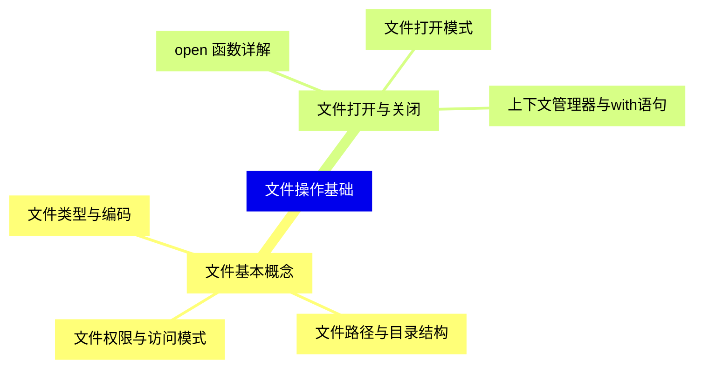
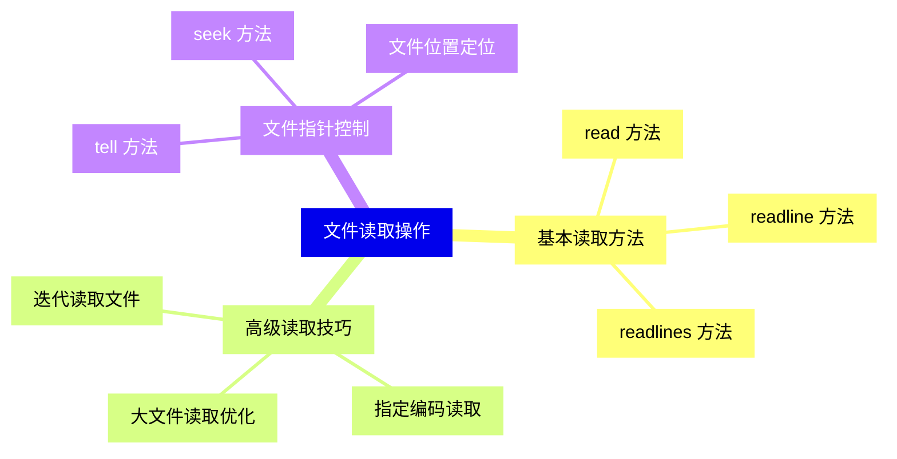
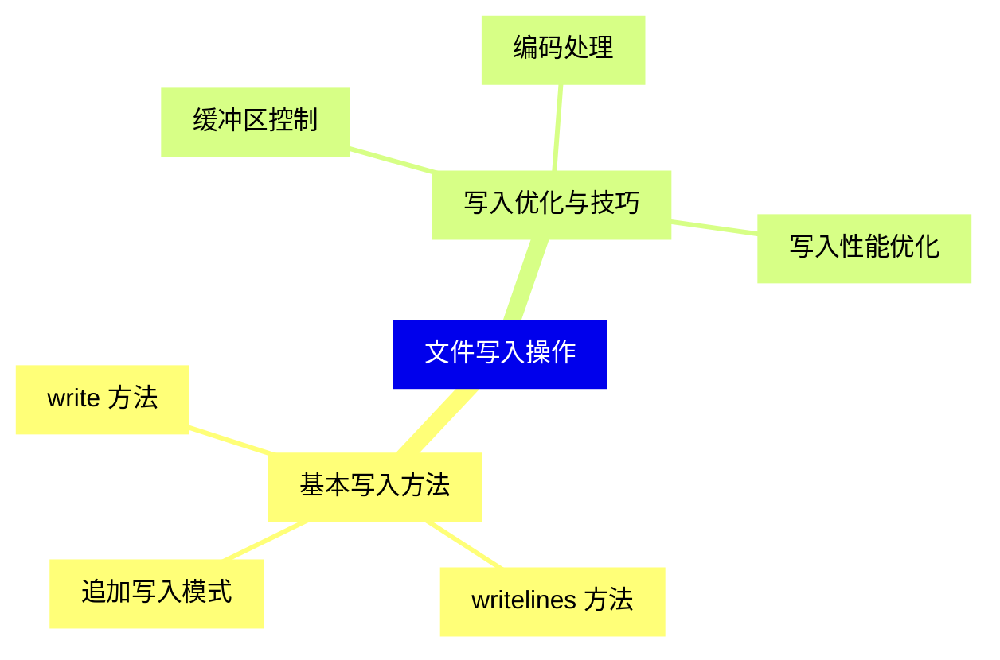
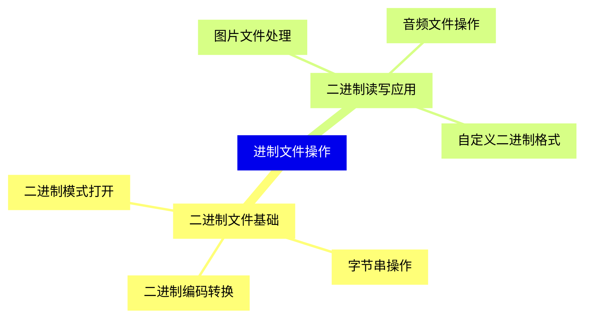
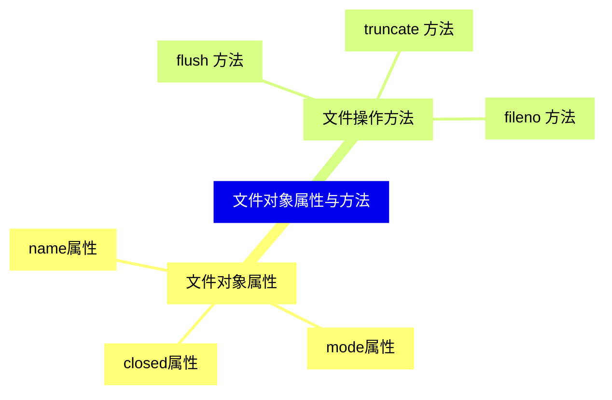
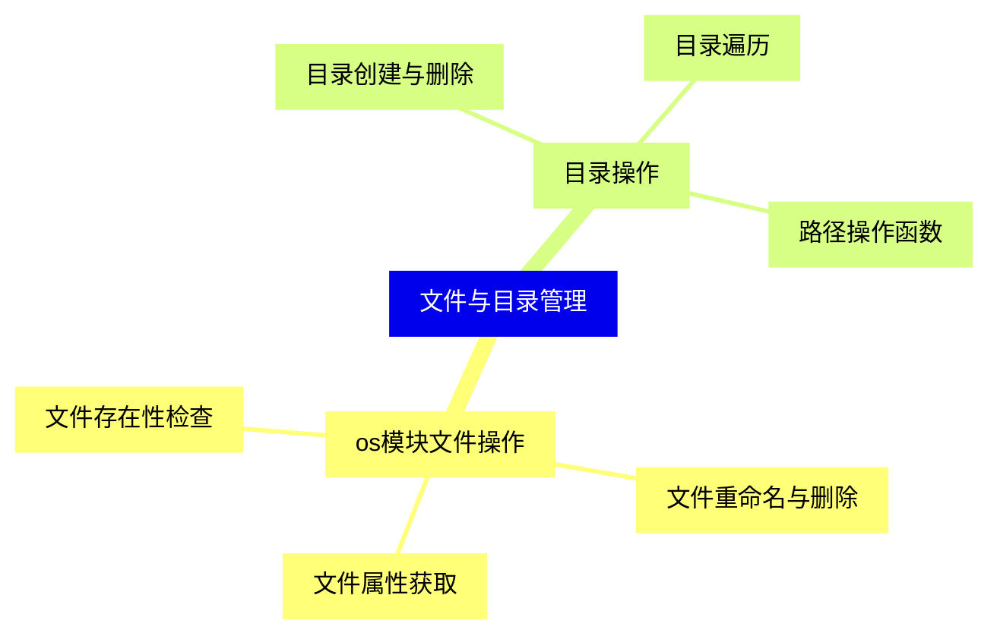
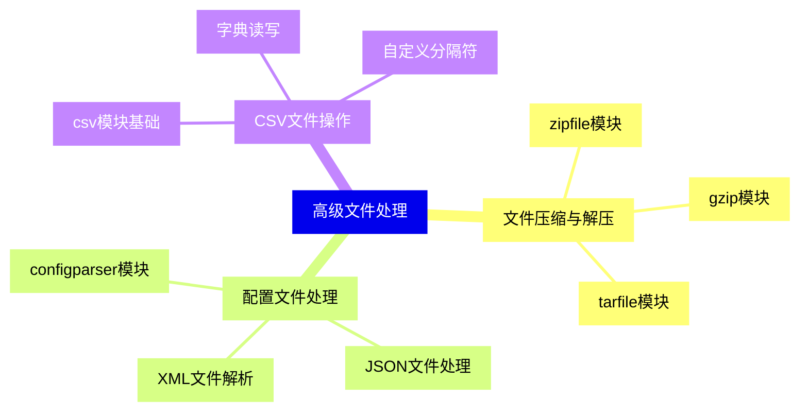
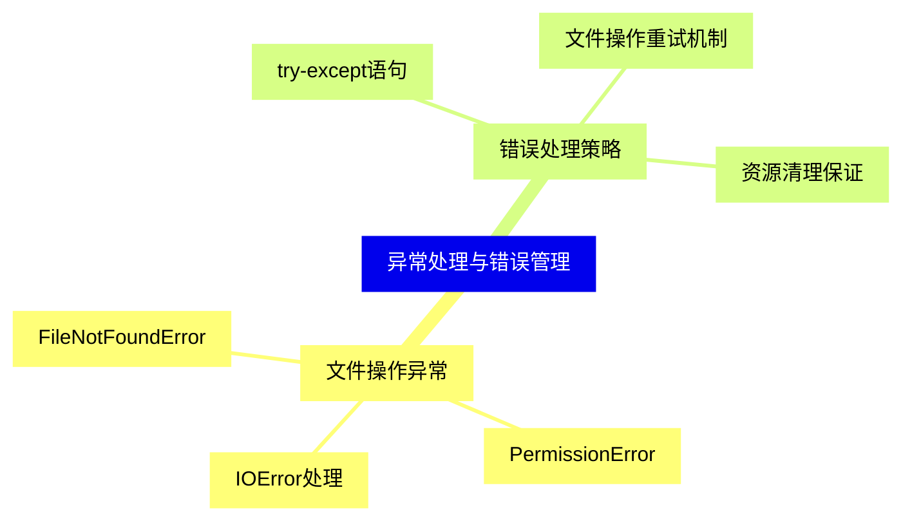
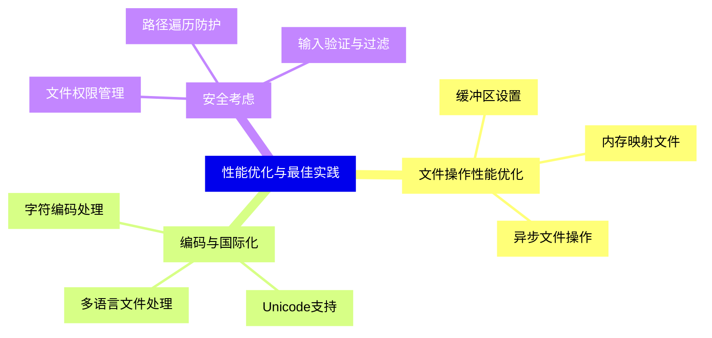
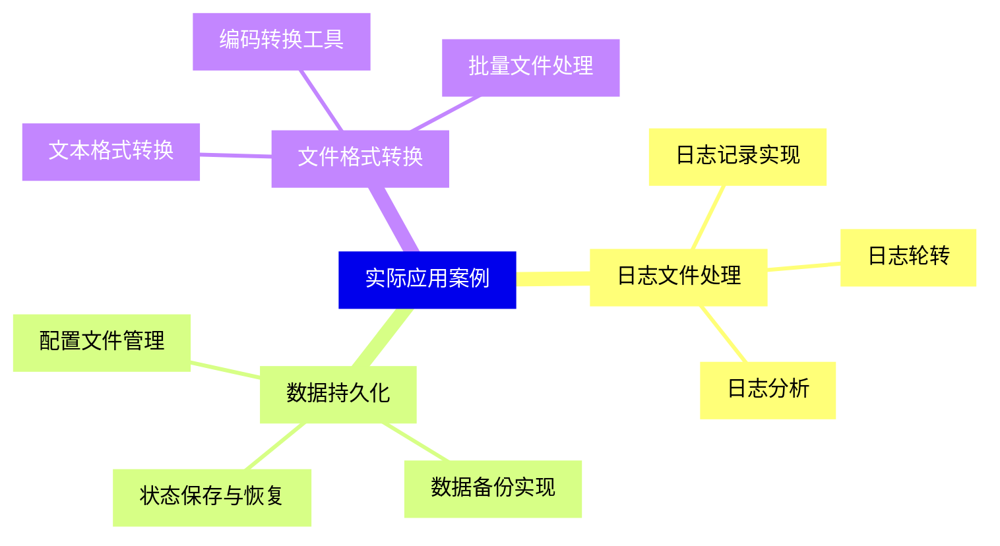


### 1 [文件操作基础](#1)
#### 1.1 [文件基本概念](#1)
##### 1.1.1 [文件类型与编码](#1)
##### 1.1.2 [文件路径与目录结构](#1)
##### 1.1.3 [文件权限与访问模式](#1)
#### 1.2 [文件打开与关闭](#1)
##### 1.2.1 [open  函数详解](#1)
##### 1.2.2 [文件打开模式](#1)
##### 1.2.3 [上下文管理器与with语句](#1)
### 2 [文件读取操作](#2)
#### 2.1 [基本读取方法](#2)
##### 2.1.1 [read  方法](#2)
##### 2.1.2 [readline  方法](#2)
##### 2.1.3 [readlines  方法](#2)
#### 2.2 [高级读取技巧](#2)
##### 2.2.1 [迭代读取文件](#2)
##### 2.2.2 [指定编码读取](#2)
##### 2.2.3 [大文件读取优化](#2)
#### 2.3 [文件指针控制](#2)
##### 2.3.1 [tell  方法](#2)
##### 2.3.2 [seek  方法](#2)
##### 2.3.3 [文件位置定位](#2)
### 3 [文件写入操作](#3)
#### 3.1 [基本写入方法](#3)
##### 3.1.1 [write  方法](#3)
##### 3.1.2 [writelines  方法](#3)
##### 3.1.3 [追加写入模式](#3)
#### 3.2 [写入优化与技巧](#3)
##### 3.2.1 [缓冲区控制](#3)
##### 3.2.2 [编码处理](#3)
##### 3.2.3 [写入性能优化](#3)
### 4 [进制文件操作](#4)
#### 4.1 [二进制文件基础](#4)
##### 4.1.1 [二进制模式打开](#4)
##### 4.1.2 [字节串操作](#4)
##### 4.1.3 [二进制编码转换](#4)
#### 4.2 [二进制读写应用](#4)
##### 4.2.1 [图片文件处理](#4)
##### 4.2.2 [音频文件操作](#4)
##### 4.2.3 [自定义二进制格式](#4)
### 5 [文件对象属性与方法](#5)
#### 5.1 [文件对象属性](#5)
##### 5.1.1 [name属性](#5)
##### 5.1.2 [mode属性](#5)
##### 5.1.3 [closed属性](#5)
#### 5.2 [文件操作方法](#5)
##### 5.2.1 [flush  方法](#5)
##### 5.2.2 [truncate  方法](#5)
##### 5.2.3 [fileno  方法](#5)
### 6 [文件与目录管理](#6)
#### 6.1 [os模块文件操作](#6)
##### 6.1.1 [文件重命名与删除](#6)
##### 6.1.2 [文件属性获取](#6)
##### 6.1.3 [文件存在性检查](#6)
#### 6.2 [目录操作](#6)
##### 6.2.1 [目录创建与删除](#6)
##### 6.2.2 [目录遍历](#6)
##### 6.2.3 [路径操作函数](#6)
### 7 [高级文件处理](#7)
#### 7.1 [文件压缩与解压](#7)
##### 7.1.1 [zipfile模块](#7)
##### 7.1.2 [gzip模块](#7)
##### 7.1.3 [tarfile模块](#7)
#### 7.2 [配置文件处理](#7)
##### 7.2.1 [configparser模块](#7)
##### 7.2.2 [JSON文件处理](#7)
##### 7.2.3 [XML文件解析](#7)
#### 7.3 [CSV文件操作](#7)
##### 7.3.1 [csv模块基础](#7)
##### 7.3.2 [字典读写](#7)
##### 7.3.3 [自定义分隔符](#7)
### 8 [异常处理与错误管理](#8)
#### 8.1 [文件操作异常](#8)
##### 8.1.1 [FileNotFoundError](#8)
##### 8.1.2 [PermissionError](#8)
##### 8.1.3 [IOError处理](#8)
#### 8.2 [错误处理策略](#8)
##### 8.2.1 [try-except语句](#8)
##### 8.2.2 [文件操作重试机制](#8)
##### 8.2.3 [资源清理保证](#8)
### 9 [性能优化与最佳实践](#9)
#### 9.1 [文件操作性能优化](#9)
##### 9.1.1 [缓冲区设置](#9)
##### 9.1.2 [内存映射文件](#9)
##### 9.1.3 [异步文件操作](#9)
#### 9.2 [编码与国际化](#9)
##### 9.2.1 [字符编码处理](#9)
##### 9.2.2 [Unicode支持](#9)
##### 9.2.3 [多语言文件处理](#9)
#### 9.3 [安全考虑](#9)
##### 9.3.1 [文件权限管理](#9)
##### 9.3.2 [路径遍历防护](#9)
##### 9.3.3 [输入验证与过滤](#9)
### 10 [实际应用案例](#10)
#### 10.1 [日志文件处理](#10)
##### 10.1.1 [日志记录实现](#10)
##### 10.1.2 [日志轮转](#10)
##### 10.1.3 [日志分析](#10)
#### 10.2 [数据持久化](#10)
##### 10.2.1 [配置文件管理](#10)
##### 10.2.2 [数据备份实现](#10)
##### 10.2.3 [状态保存与恢复](#10)
#### 10.3 [文件格式转换](#10)
##### 10.3.1 [文本格式转换](#10)
##### 10.3.2 [编码转换工具](#10)
##### 10.3.3 [批量文件处理](#10)




### 1 文件操作基础

---
### 1 文件操作基础
___
#### 1.1 文件基本概念
___
##### 1.1.1 文件类型与编码
___
##### 1.1.2 文件路径与目录结构
___
##### 1.1.3 文件权限与访问模式
___
#### 1.2 文件打开与关闭
___
##### 1.2.1 open  函数详解
___
##### 1.2.2 文件打开模式
___
##### 1.2.3 上下文管理器与with语句
### 2 文件读取操作

---
### 2 文件读取操作
___
#### 2.1 基本读取方法
___
##### 2.1.1 read  方法
___
##### 2.1.2 readline  方法
___
##### 2.1.3 readlines  方法
___
#### 2.2 高级读取技巧
___
##### 2.2.1 迭代读取文件
___
##### 2.2.2 指定编码读取
___
##### 2.2.3 大文件读取优化
___
#### 2.3 文件指针控制
___
##### 2.3.1 tell  方法
___
##### 2.3.2 seek  方法
___
##### 2.3.3 文件位置定位
### 3 文件写入操作

---
### 3 文件写入操作
___
#### 3.1 基本写入方法
___
##### 3.1.1 write  方法
___
##### 3.1.2 writelines  方法
___
##### 3.1.3 追加写入模式
___
#### 3.2 写入优化与技巧
___
##### 3.2.1 缓冲区控制
___
##### 3.2.2 编码处理
___
##### 3.2.3 写入性能优化
### 4 进制文件操作

---
### 4 进制文件操作
___
#### 4.1 二进制文件基础
___
##### 4.1.1 二进制模式打开
___
##### 4.1.2 字节串操作
___
##### 4.1.3 二进制编码转换
___
#### 4.2 二进制读写应用
___
##### 4.2.1 图片文件处理
___
##### 4.2.2 音频文件操作
___
##### 4.2.3 自定义二进制格式
### 5 文件对象属性与方法

---
### 5 文件对象属性与方法
___
#### 5.1 文件对象属性
___
##### 5.1.1 name属性
___
##### 5.1.2 mode属性
___
##### 5.1.3 closed属性
___
#### 5.2 文件操作方法
___
##### 5.2.1 flush  方法
___
##### 5.2.2 truncate  方法
___
##### 5.2.3 fileno  方法
### 6 文件与目录管理

---
### 6 文件与目录管理
___
#### 6.1 os模块文件操作
___
##### 6.1.1 文件重命名与删除
___
##### 6.1.2 文件属性获取
___
##### 6.1.3 文件存在性检查
___
#### 6.2 目录操作
___
##### 6.2.1 目录创建与删除
___
##### 6.2.2 目录遍历
___
##### 6.2.3 路径操作函数
### 7 高级文件处理

---
### 7 高级文件处理
___
#### 7.1 文件压缩与解压
___
##### 7.1.1 zipfile模块
___
##### 7.1.2 gzip模块
___
##### 7.1.3 tarfile模块
___
#### 7.2 配置文件处理
___
##### 7.2.1 configparser模块
___
##### 7.2.2 JSON文件处理
___
##### 7.2.3 XML文件解析
___
#### 7.3 CSV文件操作
___
##### 7.3.1 csv模块基础
___
##### 7.3.2 字典读写
___
##### 7.3.3 自定义分隔符
### 8 异常处理与错误管理

---
### 8 异常处理与错误管理
___
#### 8.1 文件操作异常
___
##### 8.1.1 FileNotFoundError
___
##### 8.1.2 PermissionError
___
##### 8.1.3 IOError处理
___
#### 8.2 错误处理策略
___
##### 8.2.1 try-except语句
___
##### 8.2.2 文件操作重试机制
___
##### 8.2.3 资源清理保证
### 9 性能优化与最佳实践

---
### 9 性能优化与最佳实践
___
#### 9.1 文件操作性能优化
___
##### 9.1.1 缓冲区设置
___
##### 9.1.2 内存映射文件
___
##### 9.1.3 异步文件操作
___
#### 9.2 编码与国际化
___
##### 9.2.1 字符编码处理
___
##### 9.2.2 Unicode支持
___
##### 9.2.3 多语言文件处理
___
#### 9.3 安全考虑
___
##### 9.3.1 文件权限管理
___
##### 9.3.2 路径遍历防护
___
##### 9.3.3 输入验证与过滤
### 10 实际应用案例

---
### 10 实际应用案例
___
#### 10.1 日志文件处理
___
##### 10.1.1 日志记录实现
___
##### 10.1.2 日志轮转
___
##### 10.1.3 日志分析
___
#### 10.2 数据持久化
___
##### 10.2.1 配置文件管理
___
##### 10.2.2 数据备份实现
___
##### 10.2.3 状态保存与恢复
___
#### 10.3 文件格式转换
___
##### 10.3.1 文本格式转换
___
##### 10.3.2 编码转换工具
___
##### 10.3.3 批量文件处理


### 1 文件操作基础{#1}

{}

<--->
{}
{}
{}
{}
{}
{}
{}
{}
{}
{}
{}
{}
{}
{}
{}
{}
{}

### 2 文件读取操作{#2}

{}
{}
{}
{}
{}
{}
{}
{}
{}
{}
{}
{}
{}
{}
{}
{}
{}
{}
{}
{}
{}
{}
{}
{}
{}
<--->

{}

### 3 文件写入操作{#3}

{}

<--->
{}
{}
{}
{}
{}
{}
{}
{}
{}
{}
{}
{}
{}
{}
{}
{}
{}

### 4 进制文件操作{#4}

{}
{}
{}
{}
{}
{}
{}
{}
{}
{}
{}
{}
{}
{}
{}
{}
{}
<--->

{}

### 5 文件对象属性与方法{#5}

{}

<--->
{}
{}
{}
{}
{}
{}
{}
{}
{}
{}
{}
{}
{}
{}
{}
{}
{}

### 6 文件与目录管理{#6}

{}
{}
{}
{}
{}
{}
{}
{}
{}
{}
{}
{}
{}
{}
{}
{}
{}
<--->

{}

### 7 高级文件处理{#7}

{}

<--->
{}
{}
{}
{}
{}
{}
{}
{}
{}
{}
{}
{}
{}
{}
{}
{}
{}
{}
{}
{}
{}
{}
{}
{}
{}

### 8 异常处理与错误管理{#8}

{}
{}
{}
{}
{}
{}
{}
{}
{}
{}
{}
{}
{}
{}
{}
{}
{}
<--->

{}

### 9 性能优化与最佳实践{#9}

{}

<--->
{}
{}
{}
{}
{}
{}
{}
{}
{}
{}
{}
{}
{}
{}
{}
{}
{}
{}
{}
{}
{}
{}
{}
{}
{}

### 10 实际应用案例{#10}

{}
{}
{}
{}
{}
{}
{}
{}
{}
{}
{}
{}
{}
{}
{}
{}
{}
{}
{}
{}
{}
{}
{}
{}
{}
<--->

{}
