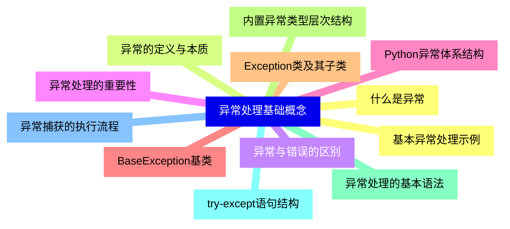
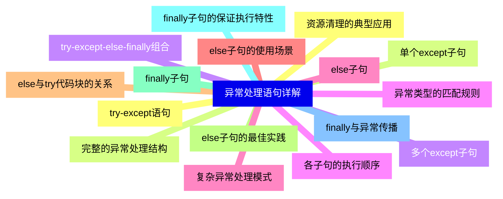
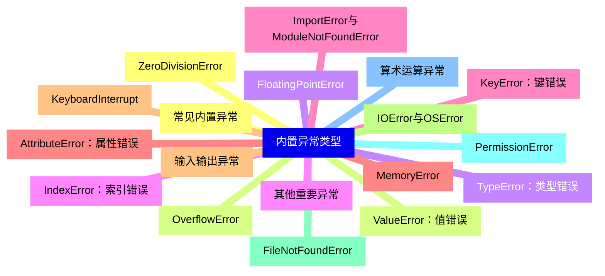
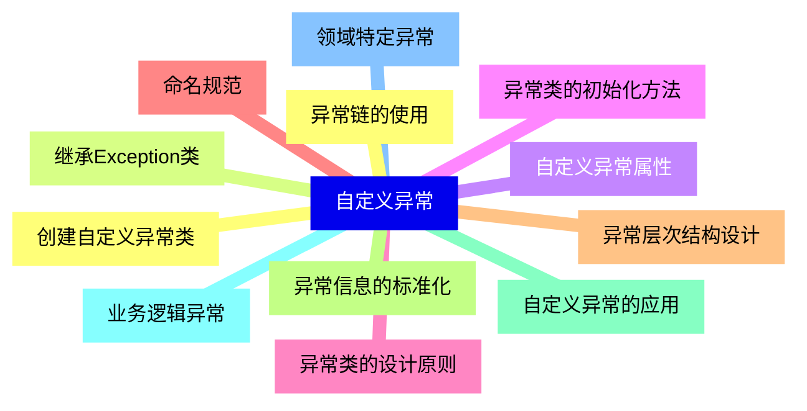
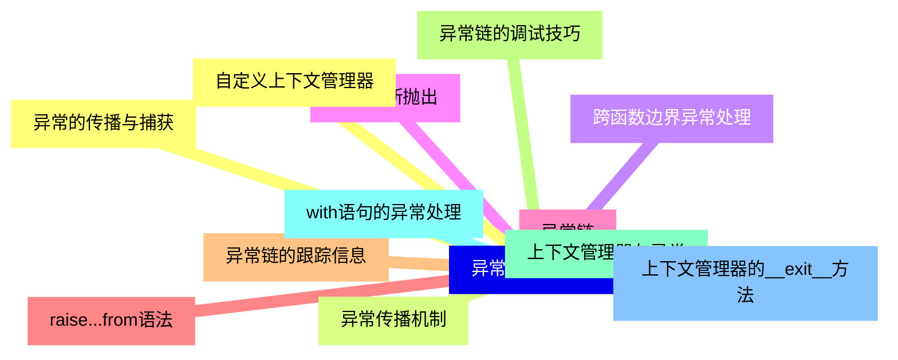
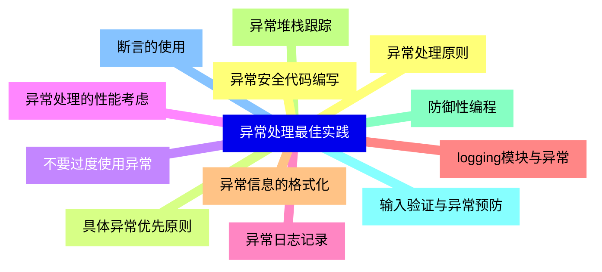
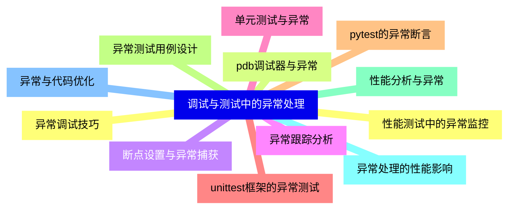
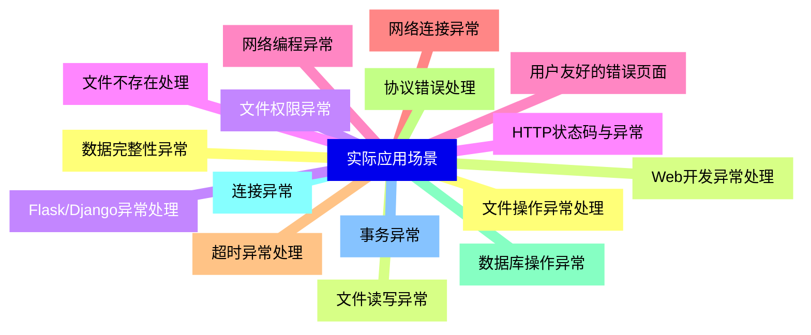
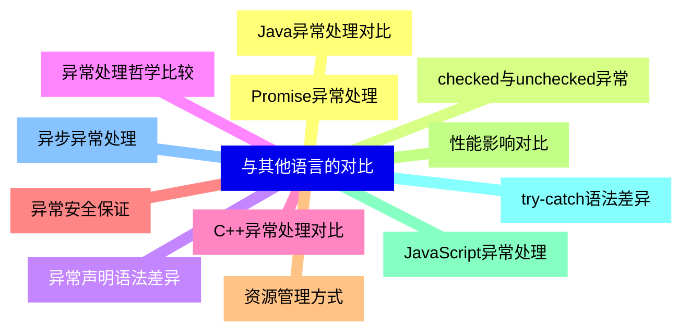
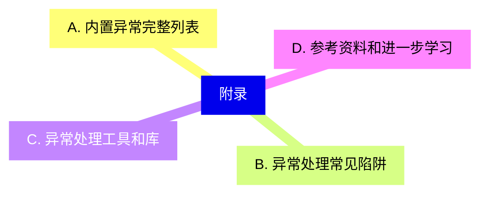


### 1 [异常处理基础概念](#1)
#### 1.1 [什么是异常](#1)
#### 1.2 [异常的定义与本质](#1)
#### 1.3 [异常与错误的区别](#1)
#### 1.4 [异常处理的重要性](#1)
#### 1.5 [Python异常体系结构](#1)
#### 1.6 [BaseException基类](#1)
#### 1.7 [Exception类及其子类](#1)
#### 1.8 [内置异常类型层次结构](#1)
#### 1.9 [异常处理的基本语法](#1)
#### 1.10 [try-except语句结构](#1)
#### 1.11 [异常捕获的执行流程](#1)
#### 1.12 [基本异常处理示例](#1)
### 2 [异常处理语句详解](#2)
#### 2.1 [try-except语句](#2)
#### 2.2 [单个except子句](#2)
#### 2.3 [多个except子句](#2)
#### 2.4 [异常类型的匹配规则](#2)
#### 2.5 [else子句](#2)
#### 2.6 [else子句的使用场景](#2)
#### 2.7 [else与try代码块的关系](#2)
#### 2.8 [else子句的最佳实践](#2)
#### 2.9 [finally子句](#2)
#### 2.10 [finally子句的保证执行特性](#2)
#### 2.11 [finally与异常传播](#2)
#### 2.12 [资源清理的典型应用](#2)
#### 2.13 [完整的异常处理结构](#2)
#### 2.14 [try-except-else-finally组合](#2)
#### 2.15 [各子句的执行顺序](#2)
#### 2.16 [复杂异常处理模式](#2)
### 3 [内置异常类型](#3)
#### 3.1 [常见内置异常](#3)
#### 3.2 [ValueError：值错误](#3)
#### 3.3 [TypeError：类型错误](#3)
#### 3.4 [IndexError：索引错误](#3)
#### 3.5 [KeyError：键错误](#3)
#### 3.6 [AttributeError：属性错误](#3)
#### 3.7 [输入输出异常](#3)
#### 3.8 [IOError与OSError](#3)
#### 3.9 [FileNotFoundError](#3)
#### 3.10 [PermissionError](#3)
#### 3.11 [算术运算异常](#3)
#### 3.12 [ZeroDivisionError](#3)
#### 3.13 [OverflowError](#3)
#### 3.14 [FloatingPointError](#3)
#### 3.15 [其他重要异常](#3)
#### 3.16 [ImportError与ModuleNotFoundError](#3)
#### 3.17 [MemoryError](#3)
#### 3.18 [KeyboardInterrupt](#3)
### 4 [自定义异常](#4)
#### 4.1 [创建自定义异常类](#4)
#### 4.2 [继承Exception类](#4)
#### 4.3 [自定义异常属性](#4)
#### 4.4 [异常类的初始化方法](#4)
#### 4.5 [异常类的设计原则](#4)
#### 4.6 [命名规范](#4)
#### 4.7 [异常层次结构设计](#4)
#### 4.8 [异常信息的标准化](#4)
#### 4.9 [自定义异常的应用](#4)
#### 4.10 [业务逻辑异常](#4)
#### 4.11 [领域特定异常](#4)
#### 4.12 [异常链的使用](#4)
### 5 [异常处理高级技巧](#5)
#### 5.1 [异常的传播与捕获](#5)
#### 5.2 [异常传播机制](#5)
#### 5.3 [跨函数边界异常处理](#5)
#### 5.4 [异常重新抛出](#5)
#### 5.5 [异常链](#5)
#### 5.6 [raise...from语法](#5)
#### 5.7 [异常链的跟踪信息](#5)
#### 5.8 [异常链的调试技巧](#5)
#### 5.9 [上下文管理器与异常](#5)
#### 5.10 [with语句的异常处理](#5)
#### 5.11 [上下文管理器的__exit__方法](#5)
#### 5.12 [自定义上下文管理器](#5)
### 6 [异常处理最佳实践](#6)
#### 6.1 [异常处理原则](#6)
#### 6.2 [具体异常优先原则](#6)
#### 6.3 [不要过度使用异常](#6)
#### 6.4 [异常处理的性能考虑](#6)
#### 6.5 [异常日志记录](#6)
#### 6.6 [logging模块与异常](#6)
#### 6.7 [异常信息的格式化](#6)
#### 6.8 [异常堆栈跟踪](#6)
#### 6.9 [防御性编程](#6)
#### 6.10 [输入验证与异常预防](#6)
#### 6.11 [断言的使用](#6)
#### 6.12 [异常安全代码编写](#6)
### 7 [调试与测试中的异常处理](#7)
#### 7.1 [异常调试技巧](#7)
#### 7.2 [pdb调试器与异常](#7)
#### 7.3 [断点设置与异常捕获](#7)
#### 7.4 [异常跟踪分析](#7)
#### 7.5 [单元测试与异常](#7)
#### 7.6 [unittest框架的异常测试](#7)
#### 7.7 [pytest的异常断言](#7)
#### 7.8 [异常测试用例设计](#7)
#### 7.9 [性能分析与异常](#7)
#### 7.10 [异常处理的性能影响](#7)
#### 7.11 [异常与代码优化](#7)
#### 7.12 [性能测试中的异常监控](#7)
### 8 [实际应用场景](#8)
#### 8.1 [文件操作异常处理](#8)
#### 8.2 [文件读写异常](#8)
#### 8.3 [文件权限异常](#8)
#### 8.4 [文件不存在处理](#8)
#### 8.5 [网络编程异常](#8)
#### 8.6 [网络连接异常](#8)
#### 8.7 [超时异常处理](#8)
#### 8.8 [协议错误处理](#8)
#### 8.9 [数据库操作异常](#8)
#### 8.10 [连接异常](#8)
#### 8.11 [事务异常](#8)
#### 8.12 [数据完整性异常](#8)
#### 8.13 [Web开发异常处理](#8)
#### 8.14 [Flask/Django异常处理](#8)
#### 8.15 [HTTP状态码与异常](#8)
#### 8.16 [用户友好的错误页面](#8)
### 9 [与其他语言的对比](#9)
#### 9.1 [Java异常处理对比](#9)
#### 9.2 [checked与unchecked异常](#9)
#### 9.3 [异常声明语法差异](#9)
#### 9.4 [异常处理哲学比较](#9)
#### 9.5 [C++异常处理对比](#9)
#### 9.6 [异常安全保证](#9)
#### 9.7 [资源管理方式](#9)
#### 9.8 [性能影响对比](#9)
#### 9.9 [JavaScript异常处理](#9)
#### 9.10 [try-catch语法差异](#9)
#### 9.11 [异步异常处理](#9)
#### 9.12 [Promise异常处理](#9)
### 10 [附录](#10)
#### 10.1 [A. 内置异常完整列表](#10)
#### 10.2 [B. 异常处理常见陷阱](#10)
#### 10.3 [C. 异常处理工具和库](#10)
#### 10.4 [D. 参考资料和进一步学习](#10)




### 1 异常处理基础概念

---
### 1 异常处理基础概念
___
#### 1.1 什么是异常
___
#### 1.2 异常的定义与本质
___
#### 1.3 异常与错误的区别
___
#### 1.4 异常处理的重要性
___
#### 1.5 Python异常体系结构
___
#### 1.6 BaseException基类
___
#### 1.7 Exception类及其子类
___
#### 1.8 内置异常类型层次结构
___
#### 1.9 异常处理的基本语法
___
#### 1.10 try-except语句结构
___
#### 1.11 异常捕获的执行流程
___
#### 1.12 基本异常处理示例
### 2 异常处理语句详解

---
### 2 异常处理语句详解
___
#### 2.1 try-except语句
___
#### 2.2 单个except子句
___
#### 2.3 多个except子句
___
#### 2.4 异常类型的匹配规则
___
#### 2.5 else子句
___
#### 2.6 else子句的使用场景
___
#### 2.7 else与try代码块的关系
___
#### 2.8 else子句的最佳实践
___
#### 2.9 finally子句
___
#### 2.10 finally子句的保证执行特性
___
#### 2.11 finally与异常传播
___
#### 2.12 资源清理的典型应用
___
#### 2.13 完整的异常处理结构
___
#### 2.14 try-except-else-finally组合
___
#### 2.15 各子句的执行顺序
___
#### 2.16 复杂异常处理模式
### 3 内置异常类型

---
### 3 内置异常类型
___
#### 3.1 常见内置异常
___
#### 3.2 ValueError：值错误
___
#### 3.3 TypeError：类型错误
___
#### 3.4 IndexError：索引错误
___
#### 3.5 KeyError：键错误
___
#### 3.6 AttributeError：属性错误
___
#### 3.7 输入输出异常
___
#### 3.8 IOError与OSError
___
#### 3.9 FileNotFoundError
___
#### 3.10 PermissionError
___
#### 3.11 算术运算异常
___
#### 3.12 ZeroDivisionError
___
#### 3.13 OverflowError
___
#### 3.14 FloatingPointError
___
#### 3.15 其他重要异常
___
#### 3.16 ImportError与ModuleNotFoundError
___
#### 3.17 MemoryError
___
#### 3.18 KeyboardInterrupt
### 4 自定义异常

---
### 4 自定义异常
___
#### 4.1 创建自定义异常类
___
#### 4.2 继承Exception类
___
#### 4.3 自定义异常属性
___
#### 4.4 异常类的初始化方法
___
#### 4.5 异常类的设计原则
___
#### 4.6 命名规范
___
#### 4.7 异常层次结构设计
___
#### 4.8 异常信息的标准化
___
#### 4.9 自定义异常的应用
___
#### 4.10 业务逻辑异常
___
#### 4.11 领域特定异常
___
#### 4.12 异常链的使用
### 5 异常处理高级技巧

---
### 5 异常处理高级技巧
___
#### 5.1 异常的传播与捕获
___
#### 5.2 异常传播机制
___
#### 5.3 跨函数边界异常处理
___
#### 5.4 异常重新抛出
___
#### 5.5 异常链
___
#### 5.6 raise...from语法
___
#### 5.7 异常链的跟踪信息
___
#### 5.8 异常链的调试技巧
___
#### 5.9 上下文管理器与异常
___
#### 5.10 with语句的异常处理
___
#### 5.11 上下文管理器的__exit__方法
___
#### 5.12 自定义上下文管理器
### 6 异常处理最佳实践

---
### 6 异常处理最佳实践
___
#### 6.1 异常处理原则
___
#### 6.2 具体异常优先原则
___
#### 6.3 不要过度使用异常
___
#### 6.4 异常处理的性能考虑
___
#### 6.5 异常日志记录
___
#### 6.6 logging模块与异常
___
#### 6.7 异常信息的格式化
___
#### 6.8 异常堆栈跟踪
___
#### 6.9 防御性编程
___
#### 6.10 输入验证与异常预防
___
#### 6.11 断言的使用
___
#### 6.12 异常安全代码编写
### 7 调试与测试中的异常处理

---
### 7 调试与测试中的异常处理
___
#### 7.1 异常调试技巧
___
#### 7.2 pdb调试器与异常
___
#### 7.3 断点设置与异常捕获
___
#### 7.4 异常跟踪分析
___
#### 7.5 单元测试与异常
___
#### 7.6 unittest框架的异常测试
___
#### 7.7 pytest的异常断言
___
#### 7.8 异常测试用例设计
___
#### 7.9 性能分析与异常
___
#### 7.10 异常处理的性能影响
___
#### 7.11 异常与代码优化
___
#### 7.12 性能测试中的异常监控
### 8 实际应用场景

---
### 8 实际应用场景
___
#### 8.1 文件操作异常处理
___
#### 8.2 文件读写异常
___
#### 8.3 文件权限异常
___
#### 8.4 文件不存在处理
___
#### 8.5 网络编程异常
___
#### 8.6 网络连接异常
___
#### 8.7 超时异常处理
___
#### 8.8 协议错误处理
___
#### 8.9 数据库操作异常
___
#### 8.10 连接异常
___
#### 8.11 事务异常
___
#### 8.12 数据完整性异常
___
#### 8.13 Web开发异常处理
___
#### 8.14 Flask/Django异常处理
___
#### 8.15 HTTP状态码与异常
___
#### 8.16 用户友好的错误页面
### 9 与其他语言的对比

---
### 9 与其他语言的对比
___
#### 9.1 Java异常处理对比
___
#### 9.2 checked与unchecked异常
___
#### 9.3 异常声明语法差异
___
#### 9.4 异常处理哲学比较
___
#### 9.5 C++异常处理对比
___
#### 9.6 异常安全保证
___
#### 9.7 资源管理方式
___
#### 9.8 性能影响对比
___
#### 9.9 JavaScript异常处理
___
#### 9.10 try-catch语法差异
___
#### 9.11 异步异常处理
___
#### 9.12 Promise异常处理
### 10 附录

---
### 10 附录
___
#### 10.1 A. 内置异常完整列表
___
#### 10.2 B. 异常处理常见陷阱
___
#### 10.3 C. 异常处理工具和库
___
#### 10.4 D. 参考资料和进一步学习


### 1 异常处理基础概念{#1}

{}

<--->
{}
{}
{}
{}
{}
{}
{}
{}
{}
{}
{}
{}
{}
{}
{}
{}
{}
{}
{}
{}
{}
{}
{}
{}
{}

### 2 异常处理语句详解{#2}

{}
{}
{}
{}
{}
{}
{}
{}
{}
{}
{}
{}
{}
{}
{}
{}
{}
{}
{}
{}
{}
{}
{}
{}
{}
{}
{}
{}
{}
{}
{}
{}
{}
<--->

{}

### 3 内置异常类型{#3}

{}

<--->
{}
{}
{}
{}
{}
{}
{}
{}
{}
{}
{}
{}
{}
{}
{}
{}
{}
{}
{}
{}
{}
{}
{}
{}
{}
{}
{}
{}
{}
{}
{}
{}
{}
{}
{}
{}
{}

### 4 自定义异常{#4}

{}
{}
{}
{}
{}
{}
{}
{}
{}
{}
{}
{}
{}
{}
{}
{}
{}
{}
{}
{}
{}
{}
{}
{}
{}
<--->

{}

### 5 异常处理高级技巧{#5}

{}

<--->
{}
{}
{}
{}
{}
{}
{}
{}
{}
{}
{}
{}
{}
{}
{}
{}
{}
{}
{}
{}
{}
{}
{}
{}
{}

### 6 异常处理最佳实践{#6}

{}
{}
{}
{}
{}
{}
{}
{}
{}
{}
{}
{}
{}
{}
{}
{}
{}
{}
{}
{}
{}
{}
{}
{}
{}
<--->

{}

### 7 调试与测试中的异常处理{#7}

{}

<--->
{}
{}
{}
{}
{}
{}
{}
{}
{}
{}
{}
{}
{}
{}
{}
{}
{}
{}
{}
{}
{}
{}
{}
{}
{}

### 8 实际应用场景{#8}

{}
{}
{}
{}
{}
{}
{}
{}
{}
{}
{}
{}
{}
{}
{}
{}
{}
{}
{}
{}
{}
{}
{}
{}
{}
{}
{}
{}
{}
{}
{}
{}
{}
<--->

{}

### 9 与其他语言的对比{#9}

{}

<--->
{}
{}
{}
{}
{}
{}
{}
{}
{}
{}
{}
{}
{}
{}
{}
{}
{}
{}
{}
{}
{}
{}
{}
{}
{}

### 10 附录{#10}

{}
{}
{}
{}
{}
{}
{}
{}
{}
<--->

{}
