
### 1 [Python 系统接口概述](#1)
#### 1.1 [Python 与操作系统交互的重要性](#1)
#### 1.2 [系统接口模块概览](#1)
#### 1.3 [跨平台兼容性考虑](#1)
### 2 [系统参数与配置](#2)
#### 2.1 [sys 模块详解](#2)
##### 2.1.1 [命令行参数处理](#2)
##### 2.1.2 [系统路径配置](#2)
##### 2.1.3 [版本和平台信息](#2)
##### 2.1.4 [标准输入输出重定向](#2)
#### 2.2 [os 模块基础功能](#2)
##### 2.2.1 [环境变量访问](#2)
##### 2.2.2 [用户和工作目录信息](#2)
##### 2.2.3 [系统名称和平台标识](#2)
### 3 [文件和目录操作](#3)
#### 3.1 [文件系统访问](#3)
##### 3.1.1 [文件和目录创建删除](#3)
##### 3.1.2 [文件属性获取和修改](#3)
##### 3.1.3 [目录遍历和搜索](#3)
#### 3.2 [路径处理](#3)
##### 3.2.1 [os.path 模块功能](#3)
##### 3.2.2 [pathlib 现代路径操作](#3)
##### 3.2.3 [相对路径和绝对路径转换](#3)
### 4 [进程管理](#4)
#### 4.1 [进程创建和控制](#4)
##### 4.1.1 [subprocess 模块详解](#4)
##### 4.1.2 [进程间通信](#4)
##### 4.1.3 [进程状态监控](#4)
#### 4.2 [多进程编程](#4)
##### 4.2.1 [multiprocessing 模块](#4)
##### 4.2.2 [进程池管理](#4)
##### 4.2.3 [进程同步机制](#4)
### 5 [系统调用和底层接口](#5)
#### 5.1 [os 模块系统调用](#5)
##### 5.1.1 [文件描述符操作](#5)
##### 5.1.2 [进程控制函数](#5)
##### 5.1.3 [系统资源限制](#5)
#### 5.2 [ctypes 和 C 扩展](#5)
##### 5.2.1 [动态链接库调用](#5)
##### 5.2.2 [系统 API 直接调用](#5)
##### 5.2.3 [内存管理和指针操作](#5)
### 6 [时间和日期处理](#6)
#### 6.1 [系统时间获取](#6)
##### 6.1.1 [time 模块功能](#6)
##### 6.1.2 [datetime 高级时间操作](#6)
##### 6.1.3 [时区处理](#6)
#### 6.2 [定时和调度](#6)
##### 6.2.1 [定时器实现](#6)
##### 6.2.2 [任务调度器](#6)
##### 6.2.3 [性能计时](#6)
### 7 [输入输出和流处理](#7)
#### 7.1 [标准输入输出](#7)
##### 7.1.1 [控制台输入输出](#7)
##### 7.1.2 [格式化输出](#7)
##### 7.1.3 [流重定向](#7)
#### 7.2 [文件 I/O 操作](#7)
##### 7.2.1 [文件读写模式](#7)
##### 7.2.2 [二进制和文本处理](#7)
##### 7.2.3 [缓冲和刷新机制](#7)
### 8 [系统资源和性能监控](#8)
#### 8.1 [资源使用统计](#8)
##### 8.1.1 [内存使用监控](#8)
##### 8.1.2 [CPU 使用率统计](#8)
##### 8.1.3 [磁盘空间检查](#8)
#### 8.2 [性能分析工具](#8)
##### 8.2.1 [代码性能分析](#8)
##### 8.2.2 [内存泄漏检测](#8)
##### 8.2.3 [系统调用跟踪](#8)
### 9 [网络和套接字编程](#9)
#### 9.1 [网络接口操作](#9)
##### 9.1.1 [网络配置获取](#9)
##### 9.1.2 [主机名解析](#9)
##### 9.1.3 [网络服务访问](#9)
#### 9.2 [套接字编程](#9)
##### 9.2.1 [TCP/UDP 通信](#9)
##### 9.2.2 [网络服务器实现](#9)
##### 9.2.3 [异步网络编程](#9)
### 10 [信号和异常处理](#10)
#### 10.1 [信号处理机制](#10)
##### 10.1.1 [信号注册和处理](#10)
##### 10.1.2 [进程间信号通信](#10)
##### 10.1.3 [超时和中断处理](#10)
#### 10.2 [系统异常处理](#10)
##### 10.2.1 [操作系统错误处理](#10)
##### 10.2.2 [资源耗尽处理](#10)
##### 10.2.3 [优雅退出机制](#10)
### 11 [安全和权限管理](#11)
#### 11.1 [用户和权限控制](#11)
##### 11.1.1 [用户身份验证](#11)
##### 11.1.2 [文件权限管理](#11)
##### 11.1.3 [特权操作处理](#11)
#### 11.2 [安全编程实践](#11)
##### 11.2.1 [安全文件操作](#11)
##### 11.2.2 [输入验证和清理](#11)
##### 11.2.3 [安全配置管理](#11)
### 12 [跨平台开发最佳实践](#12)
#### 12.1 [平台特定代码处理](#12)
##### 12.1.1 [条件编译和导入](#12)
##### 12.1.2 [平台特性检测](#12)
##### 12.1.3 [兼容性包装器](#12)
#### 12.2 [部署和打包](#12)
##### 12.2.1 [依赖管理](#12)
##### 12.2.2 [安装程序创建](#12)
##### 12.2.3 [系统服务集成](#12)
### 13 [高级系统接口技术](#13)
#### 13.1 [异步 I/O 操作](#13)
##### 13.1.1 [asyncio 模块详解](#13)
##### 13.1.2 [异步文件操作](#13)
##### 13.1.3 [事件循环管理](#13)
#### 13.2 [系统级调试](#13)
##### 13.2.1 [核心转储分析](#13)
##### 13.2.2 [系统日志集成](#13)
##### 13.2.3 [性能调优技术](#13)
### 14 [实际应用案例](#14)
#### 14.1 [系统管理工具开发](#14)
##### 14.1.1 [自动化脚本编写](#14)
##### 14.1.2 [监控系统实现](#14)
##### 14.1.3 [备份工具开发](#14)
#### 14.2 [企业级应用集成](#14)
##### 14.2.1 [与现有系统集成](#14)
##### 14.2.2 [大规模部署方案](#14)
##### 14.2.3 [性能优化策略](#14)




### 1 Python 系统接口概述

---
### 1 Python 系统接口概述
___
#### 1.1 Python 与操作系统交互的重要性
___
#### 1.2 系统接口模块概览
___
#### 1.3 跨平台兼容性考虑
### 2 系统参数与配置

---
### 2 系统参数与配置
___
#### 2.1 sys 模块详解
___
##### 2.1.1 命令行参数处理
___
##### 2.1.2 系统路径配置
___
##### 2.1.3 版本和平台信息
___
##### 2.1.4 标准输入输出重定向
___
#### 2.2 os 模块基础功能
___
##### 2.2.1 环境变量访问
___
##### 2.2.2 用户和工作目录信息
___
##### 2.2.3 系统名称和平台标识
### 3 文件和目录操作

---
### 3 文件和目录操作
___
#### 3.1 文件系统访问
___
##### 3.1.1 文件和目录创建删除
___
##### 3.1.2 文件属性获取和修改
___
##### 3.1.3 目录遍历和搜索
___
#### 3.2 路径处理
___
##### 3.2.1 os.path 模块功能
___
##### 3.2.2 pathlib 现代路径操作
___
##### 3.2.3 相对路径和绝对路径转换
### 4 进程管理

---
### 4 进程管理
___
#### 4.1 进程创建和控制
___
##### 4.1.1 subprocess 模块详解
___
##### 4.1.2 进程间通信
___
##### 4.1.3 进程状态监控
___
#### 4.2 多进程编程
___
##### 4.2.1 multiprocessing 模块
___
##### 4.2.2 进程池管理
___
##### 4.2.3 进程同步机制
### 5 系统调用和底层接口

---
### 5 系统调用和底层接口
___
#### 5.1 os 模块系统调用
___
##### 5.1.1 文件描述符操作
___
##### 5.1.2 进程控制函数
___
##### 5.1.3 系统资源限制
___
#### 5.2 ctypes 和 C 扩展
___
##### 5.2.1 动态链接库调用
___
##### 5.2.2 系统 API 直接调用
___
##### 5.2.3 内存管理和指针操作
### 6 时间和日期处理

---
### 6 时间和日期处理
___
#### 6.1 系统时间获取
___
##### 6.1.1 time 模块功能
___
##### 6.1.2 datetime 高级时间操作
___
##### 6.1.3 时区处理
___
#### 6.2 定时和调度
___
##### 6.2.1 定时器实现
___
##### 6.2.2 任务调度器
___
##### 6.2.3 性能计时
### 7 输入输出和流处理

---
### 7 输入输出和流处理
___
#### 7.1 标准输入输出
___
##### 7.1.1 控制台输入输出
___
##### 7.1.2 格式化输出
___
##### 7.1.3 流重定向
___
#### 7.2 文件 I/O 操作
___
##### 7.2.1 文件读写模式
___
##### 7.2.2 二进制和文本处理
___
##### 7.2.3 缓冲和刷新机制
### 8 系统资源和性能监控

---
### 8 系统资源和性能监控
___
#### 8.1 资源使用统计
___
##### 8.1.1 内存使用监控
___
##### 8.1.2 CPU 使用率统计
___
##### 8.1.3 磁盘空间检查
___
#### 8.2 性能分析工具
___
##### 8.2.1 代码性能分析
___
##### 8.2.2 内存泄漏检测
___
##### 8.2.3 系统调用跟踪
### 9 网络和套接字编程

---
### 9 网络和套接字编程
___
#### 9.1 网络接口操作
___
##### 9.1.1 网络配置获取
___
##### 9.1.2 主机名解析
___
##### 9.1.3 网络服务访问
___
#### 9.2 套接字编程
___
##### 9.2.1 TCP/UDP 通信
___
##### 9.2.2 网络服务器实现
___
##### 9.2.3 异步网络编程
### 10 信号和异常处理

---
### 10 信号和异常处理
___
#### 10.1 信号处理机制
___
##### 10.1.1 信号注册和处理
___
##### 10.1.2 进程间信号通信
___
##### 10.1.3 超时和中断处理
___
#### 10.2 系统异常处理
___
##### 10.2.1 操作系统错误处理
___
##### 10.2.2 资源耗尽处理
___
##### 10.2.3 优雅退出机制
### 11 安全和权限管理

---
### 11 安全和权限管理
___
#### 11.1 用户和权限控制
___
##### 11.1.1 用户身份验证
___
##### 11.1.2 文件权限管理
___
##### 11.1.3 特权操作处理
___
#### 11.2 安全编程实践
___
##### 11.2.1 安全文件操作
___
##### 11.2.2 输入验证和清理
___
##### 11.2.3 安全配置管理
### 12 跨平台开发最佳实践

---
### 12 跨平台开发最佳实践
___
#### 12.1 平台特定代码处理
___
##### 12.1.1 条件编译和导入
___
##### 12.1.2 平台特性检测
___
##### 12.1.3 兼容性包装器
___
#### 12.2 部署和打包
___
##### 12.2.1 依赖管理
___
##### 12.2.2 安装程序创建
___
##### 12.2.3 系统服务集成
### 13 高级系统接口技术

---
### 13 高级系统接口技术
___
#### 13.1 异步 I/O 操作
___
##### 13.1.1 asyncio 模块详解
___
##### 13.1.2 异步文件操作
___
##### 13.1.3 事件循环管理
___
#### 13.2 系统级调试
___
##### 13.2.1 核心转储分析
___
##### 13.2.2 系统日志集成
___
##### 13.2.3 性能调优技术
### 14 实际应用案例

---
### 14 实际应用案例
___
#### 14.1 系统管理工具开发
___
##### 14.1.1 自动化脚本编写
___
##### 14.1.2 监控系统实现
___
##### 14.1.3 备份工具开发
___
#### 14.2 企业级应用集成
___
##### 14.2.1 与现有系统集成
___
##### 14.2.2 大规模部署方案
___
##### 14.2.3 性能优化策略


### 1 Python 系统接口概述{#1}

{}
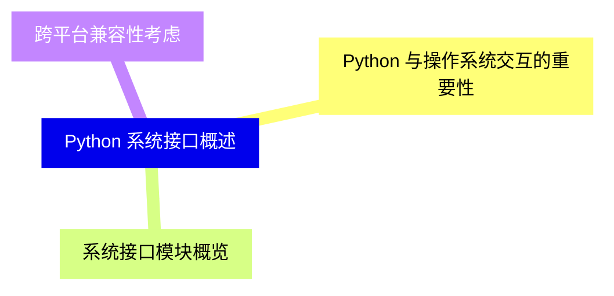

<--->
{}
{}
{}
{}
{}
{}
{}

### 2 系统参数与配置{#2}

{}
{}
{}
{}
{}
{}
{}
{}
{}
{}
{}
{}
{}
{}
{}
{}
{}
{}
{}
<--->
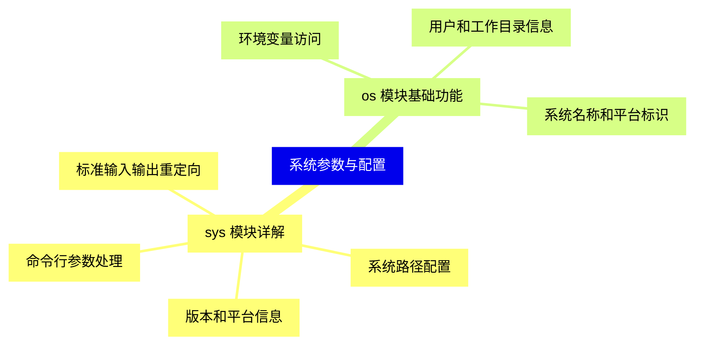

{}

### 3 文件和目录操作{#3}

{}
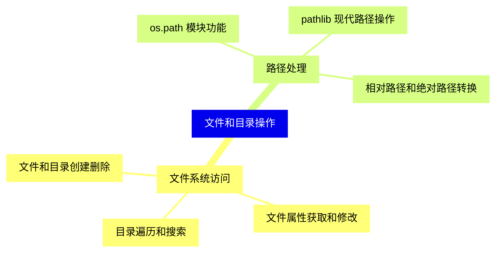

<--->
{}
{}
{}
{}
{}
{}
{}
{}
{}
{}
{}
{}
{}
{}
{}
{}
{}

### 4 进程管理{#4}

{}
{}
{}
{}
{}
{}
{}
{}
{}
{}
{}
{}
{}
{}
{}
{}
{}
<--->
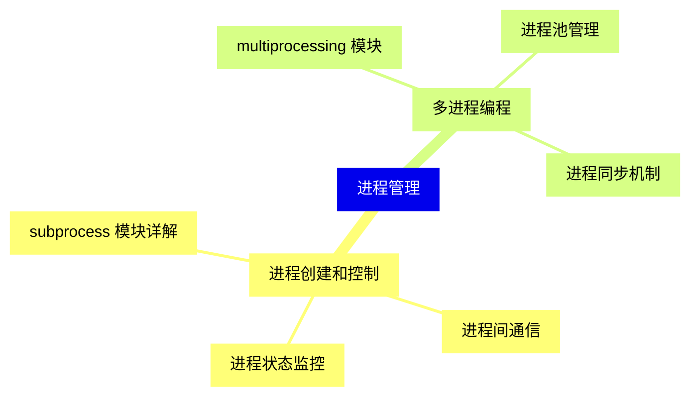

{}

### 5 系统调用和底层接口{#5}

{}
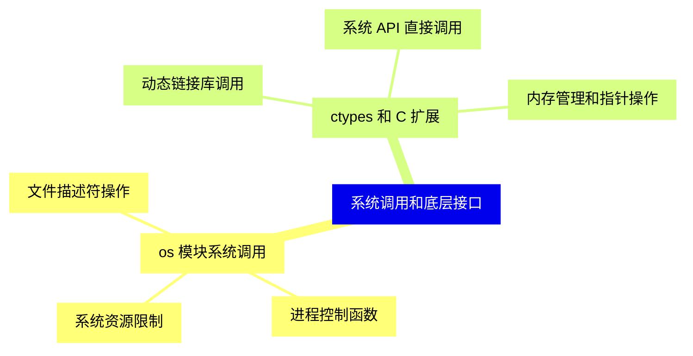

<--->
{}
{}
{}
{}
{}
{}
{}
{}
{}
{}
{}
{}
{}
{}
{}
{}
{}

### 6 时间和日期处理{#6}

{}
{}
{}
{}
{}
{}
{}
{}
{}
{}
{}
{}
{}
{}
{}
{}
{}
<--->
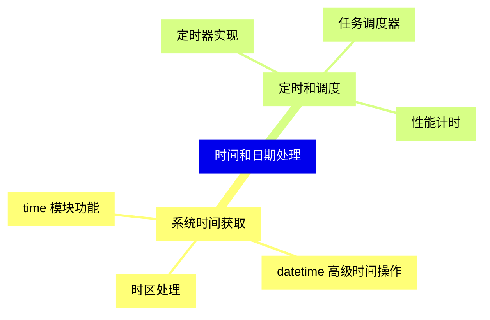

{}

### 7 输入输出和流处理{#7}

{}
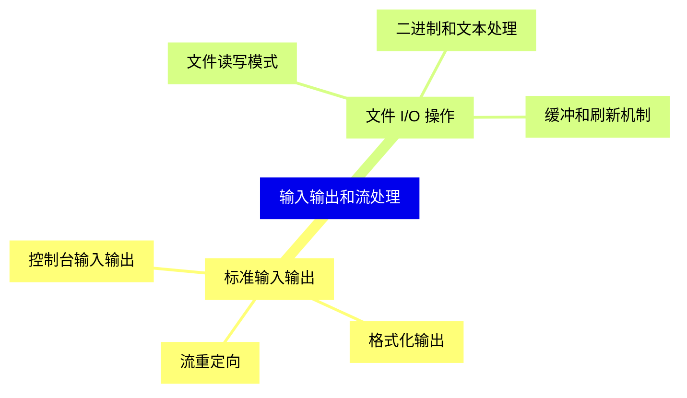

<--->
{}
{}
{}
{}
{}
{}
{}
{}
{}
{}
{}
{}
{}
{}
{}
{}
{}

### 8 系统资源和性能监控{#8}

{}
{}
{}
{}
{}
{}
{}
{}
{}
{}
{}
{}
{}
{}
{}
{}
{}
<--->
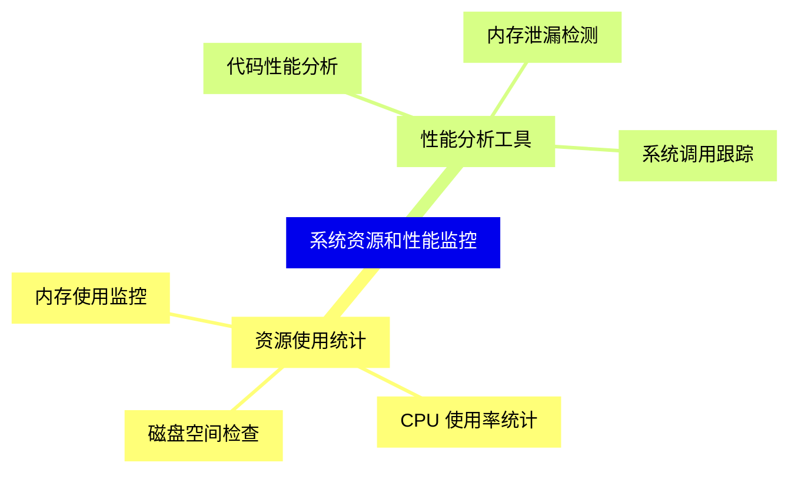

{}

### 9 网络和套接字编程{#9}

{}
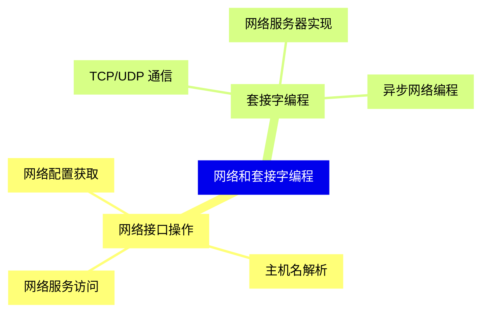

<--->
{}
{}
{}
{}
{}
{}
{}
{}
{}
{}
{}
{}
{}
{}
{}
{}
{}

### 10 信号和异常处理{#10}

{}
{}
{}
{}
{}
{}
{}
{}
{}
{}
{}
{}
{}
{}
{}
{}
{}
<--->
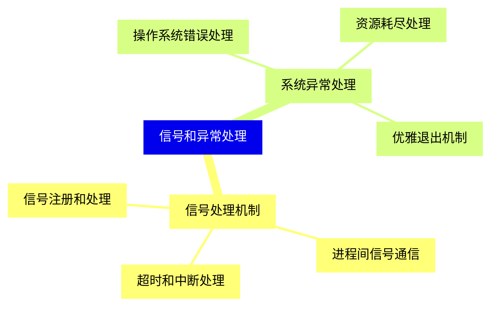

{}

### 11 安全和权限管理{#11}

{}
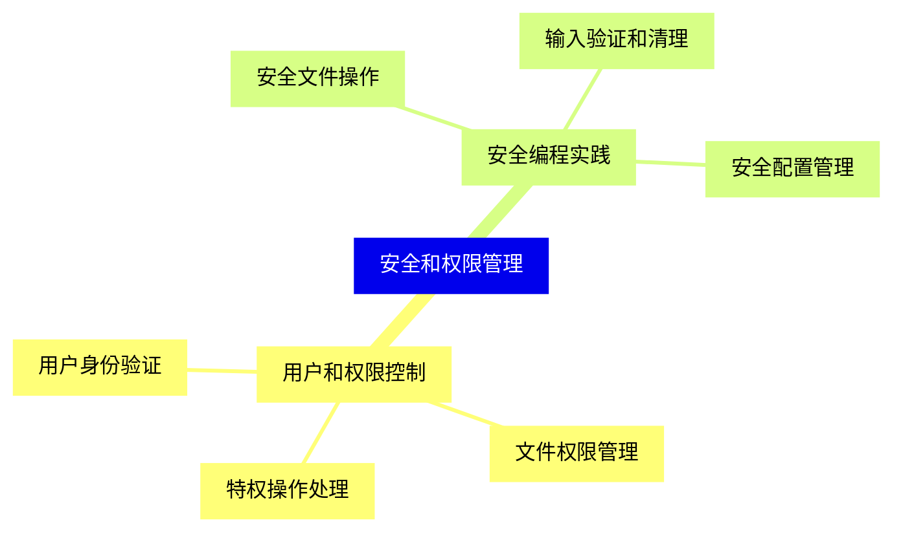

<--->
{}
{}
{}
{}
{}
{}
{}
{}
{}
{}
{}
{}
{}
{}
{}
{}
{}

### 12 跨平台开发最佳实践{#12}

{}
{}
{}
{}
{}
{}
{}
{}
{}
{}
{}
{}
{}
{}
{}
{}
{}
<--->
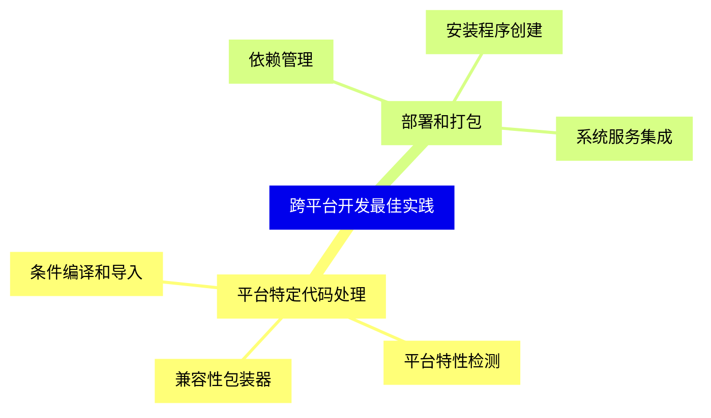

{}

### 13 高级系统接口技术{#13}

{}
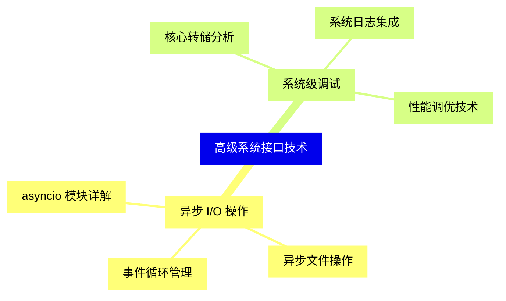

<--->
{}
{}
{}
{}
{}
{}
{}
{}
{}
{}
{}
{}
{}
{}
{}
{}
{}

### 14 实际应用案例{#14}

{}
{}
{}
{}
{}
{}
{}
{}
{}
{}
{}
{}
{}
{}
{}
{}
{}
<--->
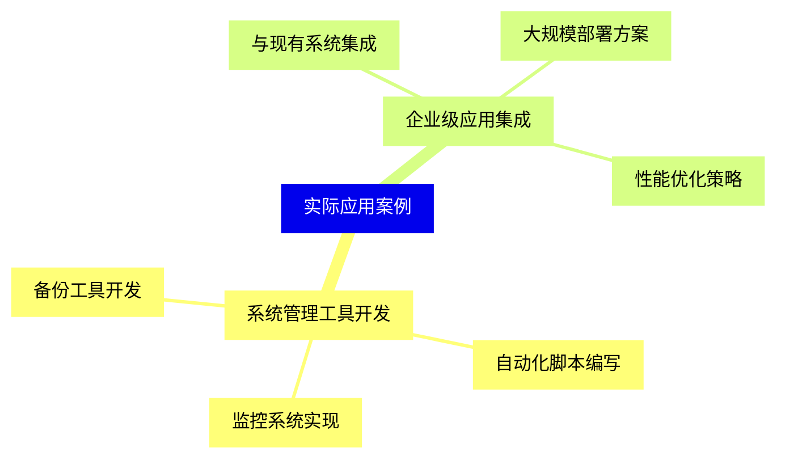

{}
