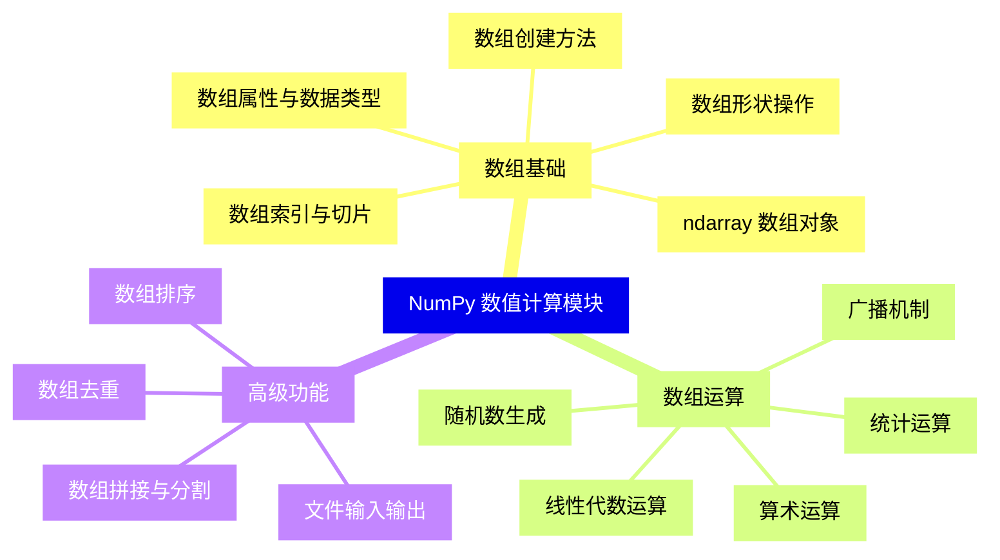
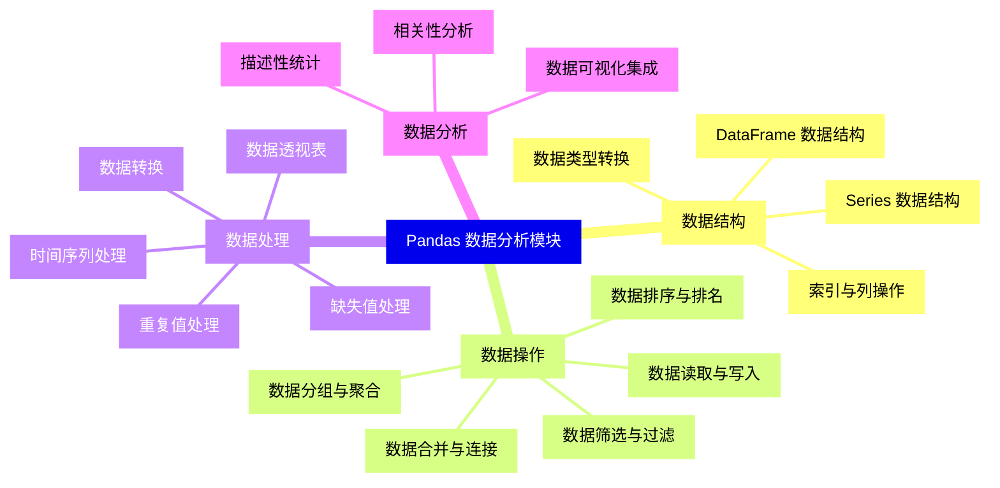
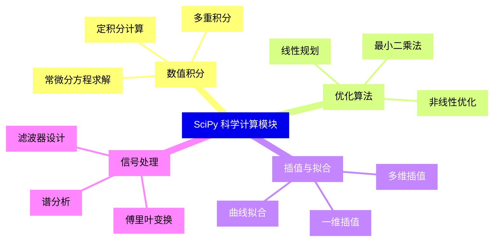
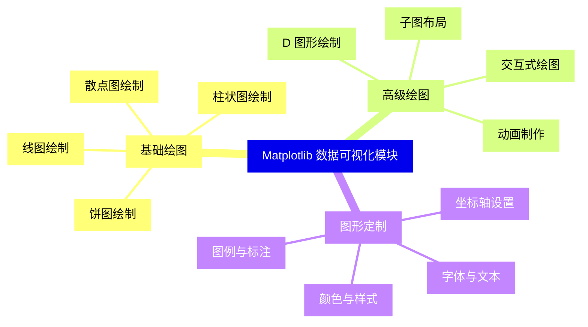
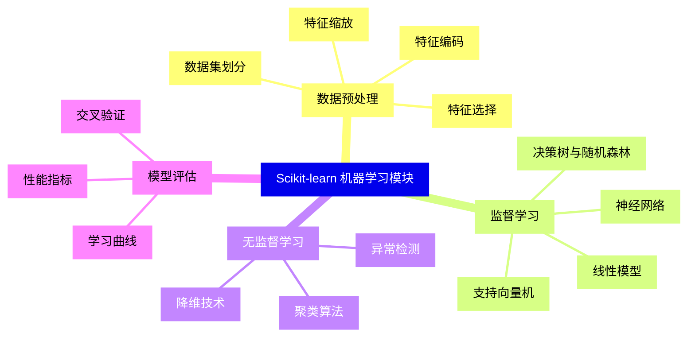
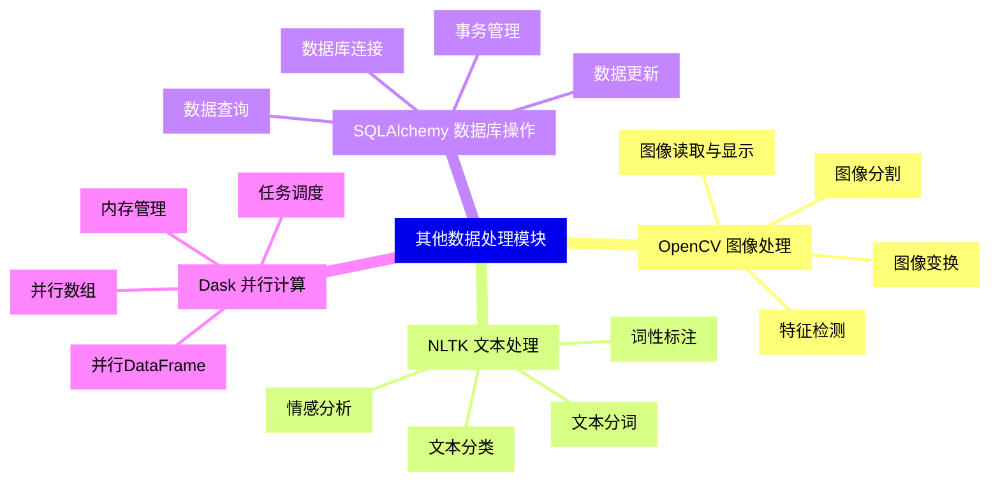


### 1 [NumPy 数值计算模块](#1)
#### 1.1 [数组基础](#1)
##### 1.1.1 [ndarray 数组对象](#1)
##### 1.1.2 [数组创建方法](#1)
##### 1.1.3 [数组属性与数据类型](#1)
##### 1.1.4 [数组索引与切片](#1)
##### 1.1.5 [数组形状操作](#1)
#### 1.2 [数组运算](#1)
##### 1.2.1 [算术运算](#1)
##### 1.2.2 [统计运算](#1)
##### 1.2.3 [线性代数运算](#1)
##### 1.2.4 [随机数生成](#1)
##### 1.2.5 [广播机制](#1)
#### 1.3 [高级功能](#1)
##### 1.3.1 [数组排序](#1)
##### 1.3.2 [数组去重](#1)
##### 1.3.3 [数组拼接与分割](#1)
##### 1.3.4 [文件输入输出](#1)
### 2 [Pandas 数据分析模块](#2)
#### 2.1 [数据结构](#2)
##### 2.1.1 [Series 数据结构](#2)
##### 2.1.2 [DataFrame 数据结构](#2)
##### 2.1.3 [索引与列操作](#2)
##### 2.1.4 [数据类型转换](#2)
#### 2.2 [数据操作](#2)
##### 2.2.1 [数据读取与写入](#2)
##### 2.2.2 [数据筛选与过滤](#2)
##### 2.2.3 [数据排序与排名](#2)
##### 2.2.4 [数据合并与连接](#2)
##### 2.2.5 [数据分组与聚合](#2)
#### 2.3 [数据处理](#2)
##### 2.3.1 [缺失值处理](#2)
##### 2.3.2 [重复值处理](#2)
##### 2.3.3 [数据转换](#2)
##### 2.3.4 [时间序列处理](#2)
##### 2.3.5 [数据透视表](#2)
#### 2.4 [数据分析](#2)
##### 2.4.1 [描述性统计](#2)
##### 2.4.2 [相关性分析](#2)
##### 2.4.3 [数据可视化集成](#2)
### 3 [SciPy 科学计算模块](#3)
#### 3.1 [数值积分](#3)
##### 3.1.1 [定积分计算](#3)
##### 3.1.2 [多重积分](#3)
##### 3.1.3 [常微分方程求解](#3)
#### 3.2 [优化算法](#3)
##### 3.2.1 [线性规划](#3)
##### 3.2.2 [非线性优化](#3)
##### 3.2.3 [最小二乘法](#3)
#### 3.3 [插值与拟合](#3)
##### 3.3.1 [一维插值](#3)
##### 3.3.2 [多维插值](#3)
##### 3.3.3 [曲线拟合](#3)
#### 3.4 [信号处理](#3)
##### 3.4.1 [傅里叶变换](#3)
##### 3.4.2 [滤波器设计](#3)
##### 3.4.3 [谱分析](#3)
### 4 [Matplotlib 数据可视化模块](#4)
#### 4.1 [基础绘图](#4)
##### 4.1.1 [线图绘制](#4)
##### 4.1.2 [散点图绘制](#4)
##### 4.1.3 [柱状图绘制](#4)
##### 4.1.4 [饼图绘制](#4)
#### 4.2 [高级绘图](#4)
##### 4.2.1 [子图布局](#4)
##### 4.2.2 [D 图形绘制](#4)
##### 4.2.3 [动画制作](#4)
##### 4.2.4 [交互式绘图](#4)
#### 4.3 [图形定制](#4)
##### 4.3.1 [坐标轴设置](#4)
##### 4.3.2 [图例与标注](#4)
##### 4.3.3 [颜色与样式](#4)
##### 4.3.4 [字体与文本](#4)
### 5 [Scikit-learn 机器学习模块](#5)
#### 5.1 [数据预处理](#5)
##### 5.1.1 [特征缩放](#5)
##### 5.1.2 [特征编码](#5)
##### 5.1.3 [特征选择](#5)
##### 5.1.4 [数据集划分](#5)
#### 5.2 [监督学习](#5)
##### 5.2.1 [线性模型](#5)
##### 5.2.2 [决策树与随机森林](#5)
##### 5.2.3 [支持向量机](#5)
##### 5.2.4 [神经网络](#5)
#### 5.3 [无监督学习](#5)
##### 5.3.1 [聚类算法](#5)
##### 5.3.2 [降维技术](#5)
##### 5.3.3 [异常检测](#5)
#### 5.4 [模型评估](#5)
##### 5.4.1 [交叉验证](#5)
##### 5.4.2 [性能指标](#5)
##### 5.4.3 [学习曲线](#5)
### 6 [其他数据处理模块](#6)
#### 6.1 [OpenCV 图像处理](#6)
##### 6.1.1 [图像读取与显示](#6)
##### 6.1.2 [图像变换](#6)
##### 6.1.3 [特征检测](#6)
##### 6.1.4 [图像分割](#6)
#### 6.2 [NLTK 文本处理](#6)
##### 6.2.1 [文本分词](#6)
##### 6.2.2 [词性标注](#6)
##### 6.2.3 [情感分析](#6)
##### 6.2.4 [文本分类](#6)
#### 6.3 [SQLAlchemy 数据库操作](#6)
##### 6.3.1 [数据库连接](#6)
##### 6.3.2 [数据查询](#6)
##### 6.3.3 [数据更新](#6)
##### 6.3.4 [事务管理](#6)
#### 6.4 [Dask 并行计算](#6)
##### 6.4.1 [并行数组](#6)
##### 6.4.2 [并行DataFrame](#6)
##### 6.4.3 [任务调度](#6)
##### 6.4.4 [内存管理](#6)




### 1 NumPy 数值计算模块

---
### 1 NumPy 数值计算模块
___
#### 1.1 数组基础
___
##### 1.1.1 ndarray 数组对象
___
##### 1.1.2 数组创建方法
___
##### 1.1.3 数组属性与数据类型
___
##### 1.1.4 数组索引与切片
___
##### 1.1.5 数组形状操作
___
#### 1.2 数组运算
___
##### 1.2.1 算术运算
___
##### 1.2.2 统计运算
___
##### 1.2.3 线性代数运算
___
##### 1.2.4 随机数生成
___
##### 1.2.5 广播机制
___
#### 1.3 高级功能
___
##### 1.3.1 数组排序
___
##### 1.3.2 数组去重
___
##### 1.3.3 数组拼接与分割
___
##### 1.3.4 文件输入输出
### 2 Pandas 数据分析模块

---
### 2 Pandas 数据分析模块
___
#### 2.1 数据结构
___
##### 2.1.1 Series 数据结构
___
##### 2.1.2 DataFrame 数据结构
___
##### 2.1.3 索引与列操作
___
##### 2.1.4 数据类型转换
___
#### 2.2 数据操作
___
##### 2.2.1 数据读取与写入
___
##### 2.2.2 数据筛选与过滤
___
##### 2.2.3 数据排序与排名
___
##### 2.2.4 数据合并与连接
___
##### 2.2.5 数据分组与聚合
___
#### 2.3 数据处理
___
##### 2.3.1 缺失值处理
___
##### 2.3.2 重复值处理
___
##### 2.3.3 数据转换
___
##### 2.3.4 时间序列处理
___
##### 2.3.5 数据透视表
___
#### 2.4 数据分析
___
##### 2.4.1 描述性统计
___
##### 2.4.2 相关性分析
___
##### 2.4.3 数据可视化集成
### 3 SciPy 科学计算模块

---
### 3 SciPy 科学计算模块
___
#### 3.1 数值积分
___
##### 3.1.1 定积分计算
___
##### 3.1.2 多重积分
___
##### 3.1.3 常微分方程求解
___
#### 3.2 优化算法
___
##### 3.2.1 线性规划
___
##### 3.2.2 非线性优化
___
##### 3.2.3 最小二乘法
___
#### 3.3 插值与拟合
___
##### 3.3.1 一维插值
___
##### 3.3.2 多维插值
___
##### 3.3.3 曲线拟合
___
#### 3.4 信号处理
___
##### 3.4.1 傅里叶变换
___
##### 3.4.2 滤波器设计
___
##### 3.4.3 谱分析
### 4 Matplotlib 数据可视化模块

---
### 4 Matplotlib 数据可视化模块
___
#### 4.1 基础绘图
___
##### 4.1.1 线图绘制
___
##### 4.1.2 散点图绘制
___
##### 4.1.3 柱状图绘制
___
##### 4.1.4 饼图绘制
___
#### 4.2 高级绘图
___
##### 4.2.1 子图布局
___
##### 4.2.2 D 图形绘制
___
##### 4.2.3 动画制作
___
##### 4.2.4 交互式绘图
___
#### 4.3 图形定制
___
##### 4.3.1 坐标轴设置
___
##### 4.3.2 图例与标注
___
##### 4.3.3 颜色与样式
___
##### 4.3.4 字体与文本
### 5 Scikit-learn 机器学习模块

---
### 5 Scikit-learn 机器学习模块
___
#### 5.1 数据预处理
___
##### 5.1.1 特征缩放
___
##### 5.1.2 特征编码
___
##### 5.1.3 特征选择
___
##### 5.1.4 数据集划分
___
#### 5.2 监督学习
___
##### 5.2.1 线性模型
___
##### 5.2.2 决策树与随机森林
___
##### 5.2.3 支持向量机
___
##### 5.2.4 神经网络
___
#### 5.3 无监督学习
___
##### 5.3.1 聚类算法
___
##### 5.3.2 降维技术
___
##### 5.3.3 异常检测
___
#### 5.4 模型评估
___
##### 5.4.1 交叉验证
___
##### 5.4.2 性能指标
___
##### 5.4.3 学习曲线
### 6 其他数据处理模块

---
### 6 其他数据处理模块
___
#### 6.1 OpenCV 图像处理
___
##### 6.1.1 图像读取与显示
___
##### 6.1.2 图像变换
___
##### 6.1.3 特征检测
___
##### 6.1.4 图像分割
___
#### 6.2 NLTK 文本处理
___
##### 6.2.1 文本分词
___
##### 6.2.2 词性标注
___
##### 6.2.3 情感分析
___
##### 6.2.4 文本分类
___
#### 6.3 SQLAlchemy 数据库操作
___
##### 6.3.1 数据库连接
___
##### 6.3.2 数据查询
___
##### 6.3.3 数据更新
___
##### 6.3.4 事务管理
___
#### 6.4 Dask 并行计算
___
##### 6.4.1 并行数组
___
##### 6.4.2 并行DataFrame
___
##### 6.4.3 任务调度
___
##### 6.4.4 内存管理


### 1 NumPy 数值计算模块{#1}

{}

<--->
{}
{}
{}
{}
{}
{}
{}
{}
{}
{}
{}
{}
{}
{}
{}
{}
{}
{}
{}
{}
{}
{}
{}
{}
{}
{}
{}
{}
{}
{}
{}
{}
{}
{}
{}

### 2 Pandas 数据分析模块{#2}

{}
{}
{}
{}
{}
{}
{}
{}
{}
{}
{}
{}
{}
{}
{}
{}
{}
{}
{}
{}
{}
{}
{}
{}
{}
{}
{}
{}
{}
{}
{}
{}
{}
{}
{}
{}
{}
{}
{}
{}
{}
{}
{}
<--->

{}

### 3 SciPy 科学计算模块{#3}

{}

<--->
{}
{}
{}
{}
{}
{}
{}
{}
{}
{}
{}
{}
{}
{}
{}
{}
{}
{}
{}
{}
{}
{}
{}
{}
{}
{}
{}
{}
{}
{}
{}
{}
{}

### 4 Matplotlib 数据可视化模块{#4}

{}
{}
{}
{}
{}
{}
{}
{}
{}
{}
{}
{}
{}
{}
{}
{}
{}
{}
{}
{}
{}
{}
{}
{}
{}
{}
{}
{}
{}
{}
{}
<--->

{}

### 5 Scikit-learn 机器学习模块{#5}

{}

<--->
{}
{}
{}
{}
{}
{}
{}
{}
{}
{}
{}
{}
{}
{}
{}
{}
{}
{}
{}
{}
{}
{}
{}
{}
{}
{}
{}
{}
{}
{}
{}
{}
{}
{}
{}
{}
{}

### 6 其他数据处理模块{#6}

{}
{}
{}
{}
{}
{}
{}
{}
{}
{}
{}
{}
{}
{}
{}
{}
{}
{}
{}
{}
{}
{}
{}
{}
{}
{}
{}
{}
{}
{}
{}
{}
{}
{}
{}
{}
{}
{}
{}
{}
{}
<--->

{}
