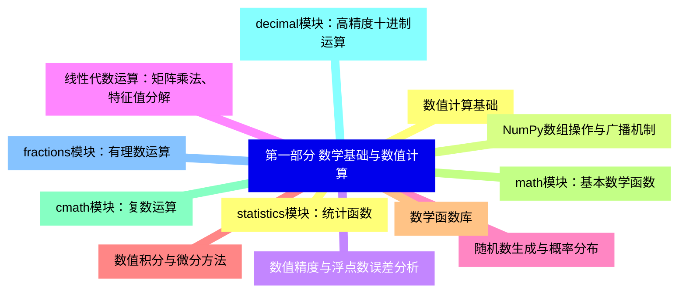
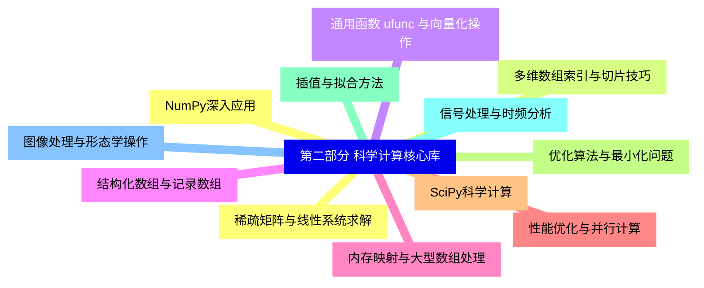
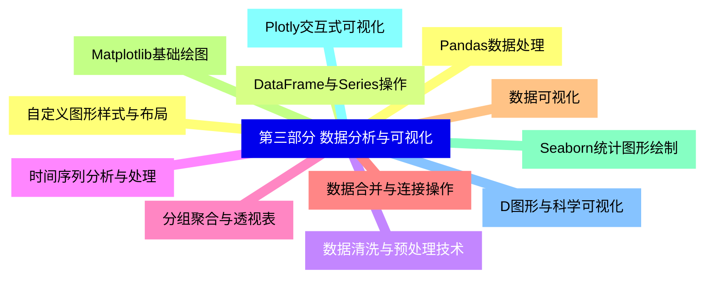
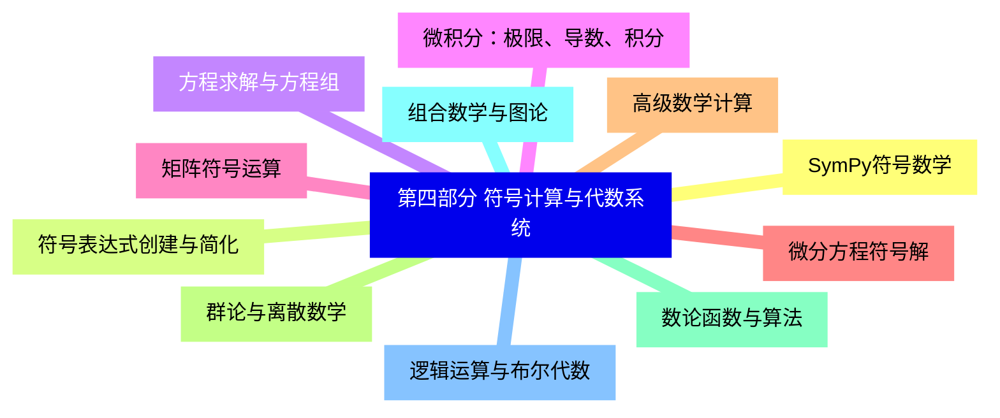
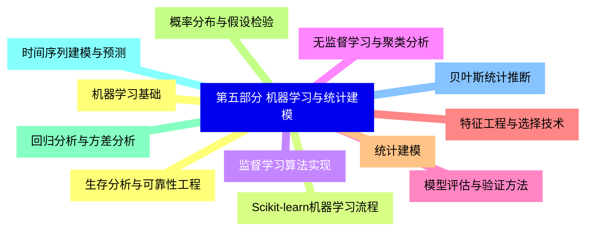
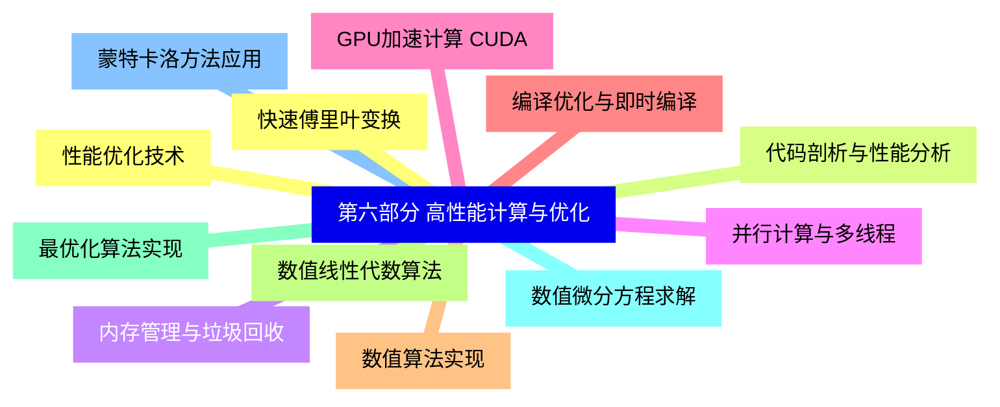
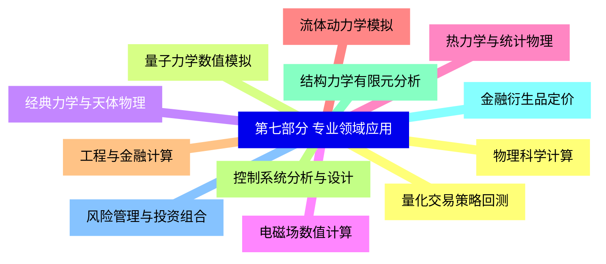
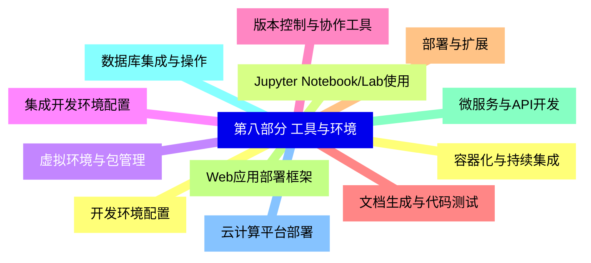


### 1 [第一部分 数学基础与数值计算](#1)
#### 1.1 [数值计算基础](#1)
#### 1.2 [NumPy数组操作与广播机制](#1)
#### 1.3 [数值精度与浮点数误差分析](#1)
#### 1.4 [线性代数运算：矩阵乘法、特征值分解](#1)
#### 1.5 [随机数生成与概率分布](#1)
#### 1.6 [数值积分与微分方法](#1)
#### 1.7 [数学函数库](#1)
#### 1.8 [math模块：基本数学函数](#1)
#### 1.9 [cmath模块：复数运算](#1)
#### 1.10 [decimal模块：高精度十进制运算](#1)
#### 1.11 [fractions模块：有理数运算](#1)
#### 1.12 [statistics模块：统计函数](#1)
### 2 [第二部分 科学计算核心库](#2)
#### 2.1 [NumPy深入应用](#2)
#### 2.2 [多维数组索引与切片技巧](#2)
#### 2.3 [通用函数 ufunc 与向量化操作](#2)
#### 2.4 [结构化数组与记录数组](#2)
#### 2.5 [内存映射与大型数组处理](#2)
#### 2.6 [性能优化与并行计算](#2)
#### 2.7 [SciPy科学计算](#2)
#### 2.8 [优化算法与最小化问题](#2)
#### 2.9 [插值与拟合方法](#2)
#### 2.10 [信号处理与时频分析](#2)
#### 2.11 [图像处理与形态学操作](#2)
#### 2.12 [稀疏矩阵与线性系统求解](#2)
### 3 [第三部分 数据分析与可视化](#3)
#### 3.1 [Pandas数据处理](#3)
#### 3.2 [DataFrame与Series操作](#3)
#### 3.3 [数据清洗与预处理技术](#3)
#### 3.4 [时间序列分析与处理](#3)
#### 3.5 [分组聚合与透视表](#3)
#### 3.6 [数据合并与连接操作](#3)
#### 3.7 [数据可视化](#3)
#### 3.8 [Matplotlib基础绘图](#3)
#### 3.9 [Seaborn统计图形绘制](#3)
#### 3.10 [Plotly交互式可视化](#3)
#### 3.11 [D图形与科学可视化](#3)
#### 3.12 [自定义图形样式与布局](#3)
### 4 [第四部分 符号计算与代数系统](#4)
#### 4.1 [SymPy符号数学](#4)
#### 4.2 [符号表达式创建与简化](#4)
#### 4.3 [方程求解与方程组](#4)
#### 4.4 [微积分：极限、导数、积分](#4)
#### 4.5 [矩阵符号运算](#4)
#### 4.6 [微分方程符号解](#4)
#### 4.7 [高级数学计算](#4)
#### 4.8 [群论与离散数学](#4)
#### 4.9 [数论函数与算法](#4)
#### 4.10 [组合数学与图论](#4)
#### 4.11 [逻辑运算与布尔代数](#4)
### 5 [第五部分 机器学习与统计建模](#5)
#### 5.1 [机器学习基础](#5)
#### 5.2 [Scikit-learn机器学习流程](#5)
#### 5.3 [监督学习算法实现](#5)
#### 5.4 [无监督学习与聚类分析](#5)
#### 5.5 [模型评估与验证方法](#5)
#### 5.6 [特征工程与选择技术](#5)
#### 5.7 [统计建模](#5)
#### 5.8 [概率分布与假设检验](#5)
#### 5.9 [回归分析与方差分析](#5)
#### 5.10 [时间序列建模与预测](#5)
#### 5.11 [贝叶斯统计推断](#5)
#### 5.12 [生存分析与可靠性工程](#5)
### 6 [第六部分 高性能计算与优化](#6)
#### 6.1 [性能优化技术](#6)
#### 6.2 [代码剖析与性能分析](#6)
#### 6.3 [内存管理与垃圾回收](#6)
#### 6.4 [并行计算与多线程](#6)
#### 6.5 [GPU加速计算 CUDA](#6)
#### 6.6 [编译优化与即时编译](#6)
#### 6.7 [数值算法实现](#6)
#### 6.8 [数值线性代数算法](#6)
#### 6.9 [最优化算法实现](#6)
#### 6.10 [数值微分方程求解](#6)
#### 6.11 [蒙特卡洛方法应用](#6)
#### 6.12 [快速傅里叶变换](#6)
### 7 [第七部分 专业领域应用](#7)
#### 7.1 [物理科学计算](#7)
#### 7.2 [量子力学数值模拟](#7)
#### 7.3 [经典力学与天体物理](#7)
#### 7.4 [电磁场数值计算](#7)
#### 7.5 [热力学与统计物理](#7)
#### 7.6 [流体动力学模拟](#7)
#### 7.7 [工程与金融计算](#7)
#### 7.8 [控制系统分析与设计](#7)
#### 7.9 [结构力学有限元分析](#7)
#### 7.10 [金融衍生品定价](#7)
#### 7.11 [风险管理与投资组合](#7)
#### 7.12 [量化交易策略回测](#7)
### 8 [第八部分 工具与环境](#8)
#### 8.1 [开发环境配置](#8)
#### 8.2 [Jupyter Notebook/Lab使用](#8)
#### 8.3 [虚拟环境与包管理](#8)
#### 8.4 [集成开发环境配置](#8)
#### 8.5 [版本控制与协作工具](#8)
#### 8.6 [文档生成与代码测试](#8)
#### 8.7 [部署与扩展](#8)
#### 8.8 [Web应用部署框架](#8)
#### 8.9 [微服务与API开发](#8)
#### 8.10 [数据库集成与操作](#8)
#### 8.11 [云计算平台部署](#8)
#### 8.12 [容器化与持续集成](#8)




### 1 第一部分 数学基础与数值计算

---
### 1 第一部分 数学基础与数值计算
___
#### 1.1 数值计算基础
___
#### 1.2 NumPy数组操作与广播机制
___
#### 1.3 数值精度与浮点数误差分析
___
#### 1.4 线性代数运算：矩阵乘法、特征值分解
___
#### 1.5 随机数生成与概率分布
___
#### 1.6 数值积分与微分方法
___
#### 1.7 数学函数库
___
#### 1.8 math模块：基本数学函数
___
#### 1.9 cmath模块：复数运算
___
#### 1.10 decimal模块：高精度十进制运算
___
#### 1.11 fractions模块：有理数运算
___
#### 1.12 statistics模块：统计函数
### 2 第二部分 科学计算核心库

---
### 2 第二部分 科学计算核心库
___
#### 2.1 NumPy深入应用
___
#### 2.2 多维数组索引与切片技巧
___
#### 2.3 通用函数 ufunc 与向量化操作
___
#### 2.4 结构化数组与记录数组
___
#### 2.5 内存映射与大型数组处理
___
#### 2.6 性能优化与并行计算
___
#### 2.7 SciPy科学计算
___
#### 2.8 优化算法与最小化问题
___
#### 2.9 插值与拟合方法
___
#### 2.10 信号处理与时频分析
___
#### 2.11 图像处理与形态学操作
___
#### 2.12 稀疏矩阵与线性系统求解
### 3 第三部分 数据分析与可视化

---
### 3 第三部分 数据分析与可视化
___
#### 3.1 Pandas数据处理
___
#### 3.2 DataFrame与Series操作
___
#### 3.3 数据清洗与预处理技术
___
#### 3.4 时间序列分析与处理
___
#### 3.5 分组聚合与透视表
___
#### 3.6 数据合并与连接操作
___
#### 3.7 数据可视化
___
#### 3.8 Matplotlib基础绘图
___
#### 3.9 Seaborn统计图形绘制
___
#### 3.10 Plotly交互式可视化
___
#### 3.11 D图形与科学可视化
___
#### 3.12 自定义图形样式与布局
### 4 第四部分 符号计算与代数系统

---
### 4 第四部分 符号计算与代数系统
___
#### 4.1 SymPy符号数学
___
#### 4.2 符号表达式创建与简化
___
#### 4.3 方程求解与方程组
___
#### 4.4 微积分：极限、导数、积分
___
#### 4.5 矩阵符号运算
___
#### 4.6 微分方程符号解
___
#### 4.7 高级数学计算
___
#### 4.8 群论与离散数学
___
#### 4.9 数论函数与算法
___
#### 4.10 组合数学与图论
___
#### 4.11 逻辑运算与布尔代数
### 5 第五部分 机器学习与统计建模

---
### 5 第五部分 机器学习与统计建模
___
#### 5.1 机器学习基础
___
#### 5.2 Scikit-learn机器学习流程
___
#### 5.3 监督学习算法实现
___
#### 5.4 无监督学习与聚类分析
___
#### 5.5 模型评估与验证方法
___
#### 5.6 特征工程与选择技术
___
#### 5.7 统计建模
___
#### 5.8 概率分布与假设检验
___
#### 5.9 回归分析与方差分析
___
#### 5.10 时间序列建模与预测
___
#### 5.11 贝叶斯统计推断
___
#### 5.12 生存分析与可靠性工程
### 6 第六部分 高性能计算与优化

---
### 6 第六部分 高性能计算与优化
___
#### 6.1 性能优化技术
___
#### 6.2 代码剖析与性能分析
___
#### 6.3 内存管理与垃圾回收
___
#### 6.4 并行计算与多线程
___
#### 6.5 GPU加速计算 CUDA
___
#### 6.6 编译优化与即时编译
___
#### 6.7 数值算法实现
___
#### 6.8 数值线性代数算法
___
#### 6.9 最优化算法实现
___
#### 6.10 数值微分方程求解
___
#### 6.11 蒙特卡洛方法应用
___
#### 6.12 快速傅里叶变换
### 7 第七部分 专业领域应用

---
### 7 第七部分 专业领域应用
___
#### 7.1 物理科学计算
___
#### 7.2 量子力学数值模拟
___
#### 7.3 经典力学与天体物理
___
#### 7.4 电磁场数值计算
___
#### 7.5 热力学与统计物理
___
#### 7.6 流体动力学模拟
___
#### 7.7 工程与金融计算
___
#### 7.8 控制系统分析与设计
___
#### 7.9 结构力学有限元分析
___
#### 7.10 金融衍生品定价
___
#### 7.11 风险管理与投资组合
___
#### 7.12 量化交易策略回测
### 8 第八部分 工具与环境

---
### 8 第八部分 工具与环境
___
#### 8.1 开发环境配置
___
#### 8.2 Jupyter Notebook/Lab使用
___
#### 8.3 虚拟环境与包管理
___
#### 8.4 集成开发环境配置
___
#### 8.5 版本控制与协作工具
___
#### 8.6 文档生成与代码测试
___
#### 8.7 部署与扩展
___
#### 8.8 Web应用部署框架
___
#### 8.9 微服务与API开发
___
#### 8.10 数据库集成与操作
___
#### 8.11 云计算平台部署
___
#### 8.12 容器化与持续集成


### 1 第一部分 数学基础与数值计算{#1}

{}

<--->
{}
{}
{}
{}
{}
{}
{}
{}
{}
{}
{}
{}
{}
{}
{}
{}
{}
{}
{}
{}
{}
{}
{}
{}
{}

### 2 第二部分 科学计算核心库{#2}

{}
{}
{}
{}
{}
{}
{}
{}
{}
{}
{}
{}
{}
{}
{}
{}
{}
{}
{}
{}
{}
{}
{}
{}
{}
<--->

{}

### 3 第三部分 数据分析与可视化{#3}

{}

<--->
{}
{}
{}
{}
{}
{}
{}
{}
{}
{}
{}
{}
{}
{}
{}
{}
{}
{}
{}
{}
{}
{}
{}
{}
{}

### 4 第四部分 符号计算与代数系统{#4}

{}
{}
{}
{}
{}
{}
{}
{}
{}
{}
{}
{}
{}
{}
{}
{}
{}
{}
{}
{}
{}
{}
{}
<--->

{}

### 5 第五部分 机器学习与统计建模{#5}

{}

<--->
{}
{}
{}
{}
{}
{}
{}
{}
{}
{}
{}
{}
{}
{}
{}
{}
{}
{}
{}
{}
{}
{}
{}
{}
{}

### 6 第六部分 高性能计算与优化{#6}

{}
{}
{}
{}
{}
{}
{}
{}
{}
{}
{}
{}
{}
{}
{}
{}
{}
{}
{}
{}
{}
{}
{}
{}
{}
<--->

{}

### 7 第七部分 专业领域应用{#7}

{}

<--->
{}
{}
{}
{}
{}
{}
{}
{}
{}
{}
{}
{}
{}
{}
{}
{}
{}
{}
{}
{}
{}
{}
{}
{}
{}

### 8 第八部分 工具与环境{#8}

{}
{}
{}
{}
{}
{}
{}
{}
{}
{}
{}
{}
{}
{}
{}
{}
{}
{}
{}
{}
{}
{}
{}
{}
{}
<--->

{}
