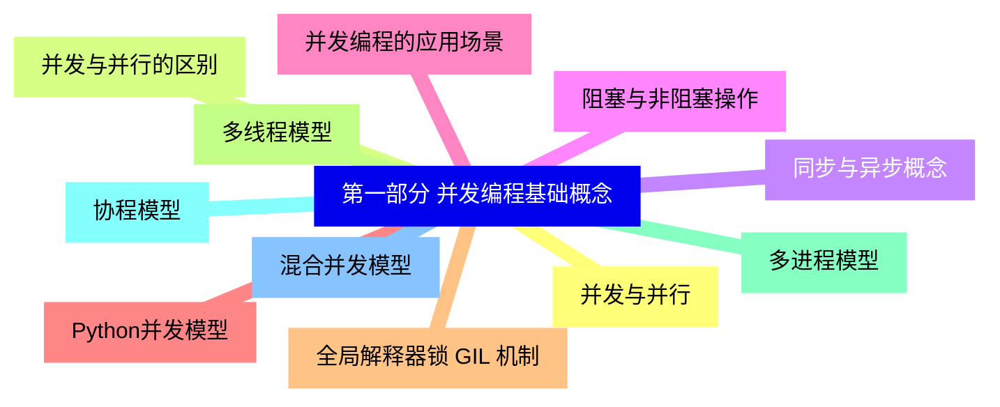
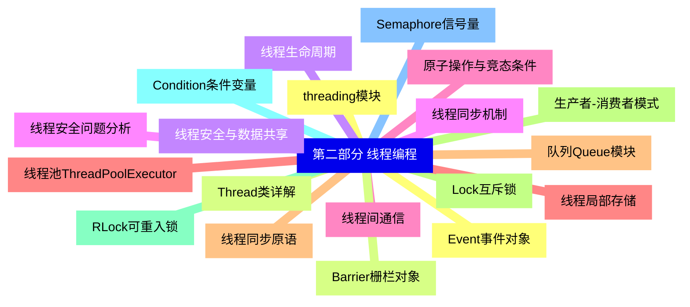
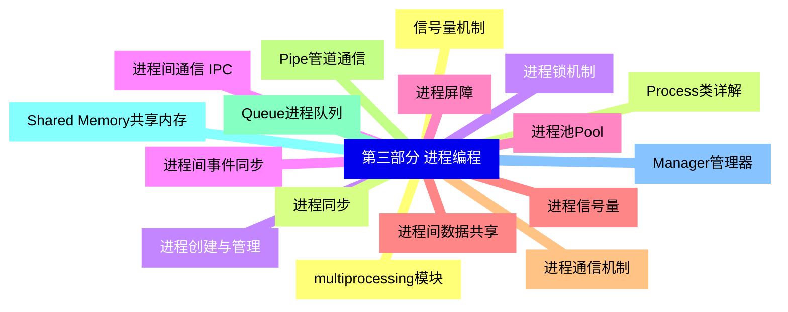
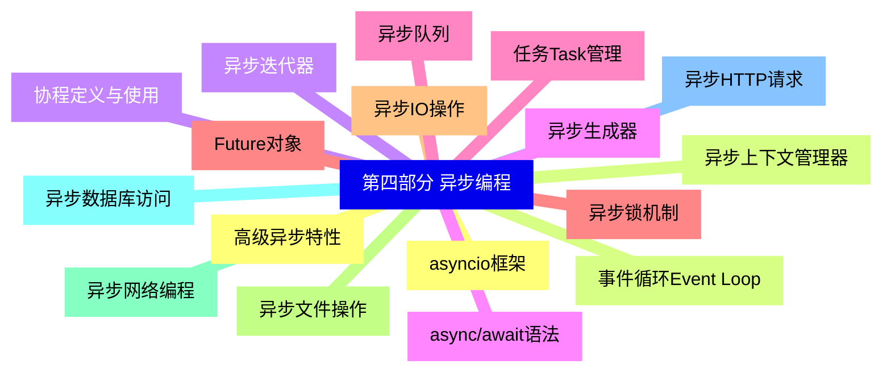
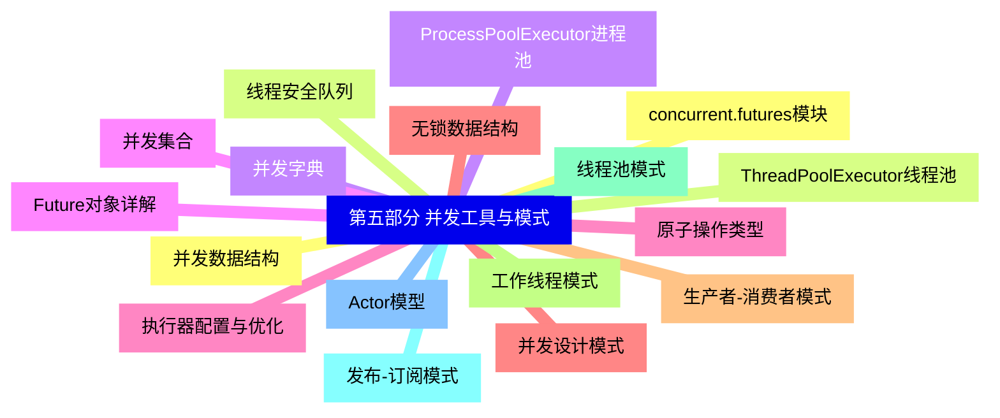
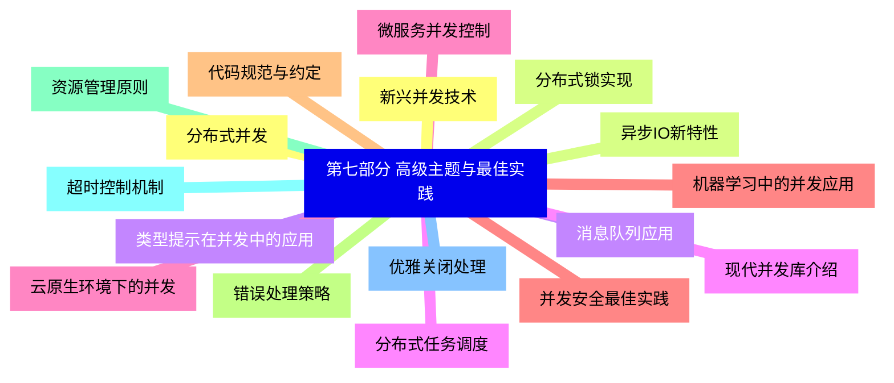


### 1 [第一部分 并发编程基础概念](#1)
#### 1.1 [并发与并行](#1)
#### 1.2 [并发与并行的区别](#1)
#### 1.3 [同步与异步概念](#1)
#### 1.4 [阻塞与非阻塞操作](#1)
#### 1.5 [并发编程的应用场景](#1)
#### 1.6 [Python并发模型](#1)
#### 1.7 [全局解释器锁 GIL 机制](#1)
#### 1.8 [多线程模型](#1)
#### 1.9 [多进程模型](#1)
#### 1.10 [协程模型](#1)
#### 1.11 [混合并发模型](#1)
### 2 [第二部分 线程编程](#2)
#### 2.1 [threading模块](#2)
#### 2.2 [Thread类详解](#2)
#### 2.3 [线程生命周期](#2)
#### 2.4 [线程同步机制](#2)
#### 2.5 [线程间通信](#2)
#### 2.6 [线程池ThreadPoolExecutor](#2)
#### 2.7 [线程同步原语](#2)
#### 2.8 [Lock互斥锁](#2)
#### 2.9 [RLock可重入锁](#2)
#### 2.10 [Condition条件变量](#2)
#### 2.11 [Semaphore信号量](#2)
#### 2.12 [Event事件对象](#2)
#### 2.13 [Barrier栅栏对象](#2)
#### 2.14 [线程安全与数据共享](#2)
#### 2.15 [线程安全问题分析](#2)
#### 2.16 [原子操作与竞态条件](#2)
#### 2.17 [线程局部存储](#2)
#### 2.18 [队列Queue模块](#2)
#### 2.19 [生产者-消费者模式](#2)
### 3 [第三部分 进程编程](#3)
#### 3.1 [multiprocessing模块](#3)
#### 3.2 [Process类详解](#3)
#### 3.3 [进程创建与管理](#3)
#### 3.4 [进程间通信 IPC](#3)
#### 3.5 [进程池Pool](#3)
#### 3.6 [进程间数据共享](#3)
#### 3.7 [进程通信机制](#3)
#### 3.8 [Pipe管道通信](#3)
#### 3.9 [Queue进程队列](#3)
#### 3.10 [Shared Memory共享内存](#3)
#### 3.11 [Manager管理器](#3)
#### 3.12 [信号量机制](#3)
#### 3.13 [进程同步](#3)
#### 3.14 [进程锁机制](#3)
#### 3.15 [进程间事件同步](#3)
#### 3.16 [进程屏障](#3)
#### 3.17 [进程信号量](#3)
### 4 [第四部分 异步编程](#4)
#### 4.1 [asyncio框架](#4)
#### 4.2 [事件循环Event Loop](#4)
#### 4.3 [协程定义与使用](#4)
#### 4.4 [async/await语法](#4)
#### 4.5 [任务Task管理](#4)
#### 4.6 [Future对象](#4)
#### 4.7 [异步IO操作](#4)
#### 4.8 [异步文件操作](#4)
#### 4.9 [异步网络编程](#4)
#### 4.10 [异步数据库访问](#4)
#### 4.11 [异步HTTP请求](#4)
#### 4.12 [高级异步特性](#4)
#### 4.13 [异步上下文管理器](#4)
#### 4.14 [异步迭代器](#4)
#### 4.15 [异步生成器](#4)
#### 4.16 [异步队列](#4)
#### 4.17 [异步锁机制](#4)
### 5 [第五部分 并发工具与模式](#5)
#### 5.1 [concurrent.futures模块](#5)
#### 5.2 [ThreadPoolExecutor线程池](#5)
#### 5.3 [ProcessPoolExecutor进程池](#5)
#### 5.4 [Future对象详解](#5)
#### 5.5 [执行器配置与优化](#5)
#### 5.6 [并发设计模式](#5)
#### 5.7 [生产者-消费者模式](#5)
#### 5.8 [工作线程模式](#5)
#### 5.9 [线程池模式](#5)
#### 5.10 [发布-订阅模式](#5)
#### 5.11 [Actor模型](#5)
#### 5.12 [并发数据结构](#5)
#### 5.13 [线程安全队列](#5)
#### 5.14 [并发字典](#5)
#### 5.15 [并发集合](#5)
#### 5.16 [原子操作类型](#5)
#### 5.17 [无锁数据结构](#5)
### 6 [第六部分 性能优化与调试](#6)
#### 6.1 [性能分析与优化](#6)
#### 6.2 [性能瓶颈识别](#6)
#### 6.3 [并发性能指标](#6)
#### 6.4 [内存使用优化](#6)
#### 6.5 [CPU利用率优化](#6)
#### 6.6 [I/O性能优化](#6)
#### 6.7 [并发调试与测试](#6)
#### 6.8 [死锁检测与预防](#6)
#### 6.9 [竞态条件调试](#6)
#### 6.10 [并发单元测试](#6)
#### 6.11 [压力测试方法](#6)
#### 6.12 [性能监控工具](#6)
#### 6.13 [常见问题与解决方案](#6)
#### 6.14 [GIL限制与规避](#6)
#### 6.15 [资源竞争问题](#6)
#### 6.16 [内存泄漏检测](#6)
#### 6.17 [上下文切换开销](#6)
#### 6.18 [负载均衡策略](#6)
### 7 [第七部分 高级主题与最佳实践](#7)
#### 7.1 [分布式并发](#7)
#### 7.2 [分布式锁实现](#7)
#### 7.3 [消息队列应用](#7)
#### 7.4 [分布式任务调度](#7)
#### 7.5 [微服务并发控制](#7)
#### 7.6 [并发安全最佳实践](#7)
#### 7.7 [代码规范与约定](#7)
#### 7.8 [错误处理策略](#7)
#### 7.9 [资源管理原则](#7)
#### 7.10 [超时控制机制](#7)
#### 7.11 [优雅关闭处理](#7)
#### 7.12 [新兴并发技术](#7)
#### 7.13 [异步IO新特性](#7)
#### 7.14 [类型提示在并发中的应用](#7)
#### 7.15 [现代并发库介绍](#7)
#### 7.16 [云原生环境下的并发](#7)
#### 7.17 [机器学习中的并发应用](#7)





### 1 第一部分 并发编程基础概念


---
### 1 第一部分 并发编程基础概念
___
#### 1.1 并发与并行
___
#### 1.2 并发与并行的区别
___
#### 1.3 同步与异步概念
___
#### 1.4 阻塞与非阻塞操作
___
#### 1.5 并发编程的应用场景
___
#### 1.6 Python并发模型
___
#### 1.7 全局解释器锁 GIL 机制
___
#### 1.8 多线程模型
___
#### 1.9 多进程模型
___
#### 1.10 协程模型
___
#### 1.11 混合并发模型
### 2 第二部分 线程编程


---
### 2 第二部分 线程编程
___
#### 2.1 threading模块
___
#### 2.2 Thread类详解
___
#### 2.3 线程生命周期
___
#### 2.4 线程同步机制
___
#### 2.5 线程间通信
___
#### 2.6 线程池ThreadPoolExecutor
___
#### 2.7 线程同步原语
___
#### 2.8 Lock互斥锁
___
#### 2.9 RLock可重入锁
___
#### 2.10 Condition条件变量
___
#### 2.11 Semaphore信号量
___
#### 2.12 Event事件对象
___
#### 2.13 Barrier栅栏对象
___
#### 2.14 线程安全与数据共享
___
#### 2.15 线程安全问题分析
___
#### 2.16 原子操作与竞态条件
___
#### 2.17 线程局部存储
___
#### 2.18 队列Queue模块
___
#### 2.19 生产者-消费者模式
### 3 第三部分 进程编程


---
### 3 第三部分 进程编程
___
#### 3.1 multiprocessing模块
___
#### 3.2 Process类详解
___
#### 3.3 进程创建与管理
___
#### 3.4 进程间通信 IPC
___
#### 3.5 进程池Pool
___
#### 3.6 进程间数据共享
___
#### 3.7 进程通信机制
___
#### 3.8 Pipe管道通信
___
#### 3.9 Queue进程队列
___
#### 3.10 Shared Memory共享内存
___
#### 3.11 Manager管理器
___
#### 3.12 信号量机制
___
#### 3.13 进程同步
___
#### 3.14 进程锁机制
___
#### 3.15 进程间事件同步
___
#### 3.16 进程屏障
___
#### 3.17 进程信号量
### 4 第四部分 异步编程


---
### 4 第四部分 异步编程
___
#### 4.1 asyncio框架
___
#### 4.2 事件循环Event Loop
___
#### 4.3 协程定义与使用
___
#### 4.4 async/await语法
___
#### 4.5 任务Task管理
___
#### 4.6 Future对象
___
#### 4.7 异步IO操作
___
#### 4.8 异步文件操作
___
#### 4.9 异步网络编程
___
#### 4.10 异步数据库访问
___
#### 4.11 异步HTTP请求
___
#### 4.12 高级异步特性
___
#### 4.13 异步上下文管理器
___
#### 4.14 异步迭代器
___
#### 4.15 异步生成器
___
#### 4.16 异步队列
___
#### 4.17 异步锁机制
### 5 第五部分 并发工具与模式


---
### 5 第五部分 并发工具与模式
___
#### 5.1 concurrent.futures模块
___
#### 5.2 ThreadPoolExecutor线程池
___
#### 5.3 ProcessPoolExecutor进程池
___
#### 5.4 Future对象详解
___
#### 5.5 执行器配置与优化
___
#### 5.6 并发设计模式
___
#### 5.7 生产者-消费者模式
___
#### 5.8 工作线程模式
___
#### 5.9 线程池模式
___
#### 5.10 发布-订阅模式
___
#### 5.11 Actor模型
___
#### 5.12 并发数据结构
___
#### 5.13 线程安全队列
___
#### 5.14 并发字典
___
#### 5.15 并发集合
___
#### 5.16 原子操作类型
___
#### 5.17 无锁数据结构
### 6 第六部分 性能优化与调试


---
### 6 第六部分 性能优化与调试
___
#### 6.1 性能分析与优化
___
#### 6.2 性能瓶颈识别
___
#### 6.3 并发性能指标
___
#### 6.4 内存使用优化
___
#### 6.5 CPU利用率优化
___
#### 6.6 I/O性能优化
___
#### 6.7 并发调试与测试
___
#### 6.8 死锁检测与预防
___
#### 6.9 竞态条件调试
___
#### 6.10 并发单元测试
___
#### 6.11 压力测试方法
___
#### 6.12 性能监控工具
___
#### 6.13 常见问题与解决方案
___
#### 6.14 GIL限制与规避
___
#### 6.15 资源竞争问题
___
#### 6.16 内存泄漏检测
___
#### 6.17 上下文切换开销
___
#### 6.18 负载均衡策略
### 7 第七部分 高级主题与最佳实践


---
### 7 第七部分 高级主题与最佳实践
___
#### 7.1 分布式并发
___
#### 7.2 分布式锁实现
___
#### 7.3 消息队列应用
___
#### 7.4 分布式任务调度
___
#### 7.5 微服务并发控制
___
#### 7.6 并发安全最佳实践
___
#### 7.7 代码规范与约定
___
#### 7.8 错误处理策略
___
#### 7.9 资源管理原则
___
#### 7.10 超时控制机制
___
#### 7.11 优雅关闭处理
___
#### 7.12 新兴并发技术
___
#### 7.13 异步IO新特性
___
#### 7.14 类型提示在并发中的应用
___
#### 7.15 现代并发库介绍
___
#### 7.16 云原生环境下的并发
___
#### 7.17 机器学习中的并发应用



### 1 第一部分 并发编程基础概念{#1}


{}


<--->
{}
{}
{}
{}
{}
{}
{}
{}
{}
{}
{}
{}
{}
{}
{}
{}
{}
{}
{}
{}
{}
{}
{}

### 2 第二部分 线程编程{#2}


{}
{}
{}
{}
{}
{}
{}
{}
{}
{}
{}
{}
{}
{}
{}
{}
{}
{}
{}
{}
{}
{}
{}
{}
{}
{}
{}
{}
{}
{}
{}
{}
{}
{}
{}
{}
{}
{}
{}
<--->


{}

### 3 第三部分 进程编程{#3}


{}


<--->
{}
{}
{}
{}
{}
{}
{}
{}
{}
{}
{}
{}
{}
{}
{}
{}
{}
{}
{}
{}
{}
{}
{}
{}
{}
{}
{}
{}
{}
{}
{}
{}
{}
{}
{}

### 4 第四部分 异步编程{#4}


{}
{}
{}
{}
{}
{}
{}
{}
{}
{}
{}
{}
{}
{}
{}
{}
{}
{}
{}
{}
{}
{}
{}
{}
{}
{}
{}
{}
{}
{}
{}
{}
{}
{}
{}
<--->


{}

### 5 第五部分 并发工具与模式{#5}


{}


<--->
{}
{}
{}
{}
{}
{}
{}
{}
{}
{}
{}
{}
{}
{}
{}
{}
{}
{}
{}
{}
{}
{}
{}
{}
{}
{}
{}
{}
{}
{}
{}
{}
{}
{}
{}

### 6 第六部分 性能优化与调试{#6}


{}
{}
{}
{}
{}
{}
{}
{}
{}
{}
{}
{}
{}
{}
{}
{}
{}
{}
{}
{}
{}
{}
{}
{}
{}
{}
{}
{}
{}
{}
{}
{}
{}
{}
{}
{}
{}
<--->
```mermaid
mindmap
    id6[第六部分 性能优化与调试]
        id6-1[性能分析与优化]
        id6-2[性能瓶颈识别]
        id6-3[并发性能指标]
        id6-4[内存使用优化]
        id6-5[CPU利用率优化]
        id6-6[I/O性能优化]
        id6-7[并发调试与测试]
        id6-8[死锁检测与预防]
        id6-9[竞态条件调试]
        id6-10[并发单元测试]
        id6-11[压力测试方法]
        id6-12[性能监控工具]
        id6-13[常见问题与解决方案]
        id6-14[GIL限制与规避]
        id6-15[资源竞争问题]
        id6-16[内存泄漏检测]
        id6-17[上下文切换开销]
        id6-18[负载均衡策略]
```

{}

### 7 第七部分 高级主题与最佳实践{#7}


{}


<--->
{}
{}
{}
{}
{}
{}
{}
{}
{}
{}
{}
{}
{}
{}
{}
{}
{}
{}
{}
{}
{}
{}
{}
{}
{}
{}
{}
{}
{}
{}
{}
{}
{}
{}
{}
