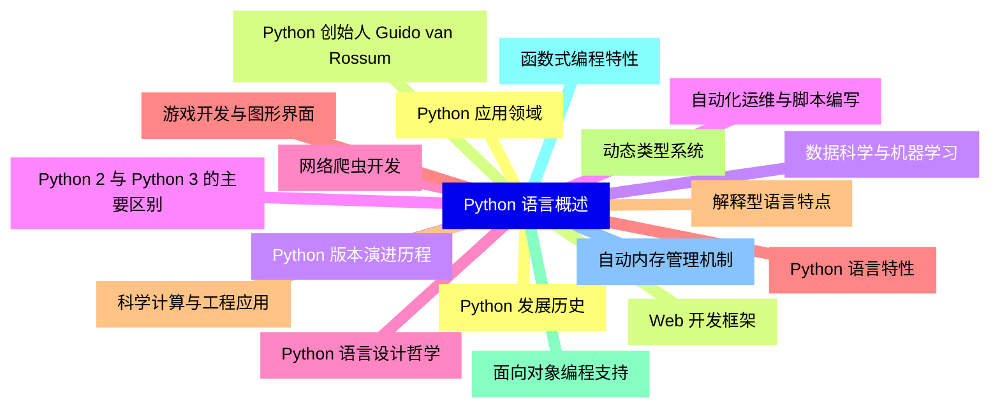
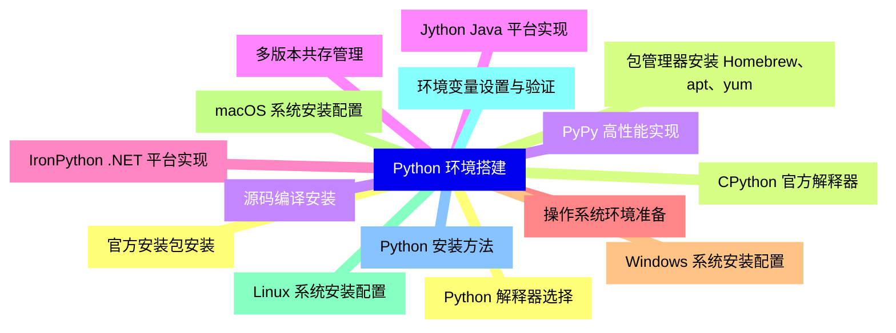
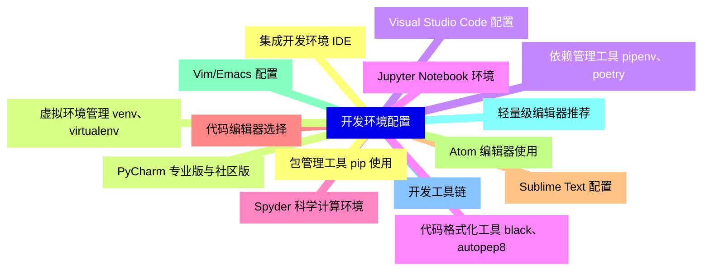
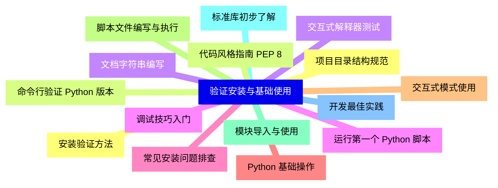
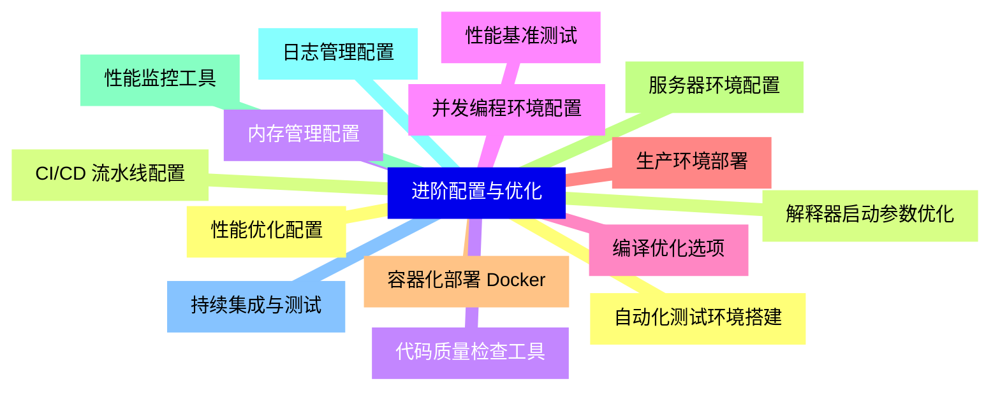


### 1 [Python 语言概述](#1)
#### 1.1 [Python 发展历史](#1)
#### 1.2 [Python 创始人 Guido van Rossum](#1)
#### 1.3 [Python 版本演进历程](#1)
#### 1.4 [Python 2 与 Python 3 的主要区别](#1)
#### 1.5 [Python 语言设计哲学](#1)
#### 1.6 [Python 语言特性](#1)
#### 1.7 [解释型语言特点](#1)
#### 1.8 [动态类型系统](#1)
#### 1.9 [面向对象编程支持](#1)
#### 1.10 [函数式编程特性](#1)
#### 1.11 [自动内存管理机制](#1)
#### 1.12 [Python 应用领域](#1)
#### 1.13 [Web 开发框架](#1)
#### 1.14 [数据科学与机器学习](#1)
#### 1.15 [自动化运维与脚本编写](#1)
#### 1.16 [网络爬虫开发](#1)
#### 1.17 [游戏开发与图形界面](#1)
#### 1.18 [科学计算与工程应用](#1)
### 2 [Python 环境搭建](#2)
#### 2.1 [Python 解释器选择](#2)
#### 2.2 [CPython 官方解释器](#2)
#### 2.3 [PyPy 高性能实现](#2)
#### 2.4 [Jython Java 平台实现](#2)
#### 2.5 [IronPython .NET 平台实现](#2)
#### 2.6 [操作系统环境准备](#2)
#### 2.7 [Windows 系统安装配置](#2)
#### 2.8 [macOS 系统安装配置](#2)
#### 2.9 [Linux 系统安装配置](#2)
#### 2.10 [环境变量设置与验证](#2)
#### 2.11 [Python 安装方法](#2)
#### 2.12 [官方安装包安装](#2)
#### 2.13 [包管理器安装 Homebrew、apt、yum](#2)
#### 2.14 [源码编译安装](#2)
#### 2.15 [多版本共存管理](#2)
### 3 [开发环境配置](#3)
#### 3.1 [集成开发环境 IDE](#3)
#### 3.2 [PyCharm 专业版与社区版](#3)
#### 3.3 [Visual Studio Code 配置](#3)
#### 3.4 [Jupyter Notebook 环境](#3)
#### 3.5 [Spyder 科学计算环境](#3)
#### 3.6 [代码编辑器选择](#3)
#### 3.7 [Sublime Text 配置](#3)
#### 3.8 [Atom 编辑器使用](#3)
#### 3.9 [Vim/Emacs 配置](#3)
#### 3.10 [轻量级编辑器推荐](#3)
#### 3.11 [开发工具链](#3)
#### 3.12 [包管理工具 pip 使用](#3)
#### 3.13 [虚拟环境管理 venv、virtualenv](#3)
#### 3.14 [依赖管理工具 pipenv、poetry](#3)
#### 3.15 [代码格式化工具 black、autopep8](#3)
### 4 [验证安装与基础使用](#4)
#### 4.1 [安装验证方法](#4)
#### 4.2 [命令行验证 Python 版本](#4)
#### 4.3 [交互式解释器测试](#4)
#### 4.4 [运行第一个 Python 脚本](#4)
#### 4.5 [常见安装问题排查](#4)
#### 4.6 [Python 基础操作](#4)
#### 4.7 [交互式模式使用](#4)
#### 4.8 [脚本文件编写与执行](#4)
#### 4.9 [模块导入与使用](#4)
#### 4.10 [标准库初步了解](#4)
#### 4.11 [开发最佳实践](#4)
#### 4.12 [项目目录结构规范](#4)
#### 4.13 [代码风格指南 PEP 8](#4)
#### 4.14 [文档字符串编写](#4)
#### 4.15 [调试技巧入门](#4)
### 5 [进阶配置与优化](#5)
#### 5.1 [性能优化配置](#5)
#### 5.2 [解释器启动参数优化](#5)
#### 5.3 [内存管理配置](#5)
#### 5.4 [并发编程环境配置](#5)
#### 5.5 [编译优化选项](#5)
#### 5.6 [生产环境部署](#5)
#### 5.7 [容器化部署 Docker](#5)
#### 5.8 [服务器环境配置](#5)
#### 5.9 [性能监控工具](#5)
#### 5.10 [日志管理配置](#5)
#### 5.11 [持续集成与测试](#5)
#### 5.12 [自动化测试环境搭建](#5)
#### 5.13 [CI/CD 流水线配置](#5)
#### 5.14 [代码质量检查工具](#5)
#### 5.15 [性能基准测试](#5)




### 1 Python 语言概述

---
### 1 Python 语言概述
___
#### 1.1 Python 发展历史
___
#### 1.2 Python 创始人 Guido van Rossum
___
#### 1.3 Python 版本演进历程
___
#### 1.4 Python 2 与 Python 3 的主要区别
___
#### 1.5 Python 语言设计哲学
___
#### 1.6 Python 语言特性
___
#### 1.7 解释型语言特点
___
#### 1.8 动态类型系统
___
#### 1.9 面向对象编程支持
___
#### 1.10 函数式编程特性
___
#### 1.11 自动内存管理机制
___
#### 1.12 Python 应用领域
___
#### 1.13 Web 开发框架
___
#### 1.14 数据科学与机器学习
___
#### 1.15 自动化运维与脚本编写
___
#### 1.16 网络爬虫开发
___
#### 1.17 游戏开发与图形界面
___
#### 1.18 科学计算与工程应用
### 2 Python 环境搭建

---
### 2 Python 环境搭建
___
#### 2.1 Python 解释器选择
___
#### 2.2 CPython 官方解释器
___
#### 2.3 PyPy 高性能实现
___
#### 2.4 Jython Java 平台实现
___
#### 2.5 IronPython .NET 平台实现
___
#### 2.6 操作系统环境准备
___
#### 2.7 Windows 系统安装配置
___
#### 2.8 macOS 系统安装配置
___
#### 2.9 Linux 系统安装配置
___
#### 2.10 环境变量设置与验证
___
#### 2.11 Python 安装方法
___
#### 2.12 官方安装包安装
___
#### 2.13 包管理器安装 Homebrew、apt、yum
___
#### 2.14 源码编译安装
___
#### 2.15 多版本共存管理
### 3 开发环境配置

---
### 3 开发环境配置
___
#### 3.1 集成开发环境 IDE
___
#### 3.2 PyCharm 专业版与社区版
___
#### 3.3 Visual Studio Code 配置
___
#### 3.4 Jupyter Notebook 环境
___
#### 3.5 Spyder 科学计算环境
___
#### 3.6 代码编辑器选择
___
#### 3.7 Sublime Text 配置
___
#### 3.8 Atom 编辑器使用
___
#### 3.9 Vim/Emacs 配置
___
#### 3.10 轻量级编辑器推荐
___
#### 3.11 开发工具链
___
#### 3.12 包管理工具 pip 使用
___
#### 3.13 虚拟环境管理 venv、virtualenv
___
#### 3.14 依赖管理工具 pipenv、poetry
___
#### 3.15 代码格式化工具 black、autopep8
### 4 验证安装与基础使用

---
### 4 验证安装与基础使用
___
#### 4.1 安装验证方法
___
#### 4.2 命令行验证 Python 版本
___
#### 4.3 交互式解释器测试
___
#### 4.4 运行第一个 Python 脚本
___
#### 4.5 常见安装问题排查
___
#### 4.6 Python 基础操作
___
#### 4.7 交互式模式使用
___
#### 4.8 脚本文件编写与执行
___
#### 4.9 模块导入与使用
___
#### 4.10 标准库初步了解
___
#### 4.11 开发最佳实践
___
#### 4.12 项目目录结构规范
___
#### 4.13 代码风格指南 PEP 8
___
#### 4.14 文档字符串编写
___
#### 4.15 调试技巧入门
### 5 进阶配置与优化

---
### 5 进阶配置与优化
___
#### 5.1 性能优化配置
___
#### 5.2 解释器启动参数优化
___
#### 5.3 内存管理配置
___
#### 5.4 并发编程环境配置
___
#### 5.5 编译优化选项
___
#### 5.6 生产环境部署
___
#### 5.7 容器化部署 Docker
___
#### 5.8 服务器环境配置
___
#### 5.9 性能监控工具
___
#### 5.10 日志管理配置
___
#### 5.11 持续集成与测试
___
#### 5.12 自动化测试环境搭建
___
#### 5.13 CI/CD 流水线配置
___
#### 5.14 代码质量检查工具
___
#### 5.15 性能基准测试


### 1 Python 语言概述{#1}

{}

<--->
{}
{}
{}
{}
{}
{}
{}
{}
{}
{}
{}
{}
{}
{}
{}
{}
{}
{}
{}
{}
{}
{}
{}
{}
{}
{}
{}
{}
{}
{}
{}
{}
{}
{}
{}
{}
{}

### 2 Python 环境搭建{#2}

{}
{}
{}
{}
{}
{}
{}
{}
{}
{}
{}
{}
{}
{}
{}
{}
{}
{}
{}
{}
{}
{}
{}
{}
{}
{}
{}
{}
{}
{}
{}
<--->

{}

### 3 开发环境配置{#3}

{}

<--->
{}
{}
{}
{}
{}
{}
{}
{}
{}
{}
{}
{}
{}
{}
{}
{}
{}
{}
{}
{}
{}
{}
{}
{}
{}
{}
{}
{}
{}
{}
{}

### 4 验证安装与基础使用{#4}

{}
{}
{}
{}
{}
{}
{}
{}
{}
{}
{}
{}
{}
{}
{}
{}
{}
{}
{}
{}
{}
{}
{}
{}
{}
{}
{}
{}
{}
{}
{}
<--->

{}

### 5 进阶配置与优化{#5}

{}

<--->
{}
{}
{}
{}
{}
{}
{}
{}
{}
{}
{}
{}
{}
{}
{}
{}
{}
{}
{}
{}
{}
{}
{}
{}
{}
{}
{}
{}
{}
{}
{}
