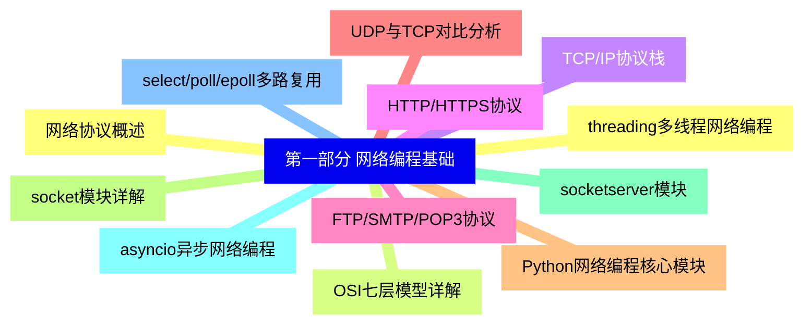
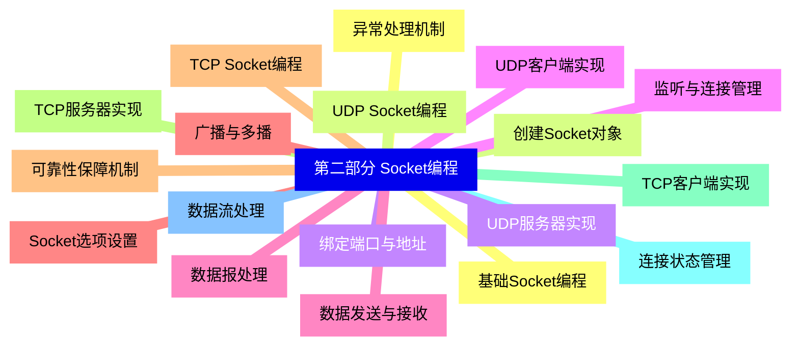
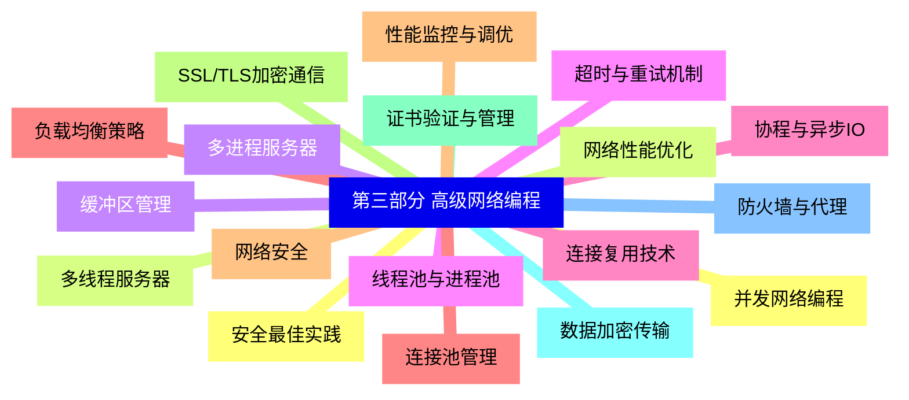
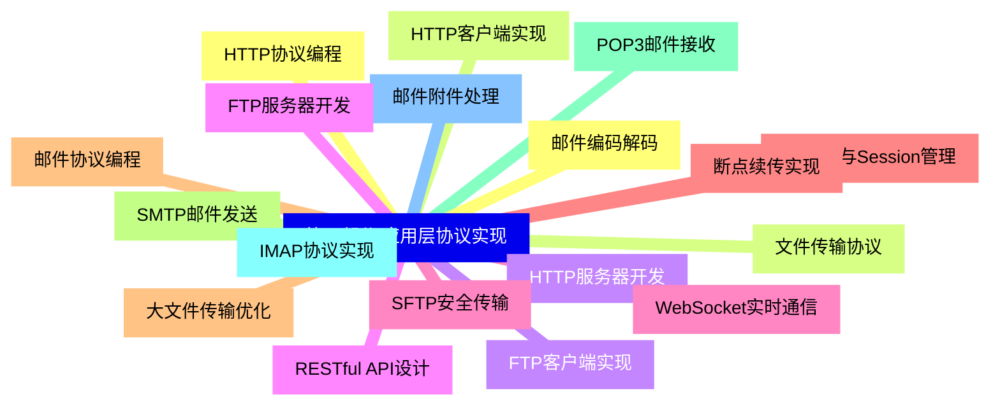
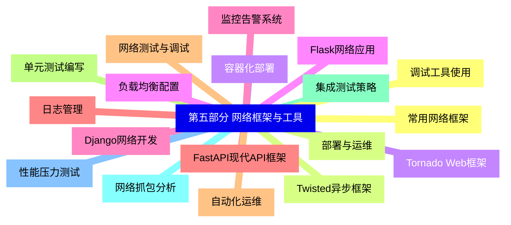
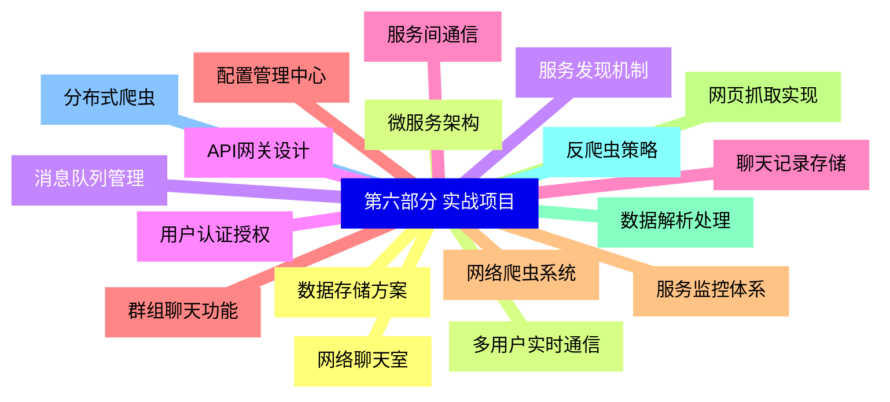
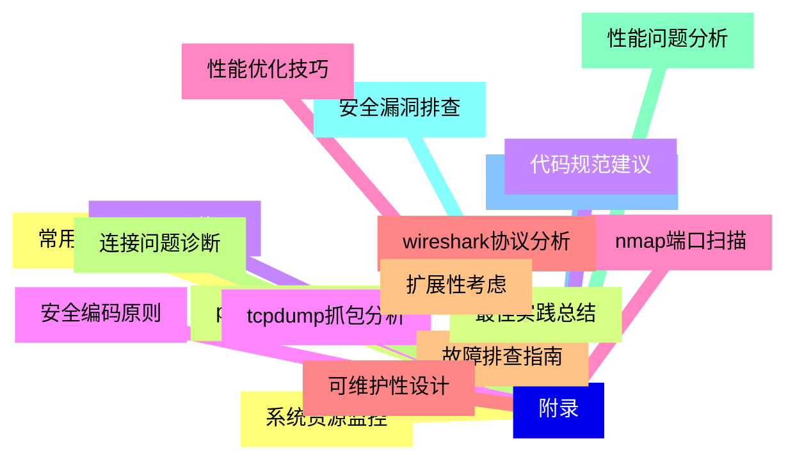


### 1 [第一部分 网络编程基础](#1)
#### 1.1 [网络协议概述](#1)
#### 1.2 [OSI七层模型详解](#1)
#### 1.3 [TCP/IP协议栈](#1)
#### 1.4 [HTTP/HTTPS协议](#1)
#### 1.5 [FTP/SMTP/POP3协议](#1)
#### 1.6 [UDP与TCP对比分析](#1)
#### 1.7 [Python网络编程核心模块](#1)
#### 1.8 [socket模块详解](#1)
#### 1.9 [socketserver模块](#1)
#### 1.10 [asyncio异步网络编程](#1)
#### 1.11 [select/poll/epoll多路复用](#1)
#### 1.12 [threading多线程网络编程](#1)
### 2 [第二部分 Socket编程](#2)
#### 2.1 [基础Socket编程](#2)
#### 2.2 [创建Socket对象](#2)
#### 2.3 [绑定端口与地址](#2)
#### 2.4 [监听与连接管理](#2)
#### 2.5 [数据发送与接收](#2)
#### 2.6 [Socket选项设置](#2)
#### 2.7 [TCP Socket编程](#2)
#### 2.8 [TCP服务器实现](#2)
#### 2.9 [TCP客户端实现](#2)
#### 2.10 [连接状态管理](#2)
#### 2.11 [数据流处理](#2)
#### 2.12 [异常处理机制](#2)
#### 2.13 [UDP Socket编程](#2)
#### 2.14 [UDP服务器实现](#2)
#### 2.15 [UDP客户端实现](#2)
#### 2.16 [数据报处理](#2)
#### 2.17 [广播与多播](#2)
#### 2.18 [可靠性保障机制](#2)
### 3 [第三部分 高级网络编程](#3)
#### 3.1 [并发网络编程](#3)
#### 3.2 [多线程服务器](#3)
#### 3.3 [多进程服务器](#3)
#### 3.4 [线程池与进程池](#3)
#### 3.5 [协程与异步IO](#3)
#### 3.6 [连接池管理](#3)
#### 3.7 [网络安全](#3)
#### 3.8 [SSL/TLS加密通信](#3)
#### 3.9 [证书验证与管理](#3)
#### 3.10 [数据加密传输](#3)
#### 3.11 [防火墙与代理](#3)
#### 3.12 [安全最佳实践](#3)
#### 3.13 [网络性能优化](#3)
#### 3.14 [缓冲区管理](#3)
#### 3.15 [超时与重试机制](#3)
#### 3.16 [连接复用技术](#3)
#### 3.17 [负载均衡策略](#3)
#### 3.18 [性能监控与调优](#3)
### 4 [第四部分 应用层协议实现](#4)
#### 4.1 [HTTP协议编程](#4)
#### 4.2 [HTTP客户端实现](#4)
#### 4.3 [HTTP服务器开发](#4)
#### 4.4 [RESTful API设计](#4)
#### 4.5 [WebSocket实时通信](#4)
#### 4.6 [Cookie与Session管理](#4)
#### 4.7 [邮件协议编程](#4)
#### 4.8 [SMTP邮件发送](#4)
#### 4.9 [POP3邮件接收](#4)
#### 4.10 [IMAP协议实现](#4)
#### 4.11 [邮件附件处理](#4)
#### 4.12 [邮件编码解码](#4)
#### 4.13 [文件传输协议](#4)
#### 4.14 [FTP客户端实现](#4)
#### 4.15 [FTP服务器开发](#4)
#### 4.16 [SFTP安全传输](#4)
#### 4.17 [断点续传实现](#4)
#### 4.18 [大文件传输优化](#4)
### 5 [第五部分 网络框架与工具](#5)
#### 5.1 [常用网络框架](#5)
#### 5.2 [Twisted异步框架](#5)
#### 5.3 [Tornado Web框架](#5)
#### 5.4 [Flask网络应用](#5)
#### 5.5 [Django网络开发](#5)
#### 5.6 [FastAPI现代API框架](#5)
#### 5.7 [网络测试与调试](#5)
#### 5.8 [单元测试编写](#5)
#### 5.9 [集成测试策略](#5)
#### 5.10 [网络抓包分析](#5)
#### 5.11 [性能压力测试](#5)
#### 5.12 [调试工具使用](#5)
#### 5.13 [部署与运维](#5)
#### 5.14 [容器化部署](#5)
#### 5.15 [负载均衡配置](#5)
#### 5.16 [监控告警系统](#5)
#### 5.17 [日志管理](#5)
#### 5.18 [自动化运维](#5)
### 6 [第六部分 实战项目](#6)
#### 6.1 [网络聊天室](#6)
#### 6.2 [多用户实时通信](#6)
#### 6.3 [消息队列管理](#6)
#### 6.4 [用户认证授权](#6)
#### 6.5 [聊天记录存储](#6)
#### 6.6 [群组聊天功能](#6)
#### 6.7 [网络爬虫系统](#6)
#### 6.8 [网页抓取实现](#6)
#### 6.9 [数据解析处理](#6)
#### 6.10 [反爬虫策略](#6)
#### 6.11 [分布式爬虫](#6)
#### 6.12 [数据存储方案](#6)
#### 6.13 [微服务架构](#6)
#### 6.14 [服务发现机制](#6)
#### 6.15 [API网关设计](#6)
#### 6.16 [服务间通信](#6)
#### 6.17 [配置管理中心](#6)
#### 6.18 [服务监控体系](#6)
### 7 [附录](#7)
#### 7.1 [常用网络工具](#7)
#### 7.2 [ping/telnet/netstat](#7)
#### 7.3 [curl/wget使用](#7)
#### 7.4 [tcpdump抓包分析](#7)
#### 7.5 [nmap端口扫描](#7)
#### 7.6 [wireshark协议分析](#7)
#### 7.7 [故障排查指南](#7)
#### 7.8 [连接问题诊断](#7)
#### 7.9 [性能问题分析](#7)
#### 7.10 [安全漏洞排查](#7)
#### 7.11 [协议兼容性问题](#7)
#### 7.12 [系统资源监控](#7)
#### 7.13 [最佳实践总结](#7)
#### 7.14 [代码规范建议](#7)
#### 7.15 [安全编码原则](#7)
#### 7.16 [性能优化技巧](#7)
#### 7.17 [可维护性设计](#7)
#### 7.18 [扩展性考虑](#7)




### 1 第一部分 网络编程基础

---
### 1 第一部分 网络编程基础
___
#### 1.1 网络协议概述
___
#### 1.2 OSI七层模型详解
___
#### 1.3 TCP/IP协议栈
___
#### 1.4 HTTP/HTTPS协议
___
#### 1.5 FTP/SMTP/POP3协议
___
#### 1.6 UDP与TCP对比分析
___
#### 1.7 Python网络编程核心模块
___
#### 1.8 socket模块详解
___
#### 1.9 socketserver模块
___
#### 1.10 asyncio异步网络编程
___
#### 1.11 select/poll/epoll多路复用
___
#### 1.12 threading多线程网络编程
### 2 第二部分 Socket编程

---
### 2 第二部分 Socket编程
___
#### 2.1 基础Socket编程
___
#### 2.2 创建Socket对象
___
#### 2.3 绑定端口与地址
___
#### 2.4 监听与连接管理
___
#### 2.5 数据发送与接收
___
#### 2.6 Socket选项设置
___
#### 2.7 TCP Socket编程
___
#### 2.8 TCP服务器实现
___
#### 2.9 TCP客户端实现
___
#### 2.10 连接状态管理
___
#### 2.11 数据流处理
___
#### 2.12 异常处理机制
___
#### 2.13 UDP Socket编程
___
#### 2.14 UDP服务器实现
___
#### 2.15 UDP客户端实现
___
#### 2.16 数据报处理
___
#### 2.17 广播与多播
___
#### 2.18 可靠性保障机制
### 3 第三部分 高级网络编程

---
### 3 第三部分 高级网络编程
___
#### 3.1 并发网络编程
___
#### 3.2 多线程服务器
___
#### 3.3 多进程服务器
___
#### 3.4 线程池与进程池
___
#### 3.5 协程与异步IO
___
#### 3.6 连接池管理
___
#### 3.7 网络安全
___
#### 3.8 SSL/TLS加密通信
___
#### 3.9 证书验证与管理
___
#### 3.10 数据加密传输
___
#### 3.11 防火墙与代理
___
#### 3.12 安全最佳实践
___
#### 3.13 网络性能优化
___
#### 3.14 缓冲区管理
___
#### 3.15 超时与重试机制
___
#### 3.16 连接复用技术
___
#### 3.17 负载均衡策略
___
#### 3.18 性能监控与调优
### 4 第四部分 应用层协议实现

---
### 4 第四部分 应用层协议实现
___
#### 4.1 HTTP协议编程
___
#### 4.2 HTTP客户端实现
___
#### 4.3 HTTP服务器开发
___
#### 4.4 RESTful API设计
___
#### 4.5 WebSocket实时通信
___
#### 4.6 Cookie与Session管理
___
#### 4.7 邮件协议编程
___
#### 4.8 SMTP邮件发送
___
#### 4.9 POP3邮件接收
___
#### 4.10 IMAP协议实现
___
#### 4.11 邮件附件处理
___
#### 4.12 邮件编码解码
___
#### 4.13 文件传输协议
___
#### 4.14 FTP客户端实现
___
#### 4.15 FTP服务器开发
___
#### 4.16 SFTP安全传输
___
#### 4.17 断点续传实现
___
#### 4.18 大文件传输优化
### 5 第五部分 网络框架与工具

---
### 5 第五部分 网络框架与工具
___
#### 5.1 常用网络框架
___
#### 5.2 Twisted异步框架
___
#### 5.3 Tornado Web框架
___
#### 5.4 Flask网络应用
___
#### 5.5 Django网络开发
___
#### 5.6 FastAPI现代API框架
___
#### 5.7 网络测试与调试
___
#### 5.8 单元测试编写
___
#### 5.9 集成测试策略
___
#### 5.10 网络抓包分析
___
#### 5.11 性能压力测试
___
#### 5.12 调试工具使用
___
#### 5.13 部署与运维
___
#### 5.14 容器化部署
___
#### 5.15 负载均衡配置
___
#### 5.16 监控告警系统
___
#### 5.17 日志管理
___
#### 5.18 自动化运维
### 6 第六部分 实战项目

---
### 6 第六部分 实战项目
___
#### 6.1 网络聊天室
___
#### 6.2 多用户实时通信
___
#### 6.3 消息队列管理
___
#### 6.4 用户认证授权
___
#### 6.5 聊天记录存储
___
#### 6.6 群组聊天功能
___
#### 6.7 网络爬虫系统
___
#### 6.8 网页抓取实现
___
#### 6.9 数据解析处理
___
#### 6.10 反爬虫策略
___
#### 6.11 分布式爬虫
___
#### 6.12 数据存储方案
___
#### 6.13 微服务架构
___
#### 6.14 服务发现机制
___
#### 6.15 API网关设计
___
#### 6.16 服务间通信
___
#### 6.17 配置管理中心
___
#### 6.18 服务监控体系
### 7 附录

---
### 7 附录
___
#### 7.1 常用网络工具
___
#### 7.2 ping/telnet/netstat
___
#### 7.3 curl/wget使用
___
#### 7.4 tcpdump抓包分析
___
#### 7.5 nmap端口扫描
___
#### 7.6 wireshark协议分析
___
#### 7.7 故障排查指南
___
#### 7.8 连接问题诊断
___
#### 7.9 性能问题分析
___
#### 7.10 安全漏洞排查
___
#### 7.11 协议兼容性问题
___
#### 7.12 系统资源监控
___
#### 7.13 最佳实践总结
___
#### 7.14 代码规范建议
___
#### 7.15 安全编码原则
___
#### 7.16 性能优化技巧
___
#### 7.17 可维护性设计
___
#### 7.18 扩展性考虑


### 1 第一部分 网络编程基础{#1}

{}

<--->
{}
{}
{}
{}
{}
{}
{}
{}
{}
{}
{}
{}
{}
{}
{}
{}
{}
{}
{}
{}
{}
{}
{}
{}
{}

### 2 第二部分 Socket编程{#2}

{}
{}
{}
{}
{}
{}
{}
{}
{}
{}
{}
{}
{}
{}
{}
{}
{}
{}
{}
{}
{}
{}
{}
{}
{}
{}
{}
{}
{}
{}
{}
{}
{}
{}
{}
{}
{}
<--->

{}

### 3 第三部分 高级网络编程{#3}

{}

<--->
{}
{}
{}
{}
{}
{}
{}
{}
{}
{}
{}
{}
{}
{}
{}
{}
{}
{}
{}
{}
{}
{}
{}
{}
{}
{}
{}
{}
{}
{}
{}
{}
{}
{}
{}
{}
{}

### 4 第四部分 应用层协议实现{#4}

{}
{}
{}
{}
{}
{}
{}
{}
{}
{}
{}
{}
{}
{}
{}
{}
{}
{}
{}
{}
{}
{}
{}
{}
{}
{}
{}
{}
{}
{}
{}
{}
{}
{}
{}
{}
{}
<--->

{}

### 5 第五部分 网络框架与工具{#5}

{}

<--->
{}
{}
{}
{}
{}
{}
{}
{}
{}
{}
{}
{}
{}
{}
{}
{}
{}
{}
{}
{}
{}
{}
{}
{}
{}
{}
{}
{}
{}
{}
{}
{}
{}
{}
{}
{}
{}

### 6 第六部分 实战项目{#6}

{}
{}
{}
{}
{}
{}
{}
{}
{}
{}
{}
{}
{}
{}
{}
{}
{}
{}
{}
{}
{}
{}
{}
{}
{}
{}
{}
{}
{}
{}
{}
{}
{}
{}
{}
{}
{}
<--->

{}

### 7 附录{#7}

{}

<--->
{}
{}
{}
{}
{}
{}
{}
{}
{}
{}
{}
{}
{}
{}
{}
{}
{}
{}
{}
{}
{}
{}
{}
{}
{}
{}
{}
{}
{}
{}
{}
{}
{}
{}
{}
{}
{}
