
### 1 [Python 数据库访问基础](#1)
#### 1.1 [数据库访问概述](#1)
##### 1.1.1 [数据库访问的基本概念](#1)
##### 1.1.2 [Python 数据库访问的优势](#1)
##### 1.1.3 [常见数据库类型介绍](#1)
#### 1.2 [Python 数据库接口规范](#1)
##### 1.2.1 [DB-API 2.0 规范详解](#1)
##### 1.2.2 [连接对象与游标对象](#1)
##### 1.2.3 [异常处理机制](#1)
### 2 [关系型数据库访问](#2)
#### 2.1 [SQLite 数据库](#2)
##### 2.1.1 [SQLite 数据库特点](#2)
##### 2.1.2 [sqlite3 模块使用详解](#2)
##### 2.1.3 [内存数据库操作](#2)
#### 2.2 [MySQL 数据库](#2)
##### 2.2.1 [MySQL Connector/Python](#2)
##### 2.2.2 [PyMySQL 库使用](#2)
##### 2.2.3 [连接池配置与管理](#2)
#### 2.3 [PostgreSQL 数据库](#2)
##### 2.3.1 [psycopg2 库详解](#2)
##### 2.3.2 [连接参数配置](#2)
##### 2.3.3 [高级数据类型处理](#2)
#### 2.4 [Oracle 数据库](#2)
##### 2.4.1 [cx_Oracle 库使用](#2)
##### 2.4.2 [Oracle 连接配置](#2)
##### 2.4.3 [大对象数据处理](#2)
#### 2.5 [SQL Server 数据库](#2)
##### 2.5.1 [pyodbc 驱动配置](#2)
##### 2.5.2 [pymssql 库使用](#2)
##### 2.5.3 [Windows 认证连接](#2)
### 3 [NoSQL 数据库访问](#3)
#### 3.1 [MongoDB 数据库](#3)
##### 3.1.1 [PyMongo 库详解](#3)
##### 3.1.2 [文档操作与查询](#3)
##### 3.1.3 [聚合管道使用](#3)
#### 3.2 [Redis 数据库](#3)
##### 3.2.1 [redis-py 库使用](#3)
##### 3.2.2 [数据类型操作](#3)
##### 3.2.3 [发布订阅模式](#3)
#### 3.3 [Cassandra 数据库](#3)
##### 3.3.1 [cassandra-driver 配置](#3)
##### 3.3.2 [CQL 查询语言](#3)
##### 3.3.3 [集群连接管理](#3)
### 4 [ORM 框架](#4)
#### 4.1 [SQLAlchemy 核心](#4)
##### 4.1.1 [核心组件介绍](#4)
##### 4.1.2 [声明式基类使用](#4)
##### 4.1.3 [会话管理机制](#4)
#### 4.2 [SQLAlchemy ORM](#4)
##### 4.2.1 [模型定义与映射](#4)
##### 4.2.2 [关系映射配置](#4)
##### 4.2.3 [查询 API 详解](#4)
#### 4.3 [Django ORM](#4)
##### 4.3.1 [模型定义规范](#4)
##### 4.3.2 [查询集操作](#4)
##### 4.3.3 [迁移管理](#4)
#### 4.4 [Peewee ORM](#4)
##### 4.4.1 [轻量级 ORM 特点](#4)
##### 4.4.2 [模型定义与查询](#4)
##### 4.4.3 [扩展插件使用](#4)
### 5 [数据库连接与事务](#5)
#### 5.1 [连接管理](#5)
##### 5.1.1 [连接字符串配置](#5)
##### 5.1.2 [连接池实现](#5)
##### 5.1.3 [超时与重连机制](#5)
#### 5.2 [事务处理](#5)
##### 5.2.1 [事务基本概念](#5)
##### 5.2.2 [事务隔离级别](#5)
##### 5.2.3 [分布式事务处理](#5)
#### 5.3 [连接安全](#5)
##### 5.3.1 [SSL/TLS 加密连接](#5)
##### 5.3.2 [认证机制配置](#5)
##### 5.3.3 [敏感信息保护](#5)
### 6 [数据操作与查询](#6)
#### 6.1 [CRUD 操作](#6)
##### 6.1.1 [数据插入操作](#6)
##### 6.1.2 [数据查询操作](#6)
##### 6.1.3 [数据更新与删除](#6)
#### 6.2 [高级查询技巧](#6)
##### 6.2.1 [复杂条件查询](#6)
##### 6.2.2 [聚合函数使用](#6)
##### 6.2.3 [子查询与连接查询](#6)
#### 6.3 [批量操作](#6)
##### 6.3.1 [批量插入优化](#6)
##### 6.3.2 [批量更新策略](#6)
##### 6.3.3 [事务批量处理](#6)
### 7 [性能优化与调试](#7)
#### 7.1 [查询性能优化](#7)
##### 7.1.1 [索引优化策略](#7)
##### 7.1.2 [查询计划分析](#7)
##### 7.1.3 [缓存机制应用](#7)
#### 7.2 [连接性能优化](#7)
##### 7.2.1 [连接池调优](#7)
##### 7.2.2 [网络延迟优化](#7)
##### 7.2.3 [资源管理策略](#7)
#### 7.3 [调试与监控](#7)
##### 7.3.1 [SQL 日志记录](#7)
##### 7.3.2 [性能监控工具](#7)
##### 7.3.3 [错误追踪机制](#7)
### 8 [异步数据库访问](#8)
#### 8.1 [异步编程基础](#8)
##### 8.1.1 [asyncio 模块概述](#8)
##### 8.1.2 [异步/等待模式](#8)
##### 8.1.3 [事件循环机制](#8)
#### 8.2 [异步数据库驱动](#8)
##### 8.2.1 [asyncpg 使用](#8)
##### 8.2.2 [aiomysql 配置](#8)
##### 8.2.3 [motor 库详解](#8)
#### 8.3 [异步 ORM 框架](#8)
##### 8.3.1 [Tortoise ORM](#8)
##### 8.3.2 [Gino 框架使用](#8)
##### 8.3.3 [异步查询优化](#8)
### 9 [数据迁移与备份](#9)
#### 9.1 [数据库迁移](#9)
##### 9.1.1 [Alembic 迁移工具](#9)
##### 9.1.2 [Django 迁移系统](#9)
##### 9.1.3 [自定义迁移脚本](#9)
#### 9.2 [数据备份与恢复](#9)
##### 9.2.1 [备份策略制定](#9)
##### 9.2.2 [增量备份实现](#9)
##### 9.2.3 [数据恢复流程](#9)
#### 9.3 [数据同步](#9)
##### 9.3.1 [主从复制配置](#9)
##### 9.3.2 [数据同步工具](#9)
##### 9.3.3 [冲突解决机制](#9)
### 10 [实战应用案例](#10)
#### 10.1 [Web 应用数据库设计](#10)
##### 10.1.1 [用户系统设计](#10)
##### 10.1.2 [内容管理系统](#10)
##### 10.1.3 [电商系统数据库](#10)
#### 10.2 [数据分析应用](#10)
##### 10.2.1 [数据提取与转换](#10)
##### 10.2.2 [大数据量处理](#10)
##### 10.2.3 [报表生成系统](#10)
#### 10.3 [微服务架构](#10)
##### 10.3.1 [多数据库配置](#10)
##### 10.3.2 [数据一致性保证](#10)
##### 10.3.3 [服务间数据交互](#10)
### 11 [最佳实践与安全](#11)
#### 11.1 [编码规范](#11)
##### 11.1.1 [SQL 注入防护](#11)
##### 11.1.2 [参数化查询使用](#11)
##### 11.1.3 [代码组织规范](#11)
#### 11.2 [安全实践](#11)
##### 11.2.1 [权限管理策略](#11)
##### 11.2.2 [数据加密存储](#11)
##### 11.2.3 [审计日志记录](#11)
#### 11.3 [部署与运维](#11)
##### 11.3.1 [生产环境配置](#11)
##### 11.3.2 [监控告警设置](#11)
##### 11.3.3 [故障排查流程](#11)




### 1 Python 数据库访问基础

---
### 1 Python 数据库访问基础
___
#### 1.1 数据库访问概述
___
##### 1.1.1 数据库访问的基本概念
___
##### 1.1.2 Python 数据库访问的优势
___
##### 1.1.3 常见数据库类型介绍
___
#### 1.2 Python 数据库接口规范
___
##### 1.2.1 DB-API 2.0 规范详解
___
##### 1.2.2 连接对象与游标对象
___
##### 1.2.3 异常处理机制
### 2 关系型数据库访问

---
### 2 关系型数据库访问
___
#### 2.1 SQLite 数据库
___
##### 2.1.1 SQLite 数据库特点
___
##### 2.1.2 sqlite3 模块使用详解
___
##### 2.1.3 内存数据库操作
___
#### 2.2 MySQL 数据库
___
##### 2.2.1 MySQL Connector/Python
___
##### 2.2.2 PyMySQL 库使用
___
##### 2.2.3 连接池配置与管理
___
#### 2.3 PostgreSQL 数据库
___
##### 2.3.1 psycopg2 库详解
___
##### 2.3.2 连接参数配置
___
##### 2.3.3 高级数据类型处理
___
#### 2.4 Oracle 数据库
___
##### 2.4.1 cx_Oracle 库使用
___
##### 2.4.2 Oracle 连接配置
___
##### 2.4.3 大对象数据处理
___
#### 2.5 SQL Server 数据库
___
##### 2.5.1 pyodbc 驱动配置
___
##### 2.5.2 pymssql 库使用
___
##### 2.5.3 Windows 认证连接
### 3 NoSQL 数据库访问

---
### 3 NoSQL 数据库访问
___
#### 3.1 MongoDB 数据库
___
##### 3.1.1 PyMongo 库详解
___
##### 3.1.2 文档操作与查询
___
##### 3.1.3 聚合管道使用
___
#### 3.2 Redis 数据库
___
##### 3.2.1 redis-py 库使用
___
##### 3.2.2 数据类型操作
___
##### 3.2.3 发布订阅模式
___
#### 3.3 Cassandra 数据库
___
##### 3.3.1 cassandra-driver 配置
___
##### 3.3.2 CQL 查询语言
___
##### 3.3.3 集群连接管理
### 4 ORM 框架

---
### 4 ORM 框架
___
#### 4.1 SQLAlchemy 核心
___
##### 4.1.1 核心组件介绍
___
##### 4.1.2 声明式基类使用
___
##### 4.1.3 会话管理机制
___
#### 4.2 SQLAlchemy ORM
___
##### 4.2.1 模型定义与映射
___
##### 4.2.2 关系映射配置
___
##### 4.2.3 查询 API 详解
___
#### 4.3 Django ORM
___
##### 4.3.1 模型定义规范
___
##### 4.3.2 查询集操作
___
##### 4.3.3 迁移管理
___
#### 4.4 Peewee ORM
___
##### 4.4.1 轻量级 ORM 特点
___
##### 4.4.2 模型定义与查询
___
##### 4.4.3 扩展插件使用
### 5 数据库连接与事务

---
### 5 数据库连接与事务
___
#### 5.1 连接管理
___
##### 5.1.1 连接字符串配置
___
##### 5.1.2 连接池实现
___
##### 5.1.3 超时与重连机制
___
#### 5.2 事务处理
___
##### 5.2.1 事务基本概念
___
##### 5.2.2 事务隔离级别
___
##### 5.2.3 分布式事务处理
___
#### 5.3 连接安全
___
##### 5.3.1 SSL/TLS 加密连接
___
##### 5.3.2 认证机制配置
___
##### 5.3.3 敏感信息保护
### 6 数据操作与查询

---
### 6 数据操作与查询
___
#### 6.1 CRUD 操作
___
##### 6.1.1 数据插入操作
___
##### 6.1.2 数据查询操作
___
##### 6.1.3 数据更新与删除
___
#### 6.2 高级查询技巧
___
##### 6.2.1 复杂条件查询
___
##### 6.2.2 聚合函数使用
___
##### 6.2.3 子查询与连接查询
___
#### 6.3 批量操作
___
##### 6.3.1 批量插入优化
___
##### 6.3.2 批量更新策略
___
##### 6.3.3 事务批量处理
### 7 性能优化与调试

---
### 7 性能优化与调试
___
#### 7.1 查询性能优化
___
##### 7.1.1 索引优化策略
___
##### 7.1.2 查询计划分析
___
##### 7.1.3 缓存机制应用
___
#### 7.2 连接性能优化
___
##### 7.2.1 连接池调优
___
##### 7.2.2 网络延迟优化
___
##### 7.2.3 资源管理策略
___
#### 7.3 调试与监控
___
##### 7.3.1 SQL 日志记录
___
##### 7.3.2 性能监控工具
___
##### 7.3.3 错误追踪机制
### 8 异步数据库访问

---
### 8 异步数据库访问
___
#### 8.1 异步编程基础
___
##### 8.1.1 asyncio 模块概述
___
##### 8.1.2 异步/等待模式
___
##### 8.1.3 事件循环机制
___
#### 8.2 异步数据库驱动
___
##### 8.2.1 asyncpg 使用
___
##### 8.2.2 aiomysql 配置
___
##### 8.2.3 motor 库详解
___
#### 8.3 异步 ORM 框架
___
##### 8.3.1 Tortoise ORM
___
##### 8.3.2 Gino 框架使用
___
##### 8.3.3 异步查询优化
### 9 数据迁移与备份

---
### 9 数据迁移与备份
___
#### 9.1 数据库迁移
___
##### 9.1.1 Alembic 迁移工具
___
##### 9.1.2 Django 迁移系统
___
##### 9.1.3 自定义迁移脚本
___
#### 9.2 数据备份与恢复
___
##### 9.2.1 备份策略制定
___
##### 9.2.2 增量备份实现
___
##### 9.2.3 数据恢复流程
___
#### 9.3 数据同步
___
##### 9.3.1 主从复制配置
___
##### 9.3.2 数据同步工具
___
##### 9.3.3 冲突解决机制
### 10 实战应用案例

---
### 10 实战应用案例
___
#### 10.1 Web 应用数据库设计
___
##### 10.1.1 用户系统设计
___
##### 10.1.2 内容管理系统
___
##### 10.1.3 电商系统数据库
___
#### 10.2 数据分析应用
___
##### 10.2.1 数据提取与转换
___
##### 10.2.2 大数据量处理
___
##### 10.2.3 报表生成系统
___
#### 10.3 微服务架构
___
##### 10.3.1 多数据库配置
___
##### 10.3.2 数据一致性保证
___
##### 10.3.3 服务间数据交互
### 11 最佳实践与安全

---
### 11 最佳实践与安全
___
#### 11.1 编码规范
___
##### 11.1.1 SQL 注入防护
___
##### 11.1.2 参数化查询使用
___
##### 11.1.3 代码组织规范
___
#### 11.2 安全实践
___
##### 11.2.1 权限管理策略
___
##### 11.2.2 数据加密存储
___
##### 11.2.3 审计日志记录
___
#### 11.3 部署与运维
___
##### 11.3.1 生产环境配置
___
##### 11.3.2 监控告警设置
___
##### 11.3.3 故障排查流程


### 1 Python 数据库访问基础{#1}

{}
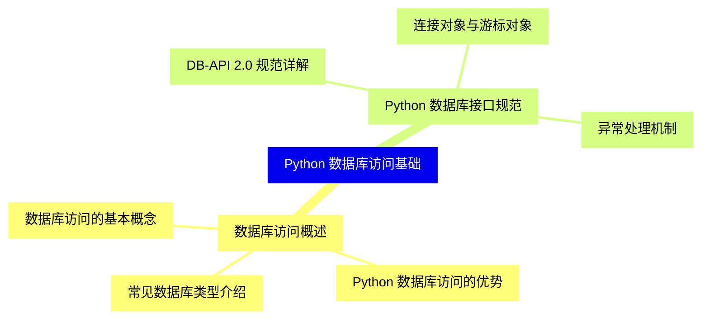

<--->
{}
{}
{}
{}
{}
{}
{}
{}
{}
{}
{}
{}
{}
{}
{}
{}
{}

### 2 关系型数据库访问{#2}

{}
{}
{}
{}
{}
{}
{}
{}
{}
{}
{}
{}
{}
{}
{}
{}
{}
{}
{}
{}
{}
{}
{}
{}
{}
{}
{}
{}
{}
{}
{}
{}
{}
{}
{}
{}
{}
{}
{}
{}
{}
<--->
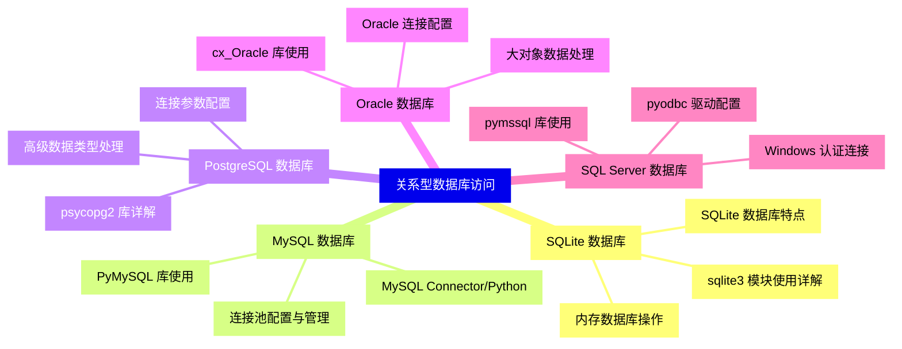

{}

### 3 NoSQL 数据库访问{#3}

{}
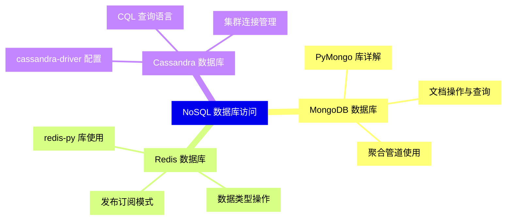

<--->
{}
{}
{}
{}
{}
{}
{}
{}
{}
{}
{}
{}
{}
{}
{}
{}
{}
{}
{}
{}
{}
{}
{}
{}
{}

### 4 ORM 框架{#4}

{}
{}
{}
{}
{}
{}
{}
{}
{}
{}
{}
{}
{}
{}
{}
{}
{}
{}
{}
{}
{}
{}
{}
{}
{}
{}
{}
{}
{}
{}
{}
{}
{}
<--->
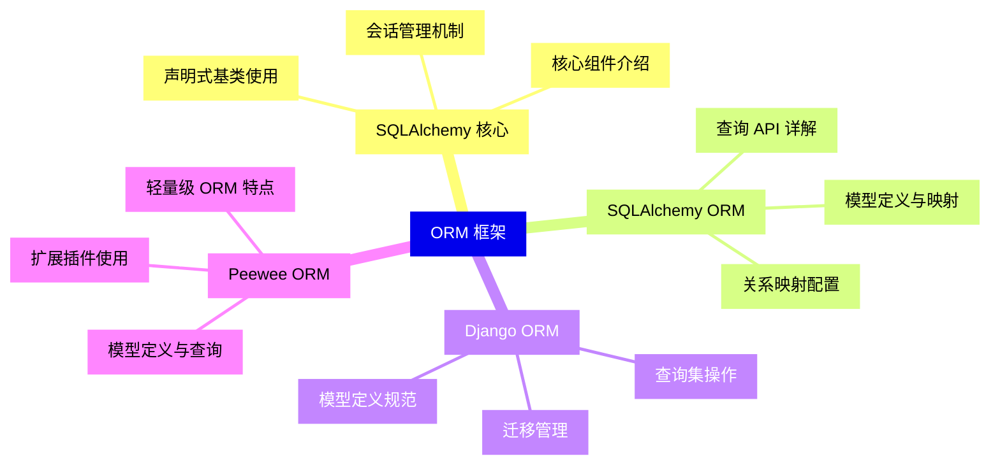

{}

### 5 数据库连接与事务{#5}

{}
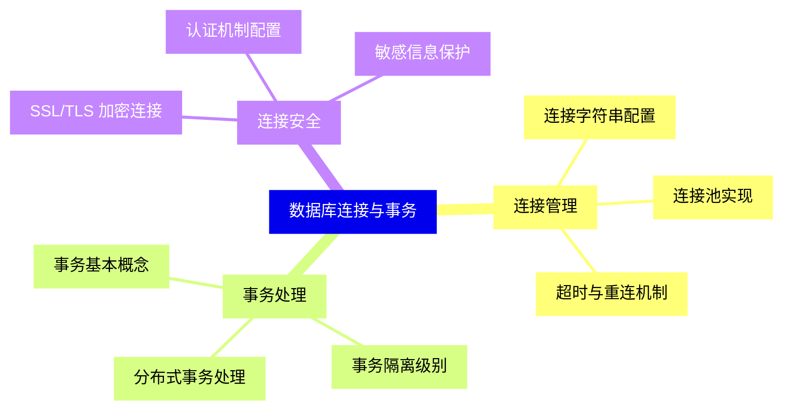

<--->
{}
{}
{}
{}
{}
{}
{}
{}
{}
{}
{}
{}
{}
{}
{}
{}
{}
{}
{}
{}
{}
{}
{}
{}
{}

### 6 数据操作与查询{#6}

{}
{}
{}
{}
{}
{}
{}
{}
{}
{}
{}
{}
{}
{}
{}
{}
{}
{}
{}
{}
{}
{}
{}
{}
{}
<--->
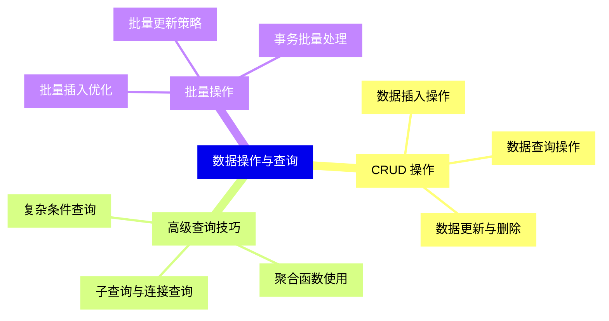

{}

### 7 性能优化与调试{#7}

{}
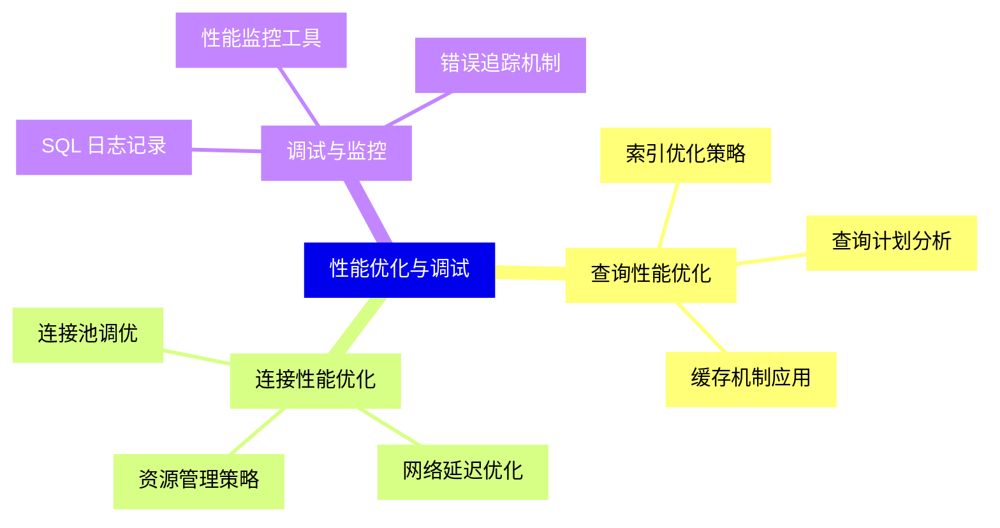

<--->
{}
{}
{}
{}
{}
{}
{}
{}
{}
{}
{}
{}
{}
{}
{}
{}
{}
{}
{}
{}
{}
{}
{}
{}
{}

### 8 异步数据库访问{#8}

{}
{}
{}
{}
{}
{}
{}
{}
{}
{}
{}
{}
{}
{}
{}
{}
{}
{}
{}
{}
{}
{}
{}
{}
{}
<--->
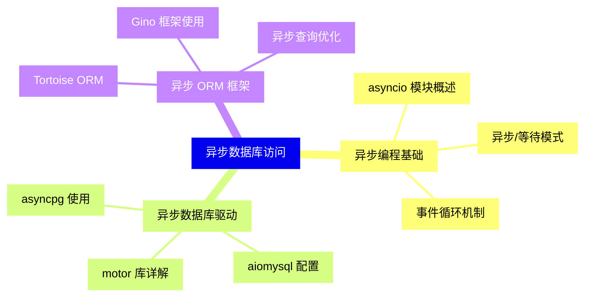

{}

### 9 数据迁移与备份{#9}

{}
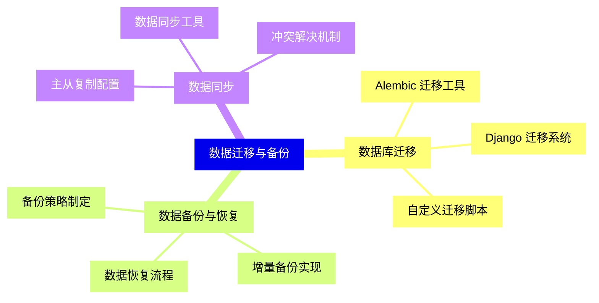

<--->
{}
{}
{}
{}
{}
{}
{}
{}
{}
{}
{}
{}
{}
{}
{}
{}
{}
{}
{}
{}
{}
{}
{}
{}
{}

### 10 实战应用案例{#10}

{}
{}
{}
{}
{}
{}
{}
{}
{}
{}
{}
{}
{}
{}
{}
{}
{}
{}
{}
{}
{}
{}
{}
{}
{}
<--->
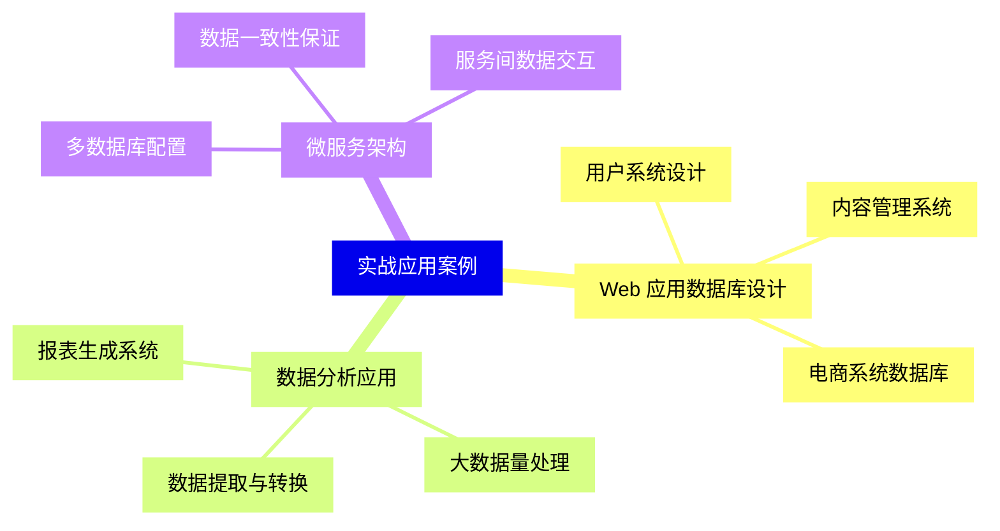

{}

### 11 最佳实践与安全{#11}

{}
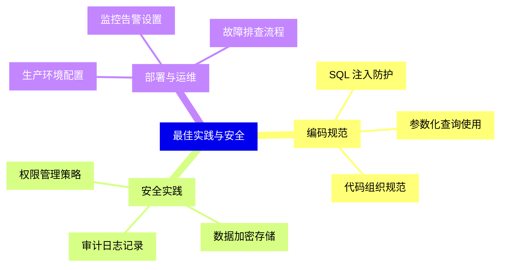

<--->
{}
{}
{}
{}
{}
{}
{}
{}
{}
{}
{}
{}
{}
{}
{}
{}
{}
{}
{}
{}
{}
{}
{}
{}
{}
