
### 1 [Python 基础回顾](#1)
#### 1.1 [Python 语法基础](#1)
#### 1.2 [变量与数据类型](#1)
#### 1.3 [控制结构 条件语句、循环语句](#1)
#### 1.4 [函数定义与调用](#1)
#### 1.5 [模块与包管理](#1)
#### 1.6 [面向对象编程](#1)
#### 1.7 [类与对象](#1)
#### 1.8 [继承与多态](#1)
#### 1.9 [特殊方法与属性](#1)
#### 1.10 [异常处理](#1)
#### 1.11 [常见异常类型](#1)
#### 1.12 [try-except 语句](#1)
#### 1.13 [自定义异常](#1)
### 2 [Web 开发基础概念](#2)
#### 2.1 [HTTP 协议](#2)
#### 2.2 [HTTP 请求与响应](#2)
#### 2.3 [状态码详解](#2)
#### 2.4 [请求方法 GET、POST 等](#2)
#### 2.5 [头部信息](#2)
#### 2.6 [客户端与服务器](#2)
#### 2.7 [浏览器工作原理](#2)
#### 2.8 [服务器架构](#2)
#### 2.9 [前后端分离概念](#2)
#### 2.10 [Web 安全基础](#2)
#### 2.11 [XSS 攻击与防护](#2)
#### 2.12 [CSRF 攻击与防护](#2)
#### 2.13 [SQL 注入防护](#2)
### 3 [Python Web 框架概述](#3)
#### 3.1 [主流框架介绍](#3)
#### 3.2 [Django 框架特点](#3)
#### 3.3 [Flask 框架特点](#3)
#### 3.4 [FastAPI 框架特点](#3)
#### 3.5 [框架选择标准](#3)
#### 3.6 [项目规模考量](#3)
#### 3.7 [性能需求分析](#3)
#### 3.8 [开发效率评估](#3)
#### 3.9 [MVC/MVT 设计模式](#3)
#### 3.10 [模型层设计](#3)
#### 3.11 [视图层设计](#3)
#### 3.12 [控制器/模板层设计](#3)
### 4 [Django 框架详解](#4)
#### 4.1 [Django 项目结构](#4)
#### 4.2 [项目创建与配置](#4)
#### 4.3 [应用 App 概念](#4)
#### 4.4 [设置文件详解](#4)
#### 4.5 [模型层 Models](#4)
#### 4.6 [模型定义与字段类型](#4)
#### 4.7 [数据库迁移操作](#4)
#### 4.8 [查询集 API](#4)
#### 4.9 [视图层 Views](#4)
#### 4.10 [函数视图编写](#4)
#### 4.11 [类视图使用](#4)
#### 4.12 [请求与响应处理](#4)
#### 4.13 [模板系统](#4)
#### 4.14 [模板语法](#4)
#### 4.15 [模板继承](#4)
#### 4.16 [静态文件管理](#4)
#### 4.17 [URL 路由](#4)
#### 4.18 [URL 配置](#4)
#### 4.19 [路由参数传递](#4)
#### 4.20 [命名空间与反向解析](#4)
### 5 [Flask 框架详解](#5)
#### 5.1 [Flask 基础应用](#5)
#### 5.2 [应用初始化](#5)
#### 5.3 [路由装饰器](#5)
#### 5.4 [请求上下文](#5)
#### 5.5 [模板渲染](#5)
#### 5.6 [Jinja2 模板引擎](#5)
#### 5.7 [模板变量与过滤器](#5)
#### 5.8 [模板继承与包含](#5)
#### 5.9 [数据库集成](#5)
#### 5.10 [SQLAlchemy ORM](#5)
#### 5.11 [模型定义与关系](#5)
#### 5.12 [数据库迁移](#5)
#### 5.13 [扩展应用](#5)
#### 5.14 [Flask-WTF 表单处理](#5)
#### 5.15 [Flask-Login 用户认证](#5)
#### 5.16 [Flask-RESTful API 开发](#5)
### 6 [数据库与 ORM](#6)
#### 6.1 [关系型数据库](#6)
#### 6.2 [MySQL/PostgreSQL 连接](#6)
#### 6.3 [数据库设计原则](#6)
#### 6.4 [索引与优化](#6)
#### 6.5 [ORM 原理与使用](#6)
#### 6.6 [对象关系映射概念](#6)
#### 6.7 [查询优化技巧](#6)
#### 6.8 [事务处理](#6)
#### 6.9 [非关系型数据库](#6)
#### 6.10 [MongoDB 集成](#6)
#### 6.11 [Redis 缓存应用](#6)
#### 6.12 [数据序列化](#6)
### 7 [前端技术集成](#7)
#### 7.1 [HTML/CSS/JavaScript 基础](#7)
#### 7.2 [页面结构设计](#7)
#### 7.3 [样式表应用](#7)
#### 7.4 [基础交互实现](#7)
#### 7.5 [前端框架集成](#7)
#### 7.6 [Bootstrap 响应式设计](#7)
#### 7.7 [jQuery AJAX 请求](#7)
#### 7.8 [Vue.js/React 集成方案](#7)
#### 7.9 [模板引擎高级应用](#7)
#### 7.10 [自定义模板标签](#7)
#### 7.11 [模板缓存优化](#7)
#### 7.12 [国际化支持](#7)
### 8 [用户认证与授权](#8)
#### 8.1 [认证系统设计](#8)
#### 8.2 [用户注册与登录](#8)
#### 8.3 [密码加密存储](#8)
#### 8.4 [Session 与 Cookie 管理](#8)
#### 8.5 [权限控制](#8)
#### 8.6 [基于角色的访问控制](#8)
#### 8.7 [权限装饰器](#8)
#### 8.8 [细粒度权限管理](#8)
#### 8.9 [第三方登录](#8)
#### 8.10 [OAuth 2.0 协议](#8)
#### 8.11 [社交媒体登录集成](#8)
#### 8.12 [JWT 令牌认证](#8)
### 9 [RESTful API 开发](#9)
#### 9.1 [REST 架构原则](#9)
#### 9.2 [资源表示](#9)
#### 9.3 [统一接口](#9)
#### 9.4 [无状态通信](#9)
#### 9.5 [API 设计规范](#9)
#### 9.6 [端点命名约定](#9)
#### 9.7 [版本控制策略](#9)
#### 9.8 [错误处理机制](#9)
#### 9.9 [API 文档与测试](#9)
#### 9.10 [Swagger/OpenAPI 文档](#9)
#### 9.11 [单元测试编写](#9)
#### 9.12 [接口自动化测试](#9)
### 10 [部署与运维](#10)
#### 10.1 [生产环境配置](#10)
#### 10.2 [服务器选型](#10)
#### 10.3 [环境变量管理](#10)
#### 10.4 [日志系统配置](#10)
#### 10.5 [部署工具](#10)
#### 10.6 [Docker 容器化](#10)
#### 10.7 [Nginx 反向代理](#10)
#### 10.8 [Gunicorn/uWSGI 应用服务器](#10)
#### 10.9 [性能优化](#10)
#### 10.10 [缓存策略](#10)
#### 10.11 [数据库优化](#10)
#### 10.12 [代码性能分析](#10)
### 11 [测试与调试](#11)
#### 11.1 [测试类型](#11)
#### 11.2 [单元测试](#11)
#### 11.3 [集成测试](#11)
#### 11.4 [功能测试](#11)
#### 11.5 [测试工具](#11)
#### 11.6 [unittest 框架](#11)
#### 11.7 [pytest 高级特性](#11)
#### 11.8 [测试覆盖率分析](#11)
#### 11.9 [调试技巧](#11)
#### 11.10 [日志记录](#11)
#### 11.11 [调试器使用](#11)
#### 11.12 [性能监控](#11)
### 12 [项目实战](#12)
#### 12.1 [博客系统开发](#12)
#### 12.2 [需求分析](#12)
#### 12.3 [数据库设计](#12)
#### 12.4 [功能实现](#12)
#### 12.5 [电子商务网站](#12)
#### 12.6 [商品管理系统](#12)
#### 12.7 [购物车功能](#12)
#### 12.8 [订单处理流程](#12)
#### 12.9 [实时应用开发](#12)
#### 12.10 [WebSocket 通信](#12)
#### 12.11 [消息队列应用](#12)
#### 12.12 [实时数据推送](#12)




### 1 Python 基础回顾

---
### 1 Python 基础回顾
___
#### 1.1 Python 语法基础
___
#### 1.2 变量与数据类型
___
#### 1.3 控制结构 条件语句、循环语句
___
#### 1.4 函数定义与调用
___
#### 1.5 模块与包管理
___
#### 1.6 面向对象编程
___
#### 1.7 类与对象
___
#### 1.8 继承与多态
___
#### 1.9 特殊方法与属性
___
#### 1.10 异常处理
___
#### 1.11 常见异常类型
___
#### 1.12 try-except 语句
___
#### 1.13 自定义异常
### 2 Web 开发基础概念

---
### 2 Web 开发基础概念
___
#### 2.1 HTTP 协议
___
#### 2.2 HTTP 请求与响应
___
#### 2.3 状态码详解
___
#### 2.4 请求方法 GET、POST 等
___
#### 2.5 头部信息
___
#### 2.6 客户端与服务器
___
#### 2.7 浏览器工作原理
___
#### 2.8 服务器架构
___
#### 2.9 前后端分离概念
___
#### 2.10 Web 安全基础
___
#### 2.11 XSS 攻击与防护
___
#### 2.12 CSRF 攻击与防护
___
#### 2.13 SQL 注入防护
### 3 Python Web 框架概述

---
### 3 Python Web 框架概述
___
#### 3.1 主流框架介绍
___
#### 3.2 Django 框架特点
___
#### 3.3 Flask 框架特点
___
#### 3.4 FastAPI 框架特点
___
#### 3.5 框架选择标准
___
#### 3.6 项目规模考量
___
#### 3.7 性能需求分析
___
#### 3.8 开发效率评估
___
#### 3.9 MVC/MVT 设计模式
___
#### 3.10 模型层设计
___
#### 3.11 视图层设计
___
#### 3.12 控制器/模板层设计
### 4 Django 框架详解

---
### 4 Django 框架详解
___
#### 4.1 Django 项目结构
___
#### 4.2 项目创建与配置
___
#### 4.3 应用 App 概念
___
#### 4.4 设置文件详解
___
#### 4.5 模型层 Models
___
#### 4.6 模型定义与字段类型
___
#### 4.7 数据库迁移操作
___
#### 4.8 查询集 API
___
#### 4.9 视图层 Views
___
#### 4.10 函数视图编写
___
#### 4.11 类视图使用
___
#### 4.12 请求与响应处理
___
#### 4.13 模板系统
___
#### 4.14 模板语法
___
#### 4.15 模板继承
___
#### 4.16 静态文件管理
___
#### 4.17 URL 路由
___
#### 4.18 URL 配置
___
#### 4.19 路由参数传递
___
#### 4.20 命名空间与反向解析
### 5 Flask 框架详解

---
### 5 Flask 框架详解
___
#### 5.1 Flask 基础应用
___
#### 5.2 应用初始化
___
#### 5.3 路由装饰器
___
#### 5.4 请求上下文
___
#### 5.5 模板渲染
___
#### 5.6 Jinja2 模板引擎
___
#### 5.7 模板变量与过滤器
___
#### 5.8 模板继承与包含
___
#### 5.9 数据库集成
___
#### 5.10 SQLAlchemy ORM
___
#### 5.11 模型定义与关系
___
#### 5.12 数据库迁移
___
#### 5.13 扩展应用
___
#### 5.14 Flask-WTF 表单处理
___
#### 5.15 Flask-Login 用户认证
___
#### 5.16 Flask-RESTful API 开发
### 6 数据库与 ORM

---
### 6 数据库与 ORM
___
#### 6.1 关系型数据库
___
#### 6.2 MySQL/PostgreSQL 连接
___
#### 6.3 数据库设计原则
___
#### 6.4 索引与优化
___
#### 6.5 ORM 原理与使用
___
#### 6.6 对象关系映射概念
___
#### 6.7 查询优化技巧
___
#### 6.8 事务处理
___
#### 6.9 非关系型数据库
___
#### 6.10 MongoDB 集成
___
#### 6.11 Redis 缓存应用
___
#### 6.12 数据序列化
### 7 前端技术集成

---
### 7 前端技术集成
___
#### 7.1 HTML/CSS/JavaScript 基础
___
#### 7.2 页面结构设计
___
#### 7.3 样式表应用
___
#### 7.4 基础交互实现
___
#### 7.5 前端框架集成
___
#### 7.6 Bootstrap 响应式设计
___
#### 7.7 jQuery AJAX 请求
___
#### 7.8 Vue.js/React 集成方案
___
#### 7.9 模板引擎高级应用
___
#### 7.10 自定义模板标签
___
#### 7.11 模板缓存优化
___
#### 7.12 国际化支持
### 8 用户认证与授权

---
### 8 用户认证与授权
___
#### 8.1 认证系统设计
___
#### 8.2 用户注册与登录
___
#### 8.3 密码加密存储
___
#### 8.4 Session 与 Cookie 管理
___
#### 8.5 权限控制
___
#### 8.6 基于角色的访问控制
___
#### 8.7 权限装饰器
___
#### 8.8 细粒度权限管理
___
#### 8.9 第三方登录
___
#### 8.10 OAuth 2.0 协议
___
#### 8.11 社交媒体登录集成
___
#### 8.12 JWT 令牌认证
### 9 RESTful API 开发

---
### 9 RESTful API 开发
___
#### 9.1 REST 架构原则
___
#### 9.2 资源表示
___
#### 9.3 统一接口
___
#### 9.4 无状态通信
___
#### 9.5 API 设计规范
___
#### 9.6 端点命名约定
___
#### 9.7 版本控制策略
___
#### 9.8 错误处理机制
___
#### 9.9 API 文档与测试
___
#### 9.10 Swagger/OpenAPI 文档
___
#### 9.11 单元测试编写
___
#### 9.12 接口自动化测试
### 10 部署与运维

---
### 10 部署与运维
___
#### 10.1 生产环境配置
___
#### 10.2 服务器选型
___
#### 10.3 环境变量管理
___
#### 10.4 日志系统配置
___
#### 10.5 部署工具
___
#### 10.6 Docker 容器化
___
#### 10.7 Nginx 反向代理
___
#### 10.8 Gunicorn/uWSGI 应用服务器
___
#### 10.9 性能优化
___
#### 10.10 缓存策略
___
#### 10.11 数据库优化
___
#### 10.12 代码性能分析
### 11 测试与调试

---
### 11 测试与调试
___
#### 11.1 测试类型
___
#### 11.2 单元测试
___
#### 11.3 集成测试
___
#### 11.4 功能测试
___
#### 11.5 测试工具
___
#### 11.6 unittest 框架
___
#### 11.7 pytest 高级特性
___
#### 11.8 测试覆盖率分析
___
#### 11.9 调试技巧
___
#### 11.10 日志记录
___
#### 11.11 调试器使用
___
#### 11.12 性能监控
### 12 项目实战

---
### 12 项目实战
___
#### 12.1 博客系统开发
___
#### 12.2 需求分析
___
#### 12.3 数据库设计
___
#### 12.4 功能实现
___
#### 12.5 电子商务网站
___
#### 12.6 商品管理系统
___
#### 12.7 购物车功能
___
#### 12.8 订单处理流程
___
#### 12.9 实时应用开发
___
#### 12.10 WebSocket 通信
___
#### 12.11 消息队列应用
___
#### 12.12 实时数据推送


### 1 Python 基础回顾{#1}

{}
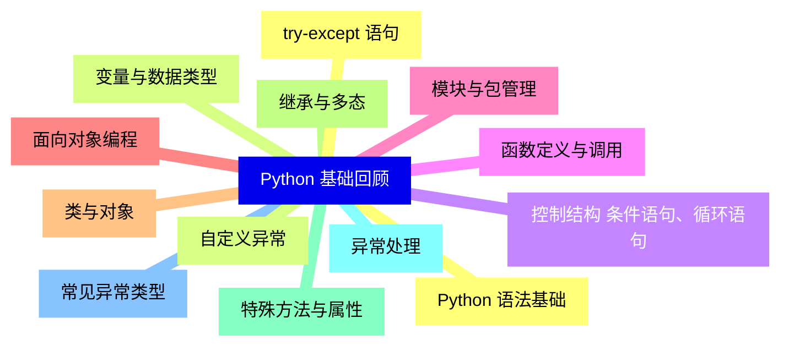

<--->
{}
{}
{}
{}
{}
{}
{}
{}
{}
{}
{}
{}
{}
{}
{}
{}
{}
{}
{}
{}
{}
{}
{}
{}
{}
{}
{}

### 2 Web 开发基础概念{#2}

{}
{}
{}
{}
{}
{}
{}
{}
{}
{}
{}
{}
{}
{}
{}
{}
{}
{}
{}
{}
{}
{}
{}
{}
{}
{}
{}
<--->
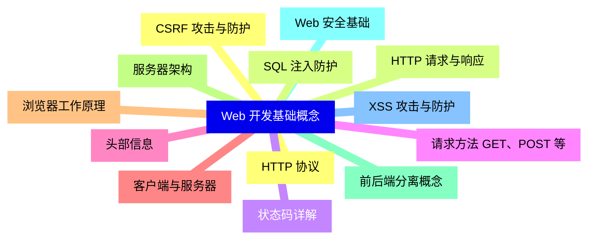

{}

### 3 Python Web 框架概述{#3}

{}
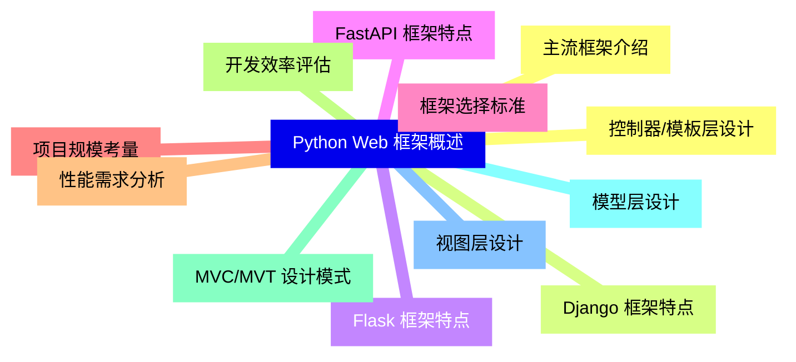

<--->
{}
{}
{}
{}
{}
{}
{}
{}
{}
{}
{}
{}
{}
{}
{}
{}
{}
{}
{}
{}
{}
{}
{}
{}
{}

### 4 Django 框架详解{#4}

{}
{}
{}
{}
{}
{}
{}
{}
{}
{}
{}
{}
{}
{}
{}
{}
{}
{}
{}
{}
{}
{}
{}
{}
{}
{}
{}
{}
{}
{}
{}
{}
{}
{}
{}
{}
{}
{}
{}
{}
{}
<--->
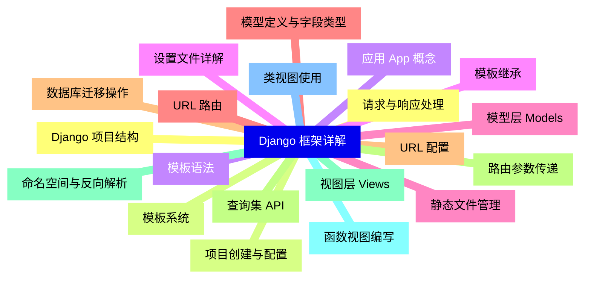

{}

### 5 Flask 框架详解{#5}

{}
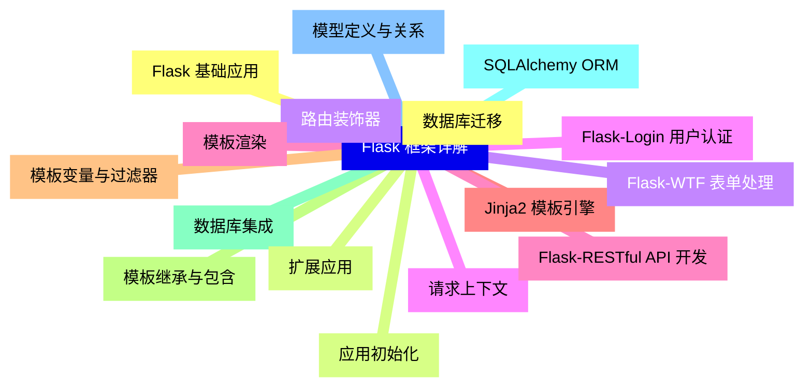

<--->
{}
{}
{}
{}
{}
{}
{}
{}
{}
{}
{}
{}
{}
{}
{}
{}
{}
{}
{}
{}
{}
{}
{}
{}
{}
{}
{}
{}
{}
{}
{}
{}
{}

### 6 数据库与 ORM{#6}

{}
{}
{}
{}
{}
{}
{}
{}
{}
{}
{}
{}
{}
{}
{}
{}
{}
{}
{}
{}
{}
{}
{}
{}
{}
<--->
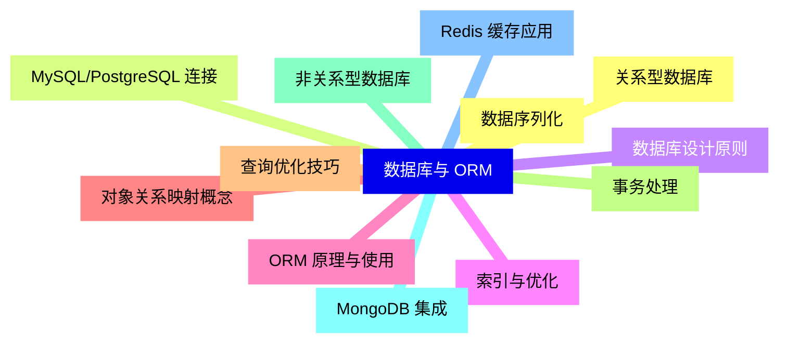

{}

### 7 前端技术集成{#7}

{}
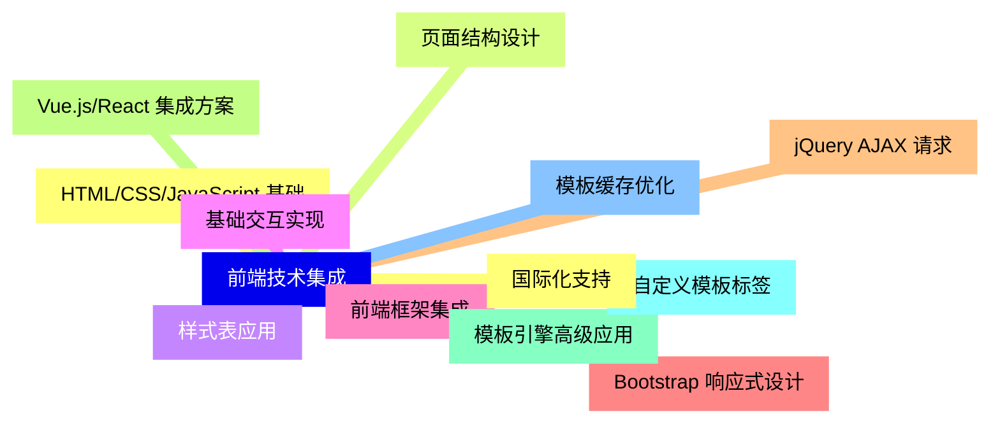

<--->
{}
{}
{}
{}
{}
{}
{}
{}
{}
{}
{}
{}
{}
{}
{}
{}
{}
{}
{}
{}
{}
{}
{}
{}
{}

### 8 用户认证与授权{#8}

{}
{}
{}
{}
{}
{}
{}
{}
{}
{}
{}
{}
{}
{}
{}
{}
{}
{}
{}
{}
{}
{}
{}
{}
{}
<--->
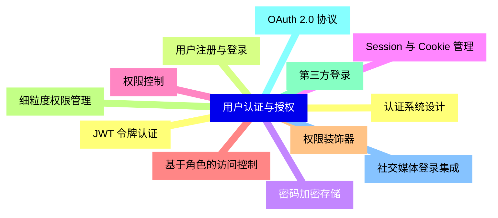

{}

### 9 RESTful API 开发{#9}

{}
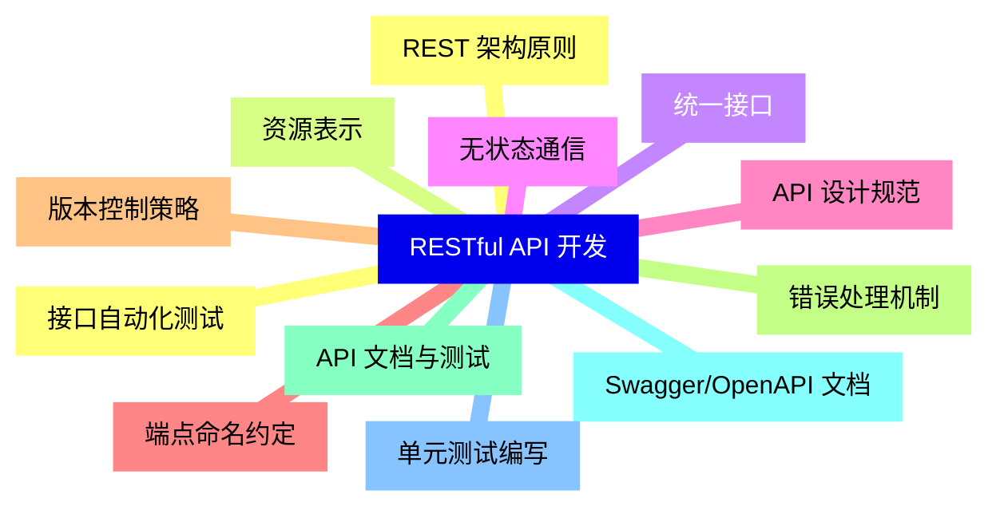

<--->
{}
{}
{}
{}
{}
{}
{}
{}
{}
{}
{}
{}
{}
{}
{}
{}
{}
{}
{}
{}
{}
{}
{}
{}
{}

### 10 部署与运维{#10}

{}
{}
{}
{}
{}
{}
{}
{}
{}
{}
{}
{}
{}
{}
{}
{}
{}
{}
{}
{}
{}
{}
{}
{}
{}
<--->
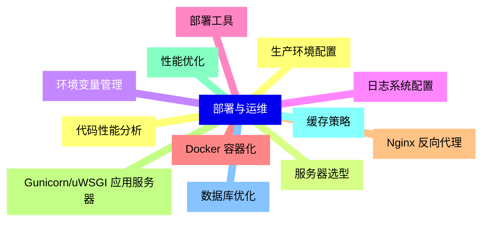

{}

### 11 测试与调试{#11}

{}
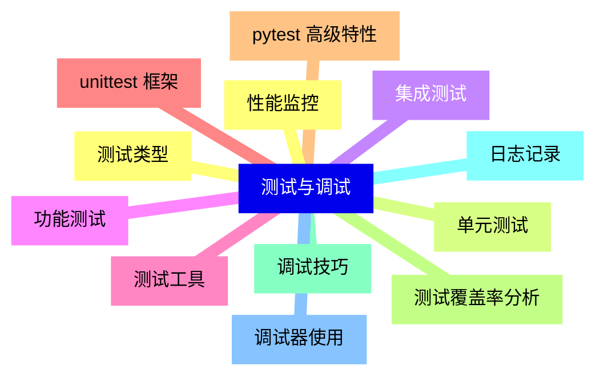

<--->
{}
{}
{}
{}
{}
{}
{}
{}
{}
{}
{}
{}
{}
{}
{}
{}
{}
{}
{}
{}
{}
{}
{}
{}
{}

### 12 项目实战{#12}

{}
{}
{}
{}
{}
{}
{}
{}
{}
{}
{}
{}
{}
{}
{}
{}
{}
{}
{}
{}
{}
{}
{}
{}
{}
<--->
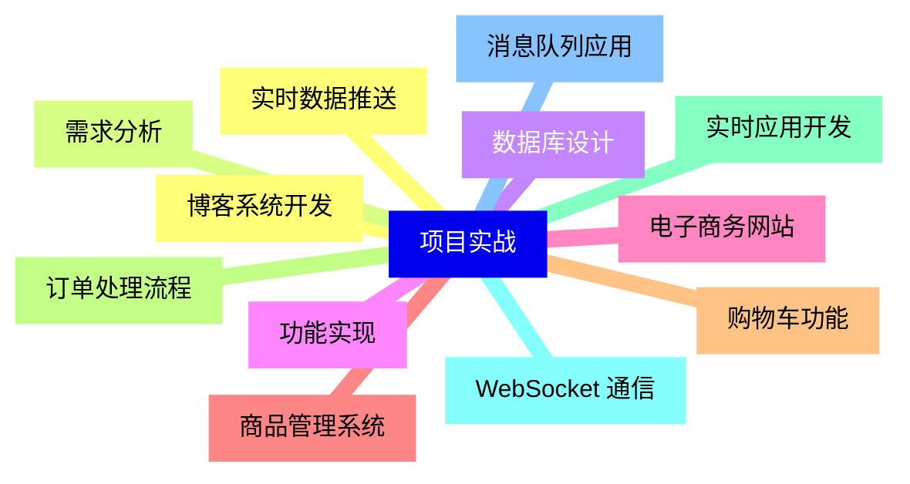

{}
