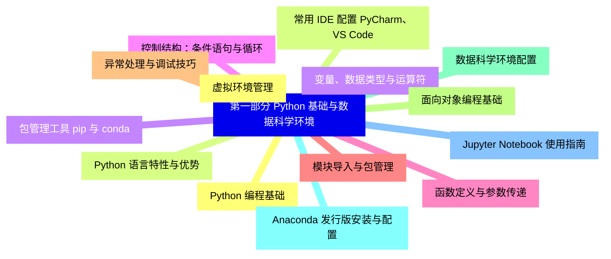
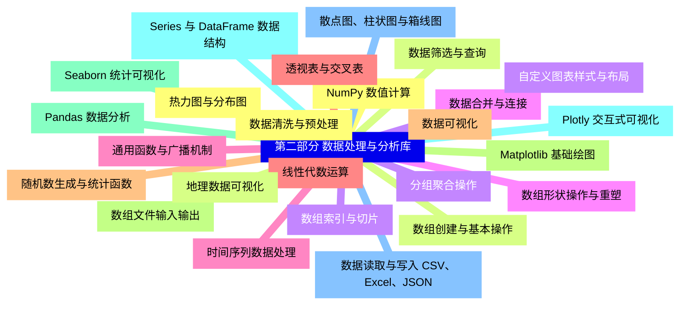
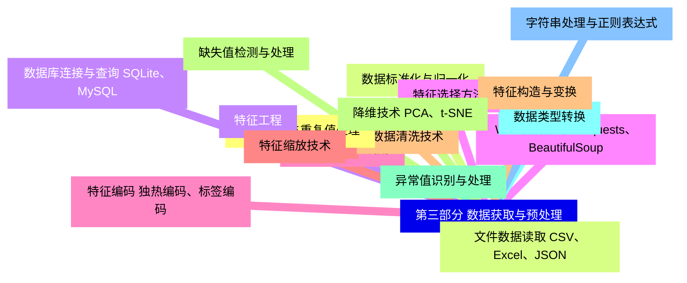
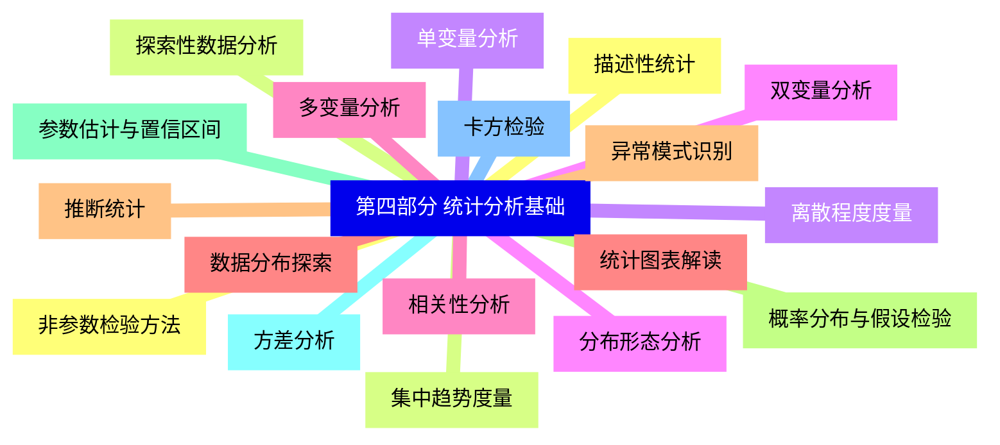
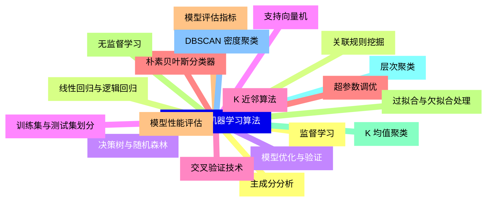
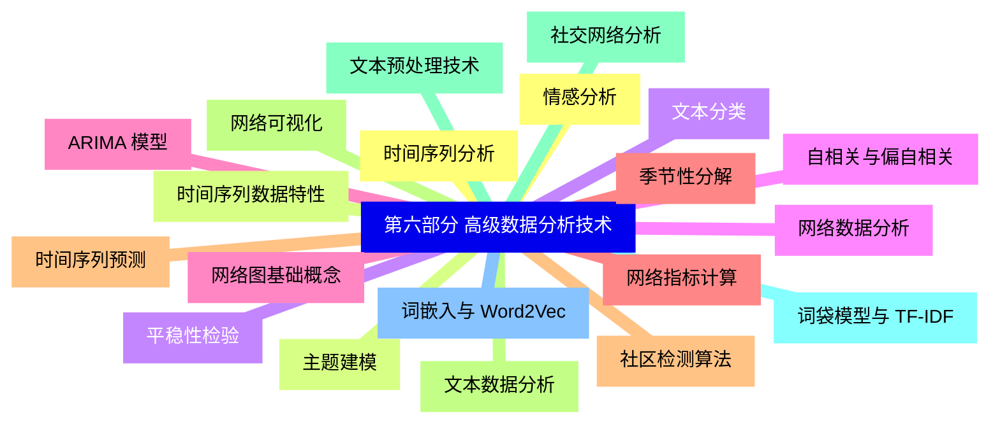
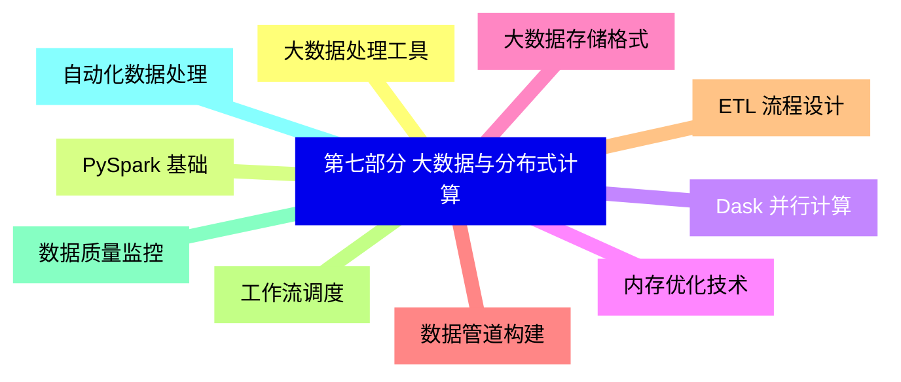
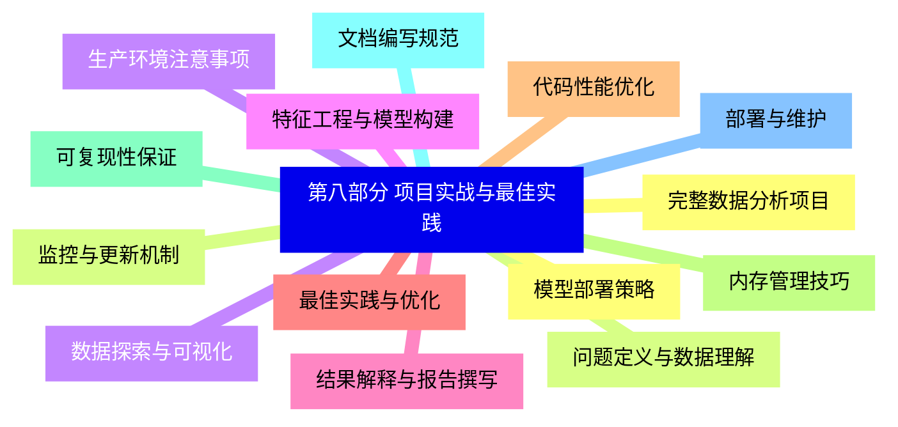


### 1 [第一部分 Python 基础与数据科学环境](#1)
#### 1.1 [Python 编程基础](#1)
#### 1.2 [Python 语言特性与优势](#1)
#### 1.3 [变量、数据类型与运算符](#1)
#### 1.4 [控制结构：条件语句与循环](#1)
#### 1.5 [函数定义与参数传递](#1)
#### 1.6 [模块导入与包管理](#1)
#### 1.7 [异常处理与调试技巧](#1)
#### 1.8 [面向对象编程基础](#1)
#### 1.9 [数据科学环境配置](#1)
#### 1.10 [Anaconda 发行版安装与配置](#1)
#### 1.11 [Jupyter Notebook 使用指南](#1)
#### 1.12 [虚拟环境管理](#1)
#### 1.13 [常用 IDE 配置 PyCharm、VS Code](#1)
#### 1.14 [包管理工具 pip 与 conda](#1)
### 2 [第二部分 数据处理与分析库](#2)
#### 2.1 [NumPy 数值计算](#2)
#### 2.2 [数组创建与基本操作](#2)
#### 2.3 [数组索引与切片](#2)
#### 2.4 [数组形状操作与重塑](#2)
#### 2.5 [通用函数与广播机制](#2)
#### 2.6 [线性代数运算](#2)
#### 2.7 [随机数生成与统计函数](#2)
#### 2.8 [数组文件输入输出](#2)
#### 2.9 [Pandas 数据分析](#2)
#### 2.10 [Series 与 DataFrame 数据结构](#2)
#### 2.11 [数据读取与写入 CSV、Excel、JSON](#2)
#### 2.12 [数据清洗与预处理](#2)
#### 2.13 [数据筛选与查询](#2)
#### 2.14 [分组聚合操作](#2)
#### 2.15 [数据合并与连接](#2)
#### 2.16 [时间序列数据处理](#2)
#### 2.17 [透视表与交叉表](#2)
#### 2.18 [数据可视化](#2)
#### 2.19 [Matplotlib 基础绘图](#2)
#### 2.20 [Seaborn 统计可视化](#2)
#### 2.21 [Plotly 交互式可视化](#2)
#### 2.22 [散点图、柱状图与箱线图](#2)
#### 2.23 [热力图与分布图](#2)
#### 2.24 [地理数据可视化](#2)
#### 2.25 [自定义图表样式与布局](#2)
### 3 [第三部分 数据获取与预处理](#3)
#### 3.1 [数据获取方法](#3)
#### 3.2 [文件数据读取 CSV、Excel、JSON](#3)
#### 3.3 [数据库连接与查询 SQLite、MySQL](#3)
#### 3.4 [Web 数据抓取 Requests、BeautifulSoup](#3)
#### 3.5 [API 数据接口调用](#3)
#### 3.6 [公开数据集获取](#3)
#### 3.7 [数据清洗技术](#3)
#### 3.8 [缺失值检测与处理](#3)
#### 3.9 [异常值识别与处理](#3)
#### 3.10 [数据类型转换](#3)
#### 3.11 [字符串处理与正则表达式](#3)
#### 3.12 [数据去重与重复值处理](#3)
#### 3.13 [数据标准化与归一化](#3)
#### 3.14 [特征工程](#3)
#### 3.15 [特征选择方法](#3)
#### 3.16 [特征编码 独热编码、标签编码](#3)
#### 3.17 [特征缩放技术](#3)
#### 3.18 [特征构造与变换](#3)
#### 3.19 [降维技术 PCA、t-SNE](#3)
### 4 [第四部分 统计分析基础](#4)
#### 4.1 [描述性统计](#4)
#### 4.2 [集中趋势度量](#4)
#### 4.3 [离散程度度量](#4)
#### 4.4 [分布形态分析](#4)
#### 4.5 [相关性分析](#4)
#### 4.6 [统计图表解读](#4)
#### 4.7 [推断统计](#4)
#### 4.8 [概率分布与假设检验](#4)
#### 4.9 [参数估计与置信区间](#4)
#### 4.10 [方差分析](#4)
#### 4.11 [卡方检验](#4)
#### 4.12 [非参数检验方法](#4)
#### 4.13 [探索性数据分析](#4)
#### 4.14 [单变量分析](#4)
#### 4.15 [双变量分析](#4)
#### 4.16 [多变量分析](#4)
#### 4.17 [数据分布探索](#4)
#### 4.18 [异常模式识别](#4)
### 5 [第五部分 机器学习算法](#5)
#### 5.1 [监督学习](#5)
#### 5.2 [线性回归与逻辑回归](#5)
#### 5.3 [决策树与随机森林](#5)
#### 5.4 [支持向量机](#5)
#### 5.5 [K 近邻算法](#5)
#### 5.6 [朴素贝叶斯分类器](#5)
#### 5.7 [模型评估指标](#5)
#### 5.8 [无监督学习](#5)
#### 5.9 [K 均值聚类](#5)
#### 5.10 [层次聚类](#5)
#### 5.11 [DBSCAN 密度聚类](#5)
#### 5.12 [主成分分析](#5)
#### 5.13 [关联规则挖掘](#5)
#### 5.14 [模型优化与验证](#5)
#### 5.15 [训练集与测试集划分](#5)
#### 5.16 [交叉验证技术](#5)
#### 5.17 [超参数调优](#5)
#### 5.18 [模型性能评估](#5)
#### 5.19 [过拟合与欠拟合处理](#5)
### 6 [第六部分 高级数据分析技术](#6)
#### 6.1 [时间序列分析](#6)
#### 6.2 [时间序列数据特性](#6)
#### 6.3 [平稳性检验](#6)
#### 6.4 [自相关与偏自相关](#6)
#### 6.5 [ARIMA 模型](#6)
#### 6.6 [季节性分解](#6)
#### 6.7 [时间序列预测](#6)
#### 6.8 [文本数据分析](#6)
#### 6.9 [文本预处理技术](#6)
#### 6.10 [词袋模型与 TF-IDF](#6)
#### 6.11 [词嵌入与 Word2Vec](#6)
#### 6.12 [情感分析](#6)
#### 6.13 [主题建模](#6)
#### 6.14 [文本分类](#6)
#### 6.15 [网络数据分析](#6)
#### 6.16 [网络图基础概念](#6)
#### 6.17 [网络指标计算](#6)
#### 6.18 [社区检测算法](#6)
#### 6.19 [网络可视化](#6)
#### 6.20 [社交网络分析](#6)
### 7 [第七部分 大数据与分布式计算](#7)
#### 7.1 [大数据处理工具](#7)
#### 7.2 [PySpark 基础](#7)
#### 7.3 [Dask 并行计算](#7)
#### 7.4 [内存优化技术](#7)
#### 7.5 [大数据存储格式](#7)
#### 7.6 [数据管道构建](#7)
#### 7.7 [ETL 流程设计](#7)
#### 7.8 [工作流调度](#7)
#### 7.9 [数据质量监控](#7)
#### 7.10 [自动化数据处理](#7)
### 8 [第八部分 项目实战与最佳实践](#8)
#### 8.1 [完整数据分析项目](#8)
#### 8.2 [问题定义与数据理解](#8)
#### 8.3 [数据探索与可视化](#8)
#### 8.4 [特征工程与模型构建](#8)
#### 8.5 [结果解释与报告撰写](#8)
#### 8.6 [最佳实践与优化](#8)
#### 8.7 [代码性能优化](#8)
#### 8.8 [内存管理技巧](#8)
#### 8.9 [可复现性保证](#8)
#### 8.10 [文档编写规范](#8)
#### 8.11 [部署与维护](#8)
#### 8.12 [模型部署策略](#8)
#### 8.13 [监控与更新机制](#8)
#### 8.14 [生产环境注意事项](#8)




### 1 第一部分 Python 基础与数据科学环境

---
### 1 第一部分 Python 基础与数据科学环境
___
#### 1.1 Python 编程基础
___
#### 1.2 Python 语言特性与优势
___
#### 1.3 变量、数据类型与运算符
___
#### 1.4 控制结构：条件语句与循环
___
#### 1.5 函数定义与参数传递
___
#### 1.6 模块导入与包管理
___
#### 1.7 异常处理与调试技巧
___
#### 1.8 面向对象编程基础
___
#### 1.9 数据科学环境配置
___
#### 1.10 Anaconda 发行版安装与配置
___
#### 1.11 Jupyter Notebook 使用指南
___
#### 1.12 虚拟环境管理
___
#### 1.13 常用 IDE 配置 PyCharm、VS Code
___
#### 1.14 包管理工具 pip 与 conda
### 2 第二部分 数据处理与分析库

---
### 2 第二部分 数据处理与分析库
___
#### 2.1 NumPy 数值计算
___
#### 2.2 数组创建与基本操作
___
#### 2.3 数组索引与切片
___
#### 2.4 数组形状操作与重塑
___
#### 2.5 通用函数与广播机制
___
#### 2.6 线性代数运算
___
#### 2.7 随机数生成与统计函数
___
#### 2.8 数组文件输入输出
___
#### 2.9 Pandas 数据分析
___
#### 2.10 Series 与 DataFrame 数据结构
___
#### 2.11 数据读取与写入 CSV、Excel、JSON
___
#### 2.12 数据清洗与预处理
___
#### 2.13 数据筛选与查询
___
#### 2.14 分组聚合操作
___
#### 2.15 数据合并与连接
___
#### 2.16 时间序列数据处理
___
#### 2.17 透视表与交叉表
___
#### 2.18 数据可视化
___
#### 2.19 Matplotlib 基础绘图
___
#### 2.20 Seaborn 统计可视化
___
#### 2.21 Plotly 交互式可视化
___
#### 2.22 散点图、柱状图与箱线图
___
#### 2.23 热力图与分布图
___
#### 2.24 地理数据可视化
___
#### 2.25 自定义图表样式与布局
### 3 第三部分 数据获取与预处理

---
### 3 第三部分 数据获取与预处理
___
#### 3.1 数据获取方法
___
#### 3.2 文件数据读取 CSV、Excel、JSON
___
#### 3.3 数据库连接与查询 SQLite、MySQL
___
#### 3.4 Web 数据抓取 Requests、BeautifulSoup
___
#### 3.5 API 数据接口调用
___
#### 3.6 公开数据集获取
___
#### 3.7 数据清洗技术
___
#### 3.8 缺失值检测与处理
___
#### 3.9 异常值识别与处理
___
#### 3.10 数据类型转换
___
#### 3.11 字符串处理与正则表达式
___
#### 3.12 数据去重与重复值处理
___
#### 3.13 数据标准化与归一化
___
#### 3.14 特征工程
___
#### 3.15 特征选择方法
___
#### 3.16 特征编码 独热编码、标签编码
___
#### 3.17 特征缩放技术
___
#### 3.18 特征构造与变换
___
#### 3.19 降维技术 PCA、t-SNE
### 4 第四部分 统计分析基础

---
### 4 第四部分 统计分析基础
___
#### 4.1 描述性统计
___
#### 4.2 集中趋势度量
___
#### 4.3 离散程度度量
___
#### 4.4 分布形态分析
___
#### 4.5 相关性分析
___
#### 4.6 统计图表解读
___
#### 4.7 推断统计
___
#### 4.8 概率分布与假设检验
___
#### 4.9 参数估计与置信区间
___
#### 4.10 方差分析
___
#### 4.11 卡方检验
___
#### 4.12 非参数检验方法
___
#### 4.13 探索性数据分析
___
#### 4.14 单变量分析
___
#### 4.15 双变量分析
___
#### 4.16 多变量分析
___
#### 4.17 数据分布探索
___
#### 4.18 异常模式识别
### 5 第五部分 机器学习算法

---
### 5 第五部分 机器学习算法
___
#### 5.1 监督学习
___
#### 5.2 线性回归与逻辑回归
___
#### 5.3 决策树与随机森林
___
#### 5.4 支持向量机
___
#### 5.5 K 近邻算法
___
#### 5.6 朴素贝叶斯分类器
___
#### 5.7 模型评估指标
___
#### 5.8 无监督学习
___
#### 5.9 K 均值聚类
___
#### 5.10 层次聚类
___
#### 5.11 DBSCAN 密度聚类
___
#### 5.12 主成分分析
___
#### 5.13 关联规则挖掘
___
#### 5.14 模型优化与验证
___
#### 5.15 训练集与测试集划分
___
#### 5.16 交叉验证技术
___
#### 5.17 超参数调优
___
#### 5.18 模型性能评估
___
#### 5.19 过拟合与欠拟合处理
### 6 第六部分 高级数据分析技术

---
### 6 第六部分 高级数据分析技术
___
#### 6.1 时间序列分析
___
#### 6.2 时间序列数据特性
___
#### 6.3 平稳性检验
___
#### 6.4 自相关与偏自相关
___
#### 6.5 ARIMA 模型
___
#### 6.6 季节性分解
___
#### 6.7 时间序列预测
___
#### 6.8 文本数据分析
___
#### 6.9 文本预处理技术
___
#### 6.10 词袋模型与 TF-IDF
___
#### 6.11 词嵌入与 Word2Vec
___
#### 6.12 情感分析
___
#### 6.13 主题建模
___
#### 6.14 文本分类
___
#### 6.15 网络数据分析
___
#### 6.16 网络图基础概念
___
#### 6.17 网络指标计算
___
#### 6.18 社区检测算法
___
#### 6.19 网络可视化
___
#### 6.20 社交网络分析
### 7 第七部分 大数据与分布式计算

---
### 7 第七部分 大数据与分布式计算
___
#### 7.1 大数据处理工具
___
#### 7.2 PySpark 基础
___
#### 7.3 Dask 并行计算
___
#### 7.4 内存优化技术
___
#### 7.5 大数据存储格式
___
#### 7.6 数据管道构建
___
#### 7.7 ETL 流程设计
___
#### 7.8 工作流调度
___
#### 7.9 数据质量监控
___
#### 7.10 自动化数据处理
### 8 第八部分 项目实战与最佳实践

---
### 8 第八部分 项目实战与最佳实践
___
#### 8.1 完整数据分析项目
___
#### 8.2 问题定义与数据理解
___
#### 8.3 数据探索与可视化
___
#### 8.4 特征工程与模型构建
___
#### 8.5 结果解释与报告撰写
___
#### 8.6 最佳实践与优化
___
#### 8.7 代码性能优化
___
#### 8.8 内存管理技巧
___
#### 8.9 可复现性保证
___
#### 8.10 文档编写规范
___
#### 8.11 部署与维护
___
#### 8.12 模型部署策略
___
#### 8.13 监控与更新机制
___
#### 8.14 生产环境注意事项


### 1 第一部分 Python 基础与数据科学环境{#1}

{}

<--->
{}
{}
{}
{}
{}
{}
{}
{}
{}
{}
{}
{}
{}
{}
{}
{}
{}
{}
{}
{}
{}
{}
{}
{}
{}
{}
{}
{}
{}

### 2 第二部分 数据处理与分析库{#2}

{}
{}
{}
{}
{}
{}
{}
{}
{}
{}
{}
{}
{}
{}
{}
{}
{}
{}
{}
{}
{}
{}
{}
{}
{}
{}
{}
{}
{}
{}
{}
{}
{}
{}
{}
{}
{}
{}
{}
{}
{}
{}
{}
{}
{}
{}
{}
{}
{}
{}
{}
<--->

{}

### 3 第三部分 数据获取与预处理{#3}

{}

<--->
{}
{}
{}
{}
{}
{}
{}
{}
{}
{}
{}
{}
{}
{}
{}
{}
{}
{}
{}
{}
{}
{}
{}
{}
{}
{}
{}
{}
{}
{}
{}
{}
{}
{}
{}
{}
{}
{}
{}

### 4 第四部分 统计分析基础{#4}

{}
{}
{}
{}
{}
{}
{}
{}
{}
{}
{}
{}
{}
{}
{}
{}
{}
{}
{}
{}
{}
{}
{}
{}
{}
{}
{}
{}
{}
{}
{}
{}
{}
{}
{}
{}
{}
<--->

{}

### 5 第五部分 机器学习算法{#5}

{}

<--->
{}
{}
{}
{}
{}
{}
{}
{}
{}
{}
{}
{}
{}
{}
{}
{}
{}
{}
{}
{}
{}
{}
{}
{}
{}
{}
{}
{}
{}
{}
{}
{}
{}
{}
{}
{}
{}
{}
{}

### 6 第六部分 高级数据分析技术{#6}

{}
{}
{}
{}
{}
{}
{}
{}
{}
{}
{}
{}
{}
{}
{}
{}
{}
{}
{}
{}
{}
{}
{}
{}
{}
{}
{}
{}
{}
{}
{}
{}
{}
{}
{}
{}
{}
{}
{}
{}
{}
<--->

{}

### 7 第七部分 大数据与分布式计算{#7}

{}

<--->
{}
{}
{}
{}
{}
{}
{}
{}
{}
{}
{}
{}
{}
{}
{}
{}
{}
{}
{}
{}
{}

### 8 第八部分 项目实战与最佳实践{#8}

{}
{}
{}
{}
{}
{}
{}
{}
{}
{}
{}
{}
{}
{}
{}
{}
{}
{}
{}
{}
{}
{}
{}
{}
{}
{}
{}
{}
{}
<--->

{}
