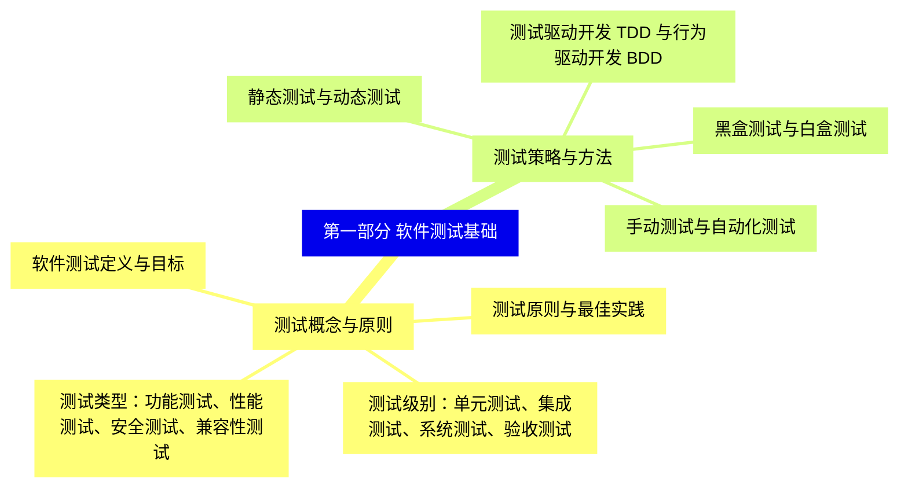
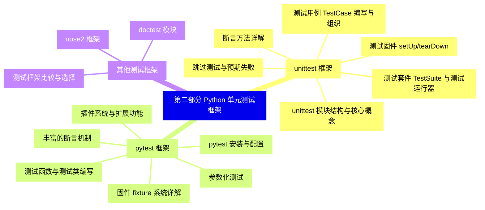
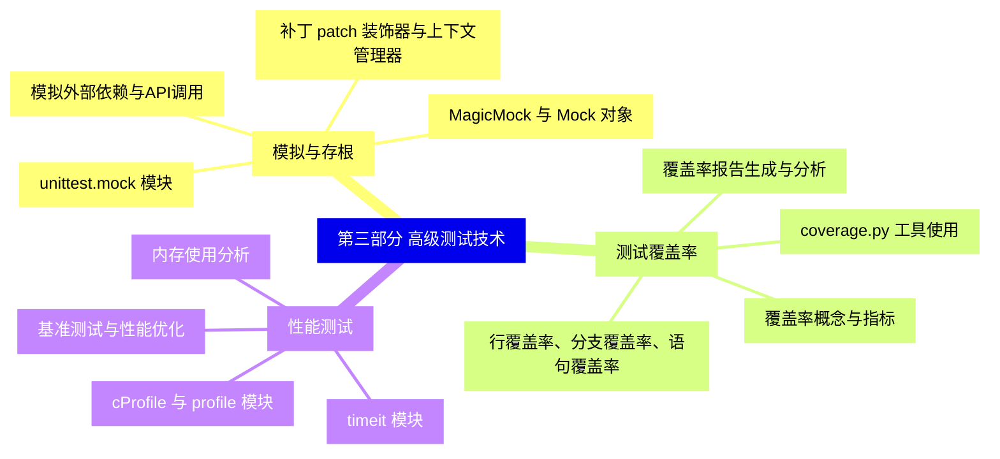
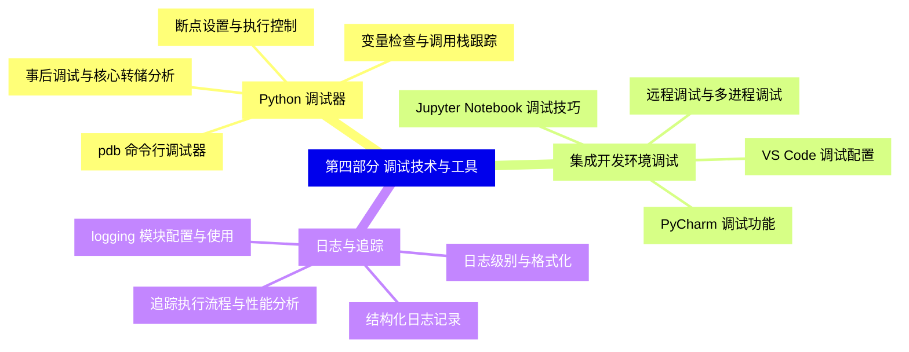
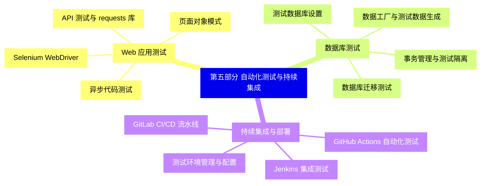
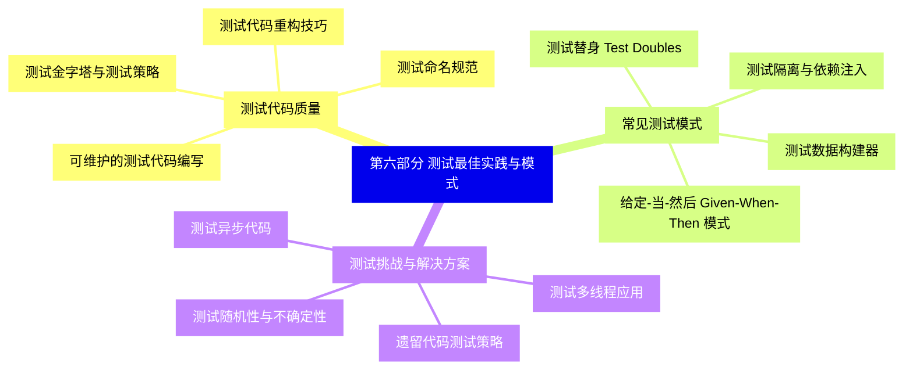


### 1 [第一部分 软件测试基础](#1)
#### 1.1 [测试概念与原则](#1)
##### 1.1.1 [软件测试定义与目标](#1)
##### 1.1.2 [测试级别：单元测试、集成测试、系统测试、验收测试](#1)
##### 1.1.3 [测试类型：功能测试、性能测试、安全测试、兼容性测试](#1)
##### 1.1.4 [测试原则与最佳实践](#1)
#### 1.2 [测试策略与方法](#1)
##### 1.2.1 [黑盒测试与白盒测试](#1)
##### 1.2.2 [静态测试与动态测试](#1)
##### 1.2.3 [手动测试与自动化测试](#1)
##### 1.2.4 [测试驱动开发 TDD 与行为驱动开发 BDD](#1)
### 2 [第二部分 Python 单元测试框架](#2)
#### 2.1 [unittest 框架](#2)
##### 2.1.1 [unittest 模块结构与核心概念](#2)
##### 2.1.2 [测试用例 TestCase 编写与组织](#2)
##### 2.1.3 [断言方法详解](#2)
##### 2.1.4 [测试固件 setUp/tearDown](#2)
##### 2.1.5 [测试套件 TestSuite 与测试运行器](#2)
##### 2.1.6 [跳过测试与预期失败](#2)
#### 2.2 [pytest 框架](#2)
##### 2.2.1 [pytest 安装与配置](#2)
##### 2.2.2 [测试函数与测试类编写](#2)
##### 2.2.3 [丰富的断言机制](#2)
##### 2.2.4 [固件 fixture 系统详解](#2)
##### 2.2.5 [参数化测试](#2)
##### 2.2.6 [插件系统与扩展功能](#2)
#### 2.3 [其他测试框架](#2)
##### 2.3.1 [doctest 模块](#2)
##### 2.3.2 [nose2 框架](#2)
##### 2.3.3 [测试框架比较与选择](#2)
### 3 [第三部分 高级测试技术](#3)
#### 3.1 [模拟与存根](#3)
##### 3.1.1 [unittest.mock 模块](#3)
##### 3.1.2 [MagicMock 与 Mock 对象](#3)
##### 3.1.3 [补丁 patch 装饰器与上下文管理器](#3)
##### 3.1.4 [模拟外部依赖与API调用](#3)
#### 3.2 [测试覆盖率](#3)
##### 3.2.1 [覆盖率概念与指标](#3)
##### 3.2.2 [coverage.py 工具使用](#3)
##### 3.2.3 [行覆盖率、分支覆盖率、语句覆盖率](#3)
##### 3.2.4 [覆盖率报告生成与分析](#3)
#### 3.3 [性能测试](#3)
##### 3.3.1 [timeit 模块](#3)
##### 3.3.2 [cProfile 与 profile 模块](#3)
##### 3.3.3 [内存使用分析](#3)
##### 3.3.4 [基准测试与性能优化](#3)
### 4 [第四部分 调试技术与工具](#4)
#### 4.1 [Python 调试器](#4)
##### 4.1.1 [pdb 命令行调试器](#4)
##### 4.1.2 [断点设置与执行控制](#4)
##### 4.1.3 [变量检查与调用栈跟踪](#4)
##### 4.1.4 [事后调试与核心转储分析](#4)
#### 4.2 [集成开发环境调试](#4)
##### 4.2.1 [PyCharm 调试功能](#4)
##### 4.2.2 [VS Code 调试配置](#4)
##### 4.2.3 [Jupyter Notebook 调试技巧](#4)
##### 4.2.4 [远程调试与多进程调试](#4)
#### 4.3 [日志与追踪](#4)
##### 4.3.1 [logging 模块配置与使用](#4)
##### 4.3.2 [日志级别与格式化](#4)
##### 4.3.3 [结构化日志记录](#4)
##### 4.3.4 [追踪执行流程与性能分析](#4)
### 5 [第五部分 自动化测试与持续集成](#5)
#### 5.1 [Web 应用测试](#5)
##### 5.1.1 [Selenium WebDriver](#5)
##### 5.1.2 [页面对象模式](#5)
##### 5.1.3 [API 测试与 requests 库](#5)
##### 5.1.4 [异步代码测试](#5)
#### 5.2 [数据库测试](#5)
##### 5.2.1 [测试数据库设置](#5)
##### 5.2.2 [事务管理与测试隔离](#5)
##### 5.2.3 [数据库迁移测试](#5)
##### 5.2.4 [数据工厂与测试数据生成](#5)
#### 5.3 [持续集成与部署](#5)
##### 5.3.1 [Jenkins 集成测试](#5)
##### 5.3.2 [GitHub Actions 自动化测试](#5)
##### 5.3.3 [GitLab CI/CD 流水线](#5)
##### 5.3.4 [测试环境管理与配置](#5)
### 6 [第六部分 测试最佳实践与模式](#6)
#### 6.1 [测试代码质量](#6)
##### 6.1.1 [可维护的测试代码编写](#6)
##### 6.1.2 [测试命名规范](#6)
##### 6.1.3 [测试代码重构技巧](#6)
##### 6.1.4 [测试金字塔与测试策略](#6)
#### 6.2 [常见测试模式](#6)
##### 6.2.1 [测试替身 Test Doubles](#6)
##### 6.2.2 [测试数据构建器](#6)
##### 6.2.3 [给定-当-然后 Given-When-Then 模式](#6)
##### 6.2.4 [测试隔离与依赖注入](#6)
#### 6.3 [测试挑战与解决方案](#6)
##### 6.3.1 [测试异步代码](#6)
##### 6.3.2 [测试多线程应用](#6)
##### 6.3.3 [测试随机性与不确定性](#6)
##### 6.3.4 [遗留代码测试策略](#6)




### 1 第一部分 软件测试基础

---
### 1 第一部分 软件测试基础
___
#### 1.1 测试概念与原则
___
##### 1.1.1 软件测试定义与目标
___
##### 1.1.2 测试级别：单元测试、集成测试、系统测试、验收测试
___
##### 1.1.3 测试类型：功能测试、性能测试、安全测试、兼容性测试
___
##### 1.1.4 测试原则与最佳实践
___
#### 1.2 测试策略与方法
___
##### 1.2.1 黑盒测试与白盒测试
___
##### 1.2.2 静态测试与动态测试
___
##### 1.2.3 手动测试与自动化测试
___
##### 1.2.4 测试驱动开发 TDD 与行为驱动开发 BDD
### 2 第二部分 Python 单元测试框架

---
### 2 第二部分 Python 单元测试框架
___
#### 2.1 unittest 框架
___
##### 2.1.1 unittest 模块结构与核心概念
___
##### 2.1.2 测试用例 TestCase 编写与组织
___
##### 2.1.3 断言方法详解
___
##### 2.1.4 测试固件 setUp/tearDown
___
##### 2.1.5 测试套件 TestSuite 与测试运行器
___
##### 2.1.6 跳过测试与预期失败
___
#### 2.2 pytest 框架
___
##### 2.2.1 pytest 安装与配置
___
##### 2.2.2 测试函数与测试类编写
___
##### 2.2.3 丰富的断言机制
___
##### 2.2.4 固件 fixture 系统详解
___
##### 2.2.5 参数化测试
___
##### 2.2.6 插件系统与扩展功能
___
#### 2.3 其他测试框架
___
##### 2.3.1 doctest 模块
___
##### 2.3.2 nose2 框架
___
##### 2.3.3 测试框架比较与选择
### 3 第三部分 高级测试技术

---
### 3 第三部分 高级测试技术
___
#### 3.1 模拟与存根
___
##### 3.1.1 unittest.mock 模块
___
##### 3.1.2 MagicMock 与 Mock 对象
___
##### 3.1.3 补丁 patch 装饰器与上下文管理器
___
##### 3.1.4 模拟外部依赖与API调用
___
#### 3.2 测试覆盖率
___
##### 3.2.1 覆盖率概念与指标
___
##### 3.2.2 coverage.py 工具使用
___
##### 3.2.3 行覆盖率、分支覆盖率、语句覆盖率
___
##### 3.2.4 覆盖率报告生成与分析
___
#### 3.3 性能测试
___
##### 3.3.1 timeit 模块
___
##### 3.3.2 cProfile 与 profile 模块
___
##### 3.3.3 内存使用分析
___
##### 3.3.4 基准测试与性能优化
### 4 第四部分 调试技术与工具

---
### 4 第四部分 调试技术与工具
___
#### 4.1 Python 调试器
___
##### 4.1.1 pdb 命令行调试器
___
##### 4.1.2 断点设置与执行控制
___
##### 4.1.3 变量检查与调用栈跟踪
___
##### 4.1.4 事后调试与核心转储分析
___
#### 4.2 集成开发环境调试
___
##### 4.2.1 PyCharm 调试功能
___
##### 4.2.2 VS Code 调试配置
___
##### 4.2.3 Jupyter Notebook 调试技巧
___
##### 4.2.4 远程调试与多进程调试
___
#### 4.3 日志与追踪
___
##### 4.3.1 logging 模块配置与使用
___
##### 4.3.2 日志级别与格式化
___
##### 4.3.3 结构化日志记录
___
##### 4.3.4 追踪执行流程与性能分析
### 5 第五部分 自动化测试与持续集成

---
### 5 第五部分 自动化测试与持续集成
___
#### 5.1 Web 应用测试
___
##### 5.1.1 Selenium WebDriver
___
##### 5.1.2 页面对象模式
___
##### 5.1.3 API 测试与 requests 库
___
##### 5.1.4 异步代码测试
___
#### 5.2 数据库测试
___
##### 5.2.1 测试数据库设置
___
##### 5.2.2 事务管理与测试隔离
___
##### 5.2.3 数据库迁移测试
___
##### 5.2.4 数据工厂与测试数据生成
___
#### 5.3 持续集成与部署
___
##### 5.3.1 Jenkins 集成测试
___
##### 5.3.2 GitHub Actions 自动化测试
___
##### 5.3.3 GitLab CI/CD 流水线
___
##### 5.3.4 测试环境管理与配置
### 6 第六部分 测试最佳实践与模式

---
### 6 第六部分 测试最佳实践与模式
___
#### 6.1 测试代码质量
___
##### 6.1.1 可维护的测试代码编写
___
##### 6.1.2 测试命名规范
___
##### 6.1.3 测试代码重构技巧
___
##### 6.1.4 测试金字塔与测试策略
___
#### 6.2 常见测试模式
___
##### 6.2.1 测试替身 Test Doubles
___
##### 6.2.2 测试数据构建器
___
##### 6.2.3 给定-当-然后 Given-When-Then 模式
___
##### 6.2.4 测试隔离与依赖注入
___
#### 6.3 测试挑战与解决方案
___
##### 6.3.1 测试异步代码
___
##### 6.3.2 测试多线程应用
___
##### 6.3.3 测试随机性与不确定性
___
##### 6.3.4 遗留代码测试策略


### 1 第一部分 软件测试基础{#1}

{}

<--->
{}
{}
{}
{}
{}
{}
{}
{}
{}
{}
{}
{}
{}
{}
{}
{}
{}
{}
{}
{}
{}

### 2 第二部分 Python 单元测试框架{#2}

{}
{}
{}
{}
{}
{}
{}
{}
{}
{}
{}
{}
{}
{}
{}
{}
{}
{}
{}
{}
{}
{}
{}
{}
{}
{}
{}
{}
{}
{}
{}
{}
{}
{}
{}
{}
{}
<--->

{}

### 3 第三部分 高级测试技术{#3}

{}

<--->
{}
{}
{}
{}
{}
{}
{}
{}
{}
{}
{}
{}
{}
{}
{}
{}
{}
{}
{}
{}
{}
{}
{}
{}
{}
{}
{}
{}
{}
{}
{}

### 4 第四部分 调试技术与工具{#4}

{}
{}
{}
{}
{}
{}
{}
{}
{}
{}
{}
{}
{}
{}
{}
{}
{}
{}
{}
{}
{}
{}
{}
{}
{}
{}
{}
{}
{}
{}
{}
<--->

{}

### 5 第五部分 自动化测试与持续集成{#5}

{}

<--->
{}
{}
{}
{}
{}
{}
{}
{}
{}
{}
{}
{}
{}
{}
{}
{}
{}
{}
{}
{}
{}
{}
{}
{}
{}
{}
{}
{}
{}
{}
{}

### 6 第六部分 测试最佳实践与模式{#6}

{}
{}
{}
{}
{}
{}
{}
{}
{}
{}
{}
{}
{}
{}
{}
{}
{}
{}
{}
{}
{}
{}
{}
{}
{}
{}
{}
{}
{}
{}
{}
<--->

{}
