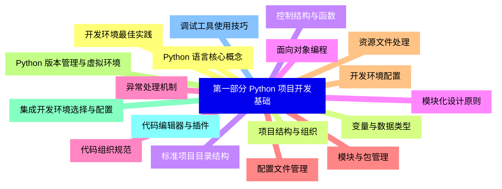
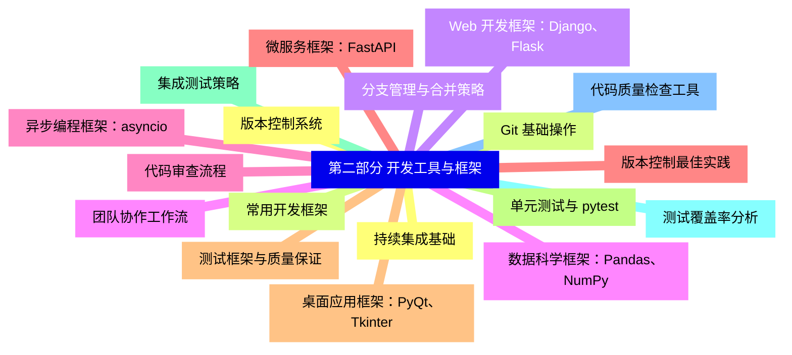
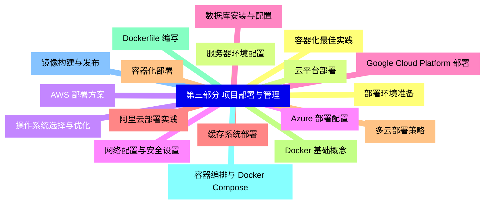
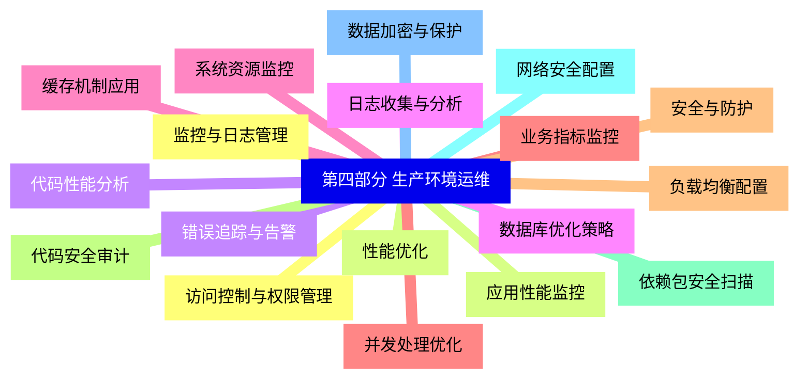
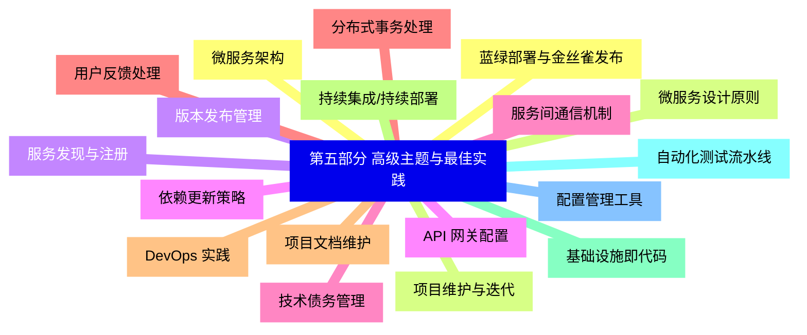


### 1 [第一部分 Python 项目开发基础](#1)
#### 1.1 [Python 语言核心概念](#1)
#### 1.2 [变量与数据类型](#1)
#### 1.3 [控制结构与函数](#1)
#### 1.4 [面向对象编程](#1)
#### 1.5 [异常处理机制](#1)
#### 1.6 [模块与包管理](#1)
#### 1.7 [开发环境配置](#1)
#### 1.8 [Python 版本管理与虚拟环境](#1)
#### 1.9 [集成开发环境选择与配置](#1)
#### 1.10 [代码编辑器与插件](#1)
#### 1.11 [调试工具使用技巧](#1)
#### 1.12 [开发环境最佳实践](#1)
#### 1.13 [项目结构与组织](#1)
#### 1.14 [标准项目目录结构](#1)
#### 1.15 [模块化设计原则](#1)
#### 1.16 [代码组织规范](#1)
#### 1.17 [配置文件管理](#1)
#### 1.18 [资源文件处理](#1)
### 2 [第二部分 开发工具与框架](#2)
#### 2.1 [版本控制系统](#2)
#### 2.2 [Git 基础操作](#2)
#### 2.3 [分支管理与合并策略](#2)
#### 2.4 [团队协作工作流](#2)
#### 2.5 [代码审查流程](#2)
#### 2.6 [版本控制最佳实践](#2)
#### 2.7 [测试框架与质量保证](#2)
#### 2.8 [单元测试与 pytest](#2)
#### 2.9 [集成测试策略](#2)
#### 2.10 [测试覆盖率分析](#2)
#### 2.11 [代码质量检查工具](#2)
#### 2.12 [持续集成基础](#2)
#### 2.13 [常用开发框架](#2)
#### 2.14 [Web 开发框架：Django、Flask](#2)
#### 2.15 [数据科学框架：Pandas、NumPy](#2)
#### 2.16 [异步编程框架：asyncio](#2)
#### 2.17 [微服务框架：FastAPI](#2)
#### 2.18 [桌面应用框架：PyQt、Tkinter](#2)
### 3 [第三部分 项目部署与管理](#3)
#### 3.1 [部署环境准备](#3)
#### 3.2 [服务器环境配置](#3)
#### 3.3 [操作系统选择与优化](#3)
#### 3.4 [网络配置与安全设置](#3)
#### 3.5 [数据库安装与配置](#3)
#### 3.6 [缓存系统部署](#3)
#### 3.7 [容器化部署](#3)
#### 3.8 [Docker 基础概念](#3)
#### 3.9 [Dockerfile 编写](#3)
#### 3.10 [容器编排与 Docker Compose](#3)
#### 3.11 [镜像构建与发布](#3)
#### 3.12 [容器化最佳实践](#3)
#### 3.13 [云平台部署](#3)
#### 3.14 [AWS 部署方案](#3)
#### 3.15 [Azure 部署配置](#3)
#### 3.16 [Google Cloud Platform 部署](#3)
#### 3.17 [阿里云部署实践](#3)
#### 3.18 [多云部署策略](#3)
### 4 [第四部分 生产环境运维](#4)
#### 4.1 [监控与日志管理](#4)
#### 4.2 [应用性能监控](#4)
#### 4.3 [错误追踪与告警](#4)
#### 4.4 [日志收集与分析](#4)
#### 4.5 [系统资源监控](#4)
#### 4.6 [业务指标监控](#4)
#### 4.7 [安全与防护](#4)
#### 4.8 [代码安全审计](#4)
#### 4.9 [依赖包安全扫描](#4)
#### 4.10 [网络安全配置](#4)
#### 4.11 [数据加密与保护](#4)
#### 4.12 [访问控制与权限管理](#4)
#### 4.13 [性能优化](#4)
#### 4.14 [代码性能分析](#4)
#### 4.15 [数据库优化策略](#4)
#### 4.16 [缓存机制应用](#4)
#### 4.17 [并发处理优化](#4)
#### 4.18 [负载均衡配置](#4)
### 5 [第五部分 高级主题与最佳实践](#5)
#### 5.1 [微服务架构](#5)
#### 5.2 [微服务设计原则](#5)
#### 5.3 [服务发现与注册](#5)
#### 5.4 [API 网关配置](#5)
#### 5.5 [服务间通信机制](#5)
#### 5.6 [分布式事务处理](#5)
#### 5.7 [DevOps 实践](#5)
#### 5.8 [持续集成/持续部署](#5)
#### 5.9 [基础设施即代码](#5)
#### 5.10 [自动化测试流水线](#5)
#### 5.11 [配置管理工具](#5)
#### 5.12 [蓝绿部署与金丝雀发布](#5)
#### 5.13 [项目维护与迭代](#5)
#### 5.14 [版本发布管理](#5)
#### 5.15 [依赖更新策略](#5)
#### 5.16 [技术债务管理](#5)
#### 5.17 [用户反馈处理](#5)
#### 5.18 [项目文档维护](#5)




### 1 第一部分 Python 项目开发基础

---
### 1 第一部分 Python 项目开发基础
___
#### 1.1 Python 语言核心概念
___
#### 1.2 变量与数据类型
___
#### 1.3 控制结构与函数
___
#### 1.4 面向对象编程
___
#### 1.5 异常处理机制
___
#### 1.6 模块与包管理
___
#### 1.7 开发环境配置
___
#### 1.8 Python 版本管理与虚拟环境
___
#### 1.9 集成开发环境选择与配置
___
#### 1.10 代码编辑器与插件
___
#### 1.11 调试工具使用技巧
___
#### 1.12 开发环境最佳实践
___
#### 1.13 项目结构与组织
___
#### 1.14 标准项目目录结构
___
#### 1.15 模块化设计原则
___
#### 1.16 代码组织规范
___
#### 1.17 配置文件管理
___
#### 1.18 资源文件处理
### 2 第二部分 开发工具与框架

---
### 2 第二部分 开发工具与框架
___
#### 2.1 版本控制系统
___
#### 2.2 Git 基础操作
___
#### 2.3 分支管理与合并策略
___
#### 2.4 团队协作工作流
___
#### 2.5 代码审查流程
___
#### 2.6 版本控制最佳实践
___
#### 2.7 测试框架与质量保证
___
#### 2.8 单元测试与 pytest
___
#### 2.9 集成测试策略
___
#### 2.10 测试覆盖率分析
___
#### 2.11 代码质量检查工具
___
#### 2.12 持续集成基础
___
#### 2.13 常用开发框架
___
#### 2.14 Web 开发框架：Django、Flask
___
#### 2.15 数据科学框架：Pandas、NumPy
___
#### 2.16 异步编程框架：asyncio
___
#### 2.17 微服务框架：FastAPI
___
#### 2.18 桌面应用框架：PyQt、Tkinter
### 3 第三部分 项目部署与管理

---
### 3 第三部分 项目部署与管理
___
#### 3.1 部署环境准备
___
#### 3.2 服务器环境配置
___
#### 3.3 操作系统选择与优化
___
#### 3.4 网络配置与安全设置
___
#### 3.5 数据库安装与配置
___
#### 3.6 缓存系统部署
___
#### 3.7 容器化部署
___
#### 3.8 Docker 基础概念
___
#### 3.9 Dockerfile 编写
___
#### 3.10 容器编排与 Docker Compose
___
#### 3.11 镜像构建与发布
___
#### 3.12 容器化最佳实践
___
#### 3.13 云平台部署
___
#### 3.14 AWS 部署方案
___
#### 3.15 Azure 部署配置
___
#### 3.16 Google Cloud Platform 部署
___
#### 3.17 阿里云部署实践
___
#### 3.18 多云部署策略
### 4 第四部分 生产环境运维

---
### 4 第四部分 生产环境运维
___
#### 4.1 监控与日志管理
___
#### 4.2 应用性能监控
___
#### 4.3 错误追踪与告警
___
#### 4.4 日志收集与分析
___
#### 4.5 系统资源监控
___
#### 4.6 业务指标监控
___
#### 4.7 安全与防护
___
#### 4.8 代码安全审计
___
#### 4.9 依赖包安全扫描
___
#### 4.10 网络安全配置
___
#### 4.11 数据加密与保护
___
#### 4.12 访问控制与权限管理
___
#### 4.13 性能优化
___
#### 4.14 代码性能分析
___
#### 4.15 数据库优化策略
___
#### 4.16 缓存机制应用
___
#### 4.17 并发处理优化
___
#### 4.18 负载均衡配置
### 5 第五部分 高级主题与最佳实践

---
### 5 第五部分 高级主题与最佳实践
___
#### 5.1 微服务架构
___
#### 5.2 微服务设计原则
___
#### 5.3 服务发现与注册
___
#### 5.4 API 网关配置
___
#### 5.5 服务间通信机制
___
#### 5.6 分布式事务处理
___
#### 5.7 DevOps 实践
___
#### 5.8 持续集成/持续部署
___
#### 5.9 基础设施即代码
___
#### 5.10 自动化测试流水线
___
#### 5.11 配置管理工具
___
#### 5.12 蓝绿部署与金丝雀发布
___
#### 5.13 项目维护与迭代
___
#### 5.14 版本发布管理
___
#### 5.15 依赖更新策略
___
#### 5.16 技术债务管理
___
#### 5.17 用户反馈处理
___
#### 5.18 项目文档维护


### 1 第一部分 Python 项目开发基础{#1}

{}

<--->
{}
{}
{}
{}
{}
{}
{}
{}
{}
{}
{}
{}
{}
{}
{}
{}
{}
{}
{}
{}
{}
{}
{}
{}
{}
{}
{}
{}
{}
{}
{}
{}
{}
{}
{}
{}
{}

### 2 第二部分 开发工具与框架{#2}

{}
{}
{}
{}
{}
{}
{}
{}
{}
{}
{}
{}
{}
{}
{}
{}
{}
{}
{}
{}
{}
{}
{}
{}
{}
{}
{}
{}
{}
{}
{}
{}
{}
{}
{}
{}
{}
<--->

{}

### 3 第三部分 项目部署与管理{#3}

{}

<--->
{}
{}
{}
{}
{}
{}
{}
{}
{}
{}
{}
{}
{}
{}
{}
{}
{}
{}
{}
{}
{}
{}
{}
{}
{}
{}
{}
{}
{}
{}
{}
{}
{}
{}
{}
{}
{}

### 4 第四部分 生产环境运维{#4}

{}
{}
{}
{}
{}
{}
{}
{}
{}
{}
{}
{}
{}
{}
{}
{}
{}
{}
{}
{}
{}
{}
{}
{}
{}
{}
{}
{}
{}
{}
{}
{}
{}
{}
{}
{}
{}
<--->

{}

### 5 第五部分 高级主题与最佳实践{#5}

{}

<--->
{}
{}
{}
{}
{}
{}
{}
{}
{}
{}
{}
{}
{}
{}
{}
{}
{}
{}
{}
{}
{}
{}
{}
{}
{}
{}
{}
{}
{}
{}
{}
{}
{}
{}
{}
{}
{}
