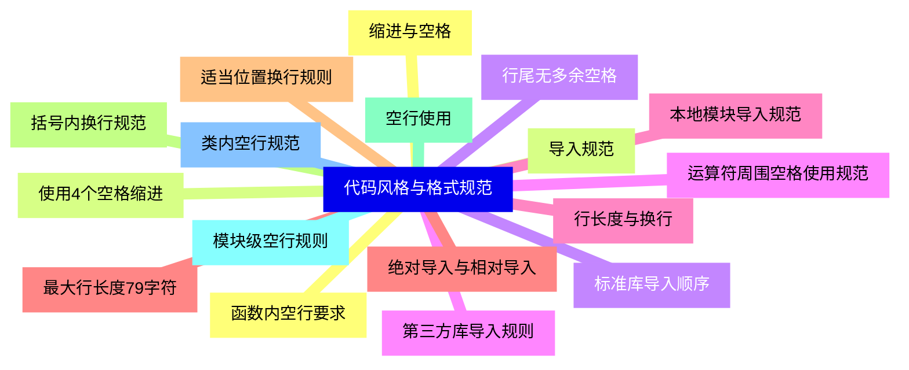
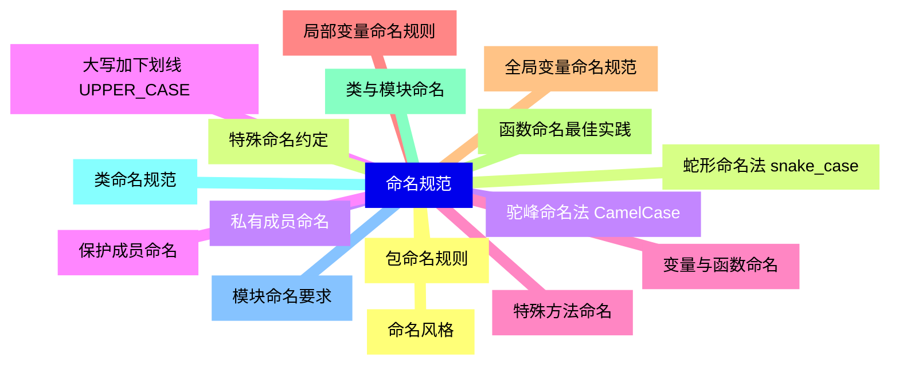
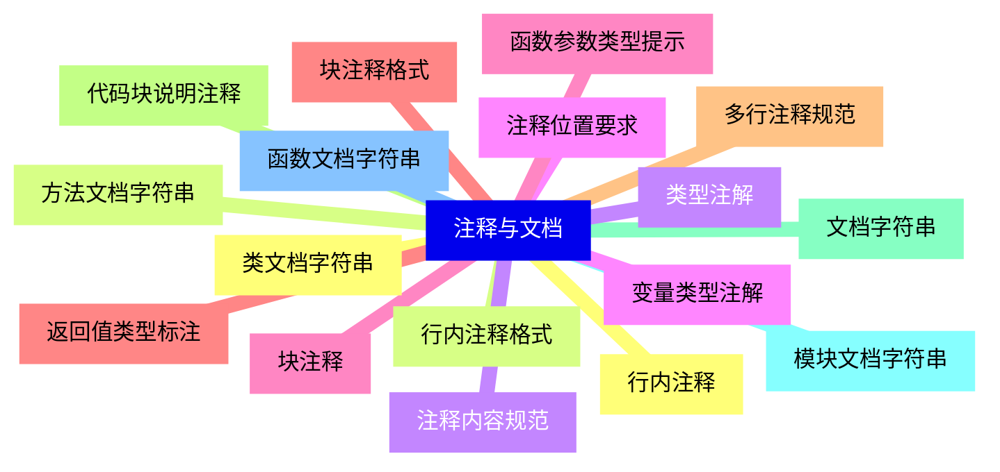
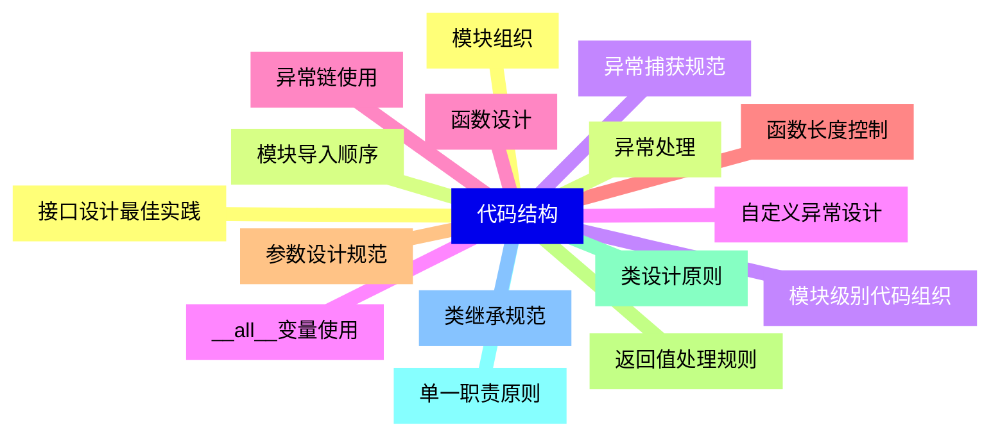
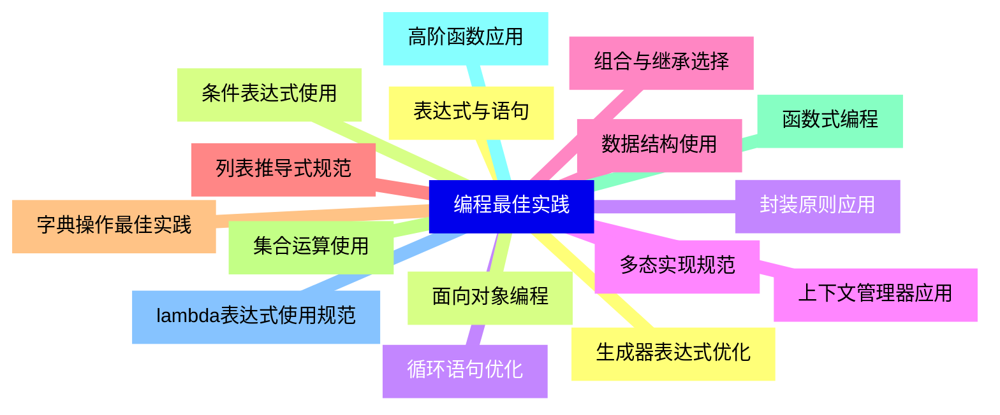
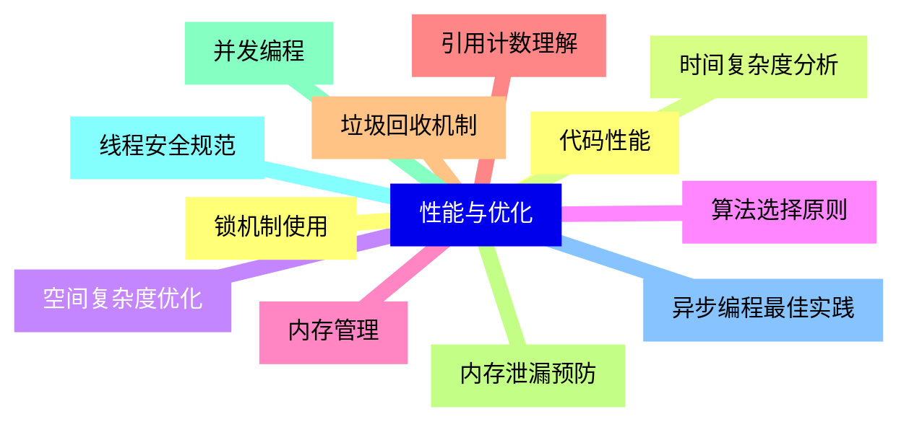
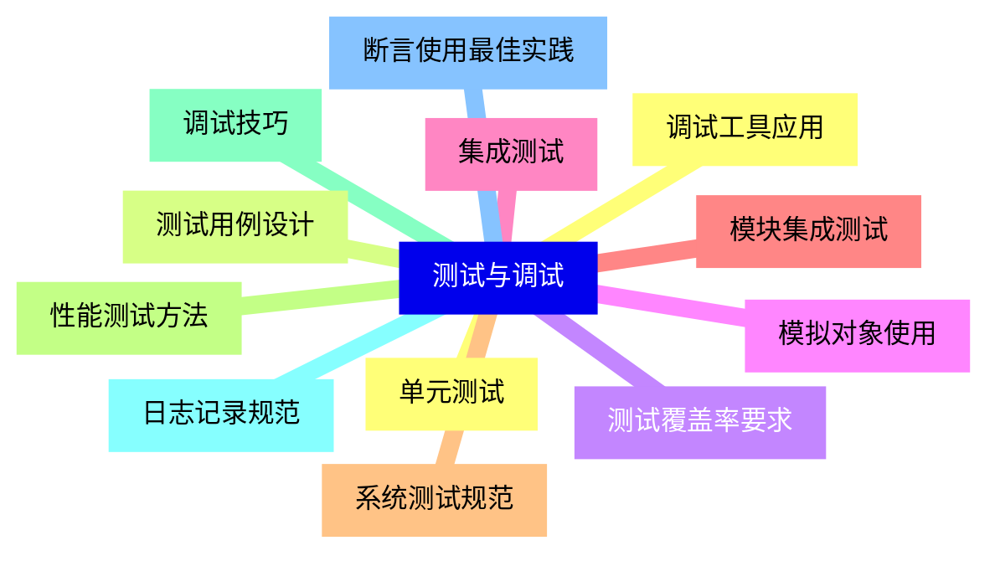
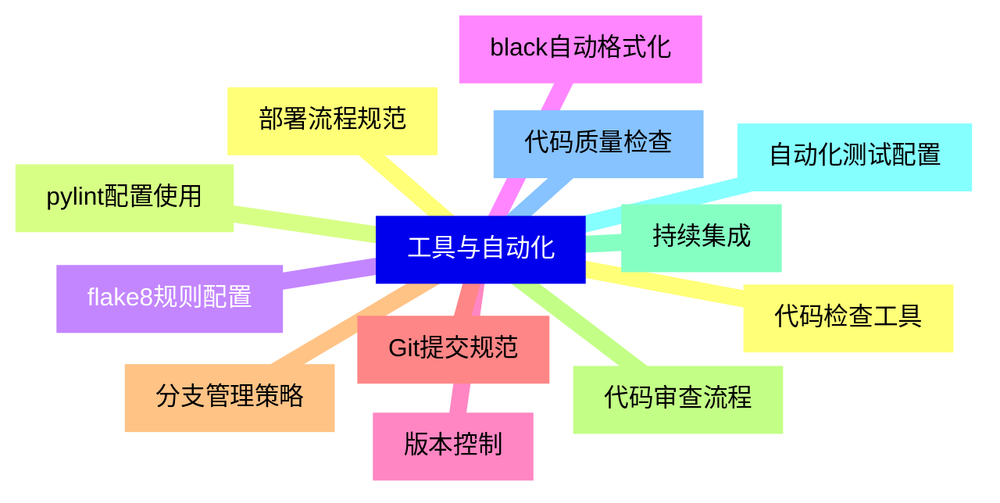
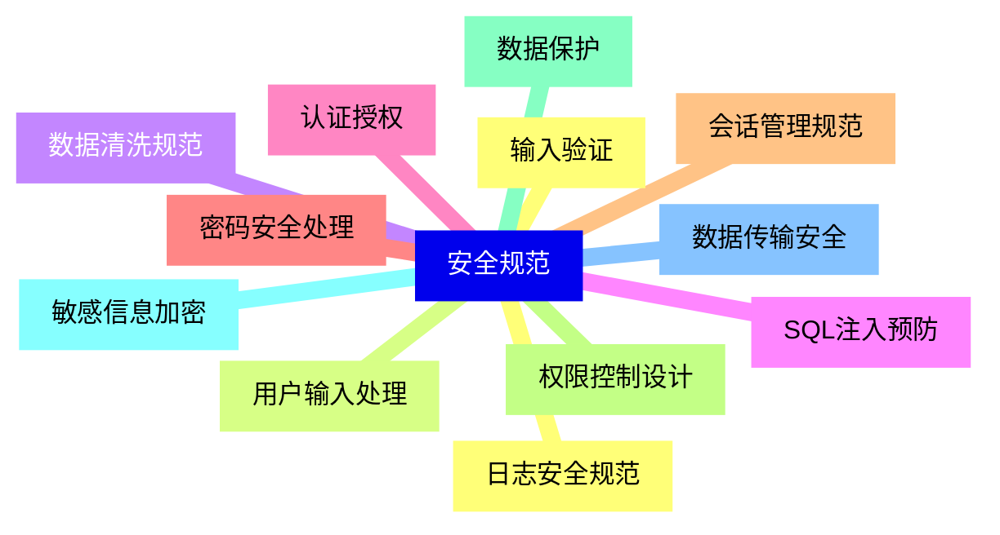
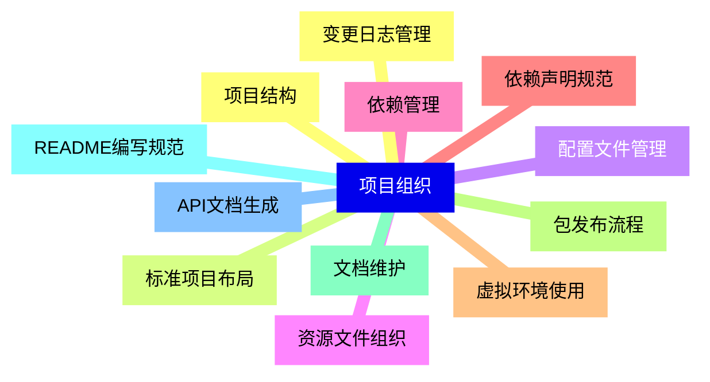


### 1 [代码风格与格式规范](#1)
#### 1.1 [缩进与空格](#1)
#### 1.2 [使用4个空格缩进](#1)
#### 1.3 [行尾无多余空格](#1)
#### 1.4 [运算符周围空格使用规范](#1)
#### 1.5 [行长度与换行](#1)
#### 1.6 [最大行长度79字符](#1)
#### 1.7 [适当位置换行规则](#1)
#### 1.8 [括号内换行规范](#1)
#### 1.9 [空行使用](#1)
#### 1.10 [模块级空行规则](#1)
#### 1.11 [类内空行规范](#1)
#### 1.12 [函数内空行要求](#1)
#### 1.13 [导入规范](#1)
#### 1.14 [标准库导入顺序](#1)
#### 1.15 [第三方库导入规则](#1)
#### 1.16 [本地模块导入规范](#1)
#### 1.17 [绝对导入与相对导入](#1)
### 2 [命名规范](#2)
#### 2.1 [命名风格](#2)
#### 2.2 [蛇形命名法 snake_case](#2)
#### 2.3 [驼峰命名法 CamelCase](#2)
#### 2.4 [大写加下划线 UPPER_CASE](#2)
#### 2.5 [变量与函数命名](#2)
#### 2.6 [局部变量命名规则](#2)
#### 2.7 [全局变量命名规范](#2)
#### 2.8 [函数命名最佳实践](#2)
#### 2.9 [类与模块命名](#2)
#### 2.10 [类命名规范](#2)
#### 2.11 [模块命名要求](#2)
#### 2.12 [包命名规则](#2)
#### 2.13 [特殊命名约定](#2)
#### 2.14 [私有成员命名](#2)
#### 2.15 [保护成员命名](#2)
#### 2.16 [特殊方法命名](#2)
### 3 [注释与文档](#3)
#### 3.1 [行内注释](#3)
#### 3.2 [行内注释格式](#3)
#### 3.3 [注释内容规范](#3)
#### 3.4 [注释位置要求](#3)
#### 3.5 [块注释](#3)
#### 3.6 [块注释格式](#3)
#### 3.7 [多行注释规范](#3)
#### 3.8 [代码块说明注释](#3)
#### 3.9 [文档字符串](#3)
#### 3.10 [模块文档字符串](#3)
#### 3.11 [函数文档字符串](#3)
#### 3.12 [类文档字符串](#3)
#### 3.13 [方法文档字符串](#3)
#### 3.14 [类型注解](#3)
#### 3.15 [变量类型注解](#3)
#### 3.16 [函数参数类型提示](#3)
#### 3.17 [返回值类型标注](#3)
### 4 [代码结构](#4)
#### 4.1 [模块组织](#4)
#### 4.2 [模块导入顺序](#4)
#### 4.3 [模块级别代码组织](#4)
#### 4.4 [__all__变量使用](#4)
#### 4.5 [函数设计](#4)
#### 4.6 [函数长度控制](#4)
#### 4.7 [参数设计规范](#4)
#### 4.8 [返回值处理规则](#4)
#### 4.9 [类设计原则](#4)
#### 4.10 [单一职责原则](#4)
#### 4.11 [类继承规范](#4)
#### 4.12 [接口设计最佳实践](#4)
#### 4.13 [异常处理](#4)
#### 4.14 [异常捕获规范](#4)
#### 4.15 [自定义异常设计](#4)
#### 4.16 [异常链使用](#4)
### 5 [编程最佳实践](#5)
#### 5.1 [表达式与语句](#5)
#### 5.2 [条件表达式使用](#5)
#### 5.3 [循环语句优化](#5)
#### 5.4 [上下文管理器应用](#5)
#### 5.5 [数据结构使用](#5)
#### 5.6 [列表推导式规范](#5)
#### 5.7 [字典操作最佳实践](#5)
#### 5.8 [集合运算使用](#5)
#### 5.9 [函数式编程](#5)
#### 5.10 [高阶函数应用](#5)
#### 5.11 [lambda表达式使用规范](#5)
#### 5.12 [生成器表达式优化](#5)
#### 5.13 [面向对象编程](#5)
#### 5.14 [封装原则应用](#5)
#### 5.15 [多态实现规范](#5)
#### 5.16 [组合与继承选择](#5)
### 6 [性能与优化](#6)
#### 6.1 [代码性能](#6)
#### 6.2 [时间复杂度分析](#6)
#### 6.3 [空间复杂度优化](#6)
#### 6.4 [算法选择原则](#6)
#### 6.5 [内存管理](#6)
#### 6.6 [引用计数理解](#6)
#### 6.7 [垃圾回收机制](#6)
#### 6.8 [内存泄漏预防](#6)
#### 6.9 [并发编程](#6)
#### 6.10 [线程安全规范](#6)
#### 6.11 [异步编程最佳实践](#6)
#### 6.12 [锁机制使用](#6)
### 7 [测试与调试](#7)
#### 7.1 [单元测试](#7)
#### 7.2 [测试用例设计](#7)
#### 7.3 [测试覆盖率要求](#7)
#### 7.4 [模拟对象使用](#7)
#### 7.5 [集成测试](#7)
#### 7.6 [模块集成测试](#7)
#### 7.7 [系统测试规范](#7)
#### 7.8 [性能测试方法](#7)
#### 7.9 [调试技巧](#7)
#### 7.10 [日志记录规范](#7)
#### 7.11 [断言使用最佳实践](#7)
#### 7.12 [调试工具应用](#7)
### 8 [工具与自动化](#8)
#### 8.1 [代码检查工具](#8)
#### 8.2 [pylint配置使用](#8)
#### 8.3 [flake8规则配置](#8)
#### 8.4 [black自动格式化](#8)
#### 8.5 [版本控制](#8)
#### 8.6 [Git提交规范](#8)
#### 8.7 [分支管理策略](#8)
#### 8.8 [代码审查流程](#8)
#### 8.9 [持续集成](#8)
#### 8.10 [自动化测试配置](#8)
#### 8.11 [代码质量检查](#8)
#### 8.12 [部署流程规范](#8)
### 9 [安全规范](#9)
#### 9.1 [输入验证](#9)
#### 9.2 [用户输入处理](#9)
#### 9.3 [数据清洗规范](#9)
#### 9.4 [SQL注入预防](#9)
#### 9.5 [认证授权](#9)
#### 9.6 [密码安全处理](#9)
#### 9.7 [会话管理规范](#9)
#### 9.8 [权限控制设计](#9)
#### 9.9 [数据保护](#9)
#### 9.10 [敏感信息加密](#9)
#### 9.11 [数据传输安全](#9)
#### 9.12 [日志安全规范](#9)
### 10 [项目组织](#10)
#### 10.1 [项目结构](#10)
#### 10.2 [标准项目布局](#10)
#### 10.3 [配置文件管理](#10)
#### 10.4 [资源文件组织](#10)
#### 10.5 [依赖管理](#10)
#### 10.6 [依赖声明规范](#10)
#### 10.7 [虚拟环境使用](#10)
#### 10.8 [包发布流程](#10)
#### 10.9 [文档维护](#10)
#### 10.10 [README编写规范](#10)
#### 10.11 [API文档生成](#10)
#### 10.12 [变更日志管理](#10)




### 1 代码风格与格式规范

---
### 1 代码风格与格式规范
___
#### 1.1 缩进与空格
___
#### 1.2 使用4个空格缩进
___
#### 1.3 行尾无多余空格
___
#### 1.4 运算符周围空格使用规范
___
#### 1.5 行长度与换行
___
#### 1.6 最大行长度79字符
___
#### 1.7 适当位置换行规则
___
#### 1.8 括号内换行规范
___
#### 1.9 空行使用
___
#### 1.10 模块级空行规则
___
#### 1.11 类内空行规范
___
#### 1.12 函数内空行要求
___
#### 1.13 导入规范
___
#### 1.14 标准库导入顺序
___
#### 1.15 第三方库导入规则
___
#### 1.16 本地模块导入规范
___
#### 1.17 绝对导入与相对导入
### 2 命名规范

---
### 2 命名规范
___
#### 2.1 命名风格
___
#### 2.2 蛇形命名法 snake_case
___
#### 2.3 驼峰命名法 CamelCase
___
#### 2.4 大写加下划线 UPPER_CASE
___
#### 2.5 变量与函数命名
___
#### 2.6 局部变量命名规则
___
#### 2.7 全局变量命名规范
___
#### 2.8 函数命名最佳实践
___
#### 2.9 类与模块命名
___
#### 2.10 类命名规范
___
#### 2.11 模块命名要求
___
#### 2.12 包命名规则
___
#### 2.13 特殊命名约定
___
#### 2.14 私有成员命名
___
#### 2.15 保护成员命名
___
#### 2.16 特殊方法命名
### 3 注释与文档

---
### 3 注释与文档
___
#### 3.1 行内注释
___
#### 3.2 行内注释格式
___
#### 3.3 注释内容规范
___
#### 3.4 注释位置要求
___
#### 3.5 块注释
___
#### 3.6 块注释格式
___
#### 3.7 多行注释规范
___
#### 3.8 代码块说明注释
___
#### 3.9 文档字符串
___
#### 3.10 模块文档字符串
___
#### 3.11 函数文档字符串
___
#### 3.12 类文档字符串
___
#### 3.13 方法文档字符串
___
#### 3.14 类型注解
___
#### 3.15 变量类型注解
___
#### 3.16 函数参数类型提示
___
#### 3.17 返回值类型标注
### 4 代码结构

---
### 4 代码结构
___
#### 4.1 模块组织
___
#### 4.2 模块导入顺序
___
#### 4.3 模块级别代码组织
___
#### 4.4 __all__变量使用
___
#### 4.5 函数设计
___
#### 4.6 函数长度控制
___
#### 4.7 参数设计规范
___
#### 4.8 返回值处理规则
___
#### 4.9 类设计原则
___
#### 4.10 单一职责原则
___
#### 4.11 类继承规范
___
#### 4.12 接口设计最佳实践
___
#### 4.13 异常处理
___
#### 4.14 异常捕获规范
___
#### 4.15 自定义异常设计
___
#### 4.16 异常链使用
### 5 编程最佳实践

---
### 5 编程最佳实践
___
#### 5.1 表达式与语句
___
#### 5.2 条件表达式使用
___
#### 5.3 循环语句优化
___
#### 5.4 上下文管理器应用
___
#### 5.5 数据结构使用
___
#### 5.6 列表推导式规范
___
#### 5.7 字典操作最佳实践
___
#### 5.8 集合运算使用
___
#### 5.9 函数式编程
___
#### 5.10 高阶函数应用
___
#### 5.11 lambda表达式使用规范
___
#### 5.12 生成器表达式优化
___
#### 5.13 面向对象编程
___
#### 5.14 封装原则应用
___
#### 5.15 多态实现规范
___
#### 5.16 组合与继承选择
### 6 性能与优化

---
### 6 性能与优化
___
#### 6.1 代码性能
___
#### 6.2 时间复杂度分析
___
#### 6.3 空间复杂度优化
___
#### 6.4 算法选择原则
___
#### 6.5 内存管理
___
#### 6.6 引用计数理解
___
#### 6.7 垃圾回收机制
___
#### 6.8 内存泄漏预防
___
#### 6.9 并发编程
___
#### 6.10 线程安全规范
___
#### 6.11 异步编程最佳实践
___
#### 6.12 锁机制使用
### 7 测试与调试

---
### 7 测试与调试
___
#### 7.1 单元测试
___
#### 7.2 测试用例设计
___
#### 7.3 测试覆盖率要求
___
#### 7.4 模拟对象使用
___
#### 7.5 集成测试
___
#### 7.6 模块集成测试
___
#### 7.7 系统测试规范
___
#### 7.8 性能测试方法
___
#### 7.9 调试技巧
___
#### 7.10 日志记录规范
___
#### 7.11 断言使用最佳实践
___
#### 7.12 调试工具应用
### 8 工具与自动化

---
### 8 工具与自动化
___
#### 8.1 代码检查工具
___
#### 8.2 pylint配置使用
___
#### 8.3 flake8规则配置
___
#### 8.4 black自动格式化
___
#### 8.5 版本控制
___
#### 8.6 Git提交规范
___
#### 8.7 分支管理策略
___
#### 8.8 代码审查流程
___
#### 8.9 持续集成
___
#### 8.10 自动化测试配置
___
#### 8.11 代码质量检查
___
#### 8.12 部署流程规范
### 9 安全规范

---
### 9 安全规范
___
#### 9.1 输入验证
___
#### 9.2 用户输入处理
___
#### 9.3 数据清洗规范
___
#### 9.4 SQL注入预防
___
#### 9.5 认证授权
___
#### 9.6 密码安全处理
___
#### 9.7 会话管理规范
___
#### 9.8 权限控制设计
___
#### 9.9 数据保护
___
#### 9.10 敏感信息加密
___
#### 9.11 数据传输安全
___
#### 9.12 日志安全规范
### 10 项目组织

---
### 10 项目组织
___
#### 10.1 项目结构
___
#### 10.2 标准项目布局
___
#### 10.3 配置文件管理
___
#### 10.4 资源文件组织
___
#### 10.5 依赖管理
___
#### 10.6 依赖声明规范
___
#### 10.7 虚拟环境使用
___
#### 10.8 包发布流程
___
#### 10.9 文档维护
___
#### 10.10 README编写规范
___
#### 10.11 API文档生成
___
#### 10.12 变更日志管理


### 1 代码风格与格式规范{#1}

{}

<--->
{}
{}
{}
{}
{}
{}
{}
{}
{}
{}
{}
{}
{}
{}
{}
{}
{}
{}
{}
{}
{}
{}
{}
{}
{}
{}
{}
{}
{}
{}
{}
{}
{}
{}
{}

### 2 命名规范{#2}

{}
{}
{}
{}
{}
{}
{}
{}
{}
{}
{}
{}
{}
{}
{}
{}
{}
{}
{}
{}
{}
{}
{}
{}
{}
{}
{}
{}
{}
{}
{}
{}
{}
<--->

{}

### 3 注释与文档{#3}

{}

<--->
{}
{}
{}
{}
{}
{}
{}
{}
{}
{}
{}
{}
{}
{}
{}
{}
{}
{}
{}
{}
{}
{}
{}
{}
{}
{}
{}
{}
{}
{}
{}
{}
{}
{}
{}

### 4 代码结构{#4}

{}
{}
{}
{}
{}
{}
{}
{}
{}
{}
{}
{}
{}
{}
{}
{}
{}
{}
{}
{}
{}
{}
{}
{}
{}
{}
{}
{}
{}
{}
{}
{}
{}
<--->

{}

### 5 编程最佳实践{#5}

{}

<--->
{}
{}
{}
{}
{}
{}
{}
{}
{}
{}
{}
{}
{}
{}
{}
{}
{}
{}
{}
{}
{}
{}
{}
{}
{}
{}
{}
{}
{}
{}
{}
{}
{}

### 6 性能与优化{#6}

{}
{}
{}
{}
{}
{}
{}
{}
{}
{}
{}
{}
{}
{}
{}
{}
{}
{}
{}
{}
{}
{}
{}
{}
{}
<--->

{}

### 7 测试与调试{#7}

{}

<--->
{}
{}
{}
{}
{}
{}
{}
{}
{}
{}
{}
{}
{}
{}
{}
{}
{}
{}
{}
{}
{}
{}
{}
{}
{}

### 8 工具与自动化{#8}

{}
{}
{}
{}
{}
{}
{}
{}
{}
{}
{}
{}
{}
{}
{}
{}
{}
{}
{}
{}
{}
{}
{}
{}
{}
<--->

{}

### 9 安全规范{#9}

{}

<--->
{}
{}
{}
{}
{}
{}
{}
{}
{}
{}
{}
{}
{}
{}
{}
{}
{}
{}
{}
{}
{}
{}
{}
{}
{}

### 10 项目组织{#10}

{}
{}
{}
{}
{}
{}
{}
{}
{}
{}
{}
{}
{}
{}
{}
{}
{}
{}
{}
{}
{}
{}
{}
{}
{}
<--->

{}
