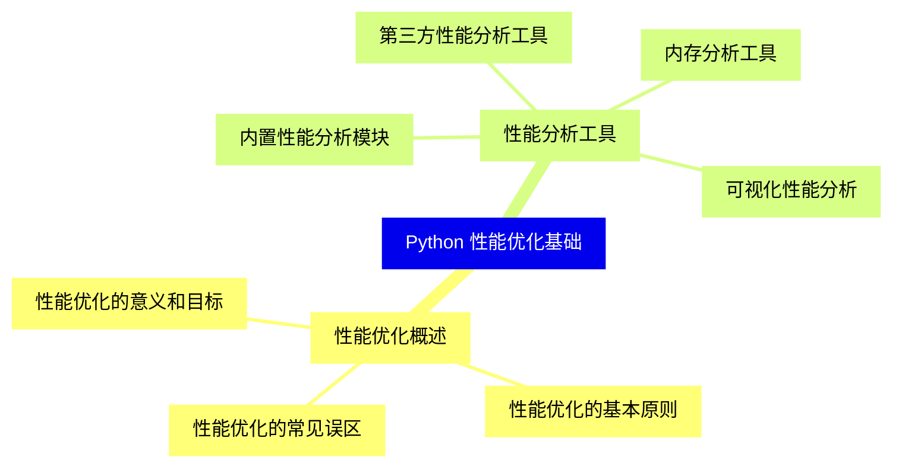
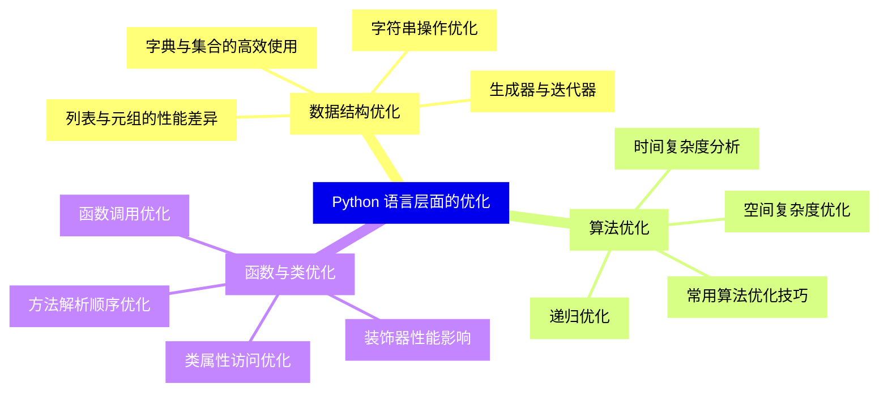
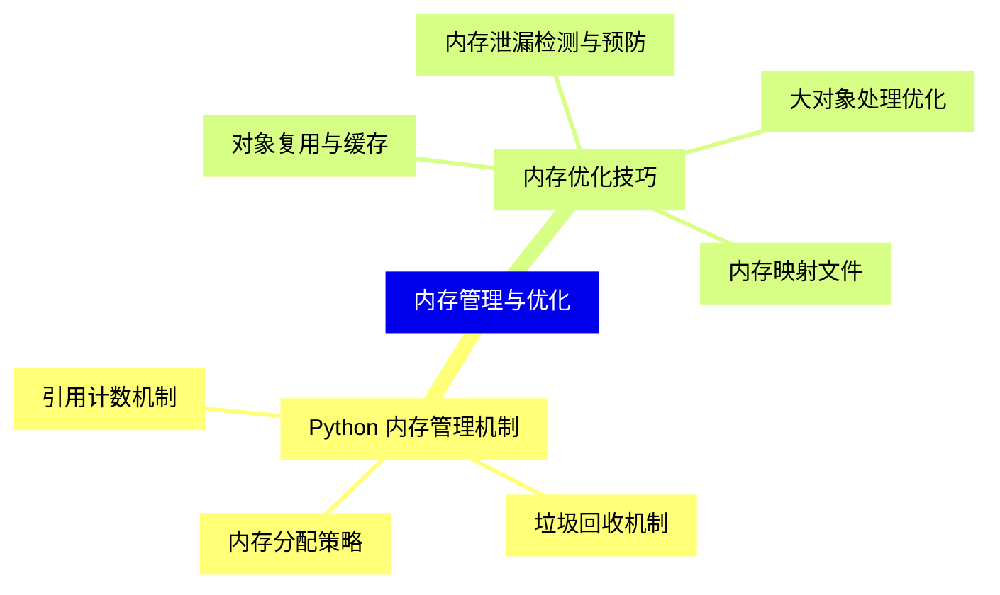
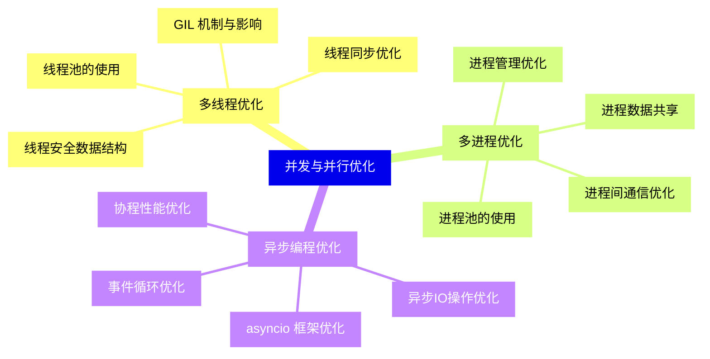
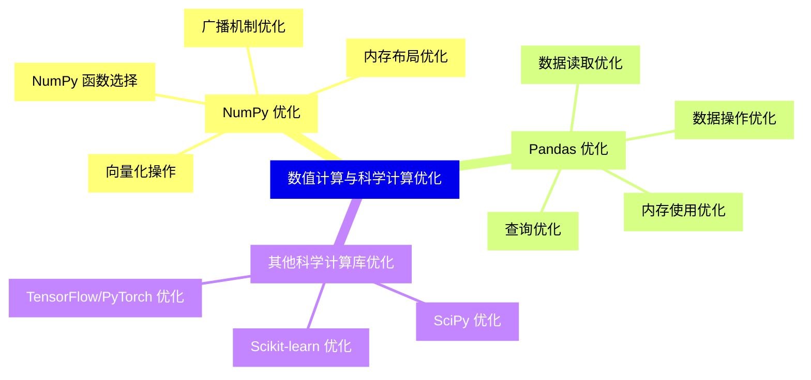
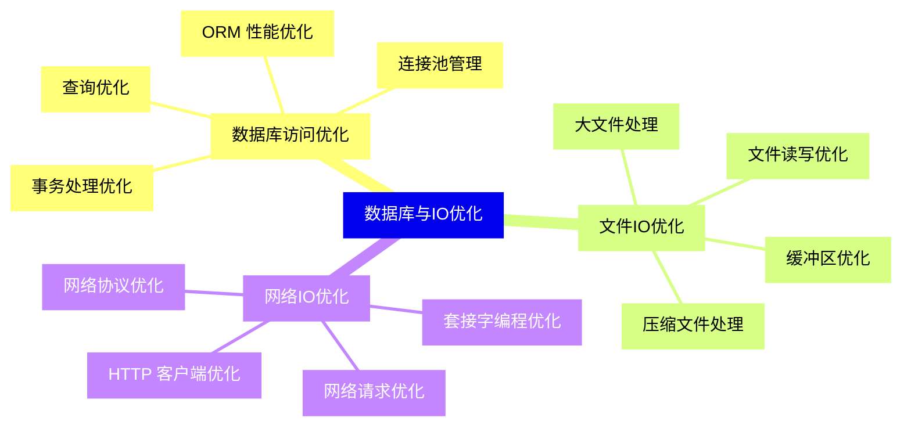
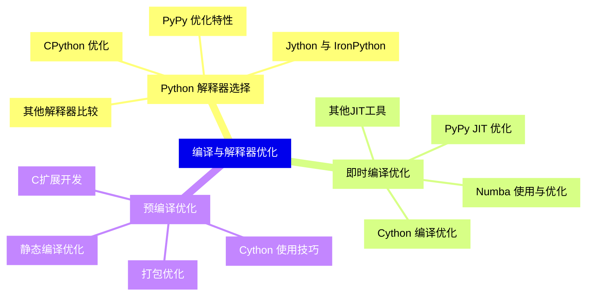
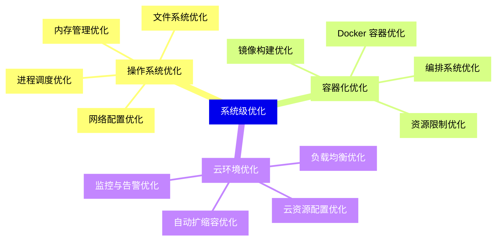
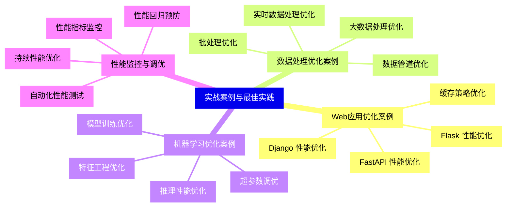


### 1 [Python 性能优化基础](#1)
#### 1.1 [性能优化概述](#1)
##### 1.1.1 [性能优化的意义和目标](#1)
##### 1.1.2 [性能优化的基本原则](#1)
##### 1.1.3 [性能优化的常见误区](#1)
#### 1.2 [性能分析工具](#1)
##### 1.2.1 [内置性能分析模块](#1)
##### 1.2.2 [第三方性能分析工具](#1)
##### 1.2.3 [内存分析工具](#1)
##### 1.2.4 [可视化性能分析](#1)
### 2 [Python 语言层面的优化](#2)
#### 2.1 [数据结构优化](#2)
##### 2.1.1 [列表与元组的性能差异](#2)
##### 2.1.2 [字典与集合的高效使用](#2)
##### 2.1.3 [字符串操作优化](#2)
##### 2.1.4 [生成器与迭代器](#2)
#### 2.2 [算法优化](#2)
##### 2.2.1 [时间复杂度分析](#2)
##### 2.2.2 [空间复杂度优化](#2)
##### 2.2.3 [常用算法优化技巧](#2)
##### 2.2.4 [递归优化](#2)
#### 2.3 [函数与类优化](#2)
##### 2.3.1 [函数调用优化](#2)
##### 2.3.2 [类属性访问优化](#2)
##### 2.3.3 [方法解析顺序优化](#2)
##### 2.3.4 [装饰器性能影响](#2)
### 3 [内存管理与优化](#3)
#### 3.1 [Python 内存管理机制](#3)
##### 3.1.1 [引用计数机制](#3)
##### 3.1.2 [垃圾回收机制](#3)
##### 3.1.3 [内存分配策略](#3)
#### 3.2 [内存优化技巧](#3)
##### 3.2.1 [对象复用与缓存](#3)
##### 3.2.2 [内存泄漏检测与预防](#3)
##### 3.2.3 [大对象处理优化](#3)
##### 3.2.4 [内存映射文件](#3)
### 4 [并发与并行优化](#4)
#### 4.1 [多线程优化](#4)
##### 4.1.1 [GIL 机制与影响](#4)
##### 4.1.2 [线程池的使用](#4)
##### 4.1.3 [线程同步优化](#4)
##### 4.1.4 [线程安全数据结构](#4)
#### 4.2 [多进程优化](#4)
##### 4.2.1 [进程池的使用](#4)
##### 4.2.2 [进程间通信优化](#4)
##### 4.2.3 [进程数据共享](#4)
##### 4.2.4 [进程管理优化](#4)
#### 4.3 [异步编程优化](#4)
##### 4.3.1 [asyncio 框架优化](#4)
##### 4.3.2 [协程性能优化](#4)
##### 4.3.3 [异步IO操作优化](#4)
##### 4.3.4 [事件循环优化](#4)
### 5 [数值计算与科学计算优化](#5)
#### 5.1 [NumPy 优化](#5)
##### 5.1.1 [向量化操作](#5)
##### 5.1.2 [广播机制优化](#5)
##### 5.1.3 [内存布局优化](#5)
##### 5.1.4 [NumPy 函数选择](#5)
#### 5.2 [Pandas 优化](#5)
##### 5.2.1 [数据读取优化](#5)
##### 5.2.2 [数据操作优化](#5)
##### 5.2.3 [内存使用优化](#5)
##### 5.2.4 [查询优化](#5)
#### 5.3 [其他科学计算库优化](#5)
##### 5.3.1 [SciPy 优化](#5)
##### 5.3.2 [Scikit-learn 优化](#5)
##### 5.3.3 [TensorFlow/PyTorch 优化](#5)
### 6 [数据库与IO优化](#6)
#### 6.1 [数据库访问优化](#6)
##### 6.1.1 [连接池管理](#6)
##### 6.1.2 [查询优化](#6)
##### 6.1.3 [事务处理优化](#6)
##### 6.1.4 [ORM 性能优化](#6)
#### 6.2 [文件IO优化](#6)
##### 6.2.1 [文件读写优化](#6)
##### 6.2.2 [缓冲区优化](#6)
##### 6.2.3 [大文件处理](#6)
##### 6.2.4 [压缩文件处理](#6)
#### 6.3 [网络IO优化](#6)
##### 6.3.1 [网络请求优化](#6)
##### 6.3.2 [套接字编程优化](#6)
##### 6.3.3 [HTTP 客户端优化](#6)
##### 6.3.4 [网络协议优化](#6)
### 7 [编译与解释器优化](#7)
#### 7.1 [Python 解释器选择](#7)
##### 7.1.1 [CPython 优化](#7)
##### 7.1.2 [PyPy 优化特性](#7)
##### 7.1.3 [Jython 与 IronPython](#7)
##### 7.1.4 [其他解释器比较](#7)
#### 7.2 [即时编译优化](#7)
##### 7.2.1 [Numba 使用与优化](#7)
##### 7.2.2 [PyPy JIT 优化](#7)
##### 7.2.3 [Cython 编译优化](#7)
##### 7.2.4 [其他JIT工具](#7)
#### 7.3 [预编译优化](#7)
##### 7.3.1 [Cython 使用技巧](#7)
##### 7.3.2 [C扩展开发](#7)
##### 7.3.3 [静态编译优化](#7)
##### 7.3.4 [打包优化](#7)
### 8 [系统级优化](#8)
#### 8.1 [操作系统优化](#8)
##### 8.1.1 [进程调度优化](#8)
##### 8.1.2 [内存管理优化](#8)
##### 8.1.3 [文件系统优化](#8)
##### 8.1.4 [网络配置优化](#8)
#### 8.2 [容器化优化](#8)
##### 8.2.1 [Docker 容器优化](#8)
##### 8.2.2 [镜像构建优化](#8)
##### 8.2.3 [资源限制优化](#8)
##### 8.2.4 [编排系统优化](#8)
#### 8.3 [云环境优化](#8)
##### 8.3.1 [云资源配置优化](#8)
##### 8.3.2 [负载均衡优化](#8)
##### 8.3.3 [自动扩缩容优化](#8)
##### 8.3.4 [监控与告警优化](#8)
### 9 [实战案例与最佳实践](#9)
#### 9.1 [Web应用优化案例](#9)
##### 9.1.1 [Django 性能优化](#9)
##### 9.1.2 [Flask 性能优化](#9)
##### 9.1.3 [FastAPI 性能优化](#9)
##### 9.1.4 [缓存策略优化](#9)
#### 9.2 [数据处理优化案例](#9)
##### 9.2.1 [大数据处理优化](#9)
##### 9.2.2 [实时数据处理优化](#9)
##### 9.2.3 [批处理优化](#9)
##### 9.2.4 [数据管道优化](#9)
#### 9.3 [机器学习优化案例](#9)
##### 9.3.1 [模型训练优化](#9)
##### 9.3.2 [推理性能优化](#9)
##### 9.3.3 [特征工程优化](#9)
##### 9.3.4 [超参数调优](#9)
#### 9.4 [性能监控与调优](#9)
##### 9.4.1 [性能指标监控](#9)
##### 9.4.2 [自动化性能测试](#9)
##### 9.4.3 [持续性能优化](#9)
##### 9.4.4 [性能回归预防](#9)




### 1 Python 性能优化基础

---
### 1 Python 性能优化基础
___
#### 1.1 性能优化概述
___
##### 1.1.1 性能优化的意义和目标
___
##### 1.1.2 性能优化的基本原则
___
##### 1.1.3 性能优化的常见误区
___
#### 1.2 性能分析工具
___
##### 1.2.1 内置性能分析模块
___
##### 1.2.2 第三方性能分析工具
___
##### 1.2.3 内存分析工具
___
##### 1.2.4 可视化性能分析
### 2 Python 语言层面的优化

---
### 2 Python 语言层面的优化
___
#### 2.1 数据结构优化
___
##### 2.1.1 列表与元组的性能差异
___
##### 2.1.2 字典与集合的高效使用
___
##### 2.1.3 字符串操作优化
___
##### 2.1.4 生成器与迭代器
___
#### 2.2 算法优化
___
##### 2.2.1 时间复杂度分析
___
##### 2.2.2 空间复杂度优化
___
##### 2.2.3 常用算法优化技巧
___
##### 2.2.4 递归优化
___
#### 2.3 函数与类优化
___
##### 2.3.1 函数调用优化
___
##### 2.3.2 类属性访问优化
___
##### 2.3.3 方法解析顺序优化
___
##### 2.3.4 装饰器性能影响
### 3 内存管理与优化

---
### 3 内存管理与优化
___
#### 3.1 Python 内存管理机制
___
##### 3.1.1 引用计数机制
___
##### 3.1.2 垃圾回收机制
___
##### 3.1.3 内存分配策略
___
#### 3.2 内存优化技巧
___
##### 3.2.1 对象复用与缓存
___
##### 3.2.2 内存泄漏检测与预防
___
##### 3.2.3 大对象处理优化
___
##### 3.2.4 内存映射文件
### 4 并发与并行优化

---
### 4 并发与并行优化
___
#### 4.1 多线程优化
___
##### 4.1.1 GIL 机制与影响
___
##### 4.1.2 线程池的使用
___
##### 4.1.3 线程同步优化
___
##### 4.1.4 线程安全数据结构
___
#### 4.2 多进程优化
___
##### 4.2.1 进程池的使用
___
##### 4.2.2 进程间通信优化
___
##### 4.2.3 进程数据共享
___
##### 4.2.4 进程管理优化
___
#### 4.3 异步编程优化
___
##### 4.3.1 asyncio 框架优化
___
##### 4.3.2 协程性能优化
___
##### 4.3.3 异步IO操作优化
___
##### 4.3.4 事件循环优化
### 5 数值计算与科学计算优化

---
### 5 数值计算与科学计算优化
___
#### 5.1 NumPy 优化
___
##### 5.1.1 向量化操作
___
##### 5.1.2 广播机制优化
___
##### 5.1.3 内存布局优化
___
##### 5.1.4 NumPy 函数选择
___
#### 5.2 Pandas 优化
___
##### 5.2.1 数据读取优化
___
##### 5.2.2 数据操作优化
___
##### 5.2.3 内存使用优化
___
##### 5.2.4 查询优化
___
#### 5.3 其他科学计算库优化
___
##### 5.3.1 SciPy 优化
___
##### 5.3.2 Scikit-learn 优化
___
##### 5.3.3 TensorFlow/PyTorch 优化
### 6 数据库与IO优化

---
### 6 数据库与IO优化
___
#### 6.1 数据库访问优化
___
##### 6.1.1 连接池管理
___
##### 6.1.2 查询优化
___
##### 6.1.3 事务处理优化
___
##### 6.1.4 ORM 性能优化
___
#### 6.2 文件IO优化
___
##### 6.2.1 文件读写优化
___
##### 6.2.2 缓冲区优化
___
##### 6.2.3 大文件处理
___
##### 6.2.4 压缩文件处理
___
#### 6.3 网络IO优化
___
##### 6.3.1 网络请求优化
___
##### 6.3.2 套接字编程优化
___
##### 6.3.3 HTTP 客户端优化
___
##### 6.3.4 网络协议优化
### 7 编译与解释器优化

---
### 7 编译与解释器优化
___
#### 7.1 Python 解释器选择
___
##### 7.1.1 CPython 优化
___
##### 7.1.2 PyPy 优化特性
___
##### 7.1.3 Jython 与 IronPython
___
##### 7.1.4 其他解释器比较
___
#### 7.2 即时编译优化
___
##### 7.2.1 Numba 使用与优化
___
##### 7.2.2 PyPy JIT 优化
___
##### 7.2.3 Cython 编译优化
___
##### 7.2.4 其他JIT工具
___
#### 7.3 预编译优化
___
##### 7.3.1 Cython 使用技巧
___
##### 7.3.2 C扩展开发
___
##### 7.3.3 静态编译优化
___
##### 7.3.4 打包优化
### 8 系统级优化

---
### 8 系统级优化
___
#### 8.1 操作系统优化
___
##### 8.1.1 进程调度优化
___
##### 8.1.2 内存管理优化
___
##### 8.1.3 文件系统优化
___
##### 8.1.4 网络配置优化
___
#### 8.2 容器化优化
___
##### 8.2.1 Docker 容器优化
___
##### 8.2.2 镜像构建优化
___
##### 8.2.3 资源限制优化
___
##### 8.2.4 编排系统优化
___
#### 8.3 云环境优化
___
##### 8.3.1 云资源配置优化
___
##### 8.3.2 负载均衡优化
___
##### 8.3.3 自动扩缩容优化
___
##### 8.3.4 监控与告警优化
### 9 实战案例与最佳实践

---
### 9 实战案例与最佳实践
___
#### 9.1 Web应用优化案例
___
##### 9.1.1 Django 性能优化
___
##### 9.1.2 Flask 性能优化
___
##### 9.1.3 FastAPI 性能优化
___
##### 9.1.4 缓存策略优化
___
#### 9.2 数据处理优化案例
___
##### 9.2.1 大数据处理优化
___
##### 9.2.2 实时数据处理优化
___
##### 9.2.3 批处理优化
___
##### 9.2.4 数据管道优化
___
#### 9.3 机器学习优化案例
___
##### 9.3.1 模型训练优化
___
##### 9.3.2 推理性能优化
___
##### 9.3.3 特征工程优化
___
##### 9.3.4 超参数调优
___
#### 9.4 性能监控与调优
___
##### 9.4.1 性能指标监控
___
##### 9.4.2 自动化性能测试
___
##### 9.4.3 持续性能优化
___
##### 9.4.4 性能回归预防


### 1 Python 性能优化基础{#1}

{}

<--->
{}
{}
{}
{}
{}
{}
{}
{}
{}
{}
{}
{}
{}
{}
{}
{}
{}
{}
{}

### 2 Python 语言层面的优化{#2}

{}
{}
{}
{}
{}
{}
{}
{}
{}
{}
{}
{}
{}
{}
{}
{}
{}
{}
{}
{}
{}
{}
{}
{}
{}
{}
{}
{}
{}
{}
{}
<--->

{}

### 3 内存管理与优化{#3}

{}

<--->
{}
{}
{}
{}
{}
{}
{}
{}
{}
{}
{}
{}
{}
{}
{}
{}
{}
{}
{}

### 4 并发与并行优化{#4}

{}
{}
{}
{}
{}
{}
{}
{}
{}
{}
{}
{}
{}
{}
{}
{}
{}
{}
{}
{}
{}
{}
{}
{}
{}
{}
{}
{}
{}
{}
{}
<--->

{}

### 5 数值计算与科学计算优化{#5}

{}

<--->
{}
{}
{}
{}
{}
{}
{}
{}
{}
{}
{}
{}
{}
{}
{}
{}
{}
{}
{}
{}
{}
{}
{}
{}
{}
{}
{}
{}
{}

### 6 数据库与IO优化{#6}

{}
{}
{}
{}
{}
{}
{}
{}
{}
{}
{}
{}
{}
{}
{}
{}
{}
{}
{}
{}
{}
{}
{}
{}
{}
{}
{}
{}
{}
{}
{}
<--->

{}

### 7 编译与解释器优化{#7}

{}

<--->
{}
{}
{}
{}
{}
{}
{}
{}
{}
{}
{}
{}
{}
{}
{}
{}
{}
{}
{}
{}
{}
{}
{}
{}
{}
{}
{}
{}
{}
{}
{}

### 8 系统级优化{#8}

{}
{}
{}
{}
{}
{}
{}
{}
{}
{}
{}
{}
{}
{}
{}
{}
{}
{}
{}
{}
{}
{}
{}
{}
{}
{}
{}
{}
{}
{}
{}
<--->

{}

### 9 实战案例与最佳实践{#9}

{}

<--->
{}
{}
{}
{}
{}
{}
{}
{}
{}
{}
{}
{}
{}
{}
{}
{}
{}
{}
{}
{}
{}
{}
{}
{}
{}
{}
{}
{}
{}
{}
{}
{}
{}
{}
{}
{}
{}
{}
{}
{}
{}
