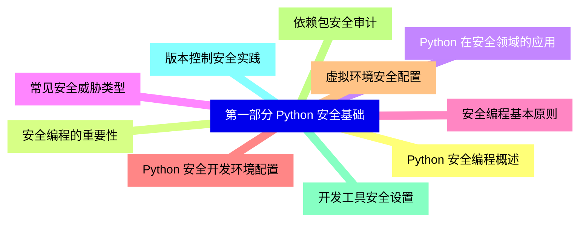
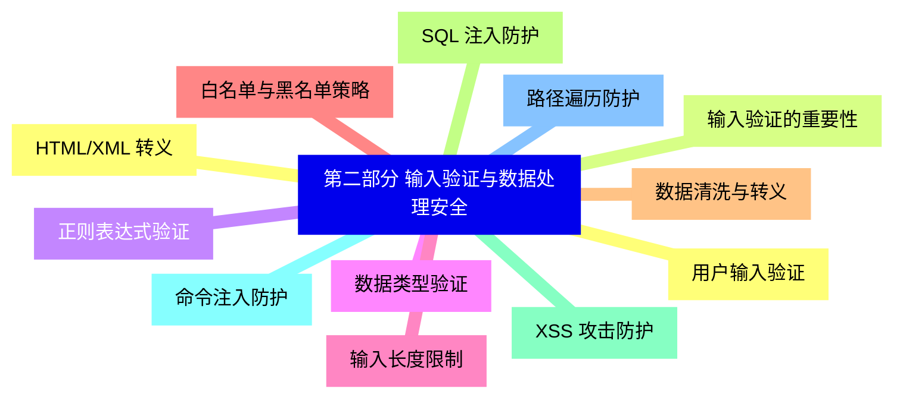
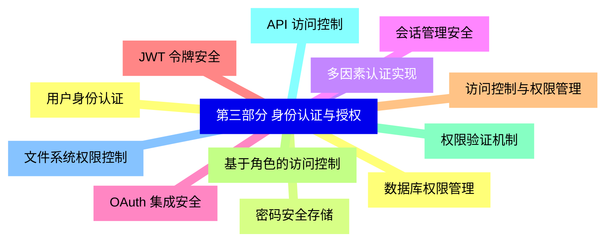
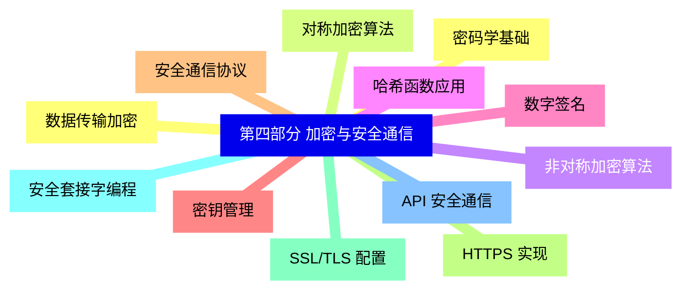
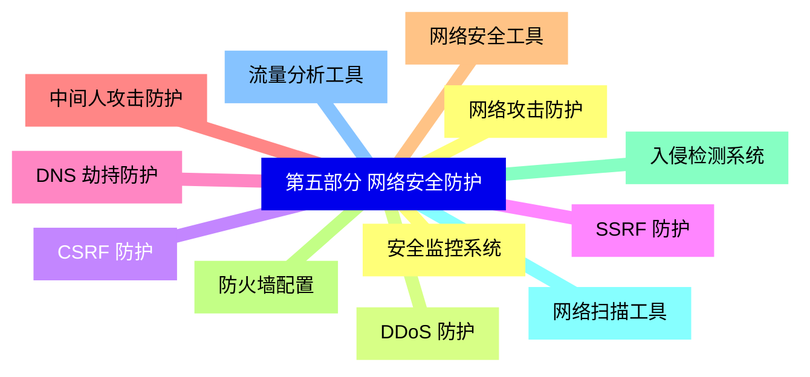
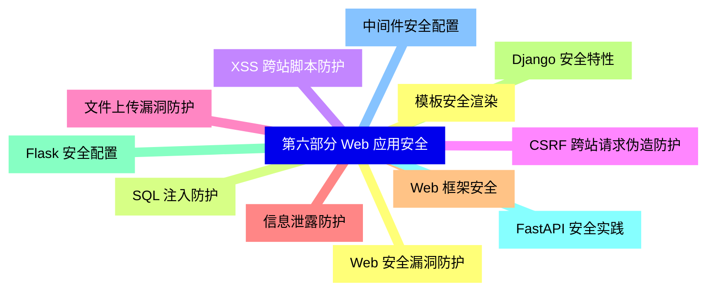
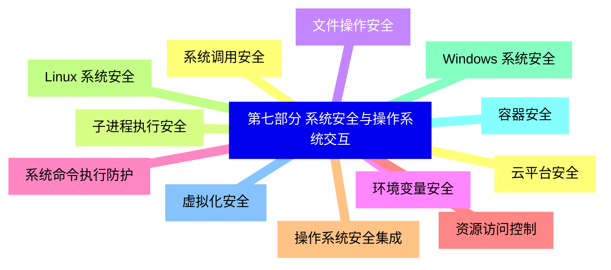
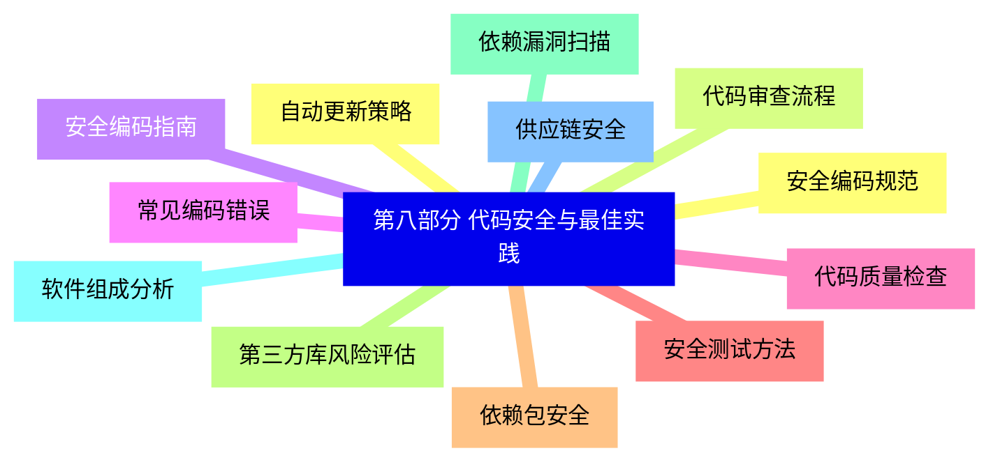
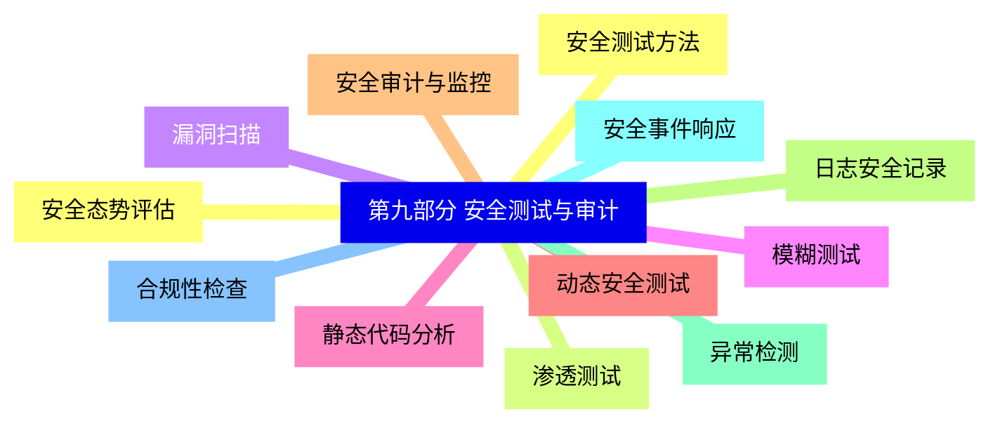
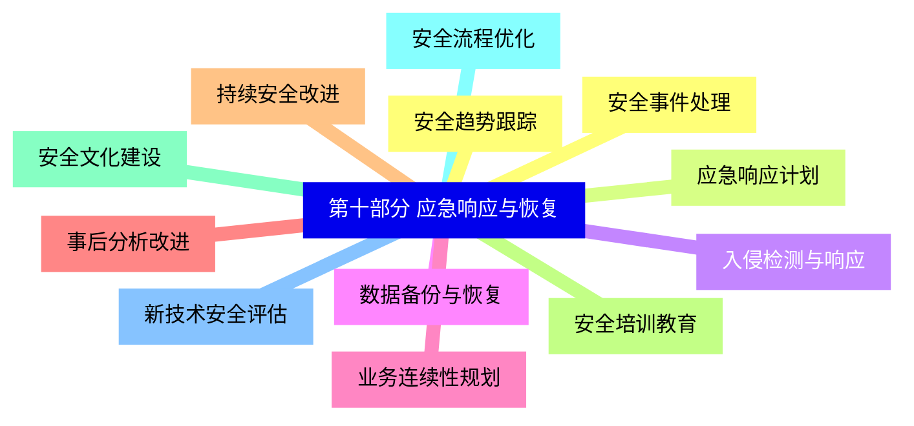


### 1 [第一部分 Python 安全基础](#1)
#### 1.1 [Python 安全编程概述](#1)
#### 1.2 [安全编程的重要性](#1)
#### 1.3 [Python 在安全领域的应用](#1)
#### 1.4 [常见安全威胁类型](#1)
#### 1.5 [安全编程基本原则](#1)
#### 1.6 [Python 安全开发环境配置](#1)
#### 1.7 [虚拟环境安全配置](#1)
#### 1.8 [依赖包安全审计](#1)
#### 1.9 [开发工具安全设置](#1)
#### 1.10 [版本控制安全实践](#1)
### 2 [第二部分 输入验证与数据处理安全](#2)
#### 2.1 [用户输入验证](#2)
#### 2.2 [输入验证的重要性](#2)
#### 2.3 [正则表达式验证](#2)
#### 2.4 [数据类型验证](#2)
#### 2.5 [输入长度限制](#2)
#### 2.6 [白名单与黑名单策略](#2)
#### 2.7 [数据清洗与转义](#2)
#### 2.8 [SQL 注入防护](#2)
#### 2.9 [XSS 攻击防护](#2)
#### 2.10 [命令注入防护](#2)
#### 2.11 [路径遍历防护](#2)
#### 2.12 [HTML/XML 转义](#2)
### 3 [第三部分 身份认证与授权](#3)
#### 3.1 [用户身份认证](#3)
#### 3.2 [密码安全存储](#3)
#### 3.3 [多因素认证实现](#3)
#### 3.4 [会话管理安全](#3)
#### 3.5 [OAuth 集成安全](#3)
#### 3.6 [JWT 令牌安全](#3)
#### 3.7 [访问控制与权限管理](#3)
#### 3.8 [基于角色的访问控制](#3)
#### 3.9 [权限验证机制](#3)
#### 3.10 [API 访问控制](#3)
#### 3.11 [文件系统权限控制](#3)
#### 3.12 [数据库权限管理](#3)
### 4 [第四部分 加密与安全通信](#4)
#### 4.1 [密码学基础](#4)
#### 4.2 [对称加密算法](#4)
#### 4.3 [非对称加密算法](#4)
#### 4.4 [哈希函数应用](#4)
#### 4.5 [数字签名](#4)
#### 4.6 [密钥管理](#4)
#### 4.7 [安全通信协议](#4)
#### 4.8 [HTTPS 实现](#4)
#### 4.9 [SSL/TLS 配置](#4)
#### 4.10 [安全套接字编程](#4)
#### 4.11 [API 安全通信](#4)
#### 4.12 [数据传输加密](#4)
### 5 [第五部分 网络安全防护](#5)
#### 5.1 [网络攻击防护](#5)
#### 5.2 [DDoS 防护](#5)
#### 5.3 [CSRF 防护](#5)
#### 5.4 [SSRF 防护](#5)
#### 5.5 [DNS 劫持防护](#5)
#### 5.6 [中间人攻击防护](#5)
#### 5.7 [网络安全工具](#5)
#### 5.8 [防火墙配置](#5)
#### 5.9 [入侵检测系统](#5)
#### 5.10 [网络扫描工具](#5)
#### 5.11 [流量分析工具](#5)
#### 5.12 [安全监控系统](#5)
### 6 [第六部分 Web 应用安全](#6)
#### 6.1 [Web 安全漏洞防护](#6)
#### 6.2 [SQL 注入防护](#6)
#### 6.3 [XSS 跨站脚本防护](#6)
#### 6.4 [CSRF 跨站请求伪造防护](#6)
#### 6.5 [文件上传漏洞防护](#6)
#### 6.6 [信息泄露防护](#6)
#### 6.7 [Web 框架安全](#6)
#### 6.8 [Django 安全特性](#6)
#### 6.9 [Flask 安全配置](#6)
#### 6.10 [FastAPI 安全实践](#6)
#### 6.11 [中间件安全配置](#6)
#### 6.12 [模板安全渲染](#6)
### 7 [第七部分 系统安全与操作系统交互](#7)
#### 7.1 [系统调用安全](#7)
#### 7.2 [子进程执行安全](#7)
#### 7.3 [文件操作安全](#7)
#### 7.4 [环境变量安全](#7)
#### 7.5 [系统命令执行防护](#7)
#### 7.6 [资源访问控制](#7)
#### 7.7 [操作系统安全集成](#7)
#### 7.8 [Linux 系统安全](#7)
#### 7.9 [Windows 系统安全](#7)
#### 7.10 [容器安全](#7)
#### 7.11 [虚拟化安全](#7)
#### 7.12 [云平台安全](#7)
### 8 [第八部分 代码安全与最佳实践](#8)
#### 8.1 [安全编码规范](#8)
#### 8.2 [代码审查流程](#8)
#### 8.3 [安全编码指南](#8)
#### 8.4 [常见编码错误](#8)
#### 8.5 [代码质量检查](#8)
#### 8.6 [安全测试方法](#8)
#### 8.7 [依赖包安全](#8)
#### 8.8 [第三方库风险评估](#8)
#### 8.9 [依赖漏洞扫描](#8)
#### 8.10 [软件组成分析](#8)
#### 8.11 [供应链安全](#8)
#### 8.12 [自动更新策略](#8)
### 9 [第九部分 安全测试与审计](#9)
#### 9.1 [安全测试方法](#9)
#### 9.2 [渗透测试](#9)
#### 9.3 [漏洞扫描](#9)
#### 9.4 [模糊测试](#9)
#### 9.5 [静态代码分析](#9)
#### 9.6 [动态安全测试](#9)
#### 9.7 [安全审计与监控](#9)
#### 9.8 [日志安全记录](#9)
#### 9.9 [异常检测](#9)
#### 9.10 [安全事件响应](#9)
#### 9.11 [合规性检查](#9)
#### 9.12 [安全态势评估](#9)
### 10 [第十部分 应急响应与恢复](#10)
#### 10.1 [安全事件处理](#10)
#### 10.2 [应急响应计划](#10)
#### 10.3 [入侵检测与响应](#10)
#### 10.4 [数据备份与恢复](#10)
#### 10.5 [业务连续性规划](#10)
#### 10.6 [事后分析改进](#10)
#### 10.7 [持续安全改进](#10)
#### 10.8 [安全培训教育](#10)
#### 10.9 [安全文化建设](#10)
#### 10.10 [安全流程优化](#10)
#### 10.11 [新技术安全评估](#10)
#### 10.12 [安全趋势跟踪](#10)




### 1 第一部分 Python 安全基础

---
### 1 第一部分 Python 安全基础
___
#### 1.1 Python 安全编程概述
___
#### 1.2 安全编程的重要性
___
#### 1.3 Python 在安全领域的应用
___
#### 1.4 常见安全威胁类型
___
#### 1.5 安全编程基本原则
___
#### 1.6 Python 安全开发环境配置
___
#### 1.7 虚拟环境安全配置
___
#### 1.8 依赖包安全审计
___
#### 1.9 开发工具安全设置
___
#### 1.10 版本控制安全实践
### 2 第二部分 输入验证与数据处理安全

---
### 2 第二部分 输入验证与数据处理安全
___
#### 2.1 用户输入验证
___
#### 2.2 输入验证的重要性
___
#### 2.3 正则表达式验证
___
#### 2.4 数据类型验证
___
#### 2.5 输入长度限制
___
#### 2.6 白名单与黑名单策略
___
#### 2.7 数据清洗与转义
___
#### 2.8 SQL 注入防护
___
#### 2.9 XSS 攻击防护
___
#### 2.10 命令注入防护
___
#### 2.11 路径遍历防护
___
#### 2.12 HTML/XML 转义
### 3 第三部分 身份认证与授权

---
### 3 第三部分 身份认证与授权
___
#### 3.1 用户身份认证
___
#### 3.2 密码安全存储
___
#### 3.3 多因素认证实现
___
#### 3.4 会话管理安全
___
#### 3.5 OAuth 集成安全
___
#### 3.6 JWT 令牌安全
___
#### 3.7 访问控制与权限管理
___
#### 3.8 基于角色的访问控制
___
#### 3.9 权限验证机制
___
#### 3.10 API 访问控制
___
#### 3.11 文件系统权限控制
___
#### 3.12 数据库权限管理
### 4 第四部分 加密与安全通信

---
### 4 第四部分 加密与安全通信
___
#### 4.1 密码学基础
___
#### 4.2 对称加密算法
___
#### 4.3 非对称加密算法
___
#### 4.4 哈希函数应用
___
#### 4.5 数字签名
___
#### 4.6 密钥管理
___
#### 4.7 安全通信协议
___
#### 4.8 HTTPS 实现
___
#### 4.9 SSL/TLS 配置
___
#### 4.10 安全套接字编程
___
#### 4.11 API 安全通信
___
#### 4.12 数据传输加密
### 5 第五部分 网络安全防护

---
### 5 第五部分 网络安全防护
___
#### 5.1 网络攻击防护
___
#### 5.2 DDoS 防护
___
#### 5.3 CSRF 防护
___
#### 5.4 SSRF 防护
___
#### 5.5 DNS 劫持防护
___
#### 5.6 中间人攻击防护
___
#### 5.7 网络安全工具
___
#### 5.8 防火墙配置
___
#### 5.9 入侵检测系统
___
#### 5.10 网络扫描工具
___
#### 5.11 流量分析工具
___
#### 5.12 安全监控系统
### 6 第六部分 Web 应用安全

---
### 6 第六部分 Web 应用安全
___
#### 6.1 Web 安全漏洞防护
___
#### 6.2 SQL 注入防护
___
#### 6.3 XSS 跨站脚本防护
___
#### 6.4 CSRF 跨站请求伪造防护
___
#### 6.5 文件上传漏洞防护
___
#### 6.6 信息泄露防护
___
#### 6.7 Web 框架安全
___
#### 6.8 Django 安全特性
___
#### 6.9 Flask 安全配置
___
#### 6.10 FastAPI 安全实践
___
#### 6.11 中间件安全配置
___
#### 6.12 模板安全渲染
### 7 第七部分 系统安全与操作系统交互

---
### 7 第七部分 系统安全与操作系统交互
___
#### 7.1 系统调用安全
___
#### 7.2 子进程执行安全
___
#### 7.3 文件操作安全
___
#### 7.4 环境变量安全
___
#### 7.5 系统命令执行防护
___
#### 7.6 资源访问控制
___
#### 7.7 操作系统安全集成
___
#### 7.8 Linux 系统安全
___
#### 7.9 Windows 系统安全
___
#### 7.10 容器安全
___
#### 7.11 虚拟化安全
___
#### 7.12 云平台安全
### 8 第八部分 代码安全与最佳实践

---
### 8 第八部分 代码安全与最佳实践
___
#### 8.1 安全编码规范
___
#### 8.2 代码审查流程
___
#### 8.3 安全编码指南
___
#### 8.4 常见编码错误
___
#### 8.5 代码质量检查
___
#### 8.6 安全测试方法
___
#### 8.7 依赖包安全
___
#### 8.8 第三方库风险评估
___
#### 8.9 依赖漏洞扫描
___
#### 8.10 软件组成分析
___
#### 8.11 供应链安全
___
#### 8.12 自动更新策略
### 9 第九部分 安全测试与审计

---
### 9 第九部分 安全测试与审计
___
#### 9.1 安全测试方法
___
#### 9.2 渗透测试
___
#### 9.3 漏洞扫描
___
#### 9.4 模糊测试
___
#### 9.5 静态代码分析
___
#### 9.6 动态安全测试
___
#### 9.7 安全审计与监控
___
#### 9.8 日志安全记录
___
#### 9.9 异常检测
___
#### 9.10 安全事件响应
___
#### 9.11 合规性检查
___
#### 9.12 安全态势评估
### 10 第十部分 应急响应与恢复

---
### 10 第十部分 应急响应与恢复
___
#### 10.1 安全事件处理
___
#### 10.2 应急响应计划
___
#### 10.3 入侵检测与响应
___
#### 10.4 数据备份与恢复
___
#### 10.5 业务连续性规划
___
#### 10.6 事后分析改进
___
#### 10.7 持续安全改进
___
#### 10.8 安全培训教育
___
#### 10.9 安全文化建设
___
#### 10.10 安全流程优化
___
#### 10.11 新技术安全评估
___
#### 10.12 安全趋势跟踪


### 1 第一部分 Python 安全基础{#1}

{}

<--->
{}
{}
{}
{}
{}
{}
{}
{}
{}
{}
{}
{}
{}
{}
{}
{}
{}
{}
{}
{}
{}

### 2 第二部分 输入验证与数据处理安全{#2}

{}
{}
{}
{}
{}
{}
{}
{}
{}
{}
{}
{}
{}
{}
{}
{}
{}
{}
{}
{}
{}
{}
{}
{}
{}
<--->

{}

### 3 第三部分 身份认证与授权{#3}

{}

<--->
{}
{}
{}
{}
{}
{}
{}
{}
{}
{}
{}
{}
{}
{}
{}
{}
{}
{}
{}
{}
{}
{}
{}
{}
{}

### 4 第四部分 加密与安全通信{#4}

{}
{}
{}
{}
{}
{}
{}
{}
{}
{}
{}
{}
{}
{}
{}
{}
{}
{}
{}
{}
{}
{}
{}
{}
{}
<--->

{}

### 5 第五部分 网络安全防护{#5}

{}

<--->
{}
{}
{}
{}
{}
{}
{}
{}
{}
{}
{}
{}
{}
{}
{}
{}
{}
{}
{}
{}
{}
{}
{}
{}
{}

### 6 第六部分 Web 应用安全{#6}

{}
{}
{}
{}
{}
{}
{}
{}
{}
{}
{}
{}
{}
{}
{}
{}
{}
{}
{}
{}
{}
{}
{}
{}
{}
<--->

{}

### 7 第七部分 系统安全与操作系统交互{#7}

{}

<--->
{}
{}
{}
{}
{}
{}
{}
{}
{}
{}
{}
{}
{}
{}
{}
{}
{}
{}
{}
{}
{}
{}
{}
{}
{}

### 8 第八部分 代码安全与最佳实践{#8}

{}
{}
{}
{}
{}
{}
{}
{}
{}
{}
{}
{}
{}
{}
{}
{}
{}
{}
{}
{}
{}
{}
{}
{}
{}
<--->

{}

### 9 第九部分 安全测试与审计{#9}

{}

<--->
{}
{}
{}
{}
{}
{}
{}
{}
{}
{}
{}
{}
{}
{}
{}
{}
{}
{}
{}
{}
{}
{}
{}
{}
{}

### 10 第十部分 应急响应与恢复{#10}

{}
{}
{}
{}
{}
{}
{}
{}
{}
{}
{}
{}
{}
{}
{}
{}
{}
{}
{}
{}
{}
{}
{}
{}
{}
<--->

{}
