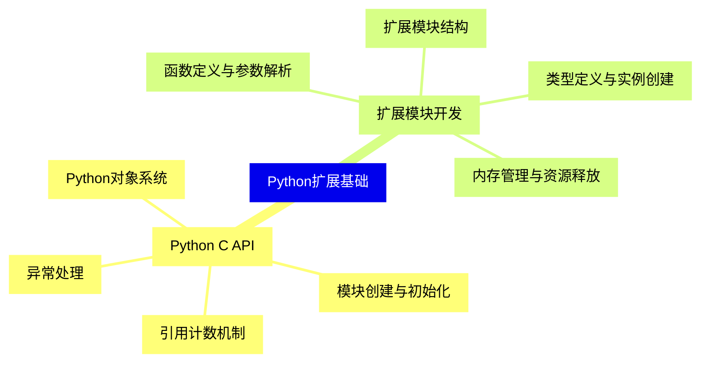
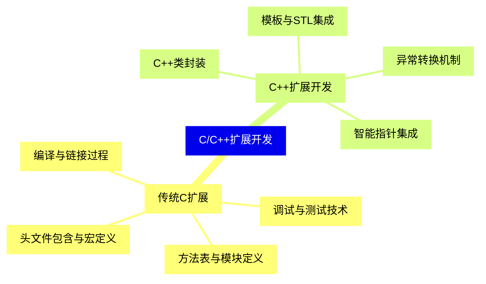
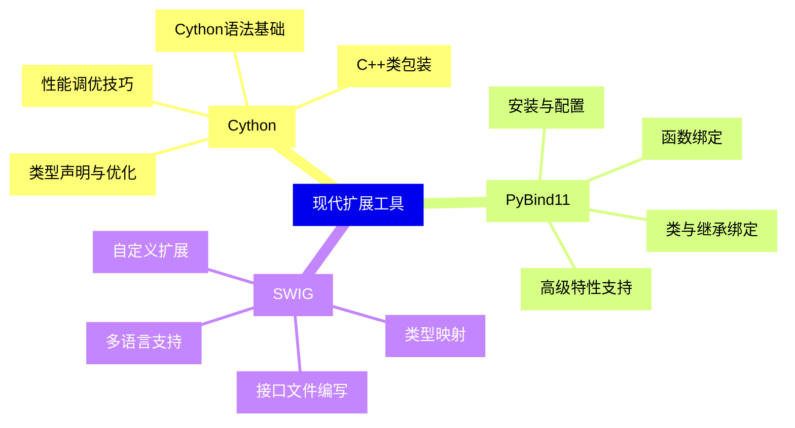
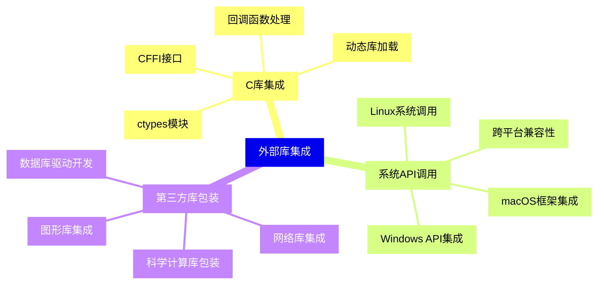
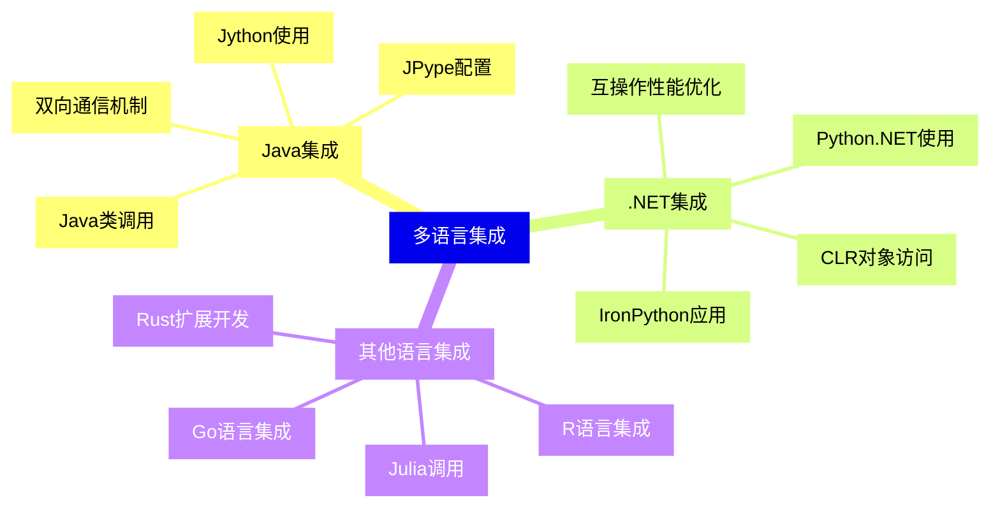
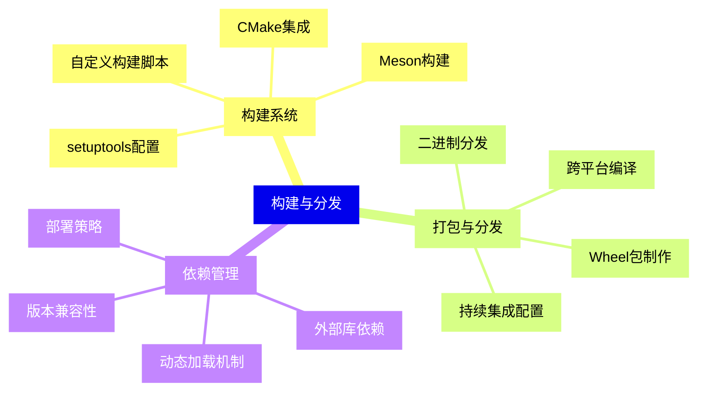
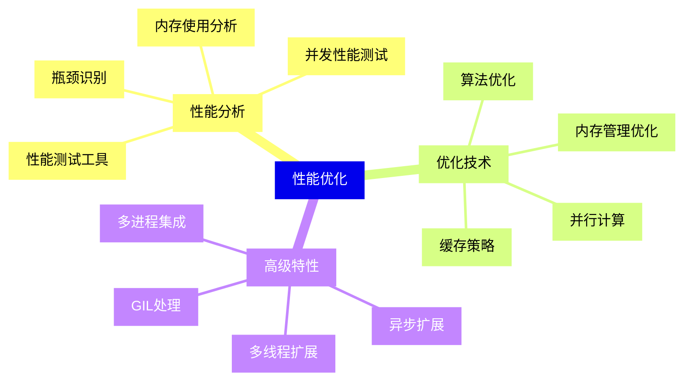
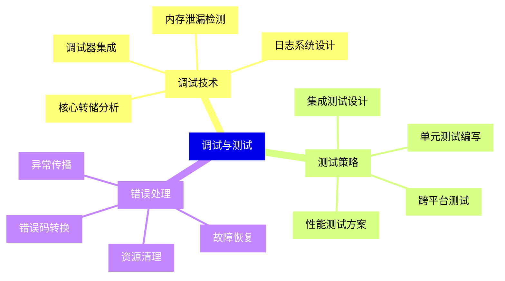
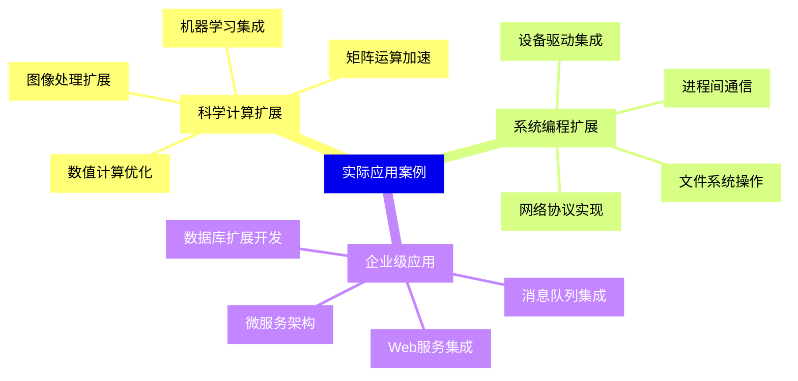
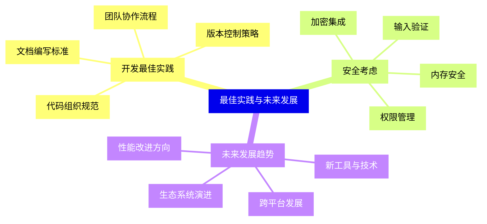


### 1 [Python扩展基础](#1)
#### 1.1 [Python C API](#1)
##### 1.1.1 [Python对象系统](#1)
##### 1.1.2 [引用计数机制](#1)
##### 1.1.3 [异常处理](#1)
##### 1.1.4 [模块创建与初始化](#1)
#### 1.2 [扩展模块开发](#1)
##### 1.2.1 [扩展模块结构](#1)
##### 1.2.2 [函数定义与参数解析](#1)
##### 1.2.3 [类型定义与实例创建](#1)
##### 1.2.4 [内存管理与资源释放](#1)
### 2 [C/C++扩展开发](#2)
#### 2.1 [传统C扩展](#2)
##### 2.1.1 [头文件包含与宏定义](#2)
##### 2.1.2 [方法表与模块定义](#2)
##### 2.1.3 [编译与链接过程](#2)
##### 2.1.4 [调试与测试技术](#2)
#### 2.2 [C++扩展开发](#2)
##### 2.2.1 [C++类封装](#2)
##### 2.2.2 [模板与STL集成](#2)
##### 2.2.3 [异常转换机制](#2)
##### 2.2.4 [智能指针集成](#2)
### 3 [现代扩展工具](#3)
#### 3.1 [Cython](#3)
##### 3.1.1 [Cython语法基础](#3)
##### 3.1.2 [类型声明与优化](#3)
##### 3.1.3 [C++类包装](#3)
##### 3.1.4 [性能调优技巧](#3)
#### 3.2 [PyBind11](#3)
##### 3.2.1 [安装与配置](#3)
##### 3.2.2 [函数绑定](#3)
##### 3.2.3 [类与继承绑定](#3)
##### 3.2.4 [高级特性支持](#3)
#### 3.3 [SWIG](#3)
##### 3.3.1 [接口文件编写](#3)
##### 3.3.2 [多语言支持](#3)
##### 3.3.3 [类型映射](#3)
##### 3.3.4 [自定义扩展](#3)
### 4 [外部库集成](#4)
#### 4.1 [C库集成](#4)
##### 4.1.1 [ctypes模块](#4)
##### 4.1.2 [CFFI接口](#4)
##### 4.1.3 [动态库加载](#4)
##### 4.1.4 [回调函数处理](#4)
#### 4.2 [系统API调用](#4)
##### 4.2.1 [Windows API集成](#4)
##### 4.2.2 [Linux系统调用](#4)
##### 4.2.3 [macOS框架集成](#4)
##### 4.2.4 [跨平台兼容性](#4)
#### 4.3 [第三方库包装](#4)
##### 4.3.1 [数据库驱动开发](#4)
##### 4.3.2 [图形库集成](#4)
##### 4.3.3 [科学计算库包装](#4)
##### 4.3.4 [网络库集成](#4)
### 5 [多语言集成](#5)
#### 5.1 [Java集成](#5)
##### 5.1.1 [Jython使用](#5)
##### 5.1.2 [JPype配置](#5)
##### 5.1.3 [Java类调用](#5)
##### 5.1.4 [双向通信机制](#5)
#### 5.2 [.NET集成](#5)
##### 5.2.1 [IronPython应用](#5)
##### 5.2.2 [Python.NET使用](#5)
##### 5.2.3 [CLR对象访问](#5)
##### 5.2.4 [互操作性能优化](#5)
#### 5.3 [其他语言集成](#5)
##### 5.3.1 [R语言集成](#5)
##### 5.3.2 [Julia调用](#5)
##### 5.3.3 [Go语言集成](#5)
##### 5.3.4 [Rust扩展开发](#5)
### 6 [构建与分发](#6)
#### 6.1 [构建系统](#6)
##### 6.1.1 [setuptools配置](#6)
##### 6.1.2 [CMake集成](#6)
##### 6.1.3 [Meson构建](#6)
##### 6.1.4 [自定义构建脚本](#6)
#### 6.2 [打包与分发](#6)
##### 6.2.1 [Wheel包制作](#6)
##### 6.2.2 [二进制分发](#6)
##### 6.2.3 [跨平台编译](#6)
##### 6.2.4 [持续集成配置](#6)
#### 6.3 [依赖管理](#6)
##### 6.3.1 [外部库依赖](#6)
##### 6.3.2 [版本兼容性](#6)
##### 6.3.3 [动态加载机制](#6)
##### 6.3.4 [部署策略](#6)
### 7 [性能优化](#7)
#### 7.1 [性能分析](#7)
##### 7.1.1 [性能测试工具](#7)
##### 7.1.2 [瓶颈识别](#7)
##### 7.1.3 [内存使用分析](#7)
##### 7.1.4 [并发性能测试](#7)
#### 7.2 [优化技术](#7)
##### 7.2.1 [算法优化](#7)
##### 7.2.2 [内存管理优化](#7)
##### 7.2.3 [并行计算](#7)
##### 7.2.4 [缓存策略](#7)
#### 7.3 [高级特性](#7)
##### 7.3.1 [GIL处理](#7)
##### 7.3.2 [异步扩展](#7)
##### 7.3.3 [多线程扩展](#7)
##### 7.3.4 [多进程集成](#7)
### 8 [调试与测试](#8)
#### 8.1 [调试技术](#8)
##### 8.1.1 [核心转储分析](#8)
##### 8.1.2 [内存泄漏检测](#8)
##### 8.1.3 [调试器集成](#8)
##### 8.1.4 [日志系统设计](#8)
#### 8.2 [测试策略](#8)
##### 8.2.1 [单元测试编写](#8)
##### 8.2.2 [集成测试设计](#8)
##### 8.2.3 [性能测试方案](#8)
##### 8.2.4 [跨平台测试](#8)
#### 8.3 [错误处理](#8)
##### 8.3.1 [异常传播](#8)
##### 8.3.2 [错误码转换](#8)
##### 8.3.3 [资源清理](#8)
##### 8.3.4 [故障恢复](#8)
### 9 [实际应用案例](#9)
#### 9.1 [科学计算扩展](#9)
##### 9.1.1 [数值计算优化](#9)
##### 9.1.2 [矩阵运算加速](#9)
##### 9.1.3 [图像处理扩展](#9)
##### 9.1.4 [机器学习集成](#9)
#### 9.2 [系统编程扩展](#9)
##### 9.2.1 [设备驱动集成](#9)
##### 9.2.2 [网络协议实现](#9)
##### 9.2.3 [文件系统操作](#9)
##### 9.2.4 [进程间通信](#9)
#### 9.3 [企业级应用](#9)
##### 9.3.1 [数据库扩展开发](#9)
##### 9.3.2 [Web服务集成](#9)
##### 9.3.3 [消息队列集成](#9)
##### 9.3.4 [微服务架构](#9)
### 10 [最佳实践与未来发展](#10)
#### 10.1 [开发最佳实践](#10)
##### 10.1.1 [代码组织规范](#10)
##### 10.1.2 [文档编写标准](#10)
##### 10.1.3 [版本控制策略](#10)
##### 10.1.4 [团队协作流程](#10)
#### 10.2 [安全考虑](#10)
##### 10.2.1 [内存安全](#10)
##### 10.2.2 [输入验证](#10)
##### 10.2.3 [权限管理](#10)
##### 10.2.4 [加密集成](#10)
#### 10.3 [未来发展趋势](#10)
##### 10.3.1 [新工具与技术](#10)
##### 10.3.2 [性能改进方向](#10)
##### 10.3.3 [跨平台发展](#10)
##### 10.3.4 [生态系统演进](#10)




### 1 Python扩展基础

---
### 1 Python扩展基础
___
#### 1.1 Python C API
___
##### 1.1.1 Python对象系统
___
##### 1.1.2 引用计数机制
___
##### 1.1.3 异常处理
___
##### 1.1.4 模块创建与初始化
___
#### 1.2 扩展模块开发
___
##### 1.2.1 扩展模块结构
___
##### 1.2.2 函数定义与参数解析
___
##### 1.2.3 类型定义与实例创建
___
##### 1.2.4 内存管理与资源释放
### 2 C/C++扩展开发

---
### 2 C/C++扩展开发
___
#### 2.1 传统C扩展
___
##### 2.1.1 头文件包含与宏定义
___
##### 2.1.2 方法表与模块定义
___
##### 2.1.3 编译与链接过程
___
##### 2.1.4 调试与测试技术
___
#### 2.2 C++扩展开发
___
##### 2.2.1 C++类封装
___
##### 2.2.2 模板与STL集成
___
##### 2.2.3 异常转换机制
___
##### 2.2.4 智能指针集成
### 3 现代扩展工具

---
### 3 现代扩展工具
___
#### 3.1 Cython
___
##### 3.1.1 Cython语法基础
___
##### 3.1.2 类型声明与优化
___
##### 3.1.3 C++类包装
___
##### 3.1.4 性能调优技巧
___
#### 3.2 PyBind11
___
##### 3.2.1 安装与配置
___
##### 3.2.2 函数绑定
___
##### 3.2.3 类与继承绑定
___
##### 3.2.4 高级特性支持
___
#### 3.3 SWIG
___
##### 3.3.1 接口文件编写
___
##### 3.3.2 多语言支持
___
##### 3.3.3 类型映射
___
##### 3.3.4 自定义扩展
### 4 外部库集成

---
### 4 外部库集成
___
#### 4.1 C库集成
___
##### 4.1.1 ctypes模块
___
##### 4.1.2 CFFI接口
___
##### 4.1.3 动态库加载
___
##### 4.1.4 回调函数处理
___
#### 4.2 系统API调用
___
##### 4.2.1 Windows API集成
___
##### 4.2.2 Linux系统调用
___
##### 4.2.3 macOS框架集成
___
##### 4.2.4 跨平台兼容性
___
#### 4.3 第三方库包装
___
##### 4.3.1 数据库驱动开发
___
##### 4.3.2 图形库集成
___
##### 4.3.3 科学计算库包装
___
##### 4.3.4 网络库集成
### 5 多语言集成

---
### 5 多语言集成
___
#### 5.1 Java集成
___
##### 5.1.1 Jython使用
___
##### 5.1.2 JPype配置
___
##### 5.1.3 Java类调用
___
##### 5.1.4 双向通信机制
___
#### 5.2 .NET集成
___
##### 5.2.1 IronPython应用
___
##### 5.2.2 Python.NET使用
___
##### 5.2.3 CLR对象访问
___
##### 5.2.4 互操作性能优化
___
#### 5.3 其他语言集成
___
##### 5.3.1 R语言集成
___
##### 5.3.2 Julia调用
___
##### 5.3.3 Go语言集成
___
##### 5.3.4 Rust扩展开发
### 6 构建与分发

---
### 6 构建与分发
___
#### 6.1 构建系统
___
##### 6.1.1 setuptools配置
___
##### 6.1.2 CMake集成
___
##### 6.1.3 Meson构建
___
##### 6.1.4 自定义构建脚本
___
#### 6.2 打包与分发
___
##### 6.2.1 Wheel包制作
___
##### 6.2.2 二进制分发
___
##### 6.2.3 跨平台编译
___
##### 6.2.4 持续集成配置
___
#### 6.3 依赖管理
___
##### 6.3.1 外部库依赖
___
##### 6.3.2 版本兼容性
___
##### 6.3.3 动态加载机制
___
##### 6.3.4 部署策略
### 7 性能优化

---
### 7 性能优化
___
#### 7.1 性能分析
___
##### 7.1.1 性能测试工具
___
##### 7.1.2 瓶颈识别
___
##### 7.1.3 内存使用分析
___
##### 7.1.4 并发性能测试
___
#### 7.2 优化技术
___
##### 7.2.1 算法优化
___
##### 7.2.2 内存管理优化
___
##### 7.2.3 并行计算
___
##### 7.2.4 缓存策略
___
#### 7.3 高级特性
___
##### 7.3.1 GIL处理
___
##### 7.3.2 异步扩展
___
##### 7.3.3 多线程扩展
___
##### 7.3.4 多进程集成
### 8 调试与测试

---
### 8 调试与测试
___
#### 8.1 调试技术
___
##### 8.1.1 核心转储分析
___
##### 8.1.2 内存泄漏检测
___
##### 8.1.3 调试器集成
___
##### 8.1.4 日志系统设计
___
#### 8.2 测试策略
___
##### 8.2.1 单元测试编写
___
##### 8.2.2 集成测试设计
___
##### 8.2.3 性能测试方案
___
##### 8.2.4 跨平台测试
___
#### 8.3 错误处理
___
##### 8.3.1 异常传播
___
##### 8.3.2 错误码转换
___
##### 8.3.3 资源清理
___
##### 8.3.4 故障恢复
### 9 实际应用案例

---
### 9 实际应用案例
___
#### 9.1 科学计算扩展
___
##### 9.1.1 数值计算优化
___
##### 9.1.2 矩阵运算加速
___
##### 9.1.3 图像处理扩展
___
##### 9.1.4 机器学习集成
___
#### 9.2 系统编程扩展
___
##### 9.2.1 设备驱动集成
___
##### 9.2.2 网络协议实现
___
##### 9.2.3 文件系统操作
___
##### 9.2.4 进程间通信
___
#### 9.3 企业级应用
___
##### 9.3.1 数据库扩展开发
___
##### 9.3.2 Web服务集成
___
##### 9.3.3 消息队列集成
___
##### 9.3.4 微服务架构
### 10 最佳实践与未来发展

---
### 10 最佳实践与未来发展
___
#### 10.1 开发最佳实践
___
##### 10.1.1 代码组织规范
___
##### 10.1.2 文档编写标准
___
##### 10.1.3 版本控制策略
___
##### 10.1.4 团队协作流程
___
#### 10.2 安全考虑
___
##### 10.2.1 内存安全
___
##### 10.2.2 输入验证
___
##### 10.2.3 权限管理
___
##### 10.2.4 加密集成
___
#### 10.3 未来发展趋势
___
##### 10.3.1 新工具与技术
___
##### 10.3.2 性能改进方向
___
##### 10.3.3 跨平台发展
___
##### 10.3.4 生态系统演进


### 1 Python扩展基础{#1}

{}

<--->
{}
{}
{}
{}
{}
{}
{}
{}
{}
{}
{}
{}
{}
{}
{}
{}
{}
{}
{}
{}
{}

### 2 C/C++扩展开发{#2}

{}
{}
{}
{}
{}
{}
{}
{}
{}
{}
{}
{}
{}
{}
{}
{}
{}
{}
{}
{}
{}
<--->

{}

### 3 现代扩展工具{#3}

{}

<--->
{}
{}
{}
{}
{}
{}
{}
{}
{}
{}
{}
{}
{}
{}
{}
{}
{}
{}
{}
{}
{}
{}
{}
{}
{}
{}
{}
{}
{}
{}
{}

### 4 外部库集成{#4}

{}
{}
{}
{}
{}
{}
{}
{}
{}
{}
{}
{}
{}
{}
{}
{}
{}
{}
{}
{}
{}
{}
{}
{}
{}
{}
{}
{}
{}
{}
{}
<--->

{}

### 5 多语言集成{#5}

{}

<--->
{}
{}
{}
{}
{}
{}
{}
{}
{}
{}
{}
{}
{}
{}
{}
{}
{}
{}
{}
{}
{}
{}
{}
{}
{}
{}
{}
{}
{}
{}
{}

### 6 构建与分发{#6}

{}
{}
{}
{}
{}
{}
{}
{}
{}
{}
{}
{}
{}
{}
{}
{}
{}
{}
{}
{}
{}
{}
{}
{}
{}
{}
{}
{}
{}
{}
{}
<--->

{}

### 7 性能优化{#7}

{}

<--->
{}
{}
{}
{}
{}
{}
{}
{}
{}
{}
{}
{}
{}
{}
{}
{}
{}
{}
{}
{}
{}
{}
{}
{}
{}
{}
{}
{}
{}
{}
{}

### 8 调试与测试{#8}

{}
{}
{}
{}
{}
{}
{}
{}
{}
{}
{}
{}
{}
{}
{}
{}
{}
{}
{}
{}
{}
{}
{}
{}
{}
{}
{}
{}
{}
{}
{}
<--->

{}

### 9 实际应用案例{#9}

{}

<--->
{}
{}
{}
{}
{}
{}
{}
{}
{}
{}
{}
{}
{}
{}
{}
{}
{}
{}
{}
{}
{}
{}
{}
{}
{}
{}
{}
{}
{}
{}
{}

### 10 最佳实践与未来发展{#10}

{}
{}
{}
{}
{}
{}
{}
{}
{}
{}
{}
{}
{}
{}
{}
{}
{}
{}
{}
{}
{}
{}
{}
{}
{}
{}
{}
{}
{}
{}
{}
<--->

{}
