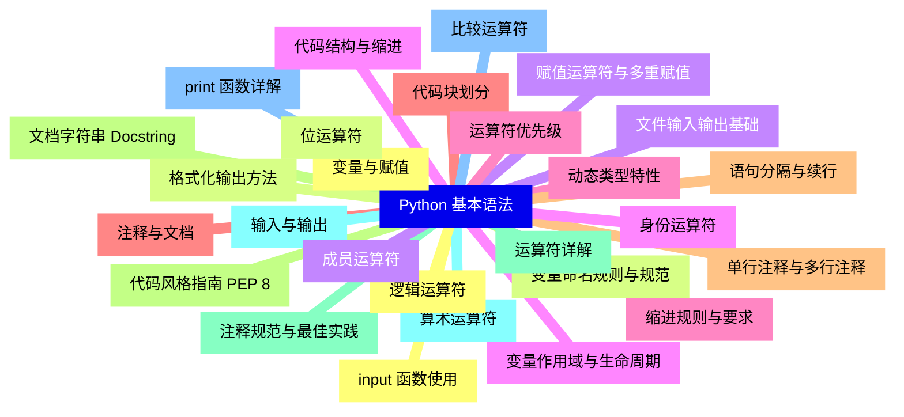
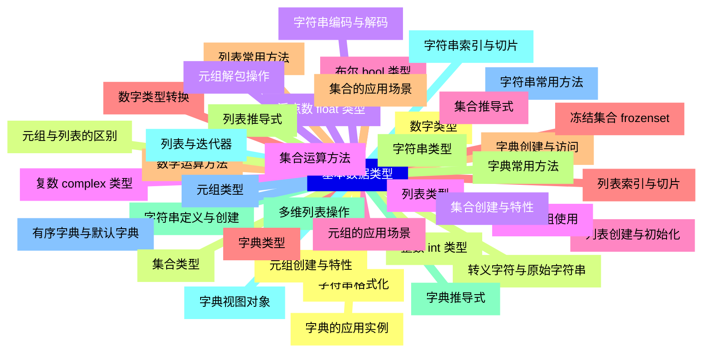
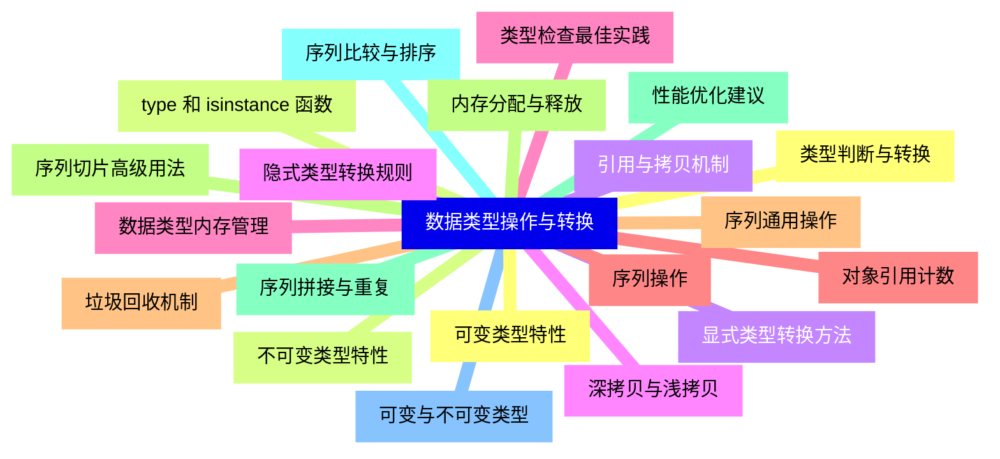
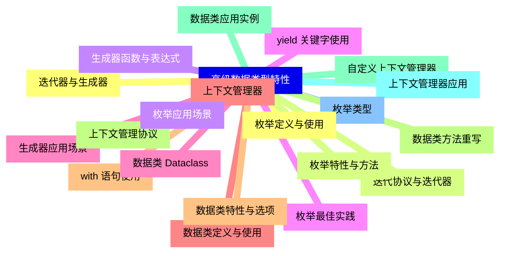
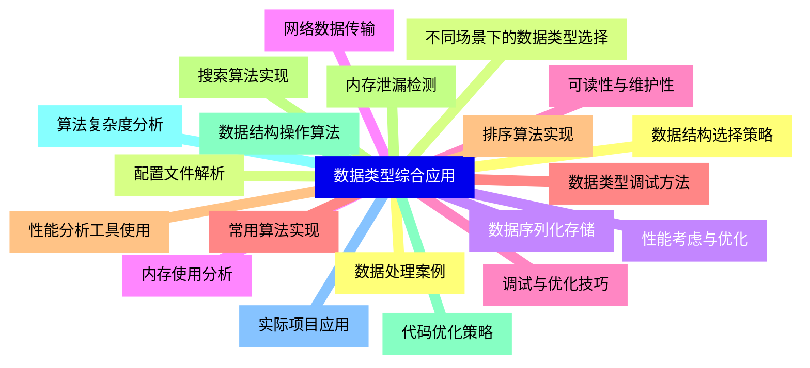


### 1 [Python 基本语法](#1)
#### 1.1 [变量与赋值](#1)
#### 1.2 [变量命名规则与规范](#1)
#### 1.3 [赋值运算符与多重赋值](#1)
#### 1.4 [变量作用域与生命周期](#1)
#### 1.5 [动态类型特性](#1)
#### 1.6 [注释与文档](#1)
#### 1.7 [单行注释与多行注释](#1)
#### 1.8 [文档字符串 Docstring](#1)
#### 1.9 [注释规范与最佳实践](#1)
#### 1.10 [输入与输出](#1)
#### 1.11 [print   函数详解](#1)
#### 1.12 [input   函数使用](#1)
#### 1.13 [格式化输出方法](#1)
#### 1.14 [文件输入输出基础](#1)
#### 1.15 [代码结构与缩进](#1)
#### 1.16 [缩进规则与要求](#1)
#### 1.17 [代码块划分](#1)
#### 1.18 [语句分隔与续行](#1)
#### 1.19 [代码风格指南 PEP 8](#1)
#### 1.20 [运算符详解](#1)
#### 1.21 [算术运算符](#1)
#### 1.22 [比较运算符](#1)
#### 1.23 [逻辑运算符](#1)
#### 1.24 [位运算符](#1)
#### 1.25 [成员运算符](#1)
#### 1.26 [身份运算符](#1)
#### 1.27 [运算符优先级](#1)
### 2 [基本数据类型](#2)
#### 2.1 [数字类型](#2)
#### 2.2 [整数 int 类型](#2)
#### 2.3 [浮点数 float 类型](#2)
#### 2.4 [复数 complex 类型](#2)
#### 2.5 [布尔 bool 类型](#2)
#### 2.6 [数字类型转换](#2)
#### 2.7 [数学运算方法](#2)
#### 2.8 [字符串类型](#2)
#### 2.9 [字符串定义与创建](#2)
#### 2.10 [字符串索引与切片](#2)
#### 2.11 [字符串常用方法](#2)
#### 2.12 [字符串格式化](#2)
#### 2.13 [转义字符与原始字符串](#2)
#### 2.14 [字符串编码与解码](#2)
#### 2.15 [列表类型](#2)
#### 2.16 [列表创建与初始化](#2)
#### 2.17 [列表索引与切片](#2)
#### 2.18 [列表常用方法](#2)
#### 2.19 [列表推导式](#2)
#### 2.20 [多维列表操作](#2)
#### 2.21 [列表与迭代器](#2)
#### 2.22 [元组类型](#2)
#### 2.23 [元组创建与特性](#2)
#### 2.24 [元组与列表的区别](#2)
#### 2.25 [元组解包操作](#2)
#### 2.26 [命名元组使用](#2)
#### 2.27 [元组的应用场景](#2)
#### 2.28 [字典类型](#2)
#### 2.29 [字典创建与访问](#2)
#### 2.30 [字典常用方法](#2)
#### 2.31 [字典推导式](#2)
#### 2.32 [字典视图对象](#2)
#### 2.33 [有序字典与默认字典](#2)
#### 2.34 [字典的应用实例](#2)
#### 2.35 [集合类型](#2)
#### 2.36 [集合创建与特性](#2)
#### 2.37 [集合运算方法](#2)
#### 2.38 [集合推导式](#2)
#### 2.39 [冻结集合 frozenset](#2)
#### 2.40 [集合的应用场景](#2)
### 3 [数据类型操作与转换](#3)
#### 3.1 [类型判断与转换](#3)
#### 3.2 [type   和 isinstance   函数](#3)
#### 3.3 [显式类型转换方法](#3)
#### 3.4 [隐式类型转换规则](#3)
#### 3.5 [类型检查最佳实践](#3)
#### 3.6 [序列操作](#3)
#### 3.7 [序列通用操作](#3)
#### 3.8 [序列切片高级用法](#3)
#### 3.9 [序列拼接与重复](#3)
#### 3.10 [序列比较与排序](#3)
#### 3.11 [可变与不可变类型](#3)
#### 3.12 [可变类型特性](#3)
#### 3.13 [不可变类型特性](#3)
#### 3.14 [引用与拷贝机制](#3)
#### 3.15 [深拷贝与浅拷贝](#3)
#### 3.16 [数据类型内存管理](#3)
#### 3.17 [对象引用计数](#3)
#### 3.18 [垃圾回收机制](#3)
#### 3.19 [内存分配与释放](#3)
#### 3.20 [性能优化建议](#3)
### 4 [高级数据类型特性](#4)
#### 4.1 [迭代器与生成器](#4)
#### 4.2 [迭代协议与迭代器](#4)
#### 4.3 [生成器函数与表达式](#4)
#### 4.4 [yield 关键字使用](#4)
#### 4.5 [生成器应用场景](#4)
#### 4.6 [上下文管理器](#4)
#### 4.7 [with 语句使用](#4)
#### 4.8 [上下文管理协议](#4)
#### 4.9 [自定义上下文管理器](#4)
#### 4.10 [上下文管理器应用](#4)
#### 4.11 [枚举类型](#4)
#### 4.12 [枚举定义与使用](#4)
#### 4.13 [枚举特性与方法](#4)
#### 4.14 [枚举应用场景](#4)
#### 4.15 [枚举最佳实践](#4)
#### 4.16 [数据类 Dataclass](#4)
#### 4.17 [数据类定义与使用](#4)
#### 4.18 [数据类特性与选项](#4)
#### 4.19 [数据类方法重写](#4)
#### 4.20 [数据类应用实例](#4)
### 5 [数据类型综合应用](#5)
#### 5.1 [数据结构选择策略](#5)
#### 5.2 [不同场景下的数据类型选择](#5)
#### 5.3 [性能考虑与优化](#5)
#### 5.4 [内存使用分析](#5)
#### 5.5 [可读性与维护性](#5)
#### 5.6 [常用算法实现](#5)
#### 5.7 [排序算法实现](#5)
#### 5.8 [搜索算法实现](#5)
#### 5.9 [数据结构操作算法](#5)
#### 5.10 [算法复杂度分析](#5)
#### 5.11 [实际项目应用](#5)
#### 5.12 [数据处理案例](#5)
#### 5.13 [配置文件解析](#5)
#### 5.14 [数据序列化存储](#5)
#### 5.15 [网络数据传输](#5)
#### 5.16 [调试与优化技巧](#5)
#### 5.17 [数据类型调试方法](#5)
#### 5.18 [性能分析工具使用](#5)
#### 5.19 [内存泄漏检测](#5)
#### 5.20 [代码优化策略](#5)




### 1 Python 基本语法

---
### 1 Python 基本语法
___
#### 1.1 变量与赋值
___
#### 1.2 变量命名规则与规范
___
#### 1.3 赋值运算符与多重赋值
___
#### 1.4 变量作用域与生命周期
___
#### 1.5 动态类型特性
___
#### 1.6 注释与文档
___
#### 1.7 单行注释与多行注释
___
#### 1.8 文档字符串 Docstring
___
#### 1.9 注释规范与最佳实践
___
#### 1.10 输入与输出
___
#### 1.11 print   函数详解
___
#### 1.12 input   函数使用
___
#### 1.13 格式化输出方法
___
#### 1.14 文件输入输出基础
___
#### 1.15 代码结构与缩进
___
#### 1.16 缩进规则与要求
___
#### 1.17 代码块划分
___
#### 1.18 语句分隔与续行
___
#### 1.19 代码风格指南 PEP 8
___
#### 1.20 运算符详解
___
#### 1.21 算术运算符
___
#### 1.22 比较运算符
___
#### 1.23 逻辑运算符
___
#### 1.24 位运算符
___
#### 1.25 成员运算符
___
#### 1.26 身份运算符
___
#### 1.27 运算符优先级
### 2 基本数据类型

---
### 2 基本数据类型
___
#### 2.1 数字类型
___
#### 2.2 整数 int 类型
___
#### 2.3 浮点数 float 类型
___
#### 2.4 复数 complex 类型
___
#### 2.5 布尔 bool 类型
___
#### 2.6 数字类型转换
___
#### 2.7 数学运算方法
___
#### 2.8 字符串类型
___
#### 2.9 字符串定义与创建
___
#### 2.10 字符串索引与切片
___
#### 2.11 字符串常用方法
___
#### 2.12 字符串格式化
___
#### 2.13 转义字符与原始字符串
___
#### 2.14 字符串编码与解码
___
#### 2.15 列表类型
___
#### 2.16 列表创建与初始化
___
#### 2.17 列表索引与切片
___
#### 2.18 列表常用方法
___
#### 2.19 列表推导式
___
#### 2.20 多维列表操作
___
#### 2.21 列表与迭代器
___
#### 2.22 元组类型
___
#### 2.23 元组创建与特性
___
#### 2.24 元组与列表的区别
___
#### 2.25 元组解包操作
___
#### 2.26 命名元组使用
___
#### 2.27 元组的应用场景
___
#### 2.28 字典类型
___
#### 2.29 字典创建与访问
___
#### 2.30 字典常用方法
___
#### 2.31 字典推导式
___
#### 2.32 字典视图对象
___
#### 2.33 有序字典与默认字典
___
#### 2.34 字典的应用实例
___
#### 2.35 集合类型
___
#### 2.36 集合创建与特性
___
#### 2.37 集合运算方法
___
#### 2.38 集合推导式
___
#### 2.39 冻结集合 frozenset
___
#### 2.40 集合的应用场景
### 3 数据类型操作与转换

---
### 3 数据类型操作与转换
___
#### 3.1 类型判断与转换
___
#### 3.2 type   和 isinstance   函数
___
#### 3.3 显式类型转换方法
___
#### 3.4 隐式类型转换规则
___
#### 3.5 类型检查最佳实践
___
#### 3.6 序列操作
___
#### 3.7 序列通用操作
___
#### 3.8 序列切片高级用法
___
#### 3.9 序列拼接与重复
___
#### 3.10 序列比较与排序
___
#### 3.11 可变与不可变类型
___
#### 3.12 可变类型特性
___
#### 3.13 不可变类型特性
___
#### 3.14 引用与拷贝机制
___
#### 3.15 深拷贝与浅拷贝
___
#### 3.16 数据类型内存管理
___
#### 3.17 对象引用计数
___
#### 3.18 垃圾回收机制
___
#### 3.19 内存分配与释放
___
#### 3.20 性能优化建议
### 4 高级数据类型特性

---
### 4 高级数据类型特性
___
#### 4.1 迭代器与生成器
___
#### 4.2 迭代协议与迭代器
___
#### 4.3 生成器函数与表达式
___
#### 4.4 yield 关键字使用
___
#### 4.5 生成器应用场景
___
#### 4.6 上下文管理器
___
#### 4.7 with 语句使用
___
#### 4.8 上下文管理协议
___
#### 4.9 自定义上下文管理器
___
#### 4.10 上下文管理器应用
___
#### 4.11 枚举类型
___
#### 4.12 枚举定义与使用
___
#### 4.13 枚举特性与方法
___
#### 4.14 枚举应用场景
___
#### 4.15 枚举最佳实践
___
#### 4.16 数据类 Dataclass
___
#### 4.17 数据类定义与使用
___
#### 4.18 数据类特性与选项
___
#### 4.19 数据类方法重写
___
#### 4.20 数据类应用实例
### 5 数据类型综合应用

---
### 5 数据类型综合应用
___
#### 5.1 数据结构选择策略
___
#### 5.2 不同场景下的数据类型选择
___
#### 5.3 性能考虑与优化
___
#### 5.4 内存使用分析
___
#### 5.5 可读性与维护性
___
#### 5.6 常用算法实现
___
#### 5.7 排序算法实现
___
#### 5.8 搜索算法实现
___
#### 5.9 数据结构操作算法
___
#### 5.10 算法复杂度分析
___
#### 5.11 实际项目应用
___
#### 5.12 数据处理案例
___
#### 5.13 配置文件解析
___
#### 5.14 数据序列化存储
___
#### 5.15 网络数据传输
___
#### 5.16 调试与优化技巧
___
#### 5.17 数据类型调试方法
___
#### 5.18 性能分析工具使用
___
#### 5.19 内存泄漏检测
___
#### 5.20 代码优化策略


### 1 Python 基本语法{#1}

{}

<--->
{}
{}
{}
{}
{}
{}
{}
{}
{}
{}
{}
{}
{}
{}
{}
{}
{}
{}
{}
{}
{}
{}
{}
{}
{}
{}
{}
{}
{}
{}
{}
{}
{}
{}
{}
{}
{}
{}
{}
{}
{}
{}
{}
{}
{}
{}
{}
{}
{}
{}
{}
{}
{}
{}
{}

### 2 基本数据类型{#2}

{}
{}
{}
{}
{}
{}
{}
{}
{}
{}
{}
{}
{}
{}
{}
{}
{}
{}
{}
{}
{}
{}
{}
{}
{}
{}
{}
{}
{}
{}
{}
{}
{}
{}
{}
{}
{}
{}
{}
{}
{}
{}
{}
{}
{}
{}
{}
{}
{}
{}
{}
{}
{}
{}
{}
{}
{}
{}
{}
{}
{}
{}
{}
{}
{}
{}
{}
{}
{}
{}
{}
{}
{}
{}
{}
{}
{}
{}
{}
{}
{}
<--->

{}

### 3 数据类型操作与转换{#3}

{}

<--->
{}
{}
{}
{}
{}
{}
{}
{}
{}
{}
{}
{}
{}
{}
{}
{}
{}
{}
{}
{}
{}
{}
{}
{}
{}
{}
{}
{}
{}
{}
{}
{}
{}
{}
{}
{}
{}
{}
{}
{}
{}

### 4 高级数据类型特性{#4}

{}
{}
{}
{}
{}
{}
{}
{}
{}
{}
{}
{}
{}
{}
{}
{}
{}
{}
{}
{}
{}
{}
{}
{}
{}
{}
{}
{}
{}
{}
{}
{}
{}
{}
{}
{}
{}
{}
{}
{}
{}
<--->

{}

### 5 数据类型综合应用{#5}

{}

<--->
{}
{}
{}
{}
{}
{}
{}
{}
{}
{}
{}
{}
{}
{}
{}
{}
{}
{}
{}
{}
{}
{}
{}
{}
{}
{}
{}
{}
{}
{}
{}
{}
{}
{}
{}
{}
{}
{}
{}
{}
{}
