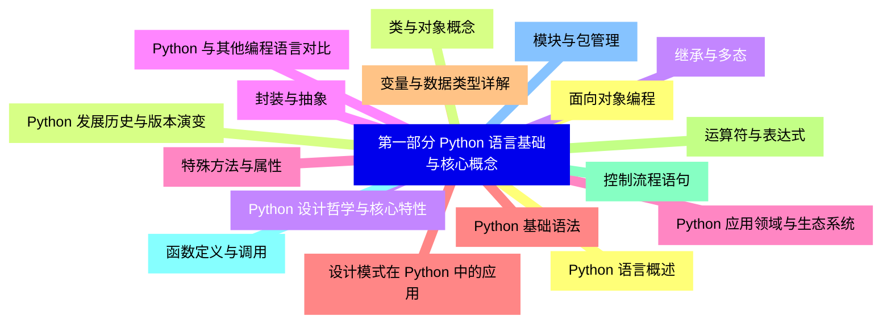
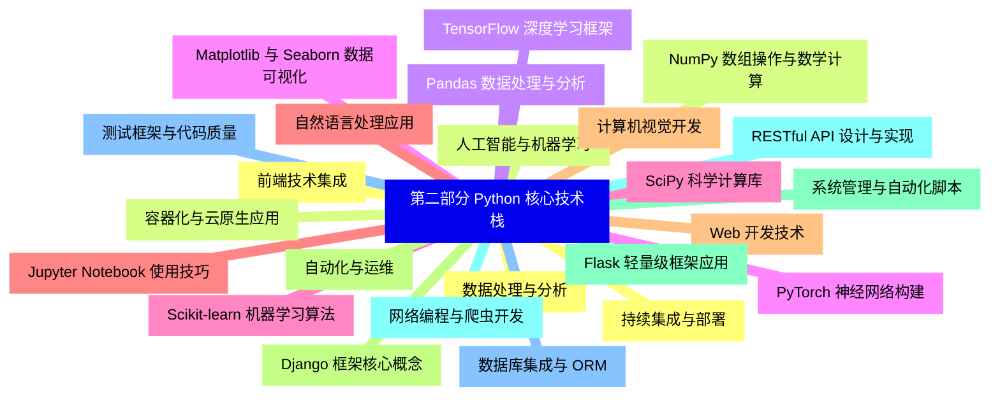
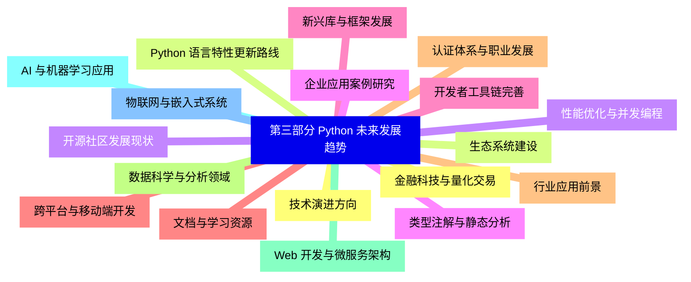
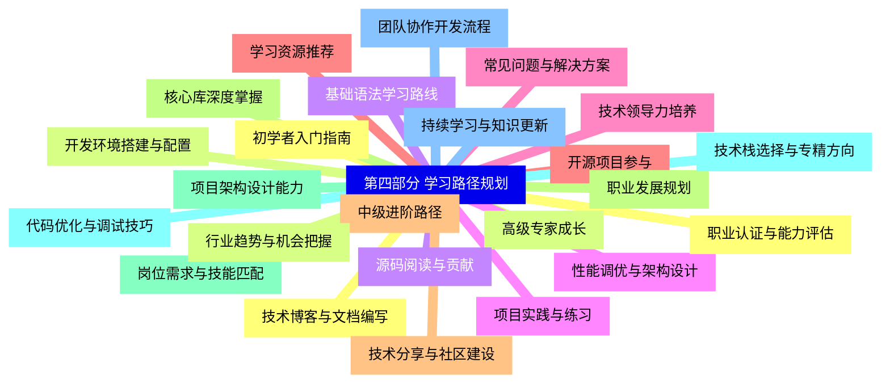
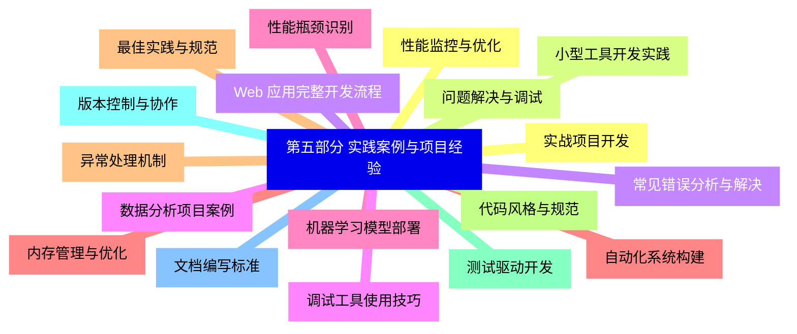
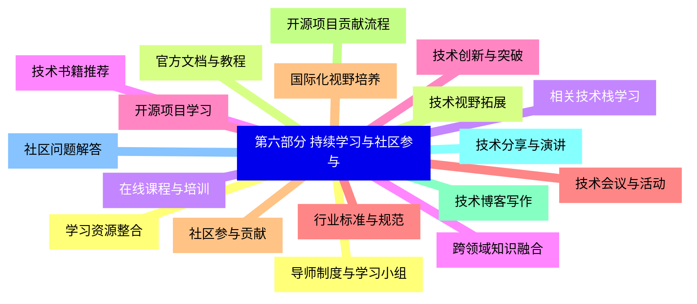


### 1 [第一部分 Python 语言基础与核心概念](#1)
#### 1.1 [Python 语言概述](#1)
#### 1.2 [Python 发展历史与版本演变](#1)
#### 1.3 [Python 设计哲学与核心特性](#1)
#### 1.4 [Python 与其他编程语言对比](#1)
#### 1.5 [Python 应用领域与生态系统](#1)
#### 1.6 [Python 基础语法](#1)
#### 1.7 [变量与数据类型详解](#1)
#### 1.8 [运算符与表达式](#1)
#### 1.9 [控制流程语句](#1)
#### 1.10 [函数定义与调用](#1)
#### 1.11 [模块与包管理](#1)
#### 1.12 [面向对象编程](#1)
#### 1.13 [类与对象概念](#1)
#### 1.14 [继承与多态](#1)
#### 1.15 [封装与抽象](#1)
#### 1.16 [特殊方法与属性](#1)
#### 1.17 [设计模式在 Python 中的应用](#1)
### 2 [第二部分 Python 核心技术栈](#2)
#### 2.1 [数据处理与分析](#2)
#### 2.2 [NumPy 数组操作与数学计算](#2)
#### 2.3 [Pandas 数据处理与分析](#2)
#### 2.4 [Matplotlib 与 Seaborn 数据可视化](#2)
#### 2.5 [SciPy 科学计算库](#2)
#### 2.6 [Jupyter Notebook 使用技巧](#2)
#### 2.7 [Web 开发技术](#2)
#### 2.8 [Django 框架核心概念](#2)
#### 2.9 [Flask 轻量级框架应用](#2)
#### 2.10 [RESTful API 设计与实现](#2)
#### 2.11 [数据库集成与 ORM](#2)
#### 2.12 [前端技术集成](#2)
#### 2.13 [人工智能与机器学习](#2)
#### 2.14 [TensorFlow 深度学习框架](#2)
#### 2.15 [PyTorch 神经网络构建](#2)
#### 2.16 [Scikit-learn 机器学习算法](#2)
#### 2.17 [自然语言处理应用](#2)
#### 2.18 [计算机视觉开发](#2)
#### 2.19 [自动化与运维](#2)
#### 2.20 [系统管理与自动化脚本](#2)
#### 2.21 [网络编程与爬虫开发](#2)
#### 2.22 [测试框架与代码质量](#2)
#### 2.23 [持续集成与部署](#2)
#### 2.24 [容器化与云原生应用](#2)
### 3 [第三部分 Python 未来发展趋势](#3)
#### 3.1 [技术演进方向](#3)
#### 3.2 [Python 语言特性更新路线](#3)
#### 3.3 [性能优化与并发编程](#3)
#### 3.4 [类型注解与静态分析](#3)
#### 3.5 [新兴库与框架发展](#3)
#### 3.6 [跨平台与移动端开发](#3)
#### 3.7 [行业应用前景](#3)
#### 3.8 [数据科学与分析领域](#3)
#### 3.9 [Web 开发与微服务架构](#3)
#### 3.10 [AI 与机器学习应用](#3)
#### 3.11 [物联网与嵌入式系统](#3)
#### 3.12 [金融科技与量化交易](#3)
#### 3.13 [生态系统建设](#3)
#### 3.14 [开源社区发展现状](#3)
#### 3.15 [企业应用案例研究](#3)
#### 3.16 [开发者工具链完善](#3)
#### 3.17 [文档与学习资源](#3)
#### 3.18 [认证体系与职业发展](#3)
### 4 [第四部分 学习路径规划](#4)
#### 4.1 [初学者入门指南](#4)
#### 4.2 [开发环境搭建与配置](#4)
#### 4.3 [基础语法学习路线](#4)
#### 4.4 [项目实践与练习](#4)
#### 4.5 [常见问题与解决方案](#4)
#### 4.6 [学习资源推荐](#4)
#### 4.7 [中级进阶路径](#4)
#### 4.8 [核心库深度掌握](#4)
#### 4.9 [项目架构设计能力](#4)
#### 4.10 [代码优化与调试技巧](#4)
#### 4.11 [团队协作开发流程](#4)
#### 4.12 [技术博客与文档编写](#4)
#### 4.13 [高级专家成长](#4)
#### 4.14 [源码阅读与贡献](#4)
#### 4.15 [性能调优与架构设计](#4)
#### 4.16 [技术领导力培养](#4)
#### 4.17 [开源项目参与](#4)
#### 4.18 [技术分享与社区建设](#4)
#### 4.19 [职业发展规划](#4)
#### 4.20 [岗位需求与技能匹配](#4)
#### 4.21 [技术栈选择与专精方向](#4)
#### 4.22 [持续学习与知识更新](#4)
#### 4.23 [职业认证与能力评估](#4)
#### 4.24 [行业趋势与机会把握](#4)
### 5 [第五部分 实践案例与项目经验](#5)
#### 5.1 [实战项目开发](#5)
#### 5.2 [小型工具开发实践](#5)
#### 5.3 [Web 应用完整开发流程](#5)
#### 5.4 [数据分析项目案例](#5)
#### 5.5 [机器学习模型部署](#5)
#### 5.6 [自动化系统构建](#5)
#### 5.7 [最佳实践与规范](#5)
#### 5.8 [代码风格与规范](#5)
#### 5.9 [测试驱动开发](#5)
#### 5.10 [版本控制与协作](#5)
#### 5.11 [文档编写标准](#5)
#### 5.12 [性能监控与优化](#5)
#### 5.13 [问题解决与调试](#5)
#### 5.14 [常见错误分析与解决](#5)
#### 5.15 [调试工具使用技巧](#5)
#### 5.16 [性能瓶颈识别](#5)
#### 5.17 [内存管理与优化](#5)
#### 5.18 [异常处理机制](#5)
### 6 [第六部分 持续学习与社区参与](#6)
#### 6.1 [学习资源整合](#6)
#### 6.2 [官方文档与教程](#6)
#### 6.3 [在线课程与培训](#6)
#### 6.4 [技术书籍推荐](#6)
#### 6.5 [开源项目学习](#6)
#### 6.6 [技术会议与活动](#6)
#### 6.7 [社区参与贡献](#6)
#### 6.8 [开源项目贡献流程](#6)
#### 6.9 [技术博客写作](#6)
#### 6.10 [技术分享与演讲](#6)
#### 6.11 [社区问题解答](#6)
#### 6.12 [导师制度与学习小组](#6)
#### 6.13 [技术视野拓展](#6)
#### 6.14 [相关技术栈学习](#6)
#### 6.15 [跨领域知识融合](#6)
#### 6.16 [技术创新与突破](#6)
#### 6.17 [行业标准与规范](#6)
#### 6.18 [国际化视野培养](#6)




### 1 第一部分 Python 语言基础与核心概念

---
### 1 第一部分 Python 语言基础与核心概念
___
#### 1.1 Python 语言概述
___
#### 1.2 Python 发展历史与版本演变
___
#### 1.3 Python 设计哲学与核心特性
___
#### 1.4 Python 与其他编程语言对比
___
#### 1.5 Python 应用领域与生态系统
___
#### 1.6 Python 基础语法
___
#### 1.7 变量与数据类型详解
___
#### 1.8 运算符与表达式
___
#### 1.9 控制流程语句
___
#### 1.10 函数定义与调用
___
#### 1.11 模块与包管理
___
#### 1.12 面向对象编程
___
#### 1.13 类与对象概念
___
#### 1.14 继承与多态
___
#### 1.15 封装与抽象
___
#### 1.16 特殊方法与属性
___
#### 1.17 设计模式在 Python 中的应用
### 2 第二部分 Python 核心技术栈

---
### 2 第二部分 Python 核心技术栈
___
#### 2.1 数据处理与分析
___
#### 2.2 NumPy 数组操作与数学计算
___
#### 2.3 Pandas 数据处理与分析
___
#### 2.4 Matplotlib 与 Seaborn 数据可视化
___
#### 2.5 SciPy 科学计算库
___
#### 2.6 Jupyter Notebook 使用技巧
___
#### 2.7 Web 开发技术
___
#### 2.8 Django 框架核心概念
___
#### 2.9 Flask 轻量级框架应用
___
#### 2.10 RESTful API 设计与实现
___
#### 2.11 数据库集成与 ORM
___
#### 2.12 前端技术集成
___
#### 2.13 人工智能与机器学习
___
#### 2.14 TensorFlow 深度学习框架
___
#### 2.15 PyTorch 神经网络构建
___
#### 2.16 Scikit-learn 机器学习算法
___
#### 2.17 自然语言处理应用
___
#### 2.18 计算机视觉开发
___
#### 2.19 自动化与运维
___
#### 2.20 系统管理与自动化脚本
___
#### 2.21 网络编程与爬虫开发
___
#### 2.22 测试框架与代码质量
___
#### 2.23 持续集成与部署
___
#### 2.24 容器化与云原生应用
### 3 第三部分 Python 未来发展趋势

---
### 3 第三部分 Python 未来发展趋势
___
#### 3.1 技术演进方向
___
#### 3.2 Python 语言特性更新路线
___
#### 3.3 性能优化与并发编程
___
#### 3.4 类型注解与静态分析
___
#### 3.5 新兴库与框架发展
___
#### 3.6 跨平台与移动端开发
___
#### 3.7 行业应用前景
___
#### 3.8 数据科学与分析领域
___
#### 3.9 Web 开发与微服务架构
___
#### 3.10 AI 与机器学习应用
___
#### 3.11 物联网与嵌入式系统
___
#### 3.12 金融科技与量化交易
___
#### 3.13 生态系统建设
___
#### 3.14 开源社区发展现状
___
#### 3.15 企业应用案例研究
___
#### 3.16 开发者工具链完善
___
#### 3.17 文档与学习资源
___
#### 3.18 认证体系与职业发展
### 4 第四部分 学习路径规划

---
### 4 第四部分 学习路径规划
___
#### 4.1 初学者入门指南
___
#### 4.2 开发环境搭建与配置
___
#### 4.3 基础语法学习路线
___
#### 4.4 项目实践与练习
___
#### 4.5 常见问题与解决方案
___
#### 4.6 学习资源推荐
___
#### 4.7 中级进阶路径
___
#### 4.8 核心库深度掌握
___
#### 4.9 项目架构设计能力
___
#### 4.10 代码优化与调试技巧
___
#### 4.11 团队协作开发流程
___
#### 4.12 技术博客与文档编写
___
#### 4.13 高级专家成长
___
#### 4.14 源码阅读与贡献
___
#### 4.15 性能调优与架构设计
___
#### 4.16 技术领导力培养
___
#### 4.17 开源项目参与
___
#### 4.18 技术分享与社区建设
___
#### 4.19 职业发展规划
___
#### 4.20 岗位需求与技能匹配
___
#### 4.21 技术栈选择与专精方向
___
#### 4.22 持续学习与知识更新
___
#### 4.23 职业认证与能力评估
___
#### 4.24 行业趋势与机会把握
### 5 第五部分 实践案例与项目经验

---
### 5 第五部分 实践案例与项目经验
___
#### 5.1 实战项目开发
___
#### 5.2 小型工具开发实践
___
#### 5.3 Web 应用完整开发流程
___
#### 5.4 数据分析项目案例
___
#### 5.5 机器学习模型部署
___
#### 5.6 自动化系统构建
___
#### 5.7 最佳实践与规范
___
#### 5.8 代码风格与规范
___
#### 5.9 测试驱动开发
___
#### 5.10 版本控制与协作
___
#### 5.11 文档编写标准
___
#### 5.12 性能监控与优化
___
#### 5.13 问题解决与调试
___
#### 5.14 常见错误分析与解决
___
#### 5.15 调试工具使用技巧
___
#### 5.16 性能瓶颈识别
___
#### 5.17 内存管理与优化
___
#### 5.18 异常处理机制
### 6 第六部分 持续学习与社区参与

---
### 6 第六部分 持续学习与社区参与
___
#### 6.1 学习资源整合
___
#### 6.2 官方文档与教程
___
#### 6.3 在线课程与培训
___
#### 6.4 技术书籍推荐
___
#### 6.5 开源项目学习
___
#### 6.6 技术会议与活动
___
#### 6.7 社区参与贡献
___
#### 6.8 开源项目贡献流程
___
#### 6.9 技术博客写作
___
#### 6.10 技术分享与演讲
___
#### 6.11 社区问题解答
___
#### 6.12 导师制度与学习小组
___
#### 6.13 技术视野拓展
___
#### 6.14 相关技术栈学习
___
#### 6.15 跨领域知识融合
___
#### 6.16 技术创新与突破
___
#### 6.17 行业标准与规范
___
#### 6.18 国际化视野培养


### 1 第一部分 Python 语言基础与核心概念{#1}

{}

<--->
{}
{}
{}
{}
{}
{}
{}
{}
{}
{}
{}
{}
{}
{}
{}
{}
{}
{}
{}
{}
{}
{}
{}
{}
{}
{}
{}
{}
{}
{}
{}
{}
{}
{}
{}

### 2 第二部分 Python 核心技术栈{#2}

{}
{}
{}
{}
{}
{}
{}
{}
{}
{}
{}
{}
{}
{}
{}
{}
{}
{}
{}
{}
{}
{}
{}
{}
{}
{}
{}
{}
{}
{}
{}
{}
{}
{}
{}
{}
{}
{}
{}
{}
{}
{}
{}
{}
{}
{}
{}
{}
{}
<--->

{}

### 3 第三部分 Python 未来发展趋势{#3}

{}

<--->
{}
{}
{}
{}
{}
{}
{}
{}
{}
{}
{}
{}
{}
{}
{}
{}
{}
{}
{}
{}
{}
{}
{}
{}
{}
{}
{}
{}
{}
{}
{}
{}
{}
{}
{}
{}
{}

### 4 第四部分 学习路径规划{#4}

{}
{}
{}
{}
{}
{}
{}
{}
{}
{}
{}
{}
{}
{}
{}
{}
{}
{}
{}
{}
{}
{}
{}
{}
{}
{}
{}
{}
{}
{}
{}
{}
{}
{}
{}
{}
{}
{}
{}
{}
{}
{}
{}
{}
{}
{}
{}
{}
{}
<--->

{}

### 5 第五部分 实践案例与项目经验{#5}

{}

<--->
{}
{}
{}
{}
{}
{}
{}
{}
{}
{}
{}
{}
{}
{}
{}
{}
{}
{}
{}
{}
{}
{}
{}
{}
{}
{}
{}
{}
{}
{}
{}
{}
{}
{}
{}
{}
{}

### 6 第六部分 持续学习与社区参与{#6}

{}
{}
{}
{}
{}
{}
{}
{}
{}
{}
{}
{}
{}
{}
{}
{}
{}
{}
{}
{}
{}
{}
{}
{}
{}
{}
{}
{}
{}
{}
{}
{}
{}
{}
{}
{}
{}
<--->

{}
