
### 1 [运算符基础概念](#1)
#### 1.1 [运算符定义与分类](#1)
#### 1.2 [运算符的基本概念](#1)
#### 1.3 [运算符优先级与结合性](#1)
#### 1.4 [运算符重载原理](#1)
#### 1.5 [表达式组成要素](#1)
#### 1.6 [操作数与运算符关系](#1)
#### 1.7 [表达式求值过程](#1)
#### 1.8 [表达式类型推断](#1)
### 2 [算术运算符](#2)
#### 2.1 [基本算术运算符](#2)
#### 2.2 [加法运算符 +](#2)
#### 2.3 [减法运算符 -](#2)
#### 2.4 [乘法运算符 *](#2)
#### 2.5 [除法运算符 /](#2)
#### 2.6 [取模运算符 %](#2)
#### 2.7 [幂运算符 **](#2)
#### 2.8 [整除运算符 //](#2)
#### 2.9 [算术运算特性](#2)
#### 2.10 [数值类型转换规则](#2)
#### 2.11 [浮点数精度问题](#2)
#### 2.12 [大整数运算机制](#2)
### 3 [比较运算符](#3)
#### 3.1 [关系比较运算符](#3)
#### 3.2 [等于 ==](#3)
#### 3.3 [不等于 !=](#3)
#### 3.4 [大于 >](#3)
#### 3.5 [小于 <](#3)
#### 3.6 [大于等于 >=](#3)
#### 3.7 [小于等于 <=](#3)
#### 3.8 [比较运算应用](#3)
#### 3.9 [链式比较表达式](#3)
#### 3.10 [不同类型比较规则](#3)
#### 3.11 [布尔值返回特性](#3)
### 4 [赋值运算符](#4)
#### 4.1 [基本赋值运算符](#4)
#### 4.2 [简单赋值 =](#4)
#### 4.3 [增量赋值运算符](#4)
#### 4.4 [多重赋值技巧](#4)
#### 4.5 [复合赋值运算符](#4)
#### 4.6 [加法赋值 +=](#4)
#### 4.7 [减法赋值 -=](#4)
#### 4.8 [乘法赋值 *=](#4)
#### 4.9 [除法赋值 /=](#4)
#### 4.10 [取模赋值 %=](#4)
#### 4.11 [幂赋值 **=](#4)
#### 4.12 [整除赋值 //=](#4)
### 5 [逻辑运算符](#5)
#### 5.1 [布尔逻辑运算符](#5)
#### 5.2 [逻辑与 and](#5)
#### 5.3 [逻辑或 or](#5)
#### 5.4 [逻辑非 not](#5)
#### 5.5 [逻辑运算特性](#5)
#### 5.6 [短路求值机制](#5)
#### 5.7 [真值测试规则](#5)
#### 5.8 [运算符优先级关系](#5)
### 6 [位运算符](#6)
#### 6.1 [位级运算操作](#6)
#### 6.2 [按位与 &](#6)
#### 6.3 [按位或 |](#6)
#### 6.4 [按位异或 ^](#6)
#### 6.5 [按位取反 ~](#6)
#### 6.6 [左移位 <<](#6)
#### 6.7 [右移位 >>](#6)
#### 6.8 [位运算应用场景](#6)
#### 6.9 [标志位操作](#6)
#### 6.10 [权限控制实现](#6)
#### 6.11 [数据加密基础](#6)
### 7 [成员运算符](#7)
#### 7.1 [成员关系判断](#7)
#### 7.2 [in 运算符](#7)
#### 7.3 [not in 运算符](#7)
#### 7.4 [成员运算对象](#7)
#### 7.5 [字符串成员检测](#7)
#### 7.6 [列表成员检测](#7)
#### 7.7 [字典键检测](#7)
#### 7.8 [集合成员检测](#7)
### 8 [身份运算符](#8)
#### 8.1 [对象身份比较](#8)
#### 8.2 [is 运算符](#8)
#### 8.3 [is not 运算符](#8)
#### 8.4 [身份与相等区别](#8)
#### 8.5 [对象标识比较](#8)
#### 8.6 [对象值比较](#8)
#### 8.7 [小整数缓存机制](#8)
### 9 [运算符优先级](#9)
#### 9.1 [优先级层次结构](#9)
#### 9.2 [最高优先级运算符](#9)
#### 9.3 [中等优先级运算符](#9)
#### 9.4 [最低优先级运算符](#9)
#### 9.5 [优先级应用实例](#9)
#### 9.6 [复杂表达式解析](#9)
#### 9.7 [括号使用规范](#9)
#### 9.8 [常见优先级错误](#9)
### 10 [表达式类型](#10)
#### 10.1 [基本表达式](#10)
#### 10.2 [算术表达式](#10)
#### 10.3 [逻辑表达式](#10)
#### 10.4 [条件表达式](#10)
#### 10.5 [特殊表达式](#10)
#### 10.6 [元条件表达式](#10)
#### 10.7 [生成器表达式](#10)
#### 10.8 [列表推导式](#10)
#### 10.9 [字典推导式](#10)
#### 10.10 [集合推导式](#10)
### 11 [运算符重载](#11)
#### 11.1 [重载机制原理](#11)
#### 11.2 [特殊方法定义](#11)
#### 11.3 [运算符映射关系](#11)
#### 11.4 [自定义类型支持](#11)
#### 11.5 [常用重载方法](#11)
#### 11.6 [__add__ 方法](#11)
#### 11.7 [__sub__ 方法](#11)
#### 11.8 [__mul__ 方法](#11)
#### 11.9 [__eq__ 方法](#11)
#### 11.10 [__lt__ 方法](#11)
### 12 [表达式优化](#12)
#### 12.1 [性能优化技巧](#12)
#### 12.2 [常量表达式折叠](#12)
#### 12.3 [短路求值利用](#12)
#### 12.4 [表达式简化策略](#12)
#### 12.5 [可读性优化](#12)
#### 12.6 [表达式分解方法](#12)
#### 12.7 [命名表达式使用](#12)
#### 12.8 [注释添加规范](#12)
### 13 [错误处理与调试](#13)
#### 13.1 [常见运算符错误](#13)
#### 13.2 [类型不匹配错误](#13)
#### 13.3 [除零错误处理](#13)
#### 13.4 [优先级误解问题](#13)
#### 13.5 [调试技巧](#13)
#### 13.6 [表达式逐步求值](#13)
#### 13.7 [类型检查方法](#13)
#### 13.8 [单元测试编写](#13)




### 1 运算符基础概念

---
### 1 运算符基础概念
___
#### 1.1 运算符定义与分类
___
#### 1.2 运算符的基本概念
___
#### 1.3 运算符优先级与结合性
___
#### 1.4 运算符重载原理
___
#### 1.5 表达式组成要素
___
#### 1.6 操作数与运算符关系
___
#### 1.7 表达式求值过程
___
#### 1.8 表达式类型推断
### 2 算术运算符

---
### 2 算术运算符
___
#### 2.1 基本算术运算符
___
#### 2.2 加法运算符 +
___
#### 2.3 减法运算符 -
___
#### 2.4 乘法运算符 *
___
#### 2.5 除法运算符 /
___
#### 2.6 取模运算符 %
___
#### 2.7 幂运算符 **
___
#### 2.8 整除运算符 //
___
#### 2.9 算术运算特性
___
#### 2.10 数值类型转换规则
___
#### 2.11 浮点数精度问题
___
#### 2.12 大整数运算机制
### 3 比较运算符

---
### 3 比较运算符
___
#### 3.1 关系比较运算符
___
#### 3.2 等于 ==
___
#### 3.3 不等于 !=
___
#### 3.4 大于 >
___
#### 3.5 小于 <
___
#### 3.6 大于等于 >=
___
#### 3.7 小于等于 <=
___
#### 3.8 比较运算应用
___
#### 3.9 链式比较表达式
___
#### 3.10 不同类型比较规则
___
#### 3.11 布尔值返回特性
### 4 赋值运算符

---
### 4 赋值运算符
___
#### 4.1 基本赋值运算符
___
#### 4.2 简单赋值 =
___
#### 4.3 增量赋值运算符
___
#### 4.4 多重赋值技巧
___
#### 4.5 复合赋值运算符
___
#### 4.6 加法赋值 +=
___
#### 4.7 减法赋值 -=
___
#### 4.8 乘法赋值 *=
___
#### 4.9 除法赋值 /=
___
#### 4.10 取模赋值 %=
___
#### 4.11 幂赋值 **=
___
#### 4.12 整除赋值 //=
### 5 逻辑运算符

---
### 5 逻辑运算符
___
#### 5.1 布尔逻辑运算符
___
#### 5.2 逻辑与 and
___
#### 5.3 逻辑或 or
___
#### 5.4 逻辑非 not
___
#### 5.5 逻辑运算特性
___
#### 5.6 短路求值机制
___
#### 5.7 真值测试规则
___
#### 5.8 运算符优先级关系
### 6 位运算符

---
### 6 位运算符
___
#### 6.1 位级运算操作
___
#### 6.2 按位与 &
___
#### 6.3 按位或 |
___
#### 6.4 按位异或 ^
___
#### 6.5 按位取反 ~
___
#### 6.6 左移位 <<
___
#### 6.7 右移位 >>
___
#### 6.8 位运算应用场景
___
#### 6.9 标志位操作
___
#### 6.10 权限控制实现
___
#### 6.11 数据加密基础
### 7 成员运算符

---
### 7 成员运算符
___
#### 7.1 成员关系判断
___
#### 7.2 in 运算符
___
#### 7.3 not in 运算符
___
#### 7.4 成员运算对象
___
#### 7.5 字符串成员检测
___
#### 7.6 列表成员检测
___
#### 7.7 字典键检测
___
#### 7.8 集合成员检测
### 8 身份运算符

---
### 8 身份运算符
___
#### 8.1 对象身份比较
___
#### 8.2 is 运算符
___
#### 8.3 is not 运算符
___
#### 8.4 身份与相等区别
___
#### 8.5 对象标识比较
___
#### 8.6 对象值比较
___
#### 8.7 小整数缓存机制
### 9 运算符优先级

---
### 9 运算符优先级
___
#### 9.1 优先级层次结构
___
#### 9.2 最高优先级运算符
___
#### 9.3 中等优先级运算符
___
#### 9.4 最低优先级运算符
___
#### 9.5 优先级应用实例
___
#### 9.6 复杂表达式解析
___
#### 9.7 括号使用规范
___
#### 9.8 常见优先级错误
### 10 表达式类型

---
### 10 表达式类型
___
#### 10.1 基本表达式
___
#### 10.2 算术表达式
___
#### 10.3 逻辑表达式
___
#### 10.4 条件表达式
___
#### 10.5 特殊表达式
___
#### 10.6 元条件表达式
___
#### 10.7 生成器表达式
___
#### 10.8 列表推导式
___
#### 10.9 字典推导式
___
#### 10.10 集合推导式
### 11 运算符重载

---
### 11 运算符重载
___
#### 11.1 重载机制原理
___
#### 11.2 特殊方法定义
___
#### 11.3 运算符映射关系
___
#### 11.4 自定义类型支持
___
#### 11.5 常用重载方法
___
#### 11.6 __add__ 方法
___
#### 11.7 __sub__ 方法
___
#### 11.8 __mul__ 方法
___
#### 11.9 __eq__ 方法
___
#### 11.10 __lt__ 方法
### 12 表达式优化

---
### 12 表达式优化
___
#### 12.1 性能优化技巧
___
#### 12.2 常量表达式折叠
___
#### 12.3 短路求值利用
___
#### 12.4 表达式简化策略
___
#### 12.5 可读性优化
___
#### 12.6 表达式分解方法
___
#### 12.7 命名表达式使用
___
#### 12.8 注释添加规范
### 13 错误处理与调试

---
### 13 错误处理与调试
___
#### 13.1 常见运算符错误
___
#### 13.2 类型不匹配错误
___
#### 13.3 除零错误处理
___
#### 13.4 优先级误解问题
___
#### 13.5 调试技巧
___
#### 13.6 表达式逐步求值
___
#### 13.7 类型检查方法
___
#### 13.8 单元测试编写


### 1 运算符基础概念{#1}

{}
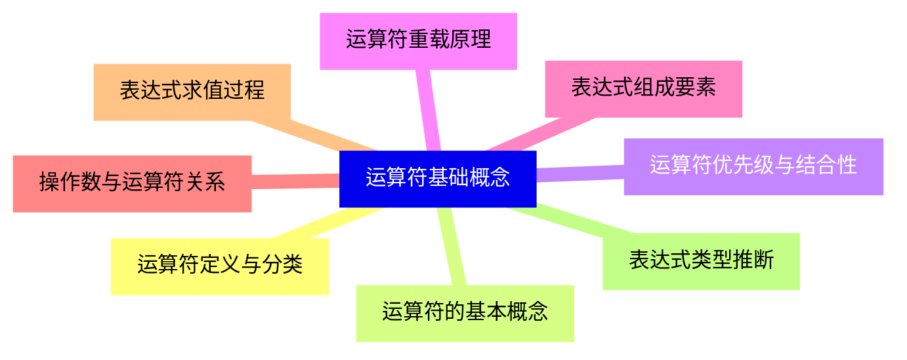

<--->
{}
{}
{}
{}
{}
{}
{}
{}
{}
{}
{}
{}
{}
{}
{}
{}
{}

### 2 算术运算符{#2}

{}
{}
{}
{}
{}
{}
{}
{}
{}
{}
{}
{{% details "取模运算符 %" %}}
{}
{}
{}
{}
{}
{}
{}
{}
{}
{}
{}
{}
{}
<--->
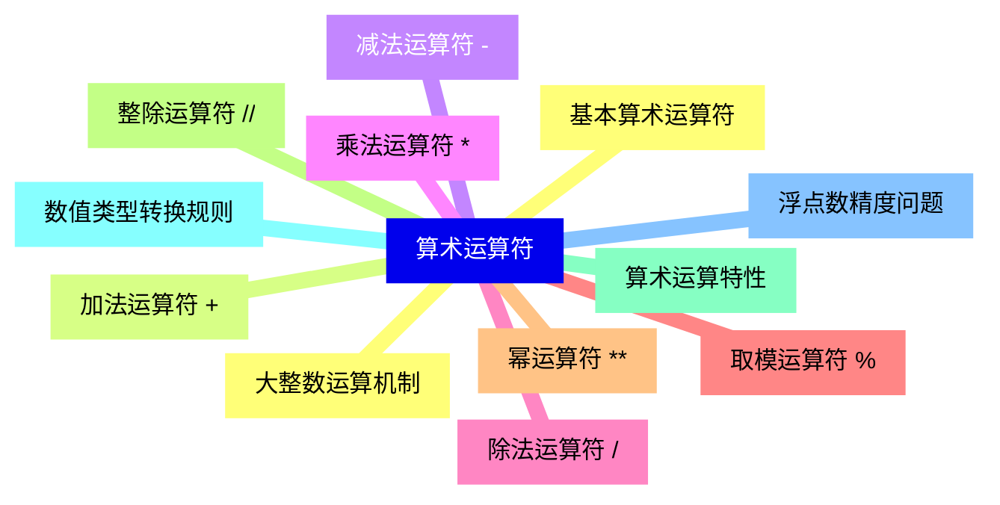

{}

### 3 比较运算符{#3}

{}
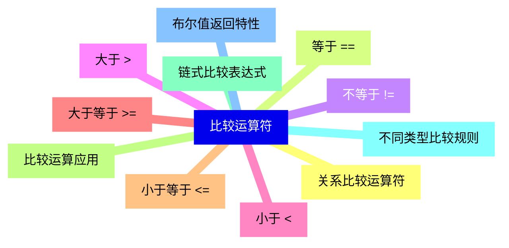

<--->
{}
{}
{}
{}
{}
{}
{}
{}
{}
{}
{}
{}
{}
{}
{}
{}
{}
{}
{}
{}
{}
{}
{}

### 4 赋值运算符{#4}

{}
{}
{}
{}
{}
{}
{}
{}
{}
{}
{}
{}
{}
{}
{}
{}
{}
{}
{}
{{% details "取模赋值 %=" %}}
{}
{}
{}
{}
{}
<--->
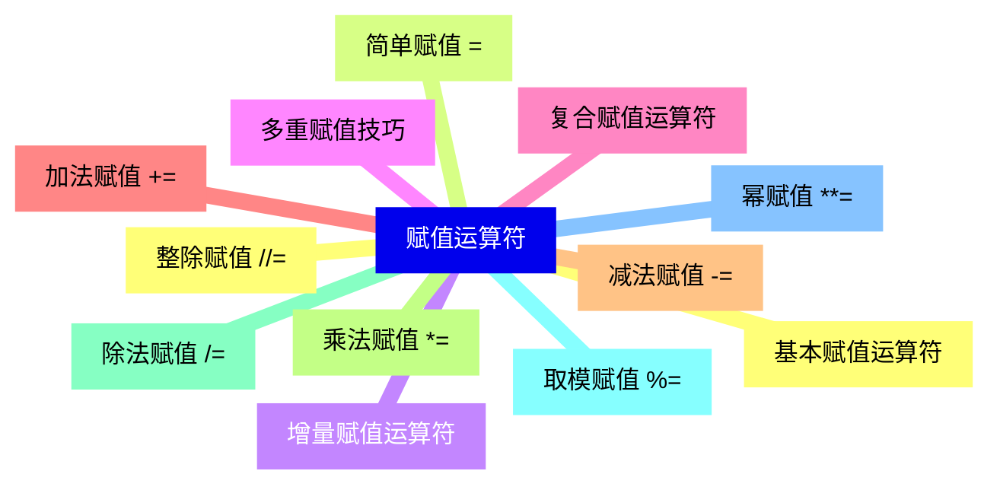

{}

### 5 逻辑运算符{#5}

{}
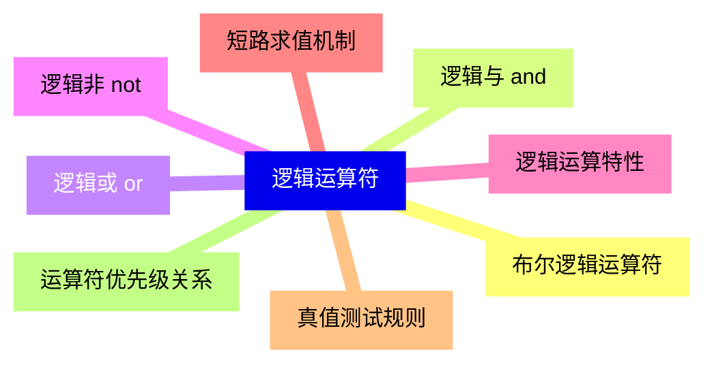

<--->
{}
{}
{}
{}
{}
{}
{}
{}
{}
{}
{}
{}
{}
{}
{}
{}
{}

### 6 位运算符{#6}

{}
{}
{}
{}
{}
{}
{}
{}
{}
{}
{}
{}
{}
{}
{}
{}
{}
{}
{}
{}
{}
{}
{}
<--->
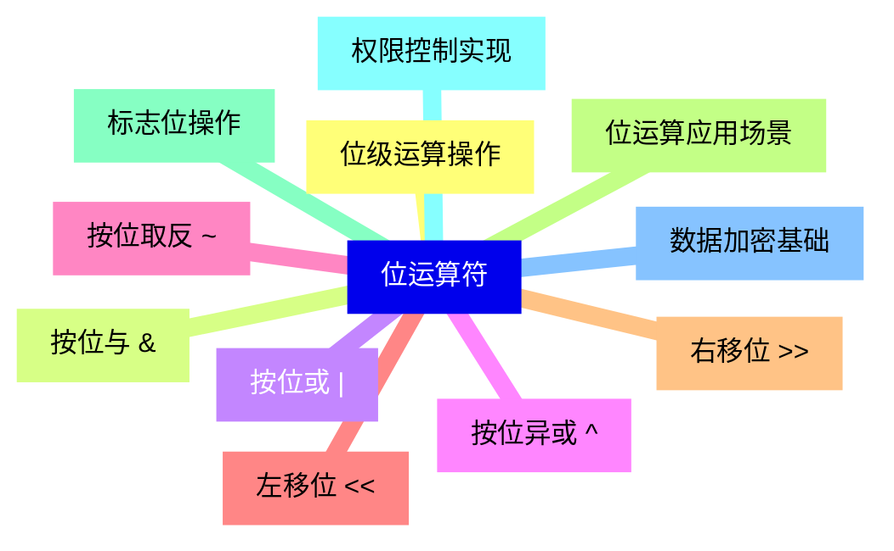

{}

### 7 成员运算符{#7}

{}
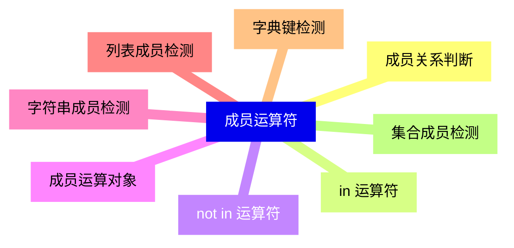

<--->
{}
{}
{}
{}
{}
{}
{}
{}
{}
{}
{}
{}
{}
{}
{}
{}
{}

### 8 身份运算符{#8}

{}
{}
{}
{}
{}
{}
{}
{}
{}
{}
{}
{}
{}
{}
{}
<--->
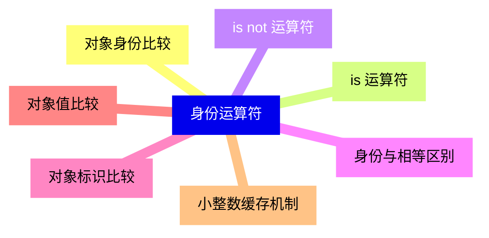

{}

### 9 运算符优先级{#9}

{}
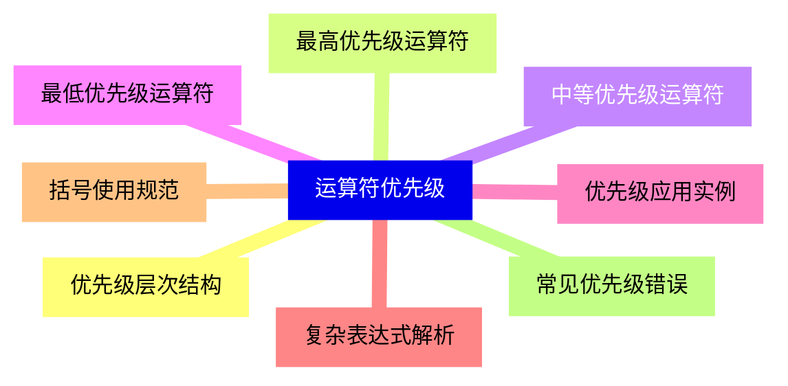

<--->
{}
{}
{}
{}
{}
{}
{}
{}
{}
{}
{}
{}
{}
{}
{}
{}
{}

### 10 表达式类型{#10}

{}
{}
{}
{}
{}
{}
{}
{}
{}
{}
{}
{}
{}
{}
{}
{}
{}
{}
{}
{}
{}
<--->
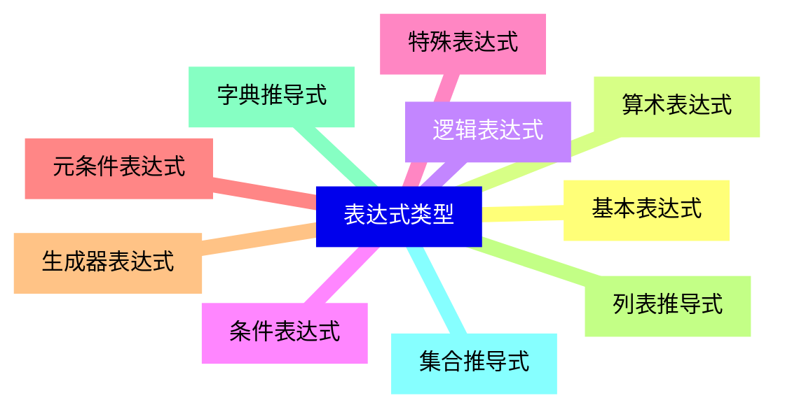

{}

### 11 运算符重载{#11}

{}
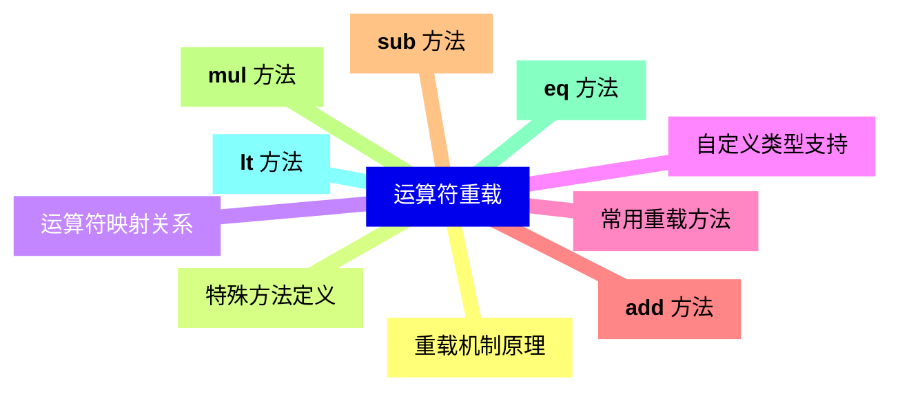

<--->
{}
{}
{}
{}
{}
{}
{}
{}
{}
{}
{}
{}
{}
{}
{}
{}
{}
{}
{}
{}
{}

### 12 表达式优化{#12}

{}
{}
{}
{}
{}
{}
{}
{}
{}
{}
{}
{}
{}
{}
{}
{}
{}
<--->
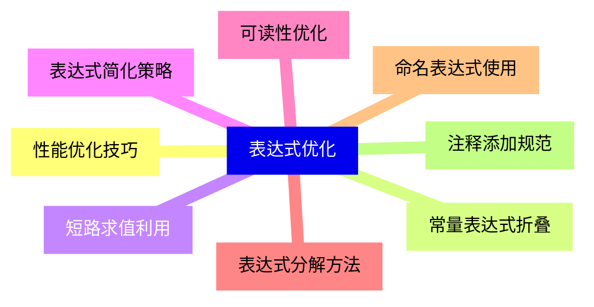

{}

### 13 错误处理与调试{#13}

{}
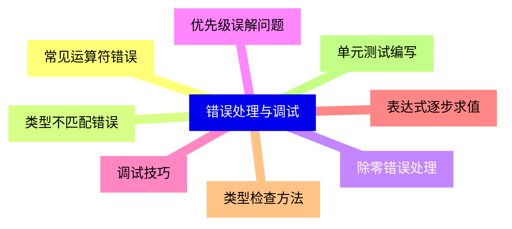

<--->
{}
{}
{}
{}
{}
{}
{}
{}
{}
{}
{}
{}
{}
{}
{}
{}
{}
