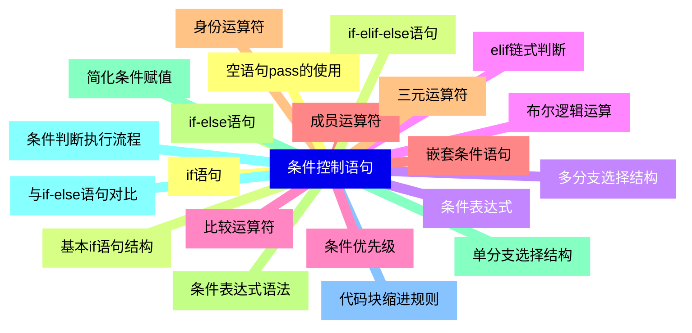
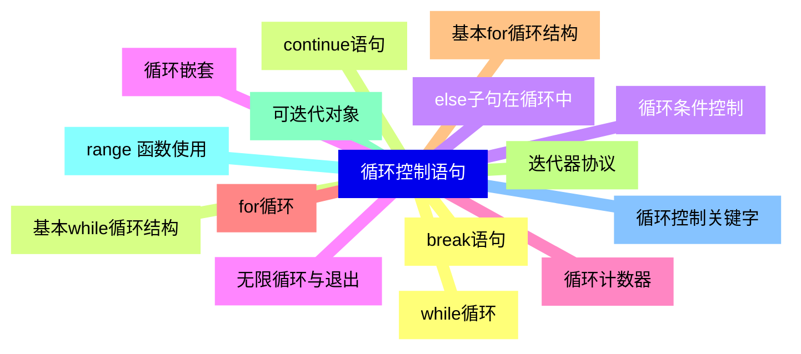
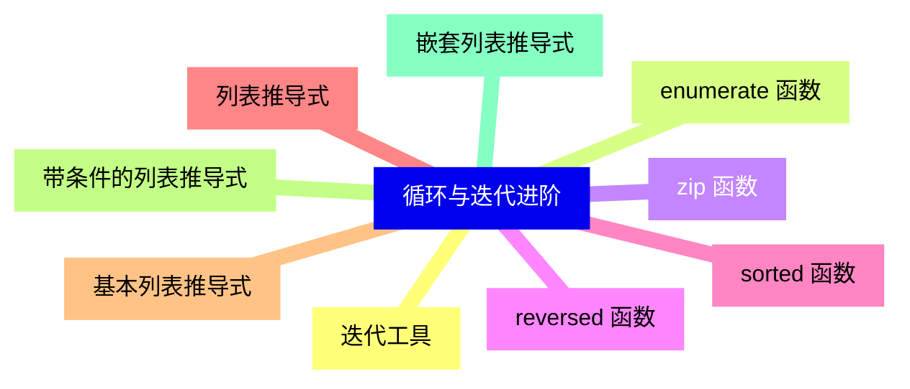


### 1 [条件控制语句](#1)
#### 1.1 [if语句](#1)
#### 1.2 [基本if语句结构](#1)
#### 1.3 [条件表达式](#1)
#### 1.4 [布尔逻辑运算](#1)
#### 1.5 [比较运算符](#1)
#### 1.6 [成员运算符](#1)
#### 1.7 [身份运算符](#1)
#### 1.8 [if-else语句](#1)
#### 1.9 [单分支选择结构](#1)
#### 1.10 [条件判断执行流程](#1)
#### 1.11 [代码块缩进规则](#1)
#### 1.12 [空语句pass的使用](#1)
#### 1.13 [if-elif-else语句](#1)
#### 1.14 [多分支选择结构](#1)
#### 1.15 [elif链式判断](#1)
#### 1.16 [条件优先级](#1)
#### 1.17 [嵌套条件语句](#1)
#### 1.18 [三元运算符](#1)
#### 1.19 [条件表达式语法](#1)
#### 1.20 [简化条件赋值](#1)
#### 1.21 [与if-else语句对比](#1)
### 2 [循环控制语句](#2)
#### 2.1 [while循环](#2)
#### 2.2 [基本while循环结构](#2)
#### 2.3 [循环条件控制](#2)
#### 2.4 [无限循环与退出](#2)
#### 2.5 [循环计数器](#2)
#### 2.6 [for循环](#2)
#### 2.7 [基本for循环结构](#2)
#### 2.8 [迭代器协议](#2)
#### 2.9 [可迭代对象](#2)
#### 2.10 [range  函数使用](#2)
#### 2.11 [循环控制关键字](#2)
#### 2.12 [break语句](#2)
#### 2.13 [continue语句](#2)
#### 2.14 [else子句在循环中](#2)
#### 2.15 [循环嵌套](#2)
### 3 [循环与迭代进阶](#3)
#### 3.1 [迭代工具](#3)
#### 3.2 [enumerate  函数](#3)
#### 3.3 [zip  函数](#3)
#### 3.4 [reversed  函数](#3)
#### 3.5 [sorted  函数](#3)
#### 3.6 [列表推导式](#3)
#### 3.7 [基本列表推导式](#3)
#### 3.8 [带条件的列表推导式](#3)
#### 3.9 [嵌套列表推导式](#3)




### 1 条件控制语句

---
### 1 条件控制语句
___
#### 1.1 if语句
___
#### 1.2 基本if语句结构
___
#### 1.3 条件表达式
___
#### 1.4 布尔逻辑运算
___
#### 1.5 比较运算符
___
#### 1.6 成员运算符
___
#### 1.7 身份运算符
___
#### 1.8 if-else语句
___
#### 1.9 单分支选择结构
___
#### 1.10 条件判断执行流程
___
#### 1.11 代码块缩进规则
___
#### 1.12 空语句pass的使用
___
#### 1.13 if-elif-else语句
___
#### 1.14 多分支选择结构
___
#### 1.15 elif链式判断
___
#### 1.16 条件优先级
___
#### 1.17 嵌套条件语句
___
#### 1.18 三元运算符
___
#### 1.19 条件表达式语法
___
#### 1.20 简化条件赋值
___
#### 1.21 与if-else语句对比
### 2 循环控制语句

---
### 2 循环控制语句
___
#### 2.1 while循环
___
#### 2.2 基本while循环结构
___
#### 2.3 循环条件控制
___
#### 2.4 无限循环与退出
___
#### 2.5 循环计数器
___
#### 2.6 for循环
___
#### 2.7 基本for循环结构
___
#### 2.8 迭代器协议
___
#### 2.9 可迭代对象
___
#### 2.10 range  函数使用
___
#### 2.11 循环控制关键字
___
#### 2.12 break语句
___
#### 2.13 continue语句
___
#### 2.14 else子句在循环中
___
#### 2.15 循环嵌套
### 3 循环与迭代进阶

---
### 3 循环与迭代进阶
___
#### 3.1 迭代工具
___
#### 3.2 enumerate  函数
___
#### 3.3 zip  函数
___
#### 3.4 reversed  函数
___
#### 3.5 sorted  函数
___
#### 3.6 列表推导式
___
#### 3.7 基本列表推导式
___
#### 3.8 带条件的列表推导式
___
#### 3.9 嵌套列表推导式


### 1 条件控制语句{#1}

{}

<--->
{}
{}
{}
{}
{}
{}
{}
{}
{}
{}
{}
{}
{}
{}
{}
{}
{}
{}
{}
{}
{}
{}
{}
{}
{}
{}
{}
{}
{}
{}
{}
{}
{}
{}
{}
{}
{}
{}
{}
{}
{}
{}
{}

### 2 循环控制语句{#2}

{}
{}
{}
{}
{}
{}
{}
{}
{}
{}
{}
{}
{}
{}
{}
{}
{}
{}
{}
{}
{}
{}
{}
{}
{}
{}
{}
{}
{}
{}
{}
<--->

{}

### 3 循环与迭代进阶{#3}

{}

<--->
{}
{}
{}
{}
{}
{}
{}
{}
{}
{}
{}
{}
{}
{}
{}
{}
{}
{}
{}
