
### 1 [序列类型概述](#1)
#### 1.1 [序列类型基本概念](#1)
#### 1.2 [序列的定义与特征](#1)
#### 1.3 [序列的通用操作](#1)
#### 1.4 [序列的分类体系](#1)
#### 1.5 [Python序列类型家族](#1)
#### 1.6 [内置序列类型](#1)
#### 1.7 [标准库序列类型](#1)
#### 1.8 [第三方序列类型](#1)
### 2 [字符串 str](#2)
#### 2.1 [字符串基础](#2)
#### 2.2 [字符串的创建与表示](#2)
#### 2.3 [字符串的不可变性](#2)
#### 2.4 [字符串编码与解码](#2)
#### 2.5 [字符串操作](#2)
#### 2.6 [索引与切片操作](#2)
#### 2.7 [字符串连接与重复](#2)
#### 2.8 [字符串格式化方法](#2)
#### 2.9 [字符串方法](#2)
#### 2.10 [查找与替换方法](#2)
#### 2.11 [大小写转换方法](#2)
#### 2.12 [分割与连接方法](#2)
#### 2.13 [判断与验证方法](#2)
#### 2.14 [字符串格式化](#2)
#### 2.15 [%格式化方法](#2)
#### 2.16 [format  方法](#2)
#### 2.17 [f-string格式化](#2)
#### 2.18 [模板字符串](#2)
### 3 [列表 list](#3)
#### 3.1 [列表基础](#3)
#### 3.2 [列表的创建与初始化](#3)
#### 3.3 [列表的可变性](#3)
#### 3.4 [列表的内存结构](#3)
#### 3.5 [列表操作](#3)
#### 3.6 [元素访问与修改](#3)
#### 3.7 [列表切片操作](#3)
#### 3.8 [列表拼接与重复](#3)
#### 3.9 [列表方法](#3)
#### 3.10 [添加元素方法](#3)
#### 3.11 [删除元素方法](#3)
#### 3.12 [排序与反转方法](#3)
#### 3.13 [查找与统计方法](#3)
#### 3.14 [列表推导式](#3)
#### 3.15 [基本列表推导式](#3)
#### 3.16 [条件列表推导式](#3)
#### 3.17 [嵌套列表推导式](#3)
### 4 [元组 tuple](#4)
#### 4.1 [元组基础](#4)
#### 4.2 [元组的创建与特性](#4)
#### 4.3 [元组的不可变性](#4)
#### 4.4 [单元素元组的特殊语法](#4)
#### 4.5 [元组操作](#4)
#### 4.6 [元组解包与打包](#4)
#### 4.7 [元组比较操作](#4)
#### 4.8 [元组作为字典键](#4)
#### 4.9 [命名元组](#4)
#### 4.10 [collections.namedtuple](#4)
#### 4.11 [命名元组的创建与使用](#4)
#### 4.12 [命名元组的优势](#4)
### 5 [字节序列](#5)
#### 5.1 [字节 bytes](#5)
#### 5.2 [bytes对象的创建](#5)
#### 5.3 [bytes的不可变性](#5)
#### 5.4 [bytes与字符串的转换](#5)
#### 5.5 [字节数组 bytearray](#5)
#### 5.6 [bytearray的可变性](#5)
#### 5.7 [bytearray的操作方法](#5)
#### 5.8 [应用场景分析](#5)
### 6 [范围 range](#6)
#### 6.1 [range对象](#6)
#### 6.2 [range的创建与参数](#6)
#### 6.3 [range的惰性求值特性](#6)
#### 6.4 [range的内存效率](#6)
#### 6.5 [range操作](#6)
#### 6.6 [range的迭代与索引](#6)
#### 6.7 [range的切片操作](#6)
#### 6.8 [range的实际应用](#6)
### 7 [序列通用操作](#7)
#### 7.1 [序列协议](#7)
#### 7.2 [序列协议的要求](#7)
#### 7.3 [自定义序列类型](#7)
#### 7.4 [序列的抽象基类](#7)
#### 7.5 [序列通用方法](#7)
#### 7.6 [长度与成员检测](#7)
#### 7.7 [最大值与最小值](#7)
#### 7.8 [求和与统计操作](#7)
#### 7.9 [序列迭代](#7)
#### 7.10 [迭代器协议](#7)
#### 7.11 [生成器表达式](#7)
#### 7.12 [序列的遍历技巧](#7)
### 8 [序列比较与排序](#8)
#### 8.1 [序列比较](#8)
#### 8.2 [序列比较规则](#8)
#### 8.3 [字典序比较](#8)
#### 8.4 [自定义比较函数](#8)
#### 8.5 [序列排序](#8)
#### 8.6 [sorted  函数](#8)
#### 8.7 [list.sort  方法](#8)
#### 8.8 [排序关键字参数](#8)
#### 8.9 [稳定排序特性](#8)
### 9 [序列高级特性](#9)
#### 9.1 [序列解包](#9)
#### 9.2 [基本解包操作](#9)
#### 9.3 [扩展解包语法](#9)
#### 9.4 [星号表达式应用](#9)
#### 9.5 [序列切片](#9)
#### 9.6 [切片语法详解](#9)
#### 9.7 [步长切片操作](#9)
#### 9.8 [切片赋值操作](#9)
#### 9.9 [序列复制](#9)
#### 9.10 [浅拷贝与深拷贝](#9)
#### 9.11 [切片复制技巧](#9)
#### 9.12 [copy模块的使用](#9)
### 10 [序列性能分析](#10)
#### 10.1 [时间复杂度分析](#10)
#### 10.2 [各类操作的时间复杂度](#10)
#### 10.3 [序列类型选择策略](#10)
#### 10.4 [性能优化技巧](#10)
#### 10.5 [内存使用分析](#10)
#### 10.6 [序列的内存布局](#10)
#### 10.7 [内存使用优化](#10)
#### 10.8 [大序列处理策略](#10)
### 11 [标准库序列类型](#11)
#### 11.1 [collections模块](#11)
#### 11.2 [deque双端队列](#11)
#### 11.3 [Counter计数器](#11)
#### 11.4 [OrderedDict有序字典](#11)
#### 11.5 [defaultdict默认字典](#11)
#### 11.6 [array模块](#11)
#### 11.7 [array数组的创建](#11)
#### 11.8 [类型码与数据存储](#11)
#### 11.9 [array的性能优势](#11)
### 12 [序列应用实践](#12)
#### 12.1 [数据处理应用](#12)
#### 12.2 [文本处理技巧](#12)
#### 12.3 [数据清洗流程](#12)
#### 12.4 [序列在算法中的应用](#12)
#### 12.5 [性能优化实践](#12)
#### 12.6 [序列操作优化](#12)
#### 12.7 [内存使用优化](#12)
#### 12.8 [实际项目案例分析](#12)




### 1 序列类型概述

---
### 1 序列类型概述
___
#### 1.1 序列类型基本概念
___
#### 1.2 序列的定义与特征
___
#### 1.3 序列的通用操作
___
#### 1.4 序列的分类体系
___
#### 1.5 Python序列类型家族
___
#### 1.6 内置序列类型
___
#### 1.7 标准库序列类型
___
#### 1.8 第三方序列类型
### 2 字符串 str

---
### 2 字符串 str
___
#### 2.1 字符串基础
___
#### 2.2 字符串的创建与表示
___
#### 2.3 字符串的不可变性
___
#### 2.4 字符串编码与解码
___
#### 2.5 字符串操作
___
#### 2.6 索引与切片操作
___
#### 2.7 字符串连接与重复
___
#### 2.8 字符串格式化方法
___
#### 2.9 字符串方法
___
#### 2.10 查找与替换方法
___
#### 2.11 大小写转换方法
___
#### 2.12 分割与连接方法
___
#### 2.13 判断与验证方法
___
#### 2.14 字符串格式化
___
#### 2.15 %格式化方法
___
#### 2.16 format  方法
___
#### 2.17 f-string格式化
___
#### 2.18 模板字符串
### 3 列表 list

---
### 3 列表 list
___
#### 3.1 列表基础
___
#### 3.2 列表的创建与初始化
___
#### 3.3 列表的可变性
___
#### 3.4 列表的内存结构
___
#### 3.5 列表操作
___
#### 3.6 元素访问与修改
___
#### 3.7 列表切片操作
___
#### 3.8 列表拼接与重复
___
#### 3.9 列表方法
___
#### 3.10 添加元素方法
___
#### 3.11 删除元素方法
___
#### 3.12 排序与反转方法
___
#### 3.13 查找与统计方法
___
#### 3.14 列表推导式
___
#### 3.15 基本列表推导式
___
#### 3.16 条件列表推导式
___
#### 3.17 嵌套列表推导式
### 4 元组 tuple

---
### 4 元组 tuple
___
#### 4.1 元组基础
___
#### 4.2 元组的创建与特性
___
#### 4.3 元组的不可变性
___
#### 4.4 单元素元组的特殊语法
___
#### 4.5 元组操作
___
#### 4.6 元组解包与打包
___
#### 4.7 元组比较操作
___
#### 4.8 元组作为字典键
___
#### 4.9 命名元组
___
#### 4.10 collections.namedtuple
___
#### 4.11 命名元组的创建与使用
___
#### 4.12 命名元组的优势
### 5 字节序列

---
### 5 字节序列
___
#### 5.1 字节 bytes
___
#### 5.2 bytes对象的创建
___
#### 5.3 bytes的不可变性
___
#### 5.4 bytes与字符串的转换
___
#### 5.5 字节数组 bytearray
___
#### 5.6 bytearray的可变性
___
#### 5.7 bytearray的操作方法
___
#### 5.8 应用场景分析
### 6 范围 range

---
### 6 范围 range
___
#### 6.1 range对象
___
#### 6.2 range的创建与参数
___
#### 6.3 range的惰性求值特性
___
#### 6.4 range的内存效率
___
#### 6.5 range操作
___
#### 6.6 range的迭代与索引
___
#### 6.7 range的切片操作
___
#### 6.8 range的实际应用
### 7 序列通用操作

---
### 7 序列通用操作
___
#### 7.1 序列协议
___
#### 7.2 序列协议的要求
___
#### 7.3 自定义序列类型
___
#### 7.4 序列的抽象基类
___
#### 7.5 序列通用方法
___
#### 7.6 长度与成员检测
___
#### 7.7 最大值与最小值
___
#### 7.8 求和与统计操作
___
#### 7.9 序列迭代
___
#### 7.10 迭代器协议
___
#### 7.11 生成器表达式
___
#### 7.12 序列的遍历技巧
### 8 序列比较与排序

---
### 8 序列比较与排序
___
#### 8.1 序列比较
___
#### 8.2 序列比较规则
___
#### 8.3 字典序比较
___
#### 8.4 自定义比较函数
___
#### 8.5 序列排序
___
#### 8.6 sorted  函数
___
#### 8.7 list.sort  方法
___
#### 8.8 排序关键字参数
___
#### 8.9 稳定排序特性
### 9 序列高级特性

---
### 9 序列高级特性
___
#### 9.1 序列解包
___
#### 9.2 基本解包操作
___
#### 9.3 扩展解包语法
___
#### 9.4 星号表达式应用
___
#### 9.5 序列切片
___
#### 9.6 切片语法详解
___
#### 9.7 步长切片操作
___
#### 9.8 切片赋值操作
___
#### 9.9 序列复制
___
#### 9.10 浅拷贝与深拷贝
___
#### 9.11 切片复制技巧
___
#### 9.12 copy模块的使用
### 10 序列性能分析

---
### 10 序列性能分析
___
#### 10.1 时间复杂度分析
___
#### 10.2 各类操作的时间复杂度
___
#### 10.3 序列类型选择策略
___
#### 10.4 性能优化技巧
___
#### 10.5 内存使用分析
___
#### 10.6 序列的内存布局
___
#### 10.7 内存使用优化
___
#### 10.8 大序列处理策略
### 11 标准库序列类型

---
### 11 标准库序列类型
___
#### 11.1 collections模块
___
#### 11.2 deque双端队列
___
#### 11.3 Counter计数器
___
#### 11.4 OrderedDict有序字典
___
#### 11.5 defaultdict默认字典
___
#### 11.6 array模块
___
#### 11.7 array数组的创建
___
#### 11.8 类型码与数据存储
___
#### 11.9 array的性能优势
### 12 序列应用实践

---
### 12 序列应用实践
___
#### 12.1 数据处理应用
___
#### 12.2 文本处理技巧
___
#### 12.3 数据清洗流程
___
#### 12.4 序列在算法中的应用
___
#### 12.5 性能优化实践
___
#### 12.6 序列操作优化
___
#### 12.7 内存使用优化
___
#### 12.8 实际项目案例分析


### 1 序列类型概述{#1}

{}
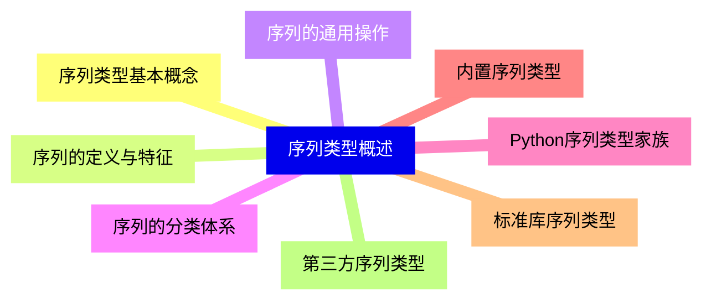

<--->
{}
{}
{}
{}
{}
{}
{}
{}
{}
{}
{}
{}
{}
{}
{}
{}
{}

### 2 字符串 str{#2}

{}
{}
{}
{}
{}
{}
{}
{}
{}
{}
{}
{}
{}
{}
{}
{}
{}
{}
{}
{}
{}
{}
{}
{}
{}
{}
{}
{}
{}
{{% details "%格式化方法" %}}
{}
{}
{}
{}
{}
{}
{}
<--->
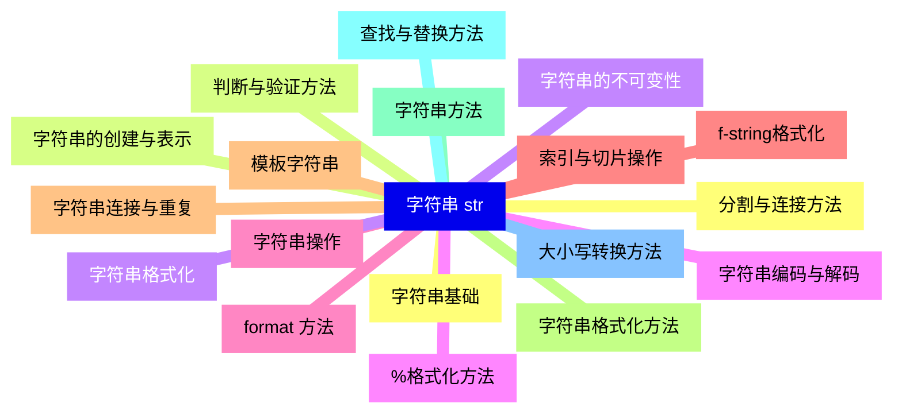

{}

### 3 列表 list{#3}

{}
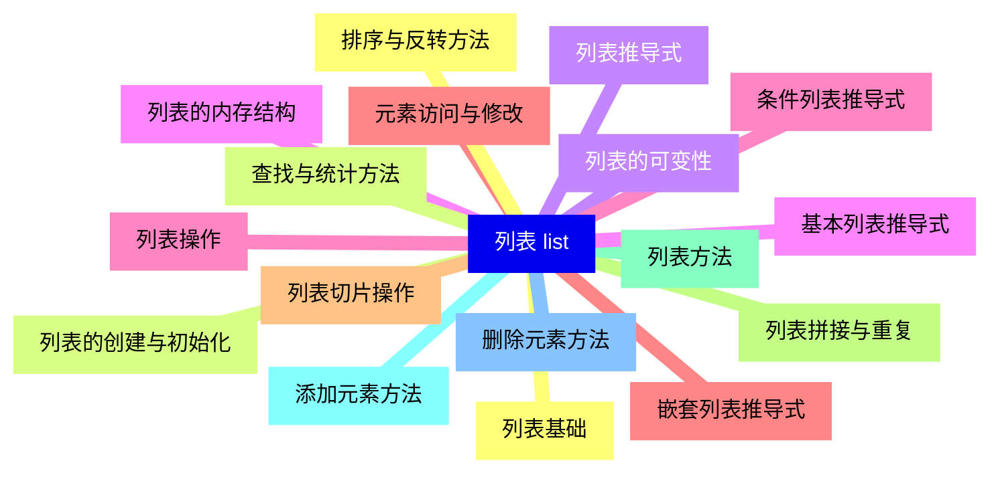

<--->
{}
{}
{}
{}
{}
{}
{}
{}
{}
{}
{}
{}
{}
{}
{}
{}
{}
{}
{}
{}
{}
{}
{}
{}
{}
{}
{}
{}
{}
{}
{}
{}
{}
{}
{}

### 4 元组 tuple{#4}

{}
{}
{}
{}
{}
{}
{}
{}
{}
{}
{}
{}
{}
{}
{}
{}
{}
{}
{}
{}
{}
{}
{}
{}
{}
<--->
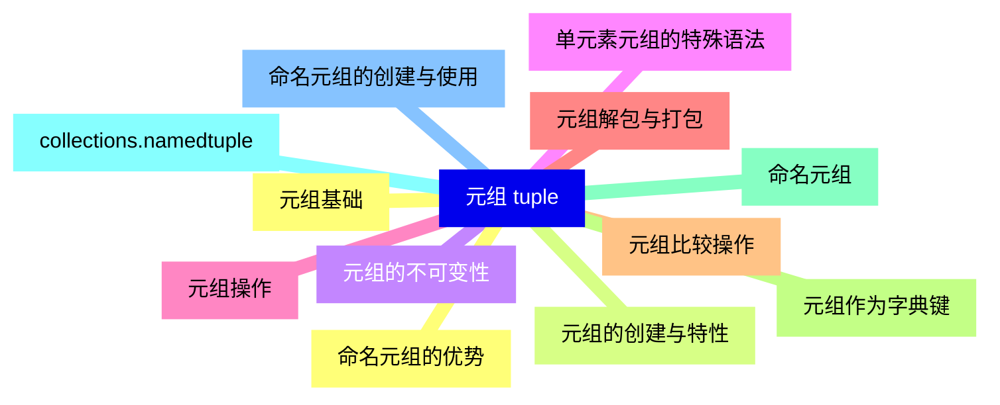

{}

### 5 字节序列{#5}

{}
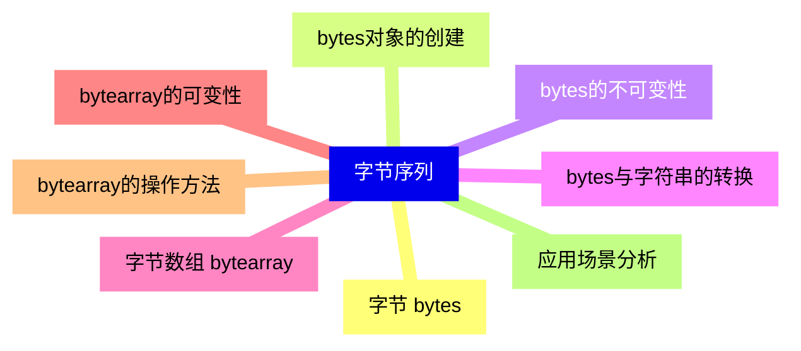

<--->
{}
{}
{}
{}
{}
{}
{}
{}
{}
{}
{}
{}
{}
{}
{}
{}
{}

### 6 范围 range{#6}

{}
{}
{}
{}
{}
{}
{}
{}
{}
{}
{}
{}
{}
{}
{}
{}
{}
<--->
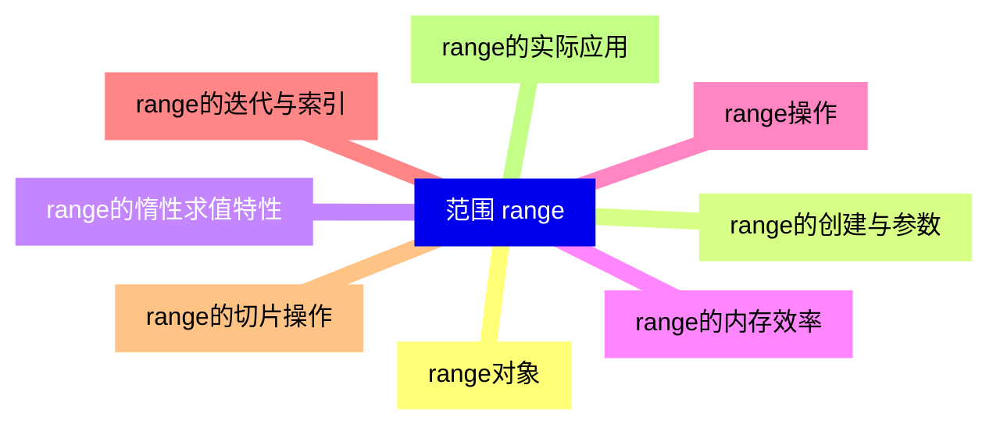

{}

### 7 序列通用操作{#7}

{}
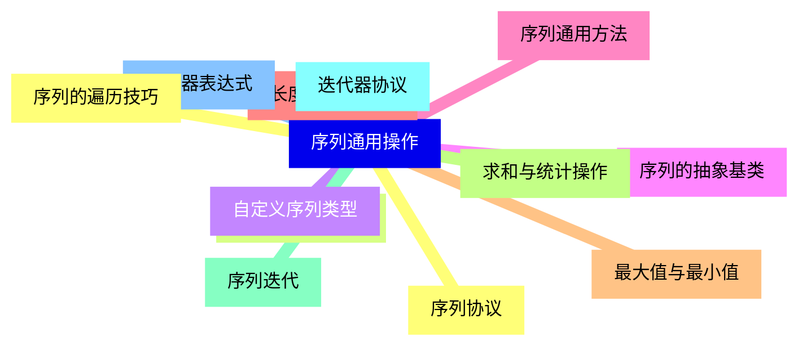

<--->
{}
{}
{}
{}
{}
{}
{}
{}
{}
{}
{}
{}
{}
{}
{}
{}
{}
{}
{}
{}
{}
{}
{}
{}
{}

### 8 序列比较与排序{#8}

{}
{}
{}
{}
{}
{}
{}
{}
{}
{}
{}
{}
{}
{}
{}
{}
{}
{}
{}
<--->
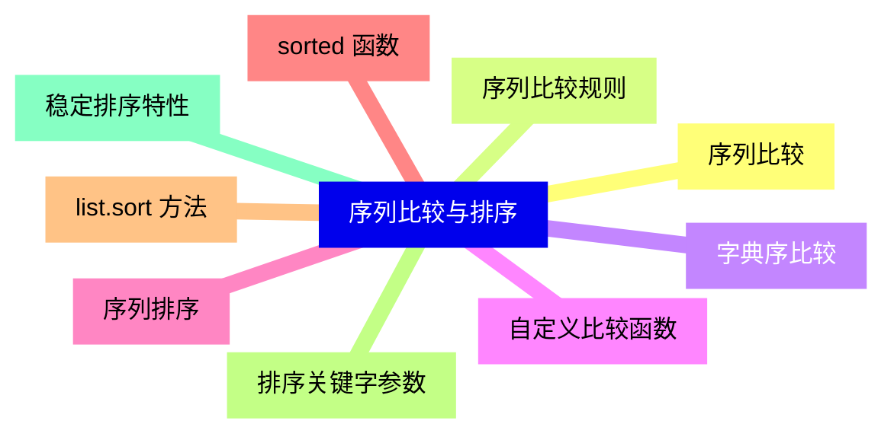

{}

### 9 序列高级特性{#9}

{}
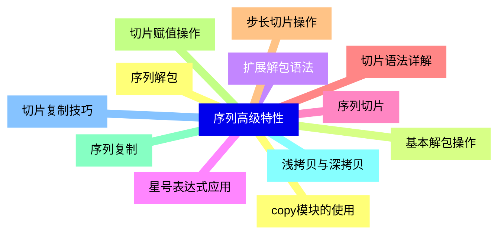

<--->
{}
{}
{}
{}
{}
{}
{}
{}
{}
{}
{}
{}
{}
{}
{}
{}
{}
{}
{}
{}
{}
{}
{}
{}
{}

### 10 序列性能分析{#10}

{}
{}
{}
{}
{}
{}
{}
{}
{}
{}
{}
{}
{}
{}
{}
{}
{}
<--->
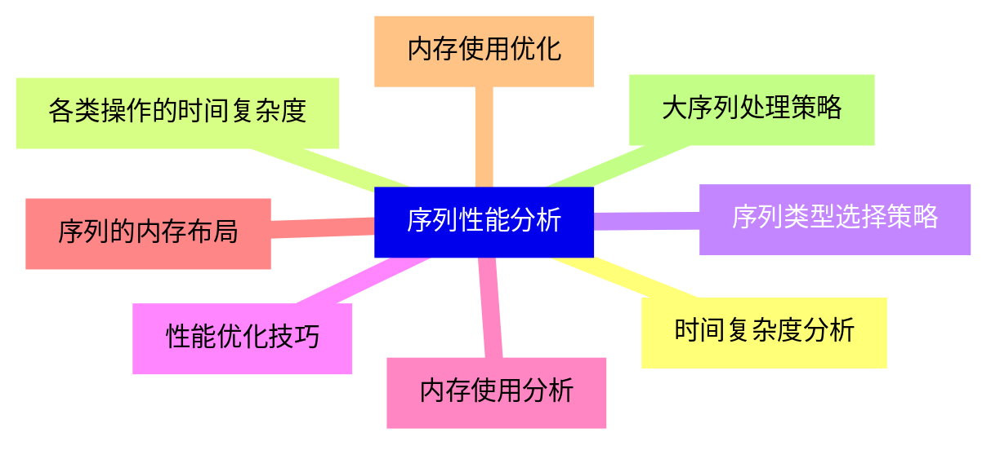

{}

### 11 标准库序列类型{#11}

{}
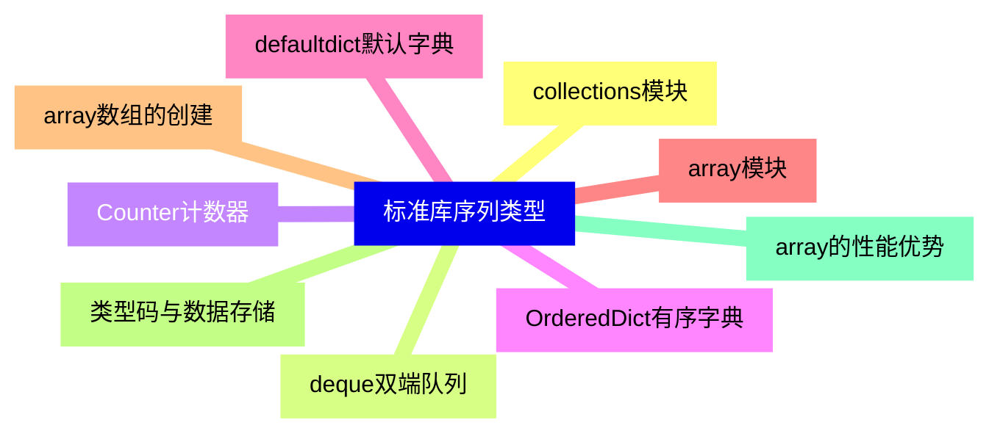

<--->
{}
{}
{}
{}
{}
{}
{}
{}
{}
{}
{}
{}
{}
{}
{}
{}
{}
{}
{}

### 12 序列应用实践{#12}

{}
{}
{}
{}
{}
{}
{}
{}
{}
{}
{}
{}
{}
{}
{}
{}
{}
<--->
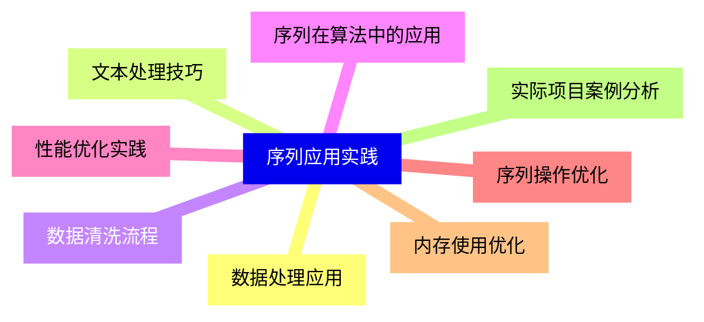

{}
