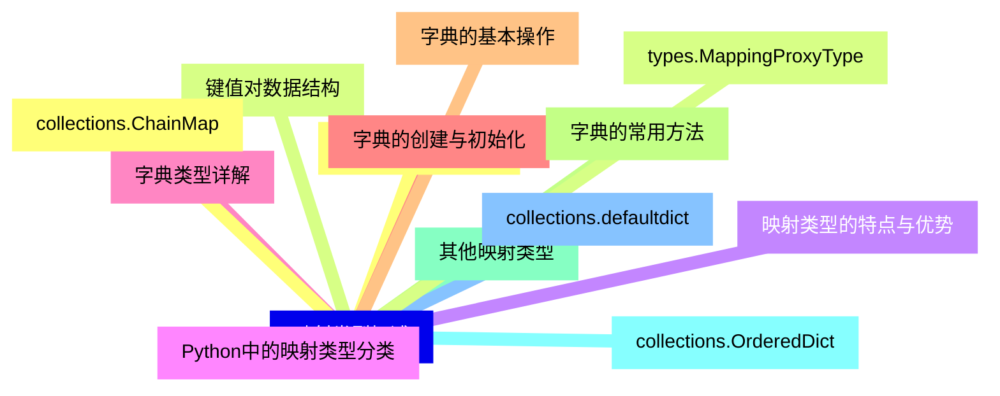
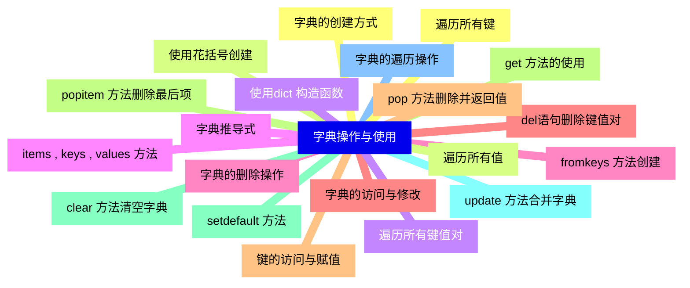
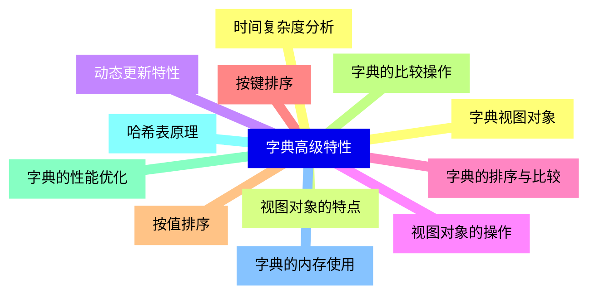
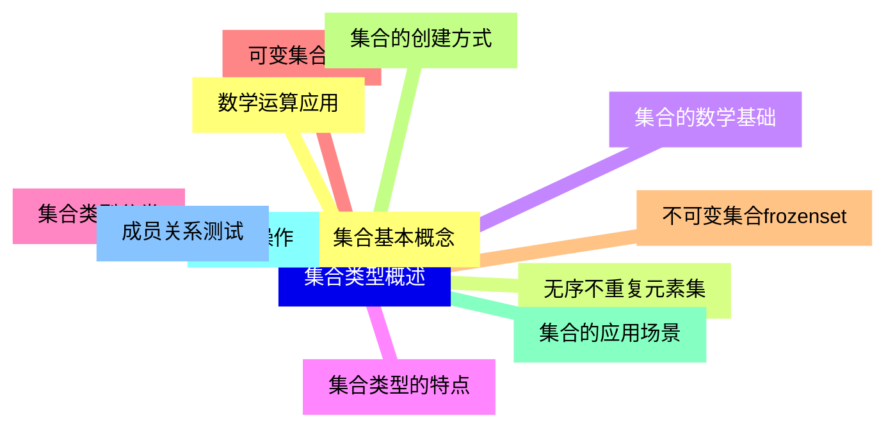
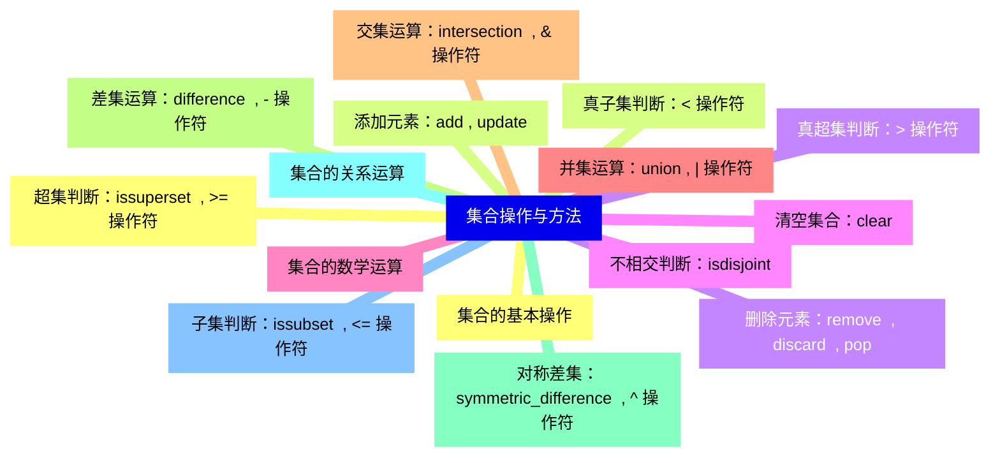
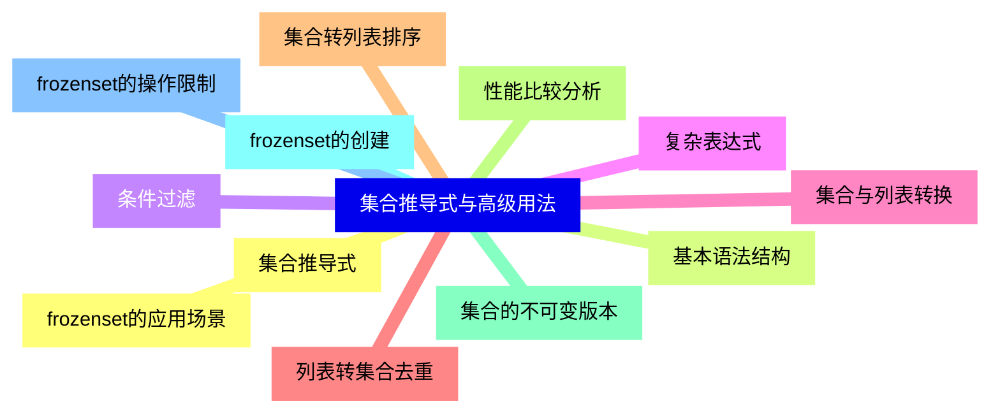
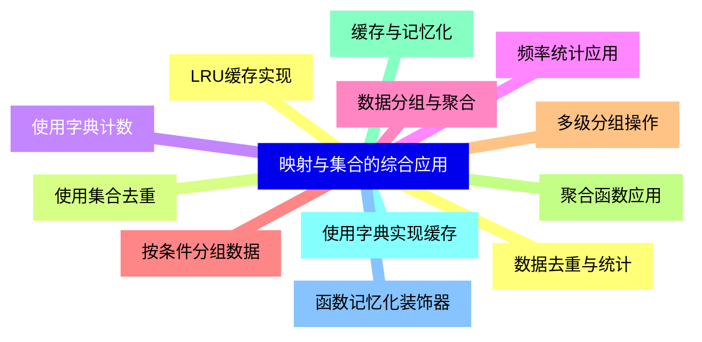
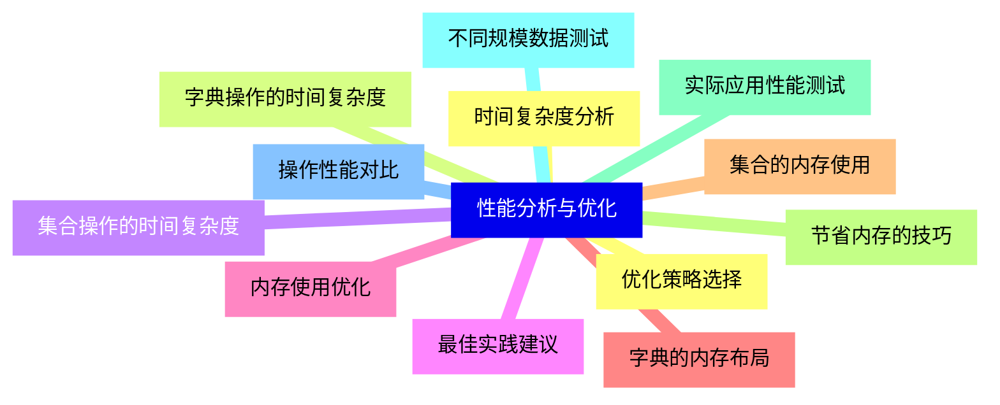
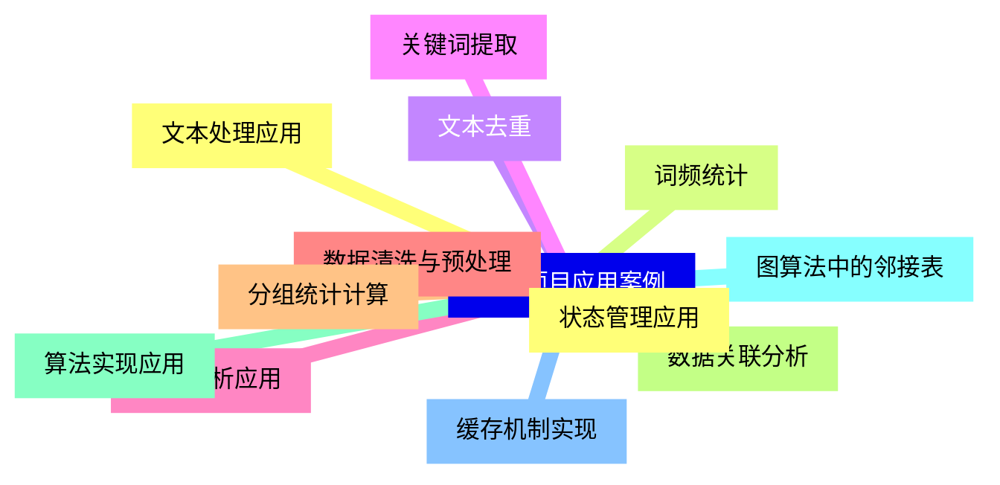
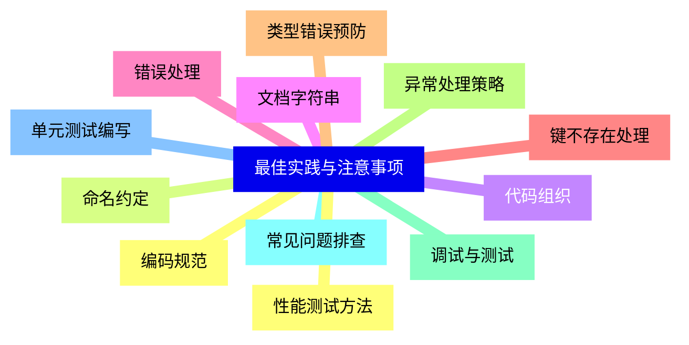


### 1 [映射类型概述](#1)
#### 1.1 [映射类型基本概念](#1)
#### 1.2 [键值对数据结构](#1)
#### 1.3 [映射类型的特点与优势](#1)
#### 1.4 [Python中的映射类型分类](#1)
#### 1.5 [字典类型详解](#1)
#### 1.6 [字典的创建与初始化](#1)
#### 1.7 [字典的基本操作](#1)
#### 1.8 [字典的常用方法](#1)
#### 1.9 [其他映射类型](#1)
#### 1.10 [collections.OrderedDict](#1)
#### 1.11 [collections.defaultdict](#1)
#### 1.12 [collections.ChainMap](#1)
#### 1.13 [types.MappingProxyType](#1)
### 2 [字典操作与使用](#2)
#### 2.1 [字典的创建方式](#2)
#### 2.2 [使用花括号创建](#2)
#### 2.3 [使用dict  构造函数](#2)
#### 2.4 [字典推导式](#2)
#### 2.5 [fromkeys  方法创建](#2)
#### 2.6 [字典的访问与修改](#2)
#### 2.7 [键的访问与赋值](#2)
#### 2.8 [get  方法的使用](#2)
#### 2.9 [setdefault  方法](#2)
#### 2.10 [update  方法合并字典](#2)
#### 2.11 [字典的遍历操作](#2)
#### 2.12 [遍历所有键](#2)
#### 2.13 [遍历所有值](#2)
#### 2.14 [遍历所有键值对](#2)
#### 2.15 [items  , keys  , values  方法](#2)
#### 2.16 [字典的删除操作](#2)
#### 2.17 [del语句删除键值对](#2)
#### 2.18 [pop  方法删除并返回值](#2)
#### 2.19 [popitem  方法删除最后项](#2)
#### 2.20 [clear  方法清空字典](#2)
### 3 [字典高级特性](#3)
#### 3.1 [字典视图对象](#3)
#### 3.2 [视图对象的特点](#3)
#### 3.3 [动态更新特性](#3)
#### 3.4 [视图对象的操作](#3)
#### 3.5 [字典的排序与比较](#3)
#### 3.6 [按键排序](#3)
#### 3.7 [按值排序](#3)
#### 3.8 [字典的比较操作](#3)
#### 3.9 [字典的性能优化](#3)
#### 3.10 [哈希表原理](#3)
#### 3.11 [字典的内存使用](#3)
#### 3.12 [时间复杂度分析](#3)
### 4 [集合类型概述](#4)
#### 4.1 [集合基本概念](#4)
#### 4.2 [无序不重复元素集](#4)
#### 4.3 [集合的数学基础](#4)
#### 4.4 [集合类型的特点](#4)
#### 4.5 [集合类型分类](#4)
#### 4.6 [可变集合set](#4)
#### 4.7 [不可变集合frozenset](#4)
#### 4.8 [集合的创建方式](#4)
#### 4.9 [集合的应用场景](#4)
#### 4.10 [去重操作](#4)
#### 4.11 [成员关系测试](#4)
#### 4.12 [数学运算应用](#4)
### 5 [集合操作与方法](#5)
#### 5.1 [集合的基本操作](#5)
#### 5.2 [添加元素：add  , update](#5)
#### 5.3 [删除元素：remove  , discard  , pop](#5)
#### 5.4 [清空集合：clear](#5)
#### 5.5 [集合的数学运算](#5)
#### 5.6 [并集运算：union  , | 操作符](#5)
#### 5.7 [交集运算：intersection  , & 操作符](#5)
#### 5.8 [差集运算：difference  , - 操作符](#5)
#### 5.9 [对称差集：symmetric_difference  , ^ 操作符](#5)
#### 5.10 [集合的关系运算](#5)
#### 5.11 [子集判断：issubset  , <= 操作符](#5)
#### 5.12 [超集判断：issuperset  , >= 操作符](#5)
#### 5.13 [真子集判断：< 操作符](#5)
#### 5.14 [真超集判断：> 操作符](#5)
#### 5.15 [不相交判断：isdisjoint](#5)
### 6 [集合推导式与高级用法](#6)
#### 6.1 [集合推导式](#6)
#### 6.2 [基本语法结构](#6)
#### 6.3 [条件过滤](#6)
#### 6.4 [复杂表达式](#6)
#### 6.5 [集合与列表转换](#6)
#### 6.6 [列表转集合去重](#6)
#### 6.7 [集合转列表排序](#6)
#### 6.8 [性能比较分析](#6)
#### 6.9 [集合的不可变版本](#6)
#### 6.10 [frozenset的创建](#6)
#### 6.11 [frozenset的操作限制](#6)
#### 6.12 [frozenset的应用场景](#6)
### 7 [映射与集合的综合应用](#7)
#### 7.1 [数据去重与统计](#7)
#### 7.2 [使用集合去重](#7)
#### 7.3 [使用字典计数](#7)
#### 7.4 [频率统计应用](#7)
#### 7.5 [数据分组与聚合](#7)
#### 7.6 [按条件分组数据](#7)
#### 7.7 [多级分组操作](#7)
#### 7.8 [聚合函数应用](#7)
#### 7.9 [缓存与记忆化](#7)
#### 7.10 [使用字典实现缓存](#7)
#### 7.11 [函数记忆化装饰器](#7)
#### 7.12 [LRU缓存实现](#7)
### 8 [性能分析与优化](#8)
#### 8.1 [时间复杂度分析](#8)
#### 8.2 [字典操作的时间复杂度](#8)
#### 8.3 [集合操作的时间复杂度](#8)
#### 8.4 [最佳实践建议](#8)
#### 8.5 [内存使用优化](#8)
#### 8.6 [字典的内存布局](#8)
#### 8.7 [集合的内存使用](#8)
#### 8.8 [节省内存的技巧](#8)
#### 8.9 [实际应用性能测试](#8)
#### 8.10 [不同规模数据测试](#8)
#### 8.11 [操作性能对比](#8)
#### 8.12 [优化策略选择](#8)
### 9 [实际项目应用案例](#9)
#### 9.1 [文本处理应用](#9)
#### 9.2 [词频统计](#9)
#### 9.3 [文本去重](#9)
#### 9.4 [关键词提取](#9)
#### 9.5 [数据分析应用](#9)
#### 9.6 [数据清洗与预处理](#9)
#### 9.7 [分组统计计算](#9)
#### 9.8 [数据关联分析](#9)
#### 9.9 [算法实现应用](#9)
#### 9.10 [图算法中的邻接表](#9)
#### 9.11 [缓存机制实现](#9)
#### 9.12 [状态管理应用](#9)
### 10 [最佳实践与注意事项](#10)
#### 10.1 [编码规范](#10)
#### 10.2 [命名约定](#10)
#### 10.3 [代码组织](#10)
#### 10.4 [文档字符串](#10)
#### 10.5 [错误处理](#10)
#### 10.6 [键不存在处理](#10)
#### 10.7 [类型错误预防](#10)
#### 10.8 [异常处理策略](#10)
#### 10.9 [调试与测试](#10)
#### 10.10 [常见问题排查](#10)
#### 10.11 [单元测试编写](#10)
#### 10.12 [性能测试方法](#10)




### 1 映射类型概述

---
### 1 映射类型概述
___
#### 1.1 映射类型基本概念
___
#### 1.2 键值对数据结构
___
#### 1.3 映射类型的特点与优势
___
#### 1.4 Python中的映射类型分类
___
#### 1.5 字典类型详解
___
#### 1.6 字典的创建与初始化
___
#### 1.7 字典的基本操作
___
#### 1.8 字典的常用方法
___
#### 1.9 其他映射类型
___
#### 1.10 collections.OrderedDict
___
#### 1.11 collections.defaultdict
___
#### 1.12 collections.ChainMap
___
#### 1.13 types.MappingProxyType
### 2 字典操作与使用

---
### 2 字典操作与使用
___
#### 2.1 字典的创建方式
___
#### 2.2 使用花括号创建
___
#### 2.3 使用dict  构造函数
___
#### 2.4 字典推导式
___
#### 2.5 fromkeys  方法创建
___
#### 2.6 字典的访问与修改
___
#### 2.7 键的访问与赋值
___
#### 2.8 get  方法的使用
___
#### 2.9 setdefault  方法
___
#### 2.10 update  方法合并字典
___
#### 2.11 字典的遍历操作
___
#### 2.12 遍历所有键
___
#### 2.13 遍历所有值
___
#### 2.14 遍历所有键值对
___
#### 2.15 items  , keys  , values  方法
___
#### 2.16 字典的删除操作
___
#### 2.17 del语句删除键值对
___
#### 2.18 pop  方法删除并返回值
___
#### 2.19 popitem  方法删除最后项
___
#### 2.20 clear  方法清空字典
### 3 字典高级特性

---
### 3 字典高级特性
___
#### 3.1 字典视图对象
___
#### 3.2 视图对象的特点
___
#### 3.3 动态更新特性
___
#### 3.4 视图对象的操作
___
#### 3.5 字典的排序与比较
___
#### 3.6 按键排序
___
#### 3.7 按值排序
___
#### 3.8 字典的比较操作
___
#### 3.9 字典的性能优化
___
#### 3.10 哈希表原理
___
#### 3.11 字典的内存使用
___
#### 3.12 时间复杂度分析
### 4 集合类型概述

---
### 4 集合类型概述
___
#### 4.1 集合基本概念
___
#### 4.2 无序不重复元素集
___
#### 4.3 集合的数学基础
___
#### 4.4 集合类型的特点
___
#### 4.5 集合类型分类
___
#### 4.6 可变集合set
___
#### 4.7 不可变集合frozenset
___
#### 4.8 集合的创建方式
___
#### 4.9 集合的应用场景
___
#### 4.10 去重操作
___
#### 4.11 成员关系测试
___
#### 4.12 数学运算应用
### 5 集合操作与方法

---
### 5 集合操作与方法
___
#### 5.1 集合的基本操作
___
#### 5.2 添加元素：add  , update
___
#### 5.3 删除元素：remove  , discard  , pop
___
#### 5.4 清空集合：clear
___
#### 5.5 集合的数学运算
___
#### 5.6 并集运算：union  , | 操作符
___
#### 5.7 交集运算：intersection  , & 操作符
___
#### 5.8 差集运算：difference  , - 操作符
___
#### 5.9 对称差集：symmetric_difference  , ^ 操作符
___
#### 5.10 集合的关系运算
___
#### 5.11 子集判断：issubset  , <= 操作符
___
#### 5.12 超集判断：issuperset  , >= 操作符
___
#### 5.13 真子集判断：< 操作符
___
#### 5.14 真超集判断：> 操作符
___
#### 5.15 不相交判断：isdisjoint
### 6 集合推导式与高级用法

---
### 6 集合推导式与高级用法
___
#### 6.1 集合推导式
___
#### 6.2 基本语法结构
___
#### 6.3 条件过滤
___
#### 6.4 复杂表达式
___
#### 6.5 集合与列表转换
___
#### 6.6 列表转集合去重
___
#### 6.7 集合转列表排序
___
#### 6.8 性能比较分析
___
#### 6.9 集合的不可变版本
___
#### 6.10 frozenset的创建
___
#### 6.11 frozenset的操作限制
___
#### 6.12 frozenset的应用场景
### 7 映射与集合的综合应用

---
### 7 映射与集合的综合应用
___
#### 7.1 数据去重与统计
___
#### 7.2 使用集合去重
___
#### 7.3 使用字典计数
___
#### 7.4 频率统计应用
___
#### 7.5 数据分组与聚合
___
#### 7.6 按条件分组数据
___
#### 7.7 多级分组操作
___
#### 7.8 聚合函数应用
___
#### 7.9 缓存与记忆化
___
#### 7.10 使用字典实现缓存
___
#### 7.11 函数记忆化装饰器
___
#### 7.12 LRU缓存实现
### 8 性能分析与优化

---
### 8 性能分析与优化
___
#### 8.1 时间复杂度分析
___
#### 8.2 字典操作的时间复杂度
___
#### 8.3 集合操作的时间复杂度
___
#### 8.4 最佳实践建议
___
#### 8.5 内存使用优化
___
#### 8.6 字典的内存布局
___
#### 8.7 集合的内存使用
___
#### 8.8 节省内存的技巧
___
#### 8.9 实际应用性能测试
___
#### 8.10 不同规模数据测试
___
#### 8.11 操作性能对比
___
#### 8.12 优化策略选择
### 9 实际项目应用案例

---
### 9 实际项目应用案例
___
#### 9.1 文本处理应用
___
#### 9.2 词频统计
___
#### 9.3 文本去重
___
#### 9.4 关键词提取
___
#### 9.5 数据分析应用
___
#### 9.6 数据清洗与预处理
___
#### 9.7 分组统计计算
___
#### 9.8 数据关联分析
___
#### 9.9 算法实现应用
___
#### 9.10 图算法中的邻接表
___
#### 9.11 缓存机制实现
___
#### 9.12 状态管理应用
### 10 最佳实践与注意事项

---
### 10 最佳实践与注意事项
___
#### 10.1 编码规范
___
#### 10.2 命名约定
___
#### 10.3 代码组织
___
#### 10.4 文档字符串
___
#### 10.5 错误处理
___
#### 10.6 键不存在处理
___
#### 10.7 类型错误预防
___
#### 10.8 异常处理策略
___
#### 10.9 调试与测试
___
#### 10.10 常见问题排查
___
#### 10.11 单元测试编写
___
#### 10.12 性能测试方法


### 1 映射类型概述{#1}

{}

<--->
{}
{}
{}
{}
{}
{}
{}
{}
{}
{}
{}
{}
{}
{}
{}
{}
{}
{}
{}
{}
{}
{}
{}
{}
{}
{}
{}

### 2 字典操作与使用{#2}

{}
{}
{}
{}
{}
{}
{}
{}
{}
{}
{}
{}
{}
{}
{}
{}
{}
{}
{}
{}
{}
{}
{}
{}
{}
{}
{}
{}
{}
{}
{}
{}
{}
{}
{}
{}
{}
{}
{}
{}
{}
<--->

{}

### 3 字典高级特性{#3}

{}

<--->
{}
{}
{}
{}
{}
{}
{}
{}
{}
{}
{}
{}
{}
{}
{}
{}
{}
{}
{}
{}
{}
{}
{}
{}
{}

### 4 集合类型概述{#4}

{}
{}
{}
{}
{}
{}
{}
{}
{}
{}
{}
{}
{}
{}
{}
{}
{}
{}
{}
{}
{}
{}
{}
{}
{}
<--->

{}

### 5 集合操作与方法{#5}

{}

<--->
{}
{}
{}
{}
{}
{}
{}
{}
{}
{}
{}
{}
{}
{}
{}
{}
{}
{}
{}
{}
{}
{}
{}
{}
{}
{}
{}
{}
{}
{}
{}

### 6 集合推导式与高级用法{#6}

{}
{}
{}
{}
{}
{}
{}
{}
{}
{}
{}
{}
{}
{}
{}
{}
{}
{}
{}
{}
{}
{}
{}
{}
{}
<--->

{}

### 7 映射与集合的综合应用{#7}

{}

<--->
{}
{}
{}
{}
{}
{}
{}
{}
{}
{}
{}
{}
{}
{}
{}
{}
{}
{}
{}
{}
{}
{}
{}
{}
{}

### 8 性能分析与优化{#8}

{}
{}
{}
{}
{}
{}
{}
{}
{}
{}
{}
{}
{}
{}
{}
{}
{}
{}
{}
{}
{}
{}
{}
{}
{}
<--->

{}

### 9 实际项目应用案例{#9}

{}

<--->
{}
{}
{}
{}
{}
{}
{}
{}
{}
{}
{}
{}
{}
{}
{}
{}
{}
{}
{}
{}
{}
{}
{}
{}
{}

### 10 最佳实践与注意事项{#10}

{}
{}
{}
{}
{}
{}
{}
{}
{}
{}
{}
{}
{}
{}
{}
{}
{}
{}
{}
{}
{}
{}
{}
{}
{}
<--->

{}
