
### 1 [集合与映射类型](#1)
#### 1.1 [集合类型](#1)
##### 1.1.1 [集合基础操作](#1)
##### 1.1.2 [集合运算方法](#1)
##### 1.1.3 [不可变集合frozenset](#1)
#### 1.2 [字典类型](#1)
##### 1.2.1 [字典创建与访问](#1)
##### 1.2.2 [字典方法详解](#1)
##### 1.2.3 [字典视图对象](#1)
### 2 [序列类型扩展](#2)
#### 2.1 [双端队列deque](#2)
##### 2.1.1 [deque基本操作](#2)
##### 2.1.2 [deque线程安全特性](#2)
##### 2.1.3 [deque性能优化](#2)
#### 2.2 [命名元组namedtuple](#2)
##### 2.2.1 [namedtuple定义与使用](#2)
##### 2.2.2 [namedtuple方法详解](#2)
##### 2.2.3 [namedtuple应用场景](#2)
### 3 [堆与优先队列](#3)
#### 3.1 [堆数据结构](#3)
##### 3.1.1 [堆的基本概念](#3)
##### 3.1.2 [heapq模块使用](#3)
##### 3.1.3 [堆排序实现](#3)
#### 3.2 [优先队列](#3)
##### 3.2.1 [queue.PriorityQueue](#3)
##### 3.2.2 [自定义优先队列](#3)
##### 3.2.3 [优先队列应用实例](#3)
### 4 [数组与矩阵](#4)
#### 4.1 [数组类型](#4)
##### 4.1.1 [array模块使用](#4)
##### 4.1.2 [数值数组操作](#4)
##### 4.1.3 [数组与列表性能对比](#4)
#### 4.2 [矩阵运算](#4)
##### 4.2.1 [NumPy数组基础](#4)
##### 4.2.2 [矩阵创建与操作](#4)
##### 4.2.3 [线性代数运算](#4)
### 5 [树形结构](#5)
#### 5.1 [二叉树](#5)
##### 5.1.1 [二叉树基本概念](#5)
##### 5.1.2 [二叉树遍历算法](#5)
##### 5.1.3 [二叉搜索树实现](#5)
#### 5.2 [平衡树](#5)
##### 5.2.1 [AVL树原理](#5)
##### 5.2.2 [红黑树概念](#5)
##### 5.2.3 [B树与B+树](#5)
### 6 [图结构](#6)
#### 6.1 [图的基本表示](#6)
##### 6.1.1 [邻接矩阵表示法](#6)
##### 6.1.2 [邻接表表示法](#6)
##### 6.1.3 [图的遍历算法](#6)
#### 6.2 [图算法应用](#6)
##### 6.2.1 [最短路径算法](#6)
##### 6.2.2 [最小生成树算法](#6)
##### 6.2.3 [拓扑排序算法](#6)
### 7 [哈希表与散列](#7)
#### 7.1 [哈希函数](#7)
##### 7.1.1 [哈希函数设计原则](#7)
##### 7.1.2 [Python哈希实现](#7)
##### 7.1.3 [哈希冲突解决方法](#7)
#### 7.2 [高级字典类型](#7)
##### 7.2.1 [defaultdict使用](#7)
##### 7.2.2 [OrderedDict有序字典](#7)
##### 7.2.3 [ChainMap链式映射](#7)
### 8 [缓存与记忆化](#8)
#### 8.1 [LRU缓存](#8)
##### 8.1.1 [functools.lru_cache](#8)
##### 8.1.2 [自定义LRU缓存](#8)
##### 8.1.3 [缓存失效策略](#8)
#### 8.2 [记忆化技术](#8)
##### 8.2.1 [函数记忆化实现](#8)
##### 8.2.2 [记忆化应用场景](#8)
##### 8.2.3 [记忆化性能分析](#8)
### 9 [并发数据结构](#9)
#### 9.1 [线程安全数据结构](#9)
##### 9.1.1 [queue模块详解](#9)
##### 9.1.2 [线程安全字典](#9)
##### 9.1.3 [原子操作实现](#9)
#### 9.2 [异步数据结构](#9)
##### 9.2.1 [asyncio.Queue](#9)
##### 9.2.2 [异步字典实现](#9)
##### 9.2.3 [协程间数据传递](#9)
### 10 [自定义数据结构](#10)
#### 10.1 [数据结构设计](#10)
##### 10.1.1 [抽象基类使用](#10)
##### 10.1.2 [魔术方法实现](#10)
##### 10.1.3 [迭代器与生成器](#10)
#### 10.2 [性能优化](#10)
##### 10.2.1 [时间复杂度分析](#10)
##### 10.2.2 [空间复杂度优化](#10)
##### 10.2.3 [内存管理技巧](#10)
### 11 [第三方数据结构库](#11)
#### 11.1 [常用第三方库](#11)
##### 11.1.1 [pandas数据结构](#11)
##### 11.1.2 [scipy稀疏矩阵](#11)
##### 11.1.3 [networkx图结构](#11)
#### 11.2 [高级数据结构库](#11)
##### 11.2.1 [blist可变列表](#11)
##### 11.2.2 [sortedcontainers有序容器](#11)
##### 11.2.3 [bidict双向字典](#11)




### 1 集合与映射类型

---
### 1 集合与映射类型
___
#### 1.1 集合类型
___
##### 1.1.1 集合基础操作
___
##### 1.1.2 集合运算方法
___
##### 1.1.3 不可变集合frozenset
___
#### 1.2 字典类型
___
##### 1.2.1 字典创建与访问
___
##### 1.2.2 字典方法详解
___
##### 1.2.3 字典视图对象
### 2 序列类型扩展

---
### 2 序列类型扩展
___
#### 2.1 双端队列deque
___
##### 2.1.1 deque基本操作
___
##### 2.1.2 deque线程安全特性
___
##### 2.1.3 deque性能优化
___
#### 2.2 命名元组namedtuple
___
##### 2.2.1 namedtuple定义与使用
___
##### 2.2.2 namedtuple方法详解
___
##### 2.2.3 namedtuple应用场景
### 3 堆与优先队列

---
### 3 堆与优先队列
___
#### 3.1 堆数据结构
___
##### 3.1.1 堆的基本概念
___
##### 3.1.2 heapq模块使用
___
##### 3.1.3 堆排序实现
___
#### 3.2 优先队列
___
##### 3.2.1 queue.PriorityQueue
___
##### 3.2.2 自定义优先队列
___
##### 3.2.3 优先队列应用实例
### 4 数组与矩阵

---
### 4 数组与矩阵
___
#### 4.1 数组类型
___
##### 4.1.1 array模块使用
___
##### 4.1.2 数值数组操作
___
##### 4.1.3 数组与列表性能对比
___
#### 4.2 矩阵运算
___
##### 4.2.1 NumPy数组基础
___
##### 4.2.2 矩阵创建与操作
___
##### 4.2.3 线性代数运算
### 5 树形结构

---
### 5 树形结构
___
#### 5.1 二叉树
___
##### 5.1.1 二叉树基本概念
___
##### 5.1.2 二叉树遍历算法
___
##### 5.1.3 二叉搜索树实现
___
#### 5.2 平衡树
___
##### 5.2.1 AVL树原理
___
##### 5.2.2 红黑树概念
___
##### 5.2.3 B树与B+树
### 6 图结构

---
### 6 图结构
___
#### 6.1 图的基本表示
___
##### 6.1.1 邻接矩阵表示法
___
##### 6.1.2 邻接表表示法
___
##### 6.1.3 图的遍历算法
___
#### 6.2 图算法应用
___
##### 6.2.1 最短路径算法
___
##### 6.2.2 最小生成树算法
___
##### 6.2.3 拓扑排序算法
### 7 哈希表与散列

---
### 7 哈希表与散列
___
#### 7.1 哈希函数
___
##### 7.1.1 哈希函数设计原则
___
##### 7.1.2 Python哈希实现
___
##### 7.1.3 哈希冲突解决方法
___
#### 7.2 高级字典类型
___
##### 7.2.1 defaultdict使用
___
##### 7.2.2 OrderedDict有序字典
___
##### 7.2.3 ChainMap链式映射
### 8 缓存与记忆化

---
### 8 缓存与记忆化
___
#### 8.1 LRU缓存
___
##### 8.1.1 functools.lru_cache
___
##### 8.1.2 自定义LRU缓存
___
##### 8.1.3 缓存失效策略
___
#### 8.2 记忆化技术
___
##### 8.2.1 函数记忆化实现
___
##### 8.2.2 记忆化应用场景
___
##### 8.2.3 记忆化性能分析
### 9 并发数据结构

---
### 9 并发数据结构
___
#### 9.1 线程安全数据结构
___
##### 9.1.1 queue模块详解
___
##### 9.1.2 线程安全字典
___
##### 9.1.3 原子操作实现
___
#### 9.2 异步数据结构
___
##### 9.2.1 asyncio.Queue
___
##### 9.2.2 异步字典实现
___
##### 9.2.3 协程间数据传递
### 10 自定义数据结构

---
### 10 自定义数据结构
___
#### 10.1 数据结构设计
___
##### 10.1.1 抽象基类使用
___
##### 10.1.2 魔术方法实现
___
##### 10.1.3 迭代器与生成器
___
#### 10.2 性能优化
___
##### 10.2.1 时间复杂度分析
___
##### 10.2.2 空间复杂度优化
___
##### 10.2.3 内存管理技巧
### 11 第三方数据结构库

---
### 11 第三方数据结构库
___
#### 11.1 常用第三方库
___
##### 11.1.1 pandas数据结构
___
##### 11.1.2 scipy稀疏矩阵
___
##### 11.1.3 networkx图结构
___
#### 11.2 高级数据结构库
___
##### 11.2.1 blist可变列表
___
##### 11.2.2 sortedcontainers有序容器
___
##### 11.2.3 bidict双向字典


### 1 集合与映射类型{#1}

{}
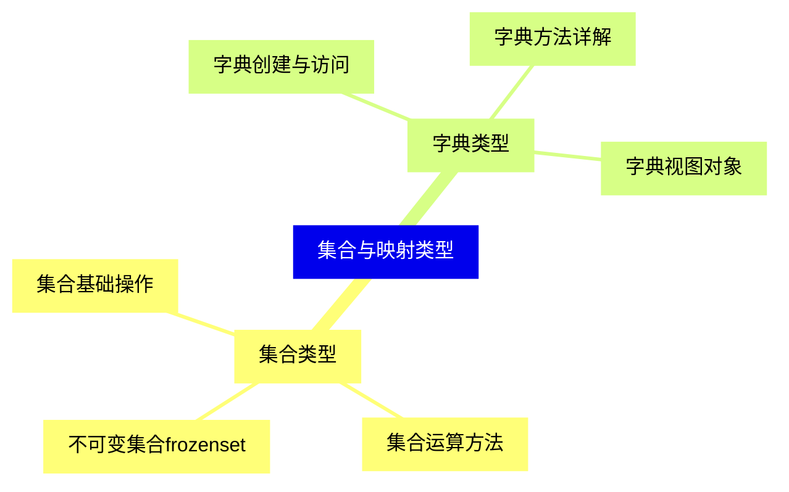

<--->
{}
{}
{}
{}
{}
{}
{}
{}
{}
{}
{}
{}
{}
{}
{}
{}
{}

### 2 序列类型扩展{#2}

{}
{}
{}
{}
{}
{}
{}
{}
{}
{}
{}
{}
{}
{}
{}
{}
{}
<--->
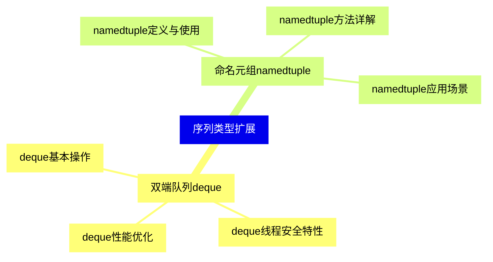

{}

### 3 堆与优先队列{#3}

{}
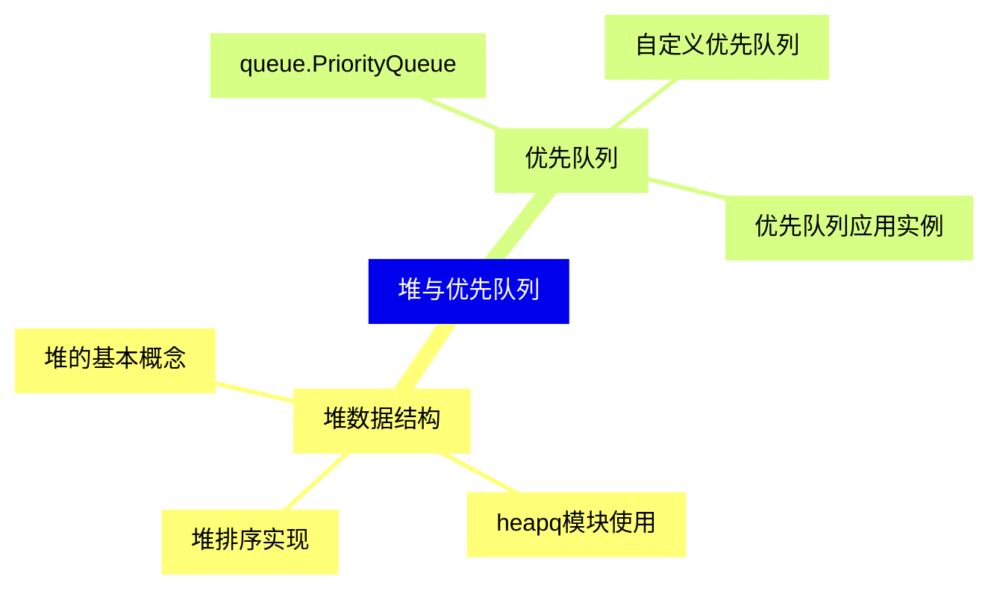

<--->
{}
{}
{}
{}
{}
{}
{}
{}
{}
{}
{}
{}
{}
{}
{}
{}
{}

### 4 数组与矩阵{#4}

{}
{}
{}
{}
{}
{}
{}
{}
{}
{}
{}
{}
{}
{}
{}
{}
{}
<--->
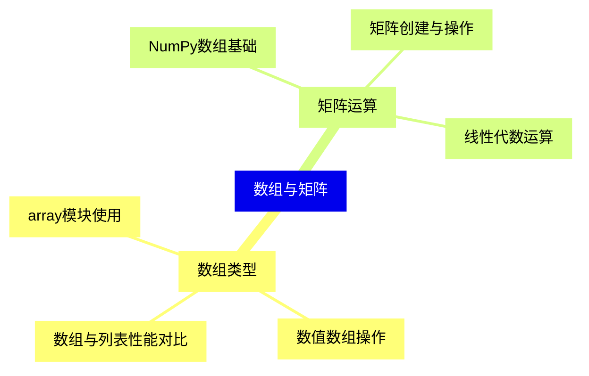

{}

### 5 树形结构{#5}

{}
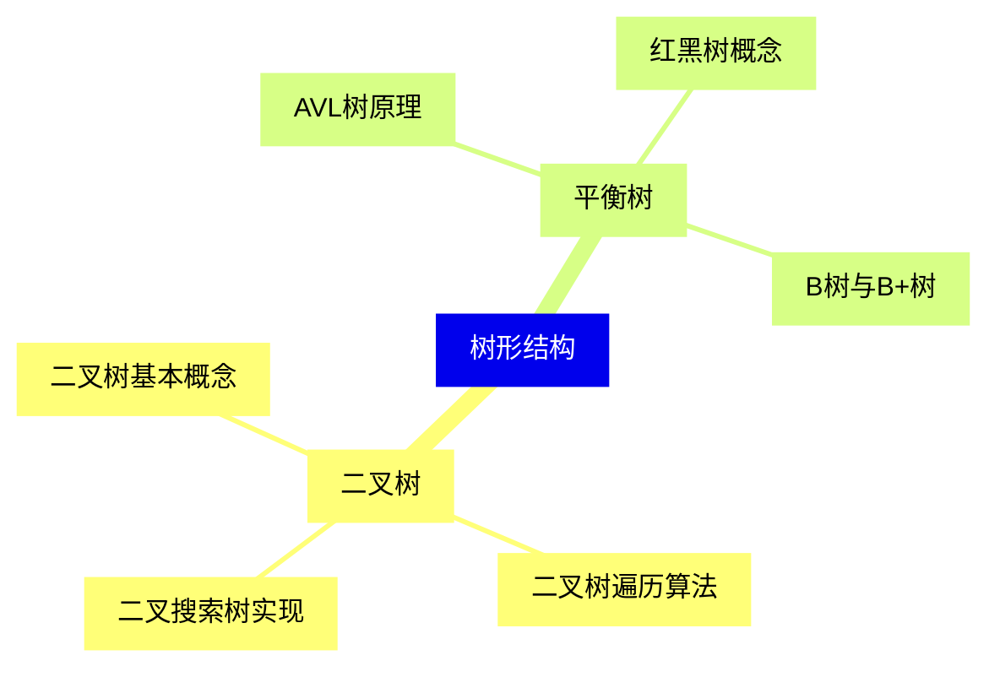

<--->
{}
{}
{}
{}
{}
{}
{}
{}
{}
{}
{}
{}
{}
{}
{}
{}
{}

### 6 图结构{#6}

{}
{}
{}
{}
{}
{}
{}
{}
{}
{}
{}
{}
{}
{}
{}
{}
{}
<--->
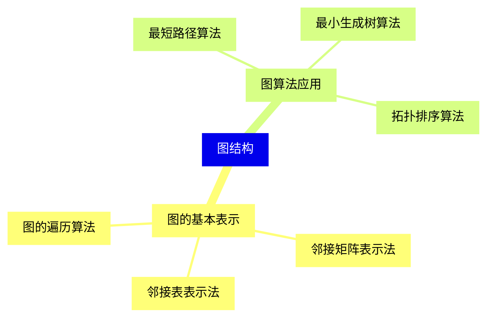

{}

### 7 哈希表与散列{#7}

{}
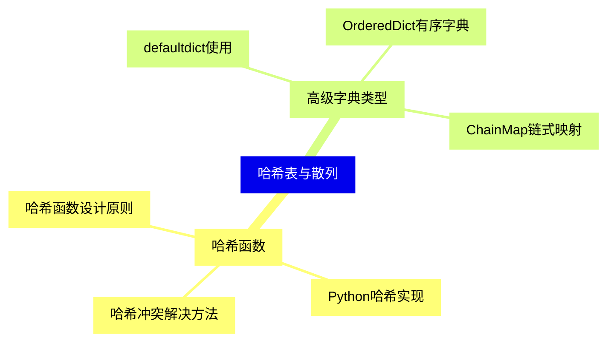

<--->
{}
{}
{}
{}
{}
{}
{}
{}
{}
{}
{}
{}
{}
{}
{}
{}
{}

### 8 缓存与记忆化{#8}

{}
{}
{}
{}
{}
{}
{}
{}
{}
{}
{}
{}
{}
{}
{}
{}
{}
<--->
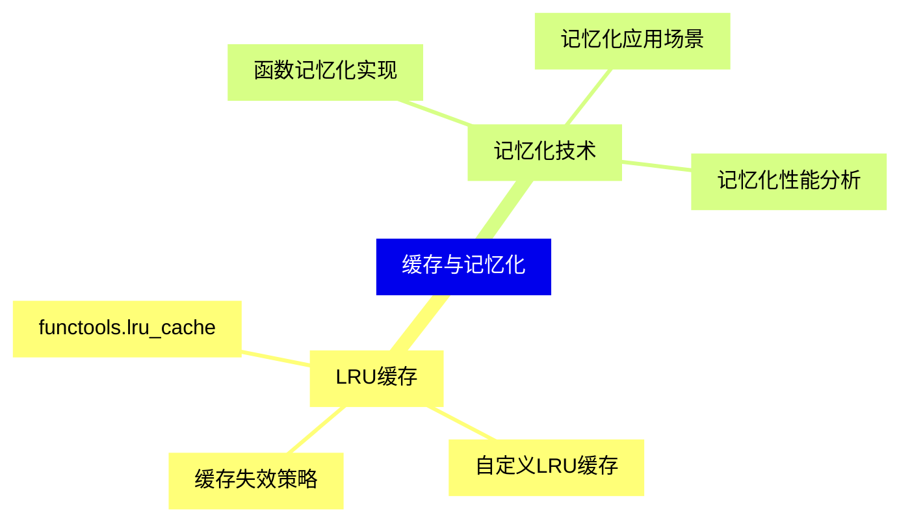

{}

### 9 并发数据结构{#9}

{}
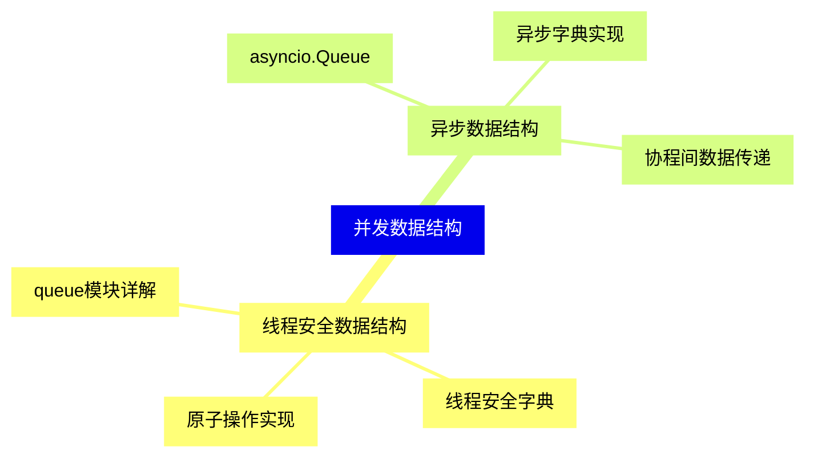

<--->
{}
{}
{}
{}
{}
{}
{}
{}
{}
{}
{}
{}
{}
{}
{}
{}
{}

### 10 自定义数据结构{#10}

{}
{}
{}
{}
{}
{}
{}
{}
{}
{}
{}
{}
{}
{}
{}
{}
{}
<--->
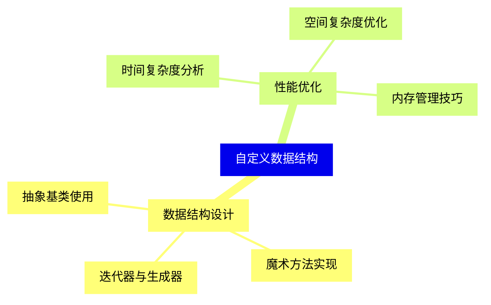

{}

### 11 第三方数据结构库{#11}

{}
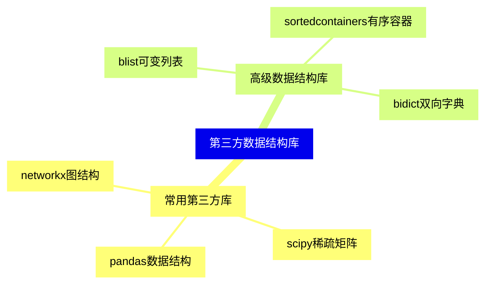

<--->
{}
{}
{}
{}
{}
{}
{}
{}
{}
{}
{}
{}
{}
{}
{}
{}
{}
