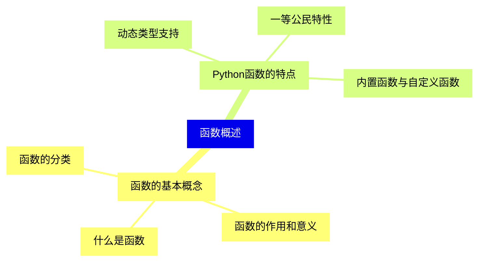
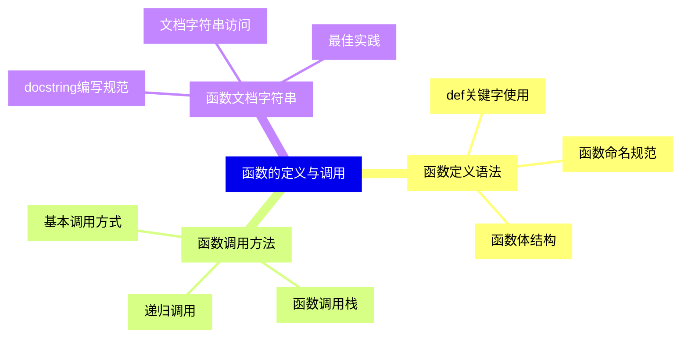
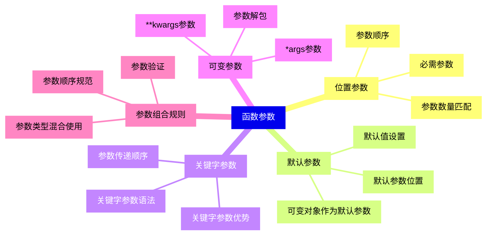
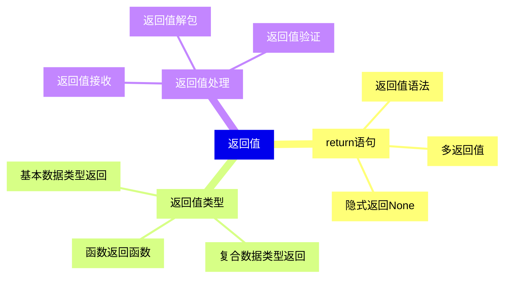
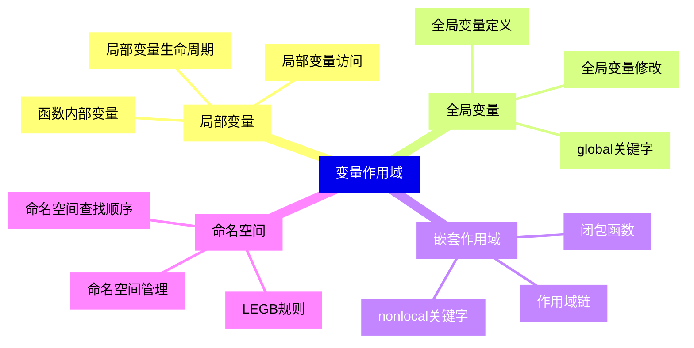
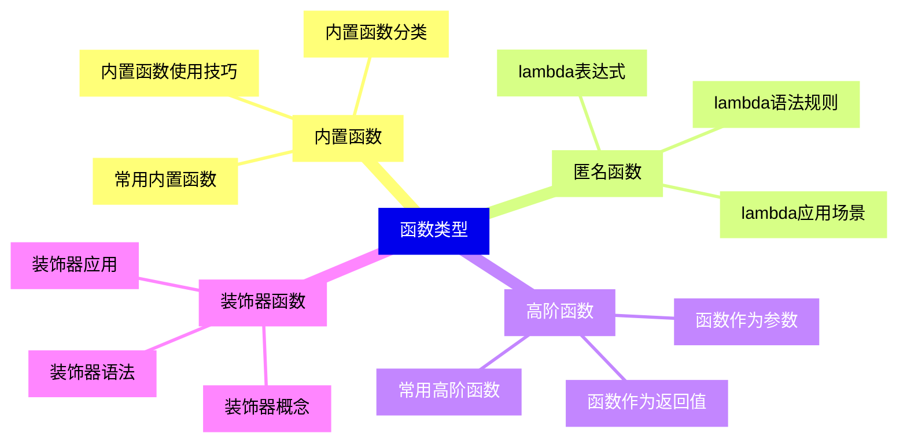
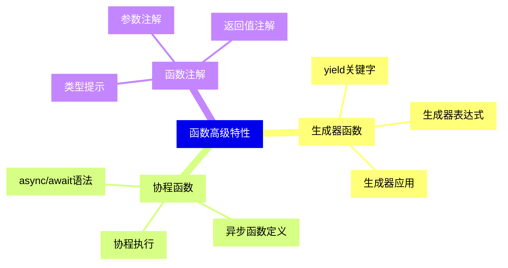
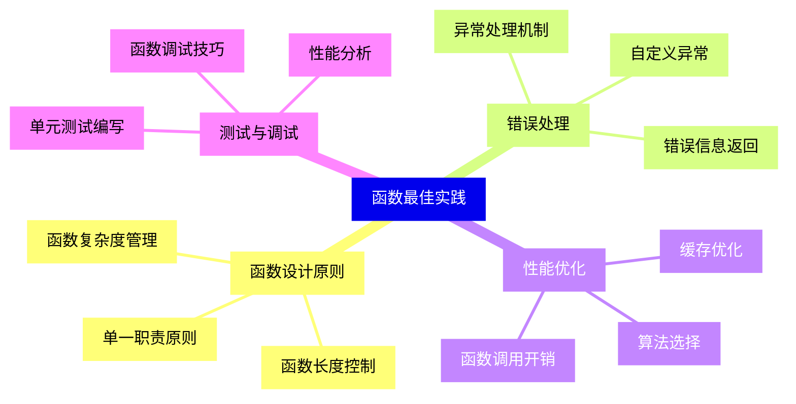
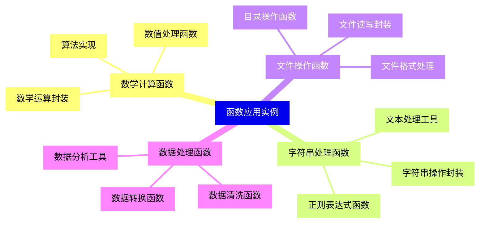


### 1 [函数概述](#1)
#### 1.1 [函数的基本概念](#1)
##### 1.1.1 [什么是函数](#1)
##### 1.1.2 [函数的作用和意义](#1)
##### 1.1.3 [函数的分类](#1)
#### 1.2 [Python函数的特点](#1)
##### 1.2.1 [动态类型支持](#1)
##### 1.2.2 [一等公民特性](#1)
##### 1.2.3 [内置函数与自定义函数](#1)
### 2 [函数的定义与调用](#2)
#### 2.1 [函数定义语法](#2)
##### 2.1.1 [def关键字使用](#2)
##### 2.1.2 [函数命名规范](#2)
##### 2.1.3 [函数体结构](#2)
#### 2.2 [函数调用方法](#2)
##### 2.2.1 [基本调用方式](#2)
##### 2.2.2 [函数调用栈](#2)
##### 2.2.3 [递归调用](#2)
#### 2.3 [函数文档字符串](#2)
##### 2.3.1 [docstring编写规范](#2)
##### 2.3.2 [文档字符串访问](#2)
##### 2.3.3 [最佳实践](#2)
### 3 [函数参数](#3)
#### 3.1 [位置参数](#3)
##### 3.1.1 [必需参数](#3)
##### 3.1.2 [参数顺序](#3)
##### 3.1.3 [参数数量匹配](#3)
#### 3.2 [默认参数](#3)
##### 3.2.1 [默认值设置](#3)
##### 3.2.2 [默认参数位置](#3)
##### 3.2.3 [可变对象作为默认参数](#3)
#### 3.3 [关键字参数](#3)
##### 3.3.1 [关键字参数语法](#3)
##### 3.3.2 [参数传递顺序](#3)
##### 3.3.3 [关键字参数优势](#3)
#### 3.4 [可变参数](#3)
##### 3.4.1 [*args参数](#3)
##### 3.4.2 [**kwargs参数](#3)
##### 3.4.3 [参数解包](#3)
#### 3.5 [参数组合规则](#3)
##### 3.5.1 [参数顺序规范](#3)
##### 3.5.2 [参数类型混合使用](#3)
##### 3.5.3 [参数验证](#3)
### 4 [返回值](#4)
#### 4.1 [return语句](#4)
##### 4.1.1 [返回值语法](#4)
##### 4.1.2 [多返回值](#4)
##### 4.1.3 [隐式返回None](#4)
#### 4.2 [返回值类型](#4)
##### 4.2.1 [基本数据类型返回](#4)
##### 4.2.2 [复合数据类型返回](#4)
##### 4.2.3 [函数返回函数](#4)
#### 4.3 [返回值处理](#4)
##### 4.3.1 [返回值接收](#4)
##### 4.3.2 [返回值解包](#4)
##### 4.3.3 [返回值验证](#4)
### 5 [变量作用域](#5)
#### 5.1 [局部变量](#5)
##### 5.1.1 [函数内部变量](#5)
##### 5.1.2 [局部变量生命周期](#5)
##### 5.1.3 [局部变量访问](#5)
#### 5.2 [全局变量](#5)
##### 5.2.1 [全局变量定义](#5)
##### 5.2.2 [global关键字](#5)
##### 5.2.3 [全局变量修改](#5)
#### 5.3 [嵌套作用域](#5)
##### 5.3.1 [闭包函数](#5)
##### 5.3.2 [nonlocal关键字](#5)
##### 5.3.3 [作用域链](#5)
#### 5.4 [命名空间](#5)
##### 5.4.1 [LEGB规则](#5)
##### 5.4.2 [命名空间查找顺序](#5)
##### 5.4.3 [命名空间管理](#5)
### 6 [函数类型](#6)
#### 6.1 [内置函数](#6)
##### 6.1.1 [常用内置函数](#6)
##### 6.1.2 [内置函数分类](#6)
##### 6.1.3 [内置函数使用技巧](#6)
#### 6.2 [匿名函数](#6)
##### 6.2.1 [lambda表达式](#6)
##### 6.2.2 [lambda语法规则](#6)
##### 6.2.3 [lambda应用场景](#6)
#### 6.3 [高阶函数](#6)
##### 6.3.1 [函数作为参数](#6)
##### 6.3.2 [函数作为返回值](#6)
##### 6.3.3 [常用高阶函数](#6)
#### 6.4 [装饰器函数](#6)
##### 6.4.1 [装饰器概念](#6)
##### 6.4.2 [装饰器语法](#6)
##### 6.4.3 [装饰器应用](#6)
### 7 [函数高级特性](#7)
#### 7.1 [生成器函数](#7)
##### 7.1.1 [yield关键字](#7)
##### 7.1.2 [生成器表达式](#7)
##### 7.1.3 [生成器应用](#7)
#### 7.2 [协程函数](#7)
##### 7.2.1 [async/await语法](#7)
##### 7.2.2 [异步函数定义](#7)
##### 7.2.3 [协程执行](#7)
#### 7.3 [函数注解](#7)
##### 7.3.1 [类型提示](#7)
##### 7.3.2 [参数注解](#7)
##### 7.3.3 [返回值注解](#7)
### 8 [函数最佳实践](#8)
#### 8.1 [函数设计原则](#8)
##### 8.1.1 [单一职责原则](#8)
##### 8.1.2 [函数长度控制](#8)
##### 8.1.3 [函数复杂度管理](#8)
#### 8.2 [错误处理](#8)
##### 8.2.1 [异常处理机制](#8)
##### 8.2.2 [自定义异常](#8)
##### 8.2.3 [错误信息返回](#8)
#### 8.3 [性能优化](#8)
##### 8.3.1 [函数调用开销](#8)
##### 8.3.2 [缓存优化](#8)
##### 8.3.3 [算法选择](#8)
#### 8.4 [测试与调试](#8)
##### 8.4.1 [单元测试编写](#8)
##### 8.4.2 [函数调试技巧](#8)
##### 8.4.3 [性能分析](#8)
### 9 [函数应用实例](#9)
#### 9.1 [数学计算函数](#9)
##### 9.1.1 [数值处理函数](#9)
##### 9.1.2 [数学运算封装](#9)
##### 9.1.3 [算法实现](#9)
#### 9.2 [字符串处理函数](#9)
##### 9.2.1 [字符串操作封装](#9)
##### 9.2.2 [正则表达式函数](#9)
##### 9.2.3 [文本处理工具](#9)
#### 9.3 [文件操作函数](#9)
##### 9.3.1 [文件读写封装](#9)
##### 9.3.2 [目录操作函数](#9)
##### 9.3.3 [文件格式处理](#9)
#### 9.4 [数据处理函数](#9)
##### 9.4.1 [数据清洗函数](#9)
##### 9.4.2 [数据转换函数](#9)
##### 9.4.3 [数据分析工具](#9)




### 1 函数概述

---
### 1 函数概述
___
#### 1.1 函数的基本概念
___
##### 1.1.1 什么是函数
___
##### 1.1.2 函数的作用和意义
___
##### 1.1.3 函数的分类
___
#### 1.2 Python函数的特点
___
##### 1.2.1 动态类型支持
___
##### 1.2.2 一等公民特性
___
##### 1.2.3 内置函数与自定义函数
### 2 函数的定义与调用

---
### 2 函数的定义与调用
___
#### 2.1 函数定义语法
___
##### 2.1.1 def关键字使用
___
##### 2.1.2 函数命名规范
___
##### 2.1.3 函数体结构
___
#### 2.2 函数调用方法
___
##### 2.2.1 基本调用方式
___
##### 2.2.2 函数调用栈
___
##### 2.2.3 递归调用
___
#### 2.3 函数文档字符串
___
##### 2.3.1 docstring编写规范
___
##### 2.3.2 文档字符串访问
___
##### 2.3.3 最佳实践
### 3 函数参数

---
### 3 函数参数
___
#### 3.1 位置参数
___
##### 3.1.1 必需参数
___
##### 3.1.2 参数顺序
___
##### 3.1.3 参数数量匹配
___
#### 3.2 默认参数
___
##### 3.2.1 默认值设置
___
##### 3.2.2 默认参数位置
___
##### 3.2.3 可变对象作为默认参数
___
#### 3.3 关键字参数
___
##### 3.3.1 关键字参数语法
___
##### 3.3.2 参数传递顺序
___
##### 3.3.3 关键字参数优势
___
#### 3.4 可变参数
___
##### 3.4.1 *args参数
___
##### 3.4.2 **kwargs参数
___
##### 3.4.3 参数解包
___
#### 3.5 参数组合规则
___
##### 3.5.1 参数顺序规范
___
##### 3.5.2 参数类型混合使用
___
##### 3.5.3 参数验证
### 4 返回值

---
### 4 返回值
___
#### 4.1 return语句
___
##### 4.1.1 返回值语法
___
##### 4.1.2 多返回值
___
##### 4.1.3 隐式返回None
___
#### 4.2 返回值类型
___
##### 4.2.1 基本数据类型返回
___
##### 4.2.2 复合数据类型返回
___
##### 4.2.3 函数返回函数
___
#### 4.3 返回值处理
___
##### 4.3.1 返回值接收
___
##### 4.3.2 返回值解包
___
##### 4.3.3 返回值验证
### 5 变量作用域

---
### 5 变量作用域
___
#### 5.1 局部变量
___
##### 5.1.1 函数内部变量
___
##### 5.1.2 局部变量生命周期
___
##### 5.1.3 局部变量访问
___
#### 5.2 全局变量
___
##### 5.2.1 全局变量定义
___
##### 5.2.2 global关键字
___
##### 5.2.3 全局变量修改
___
#### 5.3 嵌套作用域
___
##### 5.3.1 闭包函数
___
##### 5.3.2 nonlocal关键字
___
##### 5.3.3 作用域链
___
#### 5.4 命名空间
___
##### 5.4.1 LEGB规则
___
##### 5.4.2 命名空间查找顺序
___
##### 5.4.3 命名空间管理
### 6 函数类型

---
### 6 函数类型
___
#### 6.1 内置函数
___
##### 6.1.1 常用内置函数
___
##### 6.1.2 内置函数分类
___
##### 6.1.3 内置函数使用技巧
___
#### 6.2 匿名函数
___
##### 6.2.1 lambda表达式
___
##### 6.2.2 lambda语法规则
___
##### 6.2.3 lambda应用场景
___
#### 6.3 高阶函数
___
##### 6.3.1 函数作为参数
___
##### 6.3.2 函数作为返回值
___
##### 6.3.3 常用高阶函数
___
#### 6.4 装饰器函数
___
##### 6.4.1 装饰器概念
___
##### 6.4.2 装饰器语法
___
##### 6.4.3 装饰器应用
### 7 函数高级特性

---
### 7 函数高级特性
___
#### 7.1 生成器函数
___
##### 7.1.1 yield关键字
___
##### 7.1.2 生成器表达式
___
##### 7.1.3 生成器应用
___
#### 7.2 协程函数
___
##### 7.2.1 async/await语法
___
##### 7.2.2 异步函数定义
___
##### 7.2.3 协程执行
___
#### 7.3 函数注解
___
##### 7.3.1 类型提示
___
##### 7.3.2 参数注解
___
##### 7.3.3 返回值注解
### 8 函数最佳实践

---
### 8 函数最佳实践
___
#### 8.1 函数设计原则
___
##### 8.1.1 单一职责原则
___
##### 8.1.2 函数长度控制
___
##### 8.1.3 函数复杂度管理
___
#### 8.2 错误处理
___
##### 8.2.1 异常处理机制
___
##### 8.2.2 自定义异常
___
##### 8.2.3 错误信息返回
___
#### 8.3 性能优化
___
##### 8.3.1 函数调用开销
___
##### 8.3.2 缓存优化
___
##### 8.3.3 算法选择
___
#### 8.4 测试与调试
___
##### 8.4.1 单元测试编写
___
##### 8.4.2 函数调试技巧
___
##### 8.4.3 性能分析
### 9 函数应用实例

---
### 9 函数应用实例
___
#### 9.1 数学计算函数
___
##### 9.1.1 数值处理函数
___
##### 9.1.2 数学运算封装
___
##### 9.1.3 算法实现
___
#### 9.2 字符串处理函数
___
##### 9.2.1 字符串操作封装
___
##### 9.2.2 正则表达式函数
___
##### 9.2.3 文本处理工具
___
#### 9.3 文件操作函数
___
##### 9.3.1 文件读写封装
___
##### 9.3.2 目录操作函数
___
##### 9.3.3 文件格式处理
___
#### 9.4 数据处理函数
___
##### 9.4.1 数据清洗函数
___
##### 9.4.2 数据转换函数
___
##### 9.4.3 数据分析工具


### 1 函数概述{#1}

{}

<--->
{}
{}
{}
{}
{}
{}
{}
{}
{}
{}
{}
{}
{}
{}
{}
{}
{}

### 2 函数的定义与调用{#2}

{}
{}
{}
{}
{}
{}
{}
{}
{}
{}
{}
{}
{}
{}
{}
{}
{}
{}
{}
{}
{}
{}
{}
{}
{}
<--->

{}

### 3 函数参数{#3}

{}

<--->
{}
{}
{}
{}
{}
{}
{}
{}
{}
{}
{}
{}
{}
{}
{}
{}
{}
{}
{}
{}
{}
{}
{}
{}
{}
{}
{}
{}
{}
{}
{}
{}
{}
{}
{}
{}
{}
{}
{}
{}
{}

### 4 返回值{#4}

{}
{}
{}
{}
{}
{}
{}
{}
{}
{}
{}
{}
{}
{}
{}
{}
{}
{}
{}
{}
{}
{}
{}
{}
{}
<--->

{}

### 5 变量作用域{#5}

{}

<--->
{}
{}
{}
{}
{}
{}
{}
{}
{}
{}
{}
{}
{}
{}
{}
{}
{}
{}
{}
{}
{}
{}
{}
{}
{}
{}
{}
{}
{}
{}
{}
{}
{}

### 6 函数类型{#6}

{}
{}
{}
{}
{}
{}
{}
{}
{}
{}
{}
{}
{}
{}
{}
{}
{}
{}
{}
{}
{}
{}
{}
{}
{}
{}
{}
{}
{}
{}
{}
{}
{}
<--->

{}

### 7 函数高级特性{#7}

{}

<--->
{}
{}
{}
{}
{}
{}
{}
{}
{}
{}
{}
{}
{}
{}
{}
{}
{}
{}
{}
{}
{}
{}
{}
{}
{}

### 8 函数最佳实践{#8}

{}
{}
{}
{}
{}
{}
{}
{}
{}
{}
{}
{}
{}
{}
{}
{}
{}
{}
{}
{}
{}
{}
{}
{}
{}
{}
{}
{}
{}
{}
{}
{}
{}
<--->

{}

### 9 函数应用实例{#9}

{}

<--->
{}
{}
{}
{}
{}
{}
{}
{}
{}
{}
{}
{}
{}
{}
{}
{}
{}
{}
{}
{}
{}
{}
{}
{}
{}
{}
{}
{}
{}
{}
{}
{}
{}
