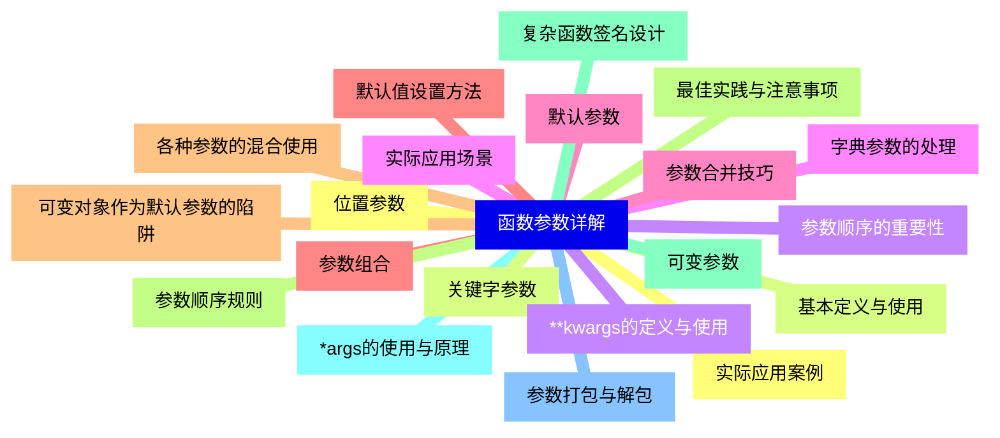
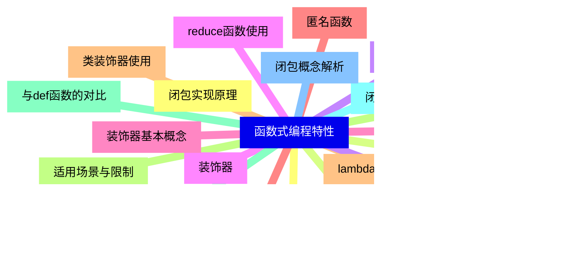
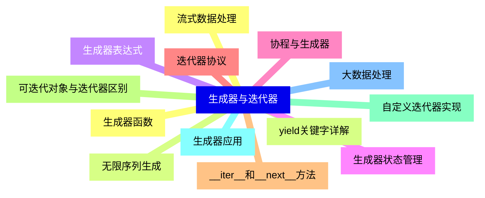
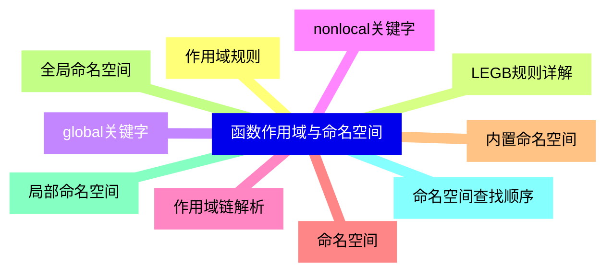
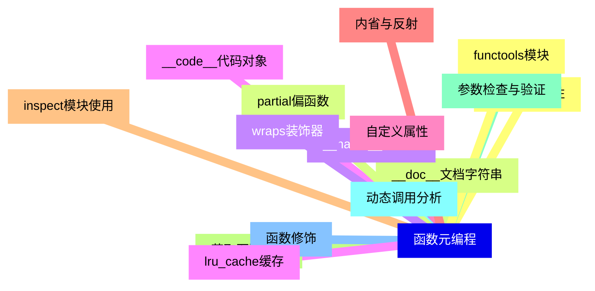
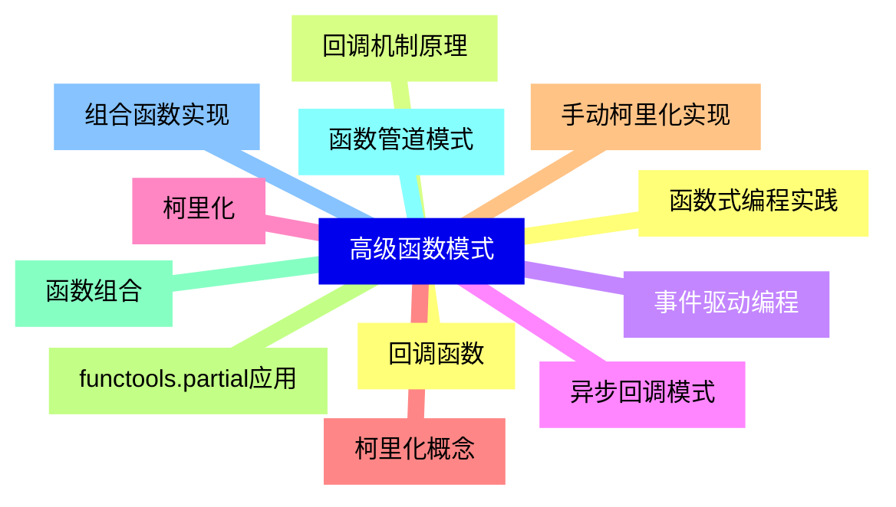
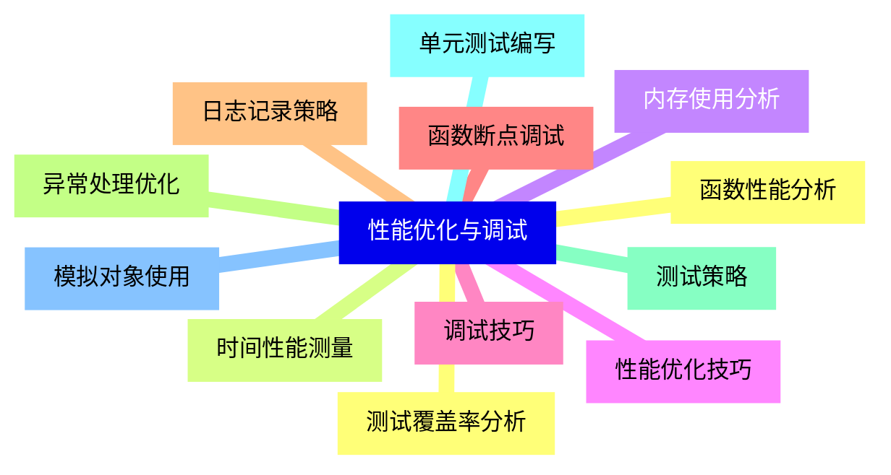
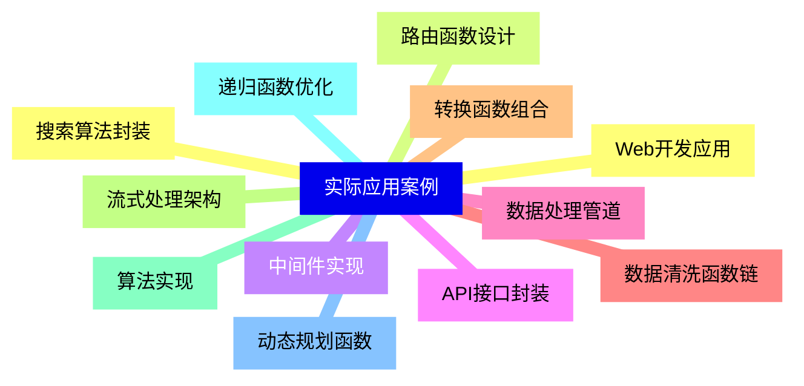


### 1 [函数参数详解](#1)
#### 1.1 [位置参数](#1)
#### 1.2 [基本定义与使用](#1)
#### 1.3 [参数顺序的重要性](#1)
#### 1.4 [实际应用场景](#1)
#### 1.5 [默认参数](#1)
#### 1.6 [默认值设置方法](#1)
#### 1.7 [可变对象作为默认参数的陷阱](#1)
#### 1.8 [最佳实践与注意事项](#1)
#### 1.9 [可变参数](#1)
#### 1.10 [*args的使用与原理](#1)
#### 1.11 [参数打包与解包](#1)
#### 1.12 [实际应用案例](#1)
#### 1.13 [关键字参数](#1)
#### 1.14 [**kwargs的定义与使用](#1)
#### 1.15 [字典参数的处理](#1)
#### 1.16 [参数合并技巧](#1)
#### 1.17 [参数组合](#1)
#### 1.18 [各种参数的混合使用](#1)
#### 1.19 [参数顺序规则](#1)
#### 1.20 [复杂函数签名设计](#1)
### 2 [函数式编程特性](#2)
#### 2.1 [高阶函数](#2)
#### 2.2 [map函数详解](#2)
#### 2.3 [filter函数应用](#2)
#### 2.4 [reduce函数使用](#2)
#### 2.5 [sorted函数高级用法](#2)
#### 2.6 [匿名函数](#2)
#### 2.7 [lambda表达式语法](#2)
#### 2.8 [适用场景与限制](#2)
#### 2.9 [与def函数的对比](#2)
#### 2.10 [闭包](#2)
#### 2.11 [闭包概念解析](#2)
#### 2.12 [闭包实现原理](#2)
#### 2.13 [变量作用域与生命周期](#2)
#### 2.14 [实际应用示例](#2)
#### 2.15 [装饰器](#2)
#### 2.16 [装饰器基本概念](#2)
#### 2.17 [函数装饰器实现](#2)
#### 2.18 [类装饰器使用](#2)
#### 2.19 [带参数装饰器](#2)
#### 2.20 [装饰器链与叠加](#2)
### 3 [生成器与迭代器](#3)
#### 3.1 [生成器函数](#3)
#### 3.2 [yield关键字详解](#3)
#### 3.3 [生成器表达式](#3)
#### 3.4 [生成器状态管理](#3)
#### 3.5 [协程与生成器](#3)
#### 3.6 [迭代器协议](#3)
#### 3.7 [__iter__和__next__方法](#3)
#### 3.8 [可迭代对象与迭代器区别](#3)
#### 3.9 [自定义迭代器实现](#3)
#### 3.10 [生成器应用](#3)
#### 3.11 [大数据处理](#3)
#### 3.12 [流式数据处理](#3)
#### 3.13 [无限序列生成](#3)
### 4 [函数作用域与命名空间](#4)
#### 4.1 [作用域规则](#4)
#### 4.2 [LEGB规则详解](#4)
#### 4.3 [global关键字](#4)
#### 4.4 [nonlocal关键字](#4)
#### 4.5 [作用域链解析](#4)
#### 4.6 [命名空间](#4)
#### 4.7 [内置命名空间](#4)
#### 4.8 [全局命名空间](#4)
#### 4.9 [局部命名空间](#4)
#### 4.10 [命名空间查找顺序](#4)
### 5 [函数元编程](#5)
#### 5.1 [函数对象属性](#5)
#### 5.2 [__doc__文档字符串](#5)
#### 5.3 [__name__函数名](#5)
#### 5.4 [__code__代码对象](#5)
#### 5.5 [自定义属性](#5)
#### 5.6 [内省与反射](#5)
#### 5.7 [inspect模块使用](#5)
#### 5.8 [获取函数签名](#5)
#### 5.9 [参数检查与验证](#5)
#### 5.10 [动态调用分析](#5)
#### 5.11 [函数修饰](#5)
#### 5.12 [functools模块](#5)
#### 5.13 [partial偏函数](#5)
#### 5.14 [wraps装饰器](#5)
#### 5.15 [lru_cache缓存](#5)
### 6 [高级函数模式](#6)
#### 6.1 [回调函数](#6)
#### 6.2 [回调机制原理](#6)
#### 6.3 [事件驱动编程](#6)
#### 6.4 [异步回调模式](#6)
#### 6.5 [柯里化](#6)
#### 6.6 [柯里化概念](#6)
#### 6.7 [手动柯里化实现](#6)
#### 6.8 [functools.partial应用](#6)
#### 6.9 [函数组合](#6)
#### 6.10 [函数管道模式](#6)
#### 6.11 [组合函数实现](#6)
#### 6.12 [函数式编程实践](#6)
### 7 [性能优化与调试](#7)
#### 7.1 [函数性能分析](#7)
#### 7.2 [时间性能测量](#7)
#### 7.3 [内存使用分析](#7)
#### 7.4 [性能优化技巧](#7)
#### 7.5 [调试技巧](#7)
#### 7.6 [函数断点调试](#7)
#### 7.7 [日志记录策略](#7)
#### 7.8 [异常处理优化](#7)
#### 7.9 [测试策略](#7)
#### 7.10 [单元测试编写](#7)
#### 7.11 [模拟对象使用](#7)
#### 7.12 [测试覆盖率分析](#7)
### 8 [实际应用案例](#8)
#### 8.1 [Web开发应用](#8)
#### 8.2 [路由函数设计](#8)
#### 8.3 [中间件实现](#8)
#### 8.4 [API接口封装](#8)
#### 8.5 [数据处理管道](#8)
#### 8.6 [数据清洗函数链](#8)
#### 8.7 [转换函数组合](#8)
#### 8.8 [流式处理架构](#8)
#### 8.9 [算法实现](#8)
#### 8.10 [递归函数优化](#8)
#### 8.11 [动态规划函数](#8)
#### 8.12 [搜索算法封装](#8)




### 1 函数参数详解

---
### 1 函数参数详解
___
#### 1.1 位置参数
___
#### 1.2 基本定义与使用
___
#### 1.3 参数顺序的重要性
___
#### 1.4 实际应用场景
___
#### 1.5 默认参数
___
#### 1.6 默认值设置方法
___
#### 1.7 可变对象作为默认参数的陷阱
___
#### 1.8 最佳实践与注意事项
___
#### 1.9 可变参数
___
#### 1.10 *args的使用与原理
___
#### 1.11 参数打包与解包
___
#### 1.12 实际应用案例
___
#### 1.13 关键字参数
___
#### 1.14 **kwargs的定义与使用
___
#### 1.15 字典参数的处理
___
#### 1.16 参数合并技巧
___
#### 1.17 参数组合
___
#### 1.18 各种参数的混合使用
___
#### 1.19 参数顺序规则
___
#### 1.20 复杂函数签名设计
### 2 函数式编程特性

---
### 2 函数式编程特性
___
#### 2.1 高阶函数
___
#### 2.2 map函数详解
___
#### 2.3 filter函数应用
___
#### 2.4 reduce函数使用
___
#### 2.5 sorted函数高级用法
___
#### 2.6 匿名函数
___
#### 2.7 lambda表达式语法
___
#### 2.8 适用场景与限制
___
#### 2.9 与def函数的对比
___
#### 2.10 闭包
___
#### 2.11 闭包概念解析
___
#### 2.12 闭包实现原理
___
#### 2.13 变量作用域与生命周期
___
#### 2.14 实际应用示例
___
#### 2.15 装饰器
___
#### 2.16 装饰器基本概念
___
#### 2.17 函数装饰器实现
___
#### 2.18 类装饰器使用
___
#### 2.19 带参数装饰器
___
#### 2.20 装饰器链与叠加
### 3 生成器与迭代器

---
### 3 生成器与迭代器
___
#### 3.1 生成器函数
___
#### 3.2 yield关键字详解
___
#### 3.3 生成器表达式
___
#### 3.4 生成器状态管理
___
#### 3.5 协程与生成器
___
#### 3.6 迭代器协议
___
#### 3.7 __iter__和__next__方法
___
#### 3.8 可迭代对象与迭代器区别
___
#### 3.9 自定义迭代器实现
___
#### 3.10 生成器应用
___
#### 3.11 大数据处理
___
#### 3.12 流式数据处理
___
#### 3.13 无限序列生成
### 4 函数作用域与命名空间

---
### 4 函数作用域与命名空间
___
#### 4.1 作用域规则
___
#### 4.2 LEGB规则详解
___
#### 4.3 global关键字
___
#### 4.4 nonlocal关键字
___
#### 4.5 作用域链解析
___
#### 4.6 命名空间
___
#### 4.7 内置命名空间
___
#### 4.8 全局命名空间
___
#### 4.9 局部命名空间
___
#### 4.10 命名空间查找顺序
### 5 函数元编程

---
### 5 函数元编程
___
#### 5.1 函数对象属性
___
#### 5.2 __doc__文档字符串
___
#### 5.3 __name__函数名
___
#### 5.4 __code__代码对象
___
#### 5.5 自定义属性
___
#### 5.6 内省与反射
___
#### 5.7 inspect模块使用
___
#### 5.8 获取函数签名
___
#### 5.9 参数检查与验证
___
#### 5.10 动态调用分析
___
#### 5.11 函数修饰
___
#### 5.12 functools模块
___
#### 5.13 partial偏函数
___
#### 5.14 wraps装饰器
___
#### 5.15 lru_cache缓存
### 6 高级函数模式

---
### 6 高级函数模式
___
#### 6.1 回调函数
___
#### 6.2 回调机制原理
___
#### 6.3 事件驱动编程
___
#### 6.4 异步回调模式
___
#### 6.5 柯里化
___
#### 6.6 柯里化概念
___
#### 6.7 手动柯里化实现
___
#### 6.8 functools.partial应用
___
#### 6.9 函数组合
___
#### 6.10 函数管道模式
___
#### 6.11 组合函数实现
___
#### 6.12 函数式编程实践
### 7 性能优化与调试

---
### 7 性能优化与调试
___
#### 7.1 函数性能分析
___
#### 7.2 时间性能测量
___
#### 7.3 内存使用分析
___
#### 7.4 性能优化技巧
___
#### 7.5 调试技巧
___
#### 7.6 函数断点调试
___
#### 7.7 日志记录策略
___
#### 7.8 异常处理优化
___
#### 7.9 测试策略
___
#### 7.10 单元测试编写
___
#### 7.11 模拟对象使用
___
#### 7.12 测试覆盖率分析
### 8 实际应用案例

---
### 8 实际应用案例
___
#### 8.1 Web开发应用
___
#### 8.2 路由函数设计
___
#### 8.3 中间件实现
___
#### 8.4 API接口封装
___
#### 8.5 数据处理管道
___
#### 8.6 数据清洗函数链
___
#### 8.7 转换函数组合
___
#### 8.8 流式处理架构
___
#### 8.9 算法实现
___
#### 8.10 递归函数优化
___
#### 8.11 动态规划函数
___
#### 8.12 搜索算法封装


### 1 函数参数详解{#1}

{}

<--->
{}
{}
{}
{}
{}
{}
{}
{}
{}
{}
{}
{}
{}
{}
{}
{}
{}
{}
{}
{}
{}
{}
{}
{}
{}
{}
{}
{}
{}
{}
{}
{}
{}
{}
{}
{}
{}
{}
{}
{}
{}

### 2 函数式编程特性{#2}

{}
{}
{}
{}
{}
{}
{}
{}
{}
{}
{}
{}
{}
{}
{}
{}
{}
{}
{}
{}
{}
{}
{}
{}
{}
{}
{}
{}
{}
{}
{}
{}
{}
{}
{}
{}
{}
{}
{}
{}
{}
<--->

{}

### 3 生成器与迭代器{#3}

{}

<--->
{}
{}
{}
{}
{}
{}
{}
{}
{}
{}
{}
{}
{}
{}
{}
{}
{}
{}
{}
{}
{}
{}
{}
{}
{}
{}
{}

### 4 函数作用域与命名空间{#4}

{}
{}
{}
{}
{}
{}
{}
{}
{}
{}
{}
{}
{}
{}
{}
{}
{}
{}
{}
{}
{}
<--->

{}

### 5 函数元编程{#5}

{}

<--->
{}
{}
{}
{}
{}
{}
{}
{}
{}
{}
{}
{}
{}
{}
{}
{}
{}
{}
{}
{}
{}
{}
{}
{}
{}
{}
{}
{}
{}
{}
{}

### 6 高级函数模式{#6}

{}
{}
{}
{}
{}
{}
{}
{}
{}
{}
{}
{}
{}
{}
{}
{}
{}
{}
{}
{}
{}
{}
{}
{}
{}
<--->

{}

### 7 性能优化与调试{#7}

{}

<--->
{}
{}
{}
{}
{}
{}
{}
{}
{}
{}
{}
{}
{}
{}
{}
{}
{}
{}
{}
{}
{}
{}
{}
{}
{}

### 8 实际应用案例{#8}

{}
{}
{}
{}
{}
{}
{}
{}
{}
{}
{}
{}
{}
{}
{}
{}
{}
{}
{}
{}
{}
{}
{}
{}
{}
<--->

{}
