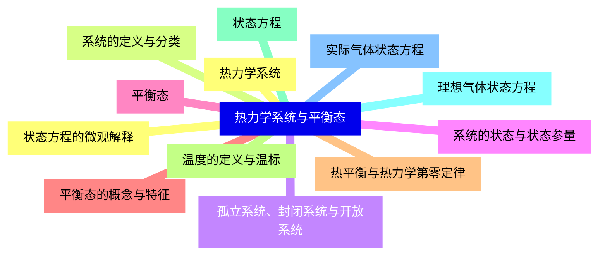
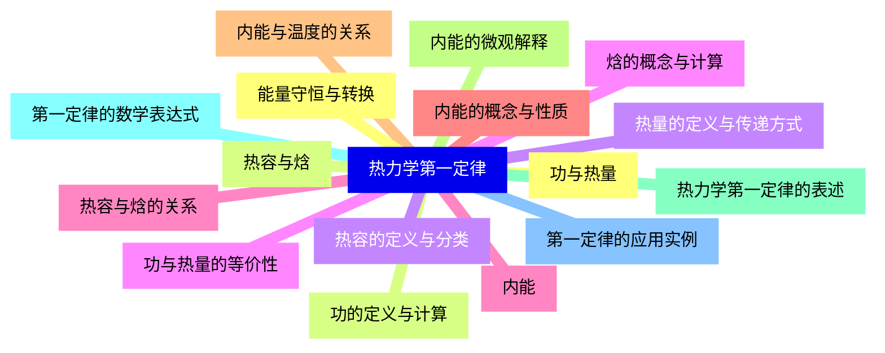
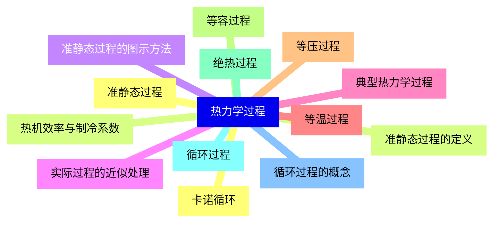
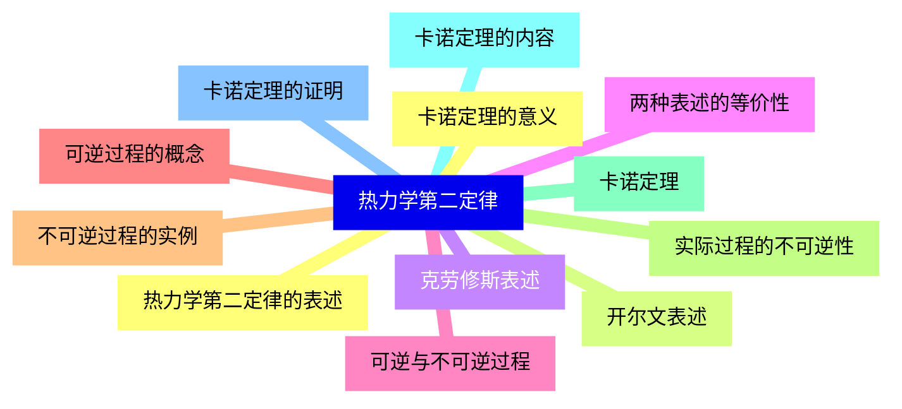
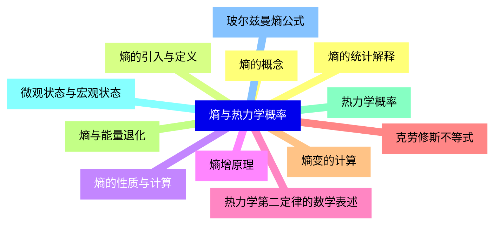
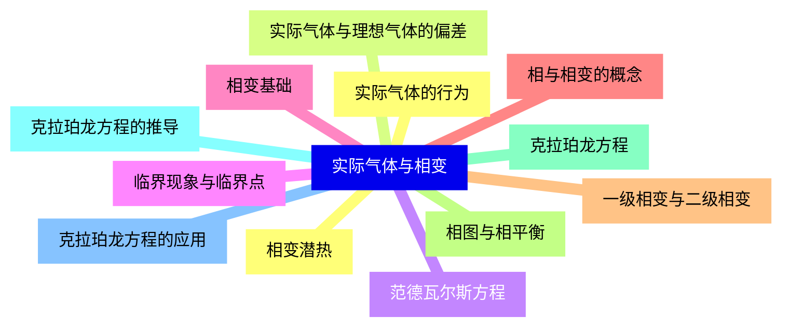
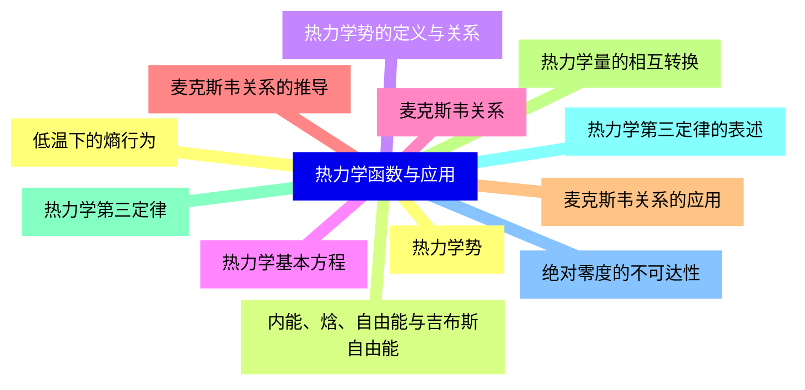
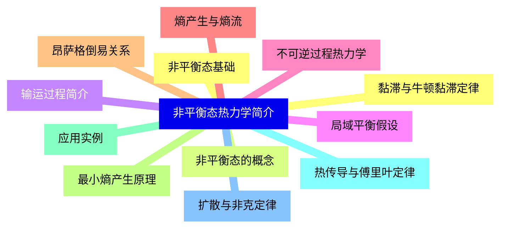
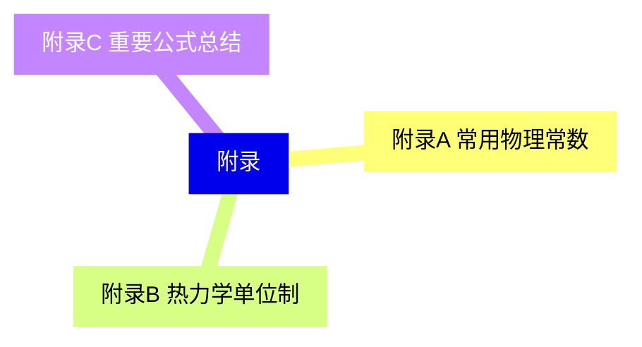


### 1 [热力学系统与平衡态](#1)
#### 1.1 [热力学系统](#1)
#### 1.2 [系统的定义与分类](#1)
#### 1.3 [孤立系统、封闭系统与开放系统](#1)
#### 1.4 [系统的状态与状态参量](#1)
#### 1.5 [平衡态](#1)
#### 1.6 [平衡态的概念与特征](#1)
#### 1.7 [热平衡与热力学第零定律](#1)
#### 1.8 [温度的定义与温标](#1)
#### 1.9 [状态方程](#1)
#### 1.10 [理想气体状态方程](#1)
#### 1.11 [实际气体状态方程](#1)
#### 1.12 [状态方程的微观解释](#1)
### 2 [热力学第一定律](#2)
#### 2.1 [功与热量](#2)
#### 2.2 [功的定义与计算](#2)
#### 2.3 [热量的定义与传递方式](#2)
#### 2.4 [功与热量的等价性](#2)
#### 2.5 [内能](#2)
#### 2.6 [内能的概念与性质](#2)
#### 2.7 [内能与温度的关系](#2)
#### 2.8 [内能的微观解释](#2)
#### 2.9 [热力学第一定律的表述](#2)
#### 2.10 [第一定律的数学表达式](#2)
#### 2.11 [第一定律的应用实例](#2)
#### 2.12 [能量守恒与转换](#2)
#### 2.13 [热容与焓](#2)
#### 2.14 [热容的定义与分类](#2)
#### 2.15 [焓的概念与计算](#2)
#### 2.16 [热容与焓的关系](#2)
### 3 [热力学过程](#3)
#### 3.1 [准静态过程](#3)
#### 3.2 [准静态过程的定义](#3)
#### 3.3 [准静态过程的图示方法](#3)
#### 3.4 [实际过程的近似处理](#3)
#### 3.5 [典型热力学过程](#3)
#### 3.6 [等温过程](#3)
#### 3.7 [等压过程](#3)
#### 3.8 [等容过程](#3)
#### 3.9 [绝热过程](#3)
#### 3.10 [循环过程](#3)
#### 3.11 [循环过程的概念](#3)
#### 3.12 [卡诺循环](#3)
#### 3.13 [热机效率与制冷系数](#3)
### 4 [热力学第二定律](#4)
#### 4.1 [热力学第二定律的表述](#4)
#### 4.2 [开尔文表述](#4)
#### 4.3 [克劳修斯表述](#4)
#### 4.4 [两种表述的等价性](#4)
#### 4.5 [可逆与不可逆过程](#4)
#### 4.6 [可逆过程的概念](#4)
#### 4.7 [不可逆过程的实例](#4)
#### 4.8 [实际过程的不可逆性](#4)
#### 4.9 [卡诺定理](#4)
#### 4.10 [卡诺定理的内容](#4)
#### 4.11 [卡诺定理的证明](#4)
#### 4.12 [卡诺定理的意义](#4)
### 5 [熵与热力学概率](#5)
#### 5.1 [熵的概念](#5)
#### 5.2 [熵的引入与定义](#5)
#### 5.3 [熵的性质与计算](#5)
#### 5.4 [熵增原理](#5)
#### 5.5 [热力学第二定律的数学表述](#5)
#### 5.6 [克劳修斯不等式](#5)
#### 5.7 [熵变的计算](#5)
#### 5.8 [熵与能量退化](#5)
#### 5.9 [热力学概率](#5)
#### 5.10 [微观状态与宏观状态](#5)
#### 5.11 [玻尔兹曼熵公式](#5)
#### 5.12 [熵的统计解释](#5)
### 6 [实际气体与相变](#6)
#### 6.1 [实际气体的行为](#6)
#### 6.2 [实际气体与理想气体的偏差](#6)
#### 6.3 [范德瓦尔斯方程](#6)
#### 6.4 [临界现象与临界点](#6)
#### 6.5 [相变基础](#6)
#### 6.6 [相与相变的概念](#6)
#### 6.7 [一级相变与二级相变](#6)
#### 6.8 [相图与相平衡](#6)
#### 6.9 [克拉珀龙方程](#6)
#### 6.10 [克拉珀龙方程的推导](#6)
#### 6.11 [克拉珀龙方程的应用](#6)
#### 6.12 [相变潜热](#6)
### 7 [热力学函数与应用](#7)
#### 7.1 [热力学势](#7)
#### 7.2 [内能、焓、自由能与吉布斯自由能](#7)
#### 7.3 [热力学势的定义与关系](#7)
#### 7.4 [热力学基本方程](#7)
#### 7.5 [麦克斯韦关系](#7)
#### 7.6 [麦克斯韦关系的推导](#7)
#### 7.7 [麦克斯韦关系的应用](#7)
#### 7.8 [热力学量的相互转换](#7)
#### 7.9 [热力学第三定律](#7)
#### 7.10 [热力学第三定律的表述](#7)
#### 7.11 [绝对零度的不可达性](#7)
#### 7.12 [低温下的熵行为](#7)
### 8 [非平衡态热力学简介](#8)
#### 8.1 [非平衡态基础](#8)
#### 8.2 [非平衡态的概念](#8)
#### 8.3 [输运过程简介](#8)
#### 8.4 [局域平衡假设](#8)
#### 8.5 [不可逆过程热力学](#8)
#### 8.6 [熵产生与熵流](#8)
#### 8.7 [昂萨格倒易关系](#8)
#### 8.8 [最小熵产生原理](#8)
#### 8.9 [应用实例](#8)
#### 8.10 [热传导与傅里叶定律](#8)
#### 8.11 [扩散与非克定律](#8)
#### 8.12 [黏滞与牛顿黏滞定律](#8)
### 9 [附录](#9)
#### 9.1 [附录A 常用物理常数](#9)
#### 9.2 [附录B 热力学单位制](#9)
#### 9.3 [附录C 重要公式总结](#9)




### 1 热力学系统与平衡态

---
### 1 热力学系统与平衡态
___
#### 1.1 热力学系统
___
#### 1.2 系统的定义与分类
___
#### 1.3 孤立系统、封闭系统与开放系统
___
#### 1.4 系统的状态与状态参量
___
#### 1.5 平衡态
___
#### 1.6 平衡态的概念与特征
___
#### 1.7 热平衡与热力学第零定律
___
#### 1.8 温度的定义与温标
___
#### 1.9 状态方程
___
#### 1.10 理想气体状态方程
___
#### 1.11 实际气体状态方程
___
#### 1.12 状态方程的微观解释
### 2 热力学第一定律

---
### 2 热力学第一定律
___
#### 2.1 功与热量
___
#### 2.2 功的定义与计算
___
#### 2.3 热量的定义与传递方式
___
#### 2.4 功与热量的等价性
___
#### 2.5 内能
___
#### 2.6 内能的概念与性质
___
#### 2.7 内能与温度的关系
___
#### 2.8 内能的微观解释
___
#### 2.9 热力学第一定律的表述
___
#### 2.10 第一定律的数学表达式
___
#### 2.11 第一定律的应用实例
___
#### 2.12 能量守恒与转换
___
#### 2.13 热容与焓
___
#### 2.14 热容的定义与分类
___
#### 2.15 焓的概念与计算
___
#### 2.16 热容与焓的关系
### 3 热力学过程

---
### 3 热力学过程
___
#### 3.1 准静态过程
___
#### 3.2 准静态过程的定义
___
#### 3.3 准静态过程的图示方法
___
#### 3.4 实际过程的近似处理
___
#### 3.5 典型热力学过程
___
#### 3.6 等温过程
___
#### 3.7 等压过程
___
#### 3.8 等容过程
___
#### 3.9 绝热过程
___
#### 3.10 循环过程
___
#### 3.11 循环过程的概念
___
#### 3.12 卡诺循环
___
#### 3.13 热机效率与制冷系数
### 4 热力学第二定律

---
### 4 热力学第二定律
___
#### 4.1 热力学第二定律的表述
___
#### 4.2 开尔文表述
___
#### 4.3 克劳修斯表述
___
#### 4.4 两种表述的等价性
___
#### 4.5 可逆与不可逆过程
___
#### 4.6 可逆过程的概念
___
#### 4.7 不可逆过程的实例
___
#### 4.8 实际过程的不可逆性
___
#### 4.9 卡诺定理
___
#### 4.10 卡诺定理的内容
___
#### 4.11 卡诺定理的证明
___
#### 4.12 卡诺定理的意义
### 5 熵与热力学概率

---
### 5 熵与热力学概率
___
#### 5.1 熵的概念
___
#### 5.2 熵的引入与定义
___
#### 5.3 熵的性质与计算
___
#### 5.4 熵增原理
___
#### 5.5 热力学第二定律的数学表述
___
#### 5.6 克劳修斯不等式
___
#### 5.7 熵变的计算
___
#### 5.8 熵与能量退化
___
#### 5.9 热力学概率
___
#### 5.10 微观状态与宏观状态
___
#### 5.11 玻尔兹曼熵公式
___
#### 5.12 熵的统计解释
### 6 实际气体与相变

---
### 6 实际气体与相变
___
#### 6.1 实际气体的行为
___
#### 6.2 实际气体与理想气体的偏差
___
#### 6.3 范德瓦尔斯方程
___
#### 6.4 临界现象与临界点
___
#### 6.5 相变基础
___
#### 6.6 相与相变的概念
___
#### 6.7 一级相变与二级相变
___
#### 6.8 相图与相平衡
___
#### 6.9 克拉珀龙方程
___
#### 6.10 克拉珀龙方程的推导
___
#### 6.11 克拉珀龙方程的应用
___
#### 6.12 相变潜热
### 7 热力学函数与应用

---
### 7 热力学函数与应用
___
#### 7.1 热力学势
___
#### 7.2 内能、焓、自由能与吉布斯自由能
___
#### 7.3 热力学势的定义与关系
___
#### 7.4 热力学基本方程
___
#### 7.5 麦克斯韦关系
___
#### 7.6 麦克斯韦关系的推导
___
#### 7.7 麦克斯韦关系的应用
___
#### 7.8 热力学量的相互转换
___
#### 7.9 热力学第三定律
___
#### 7.10 热力学第三定律的表述
___
#### 7.11 绝对零度的不可达性
___
#### 7.12 低温下的熵行为
### 8 非平衡态热力学简介

---
### 8 非平衡态热力学简介
___
#### 8.1 非平衡态基础
___
#### 8.2 非平衡态的概念
___
#### 8.3 输运过程简介
___
#### 8.4 局域平衡假设
___
#### 8.5 不可逆过程热力学
___
#### 8.6 熵产生与熵流
___
#### 8.7 昂萨格倒易关系
___
#### 8.8 最小熵产生原理
___
#### 8.9 应用实例
___
#### 8.10 热传导与傅里叶定律
___
#### 8.11 扩散与非克定律
___
#### 8.12 黏滞与牛顿黏滞定律
### 9 附录

---
### 9 附录
___
#### 9.1 附录A 常用物理常数
___
#### 9.2 附录B 热力学单位制
___
#### 9.3 附录C 重要公式总结


### 1 热力学系统与平衡态{#1}

{}

<--->
{}
{}
{}
{}
{}
{}
{}
{}
{}
{}
{}
{}
{}
{}
{}
{}
{}
{}
{}
{}
{}
{}
{}
{}
{}

### 2 热力学第一定律{#2}

{}
{}
{}
{}
{}
{}
{}
{}
{}
{}
{}
{}
{}
{}
{}
{}
{}
{}
{}
{}
{}
{}
{}
{}
{}
{}
{}
{}
{}
{}
{}
{}
{}
<--->

{}

### 3 热力学过程{#3}

{}

<--->
{}
{}
{}
{}
{}
{}
{}
{}
{}
{}
{}
{}
{}
{}
{}
{}
{}
{}
{}
{}
{}
{}
{}
{}
{}
{}
{}

### 4 热力学第二定律{#4}

{}
{}
{}
{}
{}
{}
{}
{}
{}
{}
{}
{}
{}
{}
{}
{}
{}
{}
{}
{}
{}
{}
{}
{}
{}
<--->

{}

### 5 熵与热力学概率{#5}

{}

<--->
{}
{}
{}
{}
{}
{}
{}
{}
{}
{}
{}
{}
{}
{}
{}
{}
{}
{}
{}
{}
{}
{}
{}
{}
{}

### 6 实际气体与相变{#6}

{}
{}
{}
{}
{}
{}
{}
{}
{}
{}
{}
{}
{}
{}
{}
{}
{}
{}
{}
{}
{}
{}
{}
{}
{}
<--->

{}

### 7 热力学函数与应用{#7}

{}

<--->
{}
{}
{}
{}
{}
{}
{}
{}
{}
{}
{}
{}
{}
{}
{}
{}
{}
{}
{}
{}
{}
{}
{}
{}
{}

### 8 非平衡态热力学简介{#8}

{}
{}
{}
{}
{}
{}
{}
{}
{}
{}
{}
{}
{}
{}
{}
{}
{}
{}
{}
{}
{}
{}
{}
{}
{}
<--->

{}

### 9 附录{#9}

{}

<--->
{}
{}
{}
{}
{}
{}
{}
