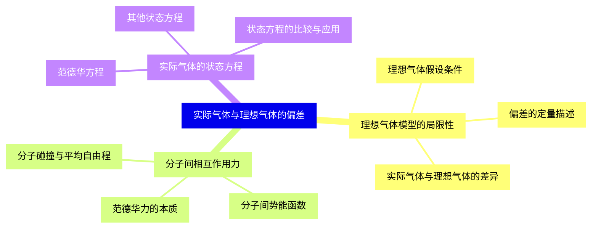
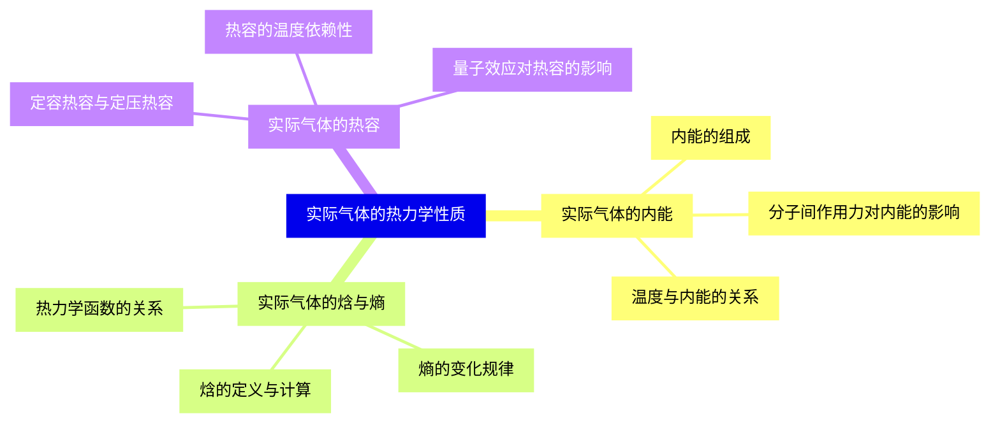
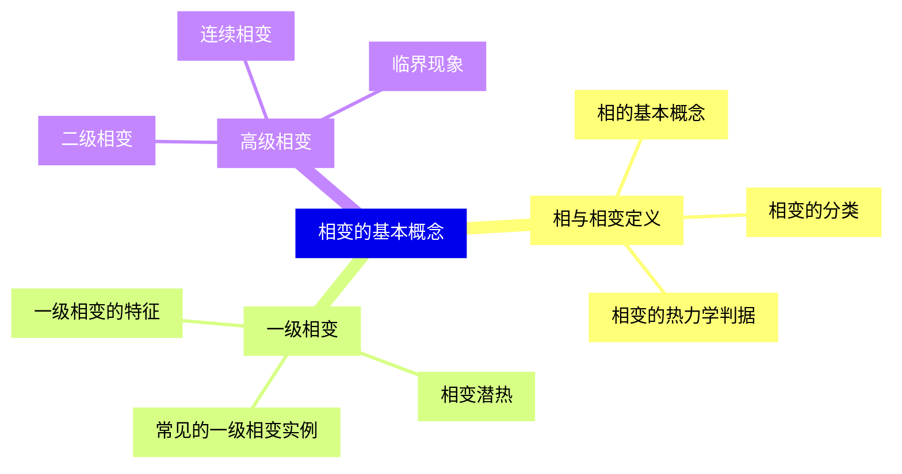
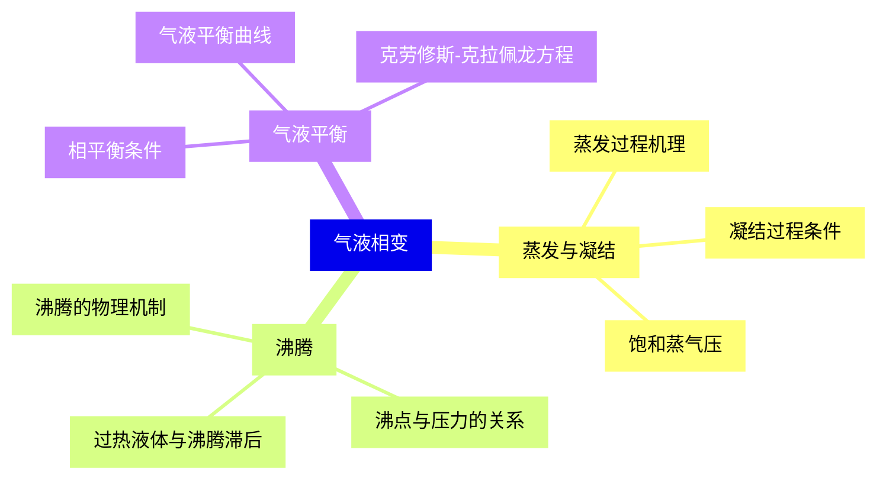
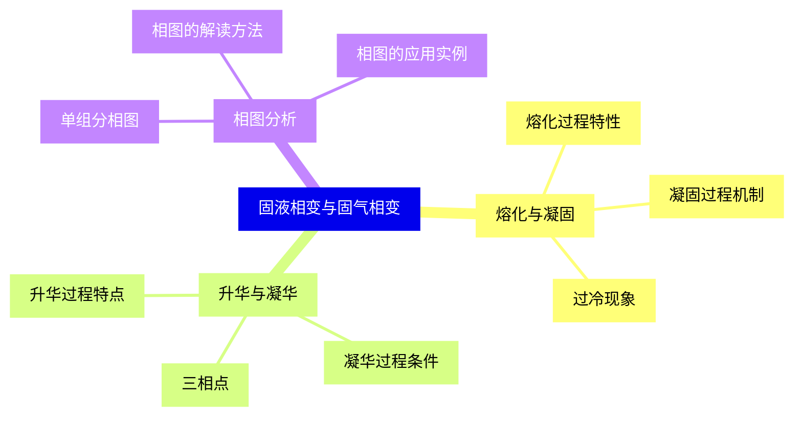
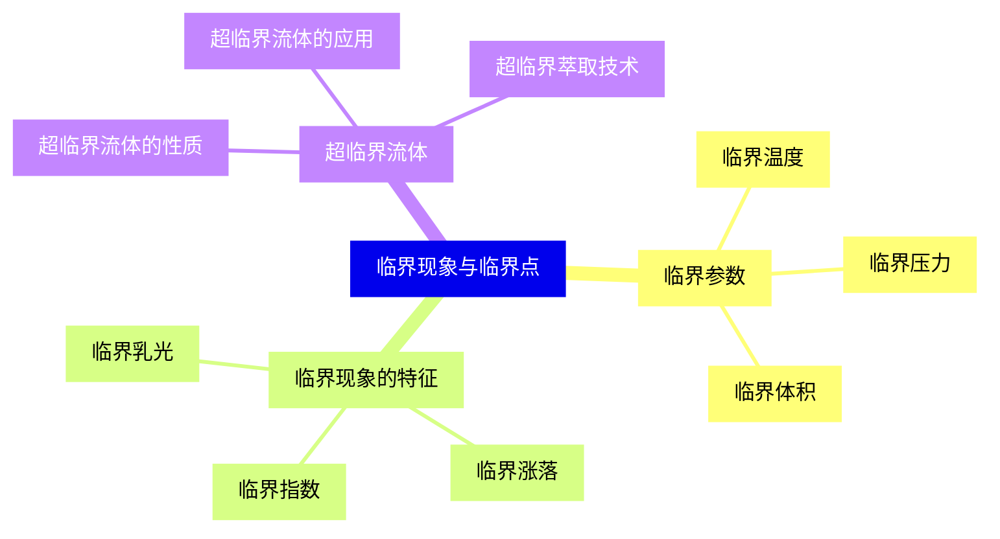
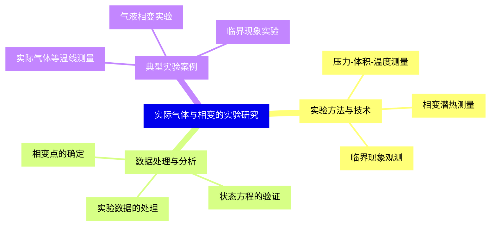
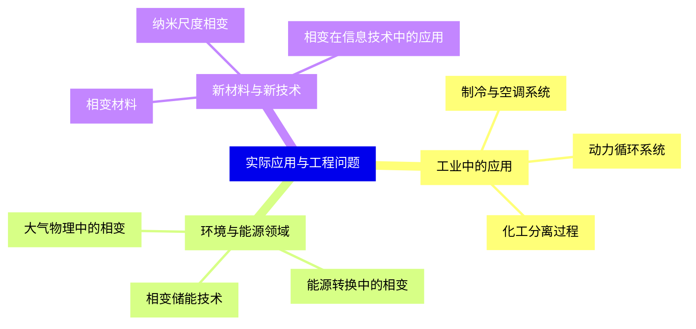


### 1 [实际气体与理想气体的偏差](#1)
#### 1.1 [理想气体模型的局限性](#1)
##### 1.1.1 [理想气体假设条件](#1)
##### 1.1.2 [实际气体与理想气体的差异](#1)
##### 1.1.3 [偏差的定量描述](#1)
#### 1.2 [分子间相互作用力](#1)
##### 1.2.1 [范德华力的本质](#1)
##### 1.2.2 [分子间势能函数](#1)
##### 1.2.3 [分子碰撞与平均自由程](#1)
#### 1.3 [实际气体的状态方程](#1)
##### 1.3.1 [范德华方程](#1)
##### 1.3.2 [其他状态方程](#1)
##### 1.3.3 [状态方程的比较与应用](#1)
### 2 [实际气体的热力学性质](#2)
#### 2.1 [实际气体的内能](#2)
##### 2.1.1 [内能的组成](#2)
##### 2.1.2 [温度与内能的关系](#2)
##### 2.1.3 [分子间作用力对内能的影响](#2)
#### 2.2 [实际气体的焓与熵](#2)
##### 2.2.1 [焓的定义与计算](#2)
##### 2.2.2 [熵的变化规律](#2)
##### 2.2.3 [热力学函数的关系](#2)
#### 2.3 [实际气体的热容](#2)
##### 2.3.1 [定容热容与定压热容](#2)
##### 2.3.2 [热容的温度依赖性](#2)
##### 2.3.3 [量子效应对热容的影响](#2)
### 3 [相变的基本概念](#3)
#### 3.1 [相与相变定义](#3)
##### 3.1.1 [相的基本概念](#3)
##### 3.1.2 [相变的分类](#3)
##### 3.1.3 [相变的热力学判据](#3)
#### 3.2 [一级相变](#3)
##### 3.2.1 [一级相变的特征](#3)
##### 3.2.2 [相变潜热](#3)
##### 3.2.3 [常见的一级相变实例](#3)
#### 3.3 [高级相变](#3)
##### 3.3.1 [二级相变](#3)
##### 3.3.2 [连续相变](#3)
##### 3.3.3 [临界现象](#3)
### 4 [气液相变](#4)
#### 4.1 [蒸发与凝结](#4)
##### 4.1.1 [蒸发过程机理](#4)
##### 4.1.2 [凝结过程条件](#4)
##### 4.1.3 [饱和蒸气压](#4)
#### 4.2 [沸腾](#4)
##### 4.2.1 [沸腾的物理机制](#4)
##### 4.2.2 [沸点与压力的关系](#4)
##### 4.2.3 [过热液体与沸腾滞后](#4)
#### 4.3 [气液平衡](#4)
##### 4.3.1 [相平衡条件](#4)
##### 4.3.2 [气液平衡曲线](#4)
##### 4.3.3 [克劳修斯-克拉佩龙方程](#4)
### 5 [固液相变与固气相变](#5)
#### 5.1 [熔化与凝固](#5)
##### 5.1.1 [熔化过程特性](#5)
##### 5.1.2 [凝固过程机制](#5)
##### 5.1.3 [过冷现象](#5)
#### 5.2 [升华与凝华](#5)
##### 5.2.1 [升华过程特点](#5)
##### 5.2.2 [凝华过程条件](#5)
##### 5.2.3 [三相点](#5)
#### 5.3 [相图分析](#5)
##### 5.3.1 [单组分相图](#5)
##### 5.3.2 [相图的解读方法](#5)
##### 5.3.3 [相图的应用实例](#5)
### 6 [临界现象与临界点](#6)
#### 6.1 [临界参数](#6)
##### 6.1.1 [临界温度](#6)
##### 6.1.2 [临界压力](#6)
##### 6.1.3 [临界体积](#6)
#### 6.2 [临界现象的特征](#6)
##### 6.2.1 [临界乳光](#6)
##### 6.2.2 [临界涨落](#6)
##### 6.2.3 [临界指数](#6)
#### 6.3 [超临界流体](#6)
##### 6.3.1 [超临界流体的性质](#6)
##### 6.3.2 [超临界流体的应用](#6)
##### 6.3.3 [超临界萃取技术](#6)
### 7 [实际气体与相变的实验研究](#7)
#### 7.1 [实验方法与技术](#7)
##### 7.1.1 [压力-体积-温度测量](#7)
##### 7.1.2 [相变潜热测量](#7)
##### 7.1.3 [临界现象观测](#7)
#### 7.2 [数据处理与分析](#7)
##### 7.2.1 [实验数据的处理](#7)
##### 7.2.2 [状态方程的验证](#7)
##### 7.2.3 [相变点的确定](#7)
#### 7.3 [典型实验案例](#7)
##### 7.3.1 [实际气体等温线测量](#7)
##### 7.3.2 [气液相变实验](#7)
##### 7.3.3 [临界现象实验](#7)
### 8 [实际应用与工程问题](#8)
#### 8.1 [工业中的应用](#8)
##### 8.1.1 [制冷与空调系统](#8)
##### 8.1.2 [动力循环系统](#8)
##### 8.1.3 [化工分离过程](#8)
#### 8.2 [环境与能源领域](#8)
##### 8.2.1 [大气物理中的相变](#8)
##### 8.2.2 [能源转换中的相变](#8)
##### 8.2.3 [相变储能技术](#8)
#### 8.3 [新材料与新技术](#8)
##### 8.3.1 [相变材料](#8)
##### 8.3.2 [纳米尺度相变](#8)
##### 8.3.3 [相变在信息技术中的应用](#8)




### 1 实际气体与理想气体的偏差

---
### 1 实际气体与理想气体的偏差
___
#### 1.1 理想气体模型的局限性
___
##### 1.1.1 理想气体假设条件
___
##### 1.1.2 实际气体与理想气体的差异
___
##### 1.1.3 偏差的定量描述
___
#### 1.2 分子间相互作用力
___
##### 1.2.1 范德华力的本质
___
##### 1.2.2 分子间势能函数
___
##### 1.2.3 分子碰撞与平均自由程
___
#### 1.3 实际气体的状态方程
___
##### 1.3.1 范德华方程
___
##### 1.3.2 其他状态方程
___
##### 1.3.3 状态方程的比较与应用
### 2 实际气体的热力学性质

---
### 2 实际气体的热力学性质
___
#### 2.1 实际气体的内能
___
##### 2.1.1 内能的组成
___
##### 2.1.2 温度与内能的关系
___
##### 2.1.3 分子间作用力对内能的影响
___
#### 2.2 实际气体的焓与熵
___
##### 2.2.1 焓的定义与计算
___
##### 2.2.2 熵的变化规律
___
##### 2.2.3 热力学函数的关系
___
#### 2.3 实际气体的热容
___
##### 2.3.1 定容热容与定压热容
___
##### 2.3.2 热容的温度依赖性
___
##### 2.3.3 量子效应对热容的影响
### 3 相变的基本概念

---
### 3 相变的基本概念
___
#### 3.1 相与相变定义
___
##### 3.1.1 相的基本概念
___
##### 3.1.2 相变的分类
___
##### 3.1.3 相变的热力学判据
___
#### 3.2 一级相变
___
##### 3.2.1 一级相变的特征
___
##### 3.2.2 相变潜热
___
##### 3.2.3 常见的一级相变实例
___
#### 3.3 高级相变
___
##### 3.3.1 二级相变
___
##### 3.3.2 连续相变
___
##### 3.3.3 临界现象
### 4 气液相变

---
### 4 气液相变
___
#### 4.1 蒸发与凝结
___
##### 4.1.1 蒸发过程机理
___
##### 4.1.2 凝结过程条件
___
##### 4.1.3 饱和蒸气压
___
#### 4.2 沸腾
___
##### 4.2.1 沸腾的物理机制
___
##### 4.2.2 沸点与压力的关系
___
##### 4.2.3 过热液体与沸腾滞后
___
#### 4.3 气液平衡
___
##### 4.3.1 相平衡条件
___
##### 4.3.2 气液平衡曲线
___
##### 4.3.3 克劳修斯-克拉佩龙方程
### 5 固液相变与固气相变

---
### 5 固液相变与固气相变
___
#### 5.1 熔化与凝固
___
##### 5.1.1 熔化过程特性
___
##### 5.1.2 凝固过程机制
___
##### 5.1.3 过冷现象
___
#### 5.2 升华与凝华
___
##### 5.2.1 升华过程特点
___
##### 5.2.2 凝华过程条件
___
##### 5.2.3 三相点
___
#### 5.3 相图分析
___
##### 5.3.1 单组分相图
___
##### 5.3.2 相图的解读方法
___
##### 5.3.3 相图的应用实例
### 6 临界现象与临界点

---
### 6 临界现象与临界点
___
#### 6.1 临界参数
___
##### 6.1.1 临界温度
___
##### 6.1.2 临界压力
___
##### 6.1.3 临界体积
___
#### 6.2 临界现象的特征
___
##### 6.2.1 临界乳光
___
##### 6.2.2 临界涨落
___
##### 6.2.3 临界指数
___
#### 6.3 超临界流体
___
##### 6.3.1 超临界流体的性质
___
##### 6.3.2 超临界流体的应用
___
##### 6.3.3 超临界萃取技术
### 7 实际气体与相变的实验研究

---
### 7 实际气体与相变的实验研究
___
#### 7.1 实验方法与技术
___
##### 7.1.1 压力-体积-温度测量
___
##### 7.1.2 相变潜热测量
___
##### 7.1.3 临界现象观测
___
#### 7.2 数据处理与分析
___
##### 7.2.1 实验数据的处理
___
##### 7.2.2 状态方程的验证
___
##### 7.2.3 相变点的确定
___
#### 7.3 典型实验案例
___
##### 7.3.1 实际气体等温线测量
___
##### 7.3.2 气液相变实验
___
##### 7.3.3 临界现象实验
### 8 实际应用与工程问题

---
### 8 实际应用与工程问题
___
#### 8.1 工业中的应用
___
##### 8.1.1 制冷与空调系统
___
##### 8.1.2 动力循环系统
___
##### 8.1.3 化工分离过程
___
#### 8.2 环境与能源领域
___
##### 8.2.1 大气物理中的相变
___
##### 8.2.2 能源转换中的相变
___
##### 8.2.3 相变储能技术
___
#### 8.3 新材料与新技术
___
##### 8.3.1 相变材料
___
##### 8.3.2 纳米尺度相变
___
##### 8.3.3 相变在信息技术中的应用


### 1 实际气体与理想气体的偏差{#1}

{}

<--->
{}
{}
{}
{}
{}
{}
{}
{}
{}
{}
{}
{}
{}
{}
{}
{}
{}
{}
{}
{}
{}
{}
{}
{}
{}

### 2 实际气体的热力学性质{#2}

{}
{}
{}
{}
{}
{}
{}
{}
{}
{}
{}
{}
{}
{}
{}
{}
{}
{}
{}
{}
{}
{}
{}
{}
{}
<--->

{}

### 3 相变的基本概念{#3}

{}

<--->
{}
{}
{}
{}
{}
{}
{}
{}
{}
{}
{}
{}
{}
{}
{}
{}
{}
{}
{}
{}
{}
{}
{}
{}
{}

### 4 气液相变{#4}

{}
{}
{}
{}
{}
{}
{}
{}
{}
{}
{}
{}
{}
{}
{}
{}
{}
{}
{}
{}
{}
{}
{}
{}
{}
<--->

{}

### 5 固液相变与固气相变{#5}

{}

<--->
{}
{}
{}
{}
{}
{}
{}
{}
{}
{}
{}
{}
{}
{}
{}
{}
{}
{}
{}
{}
{}
{}
{}
{}
{}

### 6 临界现象与临界点{#6}

{}
{}
{}
{}
{}
{}
{}
{}
{}
{}
{}
{}
{}
{}
{}
{}
{}
{}
{}
{}
{}
{}
{}
{}
{}
<--->

{}

### 7 实际气体与相变的实验研究{#7}

{}

<--->
{}
{}
{}
{}
{}
{}
{}
{}
{}
{}
{}
{}
{}
{}
{}
{}
{}
{}
{}
{}
{}
{}
{}
{}
{}

### 8 实际应用与工程问题{#8}

{}
{}
{}
{}
{}
{}
{}
{}
{}
{}
{}
{}
{}
{}
{}
{}
{}
{}
{}
{}
{}
{}
{}
{}
{}
<--->

{}
