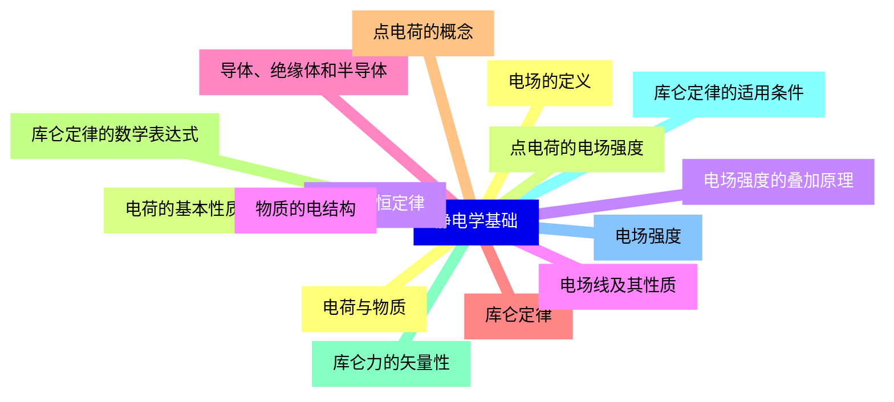
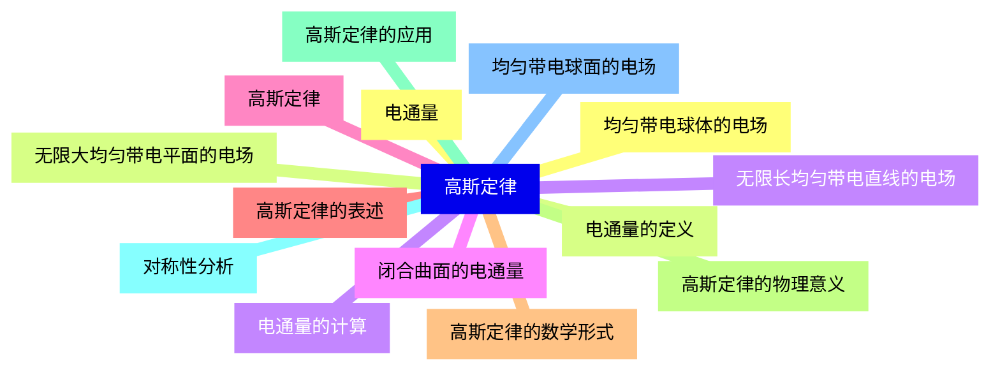
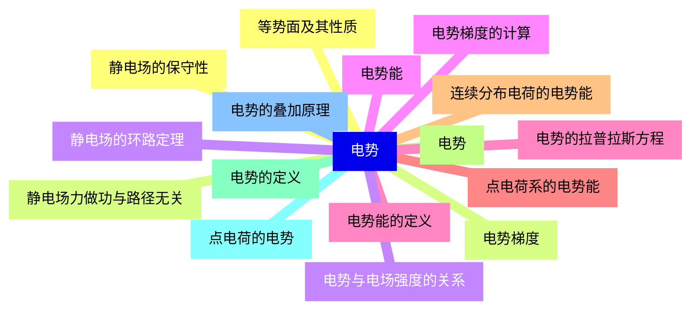
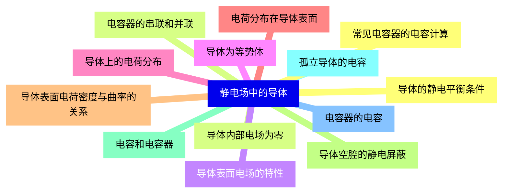
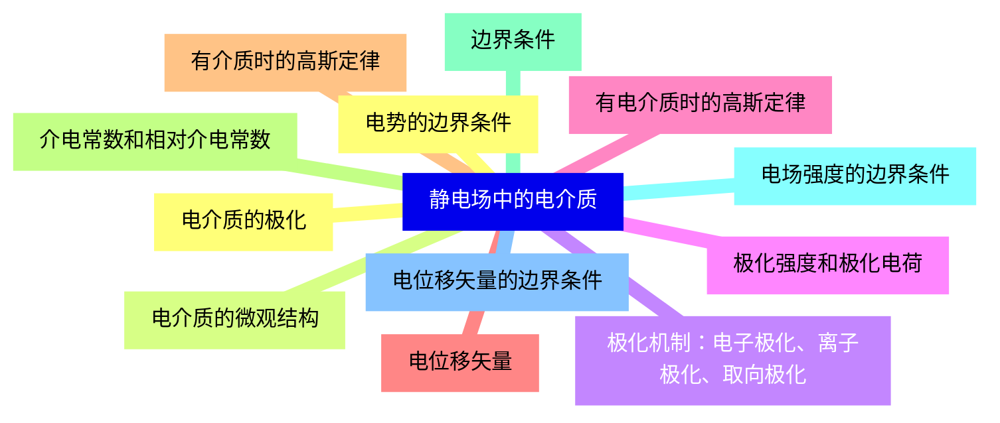
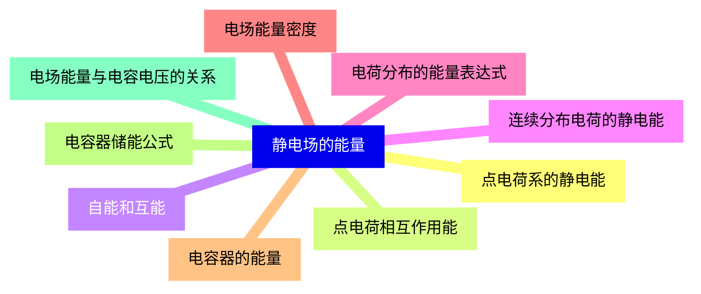
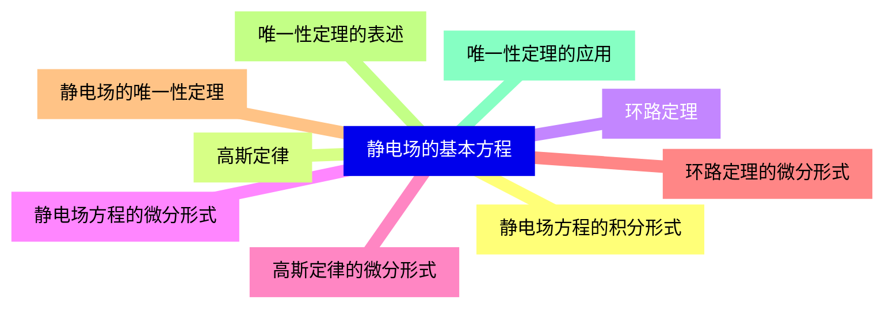
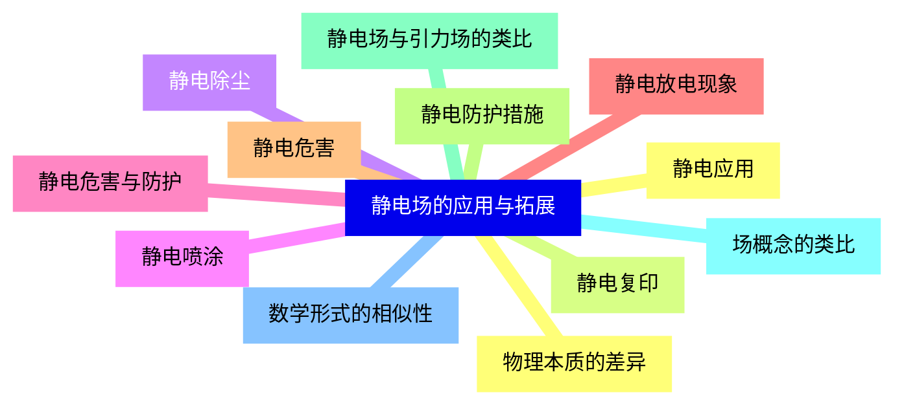


### 1 [静电学基础](#1)
#### 1.1 [电荷与物质](#1)
#### 1.2 [电荷的基本性质](#1)
#### 1.3 [电荷守恒定律](#1)
#### 1.4 [物质的电结构](#1)
#### 1.5 [导体、绝缘体和半导体](#1)
#### 1.6 [库仑定律](#1)
#### 1.7 [点电荷的概念](#1)
#### 1.8 [库仑定律的数学表达式](#1)
#### 1.9 [库仑力的矢量性](#1)
#### 1.10 [库仑定律的适用条件](#1)
#### 1.11 [电场强度](#1)
#### 1.12 [电场的定义](#1)
#### 1.13 [点电荷的电场强度](#1)
#### 1.14 [电场强度的叠加原理](#1)
#### 1.15 [电场线及其性质](#1)
### 2 [高斯定律](#2)
#### 2.1 [电通量](#2)
#### 2.2 [电通量的定义](#2)
#### 2.3 [电通量的计算](#2)
#### 2.4 [闭合曲面的电通量](#2)
#### 2.5 [高斯定律](#2)
#### 2.6 [高斯定律的表述](#2)
#### 2.7 [高斯定律的数学形式](#2)
#### 2.8 [高斯定律的物理意义](#2)
#### 2.9 [高斯定律的应用](#2)
#### 2.10 [对称性分析](#2)
#### 2.11 [均匀带电球面的电场](#2)
#### 2.12 [均匀带电球体的电场](#2)
#### 2.13 [无限大均匀带电平面的电场](#2)
#### 2.14 [无限长均匀带电直线的电场](#2)
### 3 [电势](#3)
#### 3.1 [静电场的保守性](#3)
#### 3.2 [静电场力做功与路径无关](#3)
#### 3.3 [静电场的环路定理](#3)
#### 3.4 [电势能](#3)
#### 3.5 [电势能的定义](#3)
#### 3.6 [点电荷系的电势能](#3)
#### 3.7 [连续分布电荷的电势能](#3)
#### 3.8 [电势](#3)
#### 3.9 [电势的定义](#3)
#### 3.10 [点电荷的电势](#3)
#### 3.11 [电势的叠加原理](#3)
#### 3.12 [等势面及其性质](#3)
#### 3.13 [电势梯度](#3)
#### 3.14 [电势与电场强度的关系](#3)
#### 3.15 [电势梯度的计算](#3)
#### 3.16 [电势的拉普拉斯方程](#3)
### 4 [静电场中的导体](#4)
#### 4.1 [导体的静电平衡条件](#4)
#### 4.2 [导体内部电场为零](#4)
#### 4.3 [导体表面电场的特性](#4)
#### 4.4 [导体为等势体](#4)
#### 4.5 [导体上的电荷分布](#4)
#### 4.6 [电荷分布在导体表面](#4)
#### 4.7 [导体表面电荷密度与曲率的关系](#4)
#### 4.8 [导体空腔的静电屏蔽](#4)
#### 4.9 [电容和电容器](#4)
#### 4.10 [孤立导体的电容](#4)
#### 4.11 [电容器的电容](#4)
#### 4.12 [常见电容器的电容计算](#4)
#### 4.13 [电容器的串联和并联](#4)
### 5 [静电场中的电介质](#5)
#### 5.1 [电介质的极化](#5)
#### 5.2 [电介质的微观结构](#5)
#### 5.3 [极化机制：电子极化、离子极化、取向极化](#5)
#### 5.4 [极化强度和极化电荷](#5)
#### 5.5 [有电介质时的高斯定律](#5)
#### 5.6 [电位移矢量](#5)
#### 5.7 [有介质时的高斯定律](#5)
#### 5.8 [介电常数和相对介电常数](#5)
#### 5.9 [边界条件](#5)
#### 5.10 [电场强度的边界条件](#5)
#### 5.11 [电位移矢量的边界条件](#5)
#### 5.12 [电势的边界条件](#5)
### 6 [静电场的能量](#6)
#### 6.1 [点电荷系的静电能](#6)
#### 6.2 [点电荷相互作用能](#6)
#### 6.3 [自能和互能](#6)
#### 6.4 [连续分布电荷的静电能](#6)
#### 6.5 [电荷分布的能量表达式](#6)
#### 6.6 [电场能量密度](#6)
#### 6.7 [电容器的能量](#6)
#### 6.8 [电容器储能公式](#6)
#### 6.9 [电场能量与电容电压的关系](#6)
### 7 [静电场的基本方程](#7)
#### 7.1 [静电场方程的积分形式](#7)
#### 7.2 [高斯定律](#7)
#### 7.3 [环路定理](#7)
#### 7.4 [静电场方程的微分形式](#7)
#### 7.5 [高斯定律的微分形式](#7)
#### 7.6 [环路定理的微分形式](#7)
#### 7.7 [静电场的唯一性定理](#7)
#### 7.8 [唯一性定理的表述](#7)
#### 7.9 [唯一性定理的应用](#7)
### 8 [静电场的应用与拓展](#8)
#### 8.1 [静电应用](#8)
#### 8.2 [静电复印](#8)
#### 8.3 [静电除尘](#8)
#### 8.4 [静电喷涂](#8)
#### 8.5 [静电危害与防护](#8)
#### 8.6 [静电放电现象](#8)
#### 8.7 [静电危害](#8)
#### 8.8 [静电防护措施](#8)
#### 8.9 [静电场与引力场的类比](#8)
#### 8.10 [场概念的类比](#8)
#### 8.11 [数学形式的相似性](#8)
#### 8.12 [物理本质的差异](#8)




### 1 静电学基础

---
### 1 静电学基础
___
#### 1.1 电荷与物质
___
#### 1.2 电荷的基本性质
___
#### 1.3 电荷守恒定律
___
#### 1.4 物质的电结构
___
#### 1.5 导体、绝缘体和半导体
___
#### 1.6 库仑定律
___
#### 1.7 点电荷的概念
___
#### 1.8 库仑定律的数学表达式
___
#### 1.9 库仑力的矢量性
___
#### 1.10 库仑定律的适用条件
___
#### 1.11 电场强度
___
#### 1.12 电场的定义
___
#### 1.13 点电荷的电场强度
___
#### 1.14 电场强度的叠加原理
___
#### 1.15 电场线及其性质
### 2 高斯定律

---
### 2 高斯定律
___
#### 2.1 电通量
___
#### 2.2 电通量的定义
___
#### 2.3 电通量的计算
___
#### 2.4 闭合曲面的电通量
___
#### 2.5 高斯定律
___
#### 2.6 高斯定律的表述
___
#### 2.7 高斯定律的数学形式
___
#### 2.8 高斯定律的物理意义
___
#### 2.9 高斯定律的应用
___
#### 2.10 对称性分析
___
#### 2.11 均匀带电球面的电场
___
#### 2.12 均匀带电球体的电场
___
#### 2.13 无限大均匀带电平面的电场
___
#### 2.14 无限长均匀带电直线的电场
### 3 电势

---
### 3 电势
___
#### 3.1 静电场的保守性
___
#### 3.2 静电场力做功与路径无关
___
#### 3.3 静电场的环路定理
___
#### 3.4 电势能
___
#### 3.5 电势能的定义
___
#### 3.6 点电荷系的电势能
___
#### 3.7 连续分布电荷的电势能
___
#### 3.8 电势
___
#### 3.9 电势的定义
___
#### 3.10 点电荷的电势
___
#### 3.11 电势的叠加原理
___
#### 3.12 等势面及其性质
___
#### 3.13 电势梯度
___
#### 3.14 电势与电场强度的关系
___
#### 3.15 电势梯度的计算
___
#### 3.16 电势的拉普拉斯方程
### 4 静电场中的导体

---
### 4 静电场中的导体
___
#### 4.1 导体的静电平衡条件
___
#### 4.2 导体内部电场为零
___
#### 4.3 导体表面电场的特性
___
#### 4.4 导体为等势体
___
#### 4.5 导体上的电荷分布
___
#### 4.6 电荷分布在导体表面
___
#### 4.7 导体表面电荷密度与曲率的关系
___
#### 4.8 导体空腔的静电屏蔽
___
#### 4.9 电容和电容器
___
#### 4.10 孤立导体的电容
___
#### 4.11 电容器的电容
___
#### 4.12 常见电容器的电容计算
___
#### 4.13 电容器的串联和并联
### 5 静电场中的电介质

---
### 5 静电场中的电介质
___
#### 5.1 电介质的极化
___
#### 5.2 电介质的微观结构
___
#### 5.3 极化机制：电子极化、离子极化、取向极化
___
#### 5.4 极化强度和极化电荷
___
#### 5.5 有电介质时的高斯定律
___
#### 5.6 电位移矢量
___
#### 5.7 有介质时的高斯定律
___
#### 5.8 介电常数和相对介电常数
___
#### 5.9 边界条件
___
#### 5.10 电场强度的边界条件
___
#### 5.11 电位移矢量的边界条件
___
#### 5.12 电势的边界条件
### 6 静电场的能量

---
### 6 静电场的能量
___
#### 6.1 点电荷系的静电能
___
#### 6.2 点电荷相互作用能
___
#### 6.3 自能和互能
___
#### 6.4 连续分布电荷的静电能
___
#### 6.5 电荷分布的能量表达式
___
#### 6.6 电场能量密度
___
#### 6.7 电容器的能量
___
#### 6.8 电容器储能公式
___
#### 6.9 电场能量与电容电压的关系
### 7 静电场的基本方程

---
### 7 静电场的基本方程
___
#### 7.1 静电场方程的积分形式
___
#### 7.2 高斯定律
___
#### 7.3 环路定理
___
#### 7.4 静电场方程的微分形式
___
#### 7.5 高斯定律的微分形式
___
#### 7.6 环路定理的微分形式
___
#### 7.7 静电场的唯一性定理
___
#### 7.8 唯一性定理的表述
___
#### 7.9 唯一性定理的应用
### 8 静电场的应用与拓展

---
### 8 静电场的应用与拓展
___
#### 8.1 静电应用
___
#### 8.2 静电复印
___
#### 8.3 静电除尘
___
#### 8.4 静电喷涂
___
#### 8.5 静电危害与防护
___
#### 8.6 静电放电现象
___
#### 8.7 静电危害
___
#### 8.8 静电防护措施
___
#### 8.9 静电场与引力场的类比
___
#### 8.10 场概念的类比
___
#### 8.11 数学形式的相似性
___
#### 8.12 物理本质的差异


### 1 静电学基础{#1}

{}

<--->
{}
{}
{}
{}
{}
{}
{}
{}
{}
{}
{}
{}
{}
{}
{}
{}
{}
{}
{}
{}
{}
{}
{}
{}
{}
{}
{}
{}
{}
{}
{}

### 2 高斯定律{#2}

{}
{}
{}
{}
{}
{}
{}
{}
{}
{}
{}
{}
{}
{}
{}
{}
{}
{}
{}
{}
{}
{}
{}
{}
{}
{}
{}
{}
{}
<--->

{}

### 3 电势{#3}

{}

<--->
{}
{}
{}
{}
{}
{}
{}
{}
{}
{}
{}
{}
{}
{}
{}
{}
{}
{}
{}
{}
{}
{}
{}
{}
{}
{}
{}
{}
{}
{}
{}
{}
{}

### 4 静电场中的导体{#4}

{}
{}
{}
{}
{}
{}
{}
{}
{}
{}
{}
{}
{}
{}
{}
{}
{}
{}
{}
{}
{}
{}
{}
{}
{}
{}
{}
<--->

{}

### 5 静电场中的电介质{#5}

{}

<--->
{}
{}
{}
{}
{}
{}
{}
{}
{}
{}
{}
{}
{}
{}
{}
{}
{}
{}
{}
{}
{}
{}
{}
{}
{}

### 6 静电场的能量{#6}

{}
{}
{}
{}
{}
{}
{}
{}
{}
{}
{}
{}
{}
{}
{}
{}
{}
{}
{}
<--->

{}

### 7 静电场的基本方程{#7}

{}

<--->
{}
{}
{}
{}
{}
{}
{}
{}
{}
{}
{}
{}
{}
{}
{}
{}
{}
{}
{}

### 8 静电场的应用与拓展{#8}

{}
{}
{}
{}
{}
{}
{}
{}
{}
{}
{}
{}
{}
{}
{}
{}
{}
{}
{}
{}
{}
{}
{}
{}
{}
<--->

{}
