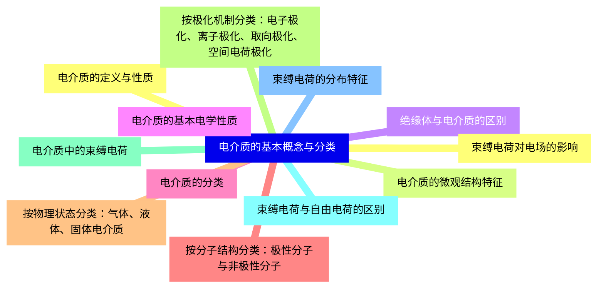
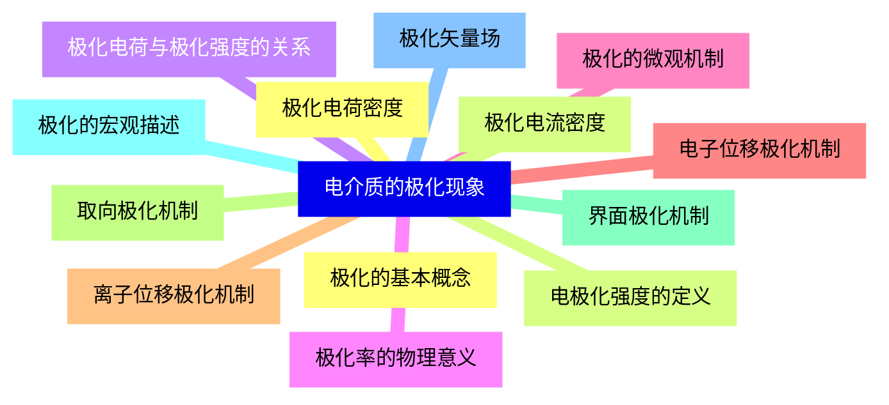
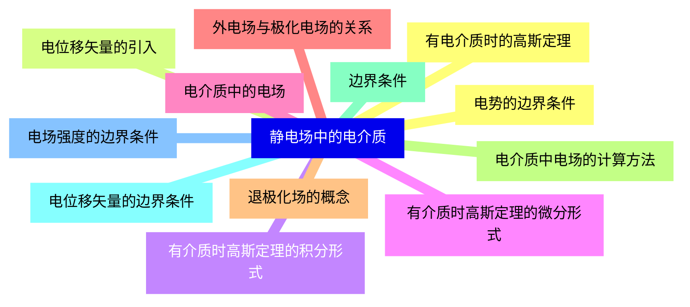
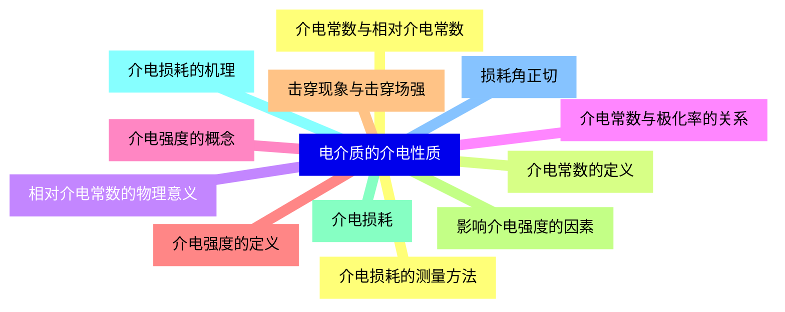
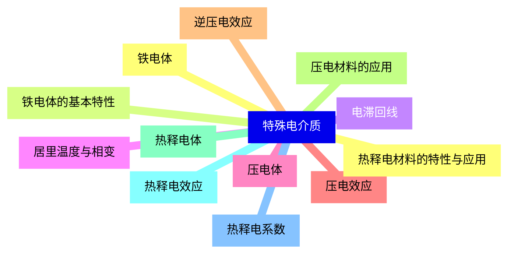
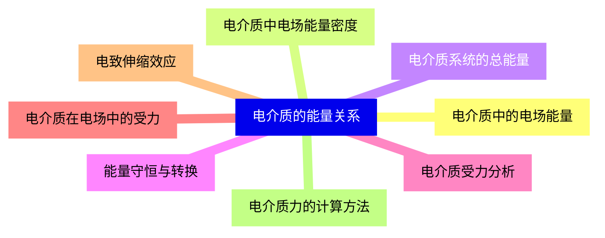
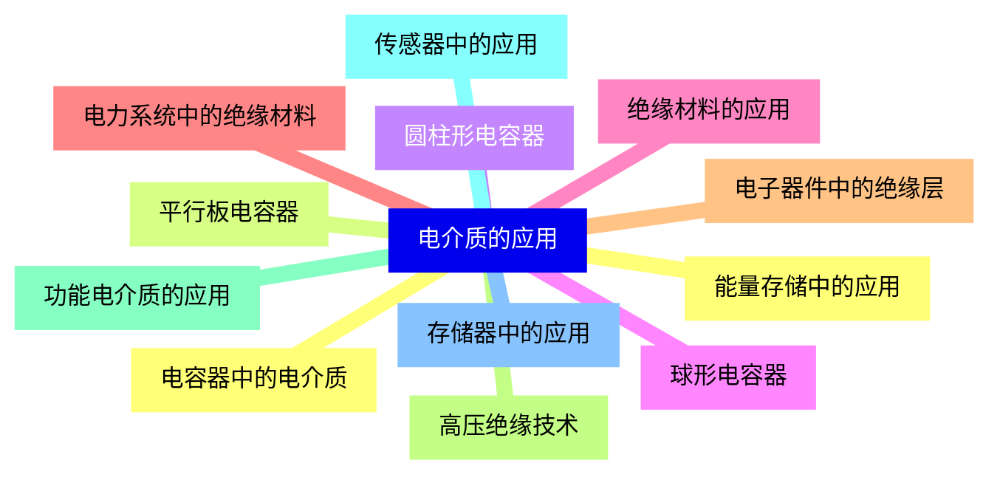
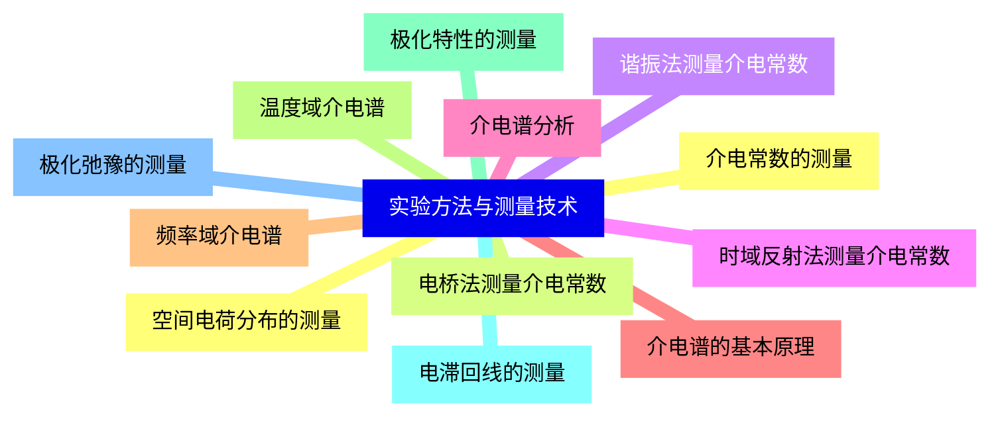


### 1 [电介质的基本概念与分类](#1)
#### 1.1 [电介质的定义与性质](#1)
#### 1.2 [电介质的微观结构特征](#1)
#### 1.3 [绝缘体与电介质的区别](#1)
#### 1.4 [电介质的基本电学性质](#1)
#### 1.5 [电介质的分类](#1)
#### 1.6 [按分子结构分类：极性分子与非极性分子](#1)
#### 1.7 [按物理状态分类：气体、液体、固体电介质](#1)
#### 1.8 [按极化机制分类：电子极化、离子极化、取向极化、空间电荷极化](#1)
#### 1.9 [电介质中的束缚电荷](#1)
#### 1.10 [束缚电荷与自由电荷的区别](#1)
#### 1.11 [束缚电荷的分布特征](#1)
#### 1.12 [束缚电荷对电场的影响](#1)
### 2 [电介质的极化现象](#2)
#### 2.1 [极化的基本概念](#2)
#### 2.2 [电极化强度的定义](#2)
#### 2.3 [极化电荷与极化强度的关系](#2)
#### 2.4 [极化率的物理意义](#2)
#### 2.5 [极化的微观机制](#2)
#### 2.6 [电子位移极化机制](#2)
#### 2.7 [离子位移极化机制](#2)
#### 2.8 [取向极化机制](#2)
#### 2.9 [界面极化机制](#2)
#### 2.10 [极化的宏观描述](#2)
#### 2.11 [极化矢量场](#2)
#### 2.12 [极化电荷密度](#2)
#### 2.13 [极化电流密度](#2)
### 3 [静电场中的电介质](#3)
#### 3.1 [有电介质时的高斯定理](#3)
#### 3.2 [电位移矢量的引入](#3)
#### 3.3 [有介质时高斯定理的积分形式](#3)
#### 3.4 [有介质时高斯定理的微分形式](#3)
#### 3.5 [电介质中的电场](#3)
#### 3.6 [外电场与极化电场的关系](#3)
#### 3.7 [退极化场的概念](#3)
#### 3.8 [电介质中电场的计算方法](#3)
#### 3.9 [边界条件](#3)
#### 3.10 [电位移矢量的边界条件](#3)
#### 3.11 [电场强度的边界条件](#3)
#### 3.12 [电势的边界条件](#3)
### 4 [电介质的介电性质](#4)
#### 4.1 [介电常数与相对介电常数](#4)
#### 4.2 [介电常数的定义](#4)
#### 4.3 [相对介电常数的物理意义](#4)
#### 4.4 [介电常数与极化率的关系](#4)
#### 4.5 [介电强度的概念](#4)
#### 4.6 [介电强度的定义](#4)
#### 4.7 [击穿现象与击穿场强](#4)
#### 4.8 [影响介电强度的因素](#4)
#### 4.9 [介电损耗](#4)
#### 4.10 [介电损耗的机理](#4)
#### 4.11 [损耗角正切](#4)
#### 4.12 [介电损耗的测量方法](#4)
### 5 [特殊电介质](#5)
#### 5.1 [铁电体](#5)
#### 5.2 [铁电体的基本特性](#5)
#### 5.3 [电滞回线](#5)
#### 5.4 [居里温度与相变](#5)
#### 5.5 [压电体](#5)
#### 5.6 [压电效应](#5)
#### 5.7 [逆压电效应](#5)
#### 5.8 [压电材料的应用](#5)
#### 5.9 [热释电体](#5)
#### 5.10 [热释电效应](#5)
#### 5.11 [热释电系数](#5)
#### 5.12 [热释电材料的特性与应用](#5)
### 6 [电介质的能量关系](#6)
#### 6.1 [电介质中的电场能量](#6)
#### 6.2 [电介质中电场能量密度](#6)
#### 6.3 [电介质系统的总能量](#6)
#### 6.4 [能量守恒与转换](#6)
#### 6.5 [电介质受力分析](#6)
#### 6.6 [电介质在电场中的受力](#6)
#### 6.7 [电致伸缩效应](#6)
#### 6.8 [电介质力的计算方法](#6)
### 7 [电介质的应用](#7)
#### 7.1 [电容器中的电介质](#7)
#### 7.2 [平行板电容器](#7)
#### 7.3 [圆柱形电容器](#7)
#### 7.4 [球形电容器](#7)
#### 7.5 [绝缘材料的应用](#7)
#### 7.6 [电力系统中的绝缘材料](#7)
#### 7.7 [电子器件中的绝缘层](#7)
#### 7.8 [高压绝缘技术](#7)
#### 7.9 [功能电介质的应用](#7)
#### 7.10 [传感器中的应用](#7)
#### 7.11 [存储器中的应用](#7)
#### 7.12 [能量存储中的应用](#7)
### 8 [实验方法与测量技术](#8)
#### 8.1 [介电常数的测量](#8)
#### 8.2 [电桥法测量介电常数](#8)
#### 8.3 [谐振法测量介电常数](#8)
#### 8.4 [时域反射法测量介电常数](#8)
#### 8.5 [介电谱分析](#8)
#### 8.6 [介电谱的基本原理](#8)
#### 8.7 [频率域介电谱](#8)
#### 8.8 [温度域介电谱](#8)
#### 8.9 [极化特性的测量](#8)
#### 8.10 [电滞回线的测量](#8)
#### 8.11 [极化弛豫的测量](#8)
#### 8.12 [空间电荷分布的测量](#8)




### 1 电介质的基本概念与分类

---
### 1 电介质的基本概念与分类
___
#### 1.1 电介质的定义与性质
___
#### 1.2 电介质的微观结构特征
___
#### 1.3 绝缘体与电介质的区别
___
#### 1.4 电介质的基本电学性质
___
#### 1.5 电介质的分类
___
#### 1.6 按分子结构分类：极性分子与非极性分子
___
#### 1.7 按物理状态分类：气体、液体、固体电介质
___
#### 1.8 按极化机制分类：电子极化、离子极化、取向极化、空间电荷极化
___
#### 1.9 电介质中的束缚电荷
___
#### 1.10 束缚电荷与自由电荷的区别
___
#### 1.11 束缚电荷的分布特征
___
#### 1.12 束缚电荷对电场的影响
### 2 电介质的极化现象

---
### 2 电介质的极化现象
___
#### 2.1 极化的基本概念
___
#### 2.2 电极化强度的定义
___
#### 2.3 极化电荷与极化强度的关系
___
#### 2.4 极化率的物理意义
___
#### 2.5 极化的微观机制
___
#### 2.6 电子位移极化机制
___
#### 2.7 离子位移极化机制
___
#### 2.8 取向极化机制
___
#### 2.9 界面极化机制
___
#### 2.10 极化的宏观描述
___
#### 2.11 极化矢量场
___
#### 2.12 极化电荷密度
___
#### 2.13 极化电流密度
### 3 静电场中的电介质

---
### 3 静电场中的电介质
___
#### 3.1 有电介质时的高斯定理
___
#### 3.2 电位移矢量的引入
___
#### 3.3 有介质时高斯定理的积分形式
___
#### 3.4 有介质时高斯定理的微分形式
___
#### 3.5 电介质中的电场
___
#### 3.6 外电场与极化电场的关系
___
#### 3.7 退极化场的概念
___
#### 3.8 电介质中电场的计算方法
___
#### 3.9 边界条件
___
#### 3.10 电位移矢量的边界条件
___
#### 3.11 电场强度的边界条件
___
#### 3.12 电势的边界条件
### 4 电介质的介电性质

---
### 4 电介质的介电性质
___
#### 4.1 介电常数与相对介电常数
___
#### 4.2 介电常数的定义
___
#### 4.3 相对介电常数的物理意义
___
#### 4.4 介电常数与极化率的关系
___
#### 4.5 介电强度的概念
___
#### 4.6 介电强度的定义
___
#### 4.7 击穿现象与击穿场强
___
#### 4.8 影响介电强度的因素
___
#### 4.9 介电损耗
___
#### 4.10 介电损耗的机理
___
#### 4.11 损耗角正切
___
#### 4.12 介电损耗的测量方法
### 5 特殊电介质

---
### 5 特殊电介质
___
#### 5.1 铁电体
___
#### 5.2 铁电体的基本特性
___
#### 5.3 电滞回线
___
#### 5.4 居里温度与相变
___
#### 5.5 压电体
___
#### 5.6 压电效应
___
#### 5.7 逆压电效应
___
#### 5.8 压电材料的应用
___
#### 5.9 热释电体
___
#### 5.10 热释电效应
___
#### 5.11 热释电系数
___
#### 5.12 热释电材料的特性与应用
### 6 电介质的能量关系

---
### 6 电介质的能量关系
___
#### 6.1 电介质中的电场能量
___
#### 6.2 电介质中电场能量密度
___
#### 6.3 电介质系统的总能量
___
#### 6.4 能量守恒与转换
___
#### 6.5 电介质受力分析
___
#### 6.6 电介质在电场中的受力
___
#### 6.7 电致伸缩效应
___
#### 6.8 电介质力的计算方法
### 7 电介质的应用

---
### 7 电介质的应用
___
#### 7.1 电容器中的电介质
___
#### 7.2 平行板电容器
___
#### 7.3 圆柱形电容器
___
#### 7.4 球形电容器
___
#### 7.5 绝缘材料的应用
___
#### 7.6 电力系统中的绝缘材料
___
#### 7.7 电子器件中的绝缘层
___
#### 7.8 高压绝缘技术
___
#### 7.9 功能电介质的应用
___
#### 7.10 传感器中的应用
___
#### 7.11 存储器中的应用
___
#### 7.12 能量存储中的应用
### 8 实验方法与测量技术

---
### 8 实验方法与测量技术
___
#### 8.1 介电常数的测量
___
#### 8.2 电桥法测量介电常数
___
#### 8.3 谐振法测量介电常数
___
#### 8.4 时域反射法测量介电常数
___
#### 8.5 介电谱分析
___
#### 8.6 介电谱的基本原理
___
#### 8.7 频率域介电谱
___
#### 8.8 温度域介电谱
___
#### 8.9 极化特性的测量
___
#### 8.10 电滞回线的测量
___
#### 8.11 极化弛豫的测量
___
#### 8.12 空间电荷分布的测量


### 1 电介质的基本概念与分类{#1}

{}

<--->
{}
{}
{}
{}
{}
{}
{}
{}
{}
{}
{}
{}
{}
{}
{}
{}
{}
{}
{}
{}
{}
{}
{}
{}
{}

### 2 电介质的极化现象{#2}

{}
{}
{}
{}
{}
{}
{}
{}
{}
{}
{}
{}
{}
{}
{}
{}
{}
{}
{}
{}
{}
{}
{}
{}
{}
{}
{}
<--->

{}

### 3 静电场中的电介质{#3}

{}

<--->
{}
{}
{}
{}
{}
{}
{}
{}
{}
{}
{}
{}
{}
{}
{}
{}
{}
{}
{}
{}
{}
{}
{}
{}
{}

### 4 电介质的介电性质{#4}

{}
{}
{}
{}
{}
{}
{}
{}
{}
{}
{}
{}
{}
{}
{}
{}
{}
{}
{}
{}
{}
{}
{}
{}
{}
<--->

{}

### 5 特殊电介质{#5}

{}

<--->
{}
{}
{}
{}
{}
{}
{}
{}
{}
{}
{}
{}
{}
{}
{}
{}
{}
{}
{}
{}
{}
{}
{}
{}
{}

### 6 电介质的能量关系{#6}

{}
{}
{}
{}
{}
{}
{}
{}
{}
{}
{}
{}
{}
{}
{}
{}
{}
<--->

{}

### 7 电介质的应用{#7}

{}

<--->
{}
{}
{}
{}
{}
{}
{}
{}
{}
{}
{}
{}
{}
{}
{}
{}
{}
{}
{}
{}
{}
{}
{}
{}
{}

### 8 实验方法与测量技术{#8}

{}
{}
{}
{}
{}
{}
{}
{}
{}
{}
{}
{}
{}
{}
{}
{}
{}
{}
{}
{}
{}
{}
{}
{}
{}
<--->

{}
