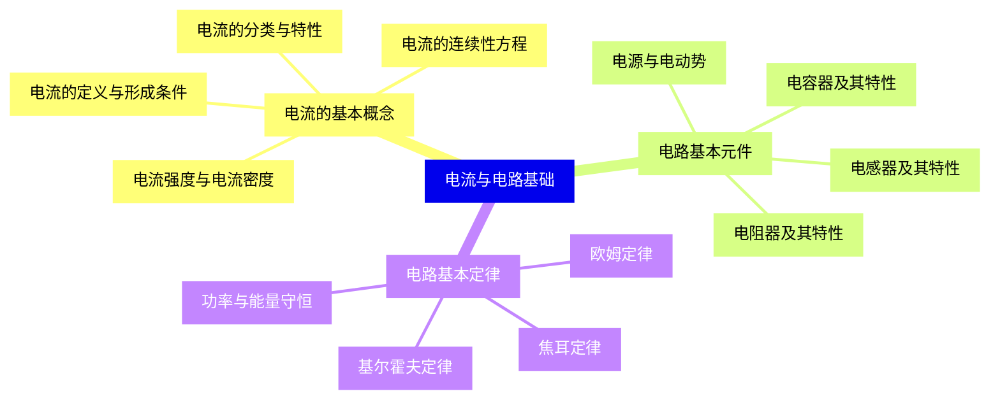
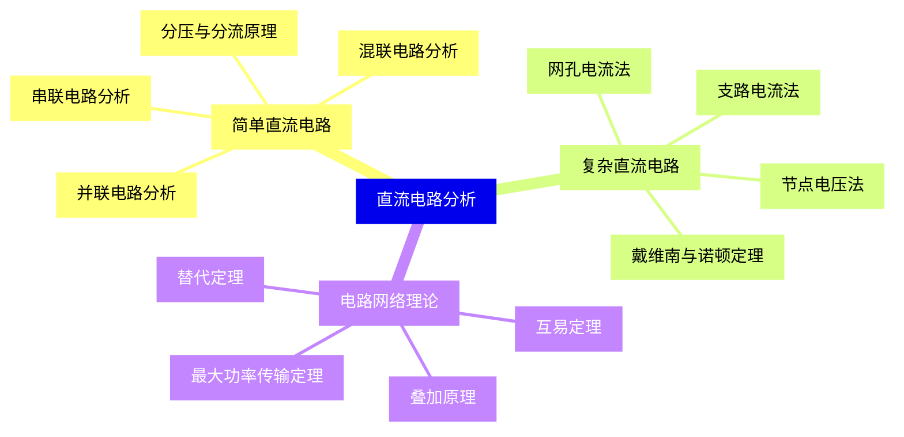
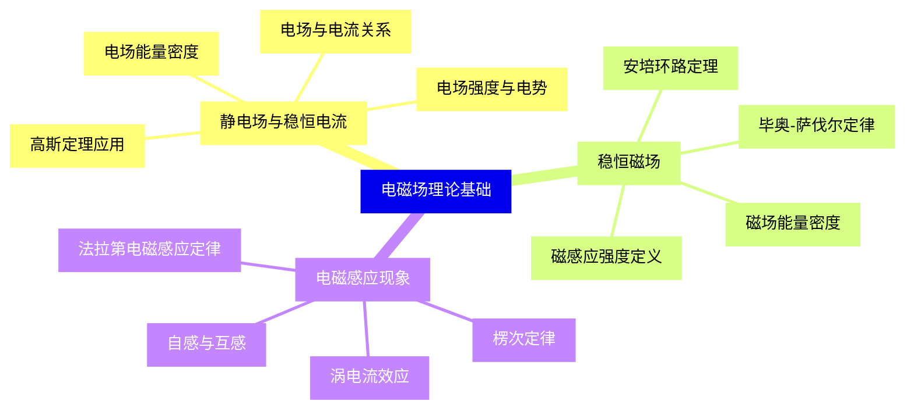
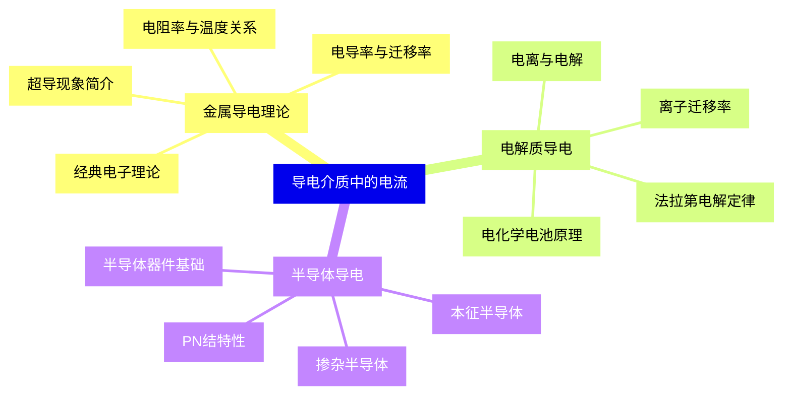
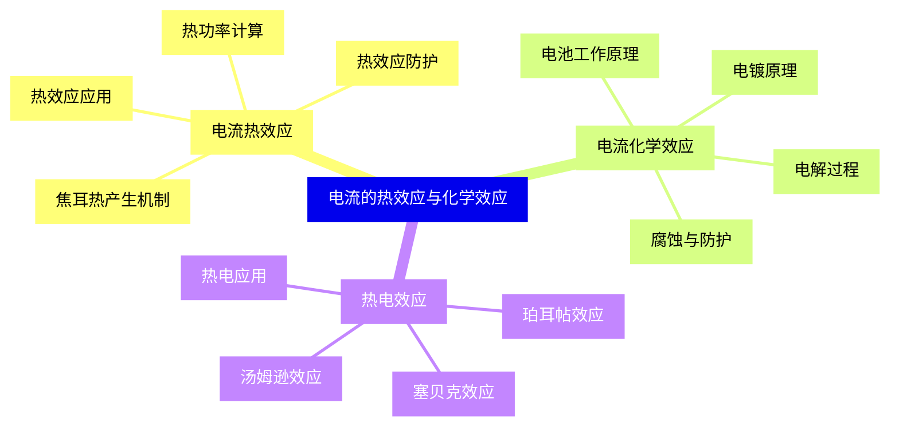
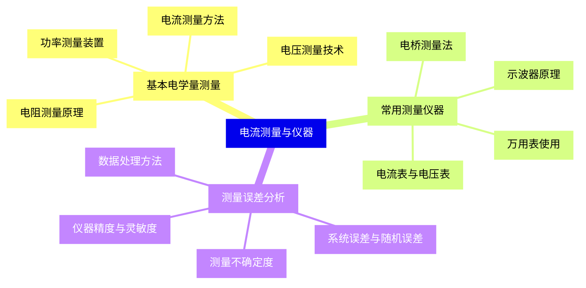
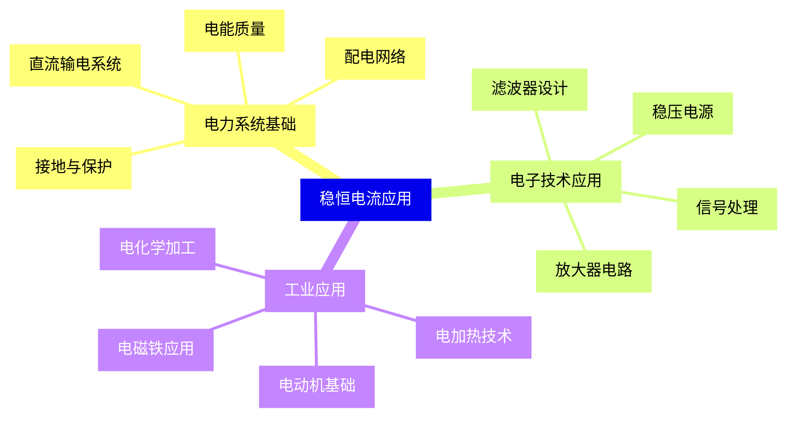
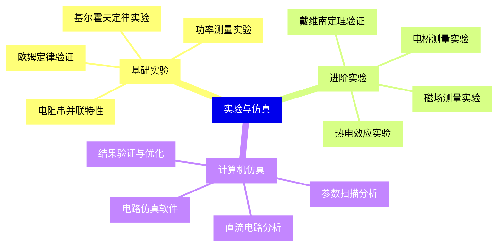


### 1 [电流与电路基础](#1)
#### 1.1 [电流的基本概念](#1)
##### 1.1.1 [电流的定义与形成条件](#1)
##### 1.1.2 [电流强度与电流密度](#1)
##### 1.1.3 [电流的连续性方程](#1)
##### 1.1.4 [电流的分类与特性](#1)
#### 1.2 [电路基本元件](#1)
##### 1.2.1 [电阻器及其特性](#1)
##### 1.2.2 [电容器及其特性](#1)
##### 1.2.3 [电感器及其特性](#1)
##### 1.2.4 [电源与电动势](#1)
#### 1.3 [电路基本定律](#1)
##### 1.3.1 [欧姆定律](#1)
##### 1.3.2 [基尔霍夫定律](#1)
##### 1.3.3 [焦耳定律](#1)
##### 1.3.4 [功率与能量守恒](#1)
### 2 [直流电路分析](#2)
#### 2.1 [简单直流电路](#2)
##### 2.1.1 [串联电路分析](#2)
##### 2.1.2 [并联电路分析](#2)
##### 2.1.3 [混联电路分析](#2)
##### 2.1.4 [分压与分流原理](#2)
#### 2.2 [复杂直流电路](#2)
##### 2.2.1 [支路电流法](#2)
##### 2.2.2 [网孔电流法](#2)
##### 2.2.3 [节点电压法](#2)
##### 2.2.4 [戴维南与诺顿定理](#2)
#### 2.3 [电路网络理论](#2)
##### 2.3.1 [叠加原理](#2)
##### 2.3.2 [互易定理](#2)
##### 2.3.3 [替代定理](#2)
##### 2.3.4 [最大功率传输定理](#2)
### 3 [电磁场理论基础](#3)
#### 3.1 [静电场与稳恒电流](#3)
##### 3.1.1 [电场强度与电势](#3)
##### 3.1.2 [高斯定理应用](#3)
##### 3.1.3 [电场能量密度](#3)
##### 3.1.4 [电场与电流关系](#3)
#### 3.2 [稳恒磁场](#3)
##### 3.2.1 [磁感应强度定义](#3)
##### 3.2.2 [毕奥-萨伐尔定律](#3)
##### 3.2.3 [安培环路定理](#3)
##### 3.2.4 [磁场能量密度](#3)
#### 3.3 [电磁感应现象](#3)
##### 3.3.1 [法拉第电磁感应定律](#3)
##### 3.3.2 [楞次定律](#3)
##### 3.3.3 [自感与互感](#3)
##### 3.3.4 [涡电流效应](#3)
### 4 [导电介质中的电流](#4)
#### 4.1 [金属导电理论](#4)
##### 4.1.1 [经典电子理论](#4)
##### 4.1.2 [电阻率与温度关系](#4)
##### 4.1.3 [电导率与迁移率](#4)
##### 4.1.4 [超导现象简介](#4)
#### 4.2 [电解质导电](#4)
##### 4.2.1 [电离与电解](#4)
##### 4.2.2 [法拉第电解定律](#4)
##### 4.2.3 [离子迁移率](#4)
##### 4.2.4 [电化学电池原理](#4)
#### 4.3 [半导体导电](#4)
##### 4.3.1 [本征半导体](#4)
##### 4.3.2 [掺杂半导体](#4)
##### 4.3.3 [PN结特性](#4)
##### 4.3.4 [半导体器件基础](#4)
### 5 [电流的热效应与化学效应](#5)
#### 5.1 [电流热效应](#5)
##### 5.1.1 [焦耳热产生机制](#5)
##### 5.1.2 [热功率计算](#5)
##### 5.1.3 [热效应应用](#5)
##### 5.1.4 [热效应防护](#5)
#### 5.2 [电流化学效应](#5)
##### 5.2.1 [电解过程](#5)
##### 5.2.2 [电镀原理](#5)
##### 5.2.3 [电池工作原理](#5)
##### 5.2.4 [腐蚀与防护](#5)
#### 5.3 [热电效应](#5)
##### 5.3.1 [塞贝克效应](#5)
##### 5.3.2 [珀耳帖效应](#5)
##### 5.3.3 [汤姆逊效应](#5)
##### 5.3.4 [热电应用](#5)
### 6 [电流测量与仪器](#6)
#### 6.1 [基本电学量测量](#6)
##### 6.1.1 [电流测量方法](#6)
##### 6.1.2 [电压测量技术](#6)
##### 6.1.3 [电阻测量原理](#6)
##### 6.1.4 [功率测量装置](#6)
#### 6.2 [常用测量仪器](#6)
##### 6.2.1 [电流表与电压表](#6)
##### 6.2.2 [万用表使用](#6)
##### 6.2.3 [示波器原理](#6)
##### 6.2.4 [电桥测量法](#6)
#### 6.3 [测量误差分析](#6)
##### 6.3.1 [系统误差与随机误差](#6)
##### 6.3.2 [仪器精度与灵敏度](#6)
##### 6.3.3 [测量不确定度](#6)
##### 6.3.4 [数据处理方法](#6)
### 7 [稳恒电流应用](#7)
#### 7.1 [电力系统基础](#7)
##### 7.1.1 [直流输电系统](#7)
##### 7.1.2 [配电网络](#7)
##### 7.1.3 [接地与保护](#7)
##### 7.1.4 [电能质量](#7)
#### 7.2 [电子技术应用](#7)
##### 7.2.1 [放大器电路](#7)
##### 7.2.2 [滤波器设计](#7)
##### 7.2.3 [稳压电源](#7)
##### 7.2.4 [信号处理](#7)
#### 7.3 [工业应用](#7)
##### 7.3.1 [电加热技术](#7)
##### 7.3.2 [电化学加工](#7)
##### 7.3.3 [电磁铁应用](#7)
##### 7.3.4 [电动机基础](#7)
### 8 [实验与仿真](#8)
#### 8.1 [基础实验](#8)
##### 8.1.1 [欧姆定律验证](#8)
##### 8.1.2 [基尔霍夫定律实验](#8)
##### 8.1.3 [电阻串并联特性](#8)
##### 8.1.4 [功率测量实验](#8)
#### 8.2 [进阶实验](#8)
##### 8.2.1 [戴维南定理验证](#8)
##### 8.2.2 [电桥测量实验](#8)
##### 8.2.3 [磁场测量实验](#8)
##### 8.2.4 [热电效应实验](#8)
#### 8.3 [计算机仿真](#8)
##### 8.3.1 [电路仿真软件](#8)
##### 8.3.2 [直流电路分析](#8)
##### 8.3.3 [参数扫描分析](#8)
##### 8.3.4 [结果验证与优化](#8)




### 1 电流与电路基础

---
### 1 电流与电路基础
___
#### 1.1 电流的基本概念
___
##### 1.1.1 电流的定义与形成条件
___
##### 1.1.2 电流强度与电流密度
___
##### 1.1.3 电流的连续性方程
___
##### 1.1.4 电流的分类与特性
___
#### 1.2 电路基本元件
___
##### 1.2.1 电阻器及其特性
___
##### 1.2.2 电容器及其特性
___
##### 1.2.3 电感器及其特性
___
##### 1.2.4 电源与电动势
___
#### 1.3 电路基本定律
___
##### 1.3.1 欧姆定律
___
##### 1.3.2 基尔霍夫定律
___
##### 1.3.3 焦耳定律
___
##### 1.3.4 功率与能量守恒
### 2 直流电路分析

---
### 2 直流电路分析
___
#### 2.1 简单直流电路
___
##### 2.1.1 串联电路分析
___
##### 2.1.2 并联电路分析
___
##### 2.1.3 混联电路分析
___
##### 2.1.4 分压与分流原理
___
#### 2.2 复杂直流电路
___
##### 2.2.1 支路电流法
___
##### 2.2.2 网孔电流法
___
##### 2.2.3 节点电压法
___
##### 2.2.4 戴维南与诺顿定理
___
#### 2.3 电路网络理论
___
##### 2.3.1 叠加原理
___
##### 2.3.2 互易定理
___
##### 2.3.3 替代定理
___
##### 2.3.4 最大功率传输定理
### 3 电磁场理论基础

---
### 3 电磁场理论基础
___
#### 3.1 静电场与稳恒电流
___
##### 3.1.1 电场强度与电势
___
##### 3.1.2 高斯定理应用
___
##### 3.1.3 电场能量密度
___
##### 3.1.4 电场与电流关系
___
#### 3.2 稳恒磁场
___
##### 3.2.1 磁感应强度定义
___
##### 3.2.2 毕奥-萨伐尔定律
___
##### 3.2.3 安培环路定理
___
##### 3.2.4 磁场能量密度
___
#### 3.3 电磁感应现象
___
##### 3.3.1 法拉第电磁感应定律
___
##### 3.3.2 楞次定律
___
##### 3.3.3 自感与互感
___
##### 3.3.4 涡电流效应
### 4 导电介质中的电流

---
### 4 导电介质中的电流
___
#### 4.1 金属导电理论
___
##### 4.1.1 经典电子理论
___
##### 4.1.2 电阻率与温度关系
___
##### 4.1.3 电导率与迁移率
___
##### 4.1.4 超导现象简介
___
#### 4.2 电解质导电
___
##### 4.2.1 电离与电解
___
##### 4.2.2 法拉第电解定律
___
##### 4.2.3 离子迁移率
___
##### 4.2.4 电化学电池原理
___
#### 4.3 半导体导电
___
##### 4.3.1 本征半导体
___
##### 4.3.2 掺杂半导体
___
##### 4.3.3 PN结特性
___
##### 4.3.4 半导体器件基础
### 5 电流的热效应与化学效应

---
### 5 电流的热效应与化学效应
___
#### 5.1 电流热效应
___
##### 5.1.1 焦耳热产生机制
___
##### 5.1.2 热功率计算
___
##### 5.1.3 热效应应用
___
##### 5.1.4 热效应防护
___
#### 5.2 电流化学效应
___
##### 5.2.1 电解过程
___
##### 5.2.2 电镀原理
___
##### 5.2.3 电池工作原理
___
##### 5.2.4 腐蚀与防护
___
#### 5.3 热电效应
___
##### 5.3.1 塞贝克效应
___
##### 5.3.2 珀耳帖效应
___
##### 5.3.3 汤姆逊效应
___
##### 5.3.4 热电应用
### 6 电流测量与仪器

---
### 6 电流测量与仪器
___
#### 6.1 基本电学量测量
___
##### 6.1.1 电流测量方法
___
##### 6.1.2 电压测量技术
___
##### 6.1.3 电阻测量原理
___
##### 6.1.4 功率测量装置
___
#### 6.2 常用测量仪器
___
##### 6.2.1 电流表与电压表
___
##### 6.2.2 万用表使用
___
##### 6.2.3 示波器原理
___
##### 6.2.4 电桥测量法
___
#### 6.3 测量误差分析
___
##### 6.3.1 系统误差与随机误差
___
##### 6.3.2 仪器精度与灵敏度
___
##### 6.3.3 测量不确定度
___
##### 6.3.4 数据处理方法
### 7 稳恒电流应用

---
### 7 稳恒电流应用
___
#### 7.1 电力系统基础
___
##### 7.1.1 直流输电系统
___
##### 7.1.2 配电网络
___
##### 7.1.3 接地与保护
___
##### 7.1.4 电能质量
___
#### 7.2 电子技术应用
___
##### 7.2.1 放大器电路
___
##### 7.2.2 滤波器设计
___
##### 7.2.3 稳压电源
___
##### 7.2.4 信号处理
___
#### 7.3 工业应用
___
##### 7.3.1 电加热技术
___
##### 7.3.2 电化学加工
___
##### 7.3.3 电磁铁应用
___
##### 7.3.4 电动机基础
### 8 实验与仿真

---
### 8 实验与仿真
___
#### 8.1 基础实验
___
##### 8.1.1 欧姆定律验证
___
##### 8.1.2 基尔霍夫定律实验
___
##### 8.1.3 电阻串并联特性
___
##### 8.1.4 功率测量实验
___
#### 8.2 进阶实验
___
##### 8.2.1 戴维南定理验证
___
##### 8.2.2 电桥测量实验
___
##### 8.2.3 磁场测量实验
___
##### 8.2.4 热电效应实验
___
#### 8.3 计算机仿真
___
##### 8.3.1 电路仿真软件
___
##### 8.3.2 直流电路分析
___
##### 8.3.3 参数扫描分析
___
##### 8.3.4 结果验证与优化


### 1 电流与电路基础{#1}

{}

<--->
{}
{}
{}
{}
{}
{}
{}
{}
{}
{}
{}
{}
{}
{}
{}
{}
{}
{}
{}
{}
{}
{}
{}
{}
{}
{}
{}
{}
{}
{}
{}

### 2 直流电路分析{#2}

{}
{}
{}
{}
{}
{}
{}
{}
{}
{}
{}
{}
{}
{}
{}
{}
{}
{}
{}
{}
{}
{}
{}
{}
{}
{}
{}
{}
{}
{}
{}
<--->

{}

### 3 电磁场理论基础{#3}

{}

<--->
{}
{}
{}
{}
{}
{}
{}
{}
{}
{}
{}
{}
{}
{}
{}
{}
{}
{}
{}
{}
{}
{}
{}
{}
{}
{}
{}
{}
{}
{}
{}

### 4 导电介质中的电流{#4}

{}
{}
{}
{}
{}
{}
{}
{}
{}
{}
{}
{}
{}
{}
{}
{}
{}
{}
{}
{}
{}
{}
{}
{}
{}
{}
{}
{}
{}
{}
{}
<--->

{}

### 5 电流的热效应与化学效应{#5}

{}

<--->
{}
{}
{}
{}
{}
{}
{}
{}
{}
{}
{}
{}
{}
{}
{}
{}
{}
{}
{}
{}
{}
{}
{}
{}
{}
{}
{}
{}
{}
{}
{}

### 6 电流测量与仪器{#6}

{}
{}
{}
{}
{}
{}
{}
{}
{}
{}
{}
{}
{}
{}
{}
{}
{}
{}
{}
{}
{}
{}
{}
{}
{}
{}
{}
{}
{}
{}
{}
<--->

{}

### 7 稳恒电流应用{#7}

{}

<--->
{}
{}
{}
{}
{}
{}
{}
{}
{}
{}
{}
{}
{}
{}
{}
{}
{}
{}
{}
{}
{}
{}
{}
{}
{}
{}
{}
{}
{}
{}
{}

### 8 实验与仿真{#8}

{}
{}
{}
{}
{}
{}
{}
{}
{}
{}
{}
{}
{}
{}
{}
{}
{}
{}
{}
{}
{}
{}
{}
{}
{}
{}
{}
{}
{}
{}
{}
<--->

{}
