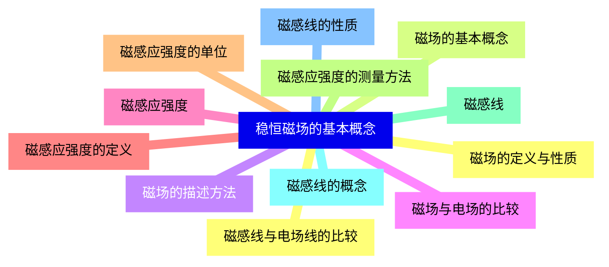
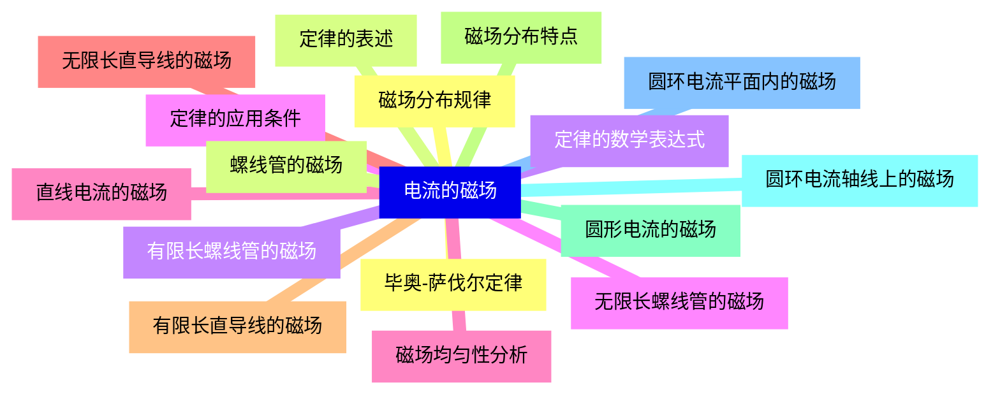
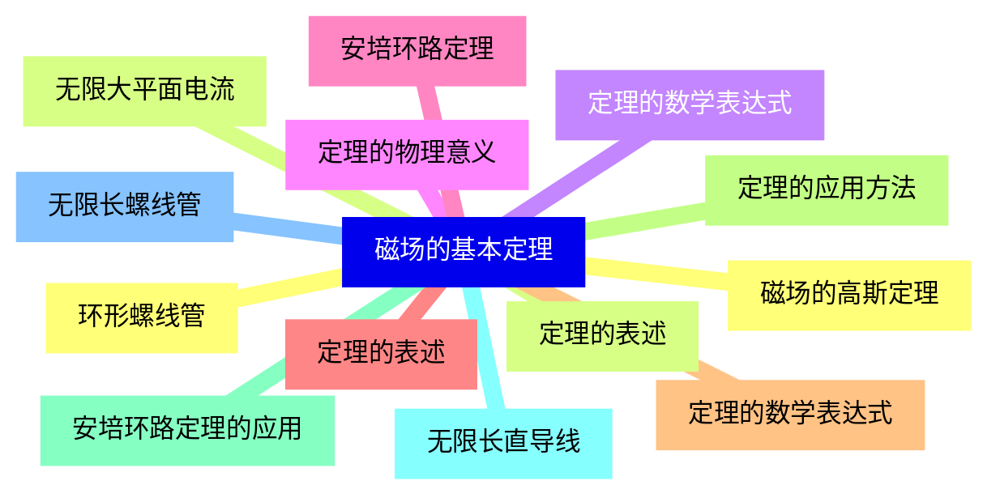
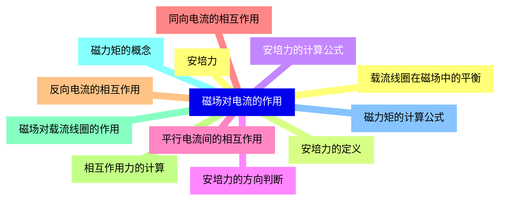
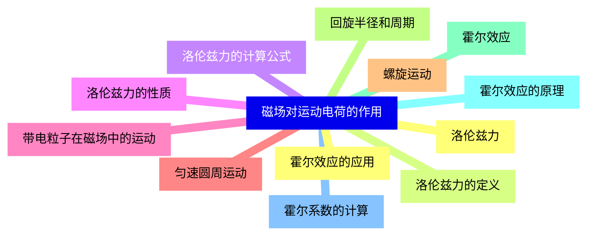
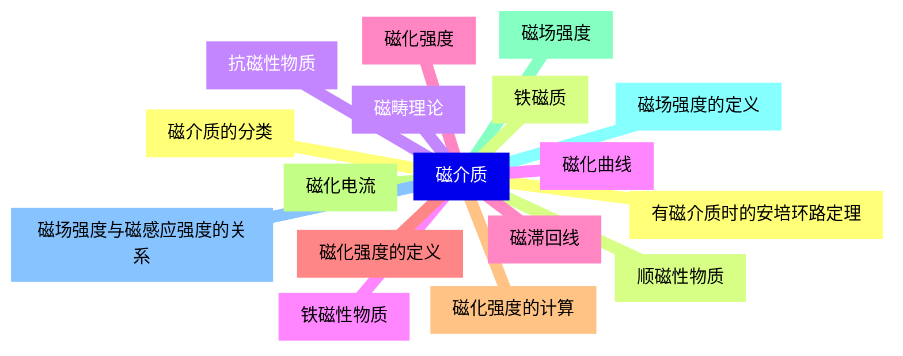
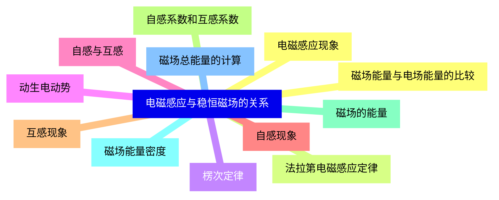
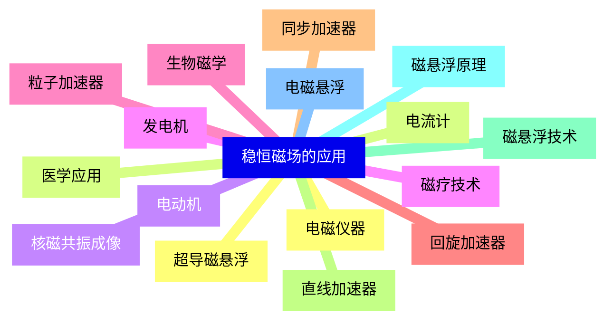


### 1 [稳恒磁场的基本概念](#1)
#### 1.1 [磁场的定义与性质](#1)
#### 1.2 [磁场的基本概念](#1)
#### 1.3 [磁场的描述方法](#1)
#### 1.4 [磁场与电场的比较](#1)
#### 1.5 [磁感应强度](#1)
#### 1.6 [磁感应强度的定义](#1)
#### 1.7 [磁感应强度的单位](#1)
#### 1.8 [磁感应强度的测量方法](#1)
#### 1.9 [磁感线](#1)
#### 1.10 [磁感线的概念](#1)
#### 1.11 [磁感线的性质](#1)
#### 1.12 [磁感线与电场线的比较](#1)
### 2 [电流的磁场](#2)
#### 2.1 [毕奥-萨伐尔定律](#2)
#### 2.2 [定律的表述](#2)
#### 2.3 [定律的数学表达式](#2)
#### 2.4 [定律的应用条件](#2)
#### 2.5 [直线电流的磁场](#2)
#### 2.6 [无限长直导线的磁场](#2)
#### 2.7 [有限长直导线的磁场](#2)
#### 2.8 [磁场分布特点](#2)
#### 2.9 [圆形电流的磁场](#2)
#### 2.10 [圆环电流轴线上的磁场](#2)
#### 2.11 [圆环电流平面内的磁场](#2)
#### 2.12 [磁场分布规律](#2)
#### 2.13 [螺线管的磁场](#2)
#### 2.14 [有限长螺线管的磁场](#2)
#### 2.15 [无限长螺线管的磁场](#2)
#### 2.16 [磁场均匀性分析](#2)
### 3 [磁场的基本定理](#3)
#### 3.1 [磁场的高斯定理](#3)
#### 3.2 [定理的表述](#3)
#### 3.3 [定理的数学表达式](#3)
#### 3.4 [定理的物理意义](#3)
#### 3.5 [安培环路定理](#3)
#### 3.6 [定理的表述](#3)
#### 3.7 [定理的数学表达式](#3)
#### 3.8 [定理的应用方法](#3)
#### 3.9 [安培环路定理的应用](#3)
#### 3.10 [无限长直导线](#3)
#### 3.11 [无限长螺线管](#3)
#### 3.12 [环形螺线管](#3)
#### 3.13 [无限大平面电流](#3)
### 4 [磁场对电流的作用](#4)
#### 4.1 [安培力](#4)
#### 4.2 [安培力的定义](#4)
#### 4.3 [安培力的计算公式](#4)
#### 4.4 [安培力的方向判断](#4)
#### 4.5 [平行电流间的相互作用](#4)
#### 4.6 [同向电流的相互作用](#4)
#### 4.7 [反向电流的相互作用](#4)
#### 4.8 [相互作用力的计算](#4)
#### 4.9 [磁场对载流线圈的作用](#4)
#### 4.10 [磁力矩的概念](#4)
#### 4.11 [磁力矩的计算公式](#4)
#### 4.12 [载流线圈在磁场中的平衡](#4)
### 5 [磁场对运动电荷的作用](#5)
#### 5.1 [洛伦兹力](#5)
#### 5.2 [洛伦兹力的定义](#5)
#### 5.3 [洛伦兹力的计算公式](#5)
#### 5.4 [洛伦兹力的性质](#5)
#### 5.5 [带电粒子在磁场中的运动](#5)
#### 5.6 [匀速圆周运动](#5)
#### 5.7 [螺旋运动](#5)
#### 5.8 [回旋半径和周期](#5)
#### 5.9 [霍尔效应](#5)
#### 5.10 [霍尔效应的原理](#5)
#### 5.11 [霍尔系数的计算](#5)
#### 5.12 [霍尔效应的应用](#5)
### 6 [磁介质](#6)
#### 6.1 [磁介质的分类](#6)
#### 6.2 [顺磁性物质](#6)
#### 6.3 [抗磁性物质](#6)
#### 6.4 [铁磁性物质](#6)
#### 6.5 [磁化强度](#6)
#### 6.6 [磁化强度的定义](#6)
#### 6.7 [磁化强度的计算](#6)
#### 6.8 [磁化电流](#6)
#### 6.9 [磁场强度](#6)
#### 6.10 [磁场强度的定义](#6)
#### 6.11 [磁场强度与磁感应强度的关系](#6)
#### 6.12 [有磁介质时的安培环路定理](#6)
#### 6.13 [铁磁质](#6)
#### 6.14 [磁畴理论](#6)
#### 6.15 [磁化曲线](#6)
#### 6.16 [磁滞回线](#6)
### 7 [电磁感应与稳恒磁场的关系](#7)
#### 7.1 [电磁感应现象](#7)
#### 7.2 [法拉第电磁感应定律](#7)
#### 7.3 [楞次定律](#7)
#### 7.4 [动生电动势](#7)
#### 7.5 [自感与互感](#7)
#### 7.6 [自感现象](#7)
#### 7.7 [互感现象](#7)
#### 7.8 [自感系数和互感系数](#7)
#### 7.9 [磁场的能量](#7)
#### 7.10 [磁场能量密度](#7)
#### 7.11 [磁场总能量的计算](#7)
#### 7.12 [磁场能量与电场能量的比较](#7)
### 8 [稳恒磁场的应用](#8)
#### 8.1 [电磁仪器](#8)
#### 8.2 [电流计](#8)
#### 8.3 [电动机](#8)
#### 8.4 [发电机](#8)
#### 8.5 [粒子加速器](#8)
#### 8.6 [回旋加速器](#8)
#### 8.7 [同步加速器](#8)
#### 8.8 [直线加速器](#8)
#### 8.9 [磁悬浮技术](#8)
#### 8.10 [磁悬浮原理](#8)
#### 8.11 [电磁悬浮](#8)
#### 8.12 [超导磁悬浮](#8)
#### 8.13 [医学应用](#8)
#### 8.14 [核磁共振成像](#8)
#### 8.15 [磁疗技术](#8)
#### 8.16 [生物磁学](#8)




### 1 稳恒磁场的基本概念

---
### 1 稳恒磁场的基本概念
___
#### 1.1 磁场的定义与性质
___
#### 1.2 磁场的基本概念
___
#### 1.3 磁场的描述方法
___
#### 1.4 磁场与电场的比较
___
#### 1.5 磁感应强度
___
#### 1.6 磁感应强度的定义
___
#### 1.7 磁感应强度的单位
___
#### 1.8 磁感应强度的测量方法
___
#### 1.9 磁感线
___
#### 1.10 磁感线的概念
___
#### 1.11 磁感线的性质
___
#### 1.12 磁感线与电场线的比较
### 2 电流的磁场

---
### 2 电流的磁场
___
#### 2.1 毕奥-萨伐尔定律
___
#### 2.2 定律的表述
___
#### 2.3 定律的数学表达式
___
#### 2.4 定律的应用条件
___
#### 2.5 直线电流的磁场
___
#### 2.6 无限长直导线的磁场
___
#### 2.7 有限长直导线的磁场
___
#### 2.8 磁场分布特点
___
#### 2.9 圆形电流的磁场
___
#### 2.10 圆环电流轴线上的磁场
___
#### 2.11 圆环电流平面内的磁场
___
#### 2.12 磁场分布规律
___
#### 2.13 螺线管的磁场
___
#### 2.14 有限长螺线管的磁场
___
#### 2.15 无限长螺线管的磁场
___
#### 2.16 磁场均匀性分析
### 3 磁场的基本定理

---
### 3 磁场的基本定理
___
#### 3.1 磁场的高斯定理
___
#### 3.2 定理的表述
___
#### 3.3 定理的数学表达式
___
#### 3.4 定理的物理意义
___
#### 3.5 安培环路定理
___
#### 3.6 定理的表述
___
#### 3.7 定理的数学表达式
___
#### 3.8 定理的应用方法
___
#### 3.9 安培环路定理的应用
___
#### 3.10 无限长直导线
___
#### 3.11 无限长螺线管
___
#### 3.12 环形螺线管
___
#### 3.13 无限大平面电流
### 4 磁场对电流的作用

---
### 4 磁场对电流的作用
___
#### 4.1 安培力
___
#### 4.2 安培力的定义
___
#### 4.3 安培力的计算公式
___
#### 4.4 安培力的方向判断
___
#### 4.5 平行电流间的相互作用
___
#### 4.6 同向电流的相互作用
___
#### 4.7 反向电流的相互作用
___
#### 4.8 相互作用力的计算
___
#### 4.9 磁场对载流线圈的作用
___
#### 4.10 磁力矩的概念
___
#### 4.11 磁力矩的计算公式
___
#### 4.12 载流线圈在磁场中的平衡
### 5 磁场对运动电荷的作用

---
### 5 磁场对运动电荷的作用
___
#### 5.1 洛伦兹力
___
#### 5.2 洛伦兹力的定义
___
#### 5.3 洛伦兹力的计算公式
___
#### 5.4 洛伦兹力的性质
___
#### 5.5 带电粒子在磁场中的运动
___
#### 5.6 匀速圆周运动
___
#### 5.7 螺旋运动
___
#### 5.8 回旋半径和周期
___
#### 5.9 霍尔效应
___
#### 5.10 霍尔效应的原理
___
#### 5.11 霍尔系数的计算
___
#### 5.12 霍尔效应的应用
### 6 磁介质

---
### 6 磁介质
___
#### 6.1 磁介质的分类
___
#### 6.2 顺磁性物质
___
#### 6.3 抗磁性物质
___
#### 6.4 铁磁性物质
___
#### 6.5 磁化强度
___
#### 6.6 磁化强度的定义
___
#### 6.7 磁化强度的计算
___
#### 6.8 磁化电流
___
#### 6.9 磁场强度
___
#### 6.10 磁场强度的定义
___
#### 6.11 磁场强度与磁感应强度的关系
___
#### 6.12 有磁介质时的安培环路定理
___
#### 6.13 铁磁质
___
#### 6.14 磁畴理论
___
#### 6.15 磁化曲线
___
#### 6.16 磁滞回线
### 7 电磁感应与稳恒磁场的关系

---
### 7 电磁感应与稳恒磁场的关系
___
#### 7.1 电磁感应现象
___
#### 7.2 法拉第电磁感应定律
___
#### 7.3 楞次定律
___
#### 7.4 动生电动势
___
#### 7.5 自感与互感
___
#### 7.6 自感现象
___
#### 7.7 互感现象
___
#### 7.8 自感系数和互感系数
___
#### 7.9 磁场的能量
___
#### 7.10 磁场能量密度
___
#### 7.11 磁场总能量的计算
___
#### 7.12 磁场能量与电场能量的比较
### 8 稳恒磁场的应用

---
### 8 稳恒磁场的应用
___
#### 8.1 电磁仪器
___
#### 8.2 电流计
___
#### 8.3 电动机
___
#### 8.4 发电机
___
#### 8.5 粒子加速器
___
#### 8.6 回旋加速器
___
#### 8.7 同步加速器
___
#### 8.8 直线加速器
___
#### 8.9 磁悬浮技术
___
#### 8.10 磁悬浮原理
___
#### 8.11 电磁悬浮
___
#### 8.12 超导磁悬浮
___
#### 8.13 医学应用
___
#### 8.14 核磁共振成像
___
#### 8.15 磁疗技术
___
#### 8.16 生物磁学


### 1 稳恒磁场的基本概念{#1}

{}

<--->
{}
{}
{}
{}
{}
{}
{}
{}
{}
{}
{}
{}
{}
{}
{}
{}
{}
{}
{}
{}
{}
{}
{}
{}
{}

### 2 电流的磁场{#2}

{}
{}
{}
{}
{}
{}
{}
{}
{}
{}
{}
{}
{}
{}
{}
{}
{}
{}
{}
{}
{}
{}
{}
{}
{}
{}
{}
{}
{}
{}
{}
{}
{}
<--->

{}

### 3 磁场的基本定理{#3}

{}

<--->
{}
{}
{}
{}
{}
{}
{}
{}
{}
{}
{}
{}
{}
{}
{}
{}
{}
{}
{}
{}
{}
{}
{}
{}
{}
{}
{}

### 4 磁场对电流的作用{#4}

{}
{}
{}
{}
{}
{}
{}
{}
{}
{}
{}
{}
{}
{}
{}
{}
{}
{}
{}
{}
{}
{}
{}
{}
{}
<--->

{}

### 5 磁场对运动电荷的作用{#5}

{}

<--->
{}
{}
{}
{}
{}
{}
{}
{}
{}
{}
{}
{}
{}
{}
{}
{}
{}
{}
{}
{}
{}
{}
{}
{}
{}

### 6 磁介质{#6}

{}
{}
{}
{}
{}
{}
{}
{}
{}
{}
{}
{}
{}
{}
{}
{}
{}
{}
{}
{}
{}
{}
{}
{}
{}
{}
{}
{}
{}
{}
{}
{}
{}
<--->

{}

### 7 电磁感应与稳恒磁场的关系{#7}

{}

<--->
{}
{}
{}
{}
{}
{}
{}
{}
{}
{}
{}
{}
{}
{}
{}
{}
{}
{}
{}
{}
{}
{}
{}
{}
{}

### 8 稳恒磁场的应用{#8}

{}
{}
{}
{}
{}
{}
{}
{}
{}
{}
{}
{}
{}
{}
{}
{}
{}
{}
{}
{}
{}
{}
{}
{}
{}
{}
{}
{}
{}
{}
{}
{}
{}
<--->

{}
