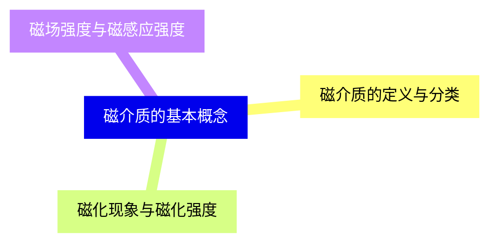
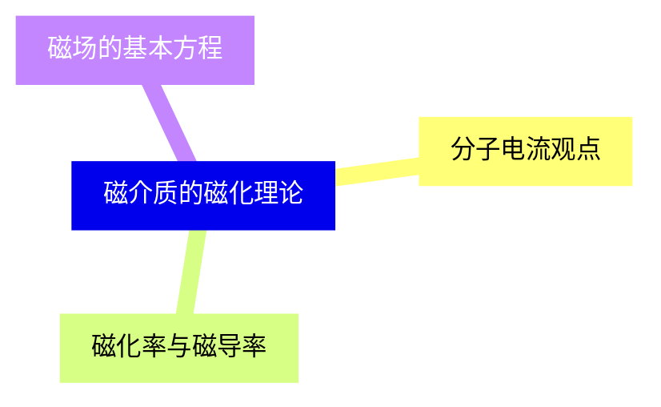
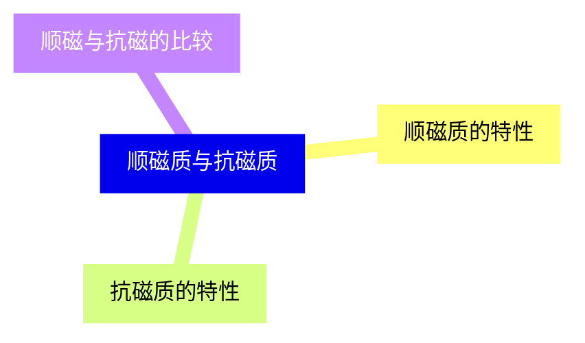
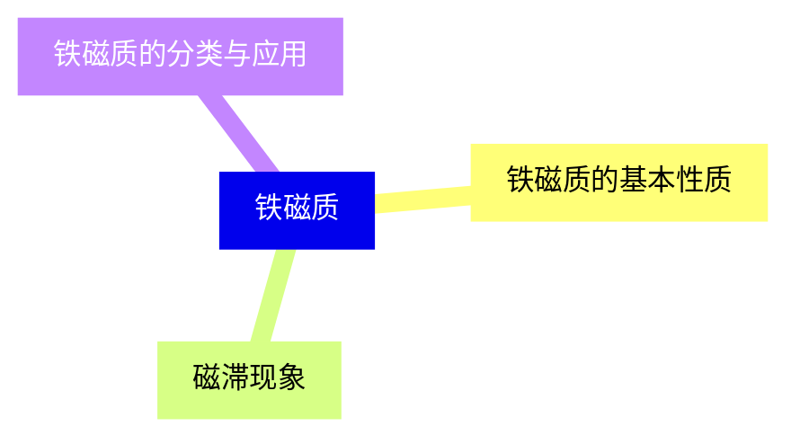
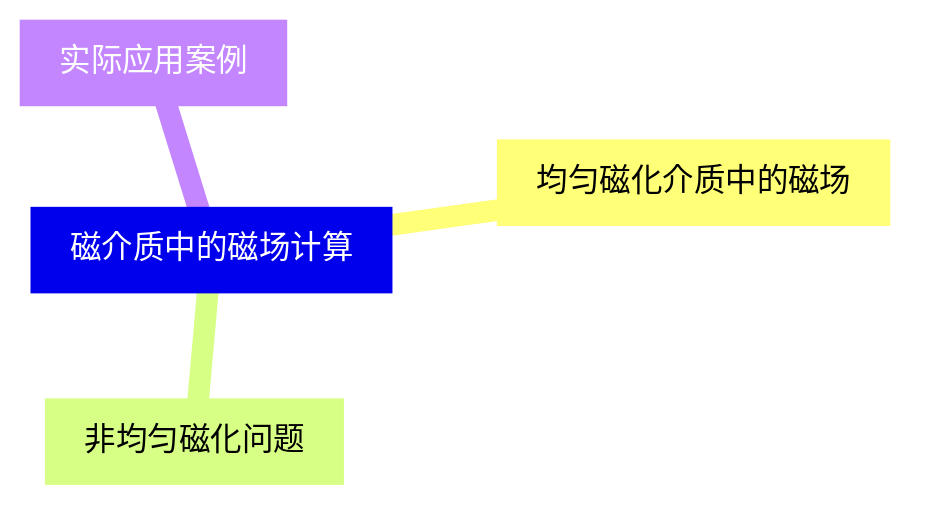
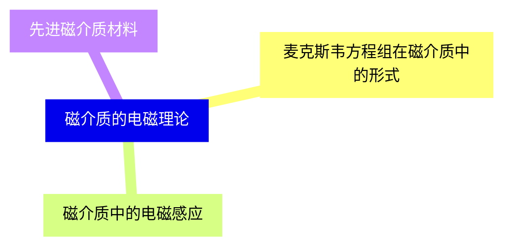
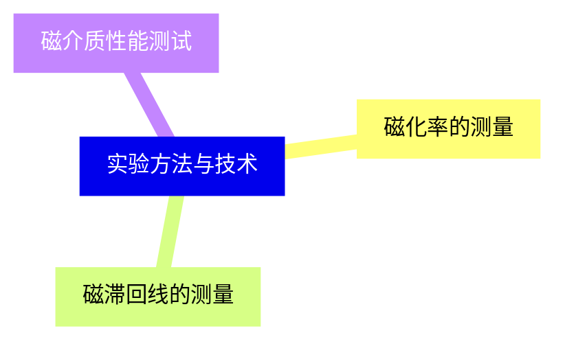
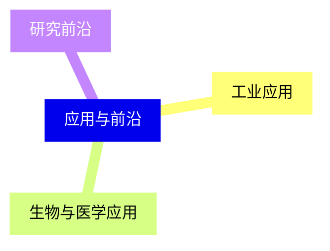


### 1 [磁介质的基本概念](#1)
#### 1.1 [磁介质的定义与分类](#1)
#### 1.2 [磁化现象与磁化强度](#1)
#### 1.3 [磁场强度与磁感应强度](#1)
### 2 [磁介质的磁化理论](#2)
#### 2.1 [分子电流观点](#2)
#### 2.2 [磁化率与磁导率](#2)
#### 2.3 [磁场的基本方程](#2)
### 3 [顺磁质与抗磁质](#3)
#### 3.1 [顺磁质的特性](#3)
#### 3.2 [抗磁质的特性](#3)
#### 3.3 [顺磁与抗磁的比较](#3)
### 4 [铁磁质](#4)
#### 4.1 [铁磁质的基本性质](#4)
#### 4.2 [磁滞现象](#4)
#### 4.3 [铁磁质的分类与应用](#4)
### 5 [磁介质中的磁场计算](#5)
#### 5.1 [均匀磁化介质中的磁场](#5)
#### 5.2 [非均匀磁化问题](#5)
#### 5.3 [实际应用案例](#5)
### 6 [磁介质的电磁理论](#6)
#### 6.1 [麦克斯韦方程组在磁介质中的形式](#6)
#### 6.2 [磁介质中的电磁感应](#6)
#### 6.3 [先进磁介质材料](#6)
### 7 [实验方法与技术](#7)
#### 7.1 [磁化率的测量](#7)
#### 7.2 [磁滞回线的测量](#7)
#### 7.3 [磁介质性能测试](#7)
### 8 [应用与前沿](#8)
#### 8.1 [工业应用](#8)
#### 8.2 [生物与医学应用](#8)
#### 8.3 [研究前沿](#8)




### 1 磁介质的基本概念
  - 1.1.1 磁介质的物理意义
  - 1.1.2 顺磁质、抗磁质和铁磁质的区分
  - 1.1.3 磁介质在磁场中的行为概述
  - 1.2.1 磁化的微观机制
  - 1.2.2 磁化强度的定义与计算
  - 1.2.3 磁化电流的产生与影响
  - 1.3.1 磁场强度的引入与意义
  - 1.3.2 磁感应强度在介质中的变化
  - 1.3.3 磁场强度与磁感应强度的关系

---
### 1 磁介质的基本概念
___
#### 1.1 磁介质的定义与分类
___
#### 1.2 磁化现象与磁化强度
___
#### 1.3 磁场强度与磁感应强度
### 2 磁介质的磁化理论
  - 2.1.1 安培分子电流假说
  - 2.1.2 分子磁矩与磁化关系
  - 2.1.3 磁化强度的微观解释
  - 2.2.1 磁化率的定义与测量
  - 2.2.2 相对磁导率与绝对磁导率
  - 2.2.3 不同磁介质的磁化率范围
  - 2.3.1 有磁介质时的高斯定理
  - 2.3.2 有磁介质时的安培环路定理
  - 2.3.3 边界条件与连续性方程

---
### 2 磁介质的磁化理论
___
#### 2.1 分子电流观点
___
#### 2.2 磁化率与磁导率
___
#### 2.3 磁场的基本方程
### 3 顺磁质与抗磁质
  - 3.1.1 顺磁质的微观结构
  - 3.1.2 顺磁质的磁化曲线
  - 3.1.3 典型顺磁质材料举例
  - 3.2.1 抗磁质的微观机制
  - 3.2.2 抗磁质的磁化行为
  - 3.2.3 典型抗磁质材料举例
  - 3.3.1 磁化率的正负与大小
  - 3.3.2 温度对磁化率的影响
  - 3.3.3 实际应用中的选择原则

---
### 3 顺磁质与抗磁质
___
#### 3.1 顺磁质的特性
___
#### 3.2 抗磁质的特性
___
#### 3.3 顺磁与抗磁的比较
### 4 铁磁质
  - 4.1.1 铁磁质的独特磁化特性
  - 4.1.2 饱和磁化与剩余磁化
  - 4.1.3 铁磁质的微观结构（磁畴理论）
  - 4.2.1 磁滞回线的形成
  - 4.2.2 矫顽力与剩磁
  - 4.2.3 磁滞损耗与能量关系
  - 4.3.1 软磁材料与硬磁材料
  - 4.3.2 铁磁质在电磁设备中的应用
  - 4.3.3 温度对铁磁性的影响（居里温度）

---
### 4 铁磁质
___
#### 4.1 铁磁质的基本性质
___
#### 4.2 磁滞现象
___
#### 4.3 铁磁质的分类与应用
### 5 磁介质中的磁场计算
  - 5.1.1 无限长圆柱形介质的磁场分布
  - 5.1.2 球形介质的磁场计算
  - 5.1.3 平板介质的磁场分析
  - 5.2.1 磁化强度的空间变化
  - 5.2.2 边界效应与场分布
  - 5.2.3 数值计算方法简介
  - 5.3.1 磁屏蔽原理与设计
  - 5.3.2 磁介质在变压器中的应用
  - 5.3.3 磁记录介质的工作原理

---
### 5 磁介质中的磁场计算
___
#### 5.1 均匀磁化介质中的磁场
___
#### 5.2 非均匀磁化问题
___
#### 5.3 实际应用案例
### 6 磁介质的电磁理论
  - 6.1.1 引入磁介质后的修正
  - 6.1.2 磁场能量的表达式
  - 6.1.3 电磁波在磁介质中的传播
  - 6.2.1 法拉第定律的应用
  - 6.2.2 自感与互感计算
  - 6.2.3 涡流效应与损耗
  - 6.3.1 超导体的磁性质
  - 6.3.2 纳米磁介质的研究进展
  - 6.3.3 多铁性材料简介

---
### 6 磁介质的电磁理论
___
#### 6.1 麦克斯韦方程组在磁介质中的形式
___
#### 6.2 磁介质中的电磁感应
___
#### 6.3 先进磁介质材料
### 7 实验方法与技术
  - 7.1.1 古埃天平法
  - 7.1.2 振动样品磁强计
  - 7.1.3 SQUID磁强计原理
  - 7.2.1 冲击电流计法
  - 7.2.2 电子积分器方法
  - 7.2.3 现代数字测量技术
  - 7.3.1 磁导率测量
  - 7.3.2 损耗测量技术
  - 7.3.3 温度依赖性实验

---
### 7 实验方法与技术
___
#### 7.1 磁化率的测量
___
#### 7.2 磁滞回线的测量
___
#### 7.3 磁介质性能测试
### 8 应用与前沿
  - 8.1.1 电机与发电机中的磁介质
  - 8.1.2 磁存储技术
  - 8.1.3 磁传感器与磁头
  - 8.2.1 核磁共振成像
  - 8.2.2 磁性药物靶向
  - 8.2.3 生物磁学简介
  - 8.3.1 自旋电子学
  - 8.3.2 磁制冷技术
  - 8.3.3 未来材料发展趋势

---
### 8 应用与前沿
___
#### 8.1 工业应用
___
#### 8.2 生物与医学应用
___
#### 8.3 研究前沿


### 1 磁介质的基本概念{#1}
  - 1.1.1 磁介质的物理意义
  - 1.1.2 顺磁质、抗磁质和铁磁质的区分
  - 1.1.3 磁介质在磁场中的行为概述
  - 1.2.1 磁化的微观机制
  - 1.2.2 磁化强度的定义与计算
  - 1.2.3 磁化电流的产生与影响
  - 1.3.1 磁场强度的引入与意义
  - 1.3.2 磁感应强度在介质中的变化
  - 1.3.3 磁场强度与磁感应强度的关系

{}

<--->
{}
{}
{}
{}
{}
{}
{}

### 2 磁介质的磁化理论{#2}
  - 2.1.1 安培分子电流假说
  - 2.1.2 分子磁矩与磁化关系
  - 2.1.3 磁化强度的微观解释
  - 2.2.1 磁化率的定义与测量
  - 2.2.2 相对磁导率与绝对磁导率
  - 2.2.3 不同磁介质的磁化率范围
  - 2.3.1 有磁介质时的高斯定理
  - 2.3.2 有磁介质时的安培环路定理
  - 2.3.3 边界条件与连续性方程

{}
{}
{}
{}
{}
{}
{}
<--->

{}

### 3 顺磁质与抗磁质{#3}
  - 3.1.1 顺磁质的微观结构
  - 3.1.2 顺磁质的磁化曲线
  - 3.1.3 典型顺磁质材料举例
  - 3.2.1 抗磁质的微观机制
  - 3.2.2 抗磁质的磁化行为
  - 3.2.3 典型抗磁质材料举例
  - 3.3.1 磁化率的正负与大小
  - 3.3.2 温度对磁化率的影响
  - 3.3.3 实际应用中的选择原则

{}

<--->
{}
{}
{}
{}
{}
{}
{}

### 4 铁磁质{#4}
  - 4.1.1 铁磁质的独特磁化特性
  - 4.1.2 饱和磁化与剩余磁化
  - 4.1.3 铁磁质的微观结构（磁畴理论）
  - 4.2.1 磁滞回线的形成
  - 4.2.2 矫顽力与剩磁
  - 4.2.3 磁滞损耗与能量关系
  - 4.3.1 软磁材料与硬磁材料
  - 4.3.2 铁磁质在电磁设备中的应用
  - 4.3.3 温度对铁磁性的影响（居里温度）

{}
{}
{}
{}
{}
{}
{}
<--->

{}

### 5 磁介质中的磁场计算{#5}
  - 5.1.1 无限长圆柱形介质的磁场分布
  - 5.1.2 球形介质的磁场计算
  - 5.1.3 平板介质的磁场分析
  - 5.2.1 磁化强度的空间变化
  - 5.2.2 边界效应与场分布
  - 5.2.3 数值计算方法简介
  - 5.3.1 磁屏蔽原理与设计
  - 5.3.2 磁介质在变压器中的应用
  - 5.3.3 磁记录介质的工作原理

{}

<--->
{}
{}
{}
{}
{}
{}
{}

### 6 磁介质的电磁理论{#6}
  - 6.1.1 引入磁介质后的修正
  - 6.1.2 磁场能量的表达式
  - 6.1.3 电磁波在磁介质中的传播
  - 6.2.1 法拉第定律的应用
  - 6.2.2 自感与互感计算
  - 6.2.3 涡流效应与损耗
  - 6.3.1 超导体的磁性质
  - 6.3.2 纳米磁介质的研究进展
  - 6.3.3 多铁性材料简介

{}
{}
{}
{}
{}
{}
{}
<--->

{}

### 7 实验方法与技术{#7}
  - 7.1.1 古埃天平法
  - 7.1.2 振动样品磁强计
  - 7.1.3 SQUID磁强计原理
  - 7.2.1 冲击电流计法
  - 7.2.2 电子积分器方法
  - 7.2.3 现代数字测量技术
  - 7.3.1 磁导率测量
  - 7.3.2 损耗测量技术
  - 7.3.3 温度依赖性实验

{}

<--->
{}
{}
{}
{}
{}
{}
{}

### 8 应用与前沿{#8}
  - 8.1.1 电机与发电机中的磁介质
  - 8.1.2 磁存储技术
  - 8.1.3 磁传感器与磁头
  - 8.2.1 核磁共振成像
  - 8.2.2 磁性药物靶向
  - 8.2.3 生物磁学简介
  - 8.3.1 自旋电子学
  - 8.3.2 磁制冷技术
  - 8.3.3 未来材料发展趋势

{}
{}
{}
{}
{}
{}
{}
<--->

{}
